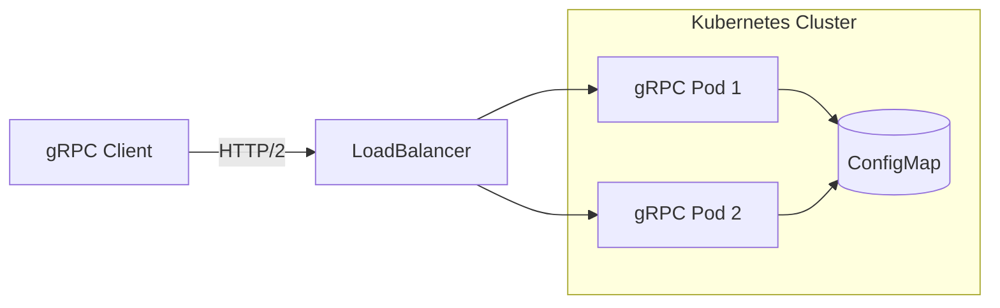

# ☸️ Microservice with gRPC and Kubernetes

## Overview

Production ML inference rarely lives in a single process. gRPC is the standard for high-performance inter-service communication, and Kubernetes is the standard for orchestration. This project demonstrates that you can design, build, and deploy a distributed ML system. It is a strong supporting project because infrastructure skills dramatically increase your market value.

## Prerequisites

- Go 1.22 or later installed
- protoc and the Go plugins installed
- Docker and a local Kubernetes cluster (kind or minikube)
- kubectl and Helm 3 installed

## Learning Objectives

1. Define service contracts with Protocol Buffers
2. Implement a gRPC server and client in Go
3. Containerize a Go gRPC service
4. Deploy to Kubernetes with a Helm chart

## Official Resources & Links

| Resource | Type | URL | Why It Matters |
|----------|------|-----|----------------|
| gRPC Go | Docs | https://github.com/grpc/grpc-go | Official Go implementation of gRPC |
| Kubernetes Documentation | Docs | https://kubernetes.io/docs/ | Industry standard for container orchestration |
| Helm | Docs | https://helm.sh/docs/ | Package manager for Kubernetes |
| Protocol Buffers | Docs | https://protobuf.dev/programming-guides/proto3/ | Schema definition language for gRPC |
| kind | Repo | https://kind.sigs.k8s.io/ | Run local Kubernetes clusters in Docker |

## Architecture & Planning

### K8s Deployment Architecture



### Key Decisions

- Use a `.proto` file to enforce a strict API contract
- Use a Kubernetes Deployment with 2 replicas for availability
- Expose the service via a LoadBalancer on port 50051

## Step-by-Step Implementation Guide

1. **Define the protobuf.** Create `inference.proto` with a `Predict` RPC that accepts features and returns a label.

2. **Generate Go code.** Run `protoc --go_out=. --go-grpc_out=. inference.proto`.

3. **Implement the server.** Create a `server.go` that registers the generated service and implements `Predict`.

4. **Implement the client.** Create a `client.go` that dials the server and invokes `Predict` with test data.

5. **Write a Dockerfile.** Use a multi-stage build to compile a static binary and copy it into a `scratch` image.

6. **Write a Kubernetes Deployment.** Set 2 replicas, resource limits, and a liveness probe on the gRPC health port.

7. **Write a Kubernetes Service.** Use `type: LoadBalancer` and expose port 50051.

8. **Package with Helm.** Create a chart with `values.yaml`, templates for Deployment and Service, and helpers.

9. **Deploy locally.** Use `kind` to create a cluster, load the Docker image, and apply the Helm chart.

10. **Test end-to-end.** Run the client inside the cluster or port-forward to localhost.

## Guide Class / Example

Below are complete, copy-pasteable artifacts for the service.

### `inference.proto`

```protobuf
syntax = "proto3";

package inference;

option go_package = "github.com/yourusername/go-grpc-ml/inference";

service InferenceService {
  rpc Predict(PredictRequest) returns (PredictResponse);
}

message PredictRequest {
  repeated float features = 1;
}

message PredictResponse {
  string label = 1;
  float confidence = 2;
}
```

### `server.go`

```go
package main

import (
	"context"
	"log"
	"net"

	pb "github.com/yourusername/go-grpc-ml/inference"
	"google.golang.org/grpc"
)

type server struct {
	pb.UnimplementedInferenceServiceServer
}

func (s *server) Predict(ctx context.Context, req *pb.PredictRequest) (*pb.PredictResponse, error) {
	return &pb.PredictResponse{
		Label:      "positive",
		Confidence: 0.97,
	}, nil
}

func main() {
	lis, err := net.Listen("tcp", ":50051")
	if err != nil {
		log.Fatalf("failed to listen: %v", err)
	}
	s := grpc.NewServer()
	pb.RegisterInferenceServiceServer(s, &server{})
	log.Println("gRPC server listening on :50051")
	if err := s.Serve(lis); err != nil {
		log.Fatalf("failed to serve: %v", err)
	}
}
```

### `deployment.yaml`

```yaml
apiVersion: apps/v1
kind: Deployment
metadata:
  name: inference-service
spec:
  replicas: 2
  selector:
    matchLabels:
      app: inference-service
  template:
    metadata:
      labels:
        app: inference-service
    spec:
      containers:
        - name: inference
          image: inference-service:latest
          ports:
            - containerPort: 50051
          resources:
            limits:
              memory: "256Mi"
              cpu: "500m"
---
apiVersion: v1
kind: Service
metadata:
  name: inference-service
spec:
  selector:
    app: inference-service
  ports:
    - port: 50051
      targetPort: 50051
  type: LoadBalancer
```

## Common Pitfalls & Checklist

⚠️ **Forgetting to embed `UnimplementedInferenceServiceServer`:** The generated Go code requires this embedding for forward compatibility. Without it, compilation fails.

⚠️ **Using HTTP/1.1 load balancers:** gRPC requires HTTP/2. Make sure your Kubernetes Service or ingress supports HTTP/2, or use a gRPC-aware proxy like Envoy.

⚠️ **Missing health checks:** Kubernetes cannot tell if a gRPC server is ready. Add a gRPC health probe or a simple HTTP health endpoint on a secondary port.

✅ Checklist

| Checkpoint | Status |
|------------|--------|
| `.proto` file compiles without errors | [ ] |
| Server responds to `Predict` RPC | [ ] |
| Client connects and prints a response | [ ] |
| Docker image builds and runs | [ ] |
| Kubernetes Deployment has 2 replicas | [ ] |
| Service exposes port 50051 | [ ] |
| Helm chart deploys with `helm install` | [ ] |

## Deployment & Portfolio Integration

Push the Docker image to GitHub Container Registry or Docker Hub. Host the Helm chart in your repo. On your resume, list this under "Infrastructure & Distributed Systems" and mention gRPC, Kubernetes, and Helm.

## Next Steps

- [[00 - Go Project Planning Guide]]
- [[02 - CLI Tool with Cobra]]
- [[04 - Local RAG System with Go]]
- [[05 - ML Serving Gateway]]
