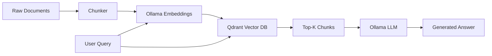

# 🔍 Local RAG System with Go

## Overview

Retrieval-Augmented Generation (RAG) is the most common production pattern for applying LLMs to private data. Building one from scratch in Go proves you understand embeddings, vector search, and orchestration. This is an ideal flagship project because it spans data engineering, backend development, and AI integration.

## Prerequisites

- Go 1.22 or later installed
- Ollama running locally with an embedding model (`nomic-embed-text`) and a chat model (`llama3`)
- Qdrant running locally via Docker (`docker run -p 6333:6333 qdrant/qdrant`)
- Familiarity with JSON and HTTP clients

## Learning Objectives

1. Chunk raw documents into searchable pieces
2. Generate embeddings via Ollama and store them in Qdrant
3. Perform similarity search to retrieve relevant chunks
4. Feed retrieved context into an LLM prompt for generation

## Official Resources & Links

| Resource | Type | URL | Why It Matters |
|----------|------|-----|----------------|
| Ollama | Docs | https://github.com/ollama/ollama | Local LLM and embedding inference |
| Qdrant Go Client | Docs | https://github.com/qdrant/go-client | Official Go SDK for the vector database |
| Qdrant Documentation | Docs | https://qdrant.tech/documentation/ | Concepts for collections, points, and search |
| godotenv | Repo | https://github.com/joho/godotenv | Manage Ollama and Qdrant connection strings |
| Go strings package | Docs | https://pkg.go.dev/strings | Native chunking and text manipulation |

## Architecture & Planning

### RAG System Architecture



### Key Decisions

- Use a simple recursive chunker instead of a heavy NLP library to keep dependencies minimal
- Store both the embedding vector and the original text payload in Qdrant
- Use a single collection for all documents to simplify search

## Step-by-Step Implementation Guide

1. **Initialize the module.** Run `go mod init github.com/yourusername/go-local-rag`.

2. **Install dependencies.** Run `go get -u github.com/qdrant/go-client github.com/joho/godotenv google.golang.org/grpc`.

3. **Implement the chunker.** Split documents by paragraphs or fixed token windows. Keep overlap to preserve context across boundaries.

4. **Implement the embedder.** Send chunks to Ollama's `/api/embeddings` endpoint and collect the float slices.

5. **Create a Qdrant collection.** Define the vector size (e.g., 768 for `nomic-embed-text`) and distance metric (Cosine).

6. **Upsert chunks as points.** Store the vector and the raw text in the payload so you can retrieve it later.

7. **Implement search.** Convert the user query to an embedding, query Qdrant with `SearchPoints`, and extract the top 3 chunks.

8. **Build the prompt.** Concatenate the retrieved chunks into a context block and ask the LLM to answer based only on that context.

9. **Add a CLI or simple HTTP interface.** Let the user pass a query and print the answer.

10. **Write integration tests.** Use a temporary Qdrant collection and assert that ingestion and search return consistent results.

## Guide Class / Example

Below is a complete, copy-pasteable pipeline.

```go
package main

import (
	"bytes"
	"context"
	"encoding/json"
	"fmt"
	"io"
	"net/http"
	"os"
	"strings"
	"time"

	"github.com/joho/godotenv"
	"github.com/qdrant/go-client/qdrant"
	"google.golang.org/grpc"
	"google.golang.org/grpc/credentials/insecure"
)

var (
	ollamaHost string
	qdrantHost string
)

func init() {
	_ = godotenv.Load()
	ollamaHost = getEnv("OLLAMA_HOST", "http://localhost:11434")
	qdrantHost = getEnv("QDRANT_HOST", "localhost:6334")
}

func getEnv(key, fallback string) string {
	if v := os.Getenv(key); v != "" {
		return v
	}
	return fallback
}

func chunkText(text string, size int) []string {
	var chunks []string
	words := strings.Fields(text)
	for i := 0; i < len(words); i += size {
		end := i + size
		if end > len(words) {
			end = len(words)
		}
		chunks = append(chunks, strings.Join(words[i:end], " "))
	}
	return chunks
}

func getEmbedding(text string) ([]float32, error) {
	reqBody, _ := json.Marshal(map[string]string{
		"model": "nomic-embed-text",
		"prompt": text,
	})
	resp, err := http.Post(ollamaHost+"/api/embeddings", "application/json", bytes.NewReader(reqBody))
	if err != nil {
		return nil, err
	}
	defer resp.Body.Close()

	var result struct {
		Embedding []float32 `json:"embedding"`
	}
	if err := json.NewDecoder(resp.Body).Decode(&result); err != nil {
		return nil, err
	}
	return result.Embedding, nil
}

func main() {
	ctx := context.Background()

	conn, err := grpc.Dial(qdrantHost, grpc.WithTransportCredentials(insecure.NewCredentials()))
	if err != nil {
		panic(err)
	}
	defer conn.Close()

	client := qdrant.NewCollectionsClient(conn)
	pointsClient := qdrant.NewPointsClient(conn)

	collectionName := "rag_docs"
	client.DeleteCollection(ctx, &qdrant.DeleteCollection{CollectionName: collectionName})
	client.CreateCollection(ctx, &qdrant.CreateCollection{
		CollectionName: collectionName,
		VectorsConfig: &qdrant.VectorsConfig{
			Config: &qdrant.VectorsConfig_Params{
				Params: &qdrant.VectorParams{
					Size:     768,
					Distance: qdrant.Distance_Cosine,
				},
			},
		},
	})

	doc := "Go is a statically typed, compiled programming language. Go is syntactically similar to C. Go was designed at Google."
	chunks := chunkText(doc, 10)

	for i, chunk := range chunks {
		vec, err := getEmbedding(chunk)
		if err != nil {
			panic(err)
		}
		_, err = pointsClient.Upsert(ctx, &qdrant.UpsertPoints{
			CollectionName: collectionName,
			Points: []*qdrant.PointStruct{
				{
					Id:      &qdrant.PointId{PointIdOptions: &qdrant.PointId_Num{Num: uint64(i)}},
					Vectors: &qdrant.Vectors{VectorsOptions: &qdrant.Vectors_Vector{Vector: &qdrant.VectorData{Data: vec}}},
					Payload: map[string]*qdrant.Value{
						"text": {Kind: &qdrant.Value_StringValue{StringValue: chunk}},
					},
				},
			},
		})
		if err != nil {
			panic(err)
		}
	}

	query := "Who designed Go?"
	qVec, err := getEmbedding(query)
	if err != nil {
		panic(err)
	}

	searchResult, err := pointsClient.Search(ctx, &qdrant.SearchPoints{
		CollectionName: collectionName,
		Vector:         qVec,
		Limit:          3,
		WithPayload:    &qdrant.WithPayloadSelector{SelectorOptions: &qdrant.WithPayloadSelector_Enable{Enable: true}},
	})
	if err != nil {
		panic(err)
	}

	var contextParts []string
	for _, hit := range searchResult.Result {
		contextParts = append(contextParts, hit.Payload["text"].GetStringValue())
	}
	contextText := strings.Join(contextParts, "\n")

	prompt := fmt.Sprintf("Context:\n%s\n\nQuestion: %s\nAnswer:", contextText, query)
	chatReq, _ := json.Marshal(map[string]interface{}{
		"model": "llama3",
		"messages": []map[string]string{
			{"role": "user", "content": prompt},
		},
		"stream": false,
	})

	resp, err := http.Post(ollamaHost+"/api/chat", "application/json", bytes.NewReader(chatReq))
	if err != nil {
		panic(err)
	}
	defer resp.Body.Close()

	body, _ := io.ReadAll(resp.Body)
	fmt.Println("Answer:")
	fmt.Println(string(body))
}
```

## Common Pitfalls & Checklist

⚠️ **Wrong vector size:** If the embedding dimension in Qdrant does not match the model output, upsert will fail. Always verify the model specs.

⚠️ **No payload in points:** If you store only vectors without the original text, you cannot show the retrieved context to the LLM.

⚠️ **Blocking on Ollama:** Embedding many chunks sequentially is slow. Use goroutines and a `sync.WaitGroup` to parallelize requests.

✅ Checklist

| Checkpoint | Status |
|------------|--------|
| Documents are chunked with reasonable overlap | [ ] |
| Embeddings match the model's output dimensions | [ ] |
| Qdrant collection uses the correct distance metric | [ ] |
| Search returns the most relevant chunks | [ ] |
| LLM answer is grounded in retrieved context | [ ] |
| Integration test runs end-to-end | [ ] |

## Deployment & Portfolio Integration

Containerize Ollama, Qdrant, and your Go service with Docker Compose. Add a `docker-compose.yml` so recruiters can run the entire RAG stack with one command. On your resume, label this as "Flagship Project: Local RAG Pipeline in Go."

## Next Steps

- [[00 - Go Project Planning Guide]]
- [[01 - Gin API with Ollama Integration]]
- [[03 - Microservice with gRPC and Kubernetes]]
- [[05 - ML Serving Gateway]]
