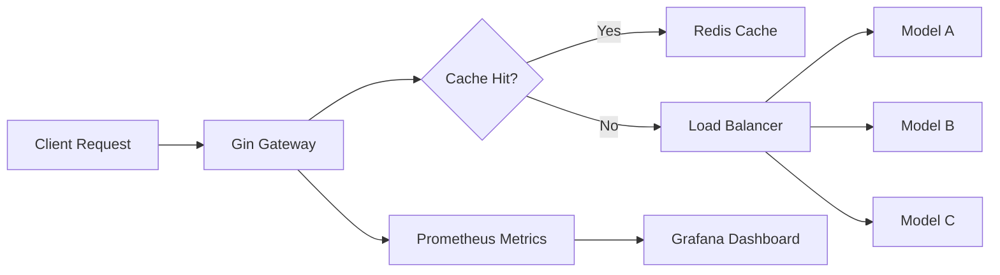

# 🚪 ML Serving Gateway

## Overview

As organizations deploy multiple models, they need a single entry point for routing, caching, and observability. An ML Serving Gateway is a systems-design project that shows you think at the infrastructure layer. It is a strong supporting project because it combines networking, caching, and metrics—skills that hiring managers deeply value for platform ML roles.

## Prerequisites

- Go 1.22 or later installed
- Redis running locally (`docker run -p 6379:6379 redis:alpine`)
- Prometheus and Grafana running locally or via Docker Compose
- Basic understanding of reverse proxies and load balancing

## Learning Objectives

1. Build a reverse proxy in Go that routes to multiple model backends
2. Implement round-robin load balancing across backend instances
3. Cache frequent requests in Redis to reduce inference cost
4. Expose Prometheus metrics for latency, throughput, and errors

## Official Resources & Links

| Resource | Type | URL | Why It Matters |
|----------|------|-----|----------------|
| Gin Web Framework | Docs | https://gin-gonic.com/docs/ | Fast HTTP framework for the gateway surface |
| Redis Go Client | Docs | https://github.com/redis/go-redis | Official Go client for caching |
| Prometheus Go Client | Docs | https://github.com/prometheus/client_golang | Instrumentation for production observability |
| Grafana | Docs | https://grafana.com/docs/ | Visualization layer for metrics |
| Go ReverseProxy | Docs | https://pkg.go.dev/net/http/httputil | Standard library reverse proxy implementation |

## Architecture & Planning

### Gateway Architecture



### Key Decisions

- Use `httputil.ReverseProxy` for routing to avoid reinventing HTTP semantics
- Use Redis with TTL to cache deterministic inference results
- Use Prometheus counters and histograms for request duration and status codes

## Step-by-Step Implementation Guide

1. **Initialize the module.** Run `go mod init github.com/yourusername/go-ml-gateway`.

2. **Install dependencies.** Run `go get -u github.com/gin-gonic/gin github.com/redis/go-redis/v9 github.com/prometheus/client_golang/prometheus github.com/prometheus/client_golang/prometheus/promhttp`.

3. **Define backends.** Create a config slice of model URLs. Track an index for round-robin selection.

4. **Build the reverse proxy handler.** For each incoming request, select the next backend, clone the request, and proxy it.

5. **Add caching middleware.** Hash the request body. Check Redis before proxying. Store the response body in Redis with a 60-second TTL.

6. **Instrument with Prometheus.** Measure total requests, request duration, and backend-specific error rates.

7. **Expose a metrics endpoint.** Mount `/metrics` with `promhttp.Handler()` so Prometheus can scrape the gateway.

8. **Add a health endpoint.** Return `200 OK` on `/health` so load balancers know the gateway is alive.

9. **Write tests.** Use `httptest` to mock backends and assert that caching and routing work correctly.

10. **Document the dashboard.** Provide a Grafana JSON model or screenshots in the README.

## Guide Class / Example

Below is a complete, copy-pasteable gateway.

```go
package main

import (
	"bytes"
	"context"
	"crypto/sha256"
	"fmt"
	"io"
	"net/http"
	"net/http/httptest"
	"net/http/httputil"
	"net/url"
	"os"
	"sync/atomic"
	"time"

	"github.com/gin-gonic/gin"
	"github.com/prometheus/client_golang/prometheus"
	"github.com/prometheus/client_golang/prometheus/promhttp"
	"github.com/redis/go-redis/v9"
)

var (
	requestCounter = prometheus.NewCounterVec(prometheus.CounterOpts{
		Name: "gateway_requests_total",
		Help: "Total requests routed",
	}, []string{"backend"})

	requestDuration = prometheus.NewHistogramVec(prometheus.HistogramOpts{
		Name:    "gateway_request_duration_seconds",
		Help:    "Request duration",
		Buckets: prometheus.DefBuckets,
	}, []string{"backend"})
)

func init() {
	prometheus.MustRegister(requestCounter, requestDuration)
}

type Backend struct {
	URL     *url.URL
	Proxy   *httputil.ReverseProxy
	Name    string
}

type Gateway struct {
	backends []*Backend
	counter  uint64
	rdb      *redis.Client
}

func NewGateway(backendURLs []string, rdb *redis.Client) *Gateway {
	var backends []*Backend
	for i, raw := range backendURLs {
		u, _ := url.Parse(raw)
		backends = append(backends, &Backend{
			URL:   u,
			Proxy: httputil.NewSingleHostReverseProxy(u),
			Name:  fmt.Sprintf("model-%d", i),
		})
	}
	return &Gateway{backends: backends, rdb: rdb}
}

func (g *Gateway) nextBackend() *Backend {
	idx := atomic.AddUint64(&g.counter, 1) % uint64(len(g.backends))
	return g.backends[idx]
}

func (g *Gateway) ServeHTTP(c *gin.Context) {
	body, _ := io.ReadAll(c.Request.Body)
	c.Request.Body = io.NopCloser(bytes.NewReader(body))

	cacheKey := fmt.Sprintf("%x", sha256.Sum256(body))
	if g.rdb != nil {
		cached, err := g.rdb.Get(context.Background(), cacheKey).Result()
		if err == nil {
			c.Data(http.StatusOK, "application/json", []byte(cached))
			return
		}
	}

	be := g.nextBackend()
	start := time.Now()
	rec := httptest.NewRecorder()
	be.Proxy.ServeHTTP(rec, c.Request)
	duration := time.Since(start).Seconds()

	requestCounter.WithLabelValues(be.Name).Inc()
	requestDuration.WithLabelValues(be.Name).Observe(duration)

	respBody, _ := io.ReadAll(rec.Result().Body)
	if g.rdb != nil {
		_ = g.rdb.Set(context.Background(), cacheKey, string(respBody), 60*time.Second).Err()
	}

	for k, v := range rec.Result().Header {
		c.Writer.Header()[k] = v
	}
	c.Status(rec.Code)
	c.Writer.Write(respBody)
}

func main() {
	redisAddr := os.Getenv("REDIS_ADDR")
	if redisAddr == "" {
		redisAddr = "localhost:6379"
	}
	rdb := redis.NewClient(&redis.Options{Addr: redisAddr})

	backends := []string{
		"http://localhost:11434",
		"http://localhost:11435",
	}
	gw := NewGateway(backends, rdb)

	r := gin.Default()
	r.GET("/health", func(c *gin.Context) {
		c.JSON(http.StatusOK, gin.H{"status": "up"})
	})
	r.GET("/metrics", gin.WrapH(promhttp.Handler()))
	r.Any("/*path", gw.ServeHTTP)

	r.Run(":8080")
}
```

## Common Pitfalls & Checklist

⚠️ **Not rewinding the request body:** `io.ReadAll` consumes `c.Request.Body`. You must restore it with `io.NopCloser(bytes.NewReader(body))` before proxying.

⚠️ **Memory leaks with large payloads:** Caching every request in Redis can exhaust memory. Add a size check and only cache responses under a threshold.

⚠️ **Missing backend health checks:** Round-robin does not skip dead backends. Add a health check goroutine that marks unhealthy backends and excludes them from rotation.

✅ Checklist

| Checkpoint | Status |
|------------|--------|
| Gateway routes to multiple backends | [ ] |
| Round-robin distribution is balanced | [ ] |
| Redis caches responses with TTL | [ ] |
| Prometheus metrics expose latency and count | [ ] |
| Grafana dashboard visualizes the metrics | [ ] |
| Health endpoint returns 200 for load balancers | [ ] |
| Tests verify caching and routing logic | [ ] |

## Deployment & Portfolio Integration

Provide a `docker-compose.yml` with Redis, Prometheus, Grafana, and two mock model backends. Include a pre-built Grafana dashboard JSON in the repo. On your resume, list this under "Systems Design" and mention reverse proxying, caching, and observability.

## Next Steps

- [[00 - Go Project Planning Guide]]
- [[01 - Gin API with Ollama Integration]]
- [[03 - Microservice with gRPC and Kubernetes]]
- [[04 - Local RAG System with Go]]
