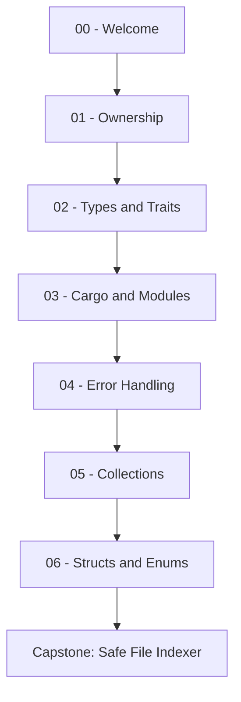
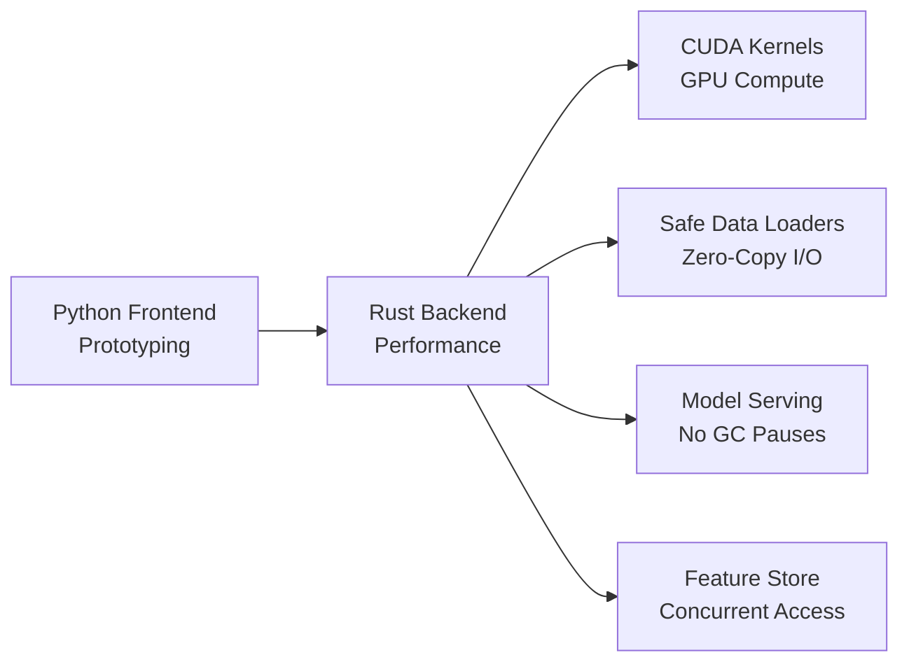

# 👋 Welcome to Rust Fundamentals

## 🎯 Learning Objectives

By the end of this course, you will be able to:

- Reason about memory management using [[01 - Ownership, Borrowing, and Lifetimes|ownership and lifetimes]] rather than relying on a garbage collector
- Design expressive APIs with [[02 - Types, Traits, and Generics|traits and generics]] that are both flexible and performant
- Structure large projects using [[03 - Cargo, Crates, and the Module System|Cargo workspaces and modules]]
- Handle failures gracefully with [[04 - Error Handling and Pattern Matching|Result, Option, and pattern matching]]
- Process data efficiently with [[05 - Collections and Iterators|collections and zero-cost iterators]]
- Model complex domains with [[06 - Structs, Enums, and Advanced Patterns|enums, structs, and advanced patterns]]
- Explain why Rust is increasingly adopted for ML/AI infrastructure and model serving

## Introduction

Machine Learning and Artificial Intelligence systems are increasingly bottlenecked by memory safety and concurrency. Python dominates prototyping, but production pipelines—feature stores, data loaders, and inference engines—often suffer from garbage-collection pauses, data races, and segfaults in underlying C extensions. Rust's ownership model eliminates data races and use-after-free bugs at compile time, making it ideal for high-performance training pipelines and low-latency model serving. Unlike C++, which burdens developers with manual memory management, or Go and Java, which rely on garbage collectors with unpredictable pause times, Rust offers zero-cost abstractions with mathematically guaranteed safety.

This course is structured as a progressive journey from [[01 - Ownership, Borrowing, and Lifetimes|memory fundamentals]] through [[02 - Types, Traits, and Generics|type systems]] and [[03 - Cargo, Crates, and the Module System|project architecture]]. Each module builds upon the previous, culminating in a production-grade Safe File Indexer. By mastering these fundamentals, you will be equipped to contribute to ML frameworks like Burn, Candle, or Rust-BERT, and to build safe data infrastructure that scales from edge devices to data centers.

The notes use a dual-track pedagogical approach: theory always precedes code, and visual models anchor abstract concepts. You will encounter ASCII diagrams, Mermaid flows, and Wikimedia illustrations that map Rust's semantics to classical computer science theory. This multimodal structure is designed for practitioners who need to reason about both algorithmic correctness and systems performance. Internal links such as `[[01 - Ownership, Borrowing, and Lifetimes|ownership rules]]` allow you to navigate seamlessly between related topics.

## Module 0: Course Overview

### 0.1 Theoretical Foundation 🧠

Rust was born from the observation that memory safety bugs account for roughly two-thirds of security vulnerabilities in systems software. Graydon Hoare began the project at Mozilla in 2006, and the language reached 1.0 in 2015. Its design synthesizes decades of programming language research: affine types from linear logic enforce that a resource is used at most once; region-based memory management (lifetimes) ensures references never outlive their referents; and trait-based generics provide Haskell-style typeclasses without runtime overhead. For ML engineers, this means you can write a data loader that saturates a network link or a GPU kernel launcher without fear of segmentation faults or hidden GC stalls.

The theoretical underpinning of ownership is **linear logic**, introduced by Jean-Yves Girard in 1987. In linear logic, every assumption must be used exactly once. Rust relaxes this to **affine logic**, where a resource may be used at most once (it can be dropped). This seemingly small restriction guarantees that no two mutable aliases exist simultaneously, which is the root cause of most data races. When you move a `String` in Rust, you are performing an affine consumption of the source variable, rendering it invalid and preventing any subsequent use.

Memory safety is not merely a convenience; it is a prerequisite for reliable ML systems. A corrupted feature vector caused by a use-after-free bug can silently degrade model accuracy for weeks. By enforcing safety at compile time, Rust turns a class of runtime heisenbugs into deterministic compiler errors that are caught before deployment.

### 0.2 Mental Model 📐

The course structure can be visualized as a layered stack, with each layer depending on the ones below it:

```
┌─────────────────────────────────────────────┐
│  06 - Structs, Enums, and Advanced Patterns │
│         (Domain Modeling)                   │
├─────────────────────────────────────────────┤
│  05 - Collections and Iterators             │
│         (Zero-Cost Abstractions)            │
├─────────────────────────────────────────────┤
│  04 - Error Handling and Pattern Matching   │
│         (Robustness)                        │
├─────────────────────────────────────────────┤
│  03 - Cargo, Crates, and the Module System  │
│         (Project Architecture)              │
├─────────────────────────────────────────────┤
│  02 - Types, Traits, and Generics           │
│         (Abstraction)                       │
├─────────────────────────────────────────────┤
│  01 - Ownership, Borrowing, and Lifetimes   │
│         (Memory Safety)                     │
├─────────────────────────────────────────────┤
│  00 - Welcome (You are here)                │
│         (Orientation)                       │
└─────────────────────────────────────────────┘
```

Think of the Rust compiler as a pipeline with a strict gatekeeper:

```
  Source Code (.rs files)
           │
           ▼
   ┌───────────────┐
   │    Lexer      │
   └───────┬───────┘
           ▼
   ┌───────────────┐
   │    Parser     │
   └───────┬───────┘
           ▼
   ┌───────────────┐
   │  Borrow       │
   │  Checker      │◄────── Your Safety Net
   └───────┬───────┘
           ▼
   ┌───────────────┐
   │  Type Checker │
   └───────┬───────┘
           ▼
   ┌───────────────┐
   │  LLVM Backend │
   └───────────────┘
           │
           ▼
      Binary Executable
```

In an ML pipeline, Rust typically sits at the performance-critical boundary between high-level orchestration and hardware:

```
  ┌──────────────┐     ┌──────────────┐     ┌──────────────┐
  │  Data Ingest │────►│  Feature Eng │────►│ Model Train  │
  │   (Rust)     │     │   (Rust)     │     │  (Rust+GPU)  │
  └──────────────┘     └──────────────┘     └──────────────┘
         │                                           │
         ▼                                           ▼
  ┌──────────────┐                           ┌──────────────┐
  │   Storage    │                           │   Serving    │
  │  (Safe I/O)  │                           │  (Zero-GC)   │
  └──────────────┘                           └──────────────┘
```

### 0.3 Syntax and Semantics 📝

These notes use a consistent markup vocabulary to connect concepts across modules:

- `[[File Name|Display Text]]` creates bidirectional internal links between notes.
- Theory sections always precede code sections; never read a code block without reading the paragraph above it.
- ASCII diagrams use box-drawing characters (`┌─┐│└┘`) to represent memory layouts, architectures, and flows.
- WHY comments inside Rust code explain the reasoning behind a construct, not merely what it does.

Example of internal link syntax:
```markdown
Read [[01 - Ownership, Borrowing, and Lifetimes|ownership rules]]
before writing any non-trivial Rust code.
```

Example of a WHY comment:
```rust
let s = String::from("hello"); // WHY: allocates on the heap because
                               // the size is unknown at compile time
```

### 0.4 Visual Representation 🖼️

The course dependency graph shows how each module unlocks the next:



Rust's position in a typical ML stack emphasizes safety at every layer:



Illustrations from Wikimedia Commons provide historical and architectural context:

- [Programming Language Concepts](https://commons.wikimedia.org/wiki/File:Programming_language_concepts.svg)
- [Computer System Bus Architecture](https://commons.wikimedia.org/wiki/File:Computer_system_bus.svg)

### 0.5 Application in ML/AI Systems 🤖

| Case Study | Rust Role | ML/AI Impact |
|---|---|---|
| Hugging Face Tokenizers | Rust core with Python bindings | 10x faster text preprocessing; memory-safe parsing |
| Candle | Rust-native ML framework | LLM inference without Python overhead or GIL contention |
| Polars | DataFrame library | Zero-copy queries on out-of-core datasets |
| Rust-BERT | Transformer inference | Safe deployment of NLP pipelines in production |
| Firefox Stylo | Parallel CSS engine | Proved data-race freedom at compile time for tree traversal |

### 0.6 Common Pitfalls ⚠️

⚠️ **Warning 1:** Do not skip the ownership module. Every subsequent concept—from traits to concurrency—assumes you can read borrow-checker errors fluently and restructure code accordingly.

⚠️ **Warning 2:** Avoid translating Python or C++ idioms directly into Rust. Rust's `Iterator`, `Result`, and `Option` patterns replace many manual loop, null-check, and exception-handling habits. Direct translation leads to fighting the compiler.

💡 **Tip:** Keep the official Rust Book open in a browser tab, but use these notes for the ML-specific context that the Book does not cover. When the borrow checker complains, treat the error message as a formal proof that your code would be unsafe, not as a nuisance.

### 0.7 Knowledge Check ❓

1. Why is garbage collection problematic for low-latency model serving, and how does Rust avoid GC pauses?
2. Name three Rust projects or libraries used in the ML/AI pipeline and state their primary benefit.
3. What is the purpose of the `[[...]]` syntax in these notes, and how does it relate to the concept of bidirectional linking?

## 📦 Compression Code

The following script symbolically compresses a welcome message using run-length encoding, demonstrating that even trivial Rust programs are memory-safe by default:

```rust
fn main() {
    let welcome = "WWWWeeelllcccommmeee ttToo RRuusstt";
    let compressed = rle_compress(welcome);
    println!("Original: {}", welcome);
    println!("Compressed: {:?}", compressed);
}

fn rle_compress(input: &str) -> Vec<(char, usize)> {
    let mut result = Vec::new();
    if input.is_empty() {
        return result;
    }
    let mut chars = input.chars();
    let mut current = chars.next().unwrap();
    let mut count = 1;
    for ch in chars {
        if ch == current {
            count += 1;
        } else {
            result.push((current, count));
            current = ch;
            count = 1;
        }
    }
    result.push((current, count));
    result
}
```

## 🎯 Documented Project

### Description

Throughout this course, you will build a **Safe File Indexer** — a command-line tool that recursively scans directories, indexes file metadata, and provides fast queries. Each module contributes a layer to this project: ownership ensures safe buffer handling, traits enable pluggable storage backends, modules organize the codebase, error handling manages I/O failures, collections power the index, and enums model the different file types.

### Functional Requirements

1. Recursively scan a directory tree and collect file paths.
2. Index file metadata including size, modified time, and a content hash.
3. Query the index by path prefix or file extension with sub-millisecond latency.
4. Use ownership and borrowing to manage buffer lifetimes during hashing.
5. Use modules to separate scanning, indexing, querying, and CLI concerns.

### Main Components

- `Scanner`: walks directories recursively and yields file paths.
- `Index`: stores metadata in a hash map keyed by absolute path.
- `QueryEngine`: answers search requests using prefix trees or filters.
- `Cli`: parses command-line arguments and orchestrates the workflow.
- `FileType`: enum representing directories, regular files, and symlinks.

### Success Metrics

- Zero memory leaks under Miri (Rust's mid-level IR interpreter).
- Compilation with zero warnings under `#![warn(rust_2018_idioms)]`.
- Query response time remains below 10 ms for an index of 10,000 files.
- The tool compiles and runs on Linux, macOS, and Windows without `unsafe` blocks.

### References

- [The Rust Programming Language](https://doc.rust-lang.org/book/)
- [Rust By Example](https://doc.rust-lang.org/rust-by-example/)
- [Wikimedia Commons - Programming Language Concepts](https://commons.wikimedia.org/wiki/File:Programming_language_concepts.svg)
- [Wikimedia Commons - System Bus Architecture](https://commons.wikimedia.org/wiki/File:Computer_system_bus.svg)
