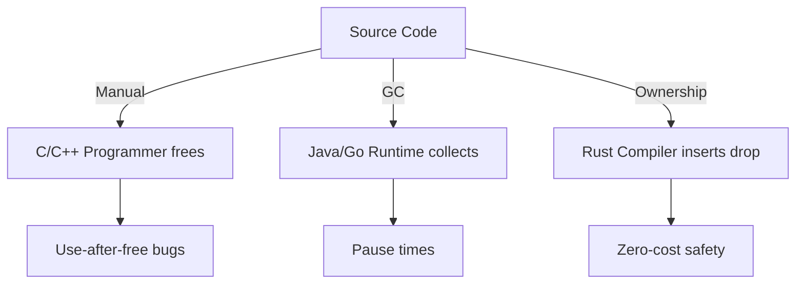
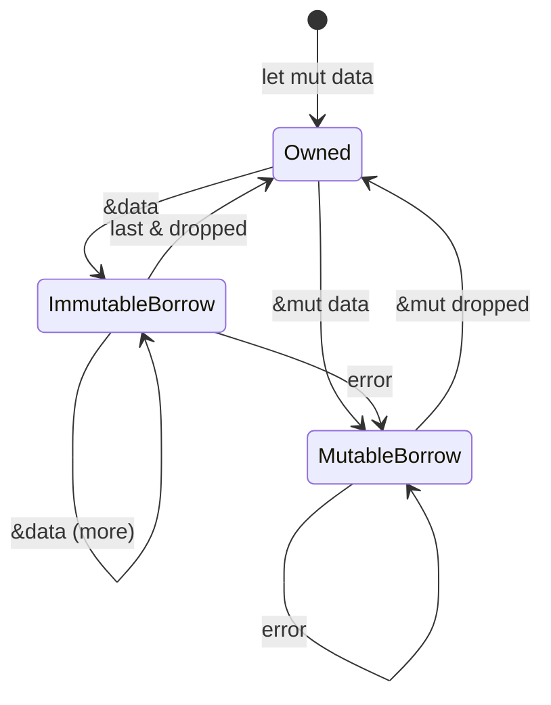
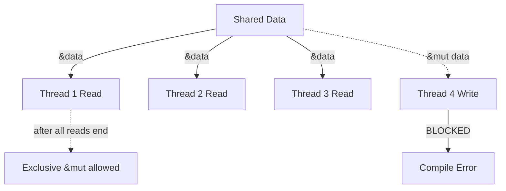
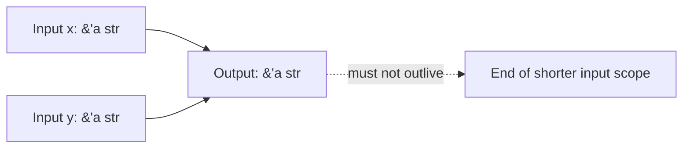
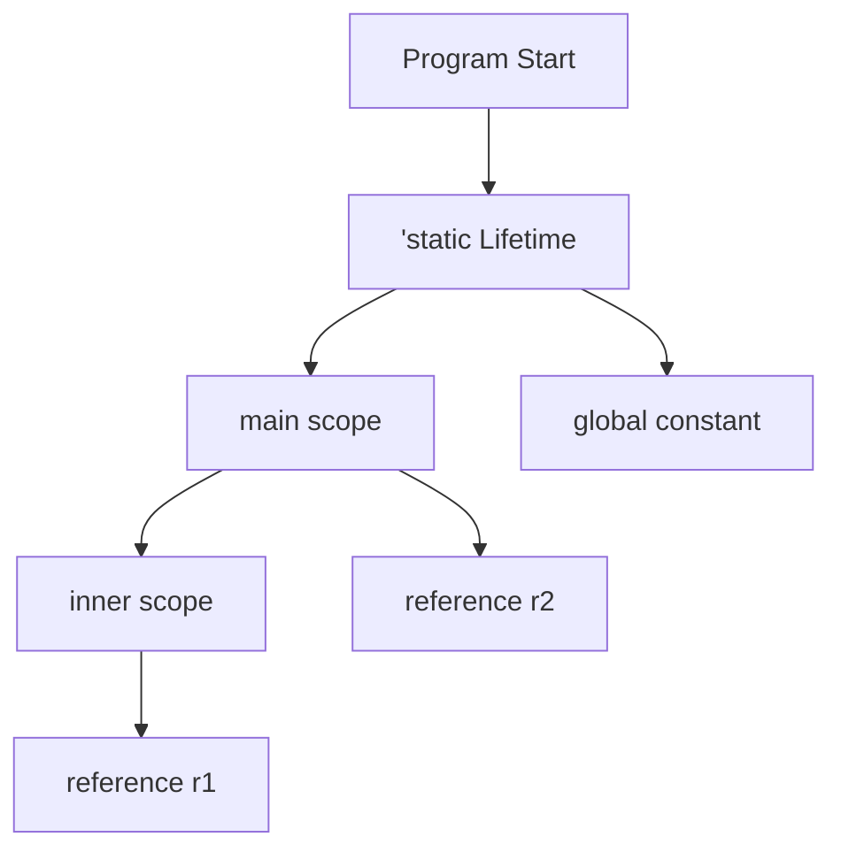

# 🔒 Ownership, Borrowing, and Lifetimes

## 🎯 Learning Objectives

By the end of this module, you will be able to:

- Explain how Rust's ownership system guarantees memory safety without a garbage collector
- Distinguish between moves, copies, clones, and borrows in Rust code
- Use immutable and mutable references correctly according to the borrowing rules
- Annotate lifetimes explicitly when elision rules are insufficient
- Apply ownership thinking to ML/AI systems such as safe tensor buffers and zero-copy parsers

## Introduction

Rust's ownership system is the language's most distinctive and powerful feature. Unlike C++ where memory safety is the programmer's responsibility, or Java and Go which rely on garbage collectors, Rust enforces memory safety at compile time through a set of ownership rules. This system eliminates dangling pointers, double frees, and data races without runtime overhead. For ML engineers, this means you can build data loaders that process terabyte-scale datasets without segfaults, and inference engines that serve models with deterministic latency because there is no garbage collector to pause execution.

Understanding ownership is essential before writing any non-trivial Rust code. Every value in Rust has a single owner, and when that owner goes out of scope, the value is automatically dropped. This seemingly simple rule has profound implications for how you structure programs, pass data between functions, and design APIs. Mastery of ownership transforms the borrow checker from an obstacle into a reliable safety net that proves your program is free of memory errors before it ever runs. This module explores the three pillars of Rust's memory management—ownership, borrowing, and lifetimes—and connects them to real-world systems like [[02 - Types, Traits, and Generics|type-safe abstractions]] and [[03 - Cargo, Crates, and the Module System|large project architecture]].

## Module 1: Ownership

### 1.1 Theoretical Foundation 🧠

The theoretical roots of Rust's ownership system lie in **linear logic** and **affine type systems**. In linear logic, introduced by Jean-Yves Girard in 1987, every assumption must be used exactly once. Rust adopts an affine variation: a resource may be used at most once, with the option to drop it implicitly. This constraint guarantees that no two mutable aliases exist simultaneously for the same memory location, which is the root cause of the vast majority of data races and use-after-free bugs.

Before Rust, systems programmers faced a binary choice: manual memory management (C, C++) with its attendant bugs, or garbage collection (Java, Go, Python) with its runtime overhead and unpredictable pause times. Garbage collectors introduce stop-the-world pauses that can last hundreds of milliseconds—an eternity for low-latency model serving. Rust's ownership model provides a third path: memory safety through static analysis, with zero runtime cost. The compiler inserts `drop` calls at compile time, ensuring each allocation is freed exactly once.

In ML/AI contexts, ownership is particularly valuable for managing large tensor buffers. A 4-gigabyte feature matrix must be freed exactly once; double-freeing it corrupts the heap, while forgetting to free it wastes GPU memory. Rust's ownership rules make these errors impossible at the language level.

### 1.2 Mental Model 📐

Imagine memory as a collection of labeled boxes. In Rust, each box has exactly one label (owner). When you move a value, you peel the label off the old box and stick it on a new one. The old label becomes invalid.

```
Stack Frame (main)          Heap
┌─────────────┐            ┌─────────────────┐
│  s1         │───────────►│  String hello   │
│  (owner)    │            │  [heap alloc]   │
└─────────────┘            └─────────────────┘
        │
        │ move to s2
        ▼
┌─────────────┐            ┌─────────────────┐
│  s1         │   X        │  String hello   │
│  INVALID    │            │  [owned by s2]  │
└─────────────┘            └─────────────────┘
        ▲
        │ s2 now owns
┌─────────────┐
│  s2         │
│  (owner)    │
└─────────────┘
```

Stack-allocated scalar types are different. Because their size is known at compile time, they are copied rather than moved:

```
┌─────────────┐
│  x: 5       │
└─────────────┘
        │ copy
        ▼
┌─────────────┐
│  y: 5       │
└─────────────┘
   x is still valid
```

Ownership flows through function calls like a relay race: the baton (value) is passed from caller to callee, and the caller may no longer hold it unless it was copied.

### 1.3 Syntax and Semantics 📝

```rust
fn main() {
    // WHY: String is heap-allocated and growable,
    // so it does NOT implement Copy.
    let s1 = String::from("hello");
    
    // WHY: Ownership moves from s1 to s2.
    // The heap data is NOT duplicated.
    let s2 = s1;
    
    // println!("{}", s1); // ERROR: value borrowed after move
    println!("{}", s2); // OK: s2 owns the string
    
    // WHY: s2 is moved into takes_ownership.
    // After this call, s2 is invalid in main.
    takes_ownership(s2);
    
    // s2 is no longer valid here.
    
    // WHY: i32 is a fixed-size scalar that lives on the stack,
    // so it implements Copy and is duplicated.
    let x = 5;
    let y = x;
    println!("x = {}, y = {}", x, y); // Both valid
}

// WHY: The parameter `s` takes ownership of the passed String.
// When this scope ends, the String is dropped automatically.
fn takes_ownership(s: String) {
    println!("{}", s);
} // s dropped here
```

### 1.4 Visual Representation 🖼️

The lifecycle of a heap-allocated value under ownership:

```mermaid
graph LR
    A[let s1 = String::from"hello"] -->|owns| B[Heap String hello]
    B -->|let s2 = s1; move| C[Variable s2]
    A -.->|invalidated| D[Compile Error if used]
    C -->|takes_ownership(s2)| E[Function parameter s]
    E -->|scope ends| F[drop called Memory Freed]
```

Comparison of memory management strategies:



Historical context and memory architecture illustrations:

- [Virtual Address Space](https://commons.wikimedia.org/wiki/File:Virtual_address_space_and_physical_address_space_relationship.svg)
- [Call Stack Layout](https://commons.wikimedia.org/wiki/File:Call_stack_layout.svg)

### 1.5 Application in ML/AI Systems 🤖

| Case Study | Rust Role | ML/AI Impact |
|---|---|---|
| Mozilla Firefox Quantum (Stylo) | Parallel DOM traversal with ownership | Proved data-race freedom at compile time for tree walking |
| Hugging Face Tokenizers | Rust core manages string buffers | Zero-copy slicing prevents leaks during BPE tokenization |
| ONNX Runtime Rust bindings | Safe tensor handles | Ownership ensures GPU buffers are freed exactly once |
| Polars DataFrames | Columnar memory via owned buffers | Arrow-backed arrays safely shared across threads |

### 1.6 Common Pitfalls ⚠️

⚠️ **Warning 1:** Attempting to use a variable after its value has been moved results in a compile-time error. This is not a limitation—it is Rust preventing you from accessing deallocated or invalid memory. Embrace the error and restructure your code to pass a reference or clone explicitly.

⚠️ **Warning 2:** Implicit copies in other languages train developers to assume assignment is cheap. In Rust, `let s2 = s1;` for a `String` moves the entire heap allocation. If you need two independent copies, write `.clone()` deliberately so the cost is visible in your code.

💡 **Tip:** Use `Clone` trait explicitly when you need duplicate ownership. Writing `.clone()` makes the potentially expensive copy operation visible, unlike implicit copy semantics in C++ or Python.

### 1.7 Knowledge Check ❓

1. Why does `String` implement move semantics while `i32` implements copy semantics?
2. What happens to the heap memory of a `String` when its owner goes out of scope?
3. In an ML data loader, why is it safer to move a large buffer into a worker thread than to share a raw pointer?

## Module 2: Borrowing

### 2.1 Theoretical Foundation 🧠

Borrowing is Rust's mechanism for temporary access to data without assuming ownership. The theoretical basis is the **aliasing XOR mutation** principle: at any moment, a piece of data may be accessed by any number of immutable references **or** exactly one mutable reference, but never both simultaneously. This principle appears in separation logic, a formal system for reasoning about programs that manipulate shared mutable data structures.

In concurrent programming, this rule is analogous to a readers-writer lock: multiple readers can hold the lock concurrently, but a writer requires exclusive access. Rust enforces this discipline at compile time for all references, not just those shared across threads. The result is that data races—defined as two or more pointers accessing the same data concurrently, at least one writing, with no synchronization—are statically impossible in safe Rust.

For ML systems, borrowing enables zero-copy views into datasets. A training pipeline can spawn multiple worker threads, each holding an immutable reference to a shared feature matrix, while a preprocessing stage temporarily borrows the matrix mutably to normalize columns. The borrow checker guarantees that these phases never overlap unsafely.

### 2.2 Mental Model 📐

Think of borrowing as checking out a book from a library:

```
Immutable Borrow (Multiple Readers):
┌─────────────┐
│   Data      │
│  hello      │
└──────┬──────┘
       │
   ┌───┴───┐
   ▼       ▼
┌─────┐ ┌─────┐
│ &r1 │ │ &r2 │
│read │ │read │
└─────┘ └─────┘
Allowed: any number of readers

Mutable Borrow (Exclusive Writer):
┌─────────────┐
│   Data      │
│  hello      │
└──────┬──────┘
       │
       ▼
   ┌─────┐
   │ &mut│
   │write│
   └─────┘
Blocked: all other references
```

The borrow checker tracks reference lifetimes as nested scopes:

```
┌─────────────────────────────┐
│ let mut s = String::new();  │
│                             │
│  ┌─────────────────────┐    │
│  │ let r1 = &s;        │    │
│  │ let r2 = &s;        │    │
│  │ println!(...);      │    │
│  └─────────────────────┘    │
│                             │
│  ┌─────────────────────┐    │
│  │ let r3 = &mut s;    │    │
│  │ r3.push_str(...);   │    │
│  └─────────────────────┘    │
│                             │
│  ┌─────────────────────┐    │
│  │ let r4 = &s;        │    │
│  │ println!(...);      │    │
│  └─────────────────────┘    │
└─────────────────────────────┘
```

### 2.3 Syntax and Semantics 📝

```rust
fn main() {
    let mut s = String::from("hello");
    
    // WHY: Multiple immutable borrows are allowed
    // because no mutation occurs.
    let r1 = &s;
    let r2 = &s;
    println!("{} {}", r1, r2);
    
    // WHY: r1 and r2 are no longer used after this point,
    // so the compiler allows a mutable borrow next.
    let r3 = &mut s;
    r3.push_str(" world");
    println!("{}", r3);
    
    // WHY: After r3's last use, new immutable borrows are fine.
    let r4 = &s;
    println!("{}", r4);
}

// WHY: Returning a reference to a local variable is forbidden
// because the local is dropped when the function returns,
// which would leave a dangling pointer.
// fn dangle() -> &String {
//     let s = String::from("hello");
//     &s
// }
```

### 2.4 Visual Representation 🖼️

State machine of borrowing rules:



Concurrency safety through borrowing:



Illustrations of shared memory and concurrency:

- [Shared Memory](https://commons.wikimedia.org/wiki/File:Shared_memory.svg)
- [Readers-Writers Problem](https://commons.wikimedia.org/wiki/File:Readers-Writers_Problem_Diagram.svg)

### 2.5 Application in ML/AI Systems 🤖

| Case Study | Borrowing Pattern | ML/AI Impact |
|---|---|---|
| PyTorch DataLoader (Rust rewrite) | Immutable &[f32] to shared dataset | Multiple workers read features without copying |
| Feature Store serving layer | &mut during batch updates | Exclusive write prevents partial reads during ingestion |
| Tokenizer batch processing | &str slices into input text | Zero-copy tokenization over large corpora |
| Graph Neural Network message passing | &Node references during aggregation | Safe parallel traversal of adjacency lists |

### 2.6 Common Pitfalls ⚠️

⚠️ **Warning 1:** Creating a mutable reference while immutable references are still in scope will fail to compile, even if the immutable references are never used again after the mutable borrow. The compiler uses scope-based analysis (Non-Lexical Lifetimes improve this, but scopes still matter). Restructure your code so the immutable references go out of scope before the mutable borrow begins.

⚠️ **Warning 2:** Returning a reference to a local variable from a function creates a dangling reference. The compiler rejects this because the local variable is dropped when the function returns. The fix is to return the owned value itself or to accept a parameter with a long enough lifetime and return a reference tied to it.

💡 **Tip:** When designing APIs for data pipelines, prefer borrowing over cloning. A function signature like `fn process(data: &[f32])` tells callers that the function only reads the data and returns quickly, without taking ownership of a large buffer.

### 2.7 Knowledge Check ❓

1. Why does Rust allow multiple immutable references but only one mutable reference at a time?
2. What is a dangling reference, and how does Rust prevent it at compile time?
3. In a multi-threaded data loader, how does borrowing eliminate the need for manual mutex locks on read-only data?

## Module 3: Lifetimes

### 3.1 Theoretical Foundation 🧠

Lifetimes are Rust's implementation of **region-based memory management**, a technique pioneered in the ML Kit compiler and later refined in Cyclone and Rust. Every reference has a lifetime: the span of the program during which that reference is guaranteed to be valid. Rather than tracking individual pointers at runtime, Rust annotates references with lifetime parameters and checks at compile time that no reference outlives the data it points to.

Most of the time, the compiler infers lifetimes through **lifetime elision**, a set of three rules that automatically assign lifetime parameters to function signatures. When elision is insufficient, programmers annotate lifetimes explicitly using apostrophe syntax (`'a`). This explicit annotation serves as a contract: the returned reference will live at least as long as the shortest input reference.

The `'static` lifetime denotes data that lives for the entire program execution, such as string literals embedded in the binary. In ML systems, `'static` is rare for dynamic data but common for configuration strings and global constants. Tying lifetimes to specific scopes rather than `'static` gives the borrow checker more information and enables more flexible APIs.

### 3.2 Mental Model 📐

Lifetimes can be visualized as nested brackets that delimit the validity of references:

```
Scope of text
├─────────────────────────────────────┤
│ let text = "The Rust Book";         │
│                                     │
│  ┌─────────────────────────────┐    │
│  │ let book = Book::new(&text);│    │
│  │ // book.title is valid      │    │
│  │ // as long as text lives    │    │
│  └─────────────────────────────┘    │
│                                     │
│ // book must be dropped here        │
│ // or earlier                       │
└─────────────────────────────────────┘
```

Explicit lifetimes create contracts between inputs and outputs:

```
fn longest<'a>(x: &'a str, y: &'a str) -> &'a str
        │            │            │            │
        └────────────┴────────────┘            │
                     │                         │
                     └──── Same lifetime ──────┘
```

A struct with references carries the lifetime of its data:

```
┌─────────────────────────────┐
│ struct Parser<'a> {         │
│   text: &'a str,  ◄─────────┼─── lifetime 'a
│   pos: usize,               │
│ }                           │
└─────────────────────────────┘
```

### 3.3 Syntax and Semantics 📝

```rust
// WHY: The returned reference must not outlive either input.
// 'a is a contract: the output lives as long as the shorter input.
fn longest<'a>(x: &'a str, y: &'a str) -> &'a str {
    if x.len() > y.len() {
        x
    } else {
        y
    }
}

// WHY: A struct holding references must declare a lifetime
// so the compiler knows the struct cannot outlive its data.
struct Book<'a> {
    title: &'a str,
    author: &'a str,
}

impl<'a> Book<'a> {
    fn new(title: &'a str, author: &'a str) -> Self {
        Book { title, author }
    }
    
    fn description(&self) -> String {
        format!("{} by {}", self.title, self.author)
    }
}

// WHY: 'static means the reference lives for the entire program.
// String literals are baked into the binary, so they are 'static.
const GREETING: &'static str = "Hello, ML world!";

fn main() {
    let title = "The Rust Programming Language";
    let author = "Steve Klabnik and Carol Nichols";
    
    // WHY: book cannot outlive title or author.
    let book = Book::new(title, author);
    println!("{}", book.description());
    
    let a = "short";
    let b = "loooooooooong";
    println!("Longest: {}", longest(a, b));
}
```

### 3.4 Visual Representation 🖼️

Lifetime contract visualization:



Hierarchical lifetime nesting:



Illustrations of scope and memory:

- [Scope and Variable Lifetime](https://commons.wikimedia.org/wiki/File:Variable_scope_lifetime.svg)
- [Call Stack](https://commons.wikimedia.org/wiki/File:Call_stack_layout.svg)

### 3.5 Application in ML/AI Systems 🤖

| Case Study | Lifetime Pattern | ML/AI Impact |
|---|---|---|
| Hugging Face Tokenizers | &'a str slices over input text | Zero-copy tokenization with proven bounds safety |
| ndarray (Rust) | Views with shared lifetimes | Safe slicing of multi-dimensional tensors |
| ONNX Runtime Rust API | Session owns Tensors | Prevents use of tensors after session release |
| CSV parsing with serde | Records borrow from input buffer | Streaming deserialization without allocation |

### 3.6 Common Pitfalls ⚠️

⚠️ **Warning 1:** Overusing `'static` is a common beginner mistake. Marking a reference as `'static` claims it lives forever, which is only true for compile-time constants and leaked allocations. For dynamic data, tie the lifetime to a specific scope so the borrow checker can verify safety.

⚠️ **Warning 2:** Fighting the borrow checker by adding excessive lifetime annotations or converting everything to owned types (`String` instead of `&str`) defeats the purpose of zero-copy borrowing. If the compiler rejects your lifetimes, it is usually because your data structure has a real ownership ambiguity that needs restructuring, not more annotations.

💡 **Tip:** When in doubt, start with owned data (`String`, `Vec`) and introduce references only after the architecture is stable. It is easier to optimize toward borrows than to debug lifetime errors in a tangled design.

### 3.7 Knowledge Check ❓

1. What is the difference between lifetime elision and explicit lifetime annotation?
2. Why is it dangerous to return a reference to a local variable, and how do lifetimes prevent this?
3. In a streaming data parser, how do lifetimes ensure that parsed records never reference freed buffer memory?

## 📦 Compression Code

The following complete program demonstrates ownership, borrowing, and lifetimes in a single utility that compresses text using run-length encoding. It shows a function borrowing input data, returning an owned vector, and a struct parser that holds a reference to text with a declared lifetime.

```rust
use std::fs;

fn main() {
    // WHY: read_to_string returns an owned String.
    // content is the sole owner of the heap buffer.
    let content = fs::read_to_string("input.txt")
        .expect("Failed to read file");
    
    // WHY: compress borrows content immutably.
    // Ownership of content remains with main.
    let compressed = compress(&content);
    println!("Original: {} bytes", content.len());
    println!("Compressed: {} bytes", compressed.len());
    
    // WHY: parser holds a reference to content.
    // The lifetime ensures parser cannot outlive content.
    let mut parser = WordParser::new(&content);
    while let Some(word) = parser.next_word() {
        println!("Word: {}", word);
    }
}

// WHY: The input is borrowed; the output is newly owned.
// No lifetime annotation is needed because we return an owned Vec.
fn compress(input: &str) -> Vec<u8> {
    let mut result = Vec::new();
    let bytes = input.as_bytes();
    if bytes.is_empty() {
        return result;
    }
    let mut current = bytes[0];
    let mut count = 1;
    for &byte in &bytes[1..] {
        if byte == current && count < 255 {
            count += 1;
        } else {
            result.push(current);
            result.push(count);
            current = byte;
            count = 1;
        }
    }
    result.push(current);
    result.push(count);
    result
}

// WHY: 'a ties the struct to the lifetime of the text it references.
// The compiler will reject any code where parser outlives text.
struct WordParser<'a> {
    text: &'a str,
    position: usize,
}

impl<'a> WordParser<'a> {
    fn new(text: &'a str) -> Self {
        WordParser { text, position: 0 }
    }
    
    fn next_word(&mut self) -> Option<&'a str> {
        let start = self.position;
        while self.position < self.text.len()
              && !self.text[self.position..].starts_with(' ') {
            self.position += 1;
        }
        if start == self.position {
            return None;
        }
        let word = &self.text[start..self.position];
        self.position += 1; // skip space
        Some(word)
    }
}
```

## 🎯 Documented Project

### Description

Build a **Memory-Safe Text Buffer** library that manages a large text document with multiple cursors. Each cursor holds references to positions in the buffer without owning the data. The library must enforce that cursors cannot outlive the buffer they reference, and that no two cursors can mutate overlapping regions simultaneously.

### Functional Requirements

1. A `TextBuffer` struct that owns a `String` and tracks line boundaries.
2. A `Cursor<'a>` struct that holds an immutable reference to a `TextBuffer` and a byte position.
3. A `MutableCursor<'a>` struct that holds a mutable reference and can modify the buffer.
4. The compiler must reject any code where a cursor outlives its buffer.
5. Overlapping mutable cursors must be rejected at compile time.
6. Provide an API to insert, delete, and read text at cursor positions.

### Main Components

- `TextBuffer`: owns the document text and provides slice access.
- `Cursor<'a>`: read-only view into the buffer with line and column tracking.
- `MutableCursor<'a>`: exclusive write access to a specific region.
- `BufferError`: enum for runtime errors such as out-of-bounds access.
- `BufferView`: zero-copy iterator over lines.

### Success Metrics

- All unsafe code is rejected or explicitly wrapped in safe abstractions.
- The library compiles with zero warnings under `#![warn(rust_2018_idioms)]`.
- Memory usage remains proportional to the text size plus cursor metadata.
- Operations on non-overlapping regions can occur in parallel (implement `Send + Sync` where safe).
- The borrow checker prevents all dangling cursor references.

### References

- [The Rust Programming Language - Ownership](https://doc.rust-lang.org/book/ch04-00-understanding-ownership.html)
- [Rust By Example - Lifetimes](https://doc.rust-lang.org/rust-by-example/scope/lifetime.html)
- [Mozilla Hacks - Quantum CSS](https://hacks.mozilla.org/2017/08/inside-a-super-fast-css-engine-quantum-css-aka-stylo/)
- [Wikimedia Commons - Virtual Address Space](https://commons.wikimedia.org/wiki/File:Virtual_address_space_and_physical_address_space_relationship.svg)
- [Wikimedia Commons - Call Stack](https://commons.wikimedia.org/wiki/File:Call_stack_layout.svg)
