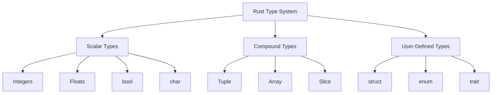
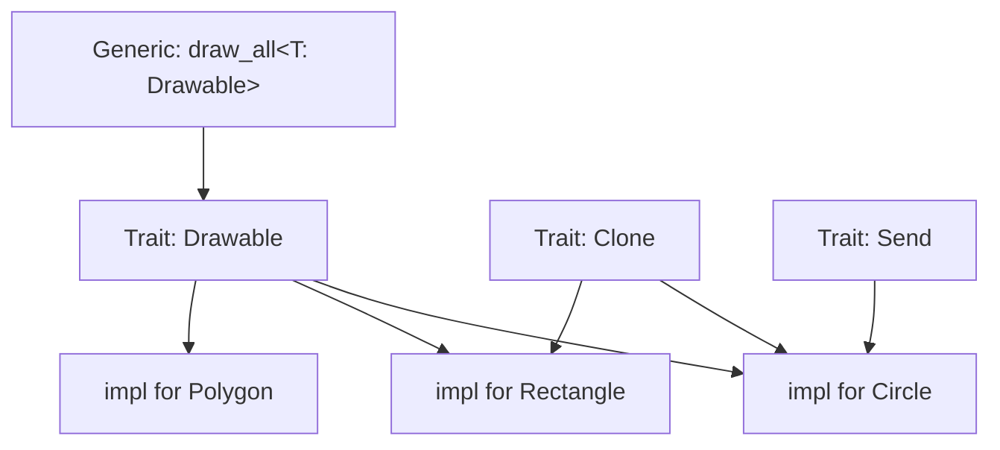
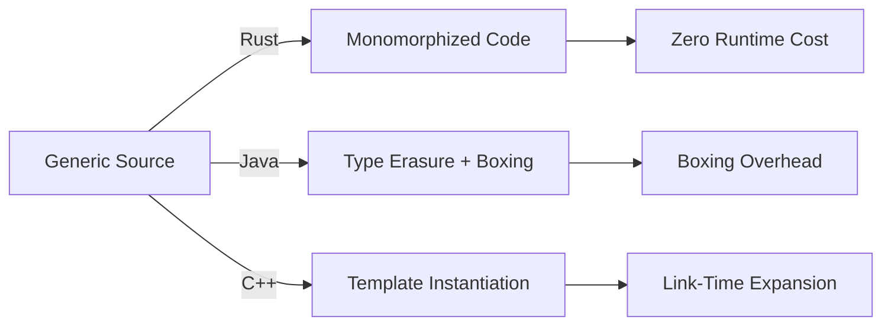
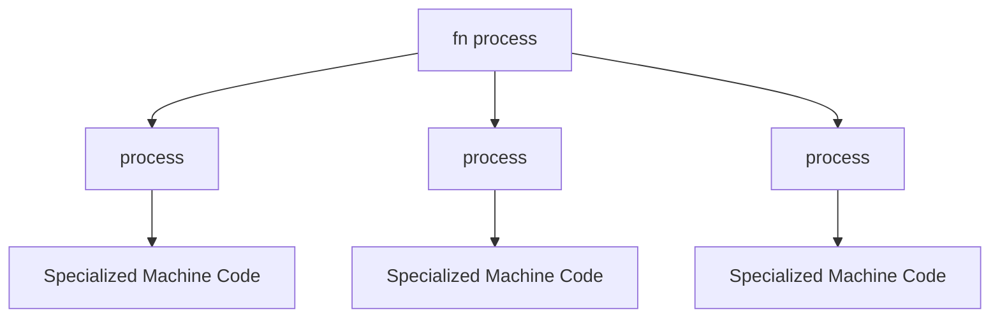

# 📐 Types, Traits, and Generics

## 🎯 Learning Objectives

By the end of this module, you will be able to:

- Explain how Rust's static type system prevents invalid operations at compile time
- Design reusable abstractions using traits and associated types
- Write generic functions and structs that maintain zero-cost performance
- Choose between monomorphization and trait objects based on API requirements
- Apply type-system thinking to ML/AI problems such as safe tensor shapes and generic optimizers

## Introduction

Rust's type system is one of the most expressive in modern programming, drawing inspiration from ML-family languages while maintaining the performance characteristics of systems programming. At its core, the type system prevents invalid operations at compile time, eliminating null pointer dereferences, type confusion, and many other runtime errors before the program ever executes. For ML engineers, this means shape mismatches between tensors can be caught at compile time rather than raising cryptic runtime errors halfway through a training run.

Traits are the backbone of Rust's abstraction mechanism. Unlike object-oriented inheritance, traits define shared behavior through interfaces that types can implement. This approach, similar to Haskell's typeclasses, enables ad-hoc polymorphism without the overhead of virtual method tables when monomorphized. Combined with generics, traits allow you to write code that works over any type satisfying a set of constraints, while still generating optimal machine code for each concrete type. This module connects deeply with [[01 - Ownership, Borrowing, and Lifetimes|ownership-aware APIs]] and [[03 - Cargo, Crates, and the Module System|project organization]], because traits and generics are how you scale safe abstractions across large codebases.

## Module 1: The Rust Type System

### 1.1 Theoretical Foundation 🧠

Rust's type system is static, strong, and nominal with global type inference. Every value has a type known at compile time, and implicit conversions are limited to non-lossy coercions such as widening integer casts or auto-dereferencing. This philosophy traces back to the **Hindley-Milner** type inference algorithm, which allows programmers to omit most annotations while preserving complete type safety. Strong static typing transforms runtime crashes into compiler errors: attempting to add an `f32` to a `String` is rejected before the program runs, not after.

For ML/AI systems, type safety is a force multiplier. A confusion matrix computation that accidentally mixes `u32` counts with `f32` probabilities will silently produce wrong results in a dynamically typed language. In Rust, such a mismatch is a compile error. Furthermore, Rust's lack of null pointers—encoded through the `Option<T>` type—eliminates the billion-dollar mistake entirely. When you see a `Tensor<T>`, you know exactly what numeric type `T` is and that it is never null.

### 1.2 Mental Model 📐

Rust types form a lattice of scalar, compound, and user-defined types:

```
Primitive Types
├─ Integers: i8, i16, i32, i64, i128, isize
├─ Unsigned: u8, u16, u32, u64, u128, usize
├─ Floats:   f32, f64
├─ Boolean:  bool
└─ Character: char (Unicode scalar)

Compound Types
├─ Tuple:    (T, U, V)  ── fixed size, heterogeneous
├─ Array:    [T; N]      ── fixed size, homogeneous
└─ Slice:    &[T]        ── dynamically sized view

User-Defined
├─ struct    ── named product type
├─ enum      ── named sum type
└─ trait     ── shared behavior interface
```

Memory layout on the stack is predictable and transparent:

```
Stack frame for let point = (3, 5):
┌───────────┬───────────┐
│  3 (i32)  │  5 (i32)  │
└───────────┴───────────┘
^ 0 bytes of padding on most targets
```

Type inference works backward from usage:

```
let guess = "42".parse().unwrap();
//              ^^^^^^ requires type annotation because
//                     many types implement FromStr
let guess: u32 = "42".parse().unwrap(); // OK: unambiguous
```

### 1.3 Syntax and Semantics 📝

```rust
fn main() {
    // WHY: Scalars have fixed size and implement Copy.
    let x: i32 = 42;
    let y = x; // y receives a bitwise copy of x
    
    // WHY: Type inference succeeds because f64 is the default
    // floating-point type when no other context is given.
    let pi = 3.14159;
    
    // WHY: Tuples group values of different types.
    let point: (i32, f64, bool) = (10, 0.5, true);
    let (a, b, c) = point; // destructuring
    
    // WHY: Arrays require a compile-time known length.
    let counts: [u32; 4] = [1, 2, 3, 4];
    
    // WHY: Slices are fat pointers: (data_ptr, length).
    let slice = &counts[1..3];
    println!("{:?}", slice); // [2, 3]
    
    // WHY: Explicit annotation resolves ambiguity.
    let guess: u32 = "42".parse().expect("Not a number!");
}
```

### 1.4 Visual Representation 🖼️

Rust's type hierarchy compared to other languages:



Type system concepts from computer science history:

- [Type System Diagram](https://commons.wikimedia.org/wiki/File:Type_system.svg)
- [Programming Language Concepts](https://commons.wikimedia.org/wiki/File:Programming_language_concepts.svg)

### 1.5 Application in ML/AI Systems 🤖

| Case Study | Type System Feature | ML/AI Impact |
|---|---|---|
| Burn Framework | Generic Tensor<B, D> | Compile-time shape checks via const generics |
| Polars DataFrames | Strongly typed columns | Schema violations caught at query plan time |
| Tokenizers | char as Unicode scalar | Correct multi-language text segmentation |
| Quantized models | i8, u8 weight types | Exact bit-width guarantees for INT8 inference |

### 1.6 Common Pitfalls ⚠️

⚠️ **Warning 1:** Integer overflow behavior differs between debug and release builds. In debug, panics occur on overflow. In release, two's complement wrapping occurs. Always use `checked_add`, `saturating_add`, or `wrapping_add` explicitly when overflow semantics matter, such as when computing buffer indices.

⚠️ **Warning 2:** Type inference can fail ambiguously when a method is implemented for many types. The error "type annotations needed" is not pedantic—it signals genuine ambiguity. Add an explicit type annotation to document your intent and reveal logical errors.

💡 **Tip:** Prefer explicit types for public API boundaries and let inference handle local variables. This balances readability with brevity.

### 1.7 Knowledge Check ❓

1. Why does Rust require a type annotation for `"42".parse()` even though the method signature is generic?
2. What is the difference between an array `[T; N]` and a slice `&[T]` in terms of size knowledge and memory representation?
3. How can strong static typing prevent a class of bugs that dynamically typed ML pipelines often encounter when mixing integer labels with floating-point features?

## Module 2: Traits

### 2.1 Theoretical Foundation 🧠

Traits are Rust's mechanism for **ad-hoc polymorphism**, closely related to Haskell's typeclasses and Scala's implicit type classes. A trait defines a contract: a set of methods and associated types that a concrete type must provide. Unlike object-oriented inheritance, which conflates interface with implementation and encourages deep hierarchies, traits separate behavior from data. A type can implement many traits, and a trait can be implemented for many types, enabling orthogonal composition.

This design has deep roots in **type theory**. Parametric polymorphism (generics) says "this function works for any type," while ad-hoc polymorphism (traits) says "this function works for any type that satisfies these constraints." The combination is incredibly powerful: you can write a generic training loop that works for any optimizer implementing the `Optimizer` trait, any model implementing `Forward`, and any loss function implementing `Loss`. The compiler generates a specialized version for each concrete combination, eliminating virtual dispatch overhead.

### 2.2 Mental Model 📐

A trait is a contract that types may sign:

```
Trait: Drawable
├─ fn draw(&self)
└─ fn bounds(&self) -> Rect

Implementations:
├─ Circle   ──► signs Drawable
├─ Rectangle ──► signs Drawable
└─ Polygon   ──► signs Drawable

Generic Function:
draw_all<T: Drawable>(items: &[T])
        │
        └── only accepts types that signed Drawable
```

Monomorphization vs. dynamic dispatch:

```
Compile Time (Monomorphization):
┌─────────────────┐
│ draw_all<Circle>│──► specialized machine code
│ draw_all<Rect>  │──► specialized machine code
└─────────────────┘
Zero runtime overhead

Runtime (Trait Object):
┌─────────────────┐
│ dyn Drawable    │──► vtable lookup at runtime
└─────────────────┘
Small overhead, flexible
```

### 2.3 Syntax and Semantics 📝

```rust
// WHY: A trait defines shared behavior without data.
trait Drawable {
    fn draw(&self);
    fn bounds(&self) -> (f64, f64, f64, f64);
}

struct Circle {
    x: f64, y: f64, radius: f64,
}

// WHY: impl Trait for Type provides the contract methods.
impl Drawable for Circle {
    fn draw(&self) {
        println!("Drawing circle at ({}, {})", self.x, self.y);
    }
    
    fn bounds(&self) -> (f64, f64, f64, f64) {
        (self.x - self.radius, self.y - self.radius,
         self.x + self.radius, self.y + self.radius)
    }
}

// WHY: Trait bounds constrain generic types.
fn draw_all<T: Drawable>(shapes: &[T]) {
    for shape in shapes {
        shape.draw();
    }
}

// WHY: Multiple bounds use +.
fn process<T: Drawable + Clone + Send>(item: T) { }

// WHY: Associated types let each implementation pick one output type.
trait Iterator {
    type Item;
    fn next(&mut self) -> Option<Self::Item>;
}
```

### 2.4 Visual Representation 🖼️

Trait hierarchy and implementation graph:



Polymorphism concepts in computer science:

- [Type System](https://commons.wikimedia.org/wiki/File:Type_system.svg)
- [Software Architecture](https://commons.wikimedia.org/wiki/File:Overview_of_a_three-tier_application_vectorVersion.svg)

### 2.5 Application in ML/AI Systems 🤖

| Case Study | Trait Pattern | ML/AI Impact |
|---|---|---|
| Polars | SeriesTrait with associated types | Unified API across Int32, Float64, Utf8 columns |
| Burn | Optimizer trait for SGD, Adam | Swap optimizers without changing training loop |
| candle | Module trait for layers | Compose neural networks via generic forward passes |
| Rust-BERT | Tokenizer trait | Pluggable tokenization for different model families |

### 2.6 Common Pitfalls ⚠️

⚠️ **Warning 1:** The orphan rule restricts where you can implement a trait for a type. You cannot implement a foreign trait for a foreign type. This prevents conflicting implementations across crates but can surprise beginners who try to add `impl Display for Vec<MyType>` in a utility module.

⚠️ **Warning 2:** Trait objects (`dyn Trait`) require object safety. Traits with generic methods, `Self: Sized` bounds, or associated constants without defaults cannot be made into trait objects. Prefer generics when the concrete type is known at compile time.

💡 **Tip:** Use associated types when there should be exactly one mapping from implementing type to output type (e.g., `Iterator::Item`). Use generic type parameters on the trait itself when multiple implementations for the same type are desired.

### 2.7 Knowledge Check ❓

1. What is the difference between trait bounds on generics and trait objects with `dyn Trait`?
2. Why does Rust enforce orphan rules, and how do they prevent ambiguity in large ecosystems?
3. When would you use an associated type instead of a generic parameter on a trait?

## Module 3: Generics and Monomorphization

### 3.1 Theoretical Foundation 🧠

Generics allow code to be parameterized by types, enabling **parametric polymorphism**. Rust implements generics through **monomorphization**: the compiler generates a distinct copy of the generic code for every concrete type it is instantiated with. This is in contrast to Java's type erasure, which replaces generic parameters with `Object` and inserts casts, or C++ templates, which are instantiated at link time and can produce incomprehensible error messages.

Monomorphization has profound performance implications. Because each instantiation is specialized, the compiler can inline method calls, unroll loops, and apply target-specific optimizations exactly as if you had hand-written the code for each type. The cost is binary size: `Σ(size_for_each_concrete_type)`. For ML systems, this means a generic matrix multiplication routine can be instantiated for `f32`, `f64`, and `i8` weights, each receiving optimal code, without any runtime dispatch.

### 3.2 Mental Model 📐

Monomorphization expands generic code at compile time:

```
Source Code:
fn identity<T>(x: T) -> T { x }

Compiled Output:
┌─────────────────────┐
│ identity_i32(i32)   │
│ identity_f64(f64)   │
│ identity_bool(bool) │
└─────────────────────┘
Each is a distinct function with no shared overhead
```

Const generics allow types to be parameterized by values:

```
Matrix<T, const R: usize, const C: usize>
         │           │            │
         │           │            └── compile-time column count
         │           └── compile-time row count
           type parameter
```

### 3.3 Syntax and Semantics 📝

```rust
// WHY: Generic function works for any PartialOrd type.
fn largest<T: PartialOrd>(list: &[T]) -> &T {
    let mut largest = &list[0];
    for item in list {
        if item > largest {
            largest = item;
        }
    }
    largest
}

// WHY: Generic struct stores any type in both fields.
struct Point<T> {
    x: T,
    y: T,
}

// WHY: Multiple type parameters allow heterogeneous pairs.
struct MultiPoint<T, U> {
    x: T,
    y: U,
}

// WHY: Const generics parameterize types by values.
struct Matrix<T, const R: usize, const C: usize> {
    data: [[T; C]; R],
}

impl<T: Default + Copy, const R: usize, const C: usize> Matrix<T, R, C> {
    fn new() -> Self {
        Matrix {
            data: [[T::default(); C]; R],
        }
    }
    
    fn get(&self, row: usize, col: usize) -> Option<&T> {
        self.data.get(row)?.get(col)
    }
}

fn main() {
    let mut m: Matrix<f64, 3, 3> = Matrix::new();
    m.get(1, 1); // compile-time shape known
}
```

### 3.4 Visual Representation 🖼️

Monomorphization compared across languages:



Generic expansion in a project:



Illustrations of software architecture:

- [Three-Tier Architecture](https://commons.wikimedia.org/wiki/File:Overview_of_a_three-tier_application_vectorVersion.svg)
- [Software Architecture](https://commons.wikimedia.org/wiki/File:Software_architecture.svg)

### 3.5 Application in ML/AI Systems 🤖

| Case Study | Generic Pattern | ML/AI Impact |
|---|---|---|
| ndarray | Array<T, D> | Type-safe tensors with compile-time dimensionality |
| Burn | Tensor<B, D, K> | Backend-agnostic tensors: CPU, CUDA, WGPU |
| Candle | Var and Tensor generics | Automatic differentiation over any numeric type |
| Quantized LLM | Matrix<i8, R, C> | Exact INT8 matrix shapes encoded in the type |

### 3.6 Common Pitfalls ⚠️

⚠️ **Warning 1:** Excessive monomorphization increases binary size and compile time. Instantiating a generic function for dozens of types can bloat the binary. For ML model binaries where size matters, consider trait objects for rare type combinations or use the `dyn` keyword at API boundaries.

⚠️ **Warning 2:** Complex trait bounds become difficult to read and maintain. A signature like `fn train<T: Optimizer + Model + Loss + Send + Sync>(...)` is verbose. Use `where` clauses to improve readability, and define supertraits to group related bounds.

💡 **Tip:** Start with concrete types and extract generics only after you have at least two use cases. Premature abstraction leads to unnecessary complexity and longer compile times.

### 3.7 Knowledge Check ❓

1. What is monomorphization, and why does it provide zero-cost abstractions compared to Java's type erasure?
2. How do const generics enable compile-time shape checking for matrices and tensors?
3. When might you prefer a trait object (`dyn Trait`) over a generic with trait bounds?

## 📦 Compression Code

The following workspace-level example demonstrates traits and generics by abstracting over compression algorithms. A generic function accepts any type implementing the `Compressor` trait, allowing runtime-swappable algorithms without code duplication.

```rust
use std::fs;

// WHY: Trait defines the compression contract.
trait Compressor {
    fn compress(&self, data: &[u8]) -> Vec<u8>;
    fn name(&self) -> &'static str;
}

// WHY: RLE is a simple algorithm with no internal state.
struct RleCompressor;

impl Compressor for RleCompressor {
    fn compress(&self, data: &[u8]) -> Vec<u8> {
        let mut result = Vec::new();
        if data.is_empty() { return result; }
        let mut current = data[0];
        let mut count = 1u8;
        for &byte in &data[1..] {
            if byte == current && count < 255 {
                count += 1;
            } else {
                result.push(current);
                result.push(count);
                current = byte;
                count = 1;
            }
        }
        result.push(current);
        result.push(count);
        result
    }
    
    fn name(&self) -> &'static str { "RLE" }
}

// WHY: Identity allows benchmarking the trait overhead.
struct IdentityCompressor;

impl Compressor for IdentityCompressor {
    fn compress(&self, data: &[u8]) -> Vec<u8> {
        data.to_vec()
    }
    fn name(&self) -> &'static str { "Identity" }
}

// WHY: Generic function monomorphizes for each compressor type.
fn compress_file<C: Compressor>(path: &str, compressor: C) -> std::io::Result<Vec<u8>> {
    let data = fs::read(path)?;
    let compressed = compressor.compress(&data);
    println!("{}: {} -> {} bytes", compressor.name(), data.len(), compressed.len());
    Ok(compressed)
}

fn main() -> std::io::Result<()> {
    let rle = RleCompressor;
    let identity = IdentityCompressor;
    compress_file("dummy.txt", rle)?;
    compress_file("dummy.txt", identity)?;
    Ok(())
}
```

## 🎯 Documented Project

### Description

Build a **Type-Safe Configuration Parser** library that can deserialize configuration files into strongly-typed Rust structs. The library should use traits to support multiple input formats (JSON, TOML, YAML) and generics to work with any deserializable type. The trait system should enforce at compile time that only supported formats can be parsed.

### Functional Requirements

1. A `ConfigParser` trait with methods `parse` and `extension`.
2. Implementations for at least JSON and TOML parsers.
3. A generic `load_config<T: DeserializeOwned>` function that selects the parser based on file extension.
4. A `Validatable` trait that checks config values against constraints at parse time.
5. Custom derive macro support for automatic config struct generation.

### Main Components

- `ConfigParser` trait: abstraction over different serialization formats.
- `JsonParser` and `TomlParser`: concrete implementations.
- `Validatable` trait: ensures configs meet business rules.
- `ConfigLoader<T>`: generic loader with format auto-detection.
- `ConfigError` enum: structured error type for parse failures.

### Success Metrics

- Adding a new format requires only implementing `ConfigParser` (open/closed principle).
- Invalid configs are rejected at parse time, not at use time.
- Zero runtime overhead compared to parsing a specific format directly.
- The library compiles with `#![forbid(unsafe_code)]`.

### References

- [The Rust Programming Language - Traits](https://doc.rust-lang.org/book/ch10-02-traits.html)
- [Rust By Example - Generics](https://doc.rust-lang.org/rust-by-example/generics.html)
- [Polars Documentation](https://docs.rs/polars/latest/polars/)
- [Wikimedia Commons - Type System](https://commons.wikimedia.org/wiki/File:Type_system.svg)
- [Wikimedia Commons - Software Architecture](https://commons.wikimedia.org/wiki/File:Overview_of_a_three-tier_application_vectorVersion.svg)
