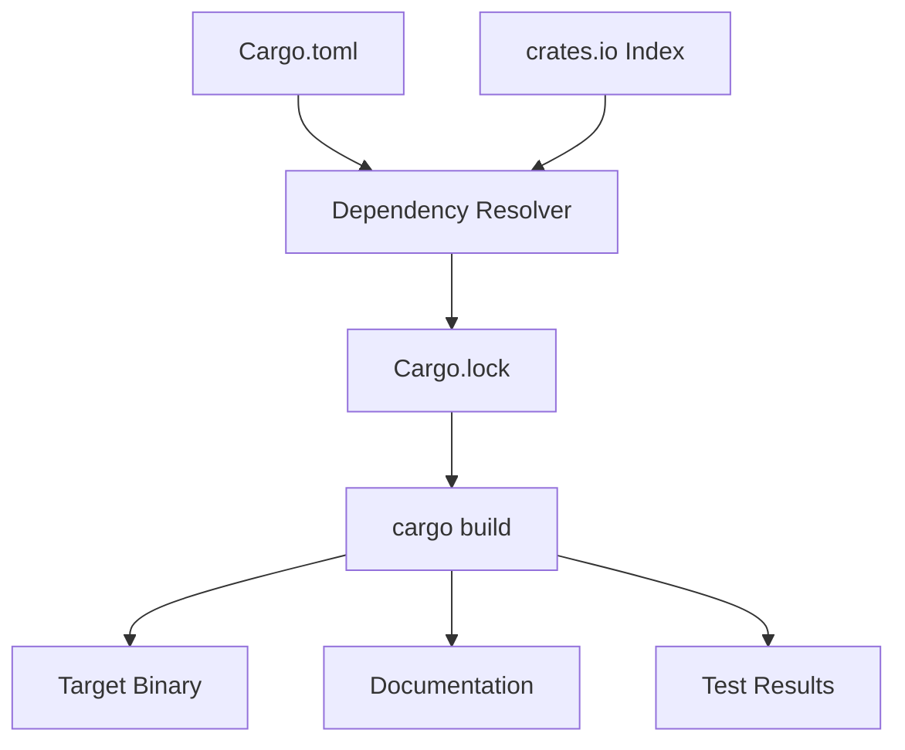
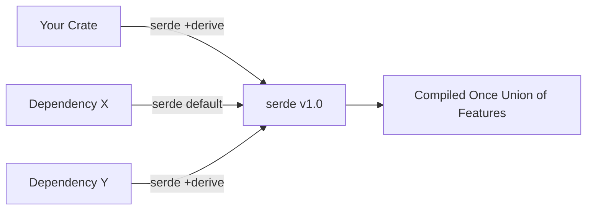
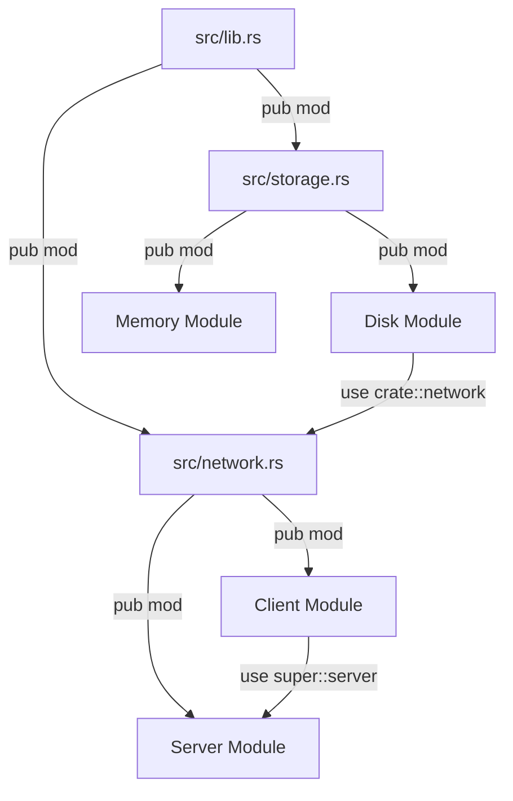
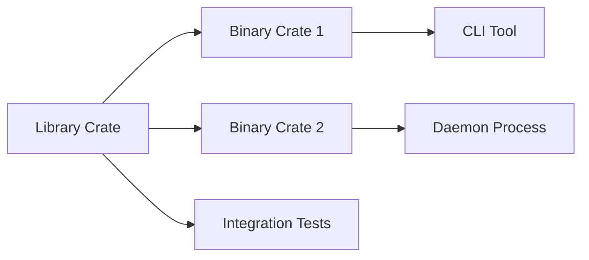
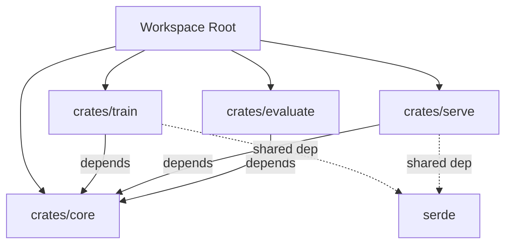
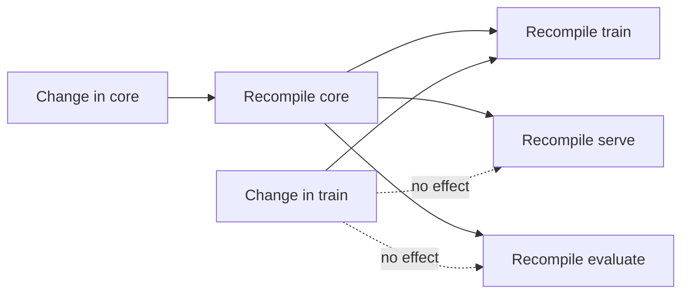

# 📦 Cargo, Crates, and the Module System

## 🎯 Learning Objectives

By the end of this module, you will be able to:

- Create, build, test, and publish Rust projects using Cargo
- Distinguish between binary crates, library crates, and packages
- Structure code using modules to control visibility and encapsulation
- Manage multi-crate projects with workspaces and shared dependencies
- Apply Rust's project tooling to ML/AI workflows such as model packaging and feature pipelines

## Introduction

Rust's tooling ecosystem is centered around Cargo, a build system and package manager that handles compilation, dependency resolution, testing, and distribution. Unlike C++ where build systems vary by project (Make, CMake, Bazel), or JavaScript's npm-centric but fragmented tooling, Cargo provides a unified, batteries-included experience that works consistently across the entire Rust ecosystem. For ML engineers, this consistency is critical: a model serving binary, a feature store library, and a data preprocessing CLI can all live in the same workspace, sharing dependencies and building with a single command.

The module system defines how code is organized and encapsulated within a Rust project. It determines which items are public or private, how names are resolved, and how large codebases are decomposed into manageable units. Understanding modules, crates, and workspaces is essential for building anything beyond a single-file script. This module connects directly with [[01 - Ownership, Borrowing, and Lifetimes|memory-safe API design]] and [[02 - Types, Traits, and Generics|trait-driven abstractions]], because well-structured modules are how you expose safe interfaces while hiding implementation details.

## Module 1: Cargo and Dependency Management

### 1.1 Theoretical Foundation 🧠

Package management is a solved problem in theory but rarely in practice. Cargo embodies lessons from decades of software distribution: semantic versioning (SemVer) for compatibility guarantees, a central registry (crates.io) for discoverability, and lock files for reproducible builds. These ideas trace back to the **semantic versioning specification** and **dependency graph theory**, where resolving a set of version constraints is an instance of the constraint satisfaction problem.

Reproducible builds matter profoundly for ML systems. A model trained with one version of a linear algebra crate and deployed with another may produce slightly different embeddings due to numerical precision changes. By committing `Cargo.lock` for binaries, you ensure that every build—whether on a developer laptop or a CI server—uses exactly the same dependency versions. Cargo's resolver also performs feature unification, ensuring that if two crates depend on different feature sets of the same library, the union of features is compiled once.

### 1.2 Mental Model 📐

Cargo transforms declarative metadata into a deterministic build:

```
Cargo.toml          crates.io registry
     │                       │
     └──────────┬────────────┘
                ▼
        ┌───────────────┐
        │  Dependency   │
        │   Resolver    │
        └───────┬───────┘
                ▼
        ┌───────────────┐
        │  Cargo.lock   │
        │  (pinned)     │
        └───────┬───────┘
                ▼
        ┌───────────────┐
        │  cargo build  │
        └───────┬───────┘
                ▼
        ┌───────────────┐
        │  Binary or    │
        │  Library      │
        └───────────────┘
```

Feature flags act as compile-time switches:

```
crate: tokio
├─ feature "full" ──► enables all modules
├─ feature "rt"   ──► enables runtime only
└─ feature "net"  ──► enables networking
   Your crate requests "rt" + "net"
   Cargo unifies and compiles the union
```

### 1.3 Syntax and Semantics 📝

```toml
# WHY: [package] defines metadata for this package.
[package]
name = "ml-pipeline"
version = "1.0.0"
edition = "2021"
authors = ["ML Team <ml@example.com>"]

# WHY: [dependencies] declares external crates with SemVer ranges.
[dependencies]
serde = { version = "1.0", features = ["derive"] }
tokio = { version = "1", features = ["full"] }
ndarray = "0.15"

# WHY: dev-dependencies are only used for tests and benchmarks.
[dev-dependencies]
criterion = { version = "0.5", features = ["html_reports"] }

# WHY: [profile.release] tunes compiler optimizations.
[profile.release]
lto = true       # Link-time optimization
codegen-units = 1 # Slower compile, faster binary
```

Key Cargo commands:

```bash
# WHY: Create a new binary project.
cargo new my-app

# WHY: Build in development mode (fast compile, debug assertions).
cargo build

# WHY: Build with optimizations for deployment.
cargo build --release

# WHY: Run the test suite.
cargo test

# WHY: Generate and open documentation.
cargo doc --open

# WHY: Pin dependencies to latest compatible versions.
cargo update
```

### 1.4 Visual Representation 🖼️

Dependency resolution and build pipeline:



Feature unification across a dependency tree:



Software packaging and architecture context:

- [Software Packaging](https://commons.wikimedia.org/wiki/File:Overview_of_a_three-tier_application_vectorVersion.svg)
- [System Architecture](https://commons.wikimedia.org/wiki/File:Computer_system_bus.svg)

### 1.5 Application in ML/AI Systems 🤖

| Case Study | Cargo Feature | ML/AI Impact |
|---|---|---|
| Burn framework | Workspace with backend crates | CPU, CUDA, and WGPU backends in one repo |
| Tokenizers crate | Feature flags for bindings | Python, Node, and Rust APIs from one codebase |
| ONNX Runtime Rust | cargo publish for bindings | Reproducible deployment of inference binaries |
| Data validation | dev-dependencies for property testing | QuickCheck-style tests on feature pipelines |

### 1.6 Common Pitfalls ⚠️

⚠️ **Warning 1:** For applications, always commit `Cargo.lock` to version control. Without it, downstream builds may pull in newer patch versions that introduce subtle behavioral changes. For libraries, do not commit `Cargo.lock`—downstream users must resolve their own dependency graphs.

⚠️ **Warning 2:** Feature flags are unified across the entire dependency graph. Enabling a feature in one crate automatically enables it for all users of that crate in the build. This can unexpectedly bloat binaries or enable insecure features. Audit your dependency tree with `cargo tree -e features`.

💡 **Tip:** Always specify the `edition` in `Cargo.toml`. The edition determines language features and syntax. The 2021 edition introduced disjoint capture in closures and consistent `panic!` macros, which reduce subtle bugs.

### 1.7 Knowledge Check ❓

1. Why is `Cargo.lock` essential for reproducible builds in ML model serving binaries?
2. What is feature unification, and how can it cause unexpected binary bloat?
3. When should you use `dev-dependencies` instead of regular `dependencies`?

## Module 2: Crates and the Module System

### 2.1 Theoretical Foundation 🧠

The module system in Rust is a direct descendant of **Modula-2** and the **ML module system**, refined through decades of research into information hiding and namespace management. A crate is the smallest unit of compilation: the compiler begins at a single root file (`main.rs` or `lib.rs`) and recursively resolves modules. Visibility is opt-in: every item is private by default, and the programmer explicitly grants access via `pub`. This design inverts the default of many languages (e.g., Python, JavaScript) where everything is public unless hidden, reducing accidental API surface area.

Modules serve two purposes: they control **visibility** (who can see what) and **namespacing** (how names are resolved). In ML systems, this maps naturally to pipeline stages: a `data_loader` module exposes a public `load_batch` function while keeping its internal caching strategy private. This encapsulation prevents downstream code from depending on implementation details that may change.

### 2.2 Mental Model 📐

A crate is a tree rooted at `src/lib.rs` or `src/main.rs`:

```
src/lib.rs (crate root)
│
├─ pub mod config;     ──► src/config.rs
│   └─ pub struct Settings;
│
├─ pub mod engine;     ──► src/engine/mod.rs
│   ├─ pub mod parser; ──► src/engine/parser.rs
│   └─ pub mod renderer;
│
└─ mod utils;          ──► src/utils.rs
    └─ pub fn sanitize(); (visible to parent only)
```

Visibility levels form concentric circles:

```
pub          ──► visible everywhere
pub(crate)   ──► visible within current crate
pub(super)   ──► visible to parent module
pub(in path) ──► visible within specific path
(private)    ──► visible only in current module
```

### 2.3 Syntax and Semantics 📝

```rust
// src/lib.rs
// WHY: mod declares a module; pub makes it public.
pub mod config;
pub mod engine;
pub mod utils;

// Re-export selected items for convenience.
pub use config::Settings;
pub use engine::Processor;

// src/config.rs
// WHY: pub struct makes the type visible outside the module.
pub struct Settings {
    pub timeout: u64,
    pub max_connections: usize,
}

// src/engine/mod.rs
pub mod parser;
pub mod renderer;

use crate::config::Settings;

pub struct Processor {
    settings: Settings, // private field
}

impl Processor {
    pub fn new(settings: Settings) -> Self {
        Processor { settings }
    }
    
    pub fn process(&self, input: &str) -> String {
        let parsed = parser::parse(input);
        renderer::render(&parsed, self.settings.timeout)
    }
}

// src/engine/parser.rs
pub struct ParsedData {
    pub tokens: Vec<String>,
}

pub fn parse(input: &str) -> ParsedData {
    ParsedData {
        tokens: input.split_whitespace().map(String::from).collect(),
    }
}

// src/utils.rs
// WHY: Not pub, so only visible within utils and its children.
fn internal_helper() {}

pub fn sanitize(input: &str) -> String {
    input.trim().to_lowercase()
}
```

### 2.4 Visual Representation 🖼️

Module hierarchy and visibility flow:



Software architecture decomposition:



Illustrations of modularity:

- [Software Architecture Diagram](https://commons.wikimedia.org/wiki/File:Overview_of_a_three-tier_application_vectorVersion.svg)
- [System Bus](https://commons.wikimedia.org/wiki/File:Computer_system_bus.svg)

### 2.5 Application in ML/AI Systems 🤖

| Case Study | Module Pattern | ML/AI Impact |
|---|---|---|
| Polars | crate::series, crate::frame | Clear separation between column and row abstractions |
| Burn | burn::train, burn::nn | Training loop separated from layer definitions |
| Tokenizers | mod normalizers, mod pre_tokenizers | Pipeline stages hidden behind stable public APIs |
| Feature Store | pub(crate) ingestion modules | Internal batching logic invisible to serving layer |

### 2.6 Common Pitfalls ⚠️

⚠️ **Warning 1:** Visibility is module-based, not file-based. A `pub` item inside a non-public module is still invisible outside the parent. You must mark every module in the path as `pub` (or re-export) for an item to be reachable from external crates.

⚠️ **Warning 2:** The `mod.rs` file style (`src/engine/mod.rs`) is still valid but the `src/engine.rs` style (Rust 2018+) is preferred for flat hierarchies. Mixing both styles in the same project creates confusing directory structures.

💡 **Tip:** Use `pub use` to create a clean facade for your crate. Re-export the most important types at the crate root so that users can write `use my_crate::Settings;` instead of drilling down through internal module paths.

### 2.7 Knowledge Check ❓

1. What is the difference between `pub`, `pub(crate)`, and `pub(super)`?
2. Why does Rust default to private visibility, and how does this benefit large ML codebases?
3. How does the `use` keyword differ from the `mod` keyword?

## Module 3: Workspaces and Scaling

### 3.1 Theoretical Foundation 🧠

As Rust projects grow, compiling a single monolithic crate becomes slow and unwieldy. Workspaces address this by allowing multiple related packages to share a single `Cargo.lock` file and target directory. This concept mirrors **monorepo** strategies used at Google and Meta, where code ownership is distributed but builds are unified. In dependency graph terms, a workspace is a connected component of crates with shared version constraints.

Workspaces also enable incremental compilation and parallel crate builds. Because each crate is compiled as a separate unit, changes to one crate do not force recompilation of unrelated crates. For ML systems, this means a data preprocessing library can be developed independently from a model serving binary, yet both are built and tested together with `cargo test --workspace`.

### 3.2 Mental Model 📐

A workspace acts as a umbrella over multiple crates:

```
my-ml-platform/
├── Cargo.toml          (workspace root)
├── Cargo.lock          (shared lockfile)
├── crates/
│   ├── core/           (library: shared types)
│   ├── train/          (binary: training pipeline)
│   ├── serve/          (binary: model server)
│   └── evaluate/       (binary: benchmarking)
└── tests/              (integration tests across crates)
```

Shared dependencies reduce duplication:

```
Workspace Cargo.toml
├─ serde = "1.0"
├─ tokio = "1"
└─ ndarray = "0.15"
   │
   ▼
Each member references workspace deps:
crates/train/Cargo.toml: serde = { workspace = true }
crates/serve/Cargo.toml: serde = { workspace = true }
```

### 3.3 Syntax and Semantics 📝

```toml
# Cargo.toml (workspace root)
[workspace]
members = [
    "crates/core",
    "crates/train",
    "crates/serve",
    "crates/evaluate",
]

[workspace.dependencies]
serde = { version = "1.0", features = ["derive"] }
tokio = "1"
ndarray = "0.15"

# crates/train/Cargo.toml
[package]
name = "train"
version = "0.1.0"

[dependencies]
serde = { workspace = true }
core = { path = "../core" }
```

Cross-crate usage in Rust:

```rust
// crates/train/src/main.rs
// WHY: Path dependencies link local crates during development.
use core::ModelConfig;

fn main() {
    let config = ModelConfig::default();
    println!("Training with {:?}", config);
}
```

Build commands for workspaces:

```bash
# WHY: Build every crate in the workspace.
cargo build --workspace

# WHY: Run tests for all members.
cargo test --workspace

# WHY: Build only one member.
cargo build -p train

# WHY: Check the workspace without producing binaries.
cargo check --workspace
```

### 3.4 Visual Representation 🖼️

Workspace dependency graph:



Incremental compilation boundaries:



Distributed systems and architecture context:

- [Distributed System](https://commons.wikimedia.org/wiki/File:Overview_of_a_three-tier_application_vectorVersion.svg)
- [System Architecture](https://commons.wikimedia.org/wiki/File:Computer_system_bus.svg)

### 3.5 Application in ML/AI Systems 🤖

| Case Study | Workspace Pattern | ML/AI Impact |
|---|---|---|
| Burn framework | burn-core, burn-train, burn-cuda | Independent backend development with unified releases |
| Hugging Face Tokenizers | Workspace with Python bindings crate | Rust core and language bindings versioned together |
| Polars | polars-core, polars-lazy, polars-io | Lazy evaluation and I/O separated from core DataFrame |
| ML Platform | feature-store, model-registry, serving | Monorepo with shared domain types in core crate |

### 3.6 Common Pitfalls ⚠️

⚠️ **Warning 1:** Cyclic dependencies between workspace crates are forbidden. If crate A depends on crate B and crate B depends on crate A, Cargo cannot determine a build order. Refactor shared types into a third `core` crate that both depend on.

⚠️ **Warning 2:** Workspace feature unification can cause feature flags from one member to leak into another. If `train` enables `serde`'s `alloc` feature and `serve` does not, the unified build still includes `alloc`. This can introduce unexpected code size or security surface area.

💡 **Tip:** Keep workspace members loosely coupled through a small `core` or `domain` crate that defines shared types and traits. Business logic should live in specialized crates that depend on `core`, not on each other.

### 3.7 Knowledge Check ❓

1. What are the benefits of a shared `Cargo.lock` file across a workspace?
2. Why are cyclic dependencies between workspace crates forbidden, and how should you refactor to avoid them?
3. How does workspace-level dependency management reduce version drift in large ML projects?

## 📦 Compression Code

The following workspace example demonstrates a compression library crate and a CLI binary crate linked through a workspace. It illustrates path dependencies, trait-based APIs across crates, and workspace compilation.

```rust
// crates/compress/src/lib.rs
pub mod algorithms;

pub trait Encoder {
    fn encode(&self, data: &[u8]) -> Vec<u8>;
    fn name(&self) -> &'static str;
}

pub fn encode_with<E: Encoder>(data: &[u8], encoder: E) -> Vec<u8> {
    encoder.encode(data)
}

pub fn default_encoder() -> impl Encoder {
    algorithms::rle::RleEncoder::new()
}

// crates/compress/src/algorithms/mod.rs
pub mod rle;

// crates/compress/src/algorithms/rle.rs
use crate::Encoder;

pub struct RleEncoder;

impl RleEncoder {
    pub fn new() -> Self { RleEncoder }
}

impl Encoder for RleEncoder {
    fn encode(&self, data: &[u8]) -> Vec<u8> {
        let mut result = Vec::new();
        if data.is_empty() { return result; }
        let mut current = data[0];
        let mut count = 1u8;
        for &byte in &data[1..] {
            if byte == current && count < 255 {
                count += 1;
            } else {
                result.push(current);
                result.push(count);
                current = byte;
                count = 1;
            }
        }
        result.push(current);
        result.push(count);
        result
    }
    
    fn name(&self) -> &'static str {
        "RLE"
    }
}

// crates/cli/src/main.rs
use compress::{default_encoder, encode_with};
use std::env;
use std::fs;

fn main() {
    let args: Vec<String> = env::args().collect();
    if args.len() < 2 {
        eprintln!("Usage: {} <file>", args[0]);
        std::process::exit(1);
    }
    let data = fs::read(&args[1]).expect("Failed to read file");
    let encoder = default_encoder();
    let compressed = encode_with(&data, encoder);
    println!("Original: {} bytes", data.len());
    println!("Compressed: {} bytes", compressed.len());
}
```

## 🎯 Documented Project

### Description

Build a **Modular Plugin System** using Cargo workspaces. The project consists of a core library crate that defines a plugin trait, multiple plugin implementation crates, and a binary crate that loads and executes plugins. Each plugin is compiled as a separate crate but linked into a single workspace, demonstrating cross-crate trait implementations and workspace-level testing.

### Functional Requirements

1. A `plugin-sdk` library crate defining a `Plugin` trait with `name()` and `execute()` methods.
2. At least two plugin crates (`plugin-logger`, `plugin-metrics`) implementing the trait.
3. A `plugin-host` binary that discovers and runs all available plugins.
4. Workspace-level dependency management for shared libraries.
5. Integration tests at the workspace root verifying plugin interoperability.

### Main Components

- `plugin-sdk`: Core trait definitions and shared types.
- `plugin-logger`: File and console logging plugin.
- `plugin-metrics`: Metrics collection and reporting plugin.
- `plugin-host`: Binary crate loading and executing plugins.
- `tests/`: Integration tests spanning multiple crates.

### Success Metrics

- Adding a new plugin requires only creating a new crate and implementing the trait.
- The host binary can enumerate all plugins without hardcoding their names (use a registry pattern).
- Workspace builds successfully with `cargo build --workspace`.
- Cross-crate type safety is enforced by the compiler.
- `cargo test --workspace` passes with zero warnings.

### References

- [The Cargo Book](https://doc.rust-lang.org/cargo/)
- [The Rust Reference - Modules](https://doc.rust-lang.org/reference/items/modules.html)
- [Crates.io](https://crates.io/)
- [Wikimedia Commons - Software Architecture](https://commons.wikimedia.org/wiki/File:Overview_of_a_three-tier_application_vectorVersion.svg)
- [Wikimedia Commons - System Bus](https://commons.wikimedia.org/wiki/File:Computer_system_bus.svg)
