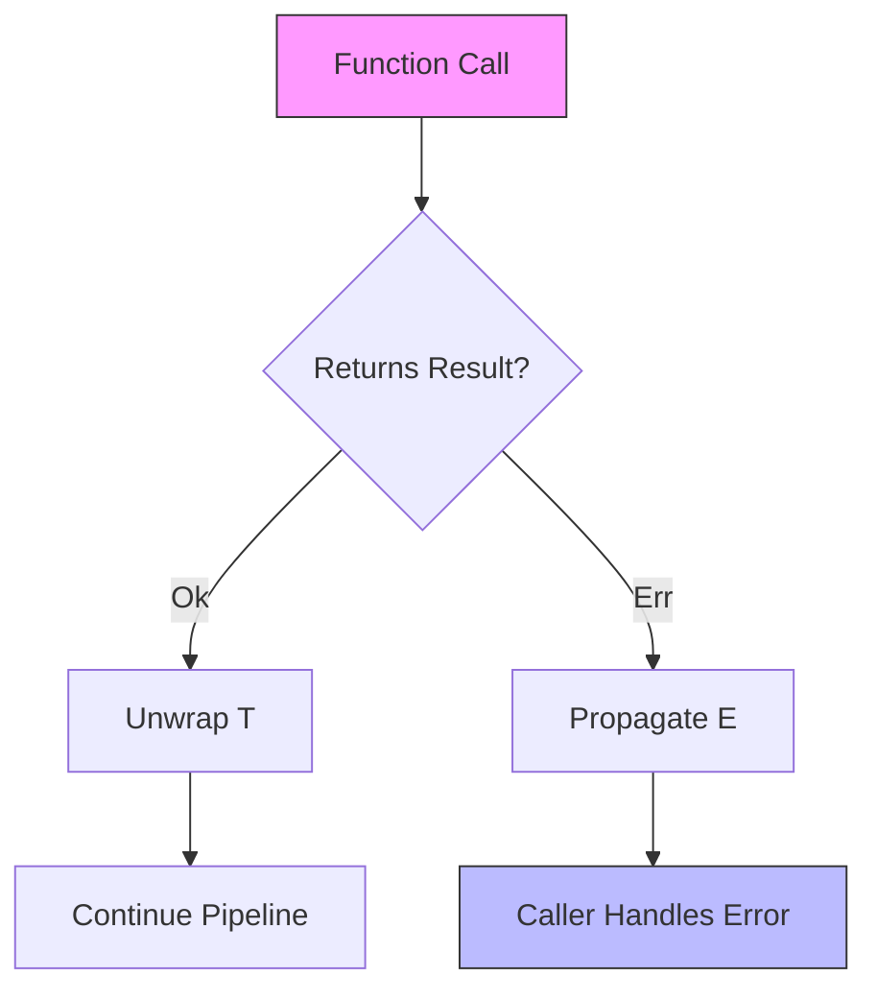
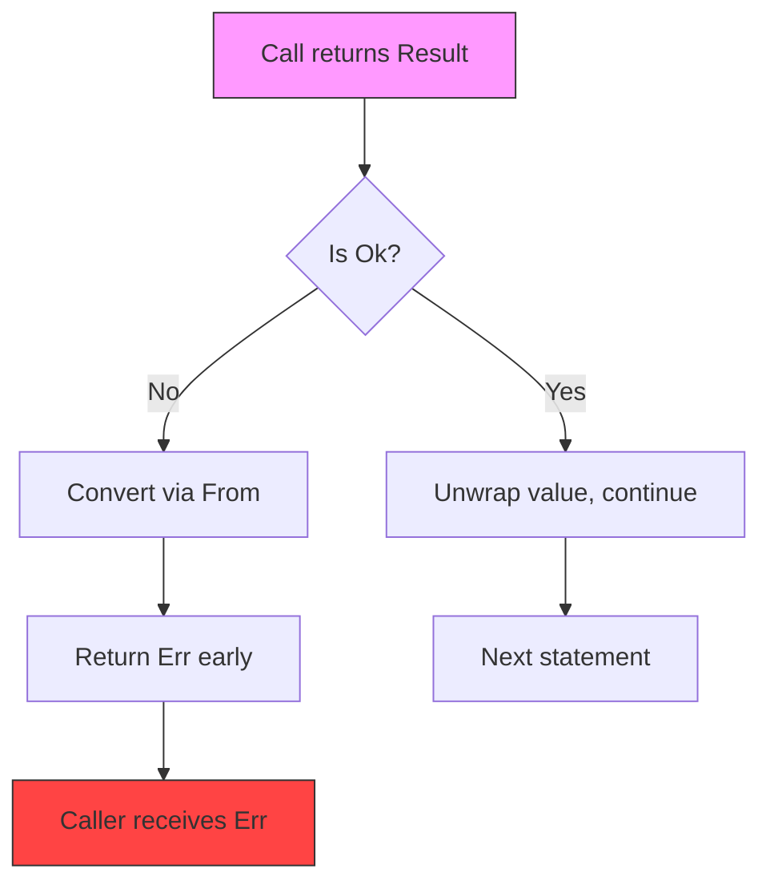
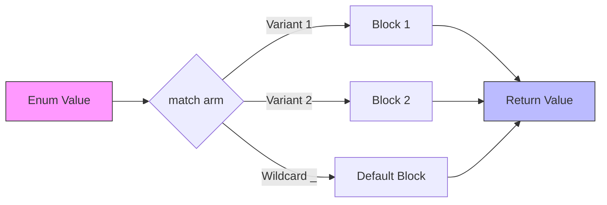
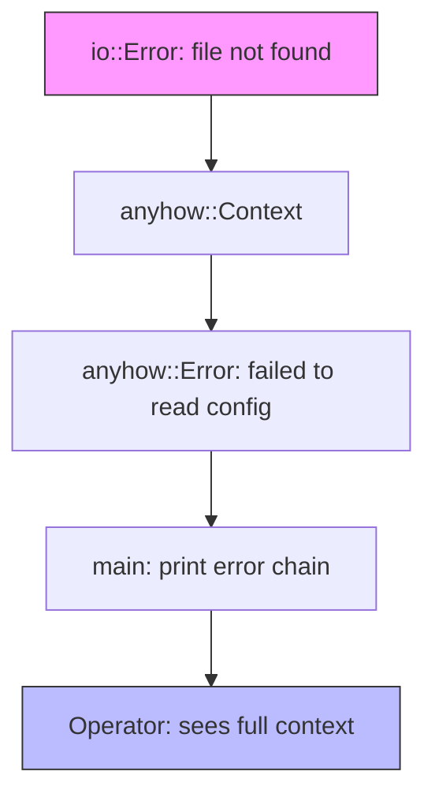

# 🛡️ Error Handling and Pattern Matching

## 🎯 Learning Objectives

By the end of this module, you will be able to:

- Distinguish between recoverable errors (`Result<T, E>`) and optional values (`Option<T>`) using type-theoretic reasoning.
- Propagate failures ergonomically with the `?` operator while preserving error context.
- Leverage exhaustive pattern matching to enforce total functions over algebraic data types.
- Design structured error hierarchies with `thiserror` and `anyhow` for library and application boundaries.
- Apply these patterns to build resilient ML/AI data pipelines that fail fast and report precisely.

## Introduction

Modern machine learning systems are brittle not because models are inaccurate, but because data pipelines silently swallow malformed inputs, missing files, or shape mismatches. Rust's approach to error handling—encoding failure directly into the type system—transforms these runtime surprises into compile-time obligations. When a tokenizer cannot decode a byte sequence, or a feature store returns an empty slice, the resulting `Result` or `Option` forces the caller to acknowledge the possibility of failure before proceeding. This aligns with the robustness principle for AI infrastructure: be explicit about uncertainty.

Pattern matching is the complement to these explicit types. Where other languages offer `switch` statements that fall through by default, Rust's `match` is an expression that demands totality: every variant must have a corresponding arm. For ML practitioners, this means that adding a new label to an enum—say, a new token type or a new model format variant—triggers compiler-guided updates across every site that inspects the value. The combination of [[Result<T,E>]] and [[Pattern Matching]] creates self-documenting, refactor-resistant codebases that scale from research notebooks to production serving layers.

In distributed training and inference, errors are not exceptional; they are expected. A shard may be corrupted, a GPU may run out of memory, or a schema may drift. By treating errors as ordinary values that compose through monadic operators, Rust allows AI systems to degrade gracefully rather than panic opaquely. This module explores the theoretical foundations, mental models, and production patterns that make Rust error handling a competitive advantage for [[Machine Learning Systems]].

## Module 1: Algebraic Error Types

### 1.1 Theoretical Foundation 🧠

The theoretical roots of Rust's error types lie in algebraic data types (ADTs) and the elimination of null references. In 1965, Tony Hoare introduced null into ALGOL W, later calling it his "billion-dollar mistake" because it conflated the absence of a value with the presence of a sentinel. ML and Haskell addressed this with the `option` and `Either` types, respectively. Rust's `Option<T>` and `Result<T, E>` are direct descendants: they are *sum types* (tagged unions) that force the programmer to handle both variants.

From a type-theoretic perspective, `Result<T, E>` corresponds to the sum `T + E`. The `?` operator is syntactic sugar for monadic bind (`>>=`) on this sum type, collapsing nested error handling into linear control flow. This design ensures that the error domain is always visible in the function signature, a property known as **signature transparency** that is essential for API stability in large ML frameworks.

### 1.2 Mental Model 📐

Visualize `Result<T, E>` as a railway switch where every function call is a junction:

```
┌─────────────────────────────────────────────┐
│           Result<T, E> Railway              │
├───────────────────┬─────────────────────────┤
│                   │                         │
│   Ok(T) Track     │     Err(E) Track        │
│   ───────────►    │     ───────────►        │
│   Continue with T │     Return early to     │
│                   │     caller with E       │
│                   │                         │
└───────────────────┴─────────────────────────┘
```

Similarly, `Option<T>` is a switch between presence and absence:

```
┌─────────────────────────────────────────────┐
│           Option<T> Switch                  │
├───────────────────┬─────────────────────────┤
│                   │                         │
│   Some(T)         │     None                │
│   ┌─────┐         │     ┌─────┐             │
│   │  T  │────────►│     │ ∅   │────────►    │
│   └─────┘         │     └─────┘    Skip or  │
│   Unwrap and use  │              provide default│
│                   │                         │
└───────────────────┴─────────────────────────┘
```

### 1.3 Syntax and Semantics 📝

```rust
// WHY: Enums make error cases part of the public API.
// Callers cannot ignore them without explicit unsafe code.
enum Result<T, E> {
    Ok(T),
    Err(E),
}

enum Option<T> {
    Some(T),
    None,
}

// WHY: Using ? collapses nested match blocks into readable linear flow.
fn read_model_config(path: &str) -> Result<ModelConfig, io::Error> {
    let text = std::fs::read_to_string(path)?; // Early return on Err
    let config: ModelConfig = serde_json::from_str(&text)?; // Propagate parse error
    Ok(config)
}

// WHY: map transforms success values without unwrapping.
let maybe_batch_size: Option<usize> = Some(32);
let doubled = maybe_batch_size.map(|b| b * 2); // Some(64)
```

### 1.4 Visual Representation 🖼️




### 1.5 Application in ML/AI Systems 🤖

| System | Pattern | ML/AI Benefit |
|---|---|---|
| Hugging Face tokenizers | `Result<Encoding, Error>` | Invalid UTF-8 in training data fails fast at the source |
| ONNX Runtime Rust API | `Result<Session, Status>` | Model initialization errors surface before inference begins |
| Tch-rs (PyTorch bindings) | `Option<Tensor>` | Missing indices return `None` instead of causing a segfault |

### 1.6 Common Pitfalls ⚠️

> **Warning:** Using `unwrap()` in data preprocessing pipelines crashes the entire training job on the first malformed sample. Prefer `?` or `match` and log the offending record.

> **Warning:** Ignoring a `Result` with `let _ = file.write_all(buf);` silently drops I/O errors during model checkpointing, leading to corrupted saves.

> **Tip:** Use `Result::map_err` to attach domain-specific context (e.g., shard filename) before propagating a low-level error up to the orchestrator.

### 1.7 Knowledge Check ❓

1. Why is `Result<T, E>` preferable to exceptions when running batch inference across thousands of input shards?
2. What does the compiler do if you add a new variant to an enum but forget to update an existing `match` expression?
3. When should you choose `Option<T>` over a sentinel value such as `-1` or an empty string?

## Module 2: Error Propagation and the Try Mechanism

### 2.1 Theoretical Foundation 🧠

The `?` operator, stabilized in Rust 1.13 and generalized by the `FromResidual` trait in Rust 1.56, is a zero-cost abstraction over control-flow graphs. Its lineage traces back to Haskell's `Monad` typeclass and the `do`-notation that sequences fallible computations. In Rust, `?` desugars to a `match` that returns `Err(From::from(e))` on failure and continues with the unwrapped value on success.

This mechanism preserves the **structural typing** of errors: a function may declare a unified error type, yet individual calls within its body may produce distinct lower-level errors, provided each implements `From<LowerError>`. For ML systems, this means a data loader can return a single `DataLoadError` while internally handling `io::Error`, `serde_json::Error`, and `ParseError` without manual conversion boilerplate.

### 2.2 Mental Model 📐

Imagine `?` as an automated elevator that sends errors straight to the caller:

```
┌─────────────────────────────────────────────┐
│  Caller: load_dataset()                     │
│  ┌───────────────────────────────────────┐  │
│  │  open_file(path)?                     │  │
│  │     │                                 │  │
│  │     ▼ Err                             │  │
│  │  ┌─────────┐                          │  │
│  │  │ Elevator│──────────────────────────┼──┼──► Returns Err immediately
│  │  └─────────┘                          │  │
│  │     │ Ok                              │  │
│  │     ▼                                 │  │
│  │  parse_header()? ──► Elevator ────────┼──┼──► Same behavior
│  │     │ Ok                              │  │
│  │     ▼                                 │  │
│  │  return Ok(dataset)                   │  │
│  └───────────────────────────────────────┘  │
└─────────────────────────────────────────────┘
```

### 2.3 Syntax and Semantics 📝

```rust
use std::io;

// WHY: A unified error enum lets callers match on high-level categories
// while the ? operator handles low-level conversions automatically.
#[derive(Debug)]
enum PipelineError {
    Io(io::Error),
    Parse(String),
}

impl From<io::Error> for PipelineError {
    fn from(e: io::Error) -> Self {
        PipelineError::Io(e)
    }
}

fn process_shard(path: &str) -> Result<Vec<f64>, PipelineError> {
    let raw = std::fs::read_to_string(path)?; // io::Error -> PipelineError
    let values: Vec<f64> = raw
        .lines()
        .map(|line| line.parse().map_err(|e| PipelineError::Parse(format!("{}", e))))
        .collect::<Result<_, _>>()?; // Collect stops on first Err
    Ok(values)
}

// WHY: and_then chains fallible steps without nesting.
let maybe = Some(10);
let result = maybe.and_then(|x| Some(x * 2)).and_then(|x| Some(x + 1));
```

### 2.4 Visual Representation 🖼️




### 2.5 Application in ML/AI Systems 🤖

| Pipeline Stage | Pattern | Benefit |
|---|---|---|
| Data loading | `?` on file reads | Corrupt shard fails the epoch early with a precise path |
| Feature extraction | `Result::map` | Transformations chain without deeply nested `match` blocks |
| Model serving | `anyhow::Context` | Attach request IDs to low-level I/O errors for distributed tracing |

### 2.6 Common Pitfalls ⚠️

> **Warning:** Mixing incompatible error types without a `From` implementation produces cryptic type mismatch errors at the `?` site. Always implement `From` or use `.map_err()`.

> **Warning:** Using `?` inside a closure passed to `Iterator::map` does not propagate to the outer function because closures are separate control-flow boundaries. Use `try_map` or `filter_map` instead.

> **Tip:** Implement `From<MyError>` for `anyhow::Error` once at the crate root to enable `?` in every application module without further conversion.

### 2.7 Knowledge Check ❓

1. What trait does the `?` operator rely on to convert between error types?
2. Why is `?` permitted in `main` since Rust 1.26, and what return type does `main` need?
3. How does `map_err` differ from `?` in terms of control flow?

## Module 3: Exhaustive Pattern Matching

### 3.1 Theoretical Foundation 🧠

Pattern matching originated in functional languages such as SML, OCaml, and Haskell, where it serves as the primary means of decomposing sum and product types. Mathematically, a pattern is a partial inverse of a constructor: it maps a value back to the arguments used to create it. Rust extends this with *exhaustiveness checking*, which guarantees that a `match` expression covers every inhabitant of the matched type. This makes Rust `match` a tool for writing **total functions**—functions defined for all inputs—which is a cornerstone of reliable systems.

In contrast to C-style `switch` statements, where missing a case is a silent bug, Rust's compiler rejects programs with non-exhaustive patterns. For ML engineers, this is invaluable when evolving label schemas, model format versions, or protocol states: the compiler becomes a refactoring assistant that prevents partial handling.

### 3.2 Mental Model 📐

Pattern matching is a routing table for data:

```
Incoming Value: Coin::Quarter("NY")
              │
              ▼
┌─────────────────────────────────────────────┐
│              match coin {                   │
│  ┌──────────────┬────────────────────────┐  │
│  │ Penny        │ ──────► 1 cent         │  │
│  │ Nickel       │ ──────► 5 cents        │  │
│  │ Dime         │ ──────► 10 cents       │  │
│  │ Quarter(st)  │ ──────► 25 + print(st) │  │
│  └──────────────┴────────────────────────┘  │
└─────────────────────────────────────────────┘
```

Destructuring unpacks nested shapes in a single expression:

```
┌─────────────────────────────────────────────┐
│  match point {                              │
│    Point { x, y: 0 } ► "On x-axis"         │
│    Point { x: 0, y } ► "On y-axis"         │
│    Point { x, y }    ► "At ({}, {})"       │
│  }                                          │
└─────────────────────────────────────────────┘
```

### 3.3 Syntax and Semantics 📝

```rust
// WHY: match is an expression, so it returns a value.
// The compiler verifies every variant is handled.
enum Coin {
    Penny,
    Nickel,
    Dime,
    Quarter(String),
}

fn value(coin: Coin) -> u8 {
    match coin {
        Coin::Penny => 1,
        Coin::Nickel => 5,
        Coin::Dime => 10,
        Coin::Quarter(state) => {
            println!("State quarter from {:?}!", state);
            25
        }
    }
}

// WHY: if let reduces boilerplate when only one variant matters.
if let Some(3) = some_value {
    println!("Three");
}

// WHY: while let consumes an iterator until exhaustion.
while let Some(value) = stack.pop() {
    println!("{}", value);
}

// WHY: Guards add runtime predicates without nested logic.
match age {
    0 => println!("Newborn"),
    n if n < 13 => println!("Child"),
    20..=65 => println!("Adult"),
    _ => println!("Senior"),
}
```

### 3.4 Visual Representation 🖼️




### 3.5 Application in ML/AI Systems 🤖

| Use Case | Pattern | Benefit |
|---|---|---|
| Token classification | `match token.label` | Compiler catches new label variants added after retraining |
| Decision tree traversal | `if let Some(node) = children.get(i)` | Safe optional child access without panicking on missing branches |
| Config schema validation | Destructuring nested JSON enums | Missing fields become compile-time errors when represented as structs |

### 3.6 Common Pitfalls ⚠️

> **Warning:** Adding a variant to a public enum in a library crate will break downstream `match` arms unless a wildcard `_ =>` arm exists. Plan migration with `#[non_exhaustive]`.

> **Warning:** Shadowing a variable inside a match arm (`let x = ...` inside `Coin::Penny => { let x = 1; }`) does not affect the outer scope, but using the same name in a pattern binding can confuse readers.

> **Tip:** Use `@` bindings (`value @ 1..=10`) to both test a pattern and capture the matched value for use in the arm body.

### 3.7 Knowledge Check ❓

1. What does the compiler do if a match arm is missing for an enum variant?
2. When is `if let` more idiomatic than a full `match` expression?
3. How do match guards (`if condition`) affect the exhaustiveness guarantee?

## Module 4: Production Error Types

### 4.1 Theoretical Foundation 🧠

Production error handling distinguishes between library and application boundaries. Libraries expose structured error enums so that callers can programmatically recover—retry on timeout, skip on parse failure, or fallback on missing data. Applications, by contrast, often only need to aggregate errors for logging and crash reporting. This dichotomy mirrors the **open/closed principle**: library errors are open for extension (new variants), while application errors are closed for modification (opaque contexts).

The `thiserror` crate automates the `Display` and `Error` trait implementations for library types, preserving enum structure. `anyhow` provides an opaque, context-rich error type for applications, enabling ergonomic `?` propagation without exposing internal implementation details. Together, they form a layered error architecture that is standard in the Rust ML ecosystem.

### 4.2 Mental Model 📐

A layered error stack separates concerns between library consumers and operators:

```
┌─────────────────────────────────────────────┐
│              Application Layer              │
│         anyhow::Result<Context>             │
├─────────────────────────────────────────────┤
│              Library Layer                  │
│  ┌──────────────┬────────────────────────┐  │
│  │  IoError     │  ParseError            │  │
│  │  (#[from])   │  (#[from])             │  │
│  ├──────────────┴────────────────────────┤  │
│  │  ConfigError { file, line }           │  │
│  └───────────────────────────────────────┘  │
├─────────────────────────────────────────────┤
│              Std Library                    │
│         io::Error  ParseIntError            │
└─────────────────────────────────────────────┘
```

### 4.3 Syntax and Semantics 📝

```rust
use thiserror::Error;

// WHY: thiserror generates Display and Error boilerplate,
// letting library consumers match on specific variants.
#[derive(Error, Debug)]
enum ModelError {
    #[error("IO failed: {0}")]
    Io(#[from] io::Error),
    
    #[error("Invalid hyperparameter: {name} = {value}")]
    Hyperparameter { name: String, value: String },
}

use anyhow::{Context, Result};

// WHY: anyhow is ideal for binaries where the caller only needs
// to log or report, not match on variants.
fn load_model(path: &str) -> Result<Model> {
    let bytes = std::fs::read(path)
        .with_context(|| format!("Failed to read model weights from {}", path))?;
    let model = bincode::deserialize(&bytes)
        .context("Weights corrupted or version mismatched")?;
    Ok(model)
}
```

### 4.4 Visual Representation 🖼️




### 4.5 Application in ML/AI Systems 🤖

| System | Crate | Benefit |
|---|---|---|
| Burn (ML framework) | `thiserror` | Consumers match on `BackendError` variants to select fallback devices |
| Linfa (ML toolkit) | `anyhow` in examples | Rapid experimentation without boilerplate error enums |
| TensorFlow Rust bindings | Custom error enum | Distinguishes graph construction errors from runtime session failures |

### 4.6 Common Pitfalls ⚠️

> **Warning:** Using `anyhow` in a public library API forces downstream crates to depend on `anyhow` and prevents programmatic error handling. Reserve `anyhow` for binaries and private internals.

> **Warning:** Deriving `#[from]` on every variant of a library error exposes low-level implementation details (e.g., `serde_json::Error`). Use `#[from]` only for stable, public error types.

> **Tip:** Provide a `source()` implementation manually when you need to hide internal error types but still want error-chain reporting for debugging.

### 4.7 Knowledge Check ❓

1. When should a library use `thiserror` instead of `anyhow`?
2. What does the `#[from]` attribute generate, and when is it appropriate?
3. How does `anyhow::Context` improve debugging in production pipelines?

## 📦 Compression Code

Complete Rust script demonstrating error handling and pattern matching:

```rust
use std::fs::File;
use std::io::{self, Read, Write};
use thiserror::Error;

// WHY: A structured error type makes every failure mode testable and loggable.
#[derive(Error, Debug)]
enum CompressError {
    #[error("IO error: {0}")]
    Io(#[from] io::Error),
    #[error("Empty input")]
    EmptyInput,
    #[error("Output larger than input: {input} -> {output}")]
    Ineffective { input: usize, output: usize },
}

fn compress(input_path: &str, output_path: &str) -> Result<usize, CompressError> {
    let mut input = Vec::new();
    File::open(input_path)?.read_to_end(&mut input)?;
    
    if input.is_empty() {
        return Err(CompressError::EmptyInput);
    }
    
    let mut output = Vec::new();
    let mut current = input[0];
    let mut count = 1u8;
    
    for &byte in &input[1..] {
        if byte == current && count < 255 {
            count += 1;
        } else {
            output.push(current);
            output.push(count);
            current = byte;
            count = 1;
        }
    }
    output.push(current);
    output.push(count);
    
    if output.len() > input.len() {
        return Err(CompressError::Ineffective {
            input: input.len(),
            output: output.len(),
        });
    }
    
    let mut file = File::create(output_path)?;
    file.write_all(&output)?;
    
    Ok(output.len())
}

fn main() {
    match compress("input.txt", "output.bin") {
        Ok(size) => println!("Compressed to {} bytes", size),
        Err(e) => {
            eprintln!("Compression failed: {}", e);
            std::process::exit(1);
        }
    }
}
```

## 🎯 Documented Project

### Description

Build a **Resilient Configuration Loader** that reads configuration from multiple sources (file, environment variables, command-line arguments) with layered overrides. The system must handle missing files gracefully, validate types strictly, and provide detailed error messages indicating exactly which source caused a failure.

### Functional Requirements

1. Read base configuration from a JSON file with `Result`-based error handling.
2. Apply environment variable overrides using `Option` and `if let`.
3. Parse command-line arguments and merge with existing config.
4. Validate that all required fields are present, returning structured errors.
5. Provide context in errors (e.g., "Failed to load config from /etc/app.conf: permission denied").

### Main Components

- `Config` struct: Represents the merged configuration.
- `FileSource`, `EnvSource`, `ArgSource`: Individual configuration sources.
- `ConfigError` enum: Structured errors with source attribution.
- `Loader`: Orchestrates sources and applies overrides.

### Success Metrics

- Missing optional config sources are handled gracefully without failure.
- Every error message identifies the source file, line, or variable involved.
- The loader never panics — all failure paths return `Result`.
- Invalid config values are caught at load time, not at use time.

### References

- [The Rust Programming Language - Error Handling](https://doc.rust-lang.org/book/ch09-00-error-handling.html)
- [The Rust Programming Language - Pattern Matching](https://doc.rust-lang.org/book/ch18-00-patterns.html)
- [thiserror crate](https://docs.rs/thiserror/latest/thiserror/)
- [anyhow crate](https://docs.rs/anyhow/latest/anyhow/)
- [AWS SDK for Rust Error Handling](https://github.com/awslabs/aws-sdk-rust)
