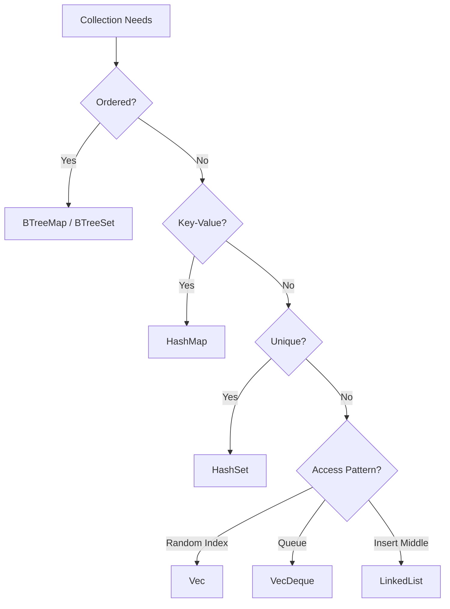
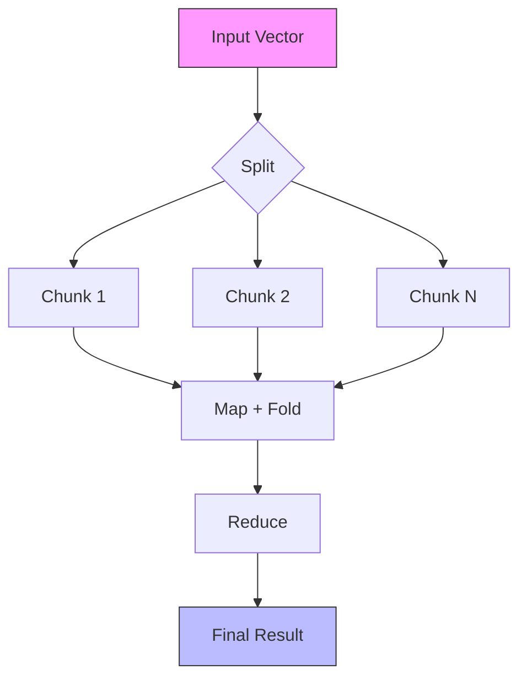

# 🗂️ Collections and Iterators

## 🎯 Learning Objectives

By the end of this module, you will be able to:

- Select the appropriate collection type based on algorithmic complexity and memory layout constraints.
- Manipulate sequences and associative containers using idiomatic Rust APIs such as `entry`, `extend`, and `split_off`.
- Implement the `Iterator` trait to create custom lazy streams over domain-specific data.
- Chain adapter methods to build fused, zero-cost data pipelines.
- Evaluate the performance characteristics of iterator fusion for ML/AI batch processing.

## Introduction

Machine learning is fundamentally a data-intensive discipline. Whether you are storing token embeddings in a vocabulary map, buffering a batch of images in a vector, or streaming sensor readings through a transformation pipeline, the choice of collection directly impacts latency, throughput, and memory safety. Rust's standard library provides a hierarchy of collections that are generics-aware, allocator-coupled, and optimized for cache locality—properties that translate into measurable speedups when training on large datasets.

Iterators are not merely a convenience in Rust; they are the canonical abstraction for sequential access. Because Rust's borrow checker proves at compile time that iterator adapters are side-effect free, libraries like Rayon can safely parallelize chains of `map`, `filter`, and `fold` with a single method call. This means that a data preprocessing pipeline written for a single core can scale to a multi-GPU training cluster without rewriting its core logic. Understanding [[Collections]] and [[Iterators]] is therefore essential for anyone building production-grade [[Machine Learning Systems]].

This module explores the theoretical underpinnings of common data structures, the mental models that guide their selection, and the iterator protocol that unifies them into a single composable interface. We will pay special attention to the zero-cost abstraction guarantee: high-level iterator chains compile down to loops that rival hand-written assembly, ensuring that your Python-fronted Rust backend delivers on its performance promises.

## Module 1: Linear Collections and Memory Layout

### 1.1 Theoretical Foundation 🧠

The study of collections begins with the random-access machine (RAM) model of computation. A `Vec<T>` is a dynamic array that amortizes insertion cost via geometric reallocation—typically doubling capacity on overflow. This strategy yields O(1) amortized push and O(1) indexing, making vectors the default choice for sequential data. The `VecDeque<T>` extends this model with a ring buffer, allowing O(1) insertion and removal at both ends, which is ideal for sliding windows in time-series analysis.

Linked lists, represented in Rust by `LinkedList<T>`, offer O(1) insertion at known positions but sacrifice cache locality and random access. In modern CPUs, cache misses dominate latency, which is why vectors outperform linked lists for most ML workloads, even when algorithms theoretically favor list mutation. The theoretical foundation here is the **memory hierarchy**: contiguous storage minimizes cache-line misses during vectorized operations.

### 1.2 Mental Model 📐

Vector layout on the heap:

```
Stack                      Heap
┌──────────┐              ┌─────┬─────┬─────┬─────┬────────┐
│ ptr      │─────────────►│ T0  │ T1  │ T2  │ T3  │ spare  │
│ len = 4  │              └─────┴─────┴─────┴─────┴────────┘
│ cap = 8  │                ▲     ▲     ▲     ▲
└──────────┘                │     │     │     │
                            └───┬──┴─────┘     │
                                │   contiguous  │
                                └───────────────┘
```

VecDeque ring buffer:

```
┌─────────────────────────────────────────────┐
│  [ , , A, B, C, D, , ]                     │
│       ▲        ▲                            │
│    head        tail                         │
│  (wrapping)   (wrapping)                    │
└─────────────────────────────────────────────┘
```

### 1.3 Syntax and Semantics 📝

```rust
// WHY: Pre-allocation avoids repeated reallocations when the size is known,
// e.g., allocating a batch buffer of exactly BATCH_SIZE.
let mut batch: Vec<f32> = Vec::with_capacity(64);
batch.extend([0.1, 0.2, 0.3]);
batch.push(0.4);

// WHY: get returns Option<&T>, forcing the caller to handle out-of-bounds
// instead of panicking—critical when indexing by model-predicted offsets.
let third = batch.get(2);

// WHY: VecDeque is the right choice for FIFO queues such as inference request buffers.
use std::collections::VecDeque;
let mut queue: VecDeque<Request> = VecDeque::new();
queue.push_back(req);
let next = queue.pop_front();
```

### 1.4 Visual Representation 🖼️




### 1.5 Application in ML/AI Systems 🤖

| System | Collection | ML/AI Benefit |
|---|---|---|
| Token vocabulary | `HashMap<String, u32>` | O(1) subword lookup during BPE tokenization |
| Embedding matrix | `Vec<Vec<f32>>` | Cache-friendly sequential access for batched lookups |
| Inference request queue | `VecDeque<Request>` | Low-latency FIFO scheduling on model servers |

### 1.6 Common Pitfalls ⚠️

> **Warning:** Using `LinkedList` for general-purpose sequences causes severe cache thrashing. Benchmark before choosing it over `Vec` or `VecDeque`.

> **Warning:** Indexing a `Vec` with `[idx]` panics on out-of-bounds. In ML pipelines where indices are model outputs, always use `.get()` to avoid crashing on unexpected inputs.

> **Tip:** Use `shrink_to_fit` after bulk loading to release excess capacity and reduce memory pressure on embedded devices.

### 1.7 Knowledge Check ❓

1. Why does `Vec::with_capacity` improve performance over repeated `push` on an empty vector?
2. When is `VecDeque` preferable to `Vec` for queue-like behavior?
3. What is the computational complexity of inserting into the middle of a `LinkedList` versus a `Vec`?

## Module 2: Associative Containers and Hashing

### 2.1 Theoretical Foundation 🧠

Associative containers map keys to values using either hash tables (`HashMap`, `HashSet`) or balanced trees (`BTreeMap`, `BTreeSet`). Hash tables rely on a collision-resistant hash function to distribute keys uniformly across an array of buckets. In the average case, insertion and lookup are O(1), but adversarial inputs or poor hash quality can degrade to O(n). Rust's `HashMap` uses SipHash-1-3 by default, providing resilience against Hash-DoS attacks at the cost of slightly slower throughput compared to non-cryptographic hashes.

B-trees, by contrast, guarantee O(log n) operations and maintain keys in sorted order. This makes `BTreeMap` ideal for range queries, prefix searches, and ordered iteration—operations common in feature stores that must retrieve all features within a timestamp window. The theoretical trade-off is therefore between average-case speed (hashing) and worst-case predictability plus ordering (B-tree).

### 2.2 Mental Model 📐

HashMap bucket array with chaining:

```
Index:   0       1       2       3
       ┌─────┐ ┌─────┐ ┌─────┐ ┌─────┐
       │None │ │ K,V │ │None │ │ K,V │──► (K2,V2)
       └─────┘ └─────┘ └─────┘ └─────┘
```

B-Tree node layout:

```
┌─────┬─────┬─────┬─────┐
│ K1  │ K2  │ K3  │ ... │
├─────┼─────┼─────┼─────┤
│ptr0 │ptr1 │ptr2 │ ... │
└─────┴─────┴─────┴─────┘
```

### 2.3 Syntax and Semantics 📝

```rust
use std::collections::HashMap;

// WHY: The entry API avoids redundant hash lookups when updating counts,
// which is essential for high-frequency token counting.
let mut counts: HashMap<char, usize> = HashMap::new();
for ch in "abracadabra".chars() {
    *counts.entry(ch).or_insert(0) += 1;
}

// WHY: BTreeMap preserves order for range scans, e.g., time-series windows.
use std::collections::BTreeMap;
let mut features: BTreeMap<u64, f32> = BTreeMap::new();
features.insert(1000, 0.5);
features.insert(2000, 0.8);
let window: Vec<_> = features.range(1500..2500).collect();
```

### 2.4 Visual Representation 🖼️


```mermaid
graph LR
    A[Hash Function] --> B[Bucket 0]
    A --> C[Bucket 1]
    A --> D[Bucket 2]
    A --> E[Bucket N]
    B --> F[(K,V) chain]
    C --> G[(K,V) chain]
    style A fill:#f9f,stroke:#333
    style D fill:#bbf,stroke:#333
```

### 2.5 Application in ML/AI Systems 🤖

| System | Container | ML/AI Benefit |
|---|---|---|
| Feature store | `BTreeMap<timestamp, Feature>` | Ordered range queries for sliding-window feature engineering |
| Label vocabulary | `HashMap<Label, u32>` | Fast inverse mapping from class name to integer index |
| Deduplicated training set | `HashSet<SampleHash>` | O(1) duplicate detection before expensive augmentation |

### 2.6 Common Pitfalls ⚠️

> **Warning:** `HashMap` keys must implement `Eq` and `Hash`. Floating-point keys are dangerous because `NaN != NaN`, violating the `Eq` contract and causing panics or incorrect bucket placement.

> **Warning:** Iteration order of a `HashMap` is non-deterministic. Do not assume stability across runs, as this makes tests flaky and distributed training non-reproducible.

> **Tip:** For `HashMap` with known size, call `HashMap::with_capacity(n)` to reduce rehashing overhead during bulk insertion of large vocabularies.

### 2.7 Knowledge Check ❓

1. Why does `BTreeMap` outperform `HashMap` for range queries?
2. What trait bounds are required for a custom struct to be used as a `HashMap` key?
3. How does the `entry` API improve performance compared to a `contains_key` followed by `insert`?

## Module 3: The Iterator Protocol

### 3.1 Theoretical Foundation 🧠

The iterator pattern decouples traversal from the underlying data structure, a concept formalized by the Gang of Four and later refined in functional programming as *internal iteration*. Rust's `Iterator` trait requires only one method: `next`, which returns `Option<Self::Item>`. All other methods—`map`, `filter`, `fold`, `collect`—are provided as default implementations built atop this single primitive.

This design satisfies the **open/closed principle**: new adapters can be added without modifying existing collections. The theoretical power of iterators lies in *fusion*: a chain of adapters compiles into a single loop with no intermediate allocations. In the RAM model, this reduces the operation count from O(k * n) across k temporary arrays to O(n) with O(1) extra space. For ML pipelines processing gigabyte-scale corpora, this guarantee means that a `map-filter-take` chain consumes constant memory regardless of input size.

### 3.2 Mental Model 📐

Iterator pipeline as a factory assembly line:

```
┌─────────┐   ┌─────────┐   ┌─────────┐   ┌─────────┐   ┌─────────┐
│ Source  │──►│  map    │──►│ filter  │──►│  take   │──►│  sum    │
│0..1M    │   │ x*2     │   │ x%3==0  │   │  first  │   │ eager   │
│ lazy    │   │ lazy    │   │ lazy    │   │  lazy   │   │ consumer│
└─────────┘   └─────────┘   └─────────┘   └─────────┘   └─────────┘
```

Adapter vs consumer distinction:

```
┌─────────────────────────────────────────────┐
│  Adapters (transform, do not consume)       │
│  map, filter, enumerate, zip, skip, flatten │
├─────────────────────────────────────────────┤
│  Consumers (evaluate, produce value)        │
│  collect, sum, fold, count, any, find       │
└─────────────────────────────────────────────┘
```

### 3.3 Syntax and Semantics 📝

```rust
// WHY: Adapters are lazy; nothing happens until a consumer is called.
let total: i32 = (0..1_000_000)
    .map(|x| x * 2)           // WHY: Transform each element in-place.
    .filter(|x| x % 3 == 0)   // WHY: Drop elements that fail the predicate.
    .take(100)                // WHY: Limit memory to a bounded window.
    .sum();                   // WHY: Eagerly evaluate the fused loop.

// WHY: collect gathers results into a concrete collection.
let squares: Vec<i32> = (1..=10).map(|x| x * x).collect();

// WHY: fold aggregates state without intermediate vectors.
let product = [1.0, 2.0, 3.0, 4.0].iter().fold(1.0, |a, b| a * b);
```

### 3.4 Visual Representation 🖼️


```mermaid
graph LR
    A[Source: 0..1000000] -->|map\|x\| x * 2| B[Transformed Stream]
    B -->|filter\|x\| x % 3 == 0| C[Filtered Stream]
    C -->|take 100| D[Limited Stream]
    D -->|sum| E[Final Value]
    style A fill:#f9f,stroke:#333
    style E fill:#bbf,stroke:#333
```

### 3.5 Application in ML/AI Systems 🤖

| Pipeline Stage | Pattern | Benefit |
|---|---|---|
| Text tokenization | `.chars().filter(|c| c.is_alphabetic())` | Sanitize raw text without allocating intermediate strings |
| Feature normalization | `.map(|v| (v - mean) / std)` | Zero-copy scaling of streaming feature vectors |
| Batch construction | `.chunks(batch_size).map(|c| Tensor::from(c))` | Lazy grouping prevents materializing the full dataset |

### 3.6 Common Pitfalls ⚠️

> **Warning:** Collecting an infinite iterator (e.g., `0..`) into a `Vec` will hang or exhaust memory. Always bound infinite sources with `take` or `take_while` before `collect`.

> **Warning:** Holding a mutable reference to a collection while iterating over it invalidates the borrow checker and will not compile. Use `retain` or restructure to avoid simultaneous aliasing and mutation.

> **Tip:** Use `try_fold` when an iterator operation can fail; it short-circuits on the first `Err` without allocating a temporary result collection.

### 3.7 Knowledge Check ❓

1. Why does an iterator chain allocate no intermediate collections until `collect` is called?
2. What is the difference between an iterator adapter and a consumer?
3. How would you short-circuit a folding operation on the first error?

## Module 4: Custom Iterators and Parallelism

### 4.1 Theoretical Foundation 🧠

When a collection does not exist in memory as a standard type—for example, a stream of log lines, a sequence of sliding windows over a time series, or a generator of augmented image patches—the `Iterator` trait allows you to define custom traversal logic. A custom iterator is a state machine: its `next` method transitions internal state and yields the next element. Because `Iterator` is the interface for `for` loops, custom types integrate seamlessly with the ecosystem.

Parallelism in Rust builds on this foundation. The Rayon library converts sequential iterators into parallel ones by implementing the `ParallelIterator` trait. The theoretical guarantee underlying Rayon is **fork-join determinism**: given associative reduction operators, the result of a parallel fold equals the sequential result. Rust's type system proves the absence of data races, allowing Rayon to split work across CPU cores without locks. This is transformative for ML preprocessing, where feature extraction is often embarrassingly parallel.

### 4.2 Mental Model 📐

Custom iterator as a state machine:

```
State: Running
┌─────────────────────────────────────────────┐
│  WordIterator { text, position }            │
│  next():                                    │
│    skip whitespace ──► find word end        │
│    yield &text[start..end]                  │
│    position = end                           │
└─────────────────────────────────────────────┘

State: Exhausted
┌─────────────────────────────────────────────┐
│  position >= text.len()                     │
│  next() returns None                        │
└─────────────────────────────────────────────┘
```

Parallel split-join:

```
Input Range
┌─────────────────────────────────────────────┐
│  [0..250) │ [250..500) │ [500..750) │ ... │
│  Thread 0 │  Thread 1  │  Thread 2  │ ... │
│  map_fold │  map_fold  │  map_fold  │ ... │
└─────────────────────────────────────────────┘
           ▼
      reduce results
```

### 4.3 Syntax and Semantics 📝

```rust
// WHY: Implementing Iterator lets your type work with for loops and all adapters.
struct WindowIterator<'a> {
    data: &'a [f32],
    size: usize,
    pos: usize,
}

impl<'a> Iterator for WindowIterator<'a> {
    type Item = &'a [f32];
    
    fn next(&mut self) -> Option<Self::Item> {
        if self.pos + self.size > self.data.len() {
            return None;
        }
        let window = &self.data[self.pos..self.pos + self.size];
        self.pos += 1;
        Some(window)
    }
}

// WHY: Rayon turns sequential chains into parallel ones with one method call.
// use rayon::prelude::*;
// let sum: f32 = data.par_iter().map(|x| x * x).sum();
```

### 4.4 Visual Representation 🖼️




### 4.5 Application in ML/AI Systems 🤖

| System | Iterator Type | ML/AI Benefit |
|---|---|---|
| Sliding-window feature extraction | `WindowIterator` | Constant-memory streaming over time-series |
| Image augmentation pipeline | Custom `AugmentIterator` | On-the-fly transforms without materializing full dataset |
| Distributed batch preprocessing | Rayon `par_iter()` | Near-linear speedup on multi-core feature extraction |

### 4.6 Common Pitfalls ⚠️

> **Warning:** Custom iterators must correctly handle edge cases such as empty inputs and final partial windows. A buggy `next` implementation can cause infinite loops or dropped elements.

> **Warning:** Rayon requires the iterator chain to be side-effect free. Performing I/O or mutation inside `par_iter().map()` introduces data races and undefined behavior.

> **Tip:** Implement `ExactSizeIterator` or `DoubleEndedIterator` when possible; many adapters optimize their behavior based on these marker traits.

### 4.7 Knowledge Check ❓

1. What is the only required method when implementing the `Iterator` trait?
2. Why can Rayon safely parallelize iterator chains without explicit locks?
3. How does a sliding-window iterator maintain constant memory regardless of input length?

## 📦 Compression Code

Complete Rust script using collections and iterators for compression:

```rust
use std::collections::HashMap;

// WHY: Frequency analysis is the first step in many entropy coding schemes.
fn frequency_analysis(data: &[u8]) -> HashMap<u8, usize> {
    data.iter()
        .fold(HashMap::new(), |mut map, &byte| {
            *map.entry(byte).or_insert(0) += 1;
            map
        })
}

// WHY: Run-length encoding demonstrates adapter-free iterator folding.
fn compress_rle(data: &[u8]) -> Vec<u8> {
    if data.is_empty() {
        return Vec::new();
    }
    
    data.iter()
        .skip(1)
        .fold(
            (Vec::new(), data[0], 1u8),
            |(mut result, current, count), &byte| {
                if byte == current && count < 255 {
                    (result, current, count + 1)
                } else {
                    result.push(current);
                    result.push(count);
                    (result, byte, 1)
                }
            }
        )
        .0
}

fn main() {
    let data = b"AAAAABBBBCCCCCDDDDD";
    
    let freqs = frequency_analysis(data);
    println!("Frequencies: {:?}", freqs);
    
    let compressed = compress_rle(data);
    println!("Original: {} bytes", data.len());
    println!("Compressed: {} bytes", compressed.len());
}
```

## 🎯 Documented Project

### Description

Build a **Streaming Log Analyzer** that processes large log files using iterators without loading the entire file into memory. The analyzer should extract structured fields, filter by severity level, aggregate statistics, and identify error patterns — all using lazy iterator chains.

### Functional Requirements

1. Read log files line-by-line using `BufReader` and iterators.
2. Parse each line into a structured `LogEntry` struct with timestamp, level, and message.
3. Filter entries by log level (`Error`, `Warn`, `Info`) using iterator adapters.
4. Aggregate statistics: count by level, frequency of error messages, time-based histograms.
5. Identify top-N most frequent errors without storing all entries in memory.

### Main Components

- `LogEntry` struct: Parsed representation of a log line.
- `LogParser` iterator: Converts lines into structured entries lazily.
- `LogAnalyzer`: Provides aggregation methods using iterator chains.
- `TopN` struct: Maintains top-N items using a bounded heap.

### Success Metrics

- Files larger than available RAM are processed without out-of-memory errors.
- Iterator chains fuse into minimal intermediate allocations.
- The analyzer can process 1 GB log files in under 30 seconds on modern hardware.
- Memory usage remains constant regardless of input file size.

### References

- [The Rust Programming Language - Collections](https://doc.rust-lang.org/book/ch08-00-common-collections.html)
- [The Rust Programming Language - Iterators](https://doc.rust-lang.org/book/ch13-02-iterators.html)
- [Rayon Documentation](https://docs.rs/rayon/latest/rayon/)
- [Wikimedia Commons - Data Structure Diagrams](https://commons.wikimedia.org/wiki/File:Hash_table_3_1_1_0_1_0_0_SP.svg)
