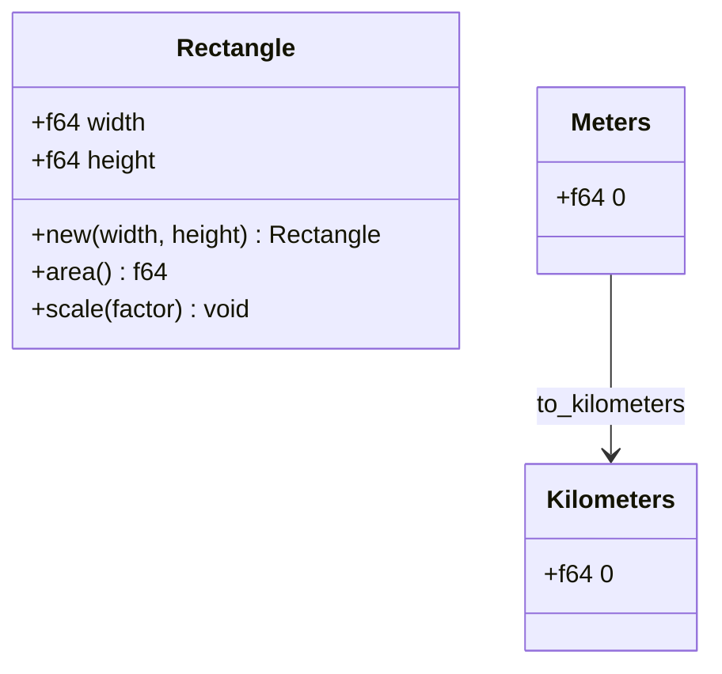
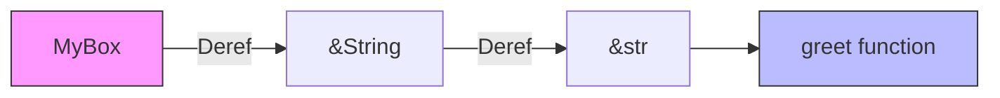
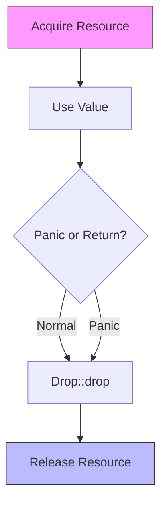

# 🏗️ Structs, Enums, and Advanced Patterns

## 🎯 Learning Objectives

By the end of this module, you will be able to:

- Model domain concepts using product types (structs) and sum types (enums) with associated data.
- Implement custom methods and constructors that respect Rust's ownership and borrowing rules.
- Use `Deref` and `DerefMut` to build smart pointers with ergonomic coercion.
- Leverage `Drop`, `Clone`, and `Copy` to manage resources and value semantics precisely.
- Apply these patterns to design type-safe ML/AI abstractions such as model configurations and state machines.

## Introduction

In machine learning, the boundary between research code and production systems is often marked by the rigor of data modeling. A configuration object that silently accepts invalid hyperparameters, a state machine that allows illegal transitions, or a tensor handle that leaks GPU memory—these are not bugs of algorithms but bugs of representation. Rust's struct and enum system, elevated to algebraic data types, provides the tools to make illegal states unrepresentable.

Structs are **product types**: they combine multiple values into a single named bundle, much like a feature vector combines scalars. Enums are **sum types**: they express a value that is one of several alternatives, each potentially carrying distinct data—ideal for representing model architectures, tokenizer outputs, or protocol states. When combined with traits like `Deref`, `Drop`, and `Clone`, these types integrate seamlessly with Rust's ownership discipline, ensuring that resources are managed correctly without garbage collection. Understanding [[Structs]], [[Enums]], and [[Advanced Patterns]] is therefore critical for building reliable [[Machine Learning Systems]] that enforce correctness at the type level.

This module bridges theory and practice. We will explore the type-theoretic foundations of product and sum types, visualize their memory layouts, and implement advanced patterns such as smart pointers and RAII guards. The goal is to move beyond simple record types and build abstractions that are as performant as they are safe.

## Module 1: Structs as Product Types

### 1.1 Theoretical Foundation 🧠

In type theory, a product type `A × B` represents the Cartesian product of two sets: a value of the product type contains one value from `A` and one from `B`. Rust's named structs (`struct S { a: A, b: B }`) are direct realizations of product types. Tuple structs (`struct T(A, B)`) are unnamed products, useful for newtype wrappers that confer distinct semantics at zero runtime cost. Unit structs (`struct U;`) are the nullary product type `1`—they contain no information and occupy zero bytes.

The theoretical significance of product types in ML systems is composability. A `TransformerConfig` struct can be decomposed into `AttentionConfig`, `FeedForwardConfig`, and `TrainingConfig` sub-structs, each of which is itself a product. This hierarchical composition mirrors the modular design of modern neural architectures and allows partial updates via struct update syntax (`..base_config`).

### 1.2 Mental Model 📐

Named struct layout:

```
Stack for small types          Heap for owned data
┌──────────────────┐
│ width: f64       │
│ height: f64      │
│ name: String     │────────────► ┌─────┬─────┬─────┬─────┐
│                  │              │ 'b' │ 'o' │ 'x' │ '\0'│
└──────────────────┘              └─────┴─────┴─────┴─────┘
```

Tuple struct as a distinct wrapper:

```
┌─────────────────────────────┐
│  struct Meters(f64);        │
│  struct Kilometers(f64);    │
│                             │
│  Meters(1000.0)             │
│    │ distinct type          │
│    ▼                        │
│  Kilometers(1.0)            │
└─────────────────────────────┘
```

### 1.3 Syntax and Semantics 📝

```rust
// WHY: Named structs are self-documenting and support field access.
#[derive(Debug, Clone)]
struct Rectangle {
    width: f64,
    height: f64,
}

impl Rectangle {
    // WHY: Associated functions without self are constructors by convention.
    fn new(width: f64, height: f64) -> Self {
        Rectangle { width, height }
    }
    
    // WHY: &self borrows immutably, allowing multiple read-only queries.
    fn area(&self) -> f64 {
        self.width * self.height
    }
    
    // WHY: &mut self enforces exclusive access during mutation.
    fn scale(&mut self, factor: f64) {
        self.width *= factor;
        self.height *= factor;
    }
}

// WHY: Tuple structs prevent mixing semantically different values.
struct Meters(f64);
struct Kilometers(f64);

impl Meters {
    fn to_kilometers(self) -> Kilometers {
        Kilometers(self.0 / 1000.0)
    }
}
```

### 1.4 Visual Representation 🖼️




### 1.5 Application in ML/AI Systems 🤖

| System | Struct Pattern | ML/AI Benefit |
|---|---|---|
| Hugging Face `transformers` config | Named struct with `Default` | Compile-time validation of required fields |
| ONNX tensor shape | Tuple struct `Dim(usize)` | Distinguishes raw integers from semantic dimensions |
| Burn training hyperparameters | Nested product types | Reusable sub-configs across experiments |

### 1.6 Common Pitfalls ⚠️

> **Warning:** Tuple struct fields accessed by index (`self.0`) are less readable than named fields. Use them only when the meaning is obvious from context or when the struct is a thin wrapper.

> **Warning:** Forgetting to derive `Clone` on a struct containing a `Vec` prevents cheap duplication. If the struct represents immutable configuration, derive `Clone` explicitly.

> **Tip:** Implement `Default` for structs with many optional fields and use `..Default::default()` to avoid verbose construction and reduce boilerplate in experiment scripts.

### 1.7 Knowledge Check ❓

1. Why is a struct considered a product type in type theory?
2. What is the runtime cost of converting between a tuple struct and its inner type?
3. When should you prefer a named struct over a tuple struct?

## Module 2: Algebraic Data Types with Enums

### 2.1 Theoretical Foundation 🧠

Where structs represent conjunction ("this AND that"), enums represent disjunction ("this OR that"). In type theory, these are **sum types** (tagged unions), denoted `A + B`. Each variant of a Rust enum is a distinct injection into the sum, and the tag (discriminant) ensures that pattern matching is both safe and exhaustive. This eliminates the ambiguity of C unions, where the programmer must manually track which variant is active, and the unsafety of untagged unions.

The practical impact on ML systems is profound. A model format enum can distinguish between `Onnx`, `Safetensors`, and `Pickle`, each carrying format-specific metadata. The compiler guarantees that every format is handled when loading weights, preventing runtime crashes on unsupported extensions. Similarly, `Option<T>` and `Result<T, E>` are sum types that eliminate null-pointer exceptions and unhandled exceptions, respectively.

### 2.2 Mental Model 📐

Tagged union layout in memory:

```
┌─────────────┬─────────────────────────────┐
│   tag (1B)  │          payload            │
├─────────────┼─────────────────────────────┤
│   0 (Quit)  │          (empty)            │
│   1 (Move)  │  x: i32  │  y: i32          │
│   2 (Write) │  String (ptr, len, cap)     │
└─────────────┴─────────────────────────────┘
```

Enum as a state machine:

```
        ┌─────────┐
   ┌────┤  Idle   ├────┐
   │    └─────────┘    │
   │         │         │
   ▼         ▼         ▼
┌──────┐ ┌──────┐ ┌──────┐
│ Load │ │ Train│ │Infer │
└──────┘ └──────┘ └──────┘
```

### 2.3 Syntax and Semantics 📝

```rust
// WHY: Enums with data model state machines and variant-specific context.
enum ModelFormat {
    Onnx { opset: u32 },
    Safetensors,
    Pickle,
}

impl ModelFormat {
    // WHY: Methods on enums centralize behavior for all variants.
    fn extension(&self) -> &'static str {
        match self {
            ModelFormat::Onnx { .. } => ".onnx",
            ModelFormat::Safetensors => ".safetensors",
            ModelFormat::Pickle => ".pkl",
        }
    }
}

// WHY: Option and Result are foundational sum types with dedicated syntax.
fn maybe_sqrt(x: f64) -> Option<f64> {
    if x >= 0.0 { Some(x.sqrt()) } else { None }
}

fn divide(a: f64, b: f64) -> Result<f64, String> {
    if b == 0.0 { Err("Division by zero".to_string()) } else { Ok(a / b) }
}
```

### 2.4 Visual Representation 🖼️


```mermaid
graph TD
    A[ModelFormat Enum] --> B[Onnx]
    A --> C[Safetensors]
    A --> D[Pickle]
    
    B -->|opset| E[u32]
    C -->|no data| F[()]
    D -->|no data| G[()]
    
    H[OnnxFile] -.->|implements| B
    I[SafetensorsFile] -.->|implements| C
```

### 2.5 Application in ML/AI Systems 🤖

| System | Enum Pattern | ML/AI Benefit |
|---|---|---|
| Serde `Value` | Recursive enum for JSON | Type-safe traversal of untyped model configs |
| Tokenizer output | `Token::Word(String) | Token::Subword(u32)` | Distinguishes vocabulary hits from byte fallback |
| Model architecture | `Arch::Bert(BertConfig) | Arch::Gpt(GptConfig)` | Compiler enforces architecture-specific logic |

### 2.6 Common Pitfalls ⚠️

> **Warning:** Recursive enums (e.g., expression trees) require indirection such as `Box` or `Rc` to avoid infinitely sized types. Forgetting the box causes a compiler error about recursive type.

> **Warning:** C-style enums without data cannot carry context. If you find yourself maintaining parallel arrays of metadata, refactor to a data-carrying enum.

> **Tip:** Use `#[non_exhaustive]` on public library enums to allow future variants without breaking downstream `match` arms.

### 2.7 Knowledge Check ❓

1. What is the difference between a C-style enum and a Rust algebraic enum?
2. Why do recursive enums like expression trees require `Box`?
3. How does adding a variant to a non-exhaustive enum affect downstream crates?

## Module 3: Smart Pointers and Coercion

### 3.1 Theoretical Foundation 🧠

Smart pointers are types that behave like pointers but carry additional metadata or capabilities. The theoretical basis for Rust's smart pointers is the `Deref` trait, which defines a coercion from a smart pointer to a regular reference. This is an example of **subtyping via coercion**: `MyBox<T>` can be used anywhere `&T` is expected, without explicit syntax. `DerefMut` extends this to mutable references.

This pattern is essential for ML systems that share large resources—such as GPU tensors or pretrained embeddings—between multiple consumers. `Arc<Tensor>` uses `Deref` to provide transparent access to the inner tensor while reference counting manages deallocation. Without `Deref`, every access would require manual unwrapping, cluttering mathematical code with boilerplate.

### 3.2 Mental Model 📐

Deref coercion chain:

```
&MyBox<T>  ──Deref──►  &T  ──Deref──►  &Target
    │                     │                  │
    │                     │                  │
    ▼                     ▼                  ▼
  *value               *value             *value
```

Smart pointer wrapping a resource:

```
┌─────────────────────────────────────────────┐
│            Arc<Tensor>                      │
│  ┌──────────┐  ┌─────────────────────────┐  │
│  │ refcnt   │  │ Tensor { data, shape }  │  │
│  │ (atomic) │  │                         │  │
│  └──────────┘  └─────────────────────────┘  │
└─────────────────────────────────────────────┘
```

### 3.3 Syntax and Semantics 📝

```rust
use std::ops::Deref;

// WHY: Deref lets custom types behave like references, enabling coercion.
struct MyBox<T>(T);

impl<T> MyBox<T> {
    fn new(x: T) -> MyBox<T> {
        MyBox(x)
    }
}

impl<T> Deref for MyBox<T> {
    type Target = T;
    
    fn deref(&self) -> &Self::Target {
        &self.0
    }
}

fn greet(name: &str) {
    println!("Hello, {}", name);
}

fn main() {
    let m = MyBox::new(String::from("Rust"));
    // WHY: &MyBox<String> coerces to &String, then to &str via Deref.
    greet(&m);
}

// WHY: DerefMut enables mutable coercion for write-through wrappers.
impl<T> std::ops::DerefMut for MyBox<T> {
    fn deref_mut(&mut self) -> &mut Self::Target {
        &mut self.0
    }
}
```

### 3.4 Visual Representation 🖼️




### 3.5 Application in ML/AI Systems 🤖

| System | Smart Pointer | ML/AI Benefit |
|---|---|---|
| Shared embeddings table | `Arc<EmbeddingMatrix>` | Multiple model heads read from the same weights without copying |
| Mutable optimizer state | `RefCell<HashMap<ParamId, State>>` | Interior mutability for single-threaded training loops |
| GPU buffer wrapper | `CudaBuffer<T>` with `Deref` | Transparent access to device memory from host code |

### 3.6 Common Pitfalls ⚠️

> **Warning:** Implementing `Deref` solely to emulate inheritance leads to confusing APIs. `Deref` should represent "is-a transparent wrapper," not "has-a relationship."

> **Warning:** `DerefMut` on a type wrapped in `Rc` or `Arc` requires interior mutability (`RefCell` or `Mutex`). Attempting to return `&mut T` from a shared reference violates borrow checker rules.

> **Tip:** Use `AsRef<str>` or `AsRef<Path>` in APIs instead of `Deref` when you want polymorphism without implicit coercion, making call sites explicit and self-documenting.

### 3.7 Knowledge Check ❓

1. What is the difference between `Deref` and `AsRef` in API design?
2. Why does `MyBox<String>` coerce to `&str` when passed to `greet`?
3. When is interior mutability necessary alongside `DerefMut`?

## Module 4: Resource Management and Traits

### 4.1 Theoretical Foundation 🧠

Resource management in Rust is built on the principle of **Resource Acquisition Is Initialization (RAII)**, pioneered in C++. However, Rust augments RAII with ownership and the borrow checker, guaranteeing that resources are released exactly once, even in the presence of panics. The `Drop` trait provides custom cleanup logic, while `Clone` and `Copy` define value duplication semantics.

`Copy` represents bitwise duplication—safe only for types that do not own heap resources. `Clone` represents explicit deep copying, which may be expensive. In ML systems, this distinction is critical: model hyperparameters (`f32`, `usize`) should implement `Copy` for implicit duplication, while model weights (`Vec<f32>`) should implement `Clone` so that copies are always explicit and auditable. Misapplying `Copy` to a heap-owning type leads to double-free errors, which Rust's trait system prevents at compile time.

### 4.2 Mental Model 📐

RAII lifecycle:

```
┌─────────────────────────────────────────────┐
│  acquire resource                           │
│       │                                     │
│       ▼                                     │
│  ┌─────────┐                                │
│  │  use    │                                │
│  │  value  │                                │
│  └─────────┘                                │
│       │                                     │
│       ▼ out of scope                        │
│  Drop::drop called automatically            │
│       │                                     │
│       ▼                                     │
│  release resource                           │
└─────────────────────────────────────────────┘
```

Copy vs Clone semantics:

```
┌─────────────────────┐   ┌─────────────────────┐
│  Copy (bitwise)     │   │  Clone (deep copy)  │
│  ┌─────┐ ┌─────┐   │   │  ┌─────┐ ┌─────┐   │
│  │  A  │ │  A' │   │   │  │  A  │ │  A' │   │
│  │     │ │     │   │   │  │ ptr ├─┼─► │   │
│  │ 5   │ │ 5   │   │   │  │     │ │ new │   │
│  └─────┘ └─────┘   │   │  └─────┘ └─────┘   │
│  Two independent    │   │  Two independent    │
│  stack values       │   │  heap allocations   │
└─────────────────────┘   └─────────────────────┘
```

### 4.3 Syntax and Semantics 📝

```rust
// WHY: RAII ensures GPU memory is freed even if training panics.
struct GpuBuffer {
    ptr: *mut f32,
    size: usize,
}

impl Drop for GpuBuffer {
    fn drop(&mut self) {
        println!("Releasing GPU buffer of size {}", self.size);
        // unsafe { cudaFree(self.ptr); }
    }
}

// WHY: Copy enables implicit duplication for small scalar aggregates.
#[derive(Clone, Copy)]
struct HyperParams {
    lr: f64,
    batch_size: usize,
}

// WHY: Clone on heap-owning types makes copies explicit.
#[derive(Clone)]
struct Weights {
    data: Vec<f32>,
}

fn main() {
    let a = HyperParams { lr: 0.01, batch_size: 32 };
    let b = a; // WHY: Copy: both a and b remain valid.
    
    let w1 = Weights { data: vec![1.0, 2.0] };
    let w2 = w1.clone(); // WHY: Clone: w1 and w2 own separate buffers.
}
```

### 4.4 Visual Representation 🖼️




### 4.5 Application in ML/AI Systems 🤖

| System | Trait | ML/AI Benefit |
|---|---|---|
| GPU memory allocator | `Drop` | Automatic deallocation of CUDA buffers on scope exit |
| Model configuration | `Copy` | Implicit duplication of small config structs across threads |
| Pretrained weight clone | `Clone` | Explicit, auditable copies when fine-tuning from a base model |
| Training checkpoint guard | `Drop` | Rollback to last valid state if serialization panics |

### 4.6 Common Pitfalls ⚠️

> **Warning:** Deriving `Copy` on a struct containing a `Vec` or `String` will not compile, but manually implementing `Copy` on a pointer-backed type causes double-free undefined behavior. Never implement `Copy` for heap-owning types.

> **Warning:** `Drop` is not called when a value is leaked via `std::mem::forget` or a reference-cycle in `Rc`. Use `Weak` references or scoped APIs to prevent resource leaks in graph-like structures.

> **Tip:** Derive both `Clone` and `Copy` for small, immutable configuration structs to reduce friction in parallel training code where values are moved into closures.

### 4.7 Knowledge Check ❓

1. Why is `Copy` not implemented automatically for types that own heap memory?
2. What guarantees does `Drop` provide in the presence of a panic?
3. When should you prefer explicit `Clone` over implicit `Copy` for domain types?

## 📦 Compression Code

Complete Rust script using structs, enums, and advanced patterns:

```rust
use std::ops::Deref;

// WHY: Custom smart pointer for compressed data with metadata.
struct CompressedData {
    original_size: usize,
    data: Vec<u8>,
}

impl CompressedData {
    fn new(data: Vec<u8>, original_size: usize) -> Self {
        CompressedData { original_size, data }
    }
    
    fn compression_ratio(&self) -> f64 {
        self.data.len() as f64 / self.original_size as f64
    }
}

// WHY: Deref allows transparent access to the inner byte slice.
impl Deref for CompressedData {
    type Target = [u8];
    
    fn deref(&self) -> &Self::Target {
        &self.data
    }
}

// WHY: Drop logs deallocation for observability in long-running pipelines.
impl Drop for CompressedData {
    fn drop(&mut self) {
        println!("CompressedData dropped (ratio: {:.2})", self.compression_ratio());
    }
}

// WHY: Enum selects algorithm without runtime dispatch overhead.
#[derive(Debug, Clone, Copy)]
enum Algorithm {
    Rle,
    None,
}

impl Algorithm {
    fn compress(&self, data: &[u8]) -> CompressedData {
        match self {
            Algorithm::Rle => {
                if data.is_empty() {
                    return CompressedData::new(Vec::new(), 0);
                }
                let mut result = Vec::new();
                let mut current = data[0];
                let mut count = 1u8;
                for &byte in &data[1..] {
                    if byte == current && count < 255 {
                        count += 1;
                    } else {
                        result.push(current);
                        result.push(count);
                        current = byte;
                        count = 1;
                    }
                }
                result.push(current);
                result.push(count);
                CompressedData::new(result, data.len())
            }
            Algorithm::None => {
                CompressedData::new(data.to_vec(), data.len())
            }
        }
    }
}

fn main() {
    let data = b"AAAAABBBBCCCCCDDDDD";
    
    for algo in [Algorithm::Rle, Algorithm::None] {
        let compressed = algo.compress(data);
        println!("{:?}: {} -> {} bytes", algo, compressed.original_size, compressed.len());
    }
}
```

## 🎯 Documented Project

### Description

Build a **State Machine Protocol Parser** that uses enums to model the states of a network protocol handshake. The parser transitions between states based on incoming bytes, with each state variant carrying different context data. The implementation must use `Drop` to ensure connection resources are cleaned up, and `Deref` to provide ergonomic access to the underlying socket.

### Functional Requirements

1. A `ConnectionState` enum with variants for `Idle`, `Handshaking`, `Established`, and `Closed`.
2. Each variant carries appropriate context (e.g., `Handshaking` carries a nonce buffer, `Established` carries session parameters).
3. A `Connection` struct with `Deref` to the underlying socket and `Drop` for cleanup.
4. State transitions enforced at compile time where possible, runtime-checked otherwise.
5. Methods on `Connection` that are only available in specific states.

### Main Components

- `ConnectionState` enum: Represents all protocol states with associated data.
- `Connection` struct: Wraps a socket and tracks current state.
- `HandshakeParser`: Iterator that yields state transitions from raw bytes.
- `SessionParams` struct: Configuration negotiated during handshake.

### Success Metrics

- Invalid state transitions are caught early (compile-time preferred, runtime error otherwise).
- Connection resources are always released via `Drop`, even on panic.
- The state machine is fully testable without a real network connection.
- Adding a new state requires updating the enum and match arms—the compiler guides all necessary changes.

### References

- [The Rust Programming Language - Structs](https://doc.rust-lang.org/book/ch05-00-structs.html)
- [The Rust Programming Language - Enums](https://doc.rust-lang.org/book/ch06-00-enums.html)
- [The Rust Programming Language - Smart Pointers](https://doc.rust-lang.org/book/ch15-00-smart-pointers.html)
- [Serde Documentation](https://serde.rs/)
- [Wikimedia Commons - State Machine Diagram](https://commons.wikimedia.org/wiki/File:Finite_state_machine_example_with_comments.svg)
