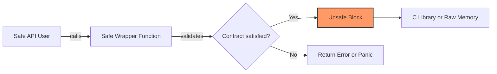

# 🔥 Unsafe Rust and FFI

## Introduction

Safe Rust guarantees memory safety, thread safety, and the absence of undefined behavior — but the real world is not safe. Operating systems expose C APIs, hardware demands direct memory access, and high-performance code sometimes requires bypassing the borrow checker. [[00 - Welcome to Advanced Rust|Unsafe Rust]] is the escape hatch that lets you perform these operations, but with great power comes the responsibility to manually uphold invariants that the compiler normally enforces. This module teaches you when to use `unsafe`, how to contain it behind safe abstractions, and how to bridge Rust with other languages through Foreign Function Interface (FFI).

FFI is the boundary where Rust meets the outside world. Whether you are calling `libc` functions, embedding a Rust library into Python, or exposing Rust structs to C consumers, you are operating in a space where two different memory models and type systems collide. Understanding this boundary is critical for systems programming, embedded development, and language interoperability. We will explore both directions of the FFI bridge, examine the overhead involved, and learn how to build sound abstractions that keep the `unsafe` code hidden from end users.

## 1. Unsafe Blocks: Raw Pointers and Mutable Statics

Deep conceptual explanation:

- **`unsafe` blocks** allow five categories of operations: dereference raw pointers, call `unsafe` functions, access mutable statics, implement `unsafe` traits, and access fields of `union`s.
- **Raw pointers** (`*const T` and `*mut T`) are like C pointers: they can be null, dangling, or aliased. The borrow checker ignores them entirely. Dereferencing a raw pointer requires `unsafe`, but creating one does not.
- **Mutable statics** (`static mut`) allow global mutable state. They are inherently unsafe because any thread could access them simultaneously, causing data races.
- The golden rule of unsafe Rust is to expose a safe API over an unsafe implementation. The `unsafe` keyword should be an implementation detail, not a user-facing requirement.

⚠️ **Warning:** Creating a raw pointer is safe, but dereferencing it is not. Even if you never dereference it, passing a dangling raw pointer to C code can trigger undefined behavior in the foreign library.

💡 **Tip:** Minimize the size of `unsafe` blocks. Wrap individual operations rather than entire functions. This makes auditing easier and limits the scope of potential undefined behavior.

Real case: **Redis** uses a custom memory allocator and raw pointer arithmetic for its core data structures. When Rust bindings are created for Redis modules, developers must use `unsafe` to interact with the Redis allocator while ensuring that Rust's ownership rules are still respected at the module boundary.

## 2. FFI: Calling C from Rust and Rust from Python

FFI enables bidirectional communication. Rust can call C functions through `extern` blocks, and C can call Rust functions marked with `extern "C"`.

| Direction | Rust Syntax | Key Concerns |
|-----------|-------------|--------------|
| Rust → C | `extern "C" { fn c_func(); }` | ABI compatibility, null pointers, string encoding |
| C → Rust | `#[no_mangle] pub extern "C" fn rust_func() {}` | Memory layout, panic safety, ownership transfer |
| Python → Rust | PyO3 or `ctypes`/`cffi` | GIL interaction, object lifetimes, exception handling |

Table: FFI overhead comparison

| Mechanism | Latency overhead | Memory overhead | Safety | Use case |
|-----------|------------------|-----------------|--------|----------|
| Direct C FFI | Near zero | None | Manual | OS APIs, embedded |
| C++ (cxx crate) | Low | Minimal | Semi-automated | C++ interop |
| PyO3 | Medium (GIL) | Python objects | Automated | Python extensions |
| wasm-bindgen | Low | Minimal | Automated | WebAssembly |
| JNI (jnr-ffi) | High | JVM heap | Manual | Java interop |

Formula:

```
Safety = Compile_Time_Checks + Runtime_Invariants
```

In FFI, the compiler cannot enforce safety across the boundary. You must replace compile-time checks with explicit runtime invariants: null checks, length validation, and panic boundaries.

## 3. Soundness and Unsafe Abstractions

An abstraction is **sound** if it is impossible for safe code to trigger undefined behavior through it. When you write an `unsafe` function, you define a contract. When you write a safe wrapper, you prove that the contract is always satisfied.




The boundary between safe and unsafe code must be a one-way gate. Safe code can call unsafe code, but unsafe code must not assume that safe code has upheld invariants without verification.

Real case: **PyO3** uses unsafe Rust to bind Python. It wraps Python's C API in safe Rust abstractions. The `Python<'py>` token proves that the GIL is held, and `Py<T>` manages reference counts. Every PyO3 function that touches a Python object uses `unsafe` internally, but library consumers write entirely safe Rust.

## 4. Practical Unsafe and FFI Example

Rust code blocks:

```rust
use std::os::raw::{c_char, c_int};
use std::ffi::{CStr, CString};

// Expose a Rust function to C
#[no_mangle]
pub extern "C" fn count_vowels(s: *const c_char) -> c_int {
    if s.is_null() {
        return -1;
    }

    let c_str = unsafe { CStr::from_ptr(s) };
    let rust_str = match c_str.to_str() {
        Ok(s) => s,
        Err(_) => return -1,
    };

    rust_str
        .chars()
        .filter(|c| matches!(c, 'a' | 'e' | 'i' | 'o' | 'u' | 'A' | 'E' | 'I' | 'O' | 'U'))
        .count() as c_int
}

// Call a C function from Rust (hypothetical libc example)
extern "C" {
    fn strlen(s: *const c_char) -> usize;
}

pub fn safe_strlen(rust_str: &str) -> Option<usize> {
    let c_string = CString::new(rust_str).ok()?;
    let len = unsafe { strlen(c_string.as_ptr()) };
    Some(len)
}

fn main() {
    let input = CString::new("Hello FFI").unwrap();
    let vowels = count_vowels(input.as_ptr());
    println!("Vowels: {}", vowels);

    if let Some(len) = safe_strlen("Hello") {
        println!("Length: {}", len);
    }
}
```

This example demonstrates:
- Null pointer checking before unsafe dereferencing
- `#[no_mangle]` and `extern "C"` for C-compatible symbols
- `CStr` for safe borrowing of C strings
- Error handling instead of panicking across the FFI boundary

⚠️ **Warning:** Never panic across an FFI boundary. Unwinding Rust panics into foreign code is undefined behavior. Use `std::panic::catch_unwind` inside your `extern "C"` functions if there is any risk of panic.

💡 **Tip:** Use the `cbindgen` tool to automatically generate C headers from your Rust `extern "C"` functions. This eliminates header/source drift and reduces bugs.

---

## 📦 Compression Code

Complete Rust script:

```rust
use std::slice;

fn split_at_mut(values: &mut [i32], mid: usize) -> (&mut [i32], &mut [i32]) {
    let len = values.len();
    assert!(mid <= len);

    let ptr = values.as_mut_ptr();
    unsafe {
        (
            slice::from_raw_parts_mut(ptr, mid),
            slice::from_raw_parts_mut(ptr.add(mid), len - mid),
        )
    }
}

fn main() {
    let mut v = vec![1, 2, 3, 4, 5];
    let (left, right) = split_at_mut(&mut v, 2);
    left[0] = 10;
    right[0] = 40;
    println!("{:?}", v); // [10, 2, 40, 4, 5]
}
```


