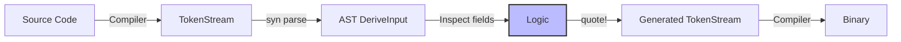

# 🎭 Macros and Metaprogramming

## Introduction

Metaprogramming is the art of writing code that writes code. In Rust, this power is delivered through macros — compile-time transformations that generate boilerplate, enforce domain-specific invariants, and extend the language itself. Unlike C preprocessor macros, Rust macros are hygienic, type-aware, and integrated into the compiler's pipeline. This module covers both [[00 - Welcome to Advanced Rust|declarative macros]] with `macro_rules!` and the more powerful [[04 - Memory Management Deep Dive|procedural macros]] that drive ecosystems like Serde and Actix.

Understanding macros is not merely a convenience; it is a force multiplier. When you write a `derive(Serialize)`, you are invoking a procedural macro that inspects your struct's fields at compile time and generates hundreds of lines of serialization logic. When you use `vec!`, `println!`, or `tokio::select!`, you are using declarative macros to express variadic or domain-specific syntax. Mastering macros means you can build libraries that feel like language features, reducing repetition and enforcing correctness at the earliest possible stage.

## 1. Declarative Macros: macro_rules!

Deep conceptual explanation:

- **`macro_rules!`** defines pattern-based macros using a domain-specific language that resembles Rust match expressions.
- Macros operate on **token trees**, not AST nodes. This means they can match brackets, repetitions, and nested structures without understanding their semantic meaning.
- **Repetition** uses `$(...)*`, `$(...)+`, or `$(...)?` to match zero-or-more, one-or-more, or optional patterns. The separator (e.g., `,`) goes inside the repetition.
- **Hygiene** ensures that variables introduced inside a macro do not collide with variables in the calling scope. This prevents the subtle bugs common in C macros.

⚠️ **Warning:** `macro_rules!` cannot match arbitrary token sequences with perfect precision. Complex parsing often requires procedural macros. Overly clever `macro_rules!` can produce cryptic compiler errors.

💡 **Tip:** Use `$crate` in macros to refer to items within the defining crate. This ensures the macro works correctly even when re-exported.

Real case: **The `vec!` macro** is a declarative macro in the standard library. `vec![1, 2, 3]` expands to `::std::vec::Vec::from([1, 2, 3])`, and `vec![0; 100]` expands to a capacity reservation loop. This simple macro eliminates an entire class of initialization boilerplate.

## 2. Procedural Macros: Derive, Attribute, and Function-like

Procedural macros are Rust programs that manipulate the compiler's token stream. They come in three flavors:

| Type | Invocation | Input | Output |
|------|------------|-------|--------|
| Derive | `#[derive(MyMacro)]` | `TokenStream` (struct/enum) | `TokenStream` (impl blocks) |
| Attribute | `#[my_macro(...)]` | `TokenStream` (item + args) | `TokenStream` (modified item) |
| Function-like | `my_macro!(...)` | `TokenStream` (arbitrary) | `TokenStream` (arbitrary) |

Table: Macro types comparison

| Aspect | Declarative | Procedural |
|--------|-------------|------------|
| Complexity | Simple pattern matching | Full token manipulation |
| Use case | Syntax sugar, DSLs | Custom derives, code generation |
| Crate type | Same crate | Separate `proc-macro` crate |
| Dependencies | None (std) | `proc-macro2`, `quote`, `syn` |
| Compile time | Faster | Slower (extra crate) |
| Error messages | Can be cryptic | Can be customized |

Procedural macros run during compilation. They parse tokens into an AST using `syn`, manipulate that AST, and generate new tokens using `quote`. The `proc-macro2` crate provides a portable token type that works both inside and outside the compiler context.

## 3. The proc-macro2, quote, and syn Crates

These three crates form the standard toolkit for procedural macro authors:

- **`syn`**: Parses `TokenStream` into Rust AST structures like `DeriveInput`, `ItemFn`, and `Expr`. It supports custom parsing for domain-specific syntax.
- **`quote!`**: A quasi-quoting macro that converts Rust-like syntax back into `TokenStream`. It interpolates variables with `#var` and repetitions with `#( ... )*`.
- **`proc-macro2`**: A wrapper around the compiler's `proc_macro::TokenStream` that can be used in tests and non-macro contexts.




Real case: **Serde's `derive(Serialize)`** is a procedural macro. When you annotate a struct, the Serde derive macro inspects every field, checks for attributes like `#[serde(rename = "...")]`, and generates an `impl Serialize` that recursively serializes each field. Without procedural macros, users would manually write hundreds of lines of serialization code for every data structure.

## 4. Custom Derive Macro

Rust code blocks:

```rust
// In derive crate (proc-macro = true)
use proc_macro::TokenStream;
use quote::quote;
use syn::{parse_macro_input, DeriveInput};

#[proc_macro_derive(HelloMacro)]
pub fn hello_macro_derive(input: TokenStream) -> TokenStream {
    let ast = parse_macro_input!(input as DeriveInput);
    let name = &ast.ident;

    let gen = quote! {
        impl HelloMacro for #name {
            fn hello_macro() {
                println!("Hello, Macro! My name is {}!", stringify!(#name));
            }
        }
    };

    gen.into()
}

// In main crate
pub trait HelloMacro {
    fn hello_macro();
}

#[derive(HelloMacro)]
struct Pancakes;

fn main() {
    Pancakes::hello_macro(); // Hello, Macro! My name is Pancakes!
}
```

This example demonstrates:
- Parsing `TokenStream` with `syn`
- Generating code with `quote!`
- Interpolating identifiers with `#name`
- Using `stringify!` for compile-time stringification

⚠️ **Warning:** Procedural macros can only be defined in crates with `crate-type = ["proc-macro"]`. They cannot export regular functions or types.

💡 **Tip:** Use `syn::Attribute::parse_meta` to read structured attributes from derived items. This lets you support custom configuration like `#[hello(skip)]`.

---

## 📦 Compression Code

Complete Rust script:

```rust
// A compact declarative macro for creating hashmaps
macro_rules! map {
    ($($key:expr => $value:expr),* $(,)?) => {{
        let mut m = ::std::collections::HashMap::new();
        $(m.insert($key, $value);)*
        m
    }};
}

fn main() {
    let scores = map! {
        "Alice" => 42,
        "Bob" => 37,
        "Charlie" => 55,
    };
    println!("{:?}", scores);
}
```

## 🎯 Documented Project

### Description

Implement a `Builder` derive macro that automatically generates a builder pattern for any struct. The macro should support optional fields, mandatory fields, and custom validation attributes.

### Functional Requirements

1. Derive `Builder` for a struct to generate a `StructNameBuilder` with setter methods.
2. Support `#[builder(default = "expr")]` for fields with default values.
3. Support `#[builder(validate = "path")]` to run a custom validation function before building.
4. Generate a `.build()` method that returns `Result<StructName, String>`.
5. Produce clear compile-time errors if mandatory fields are missing when `.build()` is called.

### Main Components

- `builder-derive/`: The proc-macro crate containing `derive(Builder)`.
- `builder-core/`: Shared parsing logic for attributes and field inspection.
- `example/`: A demonstration crate using the macro on complex structs.
- `tests/`: Compile-time tests using `trybuild` to verify error messages.

### Success Metrics

- The macro successfully derives builders for structs with up to 50 fields.
- Generated code compiles without warnings (`#![deny(warnings)]`).
- `cargo expand` shows clean, readable builder implementations.
- Error messages for missing mandatory fields appear at the call site, not inside generated code.

### References

- [The Little Book of Rust Macros](https://danielkeep.github.io/tlborm/book/)
- [syn crate documentation](https://docs.rs/syn/)
- [quote crate documentation](https://docs.rs/quote/)
