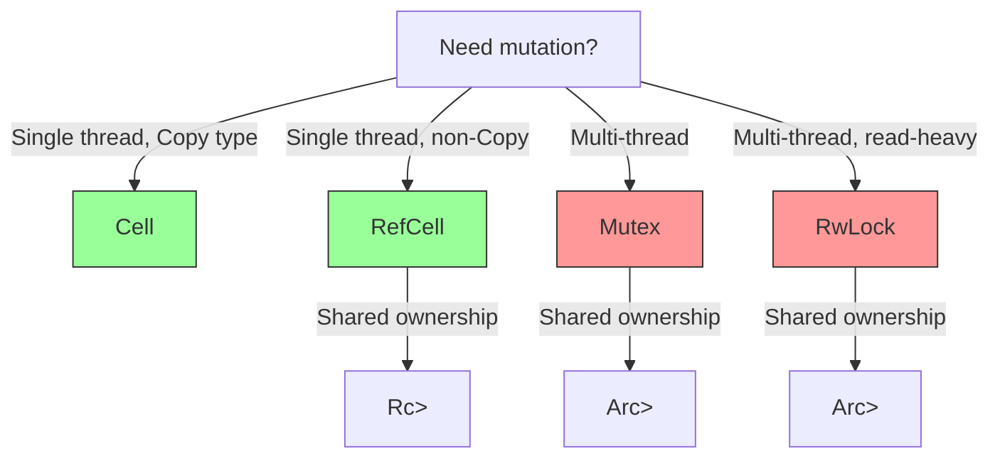

# 🧠 Memory Management Deep Dive

## Introduction

Rust's ownership model is the language's defining feature, but real-world programs quickly outgrow simple `let` bindings and `&mut` references. When multiple parts of your program need to share data, when you need mutation behind an immutable reference, or when you are building concurrent data structures, you reach for smart pointers. This module provides a comprehensive tour of Rust's memory management toolbox — from [[00 - Welcome to Advanced Rust|Box]] and [[01 - Concurrency with Tokio and Async-Await|Arc]] to the interior mutability pattern — with the depth required to architect complex systems.

Understanding memory management in Rust means understanding trade-offs. Stack allocation is fast but inflexible. Heap allocation is flexible but slower and requires explicit deallocation logic. Smart pointers are the bridge: they automate cleanup, enforce sharing rules, and allow controlled mutation. We will examine each smart pointer's use case, performance characteristics, and interaction with the borrow checker, culminating in practical patterns for graphs, caches, and concurrent state.

## 1. Stack vs Heap and the Role of Box

Deep conceptual explanation:

- **Stack allocation** is LIFO and automatic. Local variables and function parameters live here. It is extremely fast (single pointer bump) but limited in size and lifetime.
- **Heap allocation** is dynamic and arbitrary-lifetime. `Box<T>` is the simplest heap pointer: it uniquely owns a heap-allocated value and drops it when the `Box` goes out of scope.
- `Box` is useful for recursive types (like linked lists), large values that should not be copied on the stack, and trait objects (`Box<dyn Trait>`).
- Moving a `Box` transfers ownership without copying the underlying data — only the pointer is moved.

⚠️ **Warning:** Recursive types without indirection cause infinite size at compile time. `enum List { Cons(i32, List), Nil }` fails because `List` contains itself. Use `Box<List>` to break the cycle.

💡 **Tip:** Prefer `Box<[T]>` over `Vec<T>` when you know the size at creation time and will never resize. It has exactly the same layout but a smaller API surface, communicating immutability of length.

Real case: **Servo**, Mozilla's experimental browser engine, uses `Box` extensively for DOM nodes that have a strict tree ownership model. Each node uniquely owns its children, and `Box` ensures that when a parent is destroyed, all descendants are recursively dropped without garbage collection pauses.

## 2. Smart Pointers: Rc, Arc, Cell, RefCell, Mutex, RwLock

Rust's standard library provides a rich collection of smart pointers for different sharing and mutability requirements.

Table: Smart pointers mapped to use cases

| Smart Pointer | Ownership | Thread-safe | Mutability | Best For |
|---------------|-----------|-------------|------------|----------|
| `Box<T>` | Unique | Yes | Via `&mut` | Recursive types, trait objects |
| `Rc<T>` | Shared (single-threaded) | No | Via `RefCell` | Graphs, trees with multiple parents |
| `Arc<T>` | Shared (multi-threaded) | Yes | Via `Mutex` / `RwLock` | Concurrent data structures |
| `Cell<T>` | Unique | No | Interior (copy types) | Simple counters, flags |
| `RefCell<T>` | Unique | No | Interior (runtime borrow check) | Single-threaded graphs, mocks |
| `Mutex<T>` | Shared | Yes | Interior (blocking) | Thread-safe mutable state |
| `RwLock<T>` | Shared | Yes | Interior (read/write locks) | Read-heavy concurrent data |

Formula:

```
Rc_Count = strong_refs + weak_refs
```

`Rc` and `Arc` maintain reference counts. `strong_refs` keep the data alive; `weak_refs` do not. A cycle of strong references causes a memory leak, which is why `Weak<T>` exists — it breaks cycles by upgrading to `Rc` only if the data still exists.

## 3. Interior Mutability Pattern

Interior mutability allows mutation through an immutable reference. This seems to violate Rust's rules, but it is safely implemented through runtime checks or atomic operations.




- **`Cell<T>`**: Replaces the value via `set` and `get`. Only works for `Copy` types because it moves bits, not ownership.
- **`RefCell<T>`**: Enforces borrow rules at runtime. `borrow()` returns `Ref<T>`; `borrow_mut()` returns `RefMut<T>`. Violations trigger `panic!`.
- **`Mutex<T>`**: Similar to `RefCell` but thread-safe. `lock()` blocks until the lock is available. Poisoning occurs if a thread panics while holding the lock.

Real case: **Servo** uses `Arc` for concurrent DOM access. The DOM is read by the layout engine, main thread, and compositor simultaneously. `Arc<Node>` ensures that nodes stay alive as long as any thread references them, while `Mutex` protects mutable properties like style calculations.

## 4. Practical Smart Pointer Examples

Rust code blocks:

```rust
use std::rc::Rc;
use std::cell::RefCell;
use std::sync::{Arc, Mutex};
use std::thread;

// Single-threaded shared mutable state
fn rc_refcell_example() {
    let shared_vec: Rc<RefCell<Vec<i32>>> = Rc::new(RefCell::new(vec![]));

    {
        let mut vec = shared_vec.borrow_mut();
        vec.push(1);
        vec.push(2);
    } // borrow_mut ends here

    shared_vec.borrow_mut().push(3);
    println!("Single-threaded: {:?}", shared_vec.borrow());
}

// Multi-threaded shared mutable state
fn arc_mutex_example() {
    let counter = Arc::new(Mutex::new(0));
    let mut handles = vec![];

    for _ in 0..10 {
        let counter = Arc::clone(&counter);
        let handle = thread::spawn(move || {
            let mut num = counter.lock().unwrap();
            *num += 1;
        });
        handles.push(handle);
    }

    for handle in handles {
        handle.join().unwrap();
    }

    println!("Multi-threaded: {}", *counter.lock().unwrap());
}

fn main() {
    rc_refcell_example();
    arc_mutex_example();
}
```

This example demonstrates:
- `Rc<RefCell<T>>` for single-threaded graphs or shared state
- `Arc<Mutex<T>>` for safe concurrent mutation
- Proper scoping of locks to minimize contention
- Clone semantics of `Rc` and `Arc` (only the pointer count increases)

⚠️ **Warning:** Deadlocks are still possible in safe Rust. Holding a `MutexGuard` while attempting to lock another mutex, or recursively locking the same mutex in the same thread, will deadlock your program.

💡 **Tip:** For read-heavy concurrent data, prefer `RwLock` over `Mutex`. Multiple readers can hold the lock simultaneously, improving throughput. However, `RwLock` has higher overhead than `Mutex` for uncontended access.

---

## 📦 Compression Code

Complete Rust script:

```rust
use std::rc::{Rc, Weak};
use std::cell::RefCell;

#[derive(Debug)]
struct Node {
    value: i32,
    children: RefCell<Vec<Rc<Node>>>,
    parent: RefCell<Weak<Node>>,
}

fn main() {
    let leaf = Rc::new(Node {
        value: 3,
        children: RefCell::new(vec![]),
        parent: RefCell::new(Weak::new()),
    });

    let branch = Rc::new(Node {
        value: 5,
        children: RefCell::new(vec![Rc::clone(&leaf)]),
        parent: RefCell::new(Weak::new()),
    });

    *leaf.parent.borrow_mut() = Rc::downgrade(&branch);

    println!("leaf parent = {:?}", leaf.parent.borrow().upgrade());
    println!("branch strong = {}, weak = {}",
        Rc::strong_count(&branch), Rc::weak_count(&branch));
}
```


