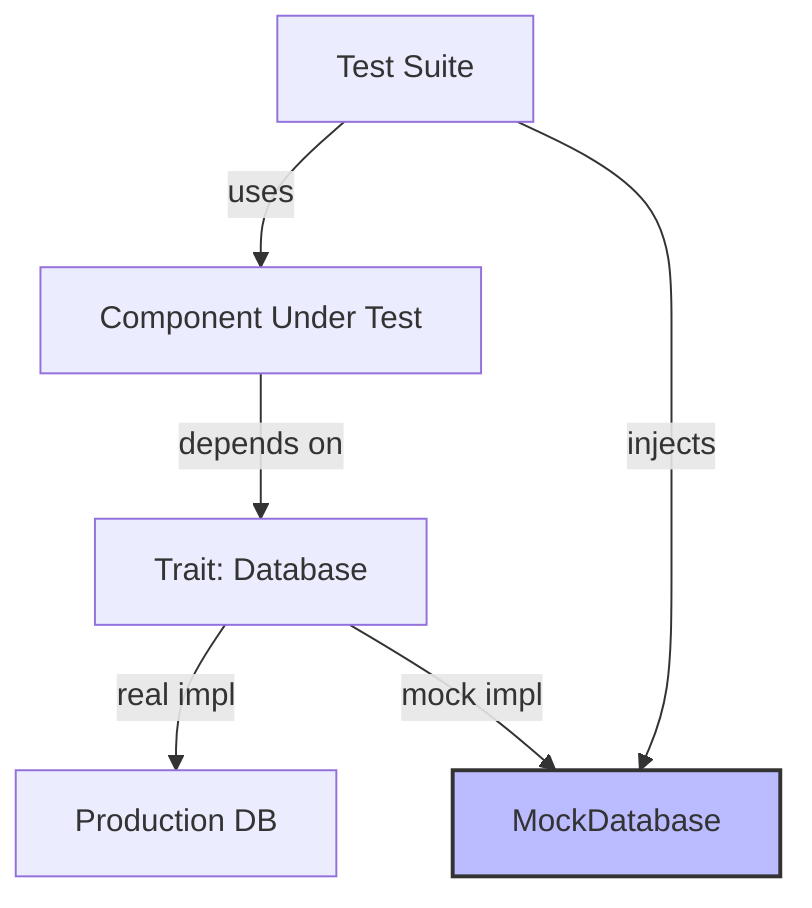

# 🧪 Testing, Benchmarking, and Profiling

## Introduction

Writing correct software in Rust is only half the battle; proving its correctness and ensuring its performance under load are what separate prototypes from production systems. Rust's tooling ecosystem provides first-class support for verification at every level, from unit tests embedded in source files to integration tests that exercise public APIs, and from microbenchmarks that measure nanoseconds to flamegraphs that reveal macroscopic bottlenecks. This module teaches you how to build a culture of evidence around your [[00 - Welcome to Advanced Rust|Rust code]], ensuring that it is not only safe but also fast and reliable.

Testing in Rust is unique because the compiler is your first line of defense. However, type checking cannot catch logic errors, race conditions in concurrent code, or performance regressions. You need a layered strategy: unit tests for isolated functions, integration tests for component interactions, property-based tests for invariants, and benchmarks for performance contracts. When something is too slow, profilers tell you where to look. This module covers the full spectrum, from `#[test]` to `cargo flamegraph`.

## 1. Unit Tests, Integration Tests, and Doc Tests

Deep conceptual explanation:

- **Unit tests** are small, fast, and isolated. In Rust, they live in the same file as the code, inside a `#[cfg(test)]` module. They test private functions and have access to internal state.
- **Integration tests** live in the `tests/` directory and import your crate as an external dependency. They verify public APIs and simulate real usage patterns.
- **Doc tests** are code examples embedded in `///` documentation comments. `cargo test` compiles and runs them, ensuring your documentation never lies.
- Rust's test runner is multithreaded by default. Tests must not share mutable global state unless explicitly synchronized.

⚠️ **Warning:** Unit tests that depend on filesystem state, environment variables, or network access are flaky. Use the `tempfile` crate for test directories and inject dependencies to avoid real I/O in unit tests.

💡 **Tip:** Use `cargo test -- --nocapture` to see `println!` output during test execution. By default, Rust captures stdout to keep test output clean.

Real case: **Rust's standard library** maintains near-complete coverage through a combination of unit tests, integration tests, and doc tests. Every public API has a doc test, and complex algorithms like sorting and hashing have dedicated integration test suites with edge-case inputs.

## 2. Mocking with mockall and faux

When testing components in isolation, you must replace their dependencies with controllable substitutes.

| Library | Approach | Async Support | Ease of Use | Best For |
|---------|----------|---------------|-------------|----------|
| mockall | Code generation via macros | Yes (tokio) | Moderate | Large interfaces, traits |
| faux | Proc-macro attribute | Limited | Easy | Struct methods |
| mock_instant | Manual trait impl | N/A | Hard | Simple, custom mocks |
| wiremock | HTTP server mock | Yes | Easy | External API testing |

Table: Testing tools comparison

Mocking in Rust requires traits or structs because you cannot monkey-patch functions at runtime. `mockall` generates a mock struct from a trait definition, allowing you to set expectations on method calls, return values, and invocation counts.




## 3. Benchmarking with Criterion.rs

The built-in `#[bench]` feature is unstable. The community standard is `criterion`, a statistics-driven benchmarking library.

- **Statistical rigor**: Criterion performs multiple measurements, detects outliers, and reports confidence intervals.
- **Comparison**: It can compare the current run against a baseline saved on disk, making performance regressions visible in CI.
- **Throughput**: You can configure benchmarks to report iterations per second or time per iteration.

Formula:

```
Speedup = T_baseline / T_optimized
```

A speedup of 2.0 means your optimized code runs twice as fast. Criterion reports this automatically when a baseline is provided.

Real case: **Rust projects achieve 100% test coverage** not by accident, but by design. The `ripgrep` project, for example, uses extensive integration tests that run the binary against real file trees. Its CI pipeline fails if any test fails or if benchmark regressions exceed 5%. This discipline ensures that every refactor preserves both correctness and performance.

## 4. Profiling with cargo-flamegraph, perf, and Valgrind

When benchmarks reveal a slowdown, profiling tells you why.

| Tool | Platform | Granularity | Overhead | Output |
|------|----------|-------------|----------|--------|
| cargo-flamegraph | Linux/macOS | Function-level | Low | SVG flamegraph |
| perf | Linux | Instruction-level | Very low | Text / flamegraph |
| Valgrind / Callgrind | Linux | Instruction-level | High | Call tree |
| heaptrack | Linux | Allocation-level | Medium | Memory timeline |

Rust code blocks:

```rust
// Unit test example
pub fn fibonacci(n: u64) -> u64 {
    match n {
        0 => 0,
        1 => 1,
        _ => fibonacci(n - 1) + fibonacci(n - 2),
    }
}

#[cfg(test)]
mod tests {
    use super::*;

    #[test]
    fn test_fibonacci() {
        assert_eq!(fibonacci(0), 0);
        assert_eq!(fibonacci(1), 1);
        assert_eq!(fibonacci(10), 55);
    }

    #[test]
    #[should_panic(expected = "attempt to subtract with overflow")]
    fn test_fibonacci_overflow() {
        // This will panic in debug mode for large n
        let _ = fibonacci(200);
    }
}

// Criterion benchmark example
use criterion::{black_box, criterion_group, criterion_main, Criterion};

fn criterion_benchmark(c: &mut Criterion) {
    c.bench_function("fib 20", |b| {
        b.iter(|| fibonacci(black_box(20)))
    });
}

criterion_group!(benches, criterion_benchmark);
criterion_main!(benches);
```

This example demonstrates:
- A standard unit test with `#[test]`
- A `#[should_panic]` test for error conditions
- A Criterion benchmark using `black_box` to prevent compiler optimization

⚠️ **Warning:** Benchmarking in debug mode produces meaningless results. Always run `cargo bench` (release profile) or explicitly pass `--release`. The optimizer eliminates entire functions in debug mode.

💡 **Tip:** Use `cargo test --lib` to run only unit tests (fast) during development. Save `cargo test --all` (which includes integration tests) for pre-commit verification.

---

## 📦 Compression Code

Complete Rust script:

```rust
#[derive(Debug, PartialEq)]
pub struct Calculator;

impl Calculator {
    pub fn add(a: i32, b: i32) -> i32 {
        a + b
    }

    pub fn divide(a: i32, b: i32) -> Option<i32> {
        if b == 0 {
            None
        } else {
            Some(a / b)
        }
    }
}

#[cfg(test)]
mod tests {
    use super::*;

    #[test]
    fn test_add() {
        assert_eq!(Calculator::add(2, 3), 5);
    }

    #[test]
    fn test_divide_by_zero() {
        assert_eq!(Calculator::divide(10, 0), None);
    }

    #[test]
    fn test_divide_normal() {
        assert_eq!(Calculator::divide(10, 2), Some(5));
    }
}
```


