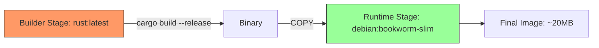

# 🚀 Cross-compilation and Deployment

## Introduction

Rust's "write once, compile everywhere" philosophy is one of its strongest selling points for systems engineering. A single codebase can target Windows, Linux, macOS, embedded ARM devices, and WebAssembly — all from the same source. However, cross-compilation introduces complexity: different ABIs, libc implementations, linker configurations, and deployment constraints. This module demystifies the process, teaching you how to build static binaries, optimize with Link Time Optimization (LTO), and containerize Rust applications for production.

Deployment is where theory meets reality. A fast, correct program is useless if it cannot be shipped. We will explore how [[00 - Welcome to Advanced Rust|Cloudflare]] and other organizations deploy Rust to edge workers, how to minimize binary size for constrained environments, and how Docker multi-stage builds can produce images as small as 5 MB. By the end of this module, you will be able to take any Rust project and deploy it to virtually any target.

## 1. Cross-compilation: Targets, Toolchains, musl vs glibc

Deep conceptual explanation:

- A **target triple** describes the architecture, vendor, OS, and ABI. Examples: `x86_64-unknown-linux-gnu`, `aarch64-unknown-linux-musl`, `wasm32-unknown-unknown`.
- **glibc** is the GNU C library. Binaries linked against glibc are smaller and faster but require a compatible glibc version on the target system. They cannot be fully static.
- **musl** is a lightweight C standard library. Binaries linked with musl can be fully static, making them portable across Linux distributions. The trade-off is slightly larger binary size and potentially slower math operations.
- **cross** is a tool that uses Docker containers to provide complete cross-compilation environments without polluting your host system.

⚠️ **Warning:** Cross-compiling C dependencies (via `cc` crate or `-sys` crates) requires the correct cross-compilation toolchain for C as well. Pure Rust crates cross-compile easily; C bindings do not.

💡 **Tip:** Use `cargo tree` to identify which dependencies pull in C code. Minimizing C dependencies makes cross-compilation dramatically simpler.

Real case: **Cloudflare** deploys Rust to edge workers using the `wasm32-unknown-unknown` target. Their Workers runtime executes WebAssembly modules, and Rust's wasm target produces compact, sandboxed binaries that start in microseconds. This allows them to run untrusted customer code at 300+ locations worldwide.

## 2. Static Linking, Dynamic Linking, and LTO

Linking strategy directly impacts portability and performance.

| Strategy | Portability | Size | Performance | Use Case |
|----------|-------------|------|-------------|----------|
| Dynamic (glibc) | Low (dependency hell) | Smallest | Fastest | Desktop apps, servers with controlled env |
| Static (musl) | High (single binary) | Larger | Fast | Containers, CLI tools, embedded |
| Static (glibc) | Medium | Medium | Fast | Rare; some glibc features resist static linking |
| LTO (Thin) | N/A | Smaller | Faster | Release builds, general optimization |
| LTO (Fat) | N/A | Smallest | Fastest | Maximum optimization, slower compile |

Table: Deployment targets comparison

| Target | libc | Static? | Notes |
|--------|------|---------|-------|
| x86_64-unknown-linux-gnu | glibc | No | Default Linux target |
| x86_64-unknown-linux-musl | musl | Yes | Best for containers |
| aarch64-unknown-linux-gnu | glibc | No | ARM servers (Graviton) |
| aarch64-unknown-linux-musl | musl | Yes | ARM embedded Linux |
| x86_64-pc-windows-msvc | None | Partial | Native Windows |
| x86_64-apple-darwin | None | Partial | macOS (requires SDK) |
| wasm32-unknown-unknown | None | Yes | WebAssembly, edge workers |

Formula:

```
Binary_Size = Code + Data + Dependencies - LTO
```

LTO removes unused functions across crate boundaries. Fat LTO analyzes the entire program at once; Thin LTO does it incrementally. For deployment, enable `lto = true` or `lto = "thin"` in `Cargo.toml`.

## 3. Docker Multi-stage Builds for Rust

Docker multi-stage builds let you compile in a full environment and copy only the binary into a minimal runtime image.




The builder stage includes Rust toolchain, build dependencies, and source code. The runtime stage contains only the compiled binary and essential system libraries. Using `scratch` or `distroless` images can reduce the final size to under 10 MB.

Real case: **Cloudflare** deploys Rust to edge workers using a custom build pipeline that compiles to WASM, runs `wasm-opt` for size reduction, and uploads the module to their edge network. The entire deployment from `git push` to global availability takes under 30 seconds.

## 4. Practical Cross-compilation and Dockerfile

Rust code blocks:

```rust
// Cross-compilation setup script (build.rs or just shell)
// In .cargo/config.toml:
// [target.aarch64-unknown-linux-musl]
// linker = "aarch64-linux-musl-gcc"

use std::env;

fn main() {
    let target = env::var("TARGET").unwrap_or_default();
    println!("Building for target: {}", target);

    if target.contains("musl") {
        println!("cargo:rustc-link-arg=-static");
    }
}
```

Dockerfile:

```dockerfile
# Stage 1: Build
FROM rust:1.75-bookworm AS builder
WORKDIR /app
COPY Cargo.toml Cargo.lock ./
COPY src ./src
RUN rustup target add x86_64-unknown-linux-musl
RUN apt-get update && apt-get install -y musl-tools
RUN cargo build --release --target x86_64-unknown-linux-musl

# Stage 2: Runtime
FROM scratch
COPY --from=builder /app/target/x86_64-unknown-linux-musl/release/myapp /myapp
ENTRYPOINT ["/myapp"]
```

This setup demonstrates:
- Adding a cross-compilation target with `rustup target add`
- Installing musl cross-compilation tools
- Building a fully static binary
- Using `scratch` for a zero-overhead runtime image

⚠️ **Warning:** When using `FROM scratch`, you cannot use DNS resolution or TLS unless you explicitly include CA certificates and `/etc/nsswitch.conf`. Use `debian:bookworm-slim` or `distroless/cc` for applications that need HTTPS.

💡 **Tip:** Use `cargo-auditable` to embed dependency information into your binary. This allows vulnerability scanners to detect CVEs in your Rust dependencies after deployment.

---

## 📦 Compression Code

Complete Rust script:

```rust
use std::process::Command;

fn main() {
    let output = Command::new("uname")
        .arg("-m")
        .output()
        .expect("Failed to execute uname");

    let arch = String::from_utf8_lossy(&output.stdout).trim().to_string();
    println!("Detected architecture: {}", arch);

    match arch.as_str() {
        "x86_64" => println!("Target: x86_64-unknown-linux-musl"),
        "aarch64" => println!("Target: aarch64-unknown-linux-musl"),
        _ => println!("Target: {}-unknown-linux-gnu", arch),
    }
}
```

## 🎯 Documented Project

### Description

Build a cross-platform CLI tool that prints system information. Package it for Linux (x86_64, aarch64, musl), Windows, and macOS using GitHub Actions. Provide both standalone binaries and Docker images for each platform.

### Functional Requirements

1. Detect and display CPU architecture, OS, and memory usage.
2. Compile to `x86_64-unknown-linux-musl` and `aarch64-unknown-linux-musl` with static linking.
3. Produce Windows `.exe` and macOS universal binaries via GitHub Actions matrix builds.
4. Build and push Docker images for both Linux architectures to a registry.
5. Include a `install.sh` script that detects the platform and downloads the correct binary from GitHub Releases.

### Main Components

- `src/main.rs`: CLI entry point using `clap` for argument parsing.
- `.github/workflows/release.yml`: Matrix builds for all targets.
- `Dockerfile`: Multi-stage build producing a scratch-based image.
- `install.sh`: Platform detection and binary download script.
- `Cross.toml`: Configuration for the `cross` tool.

### Success Metrics

- All 5 target platforms produce green CI builds on every tag.
- Linux binary runs on Alpine Linux without installing any dependencies.
- Docker image size is under 15 MB for all architectures.
- `install.sh` correctly installs the binary on Ubuntu, macOS, and WSL2.
- Release artifacts are uploaded to GitHub Releases within 10 minutes of tagging.

### References

- [Rust Platform Support](https://doc.rust-lang.org/nightly/rustc/platform-support.html)
- [Cross Compilation Tool: `cross`](https://github.com/cross-rs/cross)
- [Cloudflare Workers Rust SDK](https://github.com/cloudflare/workers-rs)
