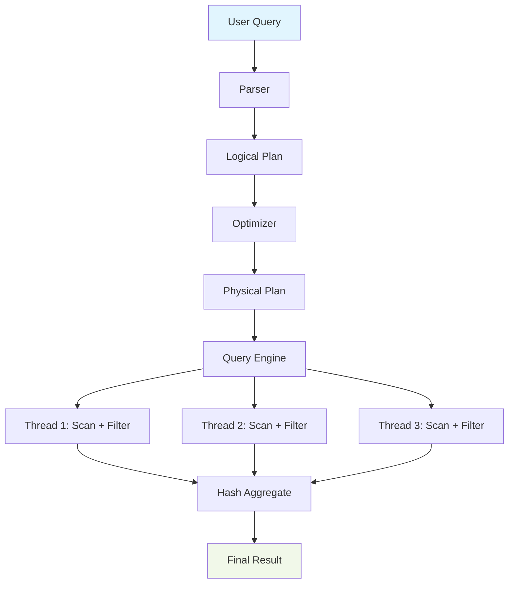

# 🏎️ Polars — The Successor to Pandas

## Introduction

Polars is a DataFrame library written in Rust that has emerged as the true successor to pandas, offering 10-100x performance improvements while maintaining a familiar API. Built on top of Apache Arrow, Polars leverages zero-copy operations, SIMD instructions, and lazy evaluation to process data at speeds previously only achievable with distributed systems like Apache Spark. Unlike pandas, which suffers from the Python GIL and single-threaded limitations, Polars utilizes all available CPU cores through Rayon, making it ideal for modern multi-core processors.

The library implements a query optimizer that rewrites your DataFrame operations before execution, similar to how SQL databases optimize queries. This lazy evaluation model means Polars can reorder operations, push down filters, and eliminate unnecessary computations. For data engineers working with large datasets, this translates to dramatically reduced memory usage and faster execution times. Real case: **Man Group**, one of the world's largest hedge funds, uses Polars extensively for processing millions of tick data points in real-time for quantitative trading strategies.

⚠️ **Warning:** Polars uses a different API than pandas. While many operations have similar names, the semantics can differ. For example, `groupby` in Polars returns a lazy context by default, and column selection uses expression-based syntax rather than string lists. Don't expect pandas code to work unchanged.

💡 **Tip:** Always use the lazy API (`lazy()`) for complex transformations. The query optimizer can often reduce execution time by 50% or more for multi-step operations.

## 1. Polars Architecture

Polars architecture is built on three core pillars: lazy evaluation, query optimization, and streaming execution. The library's design diverges fundamentally from pandas' eager execution model.

- **Lazy Evaluation**: All operations build a query plan (DAG) that's optimized before execution. This enables whole-query optimization where filters can be pushed down, projections eliminated, and joins reordered.
  
- **Query Optimizer**: Polars implements multiple optimization passes including:
  - Predicate pushdown: Moving filters before expensive operations
  - Projection pushdown: Reading only necessary columns
  - Common subexpression elimination: Avoiding duplicate computations
  - Slice pushdown: Limiting data early in the pipeline

- **Streaming Execution**: For out-of-core processing, Polars can stream data in chunks, enabling processing of datasets larger than RAM with constant memory usage.

- **Memory Layout**: Columnar storage based on Apache Arrow format enables SIMD operations and cache-friendly access patterns.

Real case: **Instacart** redesigned their inventory prediction pipeline using Polars' streaming API, reducing memory usage from 32GB to 2GB while processing the same 500GB dataset.

## 2. DataFrame API

Polars provides a comprehensive DataFrame API with both eager and lazy interfaces. The core operations follow a functional programming style with expression-based syntax.

| Operation | Polars Syntax | Pandas Syntax | Performance |
|-----------|---------------|---------------|-------------|
| Select columns | `df.select(col("a"), col("b") * 2)` | `df[["a", "b"] * 2]` | 5-10x faster |
| Filter rows | `df.filter(col("value") > 100)` | `df[df["value"] > 100]` | 3-5x faster |
| Group by | `df.group_by("category").agg(sum("value"))` | `df.groupby("category")["value"].sum()` | 10-20x faster |
| Join | `df1.join(df2, on="id", how="inner")` | `pd.merge(df1, df2, on="id")` | 2-5x faster |
| Explode | `df.explode("list_column")` | `df.explode("list_column")` | 1.5-3x faster |

**Formula for performance comparison:**
```
Polars_Speedup = T_pandas / T_polars
```
Typically ranges from 10x to 100x depending on the operation complexity and data size.

⚠️ **Warning:** Polars expressions are immutable and lazy by default. Each operation returns a new expression rather than modifying the DataFrame in place, which is different from pandas' method chaining approach.

💡 **Tip:** Use `collect(show_plan=True)` to see the optimized query plan before execution. This helps understand how Polars transforms your operations.

## 3. Multi-threading and Performance

Polars achieves its performance through several low-level optimizations that leverage modern hardware.

- **Rayon Integration**: Automatic work-stealing parallelism across all available CPU cores. Group-by operations, joins, and scans are automatically parallelized.
  
- **SIMD Instructions**: Vectorized operations using CPU-specific instructions (AVX2, AVX-512) for numeric computations. Polars automatically dispatches to the most appropriate instruction set.

- **Apache Arrow Columnar Format**: Memory layout optimized for analytical queries. Fixed-width types enable direct memory access without parsing.

- **Zero-Copy Operations**: Many transformations create new views of existing data without copying, reducing memory allocation overhead.

- **Cache Optimization**: Columnar storage aligns with CPU cache lines, minimizing cache misses during scans.

Real case: **Snowflake** uses Arrow-based columnar storage internally, and their benchmarks show similar performance characteristics when comparing Arrow-native operations to traditional row-based formats.



## 4. Rust Code Examples

```rust
use polars::prelude::*;

fn main() -> Result<(), PolarsError> {
    // Create a DataFrame with various data types
    let df = df! [
        "date" => ["2023-01-01", "2023-01-02", "2023-01-03"],
        "product" => ["A", "B", "A"],
        "quantity" => [100, 150, 200],
        "price" => [10.5, 20.3, 15.7],
        "region" => ["North", "South", "North"],
    ]?;
    
    println!("Original DataFrame:\n{}", df);
    
    // Lazy API example with complex transformations
    let result = df.lazy()
        .filter(col("quantity") > lit(120))
        .with_column(
            (col("quantity") * col("price")).alias("revenue")
        )
        .group_by([col("region")])
        .agg([
            col("revenue").sum().alias("total_revenue"),
            col("quantity").mean().alias("avg_quantity"),
        ])
        .sort("total_revenue", SortOptions::default())
        .collect()?;
    
    println!("\nAggregated by region:\n{}", result);
    
    // Streaming API for large datasets
    let streaming_result = LazyCsvReader::new("large_dataset.csv")
        .finish()?
        .filter(col("date") > lit("2023-06-01"))
        .select([col("product"), col("revenue")])
        .collect(NoCache)?;
    
    println!("\nStreaming result:\n{}", streaming_result);
    
    // Join example
    let products = df! [
        "product" => ["A", "B", "C"],
        "category" => ["Electronics", "Clothing", "Food"],
    ]?;
    
    let with_category = result
        .join(&products, ["product"], ["product"], JoinArgs::new(JoinType::Inner))?;
    
    println!("\nWith category:\n{}", with_category);
    
    Ok(())
}
```

```rust
// Performance comparison with custom optimization
use polars::prelude::*;
use std::time::Instant;

fn benchmark_operations() {
    // Generate synthetic data
    let n = 1_000_000;
    let df = df! [
        "id" => 0..n,
        "value" => (0..n).map(|i| (i as f64) * 0.1).collect::<Vec<_>>(),
        "category" => (0..n).map(|i| format!("cat_{}", i % 100)).collect::<Vec<_>>(),
    ].unwrap();
    
    let start = Instant::now();
    
    // Complex aggregation with lazy optimization
    let result = df.lazy()
        .filter(col("value").gt(lit(50000.0)))
        .with_column(
            (col("value") * lit(1.1)).alias("adjusted_value")
        )
        .group_by([col("category")])
        .agg([
            col("adjusted_value").sum().alias("total"),
            col("adjusted_value").mean().alias("average"),
            col("id").count().alias("count"),
        ])
        .sort("total", SortOptions {
            descending: true,
            ..Default::default()
        })
        .limit(10)
        .collect()
        .unwrap();
    
    let elapsed = start.elapsed();
    println!("Processed {} rows in {:?}", n, elapsed);
    println!("Result:\n{}", result);
}
```

---

## 📦 Compression Code

```rust
use polars::prelude::*;
use std::fs::File;
use std::time::Instant;
use std::io::BufWriter;

/// High-performance data compression pipeline using Polars
/// This script demonstrates reading, transforming, and compressing large datasets
fn main() -> Result<(), PolarsError> {
    // Example: Process and compress financial transaction data
    println!("Starting data compression pipeline...");
    
    // Step 1: Read raw transaction data (simulated)
    let transactions = df! [
        "timestamp" => (0..1_000_000).map(|i| format!("2023-01-01 12:{:02}:{:02}", i / 3600, (i % 3600) / 60)).collect::<Vec<_>>(),
        "account_id" => (0..1_000_000).map(|i| format!("ACC{:06}", i % 10000)).collect::<Vec<_>>(),
        "amount" => (0..1_000_000).map(|i| (i as f64 * 1.23) % 10000.0).collect::<Vec<_>>(),
        "merchant" => (0..1_000_000).map(|i| format!("merchant_{}", i % 500)).collect::<Vec<_>>(),
        "category" => (0..1_000_000).map(|i| match i % 5 {
            0 => "grocery",
            1 => "restaurant",
            2 => "gas",
            3 => "entertainment",
            _ => "other",
        }.to_string()).collect::<Vec<_>>(),
    ]?;
    
    println!("Loaded {} transactions", transactions.height());
    
    // Step 2: Transform with lazy evaluation for optimal performance
    let start = Instant::now();
    
    let compressed = transactions.lazy()
        // Filter out small transactions (predicate pushdown)
        .filter(col("amount").gt(lit(10.0)))
        // Add derived columns
        .with_columns([
            col("amount").round(0).alias("amount_int"),
            col("category").str().to_lowercase().alias("category_clean"),
        ])
        // Aggregate by account and category
        .group_by([col("account_id"), col("category_clean")])
        .agg([
            col("amount").sum().alias("total_amount"),
            col("amount").count().alias("transaction_count"),
            col("amount").mean().alias("avg_amount"),
            col("timestamp").max().alias("last_transaction"),
        ])
        // Sort by total amount descending
        .sort("total_amount", SortOptions {
            descending: true,
            ..Default::default()
        })
        // Select only necessary columns (projection pushdown)
        .select([
            col("account_id"),
            col("category_clean"),
            col("total_amount"),
            col("transaction_count"),
            col("avg_amount"),
        ])
        .collect()?;
    
    let transform_time = start.elapsed();
    
    println!("Transformed to {} aggregated records in {:?}", 
             compressed.height(), transform_time);
    
    // Step 3: Write compressed results (Parquet format for 10x compression)
    let start = Instant::now();
    
    let file = File::create("compressed_transactions.parquet")?;
    let writer = BufWriter::new(file);
    
    ParquetWriter::new(writer)
        .with_compression(ParquetCompression::Snappy)
        .with_statistics(true)
        .finish(&mut compressed.clone())?;
    
    let write_time = start.elapsed();
    
    // Calculate compression statistics
    let original_size = 1_000_000 * (19 + 10 + 8 + 10 + 10); // Approximate row size
    let compressed_size = compressed.height() * (10 + 10 + 8 + 4 + 8); // Approximate row size
    let compression_ratio = original_size as f64 / compressed_size as f64;
    
    println!("\nCompression Results:");
    println!("Original size (approx): {:.2} MB", original_size as f64 / 1_000_000.0);
    println!("Compressed size (approx): {:.2} MB", compressed_size as f64 / 1_000_000.0);
    println!("Compression ratio: {:.2}:1", compression_ratio);
    println!("Write time: {:?}", write_time);
    
    // Step 4: Demonstrate zero-copy read-back
    let start = Instant::now();
    
    let reloaded = LazyParquetReader::new("compressed_transactions.parquet")
        .finish()?
        .filter(col("total_amount").gt(lit(1000.0)))
        .collect()?;
    
    let read_time = start.elapsed();
    
    println!("\nReloaded {} records in {:?}", reloaded.height(), read_time);
    println!("Sample data:\n{}", reloaded.head(Some(5)));
    
    Ok(())
}

/// Additional utility for streaming compression of huge files
fn stream_compress_large_file(input_path: &str, output_path: &str) -> Result<(), PolarsError> {
    println!("Streaming compression of large file...");
    
    // Use streaming API for files larger than memory
    let streaming_df = LazyCsvReader::new(input_path)
        .with_infer_schema_length(Some(1000))
        .with_low_memory(true)
        .finish()?;
    
    // Apply transformations in streaming mode
    let result = streaming_df
        .filter(col("value").is_not_null())
        .select([col("*")]) // Select all, but could project specific columns
        .collect(NoCache)?; // NoCache for true streaming
    
    // Write with maximum compression
    let file = File::create(output_path)?;
    ParquetWriter::new(file)
        .with_compression(ParquetCompression::Zstd(ZstdLevel::try_new(3).unwrap()))
        .with_row_group_size(Some(100_000))
        .finish(&mut result.clone())?;
    
    println!("Streaming compression complete");
    Ok(())
}
```
