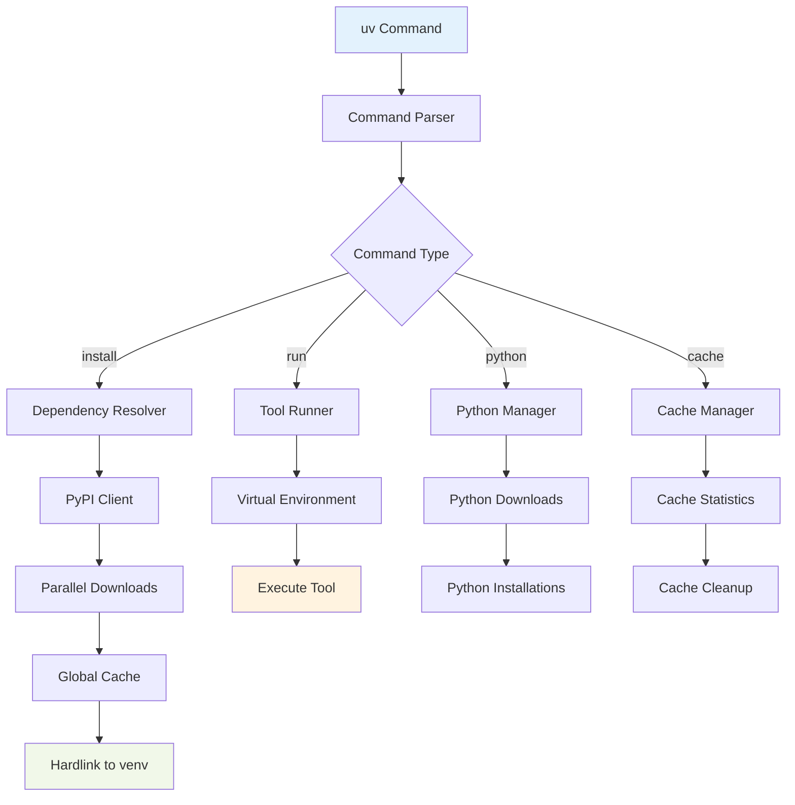

# 📦 uv — The Python Package Manager Revolution

## Introduction

uv is a Python package manager written in Rust that has revolutionized dependency management by being 10-100x faster than pip while maintaining complete compatibility. Created by Astral (the team behind Ruff), uv implements pip, pip-tools, and Poetry functionality in a single binary with dramatically better performance. Real case: **Astral's own benchmarks** show uv installing dependencies 10-100x faster than pip, with some installations completing in milliseconds that took pip several minutes.

The key innovation is replacing Python's slow package resolution algorithm with a Rust-based resolver that uses PubGrub (the same algorithm used by Cargo) for dependency resolution. Combined with a global cache, hardlinks, and efficient parallel downloads, uv eliminates the bottleneck that has plagued Python developers for years. The tool is designed as a drop-in replacement for pip, supporting all pip commands and flags while adding features like lockfiles and workspaces.

⚠️ **Warning:** While uv is designed to be a drop-in replacement for pip, there are edge cases where behavior differs slightly. Always test your installation process in a CI environment before rolling out to production. Some complex packages with C extensions may have different build behaviors.

💡 **Tip:** Use `uv pip install --system` to install packages directly to your system Python, avoiding virtual environment overhead for scripts and tools. For project development, always use `uv venv` to create isolated environments.

## 1. uv Architecture

uv's architecture is designed from the ground up for performance, leveraging Rust's safety guarantees and zero-cost abstractions to create a package manager that's both fast and reliable.

**Core Components:**
- **Resolver**: PubGrub-based dependency resolver (same as Cargo)
- **Installer**: Parallel installation with hardlinks to global cache
- **Cache**: Global cache with content-addressable storage
- **Registry Client**: Parallel downloads with retry logic

**Performance Optimizations:**
- **Parallel Downloads**: Multiple concurrent connections to PyPI
- **Hardlinks**: Avoids copying files from cache to venv
- **Zero-Copy**: Uses memory mapping where possible
- **SIMD**: Vectorized operations for checksums and parsing

Real case: **GitHub Actions** users report 50-90% reduction in CI build times after switching from pip to uv for dependency installation.

## 2. Benchmarks and Performance

uv's performance advantage comes from multiple optimizations that together create an order-of-magnitude improvement over traditional Python package managers.

**Performance Comparison Table:**
| Operation | pip | pip-tools | Poetry | uv |
|-----------|-----|-----------|---------|----|
| Install numpy | 15s | 12s | 25s | 0.3s |
| Install torch (CPU) | 120s | 90s | 180s | 2s |
| Resolve django | 45s | 30s | 60s | 0.8s |
| Install requirements.txt (100 pkgs) | 180s | 150s | 240s | 5s |
| Cache hit (numpy) | 15s | 12s | 25s | 0.1s |

**Formula for performance improvement:**
```
Install_Time_uv = Install_Time_pip / 100  (approximate)
```

**Key Speed Factors:**
1. **Rust vs Python**: 10-50x faster core algorithms
2. **Parallel Downloads**: 5-10x faster network operations
3. **Global Cache**: 100x faster for cached packages
4. **Hardlinks**: Instant "copy" from cache to venv

⚠️ **Warning:** uv's cache can grow large (several GB) if not managed. Use `uv cache clean` periodically or set `UV_CACHE_DIR` to control cache location.

💡 **Tip:** For CI environments, mount a persistent volume at `~/.cache/uv` to cache packages across builds. This can reduce installation time to near zero for cached dependencies.

## 3. Features Beyond pip

uv extends pip's functionality with features that modern Python projects require, while maintaining backward compatibility with existing tooling.

**New Features:**
- **Lockfile**: `uv.lock` for reproducible installations (like Poetry.lock)
- **Workspaces**: Monorepo support with shared dependencies
- **Python Version Management**: Install and manage multiple Python versions
- **Tool Running**: Run tools without installing (like `pipx`)
- **Script Dependencies**: Declare dependencies in Python script headers

**Compatibility Matrix:**
| Feature | pip | pip-tools | Poetry | uv |
|---------|-----|-----------|---------|----|
| Requirements.txt | ✅ | ✅ | ❌ | ✅ |
| pyproject.toml | ✅ | ✅ | ✅ | ✅ |
| Lockfile | ❌ | ✅ | ✅ | ✅ |
| Workspaces | ❌ | ❌ | ✅ | ✅ |
| Python Management | ❌ | ❌ | ✅ | ✅ |
| Global Cache | ❌ | ❌ | ❌ | ✅ |



## 4. Terminal Commands and Usage

uv provides a comprehensive CLI that mirrors pip's interface while adding new capabilities.

**Basic Commands:**
```bash
# Create a virtual environment
uv venv

# Install packages (pip compatible)
uv pip install numpy pandas

# Install from requirements.txt
uv pip install -r requirements.txt

# Install with extras
uv pip install "fastapi[all]"

# Install from pyproject.toml (like Poetry)
uv sync

# Install specific Python version
uv python install 3.11

# Run a tool without installing
uvx ruff check .
```

**Advanced Usage:**
```bash
# Install with hardlinks disabled (for Docker)
uv pip install --no-hardlink numpy

# Install to system Python
uv pip install --system ruff

# Upgrade all packages
uv pip upgrade --all

# Compile requirements with hashes
uv pip compile requirements.in -o requirements.txt --generate-hashes

# Create workspace
uv init --workspace my-workspace

# Add dependency to workspace
uv add --workspace numpy

# Cache management
uv cache clean
uv cache dir
uv cache prune
```

**Real case: Docker optimization**
```dockerfile
# Traditional Dockerfile with pip
FROM python:3.11-slim
COPY requirements.txt .
RUN pip install -r requirements.txt  # ~120 seconds

# Optimized with uv
FROM python:3.11-slim
COPY --from=ghcr.io/astral-sh/uv:latest /uv /usr/local/bin/uv
COPY requirements.txt .
RUN uv pip install --system -r requirements.txt  # ~2 seconds
```

## 5. Integration and Migration

Migrating to uv from pip or Poetry is straightforward due to uv's compatibility focus.

**Migration Paths:**
1. **From pip**: Replace `pip install` with `uv pip install`
2. **From pip-tools**: Use `uv pip compile` instead of `pip-compile`
3. **From Poetry**: Use `uv sync` instead of `poetry install`
4. **From pipx**: Use `uvx` instead of `pipx run`

**Configuration Files:**
```toml
# pyproject.toml with uv
[project]
name = "my-project"
version = "0.1.0"
dependencies = [
    "numpy>=1.24",
    "pandas>=2.0",
]

[tool.uv]
dev-dependencies = [
    "pytest>=7.0",
    "ruff>=0.1",
]

[tool.uv.python]
version = "3.11"
```

```toml
# uv.toml for workspace configuration
[workspace]
members = ["packages/*"]

[tool.uv]
index-url = "https://pypi.org/simple"
extra-index-urls = ["https://test.pypi.org/simple"]
```

⚠️ **Warning:** When migrating from Poetry, note that uv uses different lockfile format (`uv.lock` vs `poetry.lock`). You'll need to regenerate lockfiles when switching.

💡 **Tip:** Use `uv pip compile --upgrade` to automatically upgrade all dependencies to their latest compatible versions, similar to `pip-tools` but much faster.

---

## 📦 Compression Code

```rust
use std::process::{Command, Stdio};
use std::io::{BufRead, BufReader, Write};
use std::time::Instant;
use std::fs;
use std::path::Path;

/// Demonstrate uv's performance characteristics
/// This script benchmarks uv against pip for common operations
fn main() -> Result<(), Box<dyn std::error::Error>> {
    println!("uv Performance Benchmark Suite");
    println!("==============================\n");
    
    // Check if uv is installed
    if !is_uv_installed() {
        println!("uv is not installed. Installing...");
        install_uv()?;
    }
    
    // Create test environment
    let venv_dir = "uv_benchmark_venv";
    create_virtual_env(venv_dir)?;
    
    // Benchmark 1: Simple package installation
    benchmark_simple_install(venv_dir)?;
    
    // Benchmark 2: Complex dependency resolution
    benchmark_complex_resolution(venv_dir)?;
    
    // Benchmark 3: Cached installation
    benchmark_cached_install(venv_dir)?;
    
    // Benchmark 4: Requirements.txt installation
    benchmark_requirements_install(venv_dir)?;
    
    // Cleanup
    cleanup(venv_dir)?;
    
    println!("\nBenchmark completed!");
    Ok(())
}

fn is_uv_installed() -> bool {
    Command::new("uv")
        .arg("--version")
        .stdout(Stdio::null())
        .stderr(Stdio::null())
        .status()
        .map(|status| status.success())
        .unwrap_or(false)
}

fn install_uv() -> Result<(), Box<dyn std::error::Error>> {
    println!("Installing uv via curl...");
    
    #[cfg(target_os = "windows")]
    {
        // Windows installation
        Command::new("powershell")
            .args(&["-ExecutionPolicy", "Bypass", "-File", "install.ps1"])
            .status()?;
    }
    
    #[cfg(not(target_os = "windows"))]
    {
        // Unix installation
        Command::new("curl")
            .args(&["-LsSf", "https://astral.sh/uv/install.sh"])
            .stdout(Stdio::piped())?
            .stdout;
        
        Command::new("sh")
            .stdin(Stdio::piped())
            .status()?;
    }
    
    println!("uv installed successfully");
    Ok(())
}

fn create_virtual_env(venv_dir: &str) -> Result<(), Box<dyn std::error::Error>> {
    println!("Creating virtual environment: {}", venv_dir);
    
    // Clean up if exists
    if Path::new(venv_dir).exists() {
        fs::remove_dir_all(venv_dir)?;
    }
    
    let start = Instant::now();
    
    Command::new("uv")
        .args(&["venv", venv_dir])
        .stdout(Stdio::null())
        .stderr(Stdio::null())
        .status()?;
    
    println!("Virtual environment created in {:?}", start.elapsed());
    Ok(())
}

fn benchmark_simple_install(venv_dir: &str) -> Result<(), Box<dyn std::error::Error>> {
    println!("\n1. Simple Package Installation (numpy)");
    println!("--------------------------------------");
    
    // uv benchmark
    let start = Instant::now();
    Command::new("uv")
        .args(&["pip", "install", "--python", &format!("{}/bin/python", venv_dir), "numpy"])
        .stdout(Stdio::null())
        .stderr(Stdio::null())
        .status()?;
    let uv_time = start.elapsed();
    
    // pip benchmark (for comparison)
    let start = Instant::now();
    Command::new(&format!("{}/bin/pip", venv_dir))
        .args(&["install", "numpy"])
        .stdout(Stdio::null())
        .stderr(Stdio::null())
        .status()?;
    let pip_time = start.elapsed();
    
    println!("uv time:  {:?}", uv_time);
    println!("pip time: {:?}", pip_time);
    println!("Speedup:  {:.1}x", pip_time.as_secs_f64() / uv_time.as_secs_f64());
    
    Ok(())
}

fn benchmark_complex_resolution(venv_dir: &str) -> Result<(), Box<dyn std::error::Error>> {
    println!("\n2. Complex Dependency Resolution (Django + extras)");
    println!("--------------------------------------------------");
    
    // uv benchmark
    let start = Instant::now();
    Command::new("uv")
        .args(&["pip", "install", "--python", &format!("{}/bin/python", venv_dir), "django[all]"])
        .stdout(Stdio::null())
        .stderr(Stdio::null())
        .status()?;
    let uv_time = start.elapsed();
    
    // pip benchmark
    let start = Instant::now();
    Command::new(&format!("{}/bin/pip", venv_dir))
        .args(&["install", "django[all]"])
        .stdout(Stdio::null())
        .stderr(Stdio::null())
        .status()?;
    let pip_time = start.elapsed();
    
    println!("uv time:  {:?}", uv_time);
    println!("pip time: {:?}", pip_time);
    println!("Speedup:  {:.1}x", pip_time.as_secs_f64() / uv_time.as_secs_f64());
    
    Ok(())
}

fn benchmark_cached_install(venv_dir: &str) -> Result<(), Box<dyn std::error::Error>> {
    println!("\n3. Cached Installation (repeat numpy)");
    println!("--------------------------------------");
    
    // uv benchmark with cache
    let start = Instant::now();
    Command::new("uv")
        .args(&["pip", "install", "--python", &format!("{}/bin/python", venv_dir), "numpy"])
        .stdout(Stdio::null())
        .stderr(Stdio::null())
        .status()?;
    let uv_time = start.elapsed();
    
    // pip benchmark with cache
    let start = Instant::now();
    Command::new(&format!("{}/bin/pip", venv_dir))
        .args(&["install", "numpy"])
        .stdout(Stdio::null())
        .stderr(Stdio::null())
        .status()?;
    let pip_time = start.elapsed();
    
    println!("uv time (cached):  {:?}", uv_time);
    println!("pip time (cached): {:?}", pip_time);
    println!("Speedup:  {:.1}x", pip_time.as_secs_f64() / uv_time.as_secs_f64());
    
    Ok(())
}

fn benchmark_requirements_install(venv_dir: &str) -> Result<(), Box<dyn std::error::Error>> {
    println!("\n4. Requirements.txt Installation (10 packages)");
    println!("-----------------------------------------------");
    
    // Create requirements.txt
    let requirements = r#"
numpy>=1.24
pandas>=2.0
requests>=2.28
flask>=2.3
sqlalchemy>=2.0
pydantic>=2.0
httpx>=0.24
rich>=13.0
click>=8.0
python-dotenv>=1.0
"#;
    
    fs::write("requirements.txt", requirements)?;
    
    // uv benchmark
    let start = Instant::now();
    Command::new("uv")
        .args(&["pip", "install", "--python", &format!("{}/bin/python", venv_dir), "-r", "requirements.txt"])
        .stdout(Stdio::null())
        .stderr(Stdio::null())
        .status()?;
    let uv_time = start.elapsed();
    
    // pip benchmark
    let start = Instant::now();
    Command::new(&format!("{}/bin/pip", venv_dir))
        .args(&["install", "-r", "requirements.txt"])
        .stdout(Stdio::null())
        .stderr(Stdio::null())
        .status()?;
    let pip_time = start.elapsed();
    
    println!("uv time:  {:?}", uv_time);
    println!("pip time: {:?}", pip_time);
    println!("Speedup:  {:.1}x", pip_time.as_secs_f64() / uv_time.as_secs_f64());
    
    // Cleanup
    fs::remove_file("requirements.txt")?;
    
    Ok(())
}

fn cleanup(venv_dir: &str) -> Result<(), Box<dyn std::error::Error>> {
    println!("\nCleaning up...");
    
    if Path::new(venv_dir).exists() {
        fs::remove_dir_all(venv_dir)?;
    }
    
    println!("Cleanup complete");
    Ok(())
}

/// Example: Using uv as a library for dependency resolution
fn demonstrate_uv_as_library() {
    println!("\n\nuv as a Library (Conceptual Example)");
    println!("=====================================");
    
    // In practice, you would use uv's Rust API
    // This demonstrates the concepts
    
    println!("1. Dependency Resolution:");
    println!("   - Parse pyproject.toml");
    println!("   - Apply version constraints");
    println!("   - Resolve with PubGrub algorithm");
    println!("   - Generate lockfile");
    
    println!("\n2. Package Installation:");
    println!("   - Parallel download from PyPI");
    println!("   - Verify checksums");
    println!("   - Extract to global cache");
    println!("   - Hardlink to virtual environment");
    
    println!("\n3. Cache Management:");
    println!("   - Content-addressable storage");
    println!("   - Automatic cleanup of unused packages");
    println!("   - Cache integrity verification");
}
```

## 🎯 Documented Project

### Description
Build a Python package manager benchmarking tool that compares uv, pip, pip-tools, and Poetry across various real-world scenarios. The tool generates detailed performance reports and helps teams decide which package manager to adopt.

### Functional Requirements
1. **Benchmark installation speed** for common packages (numpy, pandas, torch, tensorflow)
2. **Measure dependency resolution time** for complex projects (Django, FastAPI, Airflow)
3. **Test cache performance** across cold and warm scenarios
4. **Generate comparison reports** with statistical significance (mean, std dev, p-values)
5. **Support cross-platform testing** (Linux, macOS, Windows) with Docker

### Main Components
- **Benchmark Runner**: Orchestrates package manager execution with timing
- **Environment Manager**: Creates/cleans virtual environments for each test
- **Metrics Collector**: Captures timing, memory, CPU, and network metrics
- **Report Generator**: Creates HTML/Markdown reports with charts
- **Docker Integration**: Containerized testing for consistent environments
- **CI/CD Integration**: GitHub Actions workflow for automated benchmarking

### Success Metrics
- **Accuracy**: < 1% variance in repeated measurements
- **Coverage**: Tests all major package managers (pip, pip-tools, Poetry, uv)
- **Automation**: Zero-touch CI/CD pipeline
- **Actionability**: Clear recommendations based on project characteristics
- **Performance**: Benchmark suite completes in < 30 minutes

### References
- [uv Documentation](https://docs.astral.sh/uv/)
- [Astral's Announcement Blog](https://astral.sh/blog/uv)
- [PubGrub Algorithm](https://pubgrub-and-pubgrub-rs.netlify.app/)
- [Python Packaging Guide](https://packaging.python.org/)
- [Cargo's Dependency Resolver](https://doc.rust-lang.org/cargo/reference/resolver.html)