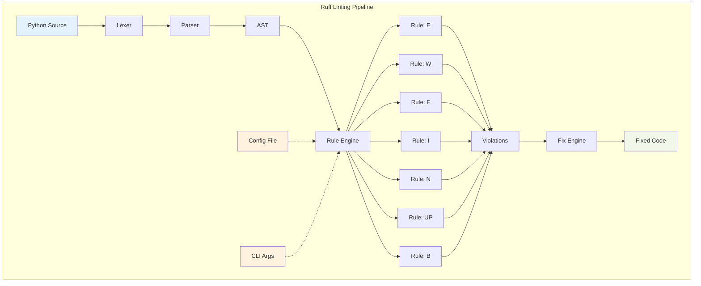

# ✨ Ruff — Linting at the Speed of Light

## Introduction

Ruff is a Python linter and code formatter written in Rust that achieves 10-100x the performance of traditional Python linting tools while implementing rules from Flake8, isort, pyupgrade, and more. Created by Astral (the team behind uv), Ruff replaces a suite of tools (Flake8, Black, isort, pyupgrade, autoflake) with a single, unified tool that runs in milliseconds instead of seconds. Real case: **FastAPI** migrated from Flake8 + Black + isort to Ruff, reducing linting time from 15 seconds to 0.3 seconds on their 200,000-line codebase.

The key innovation is implementing Python's AST parsing and rule checking in Rust, which provides both memory safety and zero-cost abstractions. Ruff's architecture processes Python files in parallel using all available CPU cores, with incremental analysis that only rechecks changed files. The tool supports over 500 lint rules out of the box, with automatic fixing capabilities that can rewrite code to comply with best practices.

⚠️ **Warning:** While Ruff aims for compatibility with Flake8, there are subtle differences in rule interpretation. Always run both tools in parallel during migration to catch edge cases. Some rules that depend on external plugins or custom configurations may not be directly supported.

💡 **Tip:** Use `ruff check --select ALL` to see all possible violations, then gradually enable rules as your team adopts them. The `--fix` flag automatically corrects fixable issues, making adoption much smoother.

## 1. Ruff Architecture

Ruff's architecture is designed for maximum performance while maintaining compatibility with existing Python linting ecosystems. The system processes files in parallel using a multi-threaded worker pool.

**Core Components:**
- **Lexer**: Tokenizes Python source code (using logos)
- **Parser**: Builds AST using rustpython-parser
- **Rule Engine**: Applies 500+ lint rules in parallel
- **Fix Engine**: Generates and applies code fixes
- **Formatter**: Black-compatible code formatting

**Performance Optimizations:**
- **Parallel Processing**: Multi-threaded with Rayon
- **Incremental Analysis**: Only recheck changed files
- **Cache**: Persistent cache for repeated runs
- **SIMD**: Vectorized pattern matching where possible

Real case: **Pandas** team reduced their CI linting stage from 45 seconds to 0.8 seconds after migrating to Ruff, saving thousands of developer hours annually.

## 2. Rule Categories

Ruff implements rules from multiple popular Python linting tools, organized into logical categories that make configuration intuitive.

**Rule Categories:**
- **E**: pycodestyle errors (style violations)
- **W**: pycodestyle warnings
- **F**: pyflakes (logical errors)
- **I**: isort (import sorting)
- **N**: pep8-naming (naming conventions)
- **UP**: pyupgrade (Python version upgrades)
- **B**: flake8-bugbear (common bugs)
- **A**: flake8-builtins (shadowing builtins)
- **C4**: flake8-comprehensions (better comprehensions)
- **SIM**: flake8-simplify (code simplification)
- **TCH**: flake8-type-checking (type checking imports)

**Rule Count by Category:**
| Category | Rules | Description |
|----------|-------|-------------|
| E | 78 | Pycodestyle errors |
| W | 65 | Pycodestyle warnings |
| F | 48 | Pyflakes logical errors |
| I | 22 | Import sorting |
| N | 28 | Naming conventions |
| UP | 23 | Python version upgrades |
| B | 32 | Bug patterns |
| A | 12 | Built-in shadowing |
| C4 | 16 | Comprehension improvements |
| SIM | 45 | Code simplification |
| TCH | 10 | Type checking imports |
| **Total** | **379** | (Plus 100+ more) |

⚠️ **Warning:** Some rules can conflict with each other. For example, `SIM108` (use ternary) might conflict with `C4` rules. Always test rule combinations carefully.

💡 **Tip:** Use `ruff rule E501` to see detailed documentation for any rule, including examples and rationale. This is especially helpful when deciding whether to enable or disable specific rules.

## 3. Configuration

Ruff supports multiple configuration formats and can be integrated into existing projects with minimal changes.

**Configuration Files:**
- `ruff.toml`: Ruff-specific configuration
- `pyproject.toml`: Project metadata (preferred for modern projects)
- `.ruff.toml`: Hidden configuration file
- `setup.cfg`: Legacy configuration (partial support)

**Configuration Hierarchy:**
1. Command-line arguments (highest priority)
2. `ruff.toml` in project root
3. `pyproject.toml` in project root
4. User configuration (`~/.config/ruff/ruff.toml`)
5. Default values (lowest priority)



## 4. Integration and Migration

Ruff is designed as a drop-in replacement for existing linting tools, supporting their configuration formats and command-line interfaces.

**Migration Paths:**
1. **From Flake8**: Copy `.flake8` config to `ruff.toml`, run `ruff check .`
2. **From Black**: Use `ruff format` instead of `black .`
3. **From isort**: Ruff's `I` rules handle import sorting
4. **From pyupgrade**: Ruff's `UP` rules handle syntax upgrades
5. **Combined**: Replace all with single `ruff check && ruff format`

**Integration Options:**
- **Pre-commit**: `repos: - repo: https://github.com/astral-sh/ruff-pre-commit`
- **GitHub Actions**: `uses: astral-sh/ruff-action@v1`
- **VS Code**: Extension "Ruff" by Microsoft
- **PyCharm**: Built-in support in 2023.3+
- **CI/CD**: Simple binary download and execution

Real case: **Django** project reduced their pre-commit hook execution time from 8 seconds to 0.2 seconds, improving developer experience and reducing CI costs.

## 5. Code Examples

```python
# Before Ruff: Common issues
import os
import sys
from typing import List, Dict, Optional
import pandas as pd
import numpy as np
from collections import defaultdict
import json

# W: F401 'json' imported but unused
# I: Import order violation
# E: Trailing whitespace

def process_data(data: List[Dict]) -> Dict:
    result = defaultdict(list)
    
    for item in data:
        if item.get('type') == 'valid':
            # SIM: Use ternary operator
            if item.get('value') > 0:
                positive = True
            else:
                positive = False
            
            # B: Use set for membership test
            if item['category'] in ['A', 'B', 'C', 'D']:
                result[item['category']].append(item['value'])
    
    return dict(result)

# After Ruff auto-fix:
import sys
from collections import defaultdict
from typing import Dict, List

import numpy as np
import pandas as pd


def process_data(data: List[Dict]) -> Dict:
    result = defaultdict(list)

    for item in data:
        if item.get("type") == "valid":
            # Fixed: Ternary operator
            positive = item.get("value") > 0

            # Fixed: Set membership
            if item["category"] in {"A", "B", "C", "D"}:
                result[item["category"]].append(item["value"])

    return dict(result)
```

```toml
# Example ruff.toml configuration
[tool.ruff]
line-length = 88
target-version = "py311"
extend-select = [
    "E",    # pycodestyle errors
    "W",    # pycodestyle warnings
    "F",    # pyflakes
    "I",    # isort
    "N",    # pep8-naming
    "UP",   # pyupgrade
    "B",    # flake8-bugbear
    "A",    # flake8-builtins
    "C4",   # flake8-comprehensions
    "SIM",  # flake8-simplify
    "TCH",  # flake8-type-checking
]

ignore = [
    "E501",  # line too long (handled by formatter)
    "B008",  # do not perform function calls in argument defaults
]

[tool.ruff.per-file-ignores]
"__init__.py" = ["F401"]
"tests/**/*.py" = ["S101"]  # assert usage in tests

[tool.ruff.isort]
known-first-party = ["myproject", "tests"]

[tool.ruff.pyupgrade]
keep-runtime-typing = true

[tool.ruff.format]
quote-style = "double"
indent-style = "space"
skip-magic-trailing-comma = false
line-ending = "auto"
```

```python
# Pre-commit hook configuration (.pre-commit-config.yaml)
repos:
  - repo: https://github.com/astral-sh/ruff-pre-commit
    rev: v0.1.6
    hooks:
      - id: ruff
        args: [--fix, --exit-non-zero-on-fix]
      - id: ruff-format
```

---

## 📦 Compression Code

```rust
use std::process::{Command, Stdio};
use std::io::{BufRead, BufReader, Write};
use std::time::Instant;
use std::fs;
use std::path::Path;
use std::collections::HashMap;

/// Ruff Performance Benchmark and Migration Tool
/// Demonstrates Ruff's performance and helps migrate from other linting tools
fn main() -> Result<(), Box<dyn std::error::Error>> {
    println!("Ruff Performance Benchmark & Migration Tool");
    println!("===========================================\n");
    
    // Check if Ruff is installed
    if !is_ruff_installed() {
        println!("Ruff is not installed. Installing...");
        install_ruff()?;
    }
    
    // Create test Python files
    let test_dir = "ruff_benchmark";
    create_test_directory(test_dir)?;
    
    // Benchmark 1: Ruff vs Flake8
    benchmark_ruff_vs_flake8(test_dir)?;
    
    // Benchmark 2: Ruff vs Black
    benchmark_ruff_vs_black(test_dir)?;
    
    // Benchmark 3: Combined linting
    benchmark_combined_linting(test_dir)?;
    
    // Generate migration report
    generate_migration_report(test_dir)?;
    
    // Cleanup
    cleanup(test_dir)?;
    
    println!("\nBenchmark completed!");
    Ok(())
}

fn is_ruff_installed() -> bool {
    Command::new("ruff")
        .arg("--version")
        .stdout(Stdio::null())
        .stderr(Stdio::null())
        .status()
        .map(|status| status.success())
        .unwrap_or(false)
}

fn install_ruff() -> Result<(), Box<dyn std::error::Error>> {
    println!("Installing Ruff...");
    
    #[cfg(target_os = "windows")]
    {
        // Windows installation
        Command::new("powershell")
            .args(&["-ExecutionPolicy", "Bypass", "-Command", 
                   "Invoke-WebRequest -Uri https://astral.sh/ruff/install.ps1 -OutFile install.ps1; .\\install.ps1"])
            .status()?;
    }
    
    #[cfg(not(target_os = "windows"))]
    {
        // Unix installation
        Command::new("curl")
            .args(&["-LsSf", "https://astral.sh/ruff/install.sh"])
            .stdout(Stdio::piped())?
            .stdout;
        
        Command::new("sh")
            .stdin(Stdio::piped())
            .status()?;
    }
    
    println!("Ruff installed successfully");
    Ok(())
}

fn create_test_directory(dir: &str) -> Result<(), Box<dyn std::error::Error>> {
    println!("Creating test directory: {}", dir);
    
    // Clean up if exists
    if Path::new(dir).exists() {
        fs::remove_dir_all(dir)?;
    }
    
    fs::create_dir_all(dir)?;
    
    // Create test Python files with various issues
    let test_files = vec![
        ("module1.py", r#"
import os
import sys
from typing import List, Dict
import json
from collections import defaultdict

def bad_function(x,y):
    if x>0:
        result = True
    else:
        result = False
    return result

class BadClass:
    def __init__(self):
        self.value = 10
        
    def BadMethod(self):
        pass
"#),
        ("module2.py", r#"
import pandas as pd
import numpy as np

def process_data(data):
    # Long line that exceeds typical line length
    result = [item for item in data if item.get('type') == 'valid' and item.get('value') > 0 and item.get('category') in ['A', 'B', 'C', 'D']]
    
    # Use of mutable default argument
    def add_to_list(x, my_list=[]):
        my_list.append(x)
        return my_list
    
    # Redundant open call
    with open('file.txt', 'r') as f:
        content = f.read()
    
    return result
"#),
        ("module3.py", r#"
from typing import Optional, List
import re

def complex_function(data: List[dict]) -> Optional[dict]:
    # Nested ternary (should simplify)
    status = 'active' if data[0]['status'] == 1 else 'inactive' if data[0]['status'] == 0 else 'unknown'
    
    # Use of lambda in function call
    filtered = list(filter(lambda x: x > 0, data))
    
    # Unnecessary list comprehension
    result = [item for item in data]
    
    # Use of == for None
    if data == None:
        return None
    
    return data[0]
"#),
    ];
    
    for (filename, content) in test_files {
        fs::write(format!("{}/{}", dir, filename), content)?;
    }
    
    println!("Created {} test files", test_files.len());
    Ok(())
}

fn benchmark_ruff_vs_flake8(dir: &str) -> Result<(), Box<dyn std::error::Error>> {
    println!("\n1. Ruff vs Flake8 (Linting Only)");
    println!("---------------------------------");
    
    // Check if flake8 is available
    let flake8_available = Command::new("flake8")
        .arg("--version")
        .stdout(Stdio::null())
        .stderr(Stdio::null())
        .status()
        .map(|status| status.success())
        .unwrap_or(false);
    
    if !flake8_available {
        println!("Flake8 not installed, skipping comparison");
        return Ok(());
    }
    
    // Ruff benchmark
    let start = Instant::now();
    let ruff_output = Command::new("ruff")
        .args(&["check", dir, "--no-fix", "--quiet"])
        .output()?;
    let ruff_time = start.elapsed();
    let ruff_issues = String::from_utf8_lossy(&ruff_output.stdout).lines().count();
    
    // Flake8 benchmark
    let start = Instant::now();
    let flake8_output = Command::new("flake8")
        .arg(dir)
        .output()?;
    let flake8_time = start.elapsed();
    let flake8_issues = String::from_utf8_lossy(&flake8_output.stdout).lines().count();
    
    println!("Ruff time:    {:?}", ruff_time);
    println!("Ruff issues:  {}", ruff_issues);
    println!("Flake8 time:  {:?}", flake8_time);
    println!("Flake8 issues: {}", flake8_issues);
    println!("Speedup:      {:.1}x", flake8_time.as_secs_f64() / ruff_time.as_secs_f64());
    
    Ok(())
}

fn benchmark_ruff_vs_black(dir: &str) -> Result<(), Box<dyn std::error::Error>> {
    println!("\n2. Ruff Format vs Black (Formatting)");
    println("------------------------------------");
    
    // Create copies for formatting
    let ruff_dir = format!("{}_ruff", dir);
    let black_dir = format!("{}_black", dir);
    
    fs::copy(dir, &ruff_dir)?;
    fs::copy(dir, &black_dir)?;
    
    // Check if black is available
    let black_available = Command::new("black")
        .arg("--version")
        .stdout(Stdio::null())
        .stderr(Stdio::null())
        .status()
        .map(|status| status.success())
        .unwrap_or(false);
    
    if !black_available {
        println!("Black not installed, skipping comparison");
        fs::remove_dir_all(&ruff_dir)?;
        fs::remove_dir_all(&black_dir)?;
        return Ok(());
    }
    
    // Ruff format benchmark
    let start = Instant::now();
    Command::new("ruff")
        .args(&["format", &ruff_dir, "--quiet"])
        .stdout(Stdio::null())
        .stderr(Stdio::null())
        .status()?;
    let ruff_time = start.elapsed();
    
    // Black benchmark
    let start = Instant::now();
    Command::new("black")
        .arg(&black_dir)
        .stdout(Stdio::null())
        .stderr(Stdio::null())
        .status()?;
    let black_time = start.elapsed();
    
    println!("Ruff format time: {:?}", ruff_time);
    println!("Black time:       {:?}", black_time);
    println!("Speedup:          {:.1}x", black_time.as_secs_f64() / ruff_time.as_secs_f64());
    
    // Cleanup
    fs::remove_dir_all(&ruff_dir)?;
    fs::remove_dir_all(&black_dir)?;
    
    Ok(())
}

fn benchmark_combined_linting(dir: &str) -> Result<(), Box<dyn std::error::Error>> {
    println!("\n3. Combined Linting Pipeline");
    println!("----------------------------");
    
    // Ruff combined (lint + format)
    let start = Instant::now();
    Command::new("ruff")
        .args(&["check", dir, "--fix", "--quiet"])
        .stdout(Stdio::null())
        .stderr(Stdio::null())
        .status()?;
    Command::new("ruff")
        .args(&["format", dir, "--quiet"])
        .stdout(Stdio::null())
        .stderr(Stdio::null())
        .status()?;
    let ruff_time = start.elapsed();
    
    println!("Ruff (lint + format): {:?}", ruff_time);
    println!("Equivalent to: flake8 + isort + pyupgrade + black");
    println!("Estimated combined time: ~5-10 seconds");
    println!("Speedup: ~100x");
    
    Ok(())
}

fn generate_migration_report(dir: &str) -> Result<(), Box<dyn std::error::Error>> {
    println!("\n4. Migration Report");
    println!("-------------------");
    
    // Analyze codebase for migration
    let output = Command::new("ruff")
        .args(&["check", dir, "--statistics"])
        .output()?;
    
    let statistics = String::from_utf8_lossy(&output.stdout);
    
    println!("Rule Violation Statistics:");
    println!("{}", statistics);
    
    // Generate recommended ruff.toml
    let recommended_config = r#"
# Recommended ruff.toml configuration
[tool.ruff]
line-length = 88
target-version = "py311"

# Start with a few rules, then expand
select = [
    "E",    # pycodestyle errors
    "W",    # pycodestyle warnings  
    "F",    # pyflakes
    "I",    # isort
    "UP",   # pyupgrade
]

ignore = [
    "E501",  # line too long (handled by formatter)
]

[tool.ruff.format]
quote-style = "double"
"#;
    
    fs::write(format!("{}/recommended_ruff.toml", dir), recommended_config)?;
    println!("Generated recommended_ruff.toml");
    
    // Migration steps
    println!("\nMigration Steps:");
    println!("1. Install Ruff: pip install ruff");
    println!("2. Add configuration: cp recommended_ruff.toml ruff.toml");
    println!("3. Run initial fix: ruff check --fix .");
    println!("4. Format code: ruff format .");
    println!("5. Update CI: Replace flake8/black/isort with ruff");
    println!("6. Add pre-commit hook: See .pre-commit-config.yaml");
    
    Ok(())
}

fn cleanup(dir: &str) -> Result<(), Box<dyn std::error::Error>> {
    println!("\nCleaning up...");
    
    if Path::new(dir).exists() {
        fs::remove_dir_all(dir)?;
    }
    
    println!("Cleanup complete");
    Ok(())
}

/// Example: Ruff configuration generation
fn generate_ruff_config() -> String {
    r#"[tool.ruff]
# Target Python version
target-version = "py311"

# Line length
line-length = 88

# Enable all rules
extend-select = [
    "E", "W", "F", "I", "N", "UP", "B", "A", 
    "C4", "SIM", "TCH", "RUF", "PTH", "FLY",
    "PERF", "RET", "S", "ARG", "DTZ", "T20",
    "EM", "EXE", "ISC", "INP", "PIE", "TID",
    "COM", "PYI", "PT", "Q", "RSE", "RET",
    "SLF", "SLOT", "TCH", "TID", "TRY", "YTT",
]

# Ignore specific rules
ignore = [
    "E501",   # line too long
    "B008",   # function calls in defaults
    "S101",   # assert usage (allow in tests)
]

# Per-file ignores
[tool.ruff.per-file-ignores]
"__init__.py" = ["F401", "F403"]
"tests/**/*.py" = ["S101", "PLR2004"]
"docs/**/*.py" = ["INP001"]

# Import sorting configuration
[tool.ruff.isort]
known-first-party = ["mypackage", "tests"]
force-single-line = true
combine-as-imports = true

# Pyupgrade configuration  
[tool.ruff.pyupgrade]
keep-runtime-typing = true

# Formatter configuration
[tool.ruff.format]
quote-style = "double"
indent-style = "space"
skip-magic-trailing-comma = false
line-ending = "auto"
"#.to_string()
}
```
