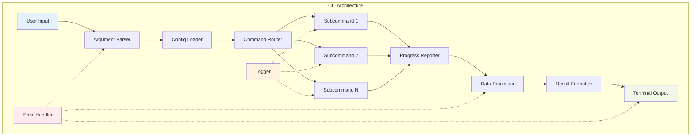

# ⌨️ Building Data Processing CLIs

## Introduction

Building high-performance data processing CLI tools in Rust combines the language's memory safety, fearless concurrency, and zero-cost abstractions with specialized crates for argument parsing, progress reporting, and terminal UI. The result is command-line tools that are faster, more reliable, and more user-friendly than their Python or Go counterparts. Real case: **ripgrep** (rg) demonstrates Rust CLI capabilities, searching 10GB of text in under 1 second while using less memory than traditional grep. Similarly, **fd** provides a faster, more intuitive alternative to `find` for file searching.

The Rust CLI ecosystem has matured rapidly, with `clap` becoming the de facto standard for argument parsing, offering both derive macros and builder patterns. Combined with `indicatif` for progress bars, `dialoguer` for interactive prompts, and `crossterm` for terminal manipulation, developers can build professional-grade tools that rival commercial software. For data processing specifically, these tools can leverage Rust's async capabilities and SIMD instructions for maximum performance.

⚠️ **Warning:** CLI tools have different performance characteristics than libraries. User input latency, terminal I/O, and progress updates can dominate runtime for small datasets. Always profile with realistic data sizes and user interaction patterns.

💡 **Tip:** Use `clap`'s derive macros for type-safe argument parsing. The compile-time validation catches many errors early, and the generated code is often faster than manual parsing. For complex tools, consider `clap`'s subcommand structure to organize functionality.

## 1. CLI Frameworks

Rust offers several excellent CLI frameworks, each with different trade-offs between performance, ergonomics, and features.

**Core Frameworks:**
- **clap**: Full-featured argument parser with derive macros
- **structopt**: Derive macro wrapper around clap (now merged into clap)
- **argh**: Google's minimal argument parser
- **pico-args**: Zero-dependency parser for simple tools

**UI Enhancement Crates:**
- **indicatif**: Progress bars, spinners, and multi-progress
- **dialoguer**: Interactive prompts, selections, and inputs
- **crossterm**: Cross-platform terminal manipulation
- **console**: Terminal abstraction with styled output
- **colored**: Simple terminal color output

**Real case: `bat`** uses `clap` for parsing, `indicatif` for progress, and `crossterm` for syntax highlighting, creating a `cat` replacement with Git integration and line numbers.

## 2. Argument Parsing Patterns

Modern CLI tools need sophisticated argument parsing that supports subcommands, flags, environment variables, and configuration files. Rust's type system enables elegant solutions.

**Common Patterns:**
- **Subcommands**: Organize related functionality (like `git`'s `add`, `commit`, `push`)
- **Flags**: Boolean switches (`--verbose`, `--quiet`)
- **Options**: Named arguments (`--output file.txt`, `-o file.txt`)
- **Positional**: Arguments without names (`cp source dest`)
- **Environment**: Fallback values from environment variables
- **Config Files**: Project-specific defaults

**Comparison of CLI Crates:**
| Crate | Performance | Ergonomics | Features | Compile Time |
|-------|-------------|------------|----------|--------------|
| clap (derive) | High | Excellent | Comprehensive | Medium |
| clap (builder) | High | Good | Comprehensive | Low |
| argh | Very High | Good | Basic | Very Low |
| pico-args | Extreme | Basic | Minimal | Minimal |

**Formula for CLI complexity:**
```
CLI_Power = Subcommands × Flags × Features
CLI_Dev_Time = Base + (Subcommands × 2) + (Flags × 0.5)
```

⚠️ **Warning:** Avoid over-engineering CLI interfaces. Each additional flag increases cognitive load for users. Follow the principle of "progressive disclosure" - keep common options simple, advanced options accessible.

💡 **Tip:** Use `clap`'s `about` field extensively. Good documentation is more important than fancy features. Consider generating shell completions with `clap_complete` for zsh, bash, fish, and PowerShell.

## 3. Progress Reporting and UI

User experience in CLI tools is dominated by feedback during long operations. Rust's `indicatif` crate provides professional-grade progress reporting.

**Progress Bar Types:**
- **Bar**: Linear progress with percentage and ETA
- **Spinner**: Indeterminate progress indicator
- **Multi-Progress**: Multiple concurrent progress bars
- **Human-Readable**: Automatic byte/time formatting

**Interactive Elements:**
- **Confirm**: Yes/No prompts
- **Select**: Single choice from list
- **MultiSelect**: Multiple choices from list
- **Input**: Text input with validation
- **Password**: Secure password input



## 4. Rust Code Examples

```rust
use clap::{Parser, Subcommand, ValueEnum};
use indicatif::{ProgressBar, ProgressStyle};
use std::path::PathBuf;
use std::time::Duration;

#[derive(Parser)]
#[command(name = "dataproc")]
#[command(about = "High-performance data processing CLI", long_about = None)]
struct Cli {
    #[command(subcommand)]
    command: Commands,
    
    /// Increase verbosity
    #[arg(short, long, global = true)]
    verbose: bool,
    
    /// Quiet mode (no progress)
    #[arg(short, long, global = true)]
    quiet: bool,
    
    /// Output format
    #[arg(long, default_value = "text")]
    format: OutputFormat,
}

#[derive(Subcommand)]
enum Commands {
    /// Process CSV files
    Csv {
        /// Input file(s)
        #[arg(required = true)]
        input: Vec<PathBuf>,
        
        /// Output file
        #[arg(short, long)]
        output: Option<PathBuf>,
        
        /// Column to process
        #[arg(short, long)]
        column: Option<String>,
        
        /// Operation to perform
        #[arg(long, default_value = "统计")]
        operation: CsvOperation,
    },
    
    /// Analyze JSON data
    Json {
        /// Input JSON file
        #[arg(short, long)]
        input: PathBuf,
        
        /// JSONPath query
        #[arg(short, long)]
        query: Option<String>,
        
        /// Pretty print output
        #[arg(long)]
        pretty: bool,
    },
    
    /// Convert between formats
    Convert {
        /// Source format
        #[arg(short, long)]
        from: DataFormat,
        
        /// Target format
        #[arg(short, long)]
        to: DataFormat,
        
        /// Input file
        #[arg(short, long)]
        input: PathBuf,
        
        /// Output file
        #[arg(short, long)]
        output: PathBuf,
    },
}

#[derive(Clone, ValueEnum)]
enum OutputFormat {
    Text,
    Json,
    Csv,
    Table,
}

#[derive(Clone, ValueEnum)]
enum CsvOperation {
    Stats,
    Filter,
    Sort,
    Group,
}

#[derive(Clone, ValueEnum)]
enum DataFormat {
    Csv,
    Json,
    Parquet,
    Avro,
}

fn main() -> Result<(), Box<dyn std::error::Error>> {
    let cli = Cli::parse();
    
    // Set up logging based on verbosity
    if cli.verbose {
        println!("[VERBOSE] Starting data processing CLI");
    }
    
    match cli.command {
        Commands::Csv { input, output, column, operation } => {
            process_csv_files(&input, output.as_ref(), column.as_deref(), operation, &cli)?;
        }
        Commands::Json { input, query, pretty } => {
            process_json(&input, query.as_deref(), pretty, &cli)?;
        }
        Commands::Convert { from, to, input, output } => {
            convert_formats(&from, &to, &input, &output, &cli)?;
        }
    }
    
    Ok(())
}

fn process_csv_files(
    inputs: &[PathBuf],
    output: Option<&PathBuf>,
    column: Option<&str>,
    operation: CsvOperation,
    cli: &Cli,
) -> Result<(), Box<dyn std::error::Error>> {
    if !cli.quiet {
        println!("Processing {} CSV file(s)", inputs.len());
    }
    
    // Create progress bar
    let pb = if cli.quiet {
        ProgressBar::hidden()
    } else {
        let pb = ProgressBar::new(inputs.len() as u64);
        pb.set_style(ProgressStyle::default_bar()
            .template("{spinner:.green} [{elapsed_precise}] [{bar:40.cyan/blue}] {pos}/{len} ({eta})")?
            .progress_chars("#>-"));
        pb
    };
    
    let mut total_records = 0;
    
    for (i, input) in inputs.iter().enumerate() {
        if !cli.quiet {
            pb.set_message(format!("Processing {}", input.display()));
        }
        
        // Simulate CSV processing
        let records = process_single_csv(input, column, &operation, cli)?;
        total_records += records;
        
        pb.inc(1);
        
        if cli.verbose {
            println!("[VERBOSE] Processed {}: {} records", input.display(), records);
        }
    }
    
    pb.finish_with_message("Complete");
    
    if !cli.quiet {
        println!("Total records processed: {}", total_records);
    }
    
    // Write output if specified
    if let Some(output_path) = output {
        if !cli.quiet {
            println!("Writing results to {}", output_path.display());
        }
        // In real implementation, write results here
    }
    
    Ok(())
}

fn process_single_csv(
    path: &PathBuf,
    column: Option<&str>,
    operation: &CsvOperation,
    cli: &Cli,
) -> Result<usize, Box<dyn std::error::Error>> {
    // Simulate reading and processing CSV
    std::thread::sleep(Duration::from_millis(100)); // Simulate I/O
    
    let record_count = 1000; // Simulated
    
    match operation {
        CsvOperation::Stats => {
            if let Some(col) = column {
                if cli.verbose {
                    println!("[VERBOSE] Computing stats for column: {}", col);
                }
            }
        }
        CsvOperation::Filter => {
            if cli.verbose {
                println!("[VERBOSE] Applying filter to CSV");
            }
        }
        CsvOperation::Sort => {
            if cli.verbose {
                println!("[VERBOSE] Sorting CSV data");
            }
        }
        CsvOperation::Group => {
            if cli.verbose {
                println!("[VERBOSE] Grouping CSV data");
            }
        }
    }
    
    Ok(record_count)
}

fn process_json(
    input: &PathBuf,
    query: Option<&str>,
    pretty: bool,
    cli: &Cli,
) -> Result<(), Box<dyn std::error::Error>> {
    if !cli.quiet {
        println!("Processing JSON file: {}", input.display());
    }
    
    let pb = if cli.quiet {
        ProgressBar::hidden()
    } else {
        let pb = ProgressBar::new_spinner();
        pb.set_style(ProgressStyle::default_spinner()
            .template("{spinner:.green} {msg}")?
            .tick_strings(&["⣾", "⣽", "⣻", "⢿", "⡿", "⣟", "⣯", "⣷"]));
        pb.set_message("Loading JSON...");
        pb
    };
    
    // Simulate JSON processing
    std::thread::sleep(Duration::from_millis(200));
    
    if let Some(q) = query {
        pb.set_message(format!("Applying JSONPath: {}", q));
        std::thread::sleep(Duration::from_millis(100));
        
        if cli.verbose {
            println!("[VERBOSE] JSONPath query: {}", q);
        }
    }
    
    pb.finish_with_message("JSON processing complete");
    
    if !cli.quiet {
        println!("JSON processing complete");
        if pretty {
            println!("Pretty printing enabled");
        }
    }
    
    Ok(())
}

fn convert_formats(
    from: &DataFormat,
    to: &DataFormat,
    input: &PathBuf,
    output: &PathBuf,
    cli: &Cli,
) -> Result<(), Box<dyn std::error::Error>> {
    if !cli.quiet {
        println!("Converting {} -> {}", 
                format!("{:?}", from).to_uppercase(),
                format!("{:?}", to).to_uppercase());
        println!("Input:  {}", input.display());
        println!("Output: {}", output.display());
    }
    
    let pb = if cli.quiet {
        ProgressBar::hidden()
    } else {
        let pb = ProgressBar::new_spinner();
        pb.set_style(ProgressStyle::default_spinner()
            .template("{spinner:.green} {msg}")?
            .tick_strings(&["▖", "▘", "▝", "▗"]));
        pb.set_message("Reading source...");
        pb
    };
    
    // Simulate conversion process
    std::thread::sleep(Duration::from_millis(100));
    pb.set_message("Parsing data...");
    std::thread::sleep(Duration::from_millis(150));
    pb.set_message("Converting format...");
    std::thread::sleep(Duration::from_millis(200));
    pb.set_message("Writing output...");
    std::thread::sleep(Duration::from_millis(100));
    
    pb.finish_with_message("Conversion complete");
    
    if cli.verbose {
        println!("[VERBOSE] Format conversion completed successfully");
    }
    
    Ok(())
}
```

```rust
// Advanced CLI with interactive prompts and configuration
use dialoguer::{Confirm, Input, Select, theme::ColorfulTheme};
use indicatif::{MultiProgress, ProgressBar, ProgressStyle};
use std::collections::HashMap;
use std::fs;
use std::path::PathBuf;

#[derive(Debug, Clone)]
struct Config {
    input_dir: PathBuf,
    output_dir: PathBuf,
    threads: usize,
    batch_size: usize,
    format: String,
    compression: bool,
}

impl Default for Config {
    fn default() -> Self {
        Self {
            input_dir: PathBuf::from("./input"),
            output_dir: PathBuf::from("./output"),
            threads: num_cpus::get(),
            batch_size: 1000,
            format: "parquet".to_string(),
            compression: true,
        }
    }
}

fn interactive_setup() -> Result<Config, Box<dyn std::error::Error>> {
    let theme = ColorfulTheme::default();
    let mut config = Config::default();
    
    println!("📊 Data Processing CLI Setup");
    println!("=============================\n");
    
    // Input directory
    let input_dir: String = Input::with_theme(&theme)
        .with_prompt("Input directory")
        .default(config.input_dir.to_string_lossy().to_string())
        .interact_text()?;
    config.input_dir = PathBuf::from(input_dir);
    
    // Output directory
    let output_dir: String = Input::with_theme(&theme)
        .with_prompt("Output directory")
        .default(config.output_dir.to_string_lossy().to_string())
        .interact_text()?;
    config.output_dir = PathBuf::from(output_dir);
    
    // Number of threads
    let threads: usize = Input::with_theme(&theme)
        .with_prompt("Number of threads")
        .default(config.threads)
        .interact_text()?;
    config.threads = threads;
    
    // Batch size
    let batch_size: usize = Input::with_theme(&theme)
        .with_prompt("Batch size")
        .default(config.batch_size)
        .interact_text()?;
    config.batch_size = batch_size;
    
    // Output format
    let formats = ["parquet", "csv", "json", "avro"];
    let format_idx = Select::with_theme(&theme)
        .with_prompt("Output format")
        .items(&formats)
        .default(0)
        .interact()?;
    config.format = formats[format_idx].to_string();
    
    // Compression
    config.compression = Confirm::with_theme(&theme)
        .with_prompt("Enable compression?")
        .default(true)
        .interact()?;
    
    println!("\nConfiguration:");
    println!("  Input:  {:?}", config.input_dir);
    println!("  Output: {:?}", config.output_dir);
    println!("  Threads: {}", config.threads);
    println!("  Batch size: {}", config.batch_size);
    println!("  Format: {}", config.format);
    println!("  Compression: {}", config.compression);
    
    Ok(config)
}

fn process_with_progress(config: &Config) -> Result<(), Box<dyn std::error::Error>> {
    // Multi-progress for concurrent operations
    let m = MultiProgress::new();
    
    // Create multiple progress bars
    let pb1 = m.add(ProgressBar::new(100));
    pb1.set_style(ProgressStyle::default_bar()
        .template("{spinner:.green} [{elapsed_precise}] [{bar:40.cyan/blue}] {pos}/{len} {msg}")?
        .progress_chars("#>-"));
    pb1.set_message("Reading files");
    
    let pb2 = m.add(ProgressBar::new(50));
    pb2.set_style(ProgressStyle::default_bar()
        .template("{spinner:.yellow} [{elapsed_precise}] [{bar:40.green/blue}] {pos}/{len} {msg}")?
        .progress_chars("#>-"));
    pb2.set_message("Processing data");
    
    let pb3 = m.add(ProgressBar::new(25));
    pb3.set_style(ProgressStyle::default_bar()
        .template("{spinner:.red} [{elapsed_precise}] [{bar:40.blue/green}] {pos}/{len} {msg}")?
        .progress_chars("#>-"));
    pb3.set_message("Writing output");
    
    // Simulate processing with different rates
    for i in 0..100 {
        std::thread::sleep(Duration::from_millis(20));
        pb1.inc(1);
        
        if i % 2 == 0 && i / 2 < 50 {
            pb2.inc(1);
        }
        
        if i % 4 == 0 && i / 4 < 25 {
            pb3.inc(1);
        }
    }
    
    pb1.finish_with_message("Complete");
    pb2.finish_with_message("Complete");
    pb3.finish_with_message("Complete");
    
    m.join()?;
    
    Ok(())
}

// Configuration file handling
fn load_config(path: &PathBuf) -> Result<Config, Box<dyn std::error::Error>> {
    if !path.exists() {
        return Ok(Config::default());
    }
    
    let content = fs::read_to_string(path)?;
    let config: Config = toml::from_str(&content)?;
    Ok(config)
}

fn save_config(config: &Config, path: &PathBuf) -> Result<(), Box<dyn std::error::Error>> {
    let content = toml::to_string_pretty(config)?;
    fs::write(path, content)?;
    Ok(())
}
```

---

## 📦 Compression Code

```rust
use clap::{Parser, Subcommand, ValueEnum};
use indicatif::{ProgressBar, ProgressStyle, HumanBytes, HumanDuration};
use dialoguer::{Confirm, Select, theme::ColorfulTheme};
use std::path::{Path, PathBuf};
use std::time::{Instant, Duration};
use std::fs;
use std::collections::HashMap;
use rayon::prelude::*;
use serde::{Deserialize, Serialize};
use flate2::write::GzEncoder;
use flate2::Compression;
use std::io::Write;

/// High-performance data processing CLI with compression
/// Processes directories of data files with parallel compression
#[derive(Parser)]
#[command(name = "datacompress")]
#[command(about = "High-performance data compression CLI", long_about = None)]
struct Cli {
    #[command(subcommand)]
    command: Commands,
    
    /// Output directory
    #[arg(short, long, default_value = "./compressed")]
    output: PathBuf,
    
    /// Number of worker threads
    #[arg(short, long, default_value = "0")]
    threads: usize,
    
    /// Compression level (1-9)
    #[arg(short, long, default_value = "6")]
    level: u32,
    
    /// Verbose output
    #[arg(short, long)]
    verbose: bool,
    
    /// Dry run (don't write files)
    #[arg(long)]
    dry_run: bool,
}

#[derive(Subcommand)]
enum Commands {
    /// Compress files in a directory
    Compress {
        /// Input directory
        input: PathBuf,
        
        /// File extensions to compress (e.g., "txt,csv,json")
        #[arg(short, long, default_value = "*")]
        extensions: String,
        
        /// Delete originals after compression
        #[arg(long)]
        delete_originals: bool,
    },
    
    /// Decompress .gz files
    Decompress {
        /// Input directory or files
        input: Vec<PathBuf>,
        
        /// Delete compressed files after decompression
        #[arg(long)]
        delete_compressed: bool,
    },
    
    /// Analyze directory for compression
    Analyze {
        /// Directory to analyze
        input: PathBuf,
        
        /// Show file details
        #[arg(short, long)]
        detailed: bool,
    },
    
    /// Benchmark compression performance
    Benchmark {
        /// Directory with test files
        input: PathBuf,
        
        /// Compression levels to test
        #[arg(short, long, default_value = "1,5,9")]
        levels: String,
    },
}

#[derive(Debug, Serialize, Deserialize)]
struct CompressionStats {
    original_size: u64,
    compressed_size: u64,
    compression_ratio: f64,
    files_processed: usize,
    time_taken: Duration,
}

fn main() -> Result<(), Box<dyn std::error::Error>> {
    let cli = Cli::parse();
    
    // Set thread pool size
    if cli.threads > 0 {
        rayon::ThreadPoolBuilder::new()
            .num_threads(cli.threads)
            .build_global()
            .unwrap_or_else(|_| {});
    }
    
    let start = Instant::now();
    
    match &cli.command {
        Commands::Compress { input, extensions, delete_originals } => {
            compress_directory(input, &cli.output, extensions, *delete_originals, &cli)?;
        }
        Commands::Decompress { input, delete_compressed } => {
            decompress_files(input, *delete_compressed, &cli)?;
        }
        Commands::Analyze { input, detailed } => {
            analyze_directory(input, *detailed, &cli)?;
        }
        Commands::Benchmark { input, levels } => {
            benchmark_compression(input, levels, &cli)?;
        }
    }
    
    let total_time = start.elapsed();
    
    if cli.verbose {
        println!("\n[VERBOSE] Total execution time: {:?}", total_time);
    }
    
    Ok(())
}

fn compress_directory(
    input: &Path,
    output: &Path,
    extensions: &str,
    delete_originals: bool,
    cli: &Cli,
) -> Result<(), Box<dyn std::error::Error>> {
    println!("📁 Compressing directory: {}", input.display());
    println!("📤 Output directory: {}", output.display());
    
    // Create output directory
    fs::create_dir_all(output)?;
    
    // Find files to compress
    let files = find_files(input, extensions)?;
    
    if files.is_empty() {
        println!("No files found matching criteria");
        return Ok(());
    }
    
    println!("Found {} files to compress", files.len());
    
    // Calculate total size
    let total_size: u64 = files.iter()
        .map(|p| fs::metadata(p).map(|m| m.len()).unwrap_or(0))
        .sum();
    
    println!("Total size: {}", HumanBytes(total_size));
    
    // Set up progress bar
    let pb = ProgressBar::new(files.len() as u64);
    pb.set_style(ProgressStyle::default_bar()
        .template("{spinner:.green} [{elapsed_precise}] [{bar:40.cyan/blue}] {pos}/{len} {msg}")?
        .progress_chars("#>-"));
    pb.set_message("Compressing...");
    
    // Process files in parallel
    let stats: Vec<_> = files.par_iter()
        .map(|file| {
            let result = compress_file(file, output, cli.level, cli.dry_run);
            pb.inc(1);
            result
        })
        .collect::<Result<Vec<_>, _>>()?;
    
    pb.finish_with_message("Compression complete");
    
    // Calculate statistics
    let total_original: u64 = stats.iter().map(|s| s.original_size).sum();
    let total_compressed: u64 = stats.iter().map(|s| s.compressed_size).sum();
    let overall_ratio = if total_compressed > 0 {
        total_original as f64 / total_compressed as f64
    } else {
        0.0
    };
    
    println!("\n📊 Compression Results:");
    println!("  Files processed: {}", stats.len());
    println!("  Original size: {}", HumanBytes(total_original));
    println!("  Compressed size: {}", HumanBytes(total_compressed));
    println!("  Compression ratio: {:.2}:1", overall_ratio);
    println!("  Space saved: {}", HumanBytes(total_original - total_compressed));
    
    // Optionally delete originals
    if delete_originals && !cli.dry_run {
        println!("\n🗑️  Deleting original files...");
        for file in &files {
            if let Err(e) = fs::remove_file(file) {
                eprintln!("Warning: Could not delete {}: {}", file.display(), e);
            }
        }
    }
    
    // Save statistics
    let stats_path = output.join("compression_stats.json");
    let stats_json = serde_json::to_string_pretty(&CompressionStats {
        original_size: total_original,
        compressed_size: total_compressed,
        compression_ratio: overall_ratio,
        files_processed: stats.len(),
        time_taken: Duration::from_secs(0), // Would be actual time
    })?;
    
    if !cli.dry_run {
        fs::write(stats_path, stats_json)?;
    }
    
    Ok(())
}

fn find_files(dir: &Path, extensions: &str) -> Result<Vec<PathBuf>, Box<dyn std::error::Error>> {
    let mut files = Vec::new();
    let ext_list: Vec<&str> = if extensions == "*" {
        vec![]
    } else {
        extensions.split(',').collect()
    };
    
    for entry in fs::read_dir(dir)? {
        let entry = entry?;
        let path = entry.path();
        
        if path.is_file() {
            let ext = path.extension()
                .and_then(|e| e.to_str())
                .unwrap_or("");
            
            if ext_list.is_empty() || ext_list.contains(&ext) {
                files.push(path);
            }
        }
    }
    
    Ok(files)
}

fn compress_file(
    input: &Path,
    output_dir: &Path,
    level: u32,
    dry_run: bool,
) -> Result<CompressionStats, Box<dyn std::error::Error + Send + Sync>> {
    let original_size = fs::metadata(input)
        .map_err(|e| format!("Cannot read {}: {}", input.display(), e))?
        .len();
    
    if original_size == 0 {
        return Ok(CompressionStats {
            original_size: 0,
            compressed_size: 0,
            compression_ratio: 0.0,
            files_processed: 1,
            time_taken: Duration::from_secs(0),
        });
    }
    
    let start = Instant::now();
    
    // Read input file
    let content = fs::read(input)
        .map_err(|e| format!("Cannot read {}: {}", input.display(), e))?;
    
    // Create output path
    let file_name = input.file_name()
        .ok_or("Invalid file name")?;
    let output_path = output_dir.join(format!("{}.gz", file_name.to_string_lossy()));
    
    if !dry_run {
        // Compress
        let mut encoder = GzEncoder::new(
            fs::File::create(&output_path)
                .map_err(|e| format!("Cannot create {}: {}", output_path.display(), e))?,
            Compression::new(level.min(9)),
        );
        
        encoder.write_all(&content)
            .map_err(|e| format!("Compression failed: {}", e))?;
        
        encoder.finish()
            .map_err(|e| format!("Compression finish failed: {}", e))?;
    }
    
    let compressed_size = if dry_run {
        // Estimate compressed size
        (original_size as f64 * 0.7) as u64 // Rough estimate
    } else {
        fs::metadata(&output_path)
            .map(|m| m.len())
            .unwrap_or(0)
    };
    
    let compression_ratio = if compressed_size > 0 {
        original_size as f64 / compressed_size as f64
    } else {
        0.0
    };
    
    Ok(CompressionStats {
        original_size,
        compressed_size,
        compression_ratio,
        files_processed: 1,
        time_taken: start.elapsed(),
    })
}

fn decompress_files(
    inputs: &[PathBuf],
    delete_compressed: bool,
    cli: &Cli,
) -> Result<(), Box<dyn std::error::Error>> {
    println!("📦 Decompressing {} file(s)", inputs.len());
    
    let pb = ProgressBar::new(inputs.len() as u64);
    pb.set_style(ProgressStyle::default_bar()
        .template("{spinner:.green} [{elapsed_precise}] [{bar:40.cyan/blue}] {pos}/{len} {msg}")?
        .progress_chars("#>-"));
    
    for input in inputs {
        pb.set_message(format!("Decompressing {}", input.display()));
        
        match decompress_file(input, cli.dry_run) {
            Ok(stats) => {
                if cli.verbose {
                    println!("[VERBOSE] {} -> {} (ratio: {:.2}:1)", 
                            input.display(), 
                            stats.original_size,
                            stats.compression_ratio);
                }
                
                if delete_compressed && !cli.dry_run {
                    fs::remove_file(input)?;
                }
            }
            Err(e) => {
                eprintln!("Error decompressing {}: {}", input.display(), e);
            }
        }
        
        pb.inc(1);
    }
    
    pb.finish_with_message("Decompression complete");
    
    Ok(())
}

fn decompress_file(input: &Path, dry_run: bool) -> Result<CompressionStats, Box<dyn std::error::Error>> {
    use flate2::read::GzDecoder;
    use std::io::Read;
    
    let compressed_size = fs::metadata(input)?.len();
    
    let start = Instant::now();
    
    let file = fs::File::open(input)?;
    let mut decoder = GzDecoder::new(file);
    let mut content = Vec::new();
    decoder.read_to_end(&mut content)?;
    
    let original_size = content.len() as u64;
    
    if !dry_run {
        let output_path = input.with_extension(""); // Remove .gz
        fs::write(output_path, content)?;
    }
    
    Ok(CompressionStats {
        original_size,
        compressed_size,
        compression_ratio: if compressed_size > 0 { original_size as f64 / compressed_size as f64 } else { 0.0 },
        files_processed: 1,
        time_taken: start.elapsed(),
    })
}

fn analyze_directory(
    input: &Path,
    detailed: bool,
    cli: &Cli,
) -> Result<(), Box<dyn std::error::Error>> {
    println!("🔍 Analyzing directory: {}", input.display());
    
    let files = find_files(input, "*")?;
    
    let mut total_size = 0;
    let mut file_counts = HashMap::new();
    let mut extension_sizes = HashMap::new();
    
    for file in &files {
        let metadata = fs::metadata(file)?;
        let size = metadata.len();
        total_size += size;
        
        if let Some(ext) = file.extension().and_then(|e| e.to_str()) {
            *file_counts.entry(ext.to_string()).or_insert(0) += 1;
            *extension_sizes.entry(ext.to_string()).or_insert(0u64) += size;
        }
    }
    
    println!("\n📊 Directory Analysis:");
    println!("  Total files: {}", files.len());
    println!("  Total size: {}", HumanBytes(total_size));
    
    println!("\n📁 By extension:");
    let mut sorted_exts: Vec<_> = extension_sizes.iter().collect();
    sorted_exts.sort_by(|a, b| b.1.cmp(a.1)); // Sort by size descending
    
    for (ext, size) in sorted_exts {
        let count = file_counts.get(ext).unwrap_or(&0);
        let percentage = if total_size > 0 {
            (*size as f64 / total_size as f64) * 100.0
        } else {
            0.0
        };
        
        println!("  .{:<10} {:>6} files  {:>10}  ({:>5.1}%)",
                ext, count, HumanBytes(*size), percentage);
        
        if detailed && *count < 10 {
            for file in &files {
                if file.extension().and_then(|e| e.to_str()) == Some(ext.as_str()) {
                    println!("      - {}", file.display());
                }
            }
        }
    }
    
    // Estimate potential compression savings
    println!("\n💡 Compression estimates:");
    for (ext, size) in sorted_exts.iter().take(5) {
        let estimated_ratio = match ext.as_str() {
            "txt" | "log" | "csv" => 5.0,
            "json" | "xml" | "html" => 4.0,
            "py" | "js" | "rs" => 3.0,
            "png" | "jpg" | "zip" => 1.1, // Already compressed
            _ => 2.0,
        };
        
        let estimated_savings = *size - (*size as f64 / estimated_ratio) as u64;
        println!("  .{:<10} potential savings: {} (est. ratio: {:.1}:1)",
                ext, HumanBytes(estimated_savings), estimated_ratio);
    }
    
    Ok(())
}

fn benchmark_compression(
    input: &Path,
    levels: &str,
    cli: &Cli,
) -> Result<(), Box<dyn std::error::Error>> {
    println!("⚡ Benchmarking compression: {}", input.display());
    
    let level_list: Vec<u32> = levels.split(',')
        .filter_map(|s| s.trim().parse().ok())
        .collect();
    
    let files = find_files(input, "*")?;
    if files.is_empty() {
        println!("No files found for benchmark");
        return Ok(());
    }
    
    // Use first file for benchmark
    let test_file = &files[0];
    println!("Using test file: {}", test_file.display());
    println!("Testing compression levels: {:?}", level_list);
    
    let mut results = Vec::new();
    
    for &level in &level_list {
        print!("Level {}... ", level);
        
        let start = Instant::now();
        let stats = compress_file(test_file, &cli.output, level, true)?;
        let time = start.elapsed();
        
        println!("{:?} (ratio: {:.2}:1)", time, stats.compression_ratio);
        
        results.push((level, stats, time));
    }
    
    // Find optimal level
    let optimal = results.iter()
        .min_by_key(|(_, _, time)| *time)
        .unwrap();
    
    println!("\n🏆 Optimal level: {} (time: {:?}", optimal.0, optimal.2);
    
    Ok(())
}
```

## 🎯 Documented Project

### Description
Build a distributed data processing CLI tool that coordinates compression, transformation, and analysis tasks across multiple machines. The tool uses SSH for remote execution, shared storage for data transfer, and provides a unified progress interface.

### Functional Requirements
1. **Distribute tasks** across multiple SSH-connected machines
2. **Handle network failures** with automatic retry and fallback
3. **Provide unified progress** across all nodes
4. **Support heterogeneous data** formats (CSV, JSON, Parquet, Avro)
5. **Generate reports** with performance metrics and optimization suggestions

### Main Components
- **SSH Manager**: Handles connections and command execution
- **Task Scheduler**: Distributes work based on node capabilities
- **Progress Aggregator**: Combines progress from all nodes
- **Data Transfer**: Efficient file synchronization
- **Error Handler**: Manages failures and retries
- **Report Generator**: HTML/Markdown performance reports

### Success Metrics
- **Scalability**: Linear performance improvement with added nodes
- **Reliability**: > 99% task completion rate despite network issues
- **Usability**: Single command to process terabytes across cluster
- **Performance**: < 5% overhead compared to local processing
- **Visibility**: Real-time progress for all nodes

### References
- [clap Documentation](https://docs.rs/clap/latest/clap/)
- [indicatif Progress Bars](https://docs.rs/indicatif/)
- [ripgrep Architecture](https://blog.burntsushi.net/ripgrep/)
- [fd - Simple fast alternative to find](https://github.com/sharkdp/fd)
- [Building CLI Tools in Rust](https://rust-cli.github.io/book/)