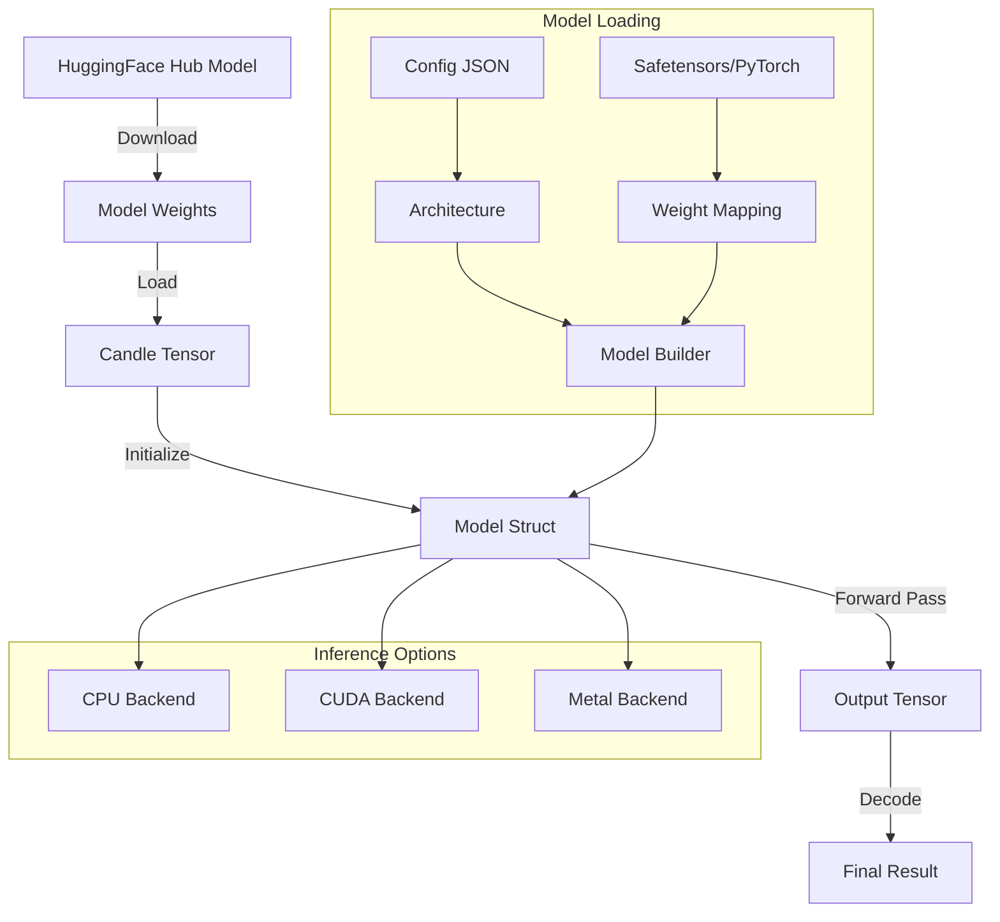
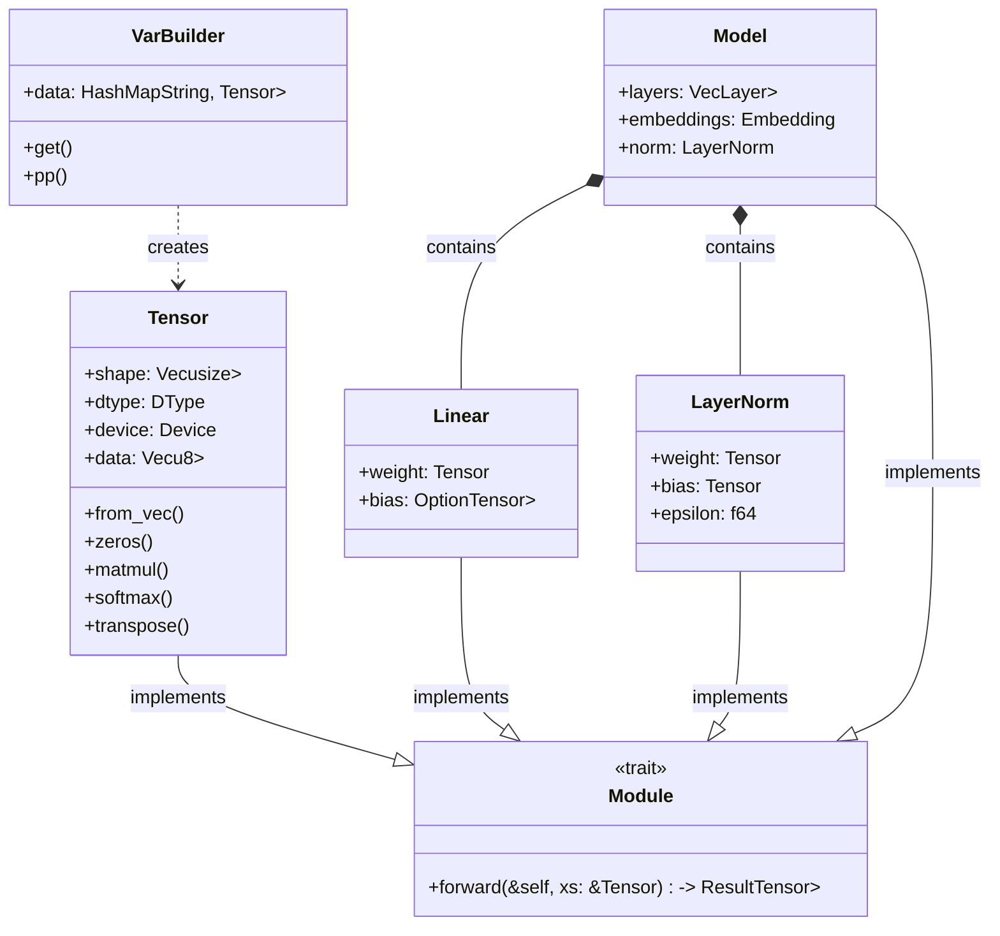

# 🕯️ Candle — HuggingFace ML in Rust

## Introduction

Candle is HuggingFace's minimalist machine learning framework written in Rust, designed to run models natively without Python dependencies. This approach brings the performance and safety guarantees of Rust to ML inference, making it ideal for production deployment where Python overhead is unacceptable. Candle focuses on being lightweight and easy to understand, avoiding the complexity of larger frameworks while supporting modern architectures.

The framework's philosophy centers around simplicity and performance: no automatic differentiation (training is done in PyTorch/Transformers), minimal dependencies, and first-class support for HuggingFace model formats. This aligns with the broader trend of [[01 - PyO3 - Binding Python to Rust|PyO3 bindings]] for performance-critical code, but takes it further by eliminating the Python runtime entirely for inference.

Candle supports major model architectures including Llama, Stable Diffusion, Whisper, and BERT, with backends for CPU, CUDA, and Apple's Metal. This makes it a compelling alternative to [[03 - ONNX Runtime Rust|ONNX Runtime]] for scenarios where you want to stay within the Rust ecosystem. Companies like HuggingFace use Candle to deploy models in environments where Python is unavailable or too heavyweight.

**Candle vs ONNX Runtime**: A critical architectural difference determines which runtime to use. Candle is **pure Rust** — every tensor operation, GPU kernel, and model architecture is implemented in Rust with zero C/C++ dependencies. This means Candle compiles trivially to WebAssembly via `wasm-pack`, enabling ML inference directly in the browser, on edge devices, and in serverless environments without any C++ toolchain. ONNX Runtime, by contrast, wraps a C++ library with heavy native dependencies (CUDA, cuDNN, TensorRT, pthreads) that cannot compile to WASM. However, ONNX Runtime's TensorRT backend delivers 1.5-3x faster GPU inference than Candle's CUDA kernels due to years of kernel autotuning. The choice is determined by your deployment target: browser/WASM requires Candle; peak GPU throughput favors ONNX Runtime; everything else is a trade-off between binary size, cold start, and dependency complexity. For a comprehensive comparison, see [[04 - ONNX vs Candle: Choosing the Right Runtime|ONNX vs Candle]].

## 1. Candle Architecture and Design

Candle's architecture is built around several key abstractions:

- **Tensor**: The core data structure, similar to PyTorch tensors but immutable by default. Supports broadcasting, slicing, and operations like matmul, softmax, and layer norm.

- **Module Trait**: Models implement the `Module` trait with a single `forward` method. This is simpler than PyTorch's `nn.Module` but sufficient for inference.

- **Backend System**: Three backends:
  - CPU (default): Uses SIMD and multithreading
  - CUDA: Requires the `cuda` feature and NVIDIA drivers
  - Metal: For Apple Silicon GPUs

- **Model Hub**: Direct loading from HuggingFace Hub with automatic caching.

**Real case: HuggingFace deployment** uses Candle to serve models in their Inference API for customers who need to run models without Python. This includes edge deployments and serverless environments where cold start time matters.

⚠️ **Warning:** Candle does not support training (backpropagation). Use PyTorch for training, then convert to Candle for inference. Trying to implement custom training loops will be difficult and error-prone.

💡 **Tip:** Use `candle::WithDType::to_dtype` to convert between f32/f16/bf16 at runtime. This allows you to load models in lower precision for speed while keeping f32 for critical operations.

## 2. Model Loading and Inference Flow

The typical workflow for using Candle follows this pattern:



**Comparing Candle with other Rust ML frameworks:**

| Feature | Candle | burn | tch-rs | tract |
|---------|--------|------|--------|-------|
| **Training Support** | No | Yes | Yes | No |
| **Model Formats** | Safetensors, PyTorch | Custom | PyTorch | ONNX |
| **Hardware** | CPU, CUDA, Metal | CPU, CUDA, WGPU | CPU, CUDA | CPU, WASM |
| **Dependencies** | Minimal | Moderate | LibTorch | Minimal |
| **Model Zoo** | HuggingFace Hub | Custom | PyTorch Hub | ONNX Zoo |
| **API Simplicity** | High | Medium | Low | Medium |
| **Performance** | Excellent | Good | Excellent | Good |
| **Ecosystem Maturity** | New (2023) | Growing | Established | Established |

Formula for inference time estimation:
```
Inference_Time = f(Model_Size, Batch_Size, Hardware)
Where:
- Model_Size: Parameters × precision (bytes)
- Batch_Size: Concurrent samples processed
- Hardware: TFLOPS of target device
Typical: T = α × (N × P × B) / HW_perF
```

**Memory usage calculation:**
```
Memory_Required = Model_Weights + Activations + KV_Cache
Where:
- Model_Weights = Parameters × Bytes_per_Parameter
- Activations ≈ Model_Weights × 0.1 (varies by architecture)
- KV_Cache = Batch × Seq_Length × Hidden_Dim × Layers × 2
```

## 3. Architecture Diagrams and Visualizations

### Candle Model Structure

The following diagram shows how Candle organizes model components:



### Inference Pipeline Visualization


**Hardware utilization comparison** (conceptual):


## 4. Implementation Examples

### Basic Llama Inference

```rust
use candle_core::{DType, Device, Tensor};
use candle_transformers::models::llama::{Config, Llama};
use hf_hub::{api::sync::Api, Repo, RepoType};
use tokenizers::Tokenizer;

fn main() -> Result<(), Box<dyn std::error::Error>> {
    // 1. Setup device (CPU, CUDA, or Metal)
    let device = Device::Cpu; // or Device::Cuda(0) for GPU
    
    // 2. Download model from HuggingFace Hub
    let api = Api::new()?;
    let repo = api.repo(Repo::new(
        "meta-llama/Llama-2-7b-hf".to_string(),
        RepoType::Model,
    ));
    
    let tokenizer_path = repo.get("tokenizer.json")?;
    let tokenizer = Tokenizer::from_file(tokenizer_path)?;
    
    // 3. Load model weights
    let config = Config::config_7b();
    let varbuilder = VarBuilder::from_gguf(
        &repo.get("model.gguf")?,
        &device,
    )?;
    
    let model = Llama::load(varbuilder, &config)?;
    
    // 4. Tokenize input
    let prompt = "The capital of France is";
    let tokens = tokenizer.encode(prompt, true)?;
    let input = Tensor::new(tokens.get_ids(), &device)?
        .unsqueeze(0)?;
    
    // 5. Generate tokens
    let mut output_tokens = tokens.get_ids().to_vec();
    let mut logits = model.forward(&input, output_tokens.len())?;
    
    for _ in 0..100 {
        // Sample from logits
        let next_token = logits
            .squeeze(0)?
            .argmax(0)?
            .to_scalar::<u32>()?;
        
        output_tokens.push(next_token);
        
        // Check for end of sequence
        if next_token == tokenizer.token_to_id("<|end_of_text|>")? {
            break;
        }
        
        // Prepare next input
        let next_input = Tensor::new(&[next_token], &device)?
            .unsqueeze(0)?;
        logits = model.forward(&next_input, output_tokens.len())?;
    }
    
    // 6. Decode output
    let output = tokenizer.decode(&output_tokens, true)?;
    println!("Output: {}", output);
    
    Ok(())
}
```

### Stable Diffusion Image Generation

```rust
use candle_core::{DType, Device, Tensor};
use candle_transformers::models::stable_diffusion;
use std::path::Path;

struct SDPipeline {
    model: stable_diffusion::StableDiffusionPipeline,
    device: Device,
}

impl SDPipeline {
    fn new(model_path: &Path, device: Device) -> Result<Self> {
        let config = stable_diffusion::StableDiffusionConfig::v2_1(None, None, None);
        let weights = unsafe { candle_core::safetensors::mmap_file(model_path)? };
        
        let model = stable_diffusion::StableDiffusionPipeline::new(
            &config,
            weights,
            device.clone(),
        )?;
        
        Ok(Self { model, device })
    }
    
    fn generate(
        &self,
        prompt: &str,
        negative_prompt: Option<&str>,
        steps: usize,
        width: usize,
        height: usize,
        seed: u64,
    ) -> Result<Tensor> {
        // Encode text prompts
        let text_embeddings = self.model.encode_text(prompt, negative_prompt)?;
        
        // Generate latent noise
        let latents = Tensor::randn(
            0f32,
            1f32,
            (1, 4, height / 8, width / 8),
            &self.device,
        )?;
        
        // Denoise loop
        let scheduler = self.model.scheduler(steps);
        let latents = scheduler.run(&latents, &text_embeddings, |latents| {
            self.model.unet.forward(latents, 0.0)
        })?;
        
        // Decode VAE
        let image = self.model.vae.decode(&latents)?;
        
        // Convert to image format
        let image = ((image + 1.0)? * 127.5)?.to_dtype(DType::U8)?;
        
        Ok(image)
    }
}

fn main() -> Result<()> {
    let device = Device::Cpu; // or Device::Cuda(0)
    let pipeline = SDPipeline::new(
        Path::new("models/sd2.1.safetensors"),
        device,
    )?;
    
    let image = pipeline.generate(
        "A photograph of an astronaut riding a horse on Mars",
        Some("blurry, bad art, ugly"),
        30,
        512,
        512,
        42,
    )?;
    
    // Save image (pseudo-code)
    // save_image(&image, "output.png")?;
    
    Ok(())
}
```

### Whisper Speech Recognition

```rust
use candle_core::{Device, Tensor};
use candle_transformers::models::whisper::{self, Config, Model};
use cpal::traits::{DeviceTrait, HostTrait, StreamTrait};
use hf_hub::api::sync::Api;

struct WhisperProcessor {
    model: Model,
    tokenizer: tokenizers::Tokenizer,
    device: Device,
    mel_filters: Vec<f32>,
}

impl WhisperProcessor {
    fn new(model_id: &str) -> Result<Self> {
        let device = Device::Cpu;
        let api = Api::new()?;
        let repo = api.model(model_id.to_string());
        
        // Load model
        let config: Config = {
            let config_str = std::fs::read_to_string(repo.get("config.json")?)?;
            serde_json::from_str(&config_str)?
        };
        
        let weights = unsafe {
            candle_core::safetensors::mmap_file(repo.get("model.safetensors")?)?
        };
        
        let model = Model::new(&config, weights, &device)?;
        
        // Load tokenizer
        let tokenizer = tokenizers::Tokenizer::from_file(repo.get("tokenizer.json")?)?;
        
        // Load mel filters
        let mel_filters = Self::load_mel_filters()?;
        
        Ok(Self {
            model,
            tokenizer,
            device,
            mel_filters,
        })
    }
    
    fn load_mel_filters() -> Result<Vec<f32>> {
        // Load from file or generate
        let n_mels = 80;
        let n_fft = 400;
        let filters = vec![0.0; n_mels * (n_fft / 2 + 1)];
        Ok(filters)
    }
    
    fn transcribe(&self, audio: &[f32]) -> Result<String> {
        // Convert audio to mel spectrogram
        let mel = self.audio_to_mel(audio)?;
        
        // Encode
        let encoder_output = self.model.encoder(&mel)?;
        
        // Decode with timestamps
        let tokens = self.model.decode(&encoder_output, &self.tokenizer)?;
        
        let text = self.tokenizer.decode(&tokens, true)?;
        Ok(text)
    }
    
    fn audio_to_mel(&self, audio: &[f32]) -> Result<Tensor> {
        // STFT and mel filterbank application
        let mel = Tensor::new(audio, &self.device)?;
        // ... processing steps
        Ok(mel)
    }
}

fn main() -> Result<()> {
    let processor = WhisperProcessor::new("openai/whisper-large-v3")?;
    
    // Load audio file (pseudo-code)
    let audio = load_audio_file("speech.wav")?;
    
    let text = processor.transcribe(&audio)?;
    println!("Transcription: {}", text);
    
    Ok(())
}
```

---

## 📦 Compression Code

Complete Rust script for a production-ready Candle inference server:

```rust
// src/main.rs
use axum::{
    extract::{Json, State},
    http::StatusCode,
    response::IntoResponse,
    routing::post,
    Router,
};
use candle_core::{DType, Device, Tensor};
use candle_transformers::models::llama::{Config, Llama};
use hf_hub::{api::sync::Api, Repo, RepoType};
use serde::{Deserialize, Serialize};
use std::collections::HashMap;
use std::sync::Arc;
use tokenizers::Tokenizer;
use tokio::sync::Mutex;

#[derive(Clone)]
struct AppState {
    model: Arc<Llama>,
    tokenizer: Arc<Tokenizer>,
    device: Device,
    cache: Arc<Mutex<HashMap<String, String>>>,
}

#[derive(Deserialize)]
struct GenerateRequest {
    prompt: String,
    max_length: Option<usize>,
    temperature: Option<f32>,
}

#[derive(Serialize)]
struct GenerateResponse {
    text: String,
    tokens_generated: usize,
    latency_ms: u64,
}

async fn generate_handler(
    State(state): State<AppState>,
    Json(request): Json<GenerateRequest>,
) -> impl IntoResponse {
    let start = std::time::Instant::now();
    
    // Check cache first
    let cache_key = format!("{}_{:?}_{:?}", 
        request.prompt, request.max_length, request.temperature);
    
    {
        let cache = state.cache.lock().await;
        if let Some(cached) = cache.get(&cache_key) {
            return Ok(Json(GenerateResponse {
                text: cached.clone(),
                tokens_generated: 0,
                latency_ms: start.elapsed().as_millis() as u64,
            }));
        }
    }
    
    // Tokenize
    let tokens = state.tokenizer
        .encode(&request.prompt, true)
        .map_err(|e| (StatusCode::BAD_REQUEST, e.to_string()))?;
    
    let mut input_ids = tokens.get_ids().to_vec();
    let max_length = request.max_length.unwrap_or(256);
    let temperature = request.temperature.unwrap_or(0.7);
    
    let mut all_tokens = input_ids.clone();
    
    // Generation loop
    for _ in 0..max_length {
        let input = Tensor::new(&input_ids, &state.device)
            .map_err(|e| (StatusCode::INTERNAL_SERVER_ERROR, e.to_string()))?
            .unsqueeze(0)
            .map_err(|e| (StatusCode::INTERNAL_SERVER_ERROR, e.to_string()))?;
        
        let logits = state.model
            .forward(&input, all_tokens.len())
            .map_err(|e| (StatusCode::INTERNAL_SERVER_ERROR, e.to_string()))?;
        
        let logits = logits
            .squeeze(0)
            .map_err(|e| (StatusCode::INTERNAL_SERVER_ERROR, e.to_string()))?;
        
        // Apply temperature
        let logits = if temperature > 0.0 {
            (logits / temperature)
                .map_err(|e| (StatusCode::INTERNAL_SERVER_ERROR, e.to_string()))?
        } else {
            logits
        };
        
        // Sample
        let next_token = if temperature == 0.0 {
            logits
                .argmax(0)
                .map_err(|e| (StatusCode::INTERNAL_SERVER_ERROR, e.to_string()))?
                .to_scalar::<u32>()
                .map_err(|e| (StatusCode::INTERNAL_SERVER_ERROR, e.to_string()))?
        } else {
            let probs = candle_nn::ops::softmax(&logits, 0)
                .map_err(|e| (StatusCode::INTERNAL_SERVER_ERROR, e.to_string()))?;
            
            // Sample from distribution
            let mut rng = rand::thread_rng();
            let dist = rand::distributions::WeightedIndex::new(
                probs.to_vec1::<f32>()
                    .map_err(|e| (StatusCode::INTERNAL_SERVER_ERROR, e.to_string()))?
            )
            .map_err(|e| (StatusCode::INTERNAL_SERVER_ERROR, e.to_string()))?;
            
            dist.sample(&mut rng) as u32
        };
        
        all_tokens.push(next_token);
        
        // Check for end of sequence
        if next_token == state.tokenizer.token_to_id("<|end_of_text|>")
            .unwrap_or(0) 
        {
            break;
        }
        
        input_ids = vec![next_token];
    }
    
    // Decode
    let text = state.tokenizer
        .decode(&all_tokens, true)
        .map_err(|e| (StatusCode::INTERNAL_SERVER_ERROR, e.to_string()))?;
    
    // Update cache
    {
        let mut cache = state.cache.lock().await;
        if cache.len() > 1000 {
            cache.clear(); // Simple LRU: clear when full
        }
        cache.insert(cache_key, text.clone());
    }
    
    Ok(Json(GenerateResponse {
        text,
        tokens_generated: all_tokens.len() - input_ids.len(),
        latency_ms: start.elapsed().as_millis() as u64,
    }))
}

#[tokio::main]
async fn main() -> Result<(), Box<dyn std::error::Error>> {
    // Load model
    let device = Device::Cpu;
    let api = Api::new()?;
    let repo = api.repo(Repo::new(
        "TheBloke/Llama-2-13B-GPTQ".to_string(),
        RepoType::Model,
    ));
    
    let tokenizer = Tokenizer::from_file(repo.get("tokenizer.json")?)?;
    let config = Config::config_13b();
    let varbuilder = VarBuilder::from_gguf(
        &repo.get("model.gguf")?,
        &device,
    )?;
    
    let model = Llama::load(varbuilder, &config)?;
    
    // Create shared state
    let state = AppState {
        model: Arc::new(model),
        tokenizer: Arc::new(tokenizer),
        device,
        cache: Arc::new(Mutex::new(HashMap::new())),
    };
    
    // Build router
    let app = Router::new()
        .route("/generate", post(generate_handler))
        .with_state(state);
    
    // Start server
    let listener = tokio::net::TcpListener::bind("0.0.0.0:3000").await?;
    println!("Server running on http://localhost:3000");
    
    axum::serve(listener, app).await?;
    
    Ok(())
}
```

**Cargo.toml**:
```toml
[package]
name = "candle-inference-server"
version = "0.1.0"
edition = "2021"

[dependencies]
axum = "0.7"
candle-core = { version = "0.4", features = ["cuda"] }
candle-nn = "0.4"
candle-transformers = "0.4"
hf-hub = "0.3"
serde = { version = "1.0", features = ["derive"] }
serde_json = "1.0"
tokenizers = "0.15"
tokio = { version = "1.0", features = ["full"] }
rand = "0.8"

[profile.release]
opt-level = 3
lto = true
codegen-units = 1
```

