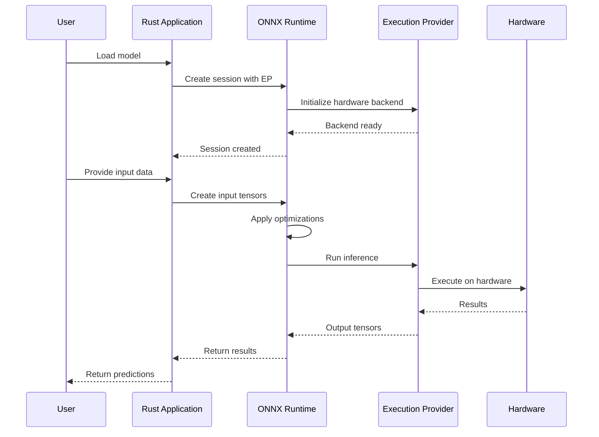
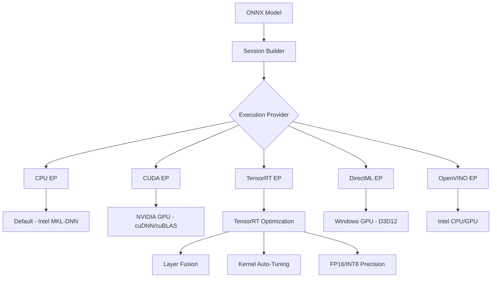

# 🔢 ONNX Runtime Rust

## 🎯 Learning Objectives
- Understand why ONNX exists and how its Intermediate Representation (IR) enables cross-framework model deployment.
- Map the ONNX Runtime architecture: sessions, execution providers, graph optimization, and IO binding.
- Configure and run ONNX models in Rust with CPU, CUDA, and TensorRT execution providers.
- Build multi-model inference pipelines and dynamic batching systems in production Rust.
- Compare ONNX Runtime's C++ backed approach with pure-Rust alternatives like Candle.

## Introduction

ONNX (Open Neural Network Exchange) is an open standard for representing machine learning models, created by Microsoft and Meta in 2017 to solve a fundamental industry problem: training happens in one framework (PyTorch, TensorFlow, JAX), but inference often needs to happen in a completely different runtime. ONNX Runtime Rust provides safe, idiomatic Rust bindings to Microsoft's cross-platform inference accelerator, allowing pre-trained models to run with optimized performance across CPU, CUDA, TensorRT, DirectML, and other hardware backends.

The ONNX format uses Protocol Buffers to serialize a computational graph — a directed acyclic graph (DAG) of operators with typed inputs and outputs. Each operator (Conv, MatMul, Relu, etc.) has a standardized specification defined in the ONNX operator schema, enabling any runtime that implements the spec to execute the graph. This is profoundly different from loading a PyTorch `.pt` file directly: ONNX decouples the model architecture from the framework that trained it, making it a universal interchange format. Unlike [[02 - Candle - HuggingFace ML in Rust|Candle]], which focuses on minimal dependencies and pure Rust, ONNX Runtime prioritizes maximum performance through heavily optimized C++ backends with hardware-specific kernels.

ONNX Runtime Rust bindings provide a safe, idiomatic Rust interface to the C++ runtime, supporting session management, tensor operations, graph optimizations, and execution provider configuration. This is particularly useful when combined with [[01 - PyO3 - Binding Python to Rust|PyO3 bindings]] for mixed Python-Rust applications, or when building [[06 - High-Throughput Inference Servers|high-throughput inference servers]].

## 1. 🧠 Theoretical Foundation — The ONNX Intermediate Representation

### Why ONNX Exists

Before ONNX, deploying a model trained in PyTorch to a production environment running TensorFlow Serving required a complete model rewrite. ONNX solves this by defining:

1. **A Standard Graph Representation (IR)**: The computational graph is serialized as a Protocol Buffer (`.onnx` file), containing:
   ```
   ONNX Model = Graph {
     Node[]: operations with named inputs/outputs,
     Tensor[]: initializers (weights/biases),
     ValueInfo[]: shapes and types for intermediate tensors,
     OperatorSetId: which version of each operator to use
   }
   ```

2. **Standardized Operators**: Each operator (Conv, Gemm, BatchNormalization, etc.) has a defined input/output schema, type constraints, and version. At the time of writing, ONNX defines 180+ standard operators across domains (ai.onnx, ai.onnx.ml).

3. **Type System**: ONNX tensors carry type information (float32, int8, etc.) and shapes (static or dynamic dimensions). The type system supports tensors, sequences, maps, and optional types, enabling complex model topologies.

### The Protobuf Graph Representation

The ONNX graph is a DAG where nodes are operators and edges are tensors:

```
$$G = (V, E)\ \text{where}\ V = \{v_1, ..., v_n\}\ \text{are operators},\ E \subseteq V \times V\ \text{are tensor edges}$$

$$input(v_i) = \{v_j \in V \mid (v_j, v_i) \in E\}$$
$$output(v_i) = \{v_k \in V \mid (v_i, v_k) \in E\}$$
```

### Execution Provider Architecture

ONNX Runtime abstracts hardware through Execution Providers (EPs), each implementing the operator kernel interface:

$$
\text{Inference}(M, I, EP) = EP.\text{execute}(M_{\text{optimized}}, I)
$$
$$\text{where } M_{\text{optimized}} = \text{GraphOptimizer}(M, EP.\text{capabilities})
$$

| Concept | Python Equivalent | Rust Equivalent |
|---------|-------------------|-----------------|
| `onnxruntime.InferenceSession` | Session | `ort::Session` |
| `ExecutionProvider` | CUDA/TensorRT EP | `ort::CUDAExecutionProvider` |
| `np.array` for IO | Numpy arrays | `ort::Tensor` from `&[f32]` |
| `session.run()` | Dict input/output | `session.run(ort::inputs![])` |
| Graph optimization | `GraphOptimizationLevel` | `ort::GraphOptimizationLevel` |

## 2. 📐 Mental Model — PyTorch → ONNX → ORT Pipeline

### ASCII Architecture Diagram

```
┌──────────────────────────────────────────────────────────────────────┐
│                PyTorch → ONNX → ORT + Rust Pipeline                   │
├──────────────────────────────────────────────────────────────────────┤
│                                                                       │
│  ┌───────────┐   torch.onnx.export   ┌─────────────┐                 │
│  │ PyTorch    │ ─────────────────────→│ model.onnx   │                 │
│  │ training   │    (trace or script)  │ (protobuf)   │                 │
│  └───────────┘                        └──────┬──────┘                 │
│                                              │                        │
│                    ┌─────────────────────────┼──────────────┐        │
│                    │      ONNX Runtime (C++ Core)             │        │
│                    │  ┌──────────────────────────────────┐   │        │
│                    │  │   GraphOptimizer                 │   │        │
│                    │  │   • Constant folding             │   │        │
│                    │  │   • Node fusion (Conv+BN+Relu)   │   │        │
│                    │  │   • Dead code elimination        │   │        │
│                    │  │   • Layout optimization          │   │        │
│                    │  └──────────────┬───────────────────┘   │        │
│                    │                 │                        │        │
│                    │    ┌────────────▼───────────────────┐   │        │
│                    │    │     Execution Providers         │   │        │
│                    │    │  ┌──────────┐  ┌────────────┐  │   │        │
│                    │    │  │ CPU (MKL)│  │ CUDA EP    │  │   │        │
│                    │    │  └──────────┘  └────────────┘  │   │        │
│                    │    │  ┌──────────┐  ┌────────────┐  │   │        │
│                    │    │  │TensorRT  │  │ DirectML   │  │   │        │
│                    │    │  └──────────┘  └────────────┘  │   │        │
│                    │    └──────────────┬───────────────────┘   │        │
│                    └───────────────────┼───────────────────────┘       │
│                                        │                               │
│                    ┌───────────────────▼───────────────────────┐       │
│                    │    ort crate (Rust FFI → C API)            │       │
│                    │    • ort::Session                          │       │
│                    │    • ort::Tensor → Rust &[f32]             │       │
│                    │    • ort::inputs![] macro                  │       │
│                    │    • Safe wrapper around raw pointers      │       │
│                    └───────────────────┬───────────────────────┘       │
│                                        │                               │
│                              ┌─────────▼──────────┐                   │
│                              │   Your Rust App     │                   │
│                              │   (Axum/Actix)      │                   │
│                              └────────────────────┘                   │
│                                                                       │
└──────────────────────────────────────────────────────────────────────┘
```

### Inference Sequence Diagram



### Execution Provider Routing



## 3. 💻 Core Implementation — Code & Practice

### Execution Provider Comparison

| EP | Hardware | Precision Support | Optimization Level | Best For |
|----|----------|-------------------|-------------------|----------|
| **CPU** | Any CPU | FP32, FP16, INT8 | High | General deployment |
| **CUDA** | NVIDIA GPU | FP32, FP16, TF32 | Medium | Training & inference |
| **TensorRT** | NVIDIA GPU | FP32, FP16, INT8, INT4 | Very High | Low-latency inference |
| **DirectML** | Windows GPU | FP32, FP16 | Medium | Windows desktop apps |
| **OpenVINO** | Intel CPU/GPU | FP32, FP16, INT8 | High | Intel hardware |
| **CoreML** | Apple Silicon | FP32, FP16 | High | macOS/iOS apps |
| **ROCm** | AMD GPU | FP32, FP16 | Medium | AMD hardware |

**Performance formula for speedup:**
```
ORT_Speedup = T_native_python / T_ort_rust
Where:
- T_native_python: Time using Python ONNX Runtime
- T_ort_rust: Time using Rust ONNX Runtime
Typical speedup: 1.2-2x over Python due to:
1. No Python interpreter overhead
2. Better memory management
3. Zero-copy tensor operations
```

**Memory optimization:**
```
Memory_Ratio = Memory_ORT / Memory_Original
Typical: 0.5-0.8x (50-20% reduction)
Memory_Saved = Model_Weights × (1 - Memory_Ratio)
```

### Basic Session Setup and Inference

```rust
use ort::{GraphOptimizationLevel, Session, Tensor};
use std::path::Path;

fn main() -> Result<(), Box<dyn std::error::Error>> {
    // Initialize ONNX Runtime
    ort::init()
        .with_name("rust_inference")
        .commit()?;

    // Load model with optimizations
    let session = Session::builder()?
        .with_optimization_level(GraphOptimizationLevel::Level3)?
        .with_intra_threads(4)?
        .commit_from_file(Path::new("model.onnx"))?;

    println!("Model loaded: {}", session.metadata()?.name());

    // Create input tensor
    let input_data = vec![1.0f32, 2.0, 3.0, 4.0];
    let input_tensor = Tensor::from_array(([1, 4], input_data))?;

    // Run inference
    let outputs = session.run(ort::inputs![
        "input" => input_tensor
    ])?;

    // Extract results
    let output = outputs[0].try_extract_tensor::<f32>()?;
    let (shape, data) = output;

    println!("Output shape: {:?}", shape);
    println!("Output data: {:?}", data);

    Ok(())
}
```

### Multi-Model Pipeline with GPU

```rust
use ort::{CUDAExecutionProvider, GraphOptimizationLevel, Session, Tensor};
use std::sync::Arc;

struct ModelPipeline {
    preprocessor: Session,
    model: Session,
    postprocessor: Session,
}

impl ModelPipeline {
    fn new() -> Result<Self> {
        // Initialize with CUDA
        ort::init()
            .with_execution_providers([
                CUDAExecutionProvider::default()
                    .with_device_id(0)
                    .build(),
            ])
            .commit()?;

        let session_options = || -> Result<_> {
            Session::builder()?
                .with_optimization_level(GraphOptimizationLevel::Level3)?
                .with_intra_threads(8)?
                .with_inter_op_threads(4)
        };

        let preprocessor = session_options()?
            .commit_from_file("preprocessor.onnx")?;

        let model = session_options()?
            .commit_from_file("model.onnx")?;

        let postprocessor = session_options()?
            .commit_from_file("postprocessor.onnx")?;

        Ok(Self {
            preprocessor,
            model,
            postprocessor,
        })
    }

    fn predict(&self, raw_input: &[f32]) -> Result<Vec<f32>> {
        // Step 1: Preprocess
        let preprocessed = self.preprocessor.run(ort::inputs![
            "raw_input" => Tensor::from_array(([1, raw_input.len()], raw_input.to_vec()))?
        ])?;

        // Step 2: Main model
        let model_output = self.model.run(ort::inputs![
            "input" => preprocessed[0].try_extract_tensor::<f32>()?
        ])?;

        // Step 3: Postprocess
        let final_output = self.postprocessor.run(ort::inputs![
            "model_output" => model_output[0].try_extract_tensor::<f32>()?
        ])?;

        let output_tensor = final_output[0].try_extract_tensor::<f32>()?;
        let (_, data) = output_tensor;

        Ok(data.to_vec())
    }
}
```

### Dynamic Batching with IO Binding

```rust
use ort::{GraphOptimizationLevel, Session, Tensor};
use std::time::Instant;

struct BatchInference {
    session: Session,
    batch_size: usize,
    input_names: Vec<String>,
    output_names: Vec<String>,
}

impl BatchInference {
    fn new(model_path: &str, batch_size: usize) -> Result<Self> {
        let session = Session::builder()?
            .with_optimization_level(GraphOptimizationLevel::Level3)?
            .with_intra_threads(num_cpus::get())?
            .commit_from_file(model_path)?;

        let input_names: Vec<String> = session.inputs
            .iter()
            .map(|i| i.name.to_string())
            .collect();

        let output_names: Vec<String> = session.outputs
            .iter()
            .map(|o| o.name.to_string())
            .collect();

        Ok(Self {
            session,
            batch_size,
            input_names,
            output_names,
        })
    }

    fn infer_batch(&self, inputs: &[Vec<f32>]) -> Result<Vec<Vec<f32>>> {
        if inputs.len() > self.batch_size {
            return Err("Batch size exceeded".into());
        }

        let start = Instant::now();

        // Create batched input tensor
        let batch_data: Vec<f32> = inputs
            .iter()
            .flat_map(|v| v.iter().cloned())
            .collect();

        let input_shape = [inputs.len(), inputs[0].len()];
        let input_tensor = Tensor::from_array((input_shape, batch_data))?;

        // Run inference
        let outputs = self.session.run(ort::inputs![
            &self.input_names[0] => input_tensor
        ])?;

        // Extract results
        let output_tensor = outputs[0].try_extract_tensor::<f32>()?;
        let (shape, data) = output_tensor;

        let batch_size = shape[0];
        let output_size = shape[1];

        let results: Vec<Vec<f32>> = (0..batch_size)
            .map(|i| {
                let start = i * output_size;
                let end = start + output_size;
                data[start..end].to_vec()
            })
            .collect();

        let elapsed = start.elapsed();
        println!("Batch inference: {} samples in {:?}",
            inputs.len(), elapsed);

        Ok(results)
    }
}
```

### Model Optimization and Quantization

```rust
use ort::{GraphOptimizationLevel, Session, SessionBuilder};
use std::path::Path;

fn optimize_model(
    input_path: &Path,
    output_path: &Path,
    optimization_level: GraphOptimizationLevel,
) -> Result<()> {
    let session = Session::builder()?
        .with_optimization_level(optimization_level)?
        .with_intra_threads(4)?
        .commit_from_file(input_path)?;

    session.save_optimized_model(output_path)?;

    println!("Model optimized and saved to: {:?}", output_path);
    Ok(())
}

fn quantize_model(
    input_path: &Path,
    output_path: &Path,
) -> Result<()> {
    let session = Session::builder()?
        .with_optimization_level(GraphOptimizationLevel::Level3)?
        .with_dynamic_quantization(true)?
        .commit_from_file(input_path)?;

    session.save_optimized_model(output_path)?;

    println!("Model quantized to INT8: {:?}", output_path);
    Ok(())
}
```

## 4. 🌍 Real-World Applications

| Company | Use Case | Detail |
|---------|----------|--------|
| **Microsoft Azure** | Azure ML, Cognitive Services, OpenAI Service | Serves models trained in any framework through ONNX Runtime |
| **NVIDIA Triton** | Multi-framework inference server | ONNX Runtime is a first-class backend alongside PyTorch/TensorFlow |
| **HuggingFace Optimum** | Model optimization and quantization pipeline | Uses ONNX Runtime for graph-level optimizations on HuggingFace models |
| **Intel OpenVINO** | Edge AI on Intel hardware | ONNX Runtime with OpenVINO EP for CPU/GPU/Iris acceleration |
| **Apple Core ML Tools** | Model conversion to Core ML | Uses ONNX as an intermediate format for PyTorch → CoreML conversion |
| **Unity Barracuda** | Game engine ML inference | ONNX models run inside Unity games for real-time AI gameplay |
| **Tesla Autopilot** | Vision model inference | ONNX-based models on custom silicon for real-time object detection |

## ⚠️ Pitfalls

- **Not all operators convert cleanly**: PyTorch/TensorFlow have ops without direct ONNX equivalents. Always validate with `onnx.checker.check_model()` and compare outputs numerically.
- **Dynamic axes must be declared**: Models with variable batch sizes need explicit dynamic axis declarations during `torch.onnx.export()`, otherwise the graph bakes in a fixed batch size.
- **TensorRT has limited op support**: Not all ONNX ops are supported by TensorRT (e.g., certain RNN variants, custom ops). The fallback to CUDA EP can cause unexpected latency spikes.
- **Session creation is expensive**: Creating a session parses the protobuf, applies graph optimizations, and initializes hardware. Cache and reuse sessions — never create per-request.
- **Memory layout differences**: PyTorch uses NCHW, TensorFlow uses NHWC, ONNX default is NCHW. Incorrect layout assumptions cause silent accuracy bugs.

## 💡 Tips

- Use `SessionBuilder::with_optimization_level()` to set optimization levels. Level 3 enables most graph optimizations. Level 99 (All) enables everything but increases session creation time. For production, pre-optimize and save the optimized model.
- Prefer `ort::inputs!["name" => tensor]` macro for ergonomic input binding instead of manual HashMap construction.
- Use `with_intra_threads()` for operator-level parallelism (within a single ops) and `with_inter_op_threads()` for graph-level parallelism (across independent subgraphs).
- Enable TensorRT FP16 mode (`with_trt_fp16(true)`) even for FP32 models — TensorRT can auto-cast with minimal accuracy loss and 1.5-2x speedup.
- For multi-GPU setups, create separate sessions per device and route requests via a consistent hashing strategy on request IDs.

## 📦 Compression Code

Complete Rust script for a production-ready ONNX Runtime inference system:

```rust
// src/main.rs
use ort::{
    CUDAExecutionProvider, GraphOptimizationLevel,
    Session, SessionBuilder, Tensor,
};
use serde::{Deserialize, Serialize};
use std::collections::HashMap;
use std::path::{Path, PathBuf};
use std::sync::Arc;
use std::time::{Duration, Instant};
use tokio::sync::{RwLock, Semaphore};

#[derive(Clone, Debug, Serialize, Deserialize)]
struct ModelConfig {
    name: String,
    path: PathBuf,
    optimization_level: u32,
    use_gpu: bool,
    device_id: i32,
    batch_size: usize,
    input_names: Vec<String>,
    output_names: Vec<String>,
}

#[derive(Clone)]
struct ModelManager {
    configs: HashMap<String, ModelConfig>,
    sessions: Arc<RwLock<HashMap<String, Session>>>,
    semaphore: Arc<Semaphore>,
}

impl ModelManager {
    fn new(max_concurrent_sessions: usize) -> Result<Self> {
        ort::init()
            .with_name("rust_onnx_server")
            .with_execution_providers([
                CUDAExecutionProvider::default()
                    .with_device_id(0)
                    .build(),
            ])
            .commit()?;

        Ok(Self {
            configs: HashMap::new(),
            sessions: Arc::new(RwLock::new(HashMap::new())),
            semaphore: Arc::new(Semaphore::new(max_concurrent_sessions)),
        })
    }

    fn register_model(&mut self, config: ModelConfig) -> Result<()> {
        self.configs.insert(config.name.clone(), config);
        Ok(())
    }

    async fn get_session(&self, model_name: &str) -> Result<Arc<Session>> {
        {
            let sessions = self.sessions.read().await;
            if let Some(session) = sessions.get(model_name) {
                return Ok(Arc::new(session.clone()));
            }
        }

        let config = self.configs.get(model_name)
            .ok_or_else(|| format!("Model {} not found", model_name))?;

        let session = self.create_session(config)?;

        {
            let mut sessions = self.sessions.write().await;
            sessions.insert(model_name.to_string(), session.clone());
        }

        Ok(Arc::new(session))
    }

    fn create_session(&self, config: &ModelConfig) -> Result<Session> {
        let optimization_level = match config.optimization_level {
            0 => GraphOptimizationLevel::DisableAll,
            1 => GraphOptimizationLevel::Level1,
            2 => GraphOptimizationLevel::Level2,
            3 => GraphOptimizationLevel::Level3,
            99 => GraphOptimizationLevel::All,
            _ => GraphOptimizationLevel::Level3,
        };

        let mut builder = Session::builder()?
            .with_optimization_level(optimization_level)?
            .with_intra_threads(num_cpus::get())?;

        if config.use_gpu {
            builder = builder.with_execution_providers([
                CUDAExecutionProvider::default()
                    .with_device_id(config.device_id)
                    .build(),
            ])?;
        }

        let session = builder.commit_from_file(&config.path)?;
        Ok(session)
    }

    async fn infer(
        &self,
        model_name: &str,
        inputs: HashMap<String, Vec<f32>>,
        input_shape: &[usize],
    ) -> Result<HashMap<String, Vec<f32>>> {
        let _permit = self.semaphore.acquire().await?;

        let session = self.get_session(model_name).await?;
        let config = self.configs.get(model_name)
            .ok_or_else(|| format!("Model {} not found", model_name))?;

        let mut ort_inputs = HashMap::new();

        for (name, data) in inputs {
            let tensor = Tensor::from_array((input_shape.to_vec(), data))?;
            ort_inputs.insert(name, tensor);
        }

        let start = Instant::now();
        let outputs = session.run(ort_inputs)?;
        let inference_time = start.elapsed();

        let mut results = HashMap::new();

        for (i, output_name) in config.output_names.iter().enumerate() {
            let output = outputs[i].try_extract_tensor::<f32>()?;
            let (_, data) = output;
            results.insert(output_name.clone(), data.to_vec());
        }

        println!(
            "Model {} inference: {:?} (batch_size={})",
            model_name, inference_time, input_shape[0]
        );

        Ok(results)
    }
}

#[derive(Deserialize)]
struct InferRequest {
    model: String,
    inputs: HashMap<String, Vec<f32>>,
    input_shape: Vec<usize>,
}

#[derive(Serialize)]
struct InferResponse {
    outputs: HashMap<String, Vec<f32>>,
    inference_time_ms: u64,
    model: String,
}

async fn infer_handler(
    manager: axum::extract::State<Arc<ModelManager>>,
    Json(request): Json<InferRequest>,
) -> impl axum::response::IntoResponse {
    let start = Instant::now();

    match manager.infer(&request.model, request.inputs, &request.input_shape).await {
        Ok(outputs) => {
            let response = InferResponse {
                outputs,
                inference_time_ms: start.elapsed().as_millis() as u64,
                model: request.model,
            };
            Ok(axum::Json(response))
        }
        Err(e) => Err((axum::http::StatusCode::INTERNAL_SERVER_ERROR, e.to_string())),
    }
}

#[tokio::main]
async fn main() -> Result<(), Box<dyn std::error::Error>> {
    let mut manager = ModelManager::new(10)?;

    manager.register_model(ModelConfig {
        name: "resnet50".to_string(),
        path: PathBuf::from("models/resnet50.onnx"),
        optimization_level: 3,
        use_gpu: true,
        device_id: 0,
        batch_size: 32,
        input_names: vec!["input".to_string()],
        output_names: vec!["output".to_string()],
    })?;

    manager.register_model(ModelConfig {
        name: "bert".to_string(),
        path: PathBuf::from("models/bert.onnx"),
        optimization_level: 3,
        use_gpu: true,
        device_id: 0,
        batch_size: 8,
        input_names: vec!["input_ids".to_string(), "attention_mask".to_string()],
        output_names: vec!["logits".to_string()],
    })?;

    let state = Arc::new(manager);

    let app = axum::Router::new()
        .route("/infer", axum::routing::post(infer_handler))
        .route("/health", axum::routing::get(|| async { "OK" }))
        .with_state(state);

    let listener = tokio::net::TcpListener::bind("0.0.0.0:8080").await?;
    println!("ONNX Runtime server running on http://localhost:8080");

    axum::serve(listener, app).await?;

    Ok(())
}
```

**Cargo.toml**:
```toml
[package]
name = "ort-inference-server"
version = "0.1.0"
edition = "2021"

[dependencies]
ort = { version = "2.0", features = ["cuda", "load-dynamic"] }
axum = "0.7"
serde = { version = "1.0", features = ["derive"] }
serde_json = "1.0"
tokio = { version = "1.0", features = ["full"] }
num_cpus = "1.16"

[profile.release]
opt-level = 3
lto = true
codegen-units = 1
```


## 🎯 Key Takeaways

- ONNX is a protobuf-based intermediate representation that decouples model architecture from training frameworks, enabling universal deployment.
- ONNX Runtime accelerates inference through graph optimizations (constant folding, fusion) and Execution Providers (CPU, CUDA, TensorRT, DirectML, OpenVINO, CoreML).
- The `ort` Rust crate provides safe FFI bindings to the C++ ONNX Runtime, with idiomatic session management and tensor operations.
- Caching and reusing sessions is critical — session creation is expensive; never create per-request.
- TensorRT EP provides the fastest GPU inference (2-5x over CUDA EP) but has limited operator support; CUDA EP is the universal fallback.
- Dynamic batching and IO binding improve throughput by amortizing kernel launch overhead and enabling zero-copy memory access.
- ONNX Runtime Rust is the go-to choice for production GPU inference, while pure-Rust alternatives like Candle excel in WASM/browser and zero-dependency environments (see [[04 - ONNX vs Candle: Choosing the Right Runtime|ONNX vs Candle]]).

## References
- [ONNX Runtime Documentation](https://onnxruntime.ai)
- [ort Rust Crate](https://github.com/pykeio/ort)
- [ONNX Model Zoo](https://github.com/onnx/models)
- [TensorRT Integration Guide](https://docs.nvidia.com/deeplearning/tensorrt/)
- [Azure ML with ONNX Runtime](https://learn.microsoft.com/azure/machine-learning)
- [ONNX Specification](https://github.com/onnx/onnx/blob/main/docs/IR.md)
