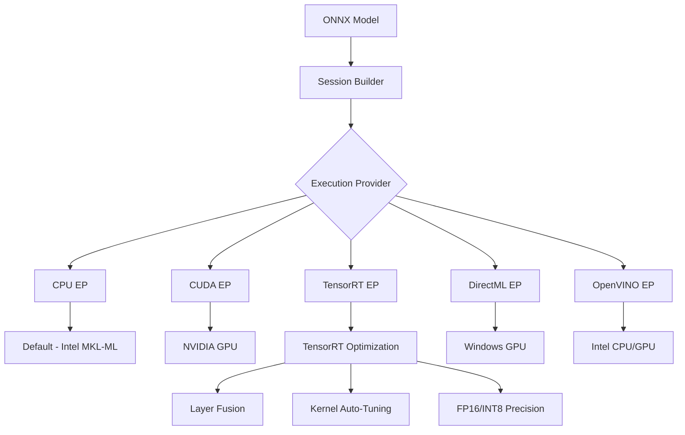
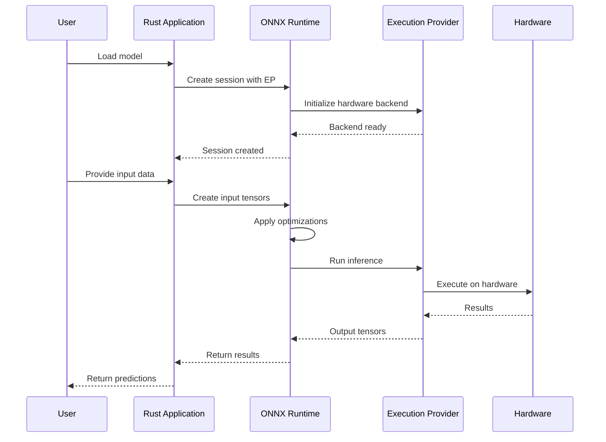

# 🔢 ONNX Runtime Rust

## Introduction

ONNX Runtime Rust provides Rust bindings for Microsoft's cross-platform inference accelerator. This allows running pre-trained models from various frameworks (PyTorch, TensorFlow, scikit-learn) with optimized performance across different hardware. The ONNX format itself is an open standard for representing machine learning models, enabling interoperability between training frameworks and inference engines.

The runtime offers several execution providers (EPs) for hardware acceleration, including CPU, CUDA, TensorRT, and DirectML. This makes it ideal for deployment scenarios where you need consistent performance across different platforms, from cloud servers to edge devices. Unlike [[02 - Candle - HuggingFace ML in Rust|Candle]], which focuses on minimal dependencies, ONNX Runtime prioritizes maximum performance and broad compatibility.

ONNX Runtime Rust bindings provide a safe, idiomatic Rust interface to the C++ runtime, supporting features like session management, tensor operations, and graph optimizations. This is particularly useful when combined with [[01 - PyO3 - Binding Python to Rust|PyO3 bindings]] for mixed Python-Rust applications, or when building [[04 - High-Throughput Inference Servers|high-throughput inference servers]].

## 1. ONNX Format and Runtime Architecture

ONNX (Open Neural Network Exchange) consists of several key components:

- **Model Format**: Protocol Buffer-based format describing computational graphs
- **Operator Set**: Standardized operations (Conv, MatMul, Relu, etc.)
- **Type System**: Tensor types, sequences, maps, optional types
- **Graph Optimization**: Constant folding, dead code elimination, layer fusion

ONNX Runtime architecture follows this pattern:

- **Session**: Manages model loading and execution
- **Execution Providers**: Hardware-specific backends
- **Memory Pattern**: Optimizes memory allocation patterns
- **IO Binding**: Direct memory access for inputs/outputs

**Real case: Microsoft Azure** uses ONNX Runtime across their AI services, including Azure Machine Learning, Azure Cognitive Services, and Azure OpenAI Service. This allows them to deploy models trained in any framework with consistent performance.

⚠️ **Warning:** Not all PyTorch/TensorFlow operations have direct ONNX equivalents. Always validate your model conversion with `onnx.checker.check_model()` and test inference outputs match the original framework.

💡 **Tip:** Use `SessionBuilder::with_optimization_level()` to set different optimization levels. Level 99 enables all optimizations but increases build time. For production, pre-optimize and save the optimized model.

## 2. Execution Providers and Performance

ONNX Runtime supports multiple execution providers for different hardware:



**Execution Provider Comparison:**

| EP | Hardware | Precision Support | Optimization Level | Best For |
|----|----------|-------------------|-------------------|----------|
| **CPU** | Any CPU | FP32, FP16, INT8 | High | General deployment |
| **CUDA** | NVIDIA GPU | FP32, FP16, TF32 | Medium | Training & inference |
| **TensorRT** | NVIDIA GPU | FP32, FP16, INT8, INT4 | Very High | Low-latency inference |
| **DirectML** | Windows GPU | FP32, FP16 | Medium | Windows desktop apps |
| **OpenVINO** | Intel CPU/GPU | FP32, FP16, INT8 | High | Intel hardware |
| **CoreML** | Apple Silicon | FP32, FP16 | High | macOS/iOS apps |

**Performance formula for speedup calculation:**
```
ORT_Speedup = T_native_python / T_ort_rust
Where:
- T_native_python: Time using Python ONNX Runtime
- T_ort_rust: Time using Rust ONNX Runtime
Typical speedup: 1.2-2x over Python due to:
1. No Python interpreter overhead
2. Better memory management
3. Zero-copy tensor operations
```

**Memory optimization comparison:**
```
Memory_Ratio = Memory_ORT / Memory_Original
Where:
- Memory_ORT: Runtime memory usage
- Memory_Original: Original framework memory
Typical: 0.5-0.8x (50-20% reduction)
```

## 3. Architecture and Inference Pipeline

### ONNX Inference Pipeline

The following diagram shows the complete ONNX inference workflow:



**Model optimization visualization**:


**Hardware acceleration comparison**:


## 4. Implementation Examples

### Basic Session Setup and Inference

```rust
use ort::{GraphOptimizationLevel, Session, Tensor};
use std::path::Path;

fn main() -> Result<(), Box<dyn std::error::Error>> {
    // Initialize ONNX Runtime
    ort::init()
        .with_name("rust_inference")
        .commit()?;
    
    // Load model with optimizations
    let session = Session::builder()?
        .with_optimization_level(GraphOptimizationLevel::Level3)?
        .with_intra_threads(4)?
        .commit_from_file(Path::new("model.onnx"))?;
    
    println!("Model loaded: {}", session.metadata()?.name());
    
    // Create input tensor
    let input_data = vec![1.0f32, 2.0, 3.0, 4.0];
    let input_tensor = Tensor::from_array(([1, 4], input_data))?;
    
    // Run inference
    let outputs = session.run(ort::inputs![
        "input" => input_tensor
    ])?;
    
    // Extract results
    let output = outputs[0].try_extract_tensor::<f32>()?;
    let (shape, data) = output;
    
    println!("Output shape: {:?}", shape);
    println!("Output data: {:?}", data);
    
    Ok(())
}
```

### Multi-Model Pipeline with GPU

```rust
use ort::{CUDAExecutionProvider, GraphOptimizationLevel, Session};
use std::sync::Arc;

struct ModelPipeline {
    preprocessor: Session,
    model: Session,
    postprocessor: Session,
}

impl ModelPipeline {
    fn new() -> Result<Self> {
        // Initialize with CUDA
        ort::init()
            .with_execution_providers([
                CUDAExecutionProvider::default()
                    .with_device_id(0)
                    .build(),
            ])
            .commit()?;
        
        let session_options = || -> Result<_> {
            Session::builder()?
                .with_optimization_level(GraphOptimizationLevel::Level3)?
                .with_intra_threads(8)?
                .with_inter_op_threads(4)
        };
        
        let preprocessor = session_options()?
            .commit_from_file("preprocessor.onnx")?;
        
        let model = session_options()?
            .commit_from_file("model.onnx")?;
        
        let postprocessor = session_options()?
            .commit_from_file("postprocessor.onnx")?;
        
        Ok(Self {
            preprocessor,
            model,
            postprocessor,
        })
    }
    
    fn predict(&self, raw_input: &[f32]) -> Result<Vec<f32>> {
        // Step 1: Preprocess
        let preprocessed = self.preprocessor.run(ort::inputs![
            "raw_input" => Tensor::from_array(([1, raw_input.len()], raw_input.to_vec()))?
        ])?;
        
        // Step 2: Main model
        let model_output = self.model.run(ort::inputs![
            "input" => preprocessed[0].try_extract_tensor::<f32>()?
        ])?;
        
        // Step 3: Postprocess
        let final_output = self.postprocessor.run(ort::inputs![
            "model_output" => model_output[0].try_extract_tensor::<f32>()?
        ])?;
        
        let output_tensor = final_output[0].try_extract_tensor::<f32>()?;
        let (_, data) = output_tensor;
        
        Ok(data.to_vec())
    }
}
```

### Dynamic Batching with IO Binding

```rust
use ort::{GraphOptimizationLevel, Session, Tensor};
use std::time::Instant;

struct BatchInference {
    session: Session,
    batch_size: usize,
    input_names: Vec<String>,
    output_names: Vec<String>,
}

impl BatchInference {
    fn new(model_path: &str, batch_size: usize) -> Result<Self> {
        let session = Session::builder()?
            .with_optimization_level(GraphOptimizationLevel::Level3)?
            .with_intra_threads(num_cpus::get())?
            .commit_from_file(model_path)?;
        
        let input_names: Vec<String> = session.inputs
            .iter()
            .map(|i| i.name.to_string())
            .collect();
        
        let output_names: Vec<String> = session.outputs
            .iter()
            .map(|o| o.name.to_string())
            .collect();
        
        Ok(Self {
            session,
            batch_size,
            input_names,
            output_names,
        })
    }
    
    fn infer_batch(&self, inputs: &[Vec<f32>]) -> Result<Vec<Vec<f32>>> {
        if inputs.len() > self.batch_size {
            return Err("Batch size exceeded".into());
        }
        
        let start = Instant::now();
        
        // Create batched input tensor
        let batch_data: Vec<f32> = inputs
            .iter()
            .flat_map(|v| v.iter().cloned())
            .collect();
        
        let input_shape = [inputs.len(), inputs[0].len()];
        let input_tensor = Tensor::from_array((input_shape, batch_data))?;
        
        // Run inference
        let outputs = self.session.run(ort::inputs![
            &self.input_names[0] => input_tensor
        ])?;
        
        // Extract results
        let output_tensor = outputs[0].try_extract_tensor::<f32>()?;
        let (shape, data) = output_tensor;
        
        let batch_size = shape[0];
        let output_size = shape[1];
        
        let results: Vec<Vec<f32>> = (0..batch_size)
            .map(|i| {
                let start = i * output_size;
                let end = start + output_size;
                data[start..end].to_vec()
            })
            .collect();
        
        let elapsed = start.elapsed();
        println!("Batch inference: {} samples in {:?}", 
            inputs.len(), elapsed);
        
        Ok(results)
    }
}
```

### Model Optimization and Quantization

```rust
use ort::{GraphOptimizationLevel, Session, SessionBuilder};
use std::path::Path;

fn optimize_model(
    input_path: &Path,
    output_path: &Path,
    optimization_level: GraphOptimizationLevel,
) -> Result<()> {
    // Load original model
    let session = Session::builder()?
        .with_optimization_level(optimization_level)?
        .with_intra_threads(4)?
        .commit_from_file(input_path)?;
    
    // Save optimized model
    session.save_optimized_model(output_path)?;
    
    println!("Model optimized and saved to: {:?}", output_path);
    
    Ok(())
}

fn quantize_model(
    input_path: &Path,
    output_path: &Path,
) -> Result<()> {
    // Dynamic quantization (INT8)
    let session = Session::builder()?
        .with_optimization_level(GraphOptimizationLevel::Level3)?
        .with_dynamic_quantization(true)?
        .commit_from_file(input_path)?;
    
    session.save_optimized_model(output_path)?;
    
    println!("Model quantized to INT8: {:?}", output_path);
    
    Ok(())
}
```

---

## 📦 Compression Code

Complete Rust script for a production-ready ONNX Runtime inference system:

```rust
// src/main.rs
use ort::{
    CUDAExecutionProvider, GraphOptimizationLevel, 
    Session, SessionBuilder, Tensor,
};
use serde::{Deserialize, Serialize};
use std::collections::HashMap;
use std::path::{Path, PathBuf};
use std::sync::Arc;
use std::time::{Duration, Instant};
use tokio::sync::{RwLock, Semaphore};

#[derive(Clone, Debug, Serialize, Deserialize)]
struct ModelConfig {
    name: String,
    path: PathBuf,
    optimization_level: u32,
    use_gpu: bool,
    device_id: i32,
    batch_size: usize,
    input_names: Vec<String>,
    output_names: Vec<String>,
}

#[derive(Clone)]
struct ModelManager {
    configs: HashMap<String, ModelConfig>,
    sessions: Arc<RwLock<HashMap<String, Session>>>,
    semaphore: Arc<Semaphore>,
}

impl ModelManager {
    fn new(max_concurrent_sessions: usize) -> Result<Self> {
        // Initialize ONNX Runtime
        ort::init()
            .with_name("rust_onnx_server")
            .with_execution_providers([
                CUDAExecutionProvider::default()
                    .with_device_id(0)
                    .build(),
            ])
            .commit()?;
        
        Ok(Self {
            configs: HashMap::new(),
            sessions: Arc::new(RwLock::new(HashMap::new())),
            semaphore: Arc::new(Semaphore::new(max_concurrent_sessions)),
        })
    }
    
    fn register_model(&mut self, config: ModelConfig) -> Result<()> {
        self.configs.insert(config.name.clone(), config);
        Ok(())
    }
    
    async fn get_session(&self, model_name: &str) -> Result<Arc<Session>> {
        // Check cache first
        {
            let sessions = self.sessions.read().await;
            if let Some(session) = sessions.get(model_name) {
                return Ok(Arc::new(session.clone()));
            }
        }
        
        // Load model
        let config = self.configs.get(model_name)
            .ok_or_else(|| format!("Model {} not found", model_name))?;
        
        let session = self.create_session(config)?;
        
        // Cache session
        {
            let mut sessions = self.sessions.write().await;
            sessions.insert(model_name.to_string(), session.clone());
        }
        
        Ok(Arc::new(session))
    }
    
    fn create_session(&self, config: &ModelConfig) -> Result<Session> {
        let optimization_level = match config.optimization_level {
            0 => GraphOptimizationLevel::DisableAll,
            1 => GraphOptimizationLevel::Level1,
            2 => GraphOptimizationLevel::Level2,
            3 => GraphOptimizationLevel::Level3,
            99 => GraphOptimizationLevel::All,
            _ => GraphOptimizationLevel::Level3,
        };
        
        let mut builder = Session::builder()?
            .with_optimization_level(optimization_level)?
            .with_intra_threads(num_cpus::get())?;
        
        if config.use_gpu {
            builder = builder.with_execution_providers([
                CUDAExecutionProvider::default()
                    .with_device_id(config.device_id)
                    .build(),
            ])?;
        }
        
        let session = builder.commit_from_file(&config.path)?;
        
        Ok(session)
    }
    
    async fn infer(
        &self,
        model_name: &str,
        inputs: HashMap<String, Vec<f32>>,
        input_shape: &[usize],
    ) -> Result<HashMap<String, Vec<f32>>> {
        let _permit = self.semaphore.acquire().await?;
        
        let session = self.get_session(model_name).await?;
        let config = self.configs.get(model_name)
            .ok_or_else(|| format!("Model {} not found", model_name))?;
        
        // Prepare inputs
        let mut ort_inputs = HashMap::new();
        
        for (name, data) in inputs {
            let tensor = Tensor::from_array((input_shape.to_vec(), data))?;
            ort_inputs.insert(name, tensor);
        }
        
        // Run inference
        let start = Instant::now();
        let outputs = session.run(ort_inputs)?;
        let inference_time = start.elapsed();
        
        // Process outputs
        let mut results = HashMap::new();
        
        for (i, output_name) in config.output_names.iter().enumerate() {
            let output = outputs[i].try_extract_tensor::<f32>()?;
            let (_, data) = output;
            results.insert(output_name.clone(), data.to_vec());
        }
        
        // Log performance
        println!(
            "Model {} inference: {:?} (batch_size={})",
            model_name, inference_time, input_shape[0]
        );
        
        Ok(results)
    }
}

#[derive(Deserialize)]
struct InferRequest {
    model: String,
    inputs: HashMap<String, Vec<f32>>,
    input_shape: Vec<usize>,
}

#[derive(Serialize)]
struct InferResponse {
    outputs: HashMap<String, Vec<f32>>,
    inference_time_ms: u64,
    model: String,
}

async fn infer_handler(
    manager: axum::extract::State<Arc<ModelManager>>,
    Json(request): Json<InferRequest>,
) -> impl axum::response::IntoResponse {
    let start = Instant::now();
    
    match manager.infer(&request.model, request.inputs, &request.input_shape).await {
        Ok(outputs) => {
            let response = InferResponse {
                outputs,
                inference_time_ms: start.elapsed().as_millis() as u64,
                model: request.model,
            };
            Ok(axum::Json(response))
        }
        Err(e) => Err((axum::http::StatusCode::INTERNAL_SERVER_ERROR, e.to_string())),
    }
}

#[tokio::main]
async fn main() -> Result<(), Box<dyn std::error::Error>> {
    let mut manager = ModelManager::new(10)?; // 10 concurrent sessions
    
    // Register models
    manager.register_model(ModelConfig {
        name: "resnet50".to_string(),
        path: PathBuf::from("models/resnet50.onnx"),
        optimization_level: 3,
        use_gpu: true,
        device_id: 0,
        batch_size: 32,
        input_names: vec!["input".to_string()],
        output_names: vec!["output".to_string()],
    })?;
    
    manager.register_model(ModelConfig {
        name: "bert".to_string(),
        path: PathBuf::from("models/bert.onnx"),
        optimization_level: 3,
        use_gpu: true,
        device_id: 0,
        batch_size: 8,
        input_names: vec!["input_ids".to_string(), "attention_mask".to_string()],
        output_names: vec!["logits".to_string()],
    })?;
    
    let state = Arc::new(manager);
    
    // Build router
    let app = axum::Router::new()
        .route("/infer", axum::routing::post(infer_handler))
        .route("/health", axum::routing::get(|| async { "OK" }))
        .with_state(state);
    
    // Start server
    let listener = tokio::net::TcpListener::bind("0.0.0.0:8080").await?;
    println!("ONNX Runtime server running on http://localhost:8080");
    
    axum::serve(listener, app).await?;
    
    Ok(())
}
```

**Cargo.toml**:
```toml
[package]
name = "ort-inference-server"
version = "0.1.0"
edition = "2021"

[dependencies]
ort = { version = "2.0", features = ["cuda", "load-dynamic"] }
axum = "0.7"
serde = { version = "1.0", features = ["derive"] }
serde_json = "1.0"
tokio = { version = "1.0", features = ["full"] }
num_cpus = "1.16"

[profile.release]
opt-level = 3
lto = true
codegen-units = 1
```

## 🎯 Documented Project

### Description
Build a multi-model ONNX Runtime inference server that supports dynamic model loading, GPU acceleration, and production-grade monitoring with Rust.

### Functional Requirements
1. Support loading multiple ONNX models simultaneously
2. Provide REST API for model inference with JSON input/output
3. Implement model caching to avoid reloading frequently used models
4. Support both CPU and CUDA execution providers
5. Include dynamic batching for improved throughput
6. Provide health checks and model status endpoints
7. Support model optimization and quantization at runtime
8. Include comprehensive logging and metrics collection

### Main Components
- **Model Manager**: Handles model registration, loading, and caching
- **Session Pool**: Manages ONNX Runtime sessions for concurrent inference
- **Inference Engine**: Core inference logic with error handling
- **API Server**: Axum-based HTTP server with middleware
- **Metrics Collector**: Prometheus-compatible metrics export
- **Model Validator**: Validates inputs/outputs against model metadata
- **GPU Manager**: Manages CUDA device allocation and memory

### Success Metrics
- >1000 inferences/second for simple models (ResNet)
- <50ms P95 latency for batch inference
- Support 10+ concurrent models in memory
- 99.9% API uptime with graceful degradation
- <1GB memory overhead for server + 5 models
- GPU utilization >80% when using CUDA EP

### References
- [ONNX Runtime Documentation](https://onnxruntime.ai)
- [ort Rust Crate](https://github.com/pykeio/ort)
- [ONNX Model Zoo](https://github.com/onnx/models)
- [TensorRT Integration Guide](https://docs.nvidia.com/deeplearning/tensorrt/)
- [Azure ML with ONNX Runtime](https://learn.microsoft.com/azure/machine-learning)