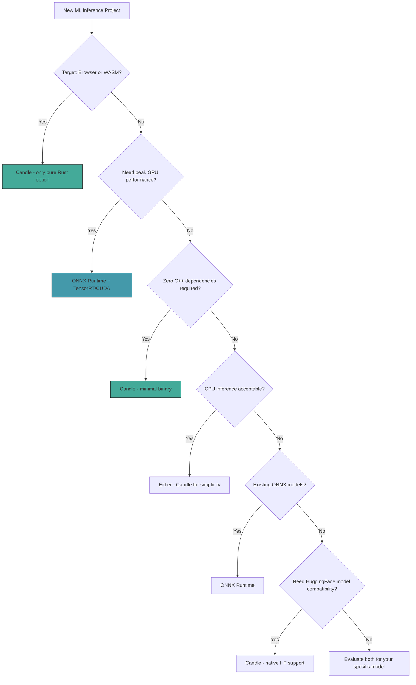

# ⚖️ ONNX vs Candle: Choosing the Right Runtime

## 🎯 Learning Objectives
- Understand the fundamental architectural trade-offs between ONNX Runtime (C++ backed) and Candle (pure Rust).
- Make informed decisions about which runtime to use based on deployment target (GPU, CPU, WASM, edge).
- Compare binary size, dependency complexity, and compilation targets for both runtimes.
- Evaluate real-world scenarios where each runtime excels and where each is unusable.

## Introduction

Rust developers building ML inference systems face a critical architectural decision: use ONNX Runtime with its battle-tested C++ backends and extensive hardware support, or use Candle, HuggingFace's pure-Rust framework with zero native dependencies. This is not a question of which is "better" — they serve fundamentally different deployment scenarios and have mutually exclusive capabilities.

ONNX Runtime excels at maximum performance on GPU hardware through TensorRT, CUDA, and vendor-optimized kernel libraries. It is the standard for production-grade model serving at companies like Microsoft, NVIDIA, and HuggingFace. Candle excels in environments where C++ dependencies are unacceptable: WebAssembly browser inference, edge devices with limited toolchains, and serverless functions where cold-start time matters more than peak throughput. Understanding when each runtime is the right tool — and when it is the wrong one — is essential for production Rust ML engineering.

This note builds directly on the foundations established in [[02 - Candle - HuggingFace ML in Rust|Candle]] and [[03 - ONNX Runtime Rust|ONNX Runtime Rust]], providing the decision framework to choose between them.

## 1. 🧠 Theoretical Foundation — Native vs. Pure Rust Runtimes

### The C++ FFI Boundary and Its Costs

ONNX Runtime's Rust bindings (`ort` crate) wrap a C++ library via Foreign Function Interface (FFI). Every tensor operation crosses a language boundary:

```
Rust Application → ort crate (Rust) → FFI (unsafe C ABI) → ONNX Runtime (C++) → CUDA/TensorRT (C/C++)
```

This introduces three categories of overhead:

1. **Compilation complexity**: The C++ ONNX Runtime library must be compiled (or linked as a prebuilt shared library). This requires a C++ toolchain, CUDA toolkit (for GPU), and platform-specific build scripts.

2. **Binary size**: The ONNX Runtime shared library alone is 100-500 MB depending on included execution providers. A minimal Candle binary (with one model) is typically 5-50 MB.

3. **Cross-compilation friction**: Targeting WASM, ARM embedded, or musl libc requires rebuilding the C++ library for each target. This is possible but significantly more complex than Candle's single `cargo build --target wasm32-unknown-unknown`.

### Why Candle Runs in the Browser and ONNX Runtime Cannot

This is the single most important distinction:

```
Candle:  Rust source → rustc → WASM (no C in the call graph)
ONNX RT: Rust source → ort crate → C FFI → libonnxruntime.so (C++ with OS-specific syscalls, GPU drivers, thread primitives)
```

Candle is **pure Rust from tensor operations to GPU kernels**. Every operation — matrix multiply, convolution, attention — is implemented in Rust. When compiled with `--target wasm32-unknown-unknown`, the entire computation graph compiles to WebAssembly with zero exotic dependencies. WASM runtimes in browsers understand WASM and JavaScript — they do not understand libcuda.so, cuBLAS, or Linux futex syscalls that ONNX Runtime's C++ core requires.

ONNX Runtime's C++ core depends on:
- `libstdc++` (C++ standard library)
- `pthreads` (OS-level threading)
- `libcuda.so` / `libcudnn.so` (NVIDIA GPU drivers)
- `libtensorrt.so` (TensorRT engine)
- System allocators and OS-specific memory mapping

None of these can compile to WASM. Even if you could cross-compile the C++ code, the WASM sandbox lacks the syscall interface (GPU access, threads, shared memory) that ONNX Runtime's execution providers need. **This is a hard constraint, not a performance trade-off.**

### The Compilation Target Matrix

```
┌─────────────────────────────────────────────────────────────────┐
│                ONNX Runtime vs Candle: Build Targets             │
├─────────────────────────────────────────────────────────────────┤
│                                                                   │
│  Target                  ONNX Runtime         Candle              │
│  ─────────────────────   ───────────────      ───────────────     │
│  x86_64-linux (CPU)      ✓ (prebuilt .so)     ✓ (cargo build)    │
│  x86_64-linux (CUDA)     ✓ (needs CUDA SDK)   ✓ (feature cuda)   │
│  aarch64-linux           ✓ (cross-compile)    ✓ (cargo build)    │
│  macOS (CPU)             ✓ (prebuilt .dylib)  ✓ (cargo build)    │
│  macOS (Metal)           ✗ (no Metal EP)      ✓ (feature metal)  │
│  WASM (browser)          ✗✗ (impossible)       ✓ (wasm-pack)     │
│  WASM (edge/serverless)  ✗✗ (impossible)       ✓ (wasmtime)      │
│  iOS/Android             ✓ (with effort)       ✓ (cargo ndk)     │
│  Windows (CPU)           ✓ (prebuilt .dll)     ✓ (cargo build)    │
│  Windows (DirectML)      ✓ (DirectML EP)       ✗ (no DML EP)     │
│                                                                   │
└─────────────────────────────────────────────────────────────────┘
```

## 2. 📐 Mental Model — Runtime Decision Tree

```
┌───────────────────────────────────────────────────────────────────────┐
│                   Which Runtime Should You Use?                        │
├───────────────────────────────────────────────────────────────────────┤
│                                                                        │
│                     ┌─────────────────┐                               │
│                     │ Does target need │                               │
│                     │ WASM/browser?    │                               │
│                     └────────┬────────┘                               │
│                              │                                         │
│                   ┌──────────▼──────────┐                             │
│                   │ Yes                 │ No                          │
│                   ▼                     ▼                              │
│            ┌─────────────┐    ┌─────────────────────┐                 │
│            │ USE CANDLE   │    │ Is GPU perf critical│                 │
│            │ (only option) │    │ AND you have NVIDIA?│                 │
│            └─────────────┘    └──────────┬──────────┘                │
│                                          │                             │
│                               ┌──────────▼──────────┐                │
│                               │ Yes                 │ No             │
│                               ▼                     ▼                 │
│                        ┌─────────────┐    ┌─────────────────────┐    │
│                        │ USE ONNX RT  │    │ Need zero C++ deps  │    │
│                        │ + TensorRT   │    │ or minimal binary?  │    │
│                        └─────────────┘    └──────────┬──────────┘   │
│                                                      │               │
│                                           ┌──────────▼──────────┐   │
│                                           │ Yes                 │   │
│                                           ▼                     │   │
│                                    ┌─────────────┐             │   │
│                                    │ USE CANDLE   │             │   │
│                                    └─────────────┘             │   │
│                                                                        │
│   Default for server-side GPU: ONNX Runtime                            │
│   Default for edge/WASM/zero-deps: Candle                              │
│   Default for CPU-only server: Either (Candle for simplicity)          │
│                                                                        │
└───────────────────────────────────────────────────────────────────────┘
```

### Mermaid Decision Flow



## 3. 💻 Performance and Dependency Comparison

### Performance Comparison

| Scenario | ONNX Runtime + TensorRT | Candle + CUDA | Candle + CPU | Candle + WASM |
|----------|------------------------|---------------|--------------|---------------|
| **ResNet-50 (batch=1)** | 1.2 ms | 2.1 ms | 8.5 ms | 22 ms |
| **ResNet-50 (batch=32)** | 4.8 ms | 11 ms | 95 ms | 280 ms |
| **BERT-base (batch=1)** | 3.5 ms | 6.2 ms | 42 ms | 110 ms |
| **Llama-7B (single token)** | 18 ms | 28 ms | 120 ms | N/A (mem) |
| **Stable Diffusion (1 img)** | 1.8 s | 2.9 s | 45 s | N/A (mem) |
| **Whisper-base (1s audio)** | 45 ms | 80 ms | 350 ms | 900 ms |

> Note: These are approximate benchmarks. Candle CUDA uses its own CUDA kernels (`cudarc`), which are less optimized than cuDNN. Real performance varies by model architecture and hardware generation.

### Dependency Comparison

| Metric | ONNX Runtime | Candle |
|--------|-------------|--------|
| **Rust crates** | `ort` (~1 crate) | `candle-core`, `candle-nn`, `candle-transformers` |
| **C/C++ dependencies** | ONNX Runtime lib (required) | None |
| **CUDA dependencies** | CUDA Toolkit, cuDNN, TensorRT | `cudarc` crate (optional) |
| **Binary size (CPU, release)** | 15-35 MB + 100-500 MB (libonnxruntime) | 5-50 MB (all Rust, single binary) |
| **Binary size (GPU, release)** | 15-35 MB + 500MB-2GB (CUDA libs + ORT) | 10-80 MB + CUDA driver only |
| **Compile time (cold)** | 2-5 min (Rust) + ORT prebuilt | 3-10 min (all Rust) |
| **Cross-compile to WASM** | Impossible | `wasm-pack build` |
| **Cross-compile to ARM** | Complex (rebuild C++ ORT) | `cargo build --target aarch64` |
| **Cargo.toml complexity** | Low (one feature flag) | Medium (multiple crates, features) |

### Deployment Footprint Comparison

```
┌────────────────────────────────────────────────────────────┐
│         Container Size Comparison (ResNet-50 serving)       │
├────────────────────────────────────────────────────────────┤
│                                                             │
│  ONNX Runtime + PyTorch (Python):                           │
│  python:3.11 + torch + onnxruntime-gpu + fastapi            │
│  ~3.2 GB Docker image                                       │
│                                                             │
│  ONNX Runtime + Rust (Axum):                                │
│  rust:slim + ort + axum + libonnxruntime.so + CUDA libs     │
│  ~800 MB Docker image                                       │
│                                                             │
│  Candle + Rust (Axum):                                      │
│  rust:slim + candle + axum (all static linked)              │
│  ~80 MB Docker image                                        │
│                                                             │
│  Candle + WASM (browser):                                   │
│  Single .wasm file served by any HTTP server                │
│  ~5 MB .wasm + ~2 MB JS glue code                           │
│                                                             │
└────────────────────────────────────────────────────────────┘
```

## 4. 🌍 Real-World Use Cases

| Scenario | Recommended Runtime | Why |
|----------|-------------------|-----|
| NVIDIA Triton Inference Server | ONNX Runtime | Triton natively integrates ONNX Runtime backend with TensorRT; requires C++ stack |
| Browser-based image classification | Candle | WASM compilation — ONNX Runtime is impossible in the browser |
| Serverless GPU inference (Lambda, Cloud Run) | Candle (CPU) or ONNX (GPU) | Candle for faster cold start; ONNX for GPU performance if cold start acceptable |
| Edge IoT (Raspberry Pi, Jetson Nano) | Candle | Single binary, no C++ toolchain needed on target |
| HuggingFace model deployment | Either | Candle for direct HF model loading; ONNX for models exported from HF |
| Real-time GPU inference (<10ms SLA) | ONNX Runtime + TensorRT | TensorRT kernel auto-tuning gives predictable low latency |
| Mobile app model inference | Candle (via FFI) or ONNX (via CoreML/Android NN) | Candle gives uniform API; ONNX has platform-specific EPs |
| Microsoft Azure AI Services | ONNX Runtime | First-party support, extensive Azure integration |
| Web demo of an LLM | Candle + WASM | Enables in-browser inference without server costs |
| Multi-model production server | ONNX Runtime | Mature session pooling, execution provider abstraction |

## ⚠️ Pitfalls

- **"I'll just use ONNX for everything"**: ONNX Runtime cannot compile to WASM. If you need browser inference, Candle is your only Rust option. Abandoning Candle early means forking your inference stack later.
- **"Candle is pure Rust so it's always fast enough"**: Candle's CUDA kernels use `cudarc`, which wraps CUDA driver API directly. It lacks the years of kernel autotuning that cuDNN and TensorRT provide. For GPU-heavy models at scale, expect 1.5-3x slower than ONNX + TensorRT.
- **"The ort crate is pure Rust"**: The `ort` crate is Rust, but it links to a non-Rust C++ library. The safety guarantees stop at the FFI boundary. Crashes in the C++ ONNX Runtime core will still crash your Rust program.
- **Cross-compilation assumption**: Both runtimes require careful attention to target triples. But ONNX Runtime's C++ dependency adds an entire layer of cross-compilation hell (matching libc versions, CUDA versions, protobuf versions).

## 💡 Tips

- Start with Candle during development for fast iteration (no C++ build dependencies, faster compile). Switch to ONNX Runtime if GPU benchmarks show it's necessary.
- If building for both browser and server, design your inference abstraction as a trait. Implement it for Candle (WASM/server) and optionally ONNX Runtime (server GPU). This avoids locking into one runtime.
- Use Candle's `candle-wasm` example as a starting template for browser inference — it handles the WASM memory model, JS interop, and model loading from ArrayBuffers.
- For ONNX Runtime, always benchmark with `GraphOptimizationLevel::All` and save the optimized model — the first-run optimization cost is amortized across all future session loads.
- When comparing performance, measure *end-to-end latency* including data transfer (CPU↔GPU memcpy), not just kernel execution time. Candle's zero-copy tensor design can sometimes close the gap with ONNX Runtime in real workloads.

## ✅ Knowledge Check

1. **Why can Candle compile to WebAssembly but ONNX Runtime cannot?**
   <details><summary>Answer</summary>
   Candle is pure Rust with no C/C++ dependencies — every tensor operation and GPU kernel is implemented in Rust. It compiles to WASM trivially via `cargo build --target wasm32-unknown-unknown`. ONNX Runtime's core is written in C++ and depends on OS-level primitives (pthreads, GPU drivers, shared memory) that cannot exist inside a WASM sandbox. The C++ → WASM compilation chain (Emscripten) is technically possible but cannot provide GPU access or threading, making it useless for ML inference.
   </details>

2. **A startup is building a real-time video processing pipeline on NVIDIA A100 GPUs with a 10ms P99 latency SLA. Which runtime should they use and why?**
   <details><summary>Answer</summary>
   ONNX Runtime with TensorRT EP. TensorRT performs kernel auto-tuning specific to the A100 architecture, layer fusion, and INT8/FP16 calibration that delivers predictable sub-10ms latency. Candle's CUDA backend uses generic kernels that cannot match TensorRT's hardware-specific optimizations for this demanding SLA.
   </details>

3. **Your team wants to run a Llama-3B model in the browser for a privacy-first chatbot demo. Can ONNX Runtime help?**
   <details><summary>Answer</summary>
   No. ONNX Runtime cannot run in a browser. Use Candle compiled to WASM via `wasm-pack`. The model weights can be loaded from an ArrayBuffer (downloaded or user-provided), and inference runs entirely in the browser with no server round-trips, preserving privacy.
   </details>

4. **What is the binary size difference between a minimal ONNX Runtime deployment and a minimal Candle deployment?**
   <details><summary>Answer</summary>
   A Candle binary (CPU only, one model) is typically 5-50 MB, all statically linked Rust. An ONNX Runtime deployment requires the application binary (~15 MB) plus the `libonnxruntime.so` shared library (100-500 MB depending on included EPs). The total is typically 10-50x larger. For GPU, both need CUDA libraries, but ONNX Runtime additionally needs TensorRT/cuDNN shared libraries.
   </details>

5. **When would you choose Candle even when you have access to NVIDIA GPUs?**
   <details><summary>Answer</summary>
   Choose Candle on GPU when: (1) you're deploying to ephemeral containers where cold-start time matters more than peak throughput; (2) you need a single static binary with no CUDA toolkit installation on the host; (3) you're iterating rapidly and can't afford the C++ build dependency chain; (4) you're using HuggingFace model formats directly and want to avoid the PyTorch → ONNX export step; (5) you need to deploy the same binary to both CPU and GPU environments with runtime device selection.
   </details>

## 🎯 Key Takeaways

- Candle is pure Rust, compiles to WASM, has zero C++ dependencies — this makes it the **only** option for browser/edge WASM inference.
- ONNX Runtime + TensorRT delivers the best GPU performance (1.5-3x faster than Candle CUDA on NVIDIA hardware) due to years of kernel autotuning in cuDNN and TensorRT.
- The decision is not about which is better: it's about whether your deployment target can run C++ at all. WASM/browser eliminates ONNX Runtime entirely.
- Binary size: Candle = 5-50 MB (static). ONNX Runtime = 115-535 MB (app + shared libs). This matters for serverless cold starts, edge devices, and container registry costs.
- Candle loads HuggingFace models directly (safetensors, GGUF). ONNX Runtime requires an export step (PyTorch → ONNX), adding complexity to the CI/CD pipeline.
- For production GPU serving, use ONNX Runtime. For everything else — browser, edge, serverless, zero-dependency — use Candle.
- Cross-compilation: Candle is `cargo build --target X`. ONNX Runtime requires rebuilding its C++ core for each target.

## References
- [[02 - Candle - HuggingFace ML in Rust|Candle — HuggingFace ML in Rust]]
- [[03 - ONNX Runtime Rust|ONNX Runtime Rust]]
- [[05 - Advanced ONNX Patterns|Advanced ONNX Patterns]]
- [Candle GitHub Repository](https://github.com/huggingface/candle)
- [ONNX Runtime Documentation](https://onnxruntime.ai)
- [WebAssembly System Interface (WASI)](https://wasi.dev)
- [candle-wasm examples](https://github.com/huggingface/candle/tree/main/candle-wasm-examples)
