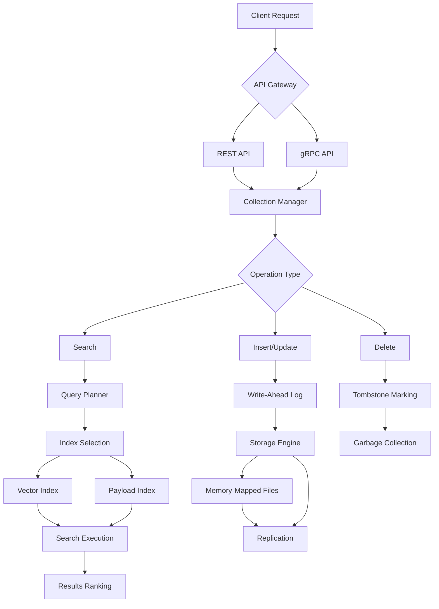
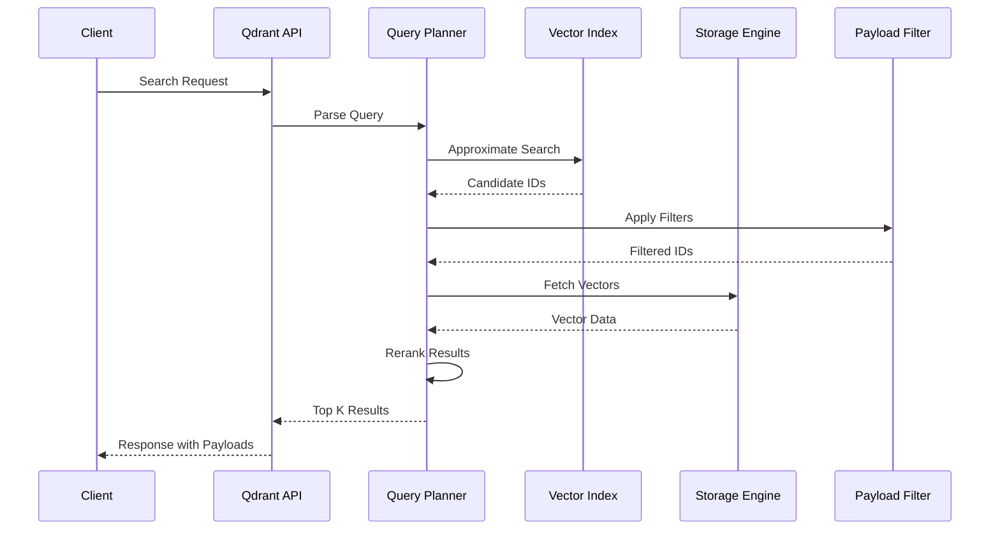

# 🔍 Vector Databases in Rust (Qdrant, pgvector)

## Introduction

Vector databases are specialized systems for storing, indexing, and querying high-dimensional vectors efficiently. They enable semantic search, similarity matching, and retrieval-augmented generation (RAG) applications. Rust's performance characteristics and memory safety make it an excellent choice for building vector database components, especially when handling billions of vectors with low-latency queries.

Qdrant is a Rust-native vector database designed for production use, offering gRPC and REST APIs, advanced filtering, and support for multiple storage backends. pgvector-rust provides Rust bindings for PostgreSQL's vector extension, allowing vector operations within a familiar relational database. These solutions complement [[04 - High-Throughput Inference Servers|inference servers]] by providing the storage layer for embeddings generated by models like those served via [[02 - Candle - HuggingFace ML in Rust|Candle]] or [[03 - ONNX Runtime Rust|ONNX Runtime]].

Vector search algorithms like HNSW (Hierarchical Navigable Small World), IVF (Inverted File Index), and product quantization enable efficient approximate nearest neighbor search. Understanding these algorithms is crucial for optimizing vector database performance and recall. This module covers both the theoretical foundations and practical implementations.

## 1. Vector Search Algorithms and Indexing

Vector databases use several algorithms for efficient similarity search:

- **HNSW (Hierarchical Navigable Small World)**: Graph-based algorithm that builds multiple layers for fast navigation. Excellent for high recall but requires more memory.

- **IVF (Inverted File Index)**: Partitions vectors into clusters using k-means, then searches only relevant clusters. Fast with moderate recall.

- **Product Quantization (PQ)**: Compresses vectors by splitting into subvectors and quantizing each. Reduces memory usage by 10-100x with minimal accuracy loss.

- **SCANN**: Google's approximate nearest neighbor search algorithm that combines IVF with anisotropic vector quantization.

**Real case: Qdrant** handles billions of vectors in production for companies like Zapier and Meilisearch. Their Rust implementation achieves sub-millisecond query times even at scale by leveraging efficient memory management and parallel processing.

⚠️ **Warning:** Index choice dramatically affects performance. HNSW is best for high recall (>95%), IVF for memory-constrained environments, and PQ for extreme scale. Always benchmark with your actual data distribution.

💡 **Tip:** Use the `with_payload` and `with_vector` parameters carefully. Loading full payloads and vectors increases memory usage and latency. Only request what you need for each query.

## 2. Qdrant Architecture and Features

Qdrant is a production-ready vector database with these key features:



**Vector database comparison:**

| Feature | Qdrant | Pinecone | Weaviate | Milvus | pgvector |
|---------|--------|----------|----------|--------|----------|
| **Language** | Rust | Proprietary | Go | Go/C++ | C/PostgreSQL |
| **Deployment** | Self-hosted, Cloud | Managed | Self-hosted, Cloud | Self-hosted, Cloud | Self-hosted |
| **API** | gRPC, REST | REST | REST, GraphQL | gRPC, REST | SQL |
| **Index Types** | HNSW, IVF, PQ | Proprietary | HNSW, IVF | HNSW, IVF, PQ | HNSW |
| **Filtering** | Full payload | Limited | GraphQL | Boolean | SQL WHERE |
| **Scalability** | Horizontal | Horizontal | Horizontal | Horizontal | Limited |
| **Consistency** | Strong | Eventual | Eventual | Tunable | Strong |
| **Pricing** | Open-source | Paid | Open-source | Open-source | Free |
| **Best For** | Production use | Quick start | Knowledge graphs | Large scale | PostgreSQL users |

**Recall formula for vector search:**
```
Recall@k = |Relevant_in_top_k| / |Total_Relevant|
Where:
- Relevant_in_top_k: True neighbors found in top k results
- Total_Relevant: Total true neighbors in dataset
Typical targets: Recall@10 > 0.95 for production
```

**Performance characteristics:**
```
Query_Time ≈ O(log N) for HNSW
Memory_Usage ≈ N × (D × 4 + overhead)
Where:
- N: Number of vectors
- D: Dimension
- 4: Bytes per float32
- overhead: Index structure (~20-50%)
```

## 3. Architecture and Data Flow

### Vector Search Pipeline

The following diagram shows how vector search works end-to-end:



**Memory layout visualization**:


**Index structure comparison**:


## 4. Implementation Examples

### Qdrant Client Operations

```rust
use qdrant_client::prelude::*;
use qdrant_client::qdrant::{
    vectors_config, CreateCollection, Distance, PointStruct, SearchParams, 
    VectorParams, VectorsConfig,
};
use serde::{Deserialize, Serialize};
use std::collections::HashMap;

#[derive(Serialize, Deserialize, Debug)]
struct Document {
    id: String,
    text: String,
    category: String,
    year: u32,
}

#[derive(Clone)]
struct QdrantManager {
    client: QdrantClient,
}

impl QdrantManager {
    fn new(url: &str) -> Result<Self> {
        let client = QdrantClient::from_url(url);
        Ok(Self { client })
    }
    
    async fn create_collection(
        &self,
        collection_name: &str,
        vector_dim: usize,
    ) -> Result<()> {
        self.client
            .create_collection(CreateCollection {
                collection_name: collection_name.to_string(),
                vectors_config: Some(VectorsConfig {
                    config: Some(vectors_config::Config::Params(VectorParams {
                        size: vector_dim as u64,
                        distance: Distance::Cosine.into(),
                        hnsw_config: None,
                        quantization_config: None,
                        on_disk: Some(false),
                    })),
                }),
                ..Default::default()
            })
            .await?;
        
        Ok(())
    }
    
    async fn upsert_documents(
        &self,
        collection_name: &str,
        documents: Vec<(String, Vec<f32>, Document)>,
    ) -> Result<()> {
        let points: Vec<PointStruct> = documents
            .into_iter()
            .map(|(id, vector, payload)| {
                let payload: HashMap<String, Value> = serde_json::to_value(payload)
                    .unwrap()
                    .as_object()
                    .unwrap()
                    .clone()
                    .into_iter()
                    .map(|(k, v)| (k, serde_json::from_value(v).unwrap()))
                    .collect();
                
                PointStruct::new(id, vector, payload)
            })
            .collect();
        
        self.client
            .upsert_points(collection_name, None, points, None)
            .await?;
        
        Ok(())
    }
    
    async fn search_similar(
        &self,
        collection_name: &str,
        query_vector: Vec<f32>,
        limit: u64,
        filter: Option<qdrant_client::qdrant::Filter>,
    ) -> Result<Vec<ScoredPoint>> {
        let search_params = SearchParams {
            hnsw_ef: Some(128),
            ..Default::default()
        };
        
        let results = self.client
            .search_points(&SearchPoints {
                collection_name: collection_name.to_string(),
                vector: query_vector,
                filter,
                limit,
                with_payload: Some(true.into()),
                with_vectors: Some(false.into()),
                params: Some(search_params),
                score_threshold: None,
                offset: None,
                ..Default::default()
            })
            .await?;
        
        Ok(results.result)
    }
    
    async fn search_with_filters(
        &self,
        collection_name: &str,
        query_vector: Vec<f32>,
        category: &str,
        min_year: u32,
        limit: u64,
    ) -> Result<Vec<ScoredPoint>> {
        let filter = qdrant_client::qdrant::Filter {
            must: vec![
                Condition::matches("category", category.to_string()),
                Condition::range(
                    "year",
                    qdrant_client::qdrant::Range {
                        gte: Some(min_year as f64),
                        ..Default::default()
                    },
                ),
            ],
            ..Default::default()
        };
        
        self.search_similar(collection_name, query_vector, limit, Some(filter))
            .await
    }
}
```

### pgvector-rust Integration

```rust
use pgvector::Vector;
use sqlx::{PgPool, postgres::PgPoolOptions};
use serde::{Deserialize, Serialize};

#[derive(Debug, Serialize, Deserialize, sqlx::FromRow)]
struct DocumentEmbedding {
    id: i64,
    content: String,
    embedding: Vector,
    metadata: serde_json::Value,
    created_at: chrono::DateTime<chrono::Utc>,
}

#[derive(Clone)]
struct VectorStore {
    pool: PgPool,
}

impl VectorStore {
    async fn new(database_url: &str) -> Result<Self> {
        let pool = PgPoolOptions::new()
            .max_connections(20)
            .connect(database_url)
            .await?;
        
        Ok(Self { pool })
    }
    
    async fn initialize(&self) -> Result<()> {
        // Enable pgvector extension
        sqlx::query("CREATE EXTENSION IF NOT EXISTS vector")
            .execute(&self.pool)
            .await?;
        
        // Create table with vector column
        sqlx::query(
            r#"
            CREATE TABLE IF NOT EXISTS document_embeddings (
                id BIGSERIAL PRIMARY KEY,
                content TEXT NOT NULL,
                embedding vector(1536),
                metadata JSONB NOT NULL DEFAULT '{}',
                created_at TIMESTAMPTZ NOT NULL DEFAULT NOW()
            )
            "#
        )
        .execute(&self.pool)
        .await?;
        
        // Create HNSW index
        sqlx::query(
            r#"
            CREATE INDEX IF NOT EXISTS idx_document_embedding_hnsw
            ON document_embeddings
            USING hnsw (embedding vector_cosine_ops)
            WITH (m = 16, ef_construction = 200)
            "#
        )
        .execute(&self.pool)
        .await?;
        
        // Create GIN index for metadata
        sqlx::query(
            r#"
            CREATE INDEX IF NOT EXISTS idx_document_metadata_gin
            ON document_embeddings
            USING gin (metadata)
            "#
        )
        .execute(&self.pool)
        .await?;
        
        Ok(())
    }
    
    async fn insert_document(
        &self,
        content: &str,
        embedding: Vec<f32>,
        metadata: serde_json::Value,
    ) -> Result<i64> {
        let vector = Vector::from(embedding);
        
        let result = sqlx::query_scalar::<_, i64>(
            r#"
            INSERT INTO document_embeddings (content, embedding, metadata)
            VALUES ($1, $2, $3)
            RETURNING id
            "#
        )
        .bind(content)
        .bind(vector)
        .bind(metadata)
        .fetch_one(&self.pool)
        .await?;
        
        Ok(result)
    }
    
    async fn search_similar(
        &self,
        query_embedding: Vec<f32>,
        limit: i64,
        similarity_threshold: f32,
    ) -> Result<Vec<DocumentEmbedding>> {
        let query_vector = Vector::from(query_embedding);
        
        let results = sqlx::query_as::<_, DocumentEmbedding>(
            r#"
            SELECT id, content, embedding, metadata, created_at,
                   1 - (embedding <=> $1) as similarity
            FROM document_embeddings
            WHERE 1 - (embedding <=> $1) > $2
            ORDER BY embedding <=> $1
            LIMIT $3
            "#
        )
        .bind(query_vector)
        .bind(similarity_threshold)
        .bind(limit)
        .fetch_all(&self.pool)
        .await?;
        
        Ok(results)
    }
    
    async fn search_with_metadata(
        &self,
        query_embedding: Vec<f32>,
        category: &str,
        limit: i64,
    ) -> Result<Vec<DocumentEmbedding>> {
        let query_vector = Vector::from(query_embedding);
        
        let results = sqlx::query_as::<_, DocumentEmbedding>(
            r#"
            SELECT id, content, embedding, metadata, created_at
            FROM document_embeddings
            WHERE metadata->>'category' = $1
            ORDER BY embedding <=> $2
            LIMIT $3
            "#
        )
        .bind(category)
        .bind(query_vector)
        .bind(limit)
        .fetch_all(&self.pool)
        .await?;
        
        Ok(results)
    }
    
    async fn hybrid_search(
        &self,
        query_embedding: Vec<f32>,
        text_query: &str,
        limit: i64,
    ) -> Result<Vec<(DocumentEmbedding, f32)>> {
        let query_vector = Vector::from(query_embedding);
        
        let results = sqlx::query_as::<_, (DocumentEmbedding, f32)>(
            r#"
            WITH vector_search AS (
                SELECT id, 1 - (embedding <=> $1) as similarity
                FROM document_embeddings
                ORDER BY embedding <=> $1
                LIMIT 100
            ),
            text_search AS (
                SELECT id, ts_rank(to_tsvector('english', content), 
                           plainto_tsquery('english', $2)) as text_rank
                FROM document_embeddings
                WHERE to_tsvector('english', content) @@ 
                      plainto_tsquery('english', $2)
                LIMIT 100
            )
            SELECT de.*, 
                   (COALESCE(vs.similarity, 0) * 0.7 + 
                    COALESCE(ts.text_rank, 0) * 0.3) as combined_score
            FROM document_embeddings de
            LEFT JOIN vector_search vs ON de.id = vs.id
            LEFT JOIN text_search ts ON de.id = ts.id
            WHERE vs.id IS NOT NULL OR ts.id IS NOT NULL
            ORDER BY combined_score DESC
            LIMIT $3
            "#
        )
        .bind(query_vector)
        .bind(text_query)
        .bind(limit)
        .fetch_all(&self.pool)
        .await?;
        
        Ok(results)
    }
}
```

### Batch Vector Operations

```rust
use qdrant_client::prelude::*;
use rayon::prelude::*;
use std::sync::Arc;
use tokio::sync::Semaphore;

struct VectorBatchProcessor {
    client: Arc<QdrantClient>,
    semaphore: Arc<Semaphore>,
    batch_size: usize,
}

impl VectorBatchProcessor {
    async fn new(url: &str, max_concurrent: usize, batch_size: usize) -> Result<Self> {
        let client = Arc::new(QdrantClient::from_url(url));
        let semaphore = Arc::new(Semaphore::new(max_concurrent));
        
        Ok(Self {
            client,
            semaphore,
            batch_size,
        })
    }
    
    async fn batch_insert(
        &self,
        collection: &str,
        vectors: Vec<(String, Vec<f32>, serde_json::Value)>,
    ) -> Result<()> {
        for chunk in vectors.chunks(self.batch_size) {
            let permit = self.semaphore.acquire().await?;
            
            let points: Vec<PointStruct> = chunk
                .par_iter()
                .map(|(id, vector, payload)| {
                    let payload: HashMap<String, Value> = serde_json::from_value(payload.clone())
                        .unwrap();
                    PointStruct::new(id.clone(), vector.clone(), payload)
                })
                .collect();
            
            self.client
                .upsert_points(collection, None, points, None)
                .await?;
            
            drop(permit);
        }
        
        Ok(())
    }
    
    async fn batch_search(
        &self,
        collection: &str,
        queries: Vec<Vec<f32>>,
        limit: u64,
    ) -> Result<Vec<Vec<ScoredPoint>>> {
        let mut results = Vec::new();
        
        for chunk in queries.chunks(self.batch_size) {
            let permit = self.semaphore.acquire().await?;
            
            let search_results = self.client
                .batch_search_points(&BatchSearchPoints {
                    searches: chunk
                        .iter()
                        .map(|vector| SearchPoints {
                            collection_name: collection.to_string(),
                            vector: vector.clone(),
                            limit,
                            with_payload: Some(true.into()),
                            ..Default::default()
                        })
                        .collect(),
                })
                .await?;
            
            results.extend(search_results);
            drop(permit);
        }
        
        Ok(results)
    }
}
```

---

## 📦 Compression Code

Complete Rust script for a production-ready vector database service:

```rust
// src/main.rs
use axum::{
    extract::{Json, Path, State},
    http::StatusCode,
    response::IntoResponse,
    routing::{get, post},
    Router,
};
use qdrant_client::prelude::*;
use qdrant_client::qdrant::{
    vectors_config, CreateCollection, Distance, PointStruct, 
    SearchPoints, VectorParams, VectorsConfig,
};
use serde::{Deserialize, Serialize};
use std::collections::HashMap;
use std::sync::Arc;
use tokio::sync::RwLock;

#[derive(Clone)]
struct VectorService {
    client: Arc<QdrantClient>,
    collections: Arc<RwLock<HashMap<String, CollectionInfo>>>,
}

#[derive(Debug, Serialize, Deserialize, Clone)]
struct CollectionInfo {
    name: String,
    vector_dim: usize,
    distance: String,
    points_count: u64,
    indexed: bool,
}

#[derive(Deserialize)]
struct CreateCollectionRequest {
    name: String,
    vector_dim: usize,
    distance: Option<String>,
}

#[derive(Deserialize)]
struct UpsertRequest {
    collection: String,
    points: Vec<VectorPoint>,
}

#[derive(Deserialize, Serialize)]
struct VectorPoint {
    id: String,
    vector: Vec<f32>,
    payload: HashMap<String, serde_json::Value>,
}

#[derive(Deserialize)]
struct SearchRequest {
    collection: String,
    vector: Vec<f32>,
    limit: u64,
    score_threshold: Option<f32>,
    filter: Option<SearchFilter>,
}

#[derive(Deserialize)]
struct SearchFilter {
    must: Option<Vec<Condition>>,
    should: Option<Vec<Condition>>,
    must_not: Option<Vec<Condition>>,
}

#[derive(Deserialize)]
struct Condition {
    field: String,
    r#match: Option<MatchCondition>,
    range: Option<RangeCondition>,
}

#[derive(Deserialize)]
struct MatchCondition {
    value: String,
}

#[derive(Deserialize)]
struct RangeCondition {
    gte: Option<f64>,
    lte: Option<f64>,
    gt: Option<f64>,
    lt: Option<f64>,
}

#[derive(Serialize)]
struct SearchResponse {
    points: Vec<ScoredPoint>,
    total: usize,
}

#[derive(Serialize)]
struct ScoredPoint {
    id: String,
    score: f32,
    payload: HashMap<String, serde_json::Value>,
}

impl VectorService {
    async fn new(url: &str) -> Result<Self> {
        let client = Arc::new(QdrantClient::from_url(url));
        let collections = Arc::new(RwLock::new(HashMap::new()));
        
        // Initialize collections info
        let service = Self { client, collections };
        service.refresh_collections().await?;
        
        Ok(service)
    }
    
    async fn refresh_collections(&self) -> Result<()> {
        let collections = self.client.list_collections().await?;
        let mut info_map = HashMap::new();
        
        for collection in collections {
            let info = self.client.get_collection(&collection.name).await?;
            
            info_map.insert(collection.name.clone(), CollectionInfo {
                name: collection.name,
                vector_dim: info.config
                    .and_then(|c| c.params)
                    .and_then(|p| p.vectors_config)
                    .and_then(|vc| vc.config)
                    .map(|config| match config {
                        vectors_config::Config::Params(params) => params.size as usize,
                        _ => 0,
                    })
                    .unwrap_or(0),
                distance: info.config
                    .and_then(|c| c.params)
                    .and_then(|p| p.vectors_config)
                    .and_then(|vc| vc.config)
                    .map(|config| match config {
                        vectors_config::Config::Params(params) => {
                            Distance::from_i32(params.distance).unwrap_or(Distance::Cosine)
                        }
                        _ => Distance::Cosine,
                    })
                    .map(|d| format!("{:?}", d))
                    .unwrap_or_default(),
                points_count: info.points_count.unwrap_or(0),
                indexed: true,
            });
        }
        
        let mut collections = self.collections.write().await;
        *collections = info_map;
        
        Ok(())
    }
    
    async fn create_collection(
        &self,
        name: &str,
        vector_dim: usize,
        distance: Distance,
    ) -> Result<()> {
        self.client
            .create_collection(CreateCollection {
                collection_name: name.to_string(),
                vectors_config: Some(VectorsConfig {
                    config: Some(vectors_config::Config::Params(VectorParams {
                        size: vector_dim as u64,
                        distance: distance.into(),
                        hnsw_config: None,
                        quantization_config: None,
                        on_disk: Some(false),
                    })),
                }),
                ..Default::default()
            })
            .await?;
        
        // Update collections info
        let mut collections = self.collections.write().await;
        collections.insert(name.to_string(), CollectionInfo {
            name: name.to_string(),
            vector_dim,
            distance: format!("{:?}", distance),
            points_count: 0,
            indexed: true,
        });
        
        Ok(())
    }
    
    async fn upsert_points(
        &self,
        collection: &str,
        points: Vec<VectorPoint>,
    ) -> Result<u64> {
        let qdrant_points: Vec<PointStruct> = points
            .into_iter()
            .map(|point| {
                let payload: HashMap<String, Value> = point.payload
                    .into_iter()
                    .map(|(k, v)| (k, serde_json::from_value(v).unwrap()))
                    .collect();
                
                PointStruct::new(point.id, point.vector, payload)
            })
            .collect();
        
        let count = qdrant_points.len() as u64;
        
        self.client
            .upsert_points(collection, None, qdrant_points, None)
            .await?;
        
        // Update points count
        let mut collections = self.collections.write().await;
        if let Some(info) = collections.get_mut(collection) {
            info.points_count += count;
        }
        
        Ok(count)
    }
    
    async fn search_points(
        &self,
        request: SearchRequest,
    ) -> Result<SearchResponse> {
        let filter = request.filter.map(|f| {
            qdrant_client::qdrant::Filter {
                must: f.must.map(|conditions| {
                    conditions.into_iter().map(|c| {
                        qdrant_client::qdrant::Condition {
                            field: Some(qdrant_client::qdrant::FieldCondition {
                                key: c.field,
                                r#match: c.r#match.map(|m| {
                                    qdrant_client::qdrant::Match {
                                        match_value: Some(
                                            qdrant_client::qdrant::r#match::MatchValue::Keyword(
                                                m.value
                                            )
                                        ),
                                    }
                                }),
                                range: c.range.map(|r| {
                                    qdrant_client::qdrant::Range {
                                        gte: r.gte,
                                        lte: r.lte,
                                        gt: r.gt,
                                        lt: r.lt,
                                    }
                                }),
                                ..Default::default()
                            }),
                        }
                    }).collect()
                }),
                should: f.should.map(|conditions| {
                    conditions.into_iter().map(|c| {
                        qdrant_client::qdrant::Condition {
                            field: Some(qdrant_client::qdrant::FieldCondition {
                                key: c.field,
                                ..Default::default()
                            }),
                        }
                    }).collect()
                }),
                must_not: f.must_not.map(|conditions| {
                    conditions.into_iter().map(|c| {
                        qdrant_client::qdrant::Condition {
                            field: Some(qdrant_client::qdrant::FieldCondition {
                                key: c.field,
                                ..Default::default()
                            }),
                        }
                    }).collect()
                }),
            }
        });
        
        let search_points = SearchPoints {
            collection_name: request.collection,
            vector: request.vector,
            filter,
            limit: request.limit,
            with_payload: Some(true.into()),
            with_vectors: Some(false.into()),
            score_threshold: request.score_threshold,
            ..Default::default()
        };
        
        let results = self.client.search_points(&search_points).await?;
        
        let points: Vec<ScoredPoint> = results.result
            .into_iter()
            .map(|point| ScoredPoint {
                id: point.id.map(|id| match id.point_id_options {
                    Some(qdrant_client::qdrant::point_id::PointIdOptions::Uuid(uuid)) => uuid,
                    Some(qdrant_client::qdrant::point_id::PointIdOptions::Num(num)) => num.to_string(),
                    None => String::new(),
                }).unwrap_or_default(),
                score: point.score,
                payload: point.payload
                    .into_iter()
                    .map(|(k, v)| (k, serde_json::to_value(v).unwrap()))
                    .collect(),
            })
            .collect();
        
        Ok(SearchResponse {
            total: points.len(),
            points,
        })
    }
}

async fn create_collection_handler(
    State(service): State<Arc<VectorService>>,
    Json(request): Json<CreateCollectionRequest>,
) -> impl IntoResponse {
    let distance = match request.distance.as_deref() {
        Some("euclid") => Distance::Euclid,
        Some("dot") => Distance::Dot,
        _ => Distance::Cosine,
    };
    
    match service.create_collection(&request.name, request.vector_dim, distance).await {
        Ok(_) => (StatusCode::OK, "Collection created".to_string()),
        Err(e) => (StatusCode::INTERNAL_SERVER_ERROR, e.to_string()),
    }
}

async fn upsert_handler(
    State(service): State<Arc<VectorService>>,
    Json(request): Json<UpsertRequest>,
) -> impl IntoResponse {
    match service.upsert_points(&request.collection, request.points).await {
        Ok(count) => (StatusCode::OK, format!("{} points upserted", count)),
        Err(e) => (StatusCode::INTERNAL_SERVER_ERROR, e.to_string()),
    }
}

async fn search_handler(
    State(service): State<Arc<VectorService>>,
    Json(request): Json<SearchRequest>,
) -> impl IntoResponse {
    match service.search_points(request).await {
        Ok(response) => (StatusCode::OK, Json(response).into_response()),
        Err(e) => (StatusCode::INTERNAL_SERVER_ERROR, e.to_string()).into_response(),
    }
}

async fn collections_handler(
    State(service): State<Arc<VectorService>>,
) -> impl IntoResponse {
    let collections = service.collections.read().await;
    Json(collections.values().cloned().collect::<Vec<_>>())
}

#[tokio::main]
async fn main() {
    let service = Arc::new(VectorService::new("http://localhost:6334").await.unwrap());
    
    let app = Router::new()
        .route("/collections", get(collections_handler))
        .route("/collections", post(create_collection_handler))
        .route("/upsert", post(upsert_handler))
        .route("/search", post(search_handler))
        .with_state(service);
    
    let listener = tokio::net::TcpListener::bind("0.0.0.0:8080").await.unwrap();
    println!("Vector service running on http://localhost:8080");
    
    axum::serve(listener, app).await.unwrap();
}
```

**Cargo.toml**:
```toml
[package]
name = "vector-service"
version = "0.1.0"
edition = "2021"

[dependencies]
axum = "0.7"
qdrant-client = "1.7"
serde = { version = "1.0", features = ["derive"] }
serde_json = "1.0"
tokio = { version = "1.0", features = ["full"] }
rayon = "1.8"

[profile.release]
opt-level = 3
lto = true
codegen-units = 1
strip = true
```

## 🎯 Documented Project

### Description
Build a production-ready vector database service using Qdrant with advanced filtering, hybrid search, and real-time indexing capabilities.

### Functional Requirements
1. Support multiple collections with configurable vector dimensions and distance metrics
2. Implement HNSW indexing with configurable parameters (M, efConstruction)
3. Provide REST API for CRUD operations on vectors and collections
4. Support complex filtering with boolean logic on payload fields
5. Implement hybrid search combining vector similarity and text matching
6. Support batch operations for efficient bulk insert/search
7. Include real-time index updates without downtime
8. Provide collection statistics and health monitoring
9. Support vector quantization for memory optimization
10. Implement access control and multi-tenancy

### Main Components
- **Collection Manager**: Handles collection lifecycle and configuration
- **Vector Index**: HNSW implementation with custom distance functions
- **Storage Engine**: Memory-mapped storage with persistence
- **Query Processor**: Filter parsing and execution planning
- **API Server**: REST/gRPC endpoints with validation
- **Metrics Collector**: Performance and usage statistics
- **Replication Manager**: Data replication across nodes
- **Cache Layer**: Query result caching for frequent searches

### Success Metrics
- >1 million vectors inserted per second per node
- <10ms query latency for 95th percentile
- 99.9% query availability
- >0.95 recall@10 for HNSW index
- Support 100+ concurrent search queries
- <2GB memory per million 768-dimensional vectors

### References
- [Qdrant Documentation](https://qdrant.tech/documentation/)
- [pgvector GitHub](https://github.com/pgvector/pgvector)
- [HNSW Algorithm Paper](https://arxiv.org/abs/1603.09320)
- [Vector Database Benchmarks](https://ann-benchmarks.com)
- [Similarity Search: The Desktop Environment](https://ann-benchmarks.com)