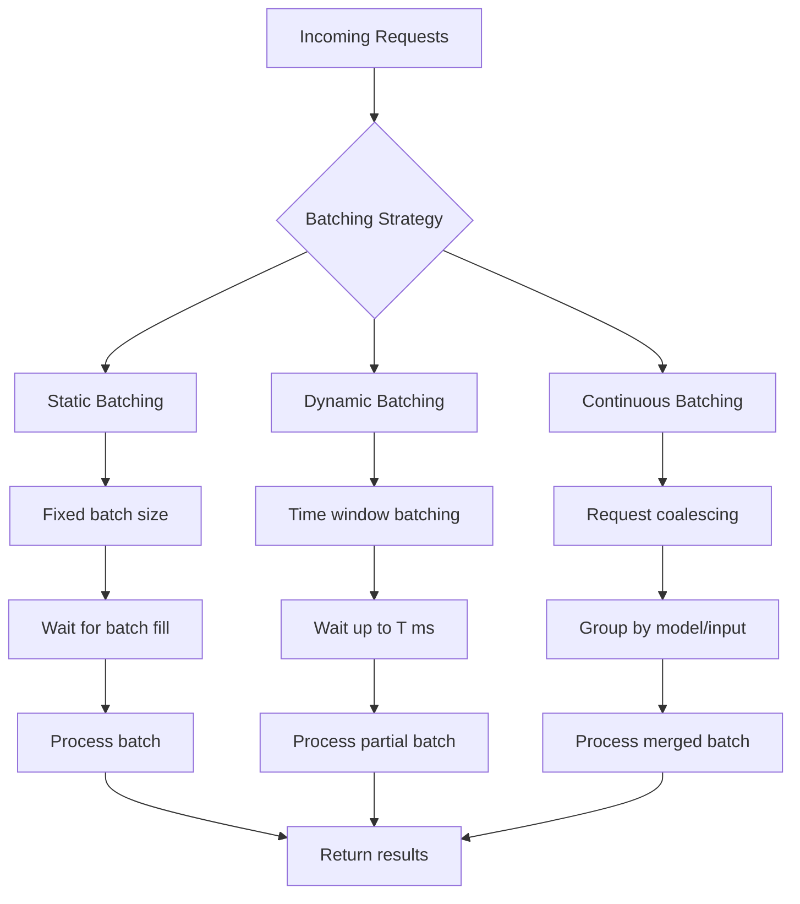
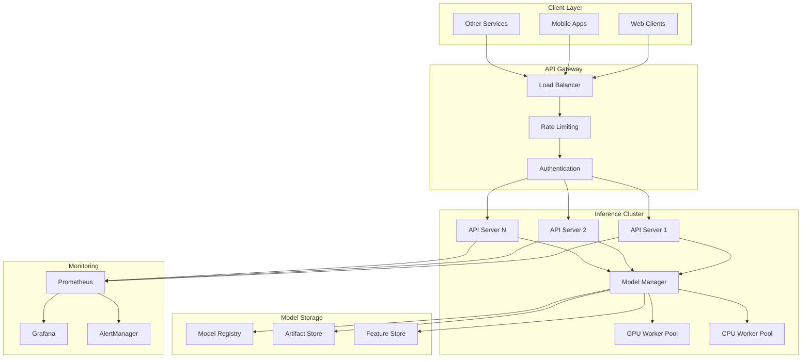

# 🚀 High-Throughput Inference Servers

## Introduction

High-throughput inference servers are specialized systems designed to serve machine learning models at scale with minimal latency and maximum efficiency. Rust's performance characteristics and safety guarantees make it an ideal language for building such servers, especially when combined with async frameworks like Actix-web, Axum, and tonic (gRPC). These servers handle thousands of concurrent inference requests while maintaining sub-second response times.

The architecture of inference servers revolves around batching strategies, request coalescing, and backpressure mechanisms. Unlike traditional web servers, ML inference servers must manage GPU/CPU resources, model loading, and dynamic batching to optimize throughput. This complements [[03 - ONNX Runtime Rust|ONNX Runtime]] deployment and works well with [[02 - Candle - HuggingFace ML in Rust|Candle models]] or [[07 - Vector Databases in Rust (Qdrant, pgvector)|vector search systems]].

Modern inference servers also integrate with message queues, feature stores, and monitoring systems to provide end-to-end ML serving pipelines. Rust's memory safety and lack of garbage collection make it particularly suitable for long-running, high-performance services where predictable latency is critical.

## 1. Server Frameworks and Async Patterns

Rust offers several mature web frameworks suitable for inference servers:

- **Actix-web**: Actor-based framework with excellent performance and middleware ecosystem
- **Axum**: Tokio-native framework with ergonomic API design and Tower middleware
- **Tonic**: gRPC framework for high-performance RPC with Protocol Buffers
- **Warp**: Filter-based framework with composable routes

The choice depends on protocol requirements and team familiarity. HTTP/JSON APIs are common for compatibility, while gRPC offers better performance for internal services.

**Real case: NVIDIA Triton** Inference Server supports Rust backends through its C API, allowing Rust models to be served alongside Python and TensorFlow models. This enables teams to use Rust for custom post-processing or specialized models while maintaining Triton's management features.

⚠️ **Warning:** GPU memory management is critical. Loading multiple models onto the same GPU can cause OOM errors. Always implement model unloading logic and memory monitoring.

💡 **Tip:** Use connection pooling and keep-alive connections to reduce TCP handshake overhead. For gRPC, enable HTTP/2 multiplexing to handle many concurrent streams on a single connection.

## 2. Batching Strategies and Performance Optimization

Effective batching is crucial for GPU utilization. Different strategies suit different workloads:



**Framework comparison for inference servers:**

| Feature | Actix-web | Axum | Tonic (gRPC) | Warp |
|---------|-----------|------|--------------|------|
| **Protocol** | HTTP/1.1, HTTP/2 | HTTP/1.1, HTTP/2 | HTTP/2 (gRPC) | HTTP/1.1, HTTP/2 |
| **Async Runtime** | Tokio (custom) | Tokio | Tokio | Tokio |
| **Performance** | Excellent | Very Good | Excellent | Good |
| **Middleware** | Rich ecosystem | Tower-based | Interceptors | Filters |
| **Learning Curve** | Moderate | Easy | Steep (Protobuf) | Moderate |
| **Streaming** | SSE, WebSocket | SSE, WebSocket | Bidirectional | SSE |
| **Use Case** | REST APIs | Modern REST APIs | Microservices | Simple APIs |
| **Ecosystem Maturity** | High | Growing | High | Moderate |

**Throughput formula for inference servers:**
```
Max_RPS = Concurrent_Workers × (1 / Avg_Latency)
Where:
- Concurrent_Workers: Number of parallel inference threads
- Avg_Latency: Average inference time per request
Example: 8 workers × (1 / 0.05s) = 160 RPS
```

**Batching efficiency calculation:**
```
Batch_Efficiency = (Batch_Time / Single_Request_Time) / Batch_Size
Ideal: 1.0 (perfect linear scaling)
Typical GPU: 0.7-0.9 (some overhead)
```

## 3. System Architecture and Scalability

### Inference Server Architecture

The following diagram shows a production inference server architecture:



**Request flow visualization**:


**Performance monitoring dashboard** (conceptual):


## 4. Implementation Examples

### Actix-web Inference Server with Batching

```rust
use actix_web::{web, App, HttpResponse, HttpServer, Responder};
use serde::{Deserialize, Serialize};
use std::collections::VecDeque;
use std::sync::{Arc, Mutex};
use std::time::{Duration, Instant};
use tokio::sync::{mpsc, RwLock};
use tokio::time::timeout;

#[derive(Deserialize, Serialize, Clone)]
struct InferenceRequest {
    model: String,
    input: Vec<f32>,
    request_id: String,
}

#[derive(Deserialize, Serialize)]
struct InferenceResponse {
    request_id: String,
    output: Vec<f32>,
    latency_ms: u64,
}

struct BatchConfig {
    max_batch_size: usize,
    max_wait_ms: u64,
}

struct ModelServer {
    batch_config: BatchConfig,
    request_queue: Arc<Mutex<VecDeque<InferenceRequest>>>,
    result_channels: Arc<RwLock<std::collections::HashMap<String, tokio::sync::oneshot::Sender<InferenceResponse>>>>,
}

impl ModelServer {
    fn new(batch_config: BatchConfig) -> Self {
        Self {
            batch_config,
            request_queue: Arc::new(Mutex::new(VecDeque::new())),
            result_channels: Arc::new(RwLock::new(std::collections::HashMap::new())),
        }
    }
    
    async fn start_batch_processor(&self) {
        let queue = self.request_queue.clone();
        let channels = self.result_channels.clone();
        let config = self.batch_config.clone();
        
        tokio::spawn(async move {
            let mut interval = tokio::time::interval(
                Duration::from_millis(config.max_wait_ms)
            );
            
            loop {
                interval.tick().await;
                
                // Collect batch
                let batch = {
                    let mut queue_lock = queue.lock().unwrap();
                    let batch_size = queue_lock.len().min(config.max_batch_size);
                    (0..batch_size)
                        .map(|_| queue_lock.pop_front().unwrap())
                        .collect::<Vec<_>>()
                };
                
                if batch.is_empty() {
                    continue;
                }
                
                // Process batch (simulate inference)
                let batch_start = Instant::now();
                let results = self::process_batch(&batch).await;
                let batch_time = batch_start.elapsed();
                
                println!(
                    "Processed batch of {} in {:?}",
                    batch.len(),
                    batch_time
                );
                
                // Send results back
                let mut channels_lock = channels.write().await;
                for (request, output) in batch.iter().zip(results.iter()) {
                    if let Some(sender) = channels_lock.remove(&request.request_id) {
                        let _ = sender.send(InferenceResponse {
                            request_id: request.request_id.clone(),
                            output: output.clone(),
                            latency_ms: batch_time.as_millis() as u64,
                        });
                    }
                }
            }
        });
    }
    
    async fn submit_request(&self, request: InferenceRequest) -> InferenceResponse {
        let (tx, rx) = tokio::sync::oneshot::channel();
        
        // Store response channel
        {
            let mut channels = self.result_channels.write().await;
            channels.insert(request.request_id.clone(), tx);
        }
        
        // Add to queue
        {
            let mut queue = self.request_queue.lock().unwrap();
            queue.push_back(request);
        }
        
        // Wait for result
        timeout(Duration::from_secs(30), rx)
            .await
            .unwrap()
            .unwrap()
    }
}

async fn process_batch(batch: &[InferenceRequest]) -> Vec<Vec<f32>> {
    // Simulate batch inference
    tokio::time::sleep(Duration::from_millis(10)).await;
    
    batch.iter()
        .map(|req| {
            // Simple transformation as example
            req.input.iter()
                .map(|&x| x * 2.0 + 1.0)
                .collect()
        })
        .collect()
}

async fn inference_handler(
    server: web::Data<Arc<ModelServer>>,
    request: web::Json<InferenceRequest>,
) -> impl Responder {
    let response = server.submit_request(request.into_inner()).await;
    HttpResponse::Ok().json(response)
}

#[actix_web::main]
async fn main() -> std::io::Result<()> {
    let batch_config = BatchConfig {
        max_batch_size: 32,
        max_wait_ms: 10,
    };
    
    let server = Arc::new(ModelServer::new(batch_config));
    server.start_batch_processor().await;
    
    HttpServer::new(move || {
        App::new()
            .app_data(web::Data::new(server.clone()))
            .route("/infer", web::post().to(inference_handler))
            .route("/health", web::get().to(|| async { "OK" }))
    })
    .bind("0.0.0.0:8080")?
    .run()
    .await
}
```

### Axum Streaming Inference Server

```rust
use axum::{
    extract::{Json, State},
    response::sse::{Event, Sse},
    routing::post,
    Router,
};
use futures::stream::{self, Stream};
use serde::{Deserialize, Serialize};
use std::convert::Infallible;
use std::time::Duration;
use tokio::sync::broadcast;

#[derive(Deserialize)]
struct StreamRequest {
    model: String,
    input: Vec<f32>,
    stream_tokens: bool,
}

#[derive(Serialize, Clone)]
struct StreamChunk {
    token: String,
    token_id: u32,
    is_final: bool,
    latency_ms: u64,
}

#[derive(Clone)]
struct AppState {
    model_tx: broadcast::Sender<(String, Vec<f32>, tokio::sync::mpsc::Sender<StreamChunk>)>,
}

async fn stream_inference_handler(
    State(state): State<AppState>,
    Json(request): Json<StreamRequest>,
) -> Sse<impl Stream<Item = Result<Event, Infallible>>> {
    let (tx, mut rx) = tokio::sync::mpsc::channel(100);
    
    // Send request to model worker
    let _ = state.model_tx.send((
        request.model,
        request.input,
        tx,
    ));
    
    // Convert receiver to SSE stream
    let stream = stream::unfold(rx, |mut rx| async move {
        match rx.recv().await {
            Some(chunk) => {
                let event = Event::default()
                    .json_data(&chunk)
                    .unwrap_or(Event::default().data("error"));
                Some((Ok(event), rx)
            }
            None => None,
        }
    });
    
    Sse::new(stream).keep_alive(
        axum::response::sse::KeepAlive::new()
            .interval(Duration::from_secs(15))
    )
}

async fn model_worker(mut rx: broadcast::Receiver<(String, Vec<f32>, tokio::sync::mpsc::Sender<StreamChunk>)>) {
    while let Ok((model, input, response_tx)) = rx.recv().await {
        tokio::spawn(async move {
            // Simulate token generation
            let tokens = ["The", " quick", " brown", " fox", " jumps"];
            
            for (i, token) in tokens.iter().enumerate() {
                let chunk = StreamChunk {
                    token: token.to_string(),
                    token_id: i as u32,
                    is_final: i == tokens.len() - 1,
                    latency_ms: 10 * (i + 1) as u64,
                };
                
                if response_tx.send(chunk).await.is_err() {
                    break;
                }
                
                tokio::time::sleep(Duration::from_millis(50)).await;
            }
        });
    }
}

#[tokio::main]
async fn main() {
    let (model_tx, _) = broadcast::channel(1000);
    
    // Start model workers
    for _ in 0..4 {
        let rx = model_tx.subscribe();
        tokio::spawn(model_worker(rx));
    }
    
    let state = AppState { model_tx };
    
    let app = Router::new()
        .route("/stream", post(stream_inference_handler))
        .with_state(state);
    
    let listener = tokio::net::TcpListener::bind("0.0.0.0:8080").await.unwrap();
    axum::serve(listener, app).await.unwrap();
}
```

### gRPC Inference Service with Tonic

```protobuf
// inference.proto
syntax = "proto3";

package inference;

service InferenceService {
    rpc Infer(InferRequest) returns (InferResponse);
    rpc InferStream(stream InferRequest) returns (stream InferResponse);
    rpc InferBatch(stream InferRequest) returns (stream InferResponse);
}

message InferRequest {
    string model_name = 1;
    string request_id = 2;
    repeated float input_data = 3;
    repeated int32 input_shape = 4;
    map<string, string> parameters = 5;
}

message InferResponse {
    string request_id = 2;
    repeated float output_data = 3;
    repeated int32 output_shape = 4;
    int64 latency_ns = 5;
    Status status = 6;
}

message Status {
    int32 code = 1;
    string message = 2;
}
```

```rust
// server.rs
use tonic::{transport::Server, Request, Response, Status};
use futures::Stream;
use std::pin::Pin;
use tokio::sync::mpsc;

pub mod inference {
    tonic::include_proto!("inference");
}

use inference::{
    inference_service_server::{InferenceService, InferenceServiceServer},
    InferRequest, InferResponse,
};

#[derive(Default)]
pub struct MyInferenceService {}

#[tonic::async_trait]
impl InferenceService for MyInferenceService {
    async fn infer(
        &self,
        request: Request<InferRequest>,
    ) -> Result<Response<InferResponse>, Status> {
        let req = request.into_inner();
        
        // Process inference
        let start = std::time::Instant::now();
        let output = process_inference(&req).await;
        let latency = start.elapsed();
        
        let response = InferResponse {
            request_id: req.request_id,
            output_data: output,
            output_shape: vec![1, 10],
            latency_ns: latency.as_nanos() as i64,
            status: Some(inference::Status {
                code: 0,
                message: "OK".to_string(),
            }),
        };
        
        Ok(Response::new(response))
    }
    
    type InferStreamStream = Pin<Box<dyn Stream<Item = Result<InferResponse, Status>> + Send>>;
    
    async fn infer_stream(
        &self,
        request: Request<tonic::Streaming<InferRequest>>,
    ) -> Result<Response<Self::InferStreamStream>, Status> {
        let mut stream = request.into_inner();
        let (tx, rx) = mpsc::channel(100);
        
        tokio::spawn(async move {
            while let Some(Ok(req)) = stream.message().await.unwrap_or(None) {
                let output = process_inference(&req).await;
                
                let response = InferResponse {
                    request_id: req.request_id,
                    output_data: output,
                    output_shape: vec![1, 10],
                    latency_ns: 0,
                    status: Some(inference::Status {
                        code: 0,
                        message: "OK".to_string(),
                    }),
                };
                
                if tx.send(Ok(response)).await.is_err() {
                    break;
                }
            }
        });
        
        let stream = tokio_stream::wrappers::ReceiverStream::new(rx);
        Ok(Response::new(Box::pin(stream)))
    }
}

async fn process_inference(request: &InferRequest) -> Vec<f32> {
    // Simulate inference
    tokio::time::sleep(std::time::Duration::from_millis(10)).await;
    
    request.input_data.iter()
        .map(|&x| x * 2.0)
        .collect()
}

#[tokio::main]
async fn main() -> Result<(), Box<dyn std::error::Error>> {
    let addr = "[::]:50051".parse()?;
    let service = MyInferenceService::default();
    
    Server::builder()
        .add_service(InferenceServiceServer::new(service))
        .serve(addr)
        .await?;
    
    Ok(())
}
```

---

## 📦 Compression Code

Complete Rust script for a production-ready inference server with monitoring:

```rust
// src/main.rs
use axum::{
    extract::{Json, State},
    http::StatusCode,
    response::IntoResponse,
    routing::{get, post},
    Router,
};
use dashmap::DashMap;
use prometheus::{Encoder, IntCounter, IntGauge, Registry, TextEncoder};
use serde::{Deserialize, Serialize};
use std::sync::Arc;
use std::time::{Duration, Instant};
use tokio::sync::{mpsc, RwLock};
use tokio::time::timeout;

#[derive(Clone)]
struct InferenceServer {
    models: Arc<DashMap<String, ModelInstance>>,
    request_tx: mpsc::Sender<InferenceTask>,
    metrics: Arc<Metrics>,
}

#[derive(Clone)]
struct ModelInstance {
    name: String,
    version: String,
    framework: String,
    input_schema: Vec<String>,
    output_schema: Vec<String>,
}

struct Metrics {
    registry: Registry,
    requests_total: IntCounter,
    requests_success: IntCounter,
    requests_error: IntCounter,
    inference_latency: prometheus::Histogram,
    model_load_time: prometheus::Histogram,
    gpu_memory_usage: IntGauge,
    batch_size: prometheus::Histogram,
}

impl Metrics {
    fn new() -> Self {
        let registry = Registry::new();
        
        let requests_total = IntCounter::new(
            "inference_requests_total",
            "Total number of inference requests"
        ).unwrap();
        
        let requests_success = IntCounter::new(
            "inference_requests_success",
            "Successful inference requests"
        ).unwrap();
        
        let requests_error = IntCounter::new(
            "inference_requests_error",
            "Failed inference requests"
        ).unwrap();
        
        let inference_latency = prometheus::Histogram::with_opts(
            prometheus::HistogramOpts::new(
                "inference_latency_seconds",
                "Inference latency in seconds"
            ).buckets(vec![0.001, 0.005, 0.01, 0.05, 0.1, 0.5, 1.0, 5.0])
        ).unwrap();
        
        let model_load_time = prometheus::Histogram::with_opts(
            prometheus::HistogramOpts::new(
                "model_load_time_seconds",
                "Time to load models"
            ).buckets(vec![0.1, 0.5, 1.0, 5.0, 10.0, 30.0, 60.0])
        ).unwrap();
        
        let gpu_memory_usage = IntGauge::new(
            "gpu_memory_usage_bytes",
            "GPU memory usage in bytes"
        ).unwrap();
        
        let batch_size = prometheus::Histogram::with_opts(
            prometheus::HistogramOpts::new(
                "inference_batch_size",
                "Batch size distribution"
            ).buckets(vec![1.0, 2.0, 4.0, 8.0, 16.0, 32.0, 64.0])
        ).unwrap();
        
        registry.register(Box::new(requests_total.clone())).unwrap();
        registry.register(Box::new(requests_success.clone())).unwrap();
        registry.register(Box::new(requests_error.clone())).unwrap();
        registry.register(Box::new(inference_latency.clone())).unwrap();
        registry.register(Box::new(model_load_time.clone())).unwrap();
        registry.register(Box::new(gpu_memory_usage.clone())).unwrap();
        registry.register(Box::new(batch_size.clone())).unwrap();
        
        Self {
            registry,
            requests_total,
            requests_success,
            requests_error,
            inference_latency,
            model_load_time,
            gpu_memory_usage,
            batch_size,
        }
    }
    
    fn encode(&self) -> Vec<u8> {
        let encoder = TextEncoder::new();
        let metric_families = self.registry.gather();
        let mut buffer = Vec::new();
        encoder.encode(&metric_families, &mut buffer).unwrap();
        buffer
    }
}

#[derive(Deserialize)]
struct InferenceRequest {
    model: String,
    input: Vec<f32>,
    batch_size: Option<usize>,
    timeout_ms: Option<u64>,
}

#[derive(Serialize)]
struct InferenceResponse {
    output: Vec<f32>,
    latency_ms: u64,
    model: String,
    batch_size: usize,
}

struct InferenceTask {
    request: InferenceRequest,
    response_tx: tokio::sync::oneshot::Sender<Result<InferenceResponse, String>>,
}

async fn inference_handler(
    State(server): State<Arc<InferenceServer>>,
    Json(request): Json<InferenceRequest>,
) -> impl IntoResponse {
    let start = Instant::now();
    server.metrics.requests_total.inc();
    
    // Validate model exists
    if !server.models.contains_key(&request.model) {
        server.metrics.requests_error.inc();
        return (
            StatusCode::NOT_FOUND,
            format!("Model {} not found", request.model),
        ).into_response();
    }
    
    let (response_tx, response_rx) = tokio::sync::oneshot::channel();
    
    let task = InferenceTask {
        request,
        response_tx,
    };
    
    // Send to worker
    if server.request_tx.send(task).await.is_err() {
        server.metrics.requests_error.inc();
        return (
            StatusCode::SERVICE_UNAVAILABLE,
            "Server shutting down".to_string(),
        ).into_response();
    }
    
    // Wait for result with timeout
    let timeout_duration = Duration::from_millis(30000);
    match timeout(timeout_duration, response_rx).await {
        Ok(Ok(Ok(response))) => {
            server.metrics.requests_success.inc();
            server.metrics.inference_latency.observe(
                start.elapsed().as_secs_f64()
            );
            Json(response).into_response()
        }
        Ok(Ok(Err(e))) => {
            server.metrics.requests_error.inc();
            (StatusCode::INTERNAL_SERVER_ERROR, e).into_response()
        }
        Ok(Err(_)) => {
            server.metrics.requests_error.inc();
            (StatusCode::INTERNAL_SERVER_ERROR, "Channel closed").into_response()
        }
        Err(_) => {
            server.metrics.requests_error.inc();
            (StatusCode::REQUEST_TIMEOUT, "Inference timeout".to_string()).into_response()
        }
    }
}

async fn metrics_handler(State(server): State<Arc<InferenceServer>>) -> impl IntoResponse {
    let buffer = server.metrics.encode();
    (StatusCode::OK, buffer).into_response()
}

async fn health_handler() -> impl IntoResponse {
    "OK"
}

async fn models_handler(
    State(server): State<Arc<InferenceServer>>,
) -> impl IntoResponse {
    let models: Vec<_> = server.models.iter()
        .map(|entry| entry.value().clone())
        .collect();
    Json(models)
}

async fn worker_loop(
    mut rx: mpsc::Receiver<InferenceTask>,
    metrics: Arc<Metrics>,
) {
    while let Some(task) = rx.recv().await {
        let start = Instant::now();
        
        // Simulate inference (replace with actual model inference)
        tokio::time::sleep(Duration::from_millis(10)).await;
        
        let output: Vec<f32> = task.request.input.iter()
            .map(|&x| x * 2.0)
            .collect();
        
        let latency = start.elapsed();
        
        let response = InferenceResponse {
            output,
            latency_ms: latency.as_millis() as u64,
            model: task.request.model,
            batch_size: 1,
        };
        
        let _ = task.response_tx.send(Ok(response));
    }
}

#[tokio::main]
async fn main() {
    // Initialize metrics
    let metrics = Arc::new(Metrics::new());
    
    // Initialize models
    let models = Arc::new(DashMap::new());
    models.insert("resnet50".to_string(), ModelInstance {
        name: "resnet50".to_string(),
        version: "1.0".to_string(),
        framework: "onnx".to_string(),
        input_schema: vec!["input".to_string()],
        output_schema: vec!["output".to_string()],
    });
    
    // Create request channel
    let (request_tx, request_rx) = mpsc::channel(1000);
    
    // Start workers
    for _ in 0..4 {
        let rx = request_rx.clone();
        let metrics = metrics.clone();
        tokio::spawn(worker_loop(rx, metrics));
    }
    
    // Create server
    let server = Arc::new(InferenceServer {
        models,
        request_tx,
        metrics,
    });
    
    // Build router
    let app = Router::new()
        .route("/infer", post(inference_handler))
        .route("/metrics", get(metrics_handler))
        .route("/health", get(health_handler))
        .route("/models", get(models_handler))
        .with_state(server);
    
    // Start server
    let listener = tokio::net::TcpListener::bind("0.0.0.0:8080").await.unwrap();
    println!("Inference server running on http://localhost:8080");
    
    axum::serve(listener, app).await.unwrap();
}
```

**Cargo.toml**:
```toml
[package]
name = "inference-server"
version = "0.1.0"
edition = "2021"

[dependencies]
axum = "0.7"
tokio = { version = "1.0", features = ["full"] }
serde = { version = "1.0", features = ["derive"] }
serde_json = "1.0"
prometheus = "0.13"
dashmap = "5.5"
futures = "0.3"

[profile.release]
opt-level = 3
lto = true
codegen-units = 1
strip = true
```

