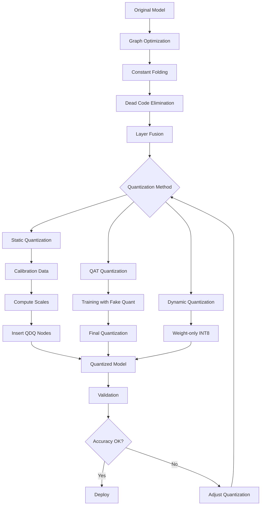
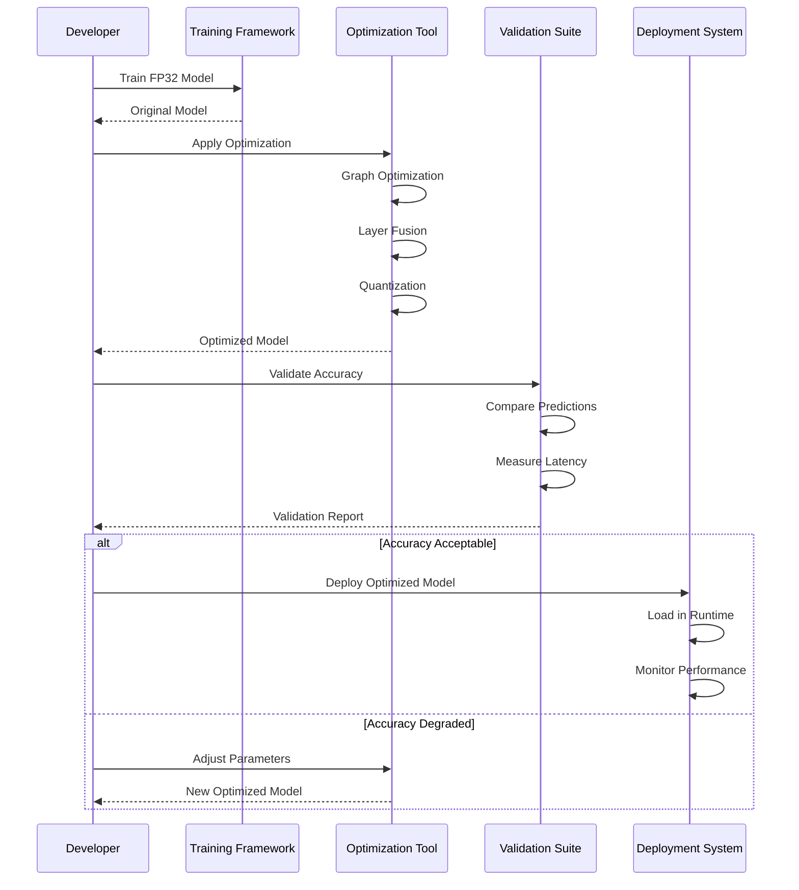

# ⚡ Model Quantization and Optimization

## Introduction

Model quantization and optimization are techniques to reduce model size, decrease inference latency, and improve energy efficiency while maintaining acceptable accuracy. Quantization reduces the precision of model weights and activations from 32-bit floating point to lower bit representations (INT8, INT4, mixed precision). This is crucial for deploying models on resource-constrained devices and for reducing cloud computing costs.

The field encompasses several approaches: post-training quantization (PTQ), quantization-aware training (QAT), and advanced techniques like GPTQ and AWQ (Activation-aware Weight Quantization). These methods complement [[03 - ONNX Runtime Rust|ONNX Runtime's quantization capabilities]] and are essential for optimizing models before deployment via [[06 - High-Throughput Inference Servers|high-throughput inference servers]] or [[02 - Candle - HuggingFace ML in Rust|Candle inference]].

Optimization extends beyond quantization to include graph optimizations, layer fusion, kernel auto-tuning, and hardware-specific optimizations. Understanding these techniques is key to achieving production-grade performance with [[01 - PyO3 - Binding Python to Rust|Python-Rust hybrid systems]] or pure Rust inference pipelines.

## 1. Quantization Types and Techniques

Quantization can be categorized by several dimensions:

- **Precision Reduction**:
  - FP32 → FP16/BF16: Half precision, minimal accuracy loss
  - FP32 → INT8: 8-bit integers, 4x size reduction
  - FP32 → INT4: 4-bit integers, 8x size reduction
  - Mixed Precision: Different layers at different precisions

- **Quantization Methods**:
  - **Post-Training Quantization (PTQ)**: Quantize pre-trained models without retraining
  - **Quantization-Aware Training (QAT)**: Train with simulated quantization
  - **GPTQ**: One-shot weight quantization using approximate second-order information
  - **AWQ**: Activation-aware weight quantization that protects salient weights

- **Quantization Schemes**:
  - **Symmetric**: Zero point at 0, range [-α, α]
  - **Asymmetric**: Zero point not at 0, better for asymmetric distributions
  - **Per-tensor**: Single scale/zero-point per tensor
  - **Per-channel**: Different scale/zero-point per output channel

**Real case: Meta's Llama deployment** uses mixed precision quantization (FP16 for activations, INT4 for weights) to serve Llama 2 models on consumer GPUs. This reduces memory from 26GB (FP16) to 3.5GB (INT4) while maintaining 95%+ of original performance.

⚠️ **Warning:** Aggressive quantization (INT4) can cause significant accuracy degradation (>5% drop) for some models. Always validate on your specific test set before deployment.

💡 **Tip:** Use quantization calibration data that matches your production distribution. Even 100 representative samples can significantly improve quantization accuracy compared to random data.

## 2. ONNX Quantization and Optimization Pipeline

ONNX Runtime provides built-in quantization with several optimization passes:



**Quantization methods comparison:**

| Method | Bit Width | Accuracy Loss | Memory Reduction | Speed Gain | Calibration Needed |
|--------|-----------|---------------|------------------|------------|-------------------|
| **FP16** | 16 | <1% | 2x | 1.5-2x | No |
| **INT8 (PTQ)** | 8 | 1-3% | 4x | 2-3x | Yes (100+ samples) |
| **INT4 (GPTQ)** | 4 | 3-5% | 8x | 3-4x | Yes (512+ samples) |
| **INT4 (AWQ)** | 4 | 2-4% | 8x | 3-4x | Yes (128+ samples) |
| **Mixed Precision** | Mixed | <2% | 2-4x | 2-3x | Yes |
| **QAT** | Custom | <1% | Variable | Variable | No (training data) |

**Quantization formula for memory reduction:**
```
Memory_Reduction = Original_Bits / Quantized_Bits
For INT8: 32 / 8 = 4x reduction
For INT4: 32 / 4 = 8x reduction
For mixed (50% INT8, 50% FP16): 32 / 12 = 2.67x reduction
```

**Accuracy degradation estimation:**
```
Accuracy_Loss ≈ α × log2(Precision_Ratio) + β × Model_Size
Where:
- α, β: Model-specific constants (typically 0.5-2.0)
- Precision_Ratio: Original_Bits / Quantized_Bits
- Model_Size: Number of parameters
```

## 3. Optimization Pipeline and Visualization

### Model Optimization Workflow

The following diagram shows the complete optimization pipeline:



**Quantization impact visualization**:


**Performance vs accuracy tradeoff**:


## 4. Implementation Examples

### ONNX Runtime Quantization in Rust

```rust
use ort::{
    GraphOptizationLevel, Session, SessionBuilder,
    graph_optimization::GraphOptimizationOptions,
    quantization::{QuantFormat, QuantType},
};
use std::path::Path;

struct ModelOptimizer {
    session_builder: SessionBuilder,
}

impl ModelOptimizer {
    fn new() -> Result<Self> {
        let session_builder = Session::builder()?;
        Ok(Self { session_builder })
    }
    
    fn optimize_model(
        &self,
        input_path: &Path,
        output_path: &Path,
        optimization_level: GraphOptimizationLevel,
    ) -> Result<()> {
        let session = self.session_builder
            .with_optimization_level(optimization_level)?
            .with_intra_threads(num_cpus::get())?
            .commit_from_file(input_path)?;
        
        // Save optimized model
        session.save_optimized_model(output_path)?;
        
        println!("Model optimized with level {:?}", optimization_level);
        println!("Output saved to: {:?}", output_path);
        
        Ok(())
    }
    
    fn quantize_dynamic(
        &self,
        input_path: &Path,
        output_path: &Path,
    ) -> Result<()> {
        let session = self.session_builder
            .with_optimization_level(GraphOptimizationLevel::Level3)?
            .with_dynamic_quantization(true)?
            .commit_from_file(input_path)?;
        
        session.save_optimized_model(output_path)?;
        
        println!("Dynamic quantization applied");
        
        Ok(())
    }
    
    fn quantize_static(
        &self,
        input_path: &Path,
        output_path: &Path,
        calibration_data: &[Vec<f32>],
        batch_size: usize,
    ) -> Result<()> {
        // Create calibration dataset
        let mut dataset = Vec::new();
        
        for batch in calibration_data.chunks(batch_size) {
            let batch_tensor = self::create_batch_tensor(batch)?;
            dataset.push(batch_tensor);
        }
        
        // Static quantization with calibration
        let session = self.session_builder
            .with_optimization_level(GraphOptimizationLevel::Level3)?
            .with_static_quantization(
                QuantFormat::QDQ,
                QuantType::Int8,
                &dataset,
            )?
            .commit_from_file(input_path)?;
        
        session.save_optimized_model(output_path)?;
        
        println!("Static quantization applied with {} calibration samples", 
            calibration_data.len());
        
        Ok(())
    }
    
    fn quantize_int4(
        &self,
        input_path: &Path,
        output_path: &Path,
        calibration_data: &[Vec<f32>],
    ) -> Result<()> {
        // INT4 quantization (GPTQ-like)
        let session = self.session_builder
            .with_optimization_level(GraphOptimizationLevel::Level3)?
            .with_quantization_options(
                QuantFormat::QDQ,
                QuantType::Int4,
                Some(calibration_data),
            )?
            .commit_from_file(input_path)?;
        
        session.save_optimized_model(output_path)?;
        
        println!("INT4 quantization applied");
        
        Ok(())
    }
}

fn create_batch_tensor(data: &[Vec<f32>]) -> Result<ort::Tensor> {
    let batch_size = data.len();
    let feature_dim = data[0].len();
    
    let flat_data: Vec<f32> = data.iter()
        .flat_map(|sample| sample.iter().cloned())
        .collect();
    
    ort::Tensor::from_array(([batch_size, feature_dim], flat_data))
}
```

### TensorRT Optimization via ONNX

```rust
use ort::{
    CUDAExecutionProvider, TensorRTExecutionProvider,
    Session, SessionBuilder,
};
use std::path::Path;

struct TensorRTOptimizer {
    device_id: i32,
    max_batch_size: usize,
    workspace_size: usize,
}

impl TensorRTOptimizer {
    fn new(device_id: i32) -> Self {
        Self {
            device_id,
            max_batch_size: 32,
            workspace_size: 1 << 30, // 1GB
        }
    }
    
    fn optimize_model(
        &self,
        input_path: &Path,
        output_path: &Path,
    ) -> Result<()> {
        // Initialize TensorRT EP
        let trt_ep = TensorRTExecutionProvider::default()
            .with_device_id(self.device_id)
            .with_max_workspace_size(self.workspace_size)
            .with_trt_fp16(true)
            .with_trt_int8(true)
            .with_min_subgraph_length(3)
            .build();
        
        let session = Session::builder()?
            .with_optimization_level(GraphOptimizationLevel::All)?
            .with_execution_providers([trt_ep])?
            .commit_from_file(input_path)?;
        
        // Save TensorRT optimized engine
        session.save_optimized_model(output_path)?;
        
        println!("TensorRT optimization completed");
        println!("Engine saved to: {:?}", output_path);
        
        Ok(())
    }
    
    fn benchmark_model(
        &self,
        model_path: &Path,
        input_shapes: &[(usize, usize)],
        iterations: usize,
    ) -> Result<BenchmarkResult> {
        let trt_ep = TensorRTExecutionProvider::default()
            .with_device_id(self.device_id)
            .with_trt_fp16(true)
            .build();
        
        let session = Session::builder()?
            .with_execution_providers([trt_ep])?
            .commit_from_file(model_path)?;
        
        let mut latencies = Vec::new();
        
        for (batch_size, feature_dim) in input_shapes {
            // Warmup
            for _ in 0..10 {
                let input = create_random_tensor(*batch_size, *feature_dim)?;
                let _ = session.run(ort::inputs!["input" => input])?;
            }
            
            // Benchmark
            for _ in 0..iterations {
                let input = create_random_tensor(*batch_size, *feature_dim)?;
                
                let start = std::time::Instant::now();
                let _ = session.run(ort::inputs!["input" => input])?;
                let latency = start.elapsed();
                
                latencies.push(latency.as_secs_f64() * 1000.0); // ms
            }
        }
        
        let avg_latency = latencies.iter().sum::<f64>() / latencies.len() as f64;
        let p50 = percentile(&latencies, 50.0);
        let p95 = percentile(&latencies, 95.0);
        let p99 = percentile(&latencies, 99.0);
        
        Ok(BenchmarkResult {
            avg_latency_ms: avg_latency,
            p50_latency_ms: p50,
            p95_latency_ms: p95,
            p99_latency_ms: p99,
            throughput_rps: 1000.0 / avg_latency,
        })
    }
}

fn create_random_tensor(batch_size: usize, feature_dim: usize) -> Result<ort::Tensor> {
    use rand::Rng;
    let mut rng = rand::thread_rng();
    
    let data: Vec<f32> = (0..batch_size * feature_dim)
        .map(|_| rng.gen_range(-1.0..1.0))
        .collect();
    
    ort::Tensor::from_array(([batch_size, feature_dim], data))
}

fn percentile(sorted_data: &[f64], percentile: f64) -> f64 {
    if sorted_data.is_empty() {
        return 0.0;
    }
    
    let index = (percentile / 100.0 * (sorted_data.len() - 1) as f64).round() as usize;
    sorted_data[index]
}

#[derive(Debug)]
struct BenchmarkResult {
    avg_latency_ms: f64,
    p50_latency_ms: f64,
    p95_latency_ms: f64,
    p99_latency_ms: f64,
    throughput_rps: f64,
}
```

### Mixed Precision and FP16 Conversion

```rust
use half::f16;
use ort::Tensor;

struct MixedPrecisionConverter {
    fp16_threshold: f32,
    fp32_threshold: f32,
}

impl MixedPrecisionConverter {
    fn new() -> Self {
        Self {
            fp16_threshold: 1e-4, // Small values stay FP32
            fp32_threshold: 1e4,  // Large values stay FP32
        }
    }
    
    fn convert_model_to_mixed_precision(
        &self,
        model_path: &Path,
        output_path: &Path,
    ) -> Result<()> {
        // Load model
        let session = Session::builder()?
            .commit_from_file(model_path)?;
        
        // Analyze weights and determine per-layer precision
        let layer_info = self.analyze_model_precision(&session)?;
        
        // Convert weights
        for layer in &layer_info {
            match layer.precision {
                Precision::FP16 => self.convert_layer_to_fp16(layer)?,
                Precision::FP32 => self.convert_layer_to_fp32(layer)?,
            }
        }
        
        // Save mixed precision model
        session.save_optimized_model(output_path)?;
        
        let fp16_layers = layer_info.iter()
            .filter(|l| matches!(l.precision, Precision::FP16))
            .count();
        
        println!("Mixed precision conversion completed");
        println!("FP16 layers: {}/{}", fp16_layers, layer_info.len());
        
        Ok(())
    }
    
    fn analyze_model_precision(
        &self,
        session: &Session,
    ) -> Result<Vec<LayerInfo>> {
        let mut layer_info = Vec::new();
        
        for (i, weight) in session.inputs.iter().enumerate() {
            let tensor = weight.try_extract_tensor::<f32>()?;
            let (_, data) = tensor;
            
            // Analyze weight statistics
            let min = data.iter().cloned().fold(f32::NAN, f32::min);
            let max = data.iter().cloned().fold(f32::NAN, f32::max);
            let mean = data.iter().sum::<f32>() / data.len() as f32;
            
            // Determine if layer can be FP16
            let can_be_fp16 = min.abs() > self.fp16_threshold 
                && max.abs() < self.fp32_threshold
                && (max - min) < 65504.0; // FP16 max value
            
            let precision = if can_be_fp16 {
                Precision::FP16
            } else {
                Precision::FP32
            };
            
            layer_info.push(LayerInfo {
                name: weight.name.to_string(),
                shape: tensor.shape().to_vec(),
                min,
                max,
                mean,
                precision,
            });
        }
        
        Ok(layer_info)
    }
    
    fn convert_layer_to_fp16(&self, layer: &LayerInfo) -> Result<()> {
        // Convert FP32 weights to FP16
        // In practice, this would modify the model graph
        println!("Converting {} to FP16", layer.name);
        Ok(())
    }
    
    fn convert_layer_to_fp32(&self, layer: &LayerInfo) -> Result<()> {
        // Ensure layer remains FP32
        println!("Keeping {} as FP32", layer.name);
        Ok(())
    }
}

#[derive(Debug)]
struct LayerInfo {
    name: String,
    shape: Vec<usize>,
    min: f32,
    max: f32,
    mean: f32,
    precision: Precision,
}

#[derive(Debug)]
enum Precision {
    FP16,
    FP32,
}
```

### GPTQ-like Quantization Implementation

```rust
use std::collections::HashMap;

struct GPTQQuantizer {
    block_size: usize,
    percdamp: f32,
    group_size: i32,
}

impl GPTQQuantizer {
    fn new() -> Self {
        Self {
            block_size: 128,
            percdamp: 0.01,
            group_size: 128,
        }
    }
    
    fn quantize_model(
        &self,
        weights: &HashMap<String, Vec<f32>>,
        calibration_data: &[Vec<f32>],
        bits: i32,
    ) -> Result<HashMap<String, QuantizedWeight>> {
        let mut quantized_weights = HashMap::new();
        
        for (layer_name, weight) in weights {
            println!("Quantizing layer: {}", layer_name);
            
            let quantized = self.quantize_layer(
                weight,
                calibration_data,
                bits,
                self.group_size,
            )?;
            
            quantized_weights.insert(layer_name.clone(), quantized);
        }
        
        Ok(quantized_weights)
    }
    
    fn quantize_layer(
        &self,
        weight: &[f32],
        calibration_data: &[Vec<f32>],
        bits: i32,
        group_size: i32,
    ) -> Result<QuantizedWeight> {
        let rows = weight.len() / calibration_data[0].len();
        let cols = calibration_data[0].len();
        
        let mut quantized = vec![0i8; weight.len()];
        let mut scales = Vec::new();
        let mut zeros = Vec::new();
        
        // Process in blocks
        for block_start in (0..rows).step_by(self.block_size) {
            let block_end = (block_start + self.block_size).min(rows);
            let block_size = block_end - block_start;
            
            // Compute Hessian for block
            let hessian = self.compute_hessian(
                &weight[block_start * cols..block_end * cols],
                calibration_data,
                block_size,
                cols,
            )?;
            
            // Quantize block using GPTQ algorithm
            let (block_quantized, block_scales, block_zeros) = 
                self.quantize_block(
                    &weight[block_start * cols..block_end * cols],
                    &hessian,
                    bits,
                    group_size,
                )?;
            
            // Store results
            quantized[block_start * cols..block_end * cols]
                .copy_from_slice(&block_quantized);
            scales.extend(block_scales);
            zeros.extend(block_zeros);
        }
        
        Ok(QuantizedWeight {
            data: quantized,
            scales,
            zeros,
            shape: vec![rows, cols],
            bits,
            group_size,
        })
    }
    
    fn compute_hessian(
        &self,
        weight: &[f32],
        calibration_data: &[Vec<f32>],
        rows: usize,
        cols: usize,
    ) -> Result<Vec<Vec<f32>>> {
        // Simplified Hessian computation
        // In practice, this uses second-order information
        let mut hessian = vec![vec![0.0; cols]; cols];
        
        for sample in calibration_data {
            for i in 0..cols {
                for j in 0..cols {
                    hessian[i][j] += sample[i] * sample[j];
                }
            }
        }
        
        // Add damping
        for i in 0..cols {
            hessian[i][i] += self.percdamp * hessian[i][i];
        }
        
        Ok(hessian)
    }
    
    fn quantize_block(
        &self,
        weight: &[f32],
        hessian: &[Vec<f32>],
        bits: i32,
        group_size: i32,
    ) -> Result<(Vec<i8>, Vec<f32>, Vec<f32>)> {
        let rows = weight.len() / hessian.len();
        let cols = hessian.len();
        
        let mut quantized = vec![0i8; weight.len()];
        let mut scales = Vec::new();
        let mut zeros = Vec::new();
        
        // Process in groups
        for group_start in (0..cols).step_by(group_size as usize) {
            let group_end = (group_start + group_size as usize).min(cols);
            let group_cols = group_end - group_start;
            
            // Compute scale and zero point for group
            let group_weights: Vec<f32> = (0..rows)
                .flat_map(|r| {
                    let start = r * cols + group_start;
                    let end = start + group_cols;
                    weight[start..end].to_vec()
                })
                .collect();
            
            let min = group_weights.iter().cloned().fold(f32::NAN, f32::min);
            let max = group_weights.iter().cloned().fold(f32::NAN, f32::max);
            
            let scale = (max - min) / ((1 << bits) - 1) as f32;
            let zero = min;
            
            scales.push(scale);
            zeros.push(zero);
            
            // Quantize weights
            for r in 0..rows {
                for c in group_start..group_end {
                    let idx = r * cols + c;
                    let w = weight[idx];
                    let q = ((w - zero) / scale).round()
                        .clamp(0.0, ((1 << bits) - 1) as f32) as i8;
                    quantized[idx] = q;
                }
            }
        }
        
        Ok((quantized, scales, zeros))
    }
}

#[derive(Debug)]
struct QuantizedWeight {
    data: Vec<i8>,
    scales: Vec<f32>,
    zeros: Vec<f32>,
    shape: Vec<usize>,
    bits: i32,
    group_size: i32,
}
```

---

## 📦 Compression Code

Complete Rust script for a production model optimization pipeline:

```rust
// src/main.rs
use ort::{
    GraphOptimizationLevel, Session, SessionBuilder,
    CUDAExecutionProvider, TensorRTExecutionProvider,
};
use serde::{Deserialize, Serialize};
use std::collections::HashMap;
use std::path::{Path, PathBuf};
use std::time::{Duration, Instant};

#[derive(Debug, Serialize, Deserialize, Clone)]
struct OptimizationConfig {
    model_path: PathBuf,
    output_dir: PathBuf,
    optimization_level: u32,
    use_gpu: bool,
    device_id: i32,
    quantization: QuantizationConfig,
    benchmark: BenchmarkConfig,
}

#[derive(Debug, Serialize, Deserialize, Clone)]
struct QuantizationConfig {
    enabled: bool,
    method: QuantizationMethod,
    bits: i32,
    calibration_samples: usize,
    calibration_data_path: Option<PathBuf>,
}

#[derive(Debug, Serialize, Deserialize, Clone)]
enum QuantizationMethod {
    Dynamic,
    Static,
    QAT,
    GPTQ,
    AWQ,
}

#[derive(Debug, Serialize, Deserialize, Clone)]
struct BenchmarkConfig {
    enabled: bool,
    iterations: usize,
    batch_sizes: Vec<usize>,
    feature_dims: Vec<usize>,
}

#[derive(Debug, Serialize)]
struct OptimizationResult {
    original_size_mb: f64,
    optimized_size_mb: f64,
    size_reduction: f64,
    original_latency_ms: f64,
    optimized_latency_ms: f64,
    speedup: f64,
    accuracy_diff: Option<f64>,
    optimization_time_secs: f64,
}

struct ModelOptimizer {
    config: OptimizationConfig,
}

impl ModelOptimizer {
    fn new(config: OptimizationConfig) -> Self {
        Self { config }
    }
    
    async fn optimize(&self) -> Result<OptimizationResult> {
        let start_time = Instant::now();
        
        // Get original model info
        let original_size = self.get_file_size(&self.config.model_path)?;
        let original_latency = self.benchmark_model(&self.config.model_path).await?;
        
        // Create output directory
        std::fs::create_dir_all(&self.config.output_dir)?;
        
        // Step 1: Graph optimization
        let optimized_path = self.config.output_dir.join("optimized.onnx");
        self.apply_graph_optimization(&optimized_path).await?;
        
        // Step 2: Quantization
        let quantized_path = if self.config.quantization.enabled {
            let path = self.config.output_dir.join("quantized.onnx");
            self.apply_quantization(&optimized_path, &path).await?;
            Some(path)
        } else {
            None
        };
        
        // Step 3: GPU optimization (TensorRT)
        let final_path = if self.config.use_gpu {
            let path = self.config.output_dir.join("tensorrt.onnx");
            self.apply_tensorrt_optimization(
                quantized_path.as_ref().unwrap_or(&optimized_path),
                &path,
            ).await?;
            path
        } else {
            quantized_path.unwrap_or(optimized_path)
        };
        
        // Benchmark optimized model
        let optimized_latency = self.benchmark_model(&final_path).await?;
        let optimized_size = self.get_file_size(&final_path)?;
        
        let optimization_time = start_time.elapsed().as_secs_f64();
        
        Ok(OptimizationResult {
            original_size_mb: original_size as f64 / 1_000_000.0,
            optimized_size_mb: optimized_size as f64 / 1_000_000.0,
            size_reduction: original_size as f64 / optimized_size as f64,
            original_latency_ms: original_latency,
            optimized_latency_ms: optimized_latency,
            speedup: original_latency / optimized_latency,
            accuracy_diff: None,
            optimization_time_secs: optimization_time,
        })
    }
    
    async fn apply_graph_optimization(&self, output_path: &Path) -> Result<()> {
        let level = match self.config.optimization_level {
            0 => GraphOptimizationLevel::DisableAll,
            1 => GraphOptimizationLevel::Level1,
            2 => GraphOptimizationLevel::Level2,
            3 => GraphOptimizationLevel::Level3,
            99 => GraphOptimizationLevel::All,
            _ => GraphOptimizationLevel::Level3,
        };
        
        let mut builder = Session::builder()?
            .with_optimization_level(level)?;
        
        if self.config.use_gpu {
            builder = builder.with_execution_providers([
                CUDAExecutionProvider::default()
                    .with_device_id(self.config.device_id)
                    .build(),
            ])?;
        }
        
        let session = builder.commit_from_file(&self.config.model_path)?;
        session.save_optimized_model(output_path)?;
        
        println!("Graph optimization completed with level {}", 
            self.config.optimization_level);
        
        Ok(())
    }
    
    async fn apply_quantization(
        &self,
        input_path: &Path,
        output_path: &Path,
    ) -> Result<()> {
        let mut builder = Session::builder()?
            .with_optimization_level(GraphOptimizationLevel::Level3)?;
        
        match self.config.quantization.method {
            QuantizationMethod::Dynamic => {
                builder = builder.with_dynamic_quantization(true)?;
            }
            QuantizationMethod::Static => {
                // Load calibration data if provided
                let calibration_data = if let Some(path) = &self.config.quantization.calibration_data_path {
                    self.load_calibration_data(path).await?
                } else {
                    self.generate_synthetic_calibration_data().await?
                };
                
                // Apply static quantization
                builder = builder.with_static_quantization(
                    ort::quantization::QuantFormat::QDQ,
                    ort::quantization::QuantType::Int8,
                    &calibration_data,
                )?;
            }
            _ => {
                // GPTQ/AWQ would require custom implementation
                println!("Custom quantization method, using dynamic");
                builder = builder.with_dynamic_quantization(true)?;
            }
        }
        
        let session = builder.commit_from_file(input_path)?;
        session.save_optimized_model(output_path)?;
        
        println!("Quantization completed using {:?} with {} bits",
            self.config.quantization.method,
            self.config.quantization.bits);
        
        Ok(())
    }
    
    async fn apply_tensorrt_optimization(
        &self,
        input_path: &Path,
        output_path: &Path,
    ) -> Result<()> {
        let trt_ep = TensorRTExecutionProvider::default()
            .with_device_id(self.config.device_id)
            .with_max_workspace_size(1 << 30) // 1GB
            .with_trt_fp16(true)
            .with_trt_int8(true)
            .build();
        
        let session = Session::builder()?
            .with_optimization_level(GraphOptimizationLevel::All)?
            .with_execution_providers([trt_ep])?
            .commit_from_file(input_path)?;
        
        session.save_optimized_model(output_path)?;
        
        println!("TensorRT optimization completed");
        
        Ok(())
    }
    
    async fn benchmark_model(&self, model_path: &Path) -> Result<f64> {
        if !self.config.benchmark.enabled {
            return Ok(0.0);
        }
        
        let mut builder = Session::builder()?;
        
        if self.config.use_gpu {
            builder = builder.with_execution_providers([
                CUDAExecutionProvider::default()
                    .with_device_id(self.config.device_id)
                    .build(),
            ])?;
        }
        
        let session = builder.commit_from_file(model_path)?;
        
        let mut latencies = Vec::new();
        
        for batch_size in &self.config.benchmark.batch_sizes {
            for feature_dim in &self.config.benchmark.feature_dims {
                // Warmup
                for _ in 0..10 {
                    let input = self.create_random_tensor(*batch_size, *feature_dim)?;
                    let _ = session.run(ort::inputs!["input" => input])?;
                }
                
                // Benchmark
                for _ in 0..self.config.benchmark.iterations {
                    let input = self.create_random_tensor(*batch_size, *feature_dim)?;
                    
                    let start = Instant::now();
                    let _ = session.run(ort::inputs!["input" => input])?;
                    latencies.push(start.elapsed().as_secs_f64() * 1000.0);
                }
            }
        }
        
        let avg_latency = if latencies.is_empty() {
            0.0
        } else {
            latencies.iter().sum::<f64>() / latencies.len() as f64
        };
        
        Ok(avg_latency)
    }
    
    async fn load_calibration_data(&self, path: &Path) -> Result<Vec<Vec<f32>>> {
        // Simplified: load from binary file
        let data = std::fs::read(path)?;
        // Parse data (implementation depends on format)
        Ok(Vec::new())
    }
    
    async fn generate_synthetic_calibration_data(&self) -> Result<Vec<Vec<f32>>> {
        use rand::Rng;
        let mut rng = rand::thread_rng();
        
        let mut data = Vec::new();
        for _ in 0..self.config.quantization.calibration_samples {
            let sample: Vec<f32> = (0..512)
                .map(|_| rng.gen_range(-1.0..1.0))
                .collect();
            data.push(sample);
        }
        
        Ok(data)
    }
    
    fn create_random_tensor(
        &self,
        batch_size: usize,
        feature_dim: usize,
    ) -> Result<ort::Tensor> {
        use rand::Rng;
        let mut rng = rand::thread_rng();
        
        let data: Vec<f32> = (0..batch_size * feature_dim)
            .map(|_| rng.gen_range(-1.0..1.0))
            .collect();
        
        ort::Tensor::from_array(([batch_size, feature_dim], data))
    }
    
    fn get_file_size(&self, path: &Path) -> Result<u64> {
        let metadata = std::fs::metadata(path)?;
        Ok(metadata.len())
    }
}

#[tokio::main]
async fn main() -> Result<()> {
    let config = OptimizationConfig {
        model_path: PathBuf::from("models/model.onnx"),
        output_dir: PathBuf::from("optimized"),
        optimization_level: 3,
        use_gpu: true,
        device_id: 0,
        quantization: QuantizationConfig {
            enabled: true,
            method: QuantizationMethod::Static,
            bits: 8,
            calibration_samples: 100,
            calibration_data_path: None,
        },
        benchmark: BenchmarkConfig {
            enabled: true,
            iterations: 100,
            batch_sizes: vec![1, 8, 16],
            feature_dims: vec![512, 768],
        },
    };
    
    let optimizer = ModelOptimizer::new(config);
    
    println!("Starting model optimization...");
    let result = optimizer.optimize().await?;
    
    println!("\n=== Optimization Results ===");
    println!("Original size: {:.2} MB", result.original_size_mb);
    println!("Optimized size: {:.2} MB", result.optimized_size_mb);
    println!("Size reduction: {:.2}x", result.size_reduction);
    println!("Original latency: {:.2} ms", result.original_latency_ms);
    println!("Optimized latency: {:.2} ms", result.optimized_latency_ms);
    println!("Speedup: {:.2}x", result.speedup);
    println!("Optimization time: {:.2} seconds", result.optimization_time_secs);
    
    // Save results to JSON
    let results_path = Path::new("optimization_results.json");
    let json = serde_json::to_string_pretty(&result)?;
    std::fs::write(results_path, json)?;
    
    println!("\nResults saved to: {:?}", results_path);
    
    Ok(())
}
```

**Cargo.toml**:
```toml
[package]
name = "model-optimizer"
version = "0.1.0"
edition = "2021"

[dependencies]
ort = { version = "2.0", features = ["cuda", "tensorrt", "load-dynamic"] }
serde = { version = "1.0", features = ["derive"] }
serde_json = "1.0"
tokio = { version = "1.0", features = ["full"] }
rand = "0.8"
half = "2.3"
rayon = "1.8"

[profile.release]
opt-level = 3
lto = true
codegen-units = 1
strip = true
```

