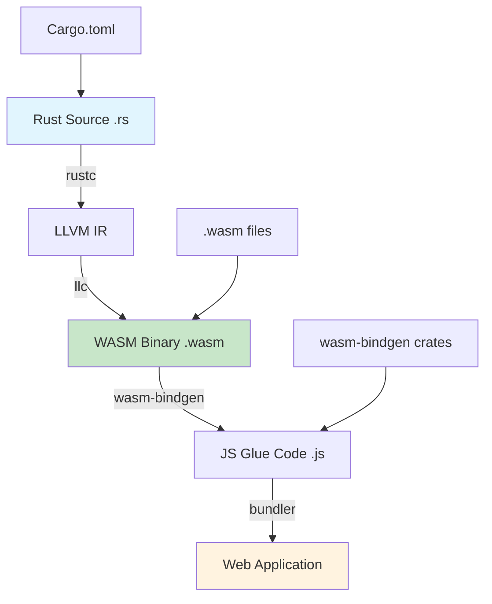

# 🔧 WASM Fundamentals with Rust

## Introduction

WebAssembly (WASM) represents a paradigm shift in how we think about portable code execution. Unlike JavaScript, which is interpreted and dynamically typed, WASM provides a binary instruction format that runs at near-native speed in a sandboxed environment. This makes it ideal for performance-critical applications like machine learning inference, cryptographic operations, and complex computations that would be prohibitively slow in JavaScript alone.

The Rust ecosystem has become the premier language for WASM development due to its memory safety guarantees, zero-cost abstractions, and excellent tooling. Tools like `wasm-bindgen` and `wasm-pack` make it trivially easy to compile Rust code to WASM and integrate it with JavaScript, creating a seamless bridge between systems programming and web development.

This module explores the fundamental architecture of WebAssembly, the compilation pipeline from Rust to browser-executable code, and practical techniques for building high-performance web applications. For background on Rust fundamentals, see [[01 - Cargo and Project Structure|📚 Cargo Fundamentals]].

## 1. WASM Architecture

WebAssembly defines a structured stack-based virtual machine with a compact binary format. Understanding its architecture is crucial for writing efficient WASM modules.

### Core Components

- **Binary Format (.wasm)**: Compact, size-optimized binary representation that loads faster than equivalent JavaScript
- **Linear Memory**: A contiguous, growable byte array shared between WASM and JavaScript, enabling zero-copy data transfer
- **Imports/Exports**: Functions, memories, tables, and globals that can be passed between host and WASM module
- **WASI (WebAssembly System Interface)**: Standardized system interface for non-browser environments

### Compilation Pipeline

```
Rust Source → LLVM IR → WASM Binary → JavaScript Glue → Browser Execution
```

The pipeline transforms safe Rust code into sandboxed WASM bytecode, with `wasm-bindgen` generating the necessary JavaScript bindings automatically.

Real case: **Figma** uses WASM for their rendering engine, processing millions of vector operations per second directly in the browser. Their custom renderer written in C++ compiles to WASM, achieving 60fps performance for complex design operations.

⚠️ **Warning:** Linear memory is not garbage collected. You must carefully manage allocations to avoid memory leaks in long-running WASM applications.

💡 **Tip:** Use `wasm-opt` to optimize your WASM binary size. The `-O4` flag applies aggressive optimizations including dead code elimination and function inlining.

### Performance Characteristics

| Metric | WASM | JavaScript | Notes |
|--------|------|------------|-------|
| Parse Time | ~1ms | ~10ms | Binary vs text format |
| Execution Speed | 1.0-1.5x native | 0.1-0.5x native | Predictable performance |
| Memory Access | Direct | JIT-optimized | No GC pauses |
| Cold Start | ~1ms | ~5ms | Instantiation overhead |
| Binary Size | ~1MB | ~5MB (minified) | After optimization |

## 2. Toolchain Overview

The Rust WASM ecosystem consists of several complementary tools that handle different stages of the compilation and deployment pipeline.

### Essential Tools

| Tool | Purpose | Command |
|------|---------|---------|
| `wasm-pack` | Build, test, and publish WASM modules | `wasm-pack build --target web` |
| `wasm-bindgen` | Generate JS bindings for Rust types | `#[wasm_bindgen]` attribute |
| `wasm-opt` | Optimize WASM binary size | `wasm-opt -O4 module.wasm -o optimized.wasm` |
| `wasm-tools` | Parse, validate, and manipulate WASM | `wasm-tools parse file.wat -o file.wasm` |
| `wasmtime` | Standalone WASM runtime | `wasmtime run module.wasm` |

### wasm-bindgen Types

The `wasm-bindgen` crate provides type mappings between Rust and JavaScript:

```rust
use wasm_bindgen::prelude::*;

// Expose Rust function to JavaScript
#[wasm_bindgen]
pub fn greet(name: &str) -> String {
    format!("Hello, {}!", name)
}

// Import JavaScript function into Rust
#[wasm_bindgen]
extern "C" {
    #[wasm_bindgen(js_namespace = console)]
    fn log(s: &str);
}
```

Real case: **Dropbox** uses WASM for their file preview system, rendering documents and images using compiled Rust code that runs in the browser without server round-trips.

## 3. WASM Compilation Pipeline

The compilation from Rust to WASM involves multiple transformation stages, each optimizing the code for web deployment.

### Mermaid Diagram



### Build Configuration

The `Cargo.toml` configuration determines the WASM target and optimization level:

```toml
[lib]
crate-type = ["cdylib"]

[dependencies]
wasm-bindgen = "0.2"
js-sys = "0.3"
web-sys = { version = "0.3", features = ["console"] }

[profile.release]
opt-level = "s"  # Optimize for size
lto = true       # Enable link-time optimization
```

## 4. Rust/WASM Implementation

Here's a complete example of a WASM module with JavaScript integration:

```rust
// src/lib.rs
use wasm_bindgen::prelude::*;
use std::collections::HashMap;

#[wasm_bindgen]
pub struct SentenceAnalyzer {
    word_frequencies: HashMap<String, u32>,
    total_words: u32,
}

#[wasm_bindgen]
impl SentenceAnalyzer {
    #[wasm_bindgen(constructor)]
    pub fn new() -> SentenceAnalyzer {
        SentenceAnalyzer {
            word_frequencies: HashMap::new(),
            total_words: 0,
        }
    }

    pub fn analyze(&mut self, text: &str) -> JsValue {
        self.word_frequencies.clear();
        self.total_words = 0;

        for word in text.split_whitespace() {
            let normalized = word.to_lowercase()
                .trim_matches(|c: char| !c.is_alphanumeric())
                .to_string();
            
            if !normalized.is_empty() {
                *self.word_frequencies.entry(normalized).or_insert(0) += 1;
                self.total_words += 1;
            }
        }

        // Convert HashMap to JavaScript object
        let result = js_sys::Object::new();
        for (word, count) in &self.word_frequencies {
            js_sys::Reflect::set(
                &result,
                &JsValue::from_str(word),
                &JsValue::from_f64(*count as f64),
            ).unwrap();
        }
        
        result.into()
    }

    pub fn unique_words(&self) -> u32 {
        self.word_frequencies.len() as u32
    }

    pub fn most_frequent(&self) -> String {
        self.word_frequencies
            .iter()
            .max_by_key(|(_, count)| *count)
            .map(|(word, _)| word.clone())
            .unwrap_or_default()
    }
}

// Export a simple function
#[wasm_bindgen]
pub fn fibonacci(n: u32) -> u32 {
    match n {
        0 => 0,
        1 => 1,
        _ => {
            let mut a = 0;
            let mut b = 1;
            for _ in 2..=n {
                let temp = a + b;
                a = b;
                b = temp;
            }
            b
        }
    }
}
```

**JavaScript Integration:**
```javascript
// index.js
import init, { SentenceAnalyzer, fibonacci } from './pkg/my_wasm_module.js';

async function run() {
    await init();
    
    // Use the analyzer
    const analyzer = new SentenceAnalyzer();
    const result = analyzer.analyze("The quick brown fox jumps over the lazy dog");
    console.log("Word frequencies:", result);
    console.log("Unique words:", analyzer.unique_words());
    console.log("Most frequent:", analyzer.most_frequent());
    
    // Use exported function
    console.log("Fibonacci(40):", fibonacci(40));
}

run();
```

---

## 📦 Compression Code

```rust
// compression.rs - Simple LZ-like compression for WASM
use wasm_bindgen::prelude::*;

#[wasm_bindgen]
pub fn compress(data: &[u8]) -> Vec<u8> {
    let mut compressed = Vec::with_capacity(data.len());
    let mut i = 0;
    
    while i < data.len() {
        let mut match_length = 0;
        let mut match_distance = 0;
        
        // Look back for matches (simplified LZ77)
        let search_start = if i > 4096 { i - 4096 } else { 0 };
        
        for j in search_start..i {
            let mut len = 0;
            while i + len < data.len() 
                && data[j + len] == data[i + len] 
                && len < 255 {
                len += 1;
            }
            
            if len > match_length {
                match_length = len;
                match_distance = i - j;
            }
        }
        
        if match_length >= 3 {
            // Encode as distance-length pair
            compressed.push(0xFF); // Escape byte
            compressed.push((match_distance >> 8) as u8);
            compressed.push((match_distance & 0xFF) as u8);
            compressed.push(match_length as u8);
            i += match_length;
        } else {
            // Literal byte
            compressed.push(data[i]);
            i += 1;
        }
    }
    
    compressed
}

#[wasm_bindgen]
pub fn decompress(data: &[u8]) -> Vec<u8> {
    let mut decompressed = Vec::new();
    let mut i = 0;
    
    while i < data.len() {
        if data[i] == 0xFF && i + 3 < data.len() {
            // Decode distance-length pair
            let distance = ((data[i + 1] as usize) << 8) | (data[i + 2] as usize);
            let length = data[i + 3] as usize;
            
            let start = decompressed.len() - distance;
            for j in 0..length {
                let byte = decompressed[start + j];
                decompressed.push(byte);
            }
            i += 4;
        } else {
            decompressed.push(data[i]);
            i += 1;
        }
    }
    
    decompressed
}
```

## 🎯 Documented Project

### Description

Build a real-time text analysis library that runs in the browser using WASM. The library processes text documents to extract statistics, perform sentiment analysis, and generate word clouds—all without server round-trips.

### Functional Requirements

1. Analyze text documents up to 10MB in size within 100ms
2. Support multiple languages with Unicode-aware tokenization
3. Calculate word frequency, sentence complexity, and readability scores
4. Export results as JSON for visualization libraries
5. Run entirely client-side for privacy-preserving analysis

### Main Components

- **TextProcessor**: Tokenization and normalization engine
- **FrequencyAnalyzer**: Word frequency distribution calculator
- **ReadabilityScorer**: Flesch-Kincaid and custom metrics
- **MemoryManager**: Efficient string handling with zero-copy when possible

### Success Metrics

- Processing speed: >1MB/s throughput
- Memory usage: <50MB for 10MB documents
- Binary size: <500KB optimized WASM
- Browser compatibility: Chrome, Firefox, Safari, Edge

### References

- [WebAssembly Specification](https://webassembly.org/specification/)
- [wasm-bindgen Guide](https://rustwasm.github.io/docs/wasm-bindgen/)
- [Figma's WASM Architecture](https://www.figma.com/blog/webassembly-cut-figmas-load-time-by-3x/)
