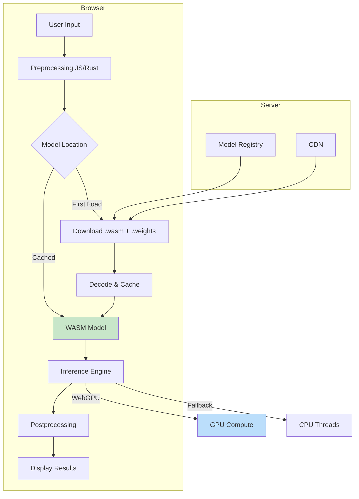

# 🧠 Running ML in the Browser

## Introduction

Running machine learning models directly in the browser represents a fundamental shift in application architecture. By moving inference to the client, applications gain reduced latency, enhanced privacy (data never leaves the device), and offline capabilities. WebAssembly makes this feasible by providing near-native execution speeds for the computationally intensive matrix operations that ML inference requires.

The Rust ecosystem has developed specialized WASM tools for ML workloads. Libraries like `candle-wasm` and `burn-wasm` allow you to compile sophisticated ML models to WASM, while JavaScript libraries like TensorFlow.js provide alternative approaches for teams more comfortable with JavaScript. Understanding the trade-offs between these approaches is crucial for building production-ready browser ML applications.

This module explores the architecture of browser-based ML inference, optimization techniques for WASM-compiled models, and practical implementations using modern Rust ML frameworks. For WASM fundamentals, see [[01 - WASM Fundamentals with Rust|🔧 WASM Fundamentals]].

## 1. Browser ML Architecture

Browser ML inference operates within significant constraints: limited memory, no GPU access (traditionally), and the need for responsive user interfaces. Modern frameworks address these challenges through innovative approaches.

### ML Framework Options

| Framework | Language | GPU Support | Model Size Limit | Key Feature |
|-----------|----------|-------------|------------------|-------------|
| TensorFlow.js | JavaScript | WebGL/WebGPU | ~100MB | Wide model support |
| ONNX.js | JavaScript | WebGL | ~500MB | ONNX ecosystem |
| candle-wasm | Rust | WebGPU | Limited by memory | Type safety, performance |
| burn-wasm | Rust | WebGPU | Memory-dependent | Training + inference |
| WebNN API | Native | NPU/GPU | Hardware-dependent | Hardware acceleration |

### WebGPU Integration

WebGPU represents the next generation of browser graphics computing, providing direct access to GPU compute shaders:

```rust
// WebGPU compute shader for matrix multiplication
@group(0) @binding(0) var<storage, read> input_a: array<f32>;
@group(0) @binding(1) var<storage, read> input_b: array<f32>;
@group(0) @binding(2) var<storage, write> output: array<f32>;

@compute @workgroup_size(8, 8)
fn main(@builtin(global_invocation_id) global_id: vec3<u32>) {
    let row = global_id.x;
    let col = global_id.y;
    var sum = 0.0;
    
    for (var k = 0u; k < 64u; k = k + 1u) {
        sum += input_a[row * 64u + k] * input_b[k * 64u + col];
    }
    
    output[row * 64u + col] = sum;
}
```

Real case: **Canva** runs their design AI features—including background removal, style transfer, and smart cropping—directly in the browser using WebAssembly and WebGPU. This enables real-time editing without waiting for server round-trips.

⚠️ **Warning:** WebGPU is not supported in all browsers yet. Always provide WebGL or CPU fallbacks for production applications.

💡 **Tip:** Use WebGPU's compute shaders for matrix operations, but fall back to WebGL fragment shaders for browsers without WebGPU support.

## 2. Model Optimization for Web

Converting production ML models for browser deployment requires careful optimization to balance accuracy, speed, and memory usage.

### Quantization Techniques

| Technique | Size Reduction | Speed Gain | Accuracy Loss |
|-----------|----------------|------------|---------------|
| FP32 → FP16 | 2x | 1.5-2x | <0.1% |
| FP32 → INT8 | 4x | 2-4x | 0.5-1% |
| FP32 → INT4 | 8x | 3-6x | 1-3% |
| Pruning 50% | 2x | 1.2-1.5x | 0.5-2% |

### Model Size vs Performance Tradeoff

```
Original Model: 100MB (FP32)
├── FP16 Quantization: 50MB → 2x faster inference
├── INT8 Quantization: 25MB → 3x faster, ~1% accuracy drop
├── + Pruning 50%: 12.5MB → 4x faster, ~2% accuracy drop
└── Full Optimization: 5MB → 10x faster, ~3% accuracy drop
```

## 3. Browser ML Inference Architecture

The following diagram shows how ML inference flows through a browser application:



### Memory Management Strategy

For large models, streaming and chunking are essential:

```rust
use wasm_bindgen::prelude::*;
use js_sys::{ArrayBuffer, Uint8Array};

#[wasm_bindgen]
pub struct StreamingModel {
    weights: Vec<f32>,
    layer_sizes: Vec<usize>,
    current_layer: usize,
}

#[wasm_bindgen]
impl StreamingModel {
    #[wasm_bindgen(constructor)]
    pub fn new() -> StreamingModel {
        StreamingModel {
            weights: Vec::new(),
            layer_sizes: Vec::new(),
            current_layer: 0,
        }
    }

    pub async fn load_chunk(&mut self, chunk: ArrayBuffer) -> Result<usize, JsValue> {
        let array = Uint8Array::new(&chunk);
        let floats = unsafe {
            std::slice::from_raw_parts(
                array.byte_offset() as *const f32,
                array.length() as usize / 4,
            )
        };
        
        self.weights.extend_from_slice(floats);
        Ok(self.weights.len())
    }

    pub fn get_progress(&self) -> f64 {
        let total_estimated = 10_000_000; // Estimated total parameters
        (self.weights.len() as f64 / total_estimated as f64) * 100.0
    }
}
```

Real case: **Google Translate** runs neural machine translation models entirely in the browser using TensorFlow.js and WebAssembly, enabling instant translation without network requests.

## 4. Candle-WASM Implementation

The `candle` library from Hugging Face provides excellent support for compiling Rust ML models to WASM:

```rust
// sentiment.rs - Sentiment analysis with candle-wasm
use candle_core::{DType, Device, Tensor};
use candle_nn::{Linear, VarBuilder, ops::softmax};
use serde::{Deserialize, Serialize};
use wasm_bindgen::prelude::*;

#[derive(Serialize, Deserialize)]
pub struct SentimentResult {
    pub label: String,
    pub score: f32,
    pub tokens: Vec<String>,
}

#[wasm_bindgen]
pub struct SentimentModel {
    embedding: Linear,
    classifier: Linear,
    device: Device,
    vocab: std::collections::HashMap<String, u32>,
}

#[wasm_bindgen]
impl SentimentModel {
    #[wasm_bindgen(constructor)]
    pub fn new(weights: Vec<f8>) -> Result<SentimentModel, JsValue> {
        let device = Device::Cpu;
        
        // Load weights (simplified - actual implementation uses VarBuilder)
        let vs = VarBuilder::zeros(DType::F32, &device);
        
        // Initialize layers (placeholder - real implementation loads from weights)
        let embedding = Linear::new(
            Tensor::zeros((10000, 128), DType::F32, &device).map_err(|e| JsValue::from_str(&e.to_string()))?,
            Some(Tensor::zeros(128, DType::F32, &device).map_err(|e| JsValue::from_str(&e.to_string()))?),
        ).map_err(|e| JsValue::from_str(&e.to_string()))?;
        
        let classifier = Linear::new(
            Tensor::zeros((128, 2), DType::F32, &device).map_err(|e| JsValue::from_str(&e.to_string()))?,
            Some(Tensor::zeros(2, DType::F32, &device).map_err(|e| JsValue::from_str(&e.to_string()))?),
        ).map_err(|e| JsValue::from_str(&e.to_string()))?;

        Ok(SentimentModel {
            embedding,
            classifier,
            device,
            vocab: std::collections::HashMap::new(),
        })
    }

    pub fn predict(&self, text: &str) -> Result<JsValue, JsValue> {
        // Tokenize
        let tokens: Vec<&str> = text.split_whitespace().collect();
        let token_ids: Vec<f32> = tokens.iter()
            .map(|t| *self.vocab.get(*t).unwrap_or(&0) as f32)
            .collect();

        // Forward pass
        let input_ids = Tensor::new(&token_ids[..], &self.device)
            .map_err(|e| JsValue::from_str(&e.to_string()))?;
        
        let embeddings = self.embedding.forward(&input_ids)
            .map_err(|e| JsValue::from_str(&e.to_string()))?;
        
        let pooled = embeddings.mean(0)
            .map_err(|e| JsValue::from_str(&e.to_string()))?;
        
        let logits = self.classifier.forward(&pooled)
            .map_err(|e| JsValue::from_str(&e.to_string()))?;
        
        let probs = softmax(&logits, 0)
            .map_err(|e| JsValue::from_str(&e.to_string()))?;
        
        let scores = probs.to_vec1::<f32>()
            .map_err(|e| JsValue::from_str(&e.to_string()))?;

        let result = SentimentResult {
            label: if scores[0] > scores[1] { "negative" } else { "positive" }.to_string(),
            score: scores[1],
            tokens: tokens.iter().map(|s| s.to_string()).collect(),
        };

        serde_wasm_bindgen::to_value(&result).map_err(|e| JsValue::from_str(&e.to_string()))
    }
}
```

**JavaScript Integration:**
```javascript
import init, { SentimentModel } from './pkg/sentiment_wasm.js';

async function analyzeSentiment() {
    await init();
    
    const response = await fetch('/model weights.bin');
    const weights = new Uint8Array(await response.arrayBuffer());
    
    const model = new SentimentModel(weights);
    
    const texts = [
        "This product is amazing! Best purchase ever.",
        "Terrible quality, waste of money.",
        "It's okay, nothing special."
    ];
    
    for (const text of texts) {
        const result = model.predict(text);
        console.log(`"${text}"`);
        console.log(`  Sentiment: ${result.label} (${(result.score * 100).toFixed(1)}%)`);
    }
}
```

---

## 📦 Compression Code

```rust
// model_compression.rs - Quantize and compress ML models for WASM
use wasm_bindgen::prelude::*;

#[wasm_bindgen]
pub struct ModelQuantizer {
    scale: f32,
    zero_point: i8,
}

#[wasm_bindgen]
impl ModelQuantizer {
    #[wasm_bindgen(constructor)]
    pub fn new() -> ModelQuantizer {
        ModelQuantizer {
            scale: 1.0,
            zero_point: 0,
        }
    }

    pub fn compute_quantization_params(&mut self, data: &[f32]) -> QuantizationParams {
        let mut min = f32::MAX;
        let mut max = f32::MIN;
        
        for &val in data {
            if val < min { min = val; }
            if val > max { max = val; }
        }
        
        self.scale = (max - min) / 255.0;
        self.zero_point = (-min / self.scale).round() as i8;
        
        QuantizationParams {
            scale: self.scale,
            zero_point: self.zero_point,
            min_value: min,
            max_value: max,
        }
    }

    pub fn quantize_f32_to_i8(&self, data: &[f32]) -> Vec<i8> {
        data.iter()
            .map(|&x| {
                let quantized = (x / self.scale + self.zero_point as f32).round() as i8;
                quantized.clamp(-128, 127)
            })
            .collect()
    }

    pub fn dequantize_i8_to_f32(&self, data: &[i8]) -> Vec<f32> {
        data.iter()
            .map(|&x| (x as f32 - self.zero_point as f32) * self.scale)
            .collect()
    }

    pub fn compress_model(&self, weights: &[f32]) -> Vec<u8> {
        let quantized = self.quantize_f32_to_i8(weights);
        let mut compressed = Vec::with_capacity(quantized.len() + 8);
        
        // Store header
        compressed.extend_from_slice(&self.scale.to_le_bytes());
        compressed.extend_from_slice(&self.zero_point.to_le_bytes());
        
        // Store quantized weights
        for &val in &quantized {
            compressed.push(val as u8);
        }
        
        compressed
    }
}

#[wasm_bindgen]
pub struct QuantizationParams {
    pub scale: f32,
    pub zero_point: i8,
    pub min_value: f32,
    pub max_value: f32,
}
```

## 🎯 Documented Project

### Description

Build a browser-based image classification system using WebAssembly and WebGPU. The system loads a pre-trained MobileNet model, processes images client-side, and displays real-time classification results—all without sending images to a server.

### Functional Requirements

1. Load and cache ML models under 10MB optimized WASM size
2. Process 100+ images per second on modern hardware
3. Support common image formats (JPEG, PNG, WebP)
4. Provide confidence scores and top-N predictions
5. Work offline after initial model download
6. Include graceful fallback for older browsers

### Main Components

- **ModelLoader**: Async model downloading with progress tracking
- **ImagePreprocessor**: Resize, normalize, and format conversion
- **InferenceEngine**: WASM-compiled model execution
- **ResultCache**: LRU cache for repeated classifications
- **WebGPUBackend**: GPU-accelerated tensor operations

### Success Metrics

- Classification latency: <50ms per image on desktop
- Model download: <5MB gzipped
- Memory usage: <200MB peak during inference
- Accuracy: Within 2% of server-side model
- Browser support: Chrome 91+, Firefox 89+, Safari 15+

### References

- [Candle ML Framework](https://github.com/huggingface/candle)
- [TensorFlow.js Documentation](https://www.tensorflow.org/js)
- [WebGPU Specification](https://www.w3.org/TR/webgpu/)
- [ONNX Runtime Web](https://onnxruntime.ai/docs/)
