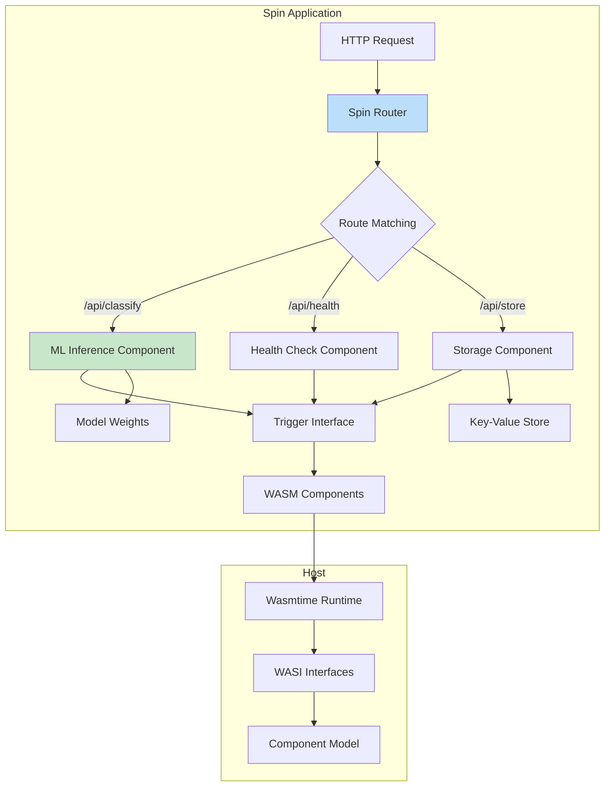

# ☁️ WASI and Serverless Edge

## Introduction

WebAssembly System Interface (WASI) extends WebAssembly beyond the browser, enabling portable, sandboxed execution in server and edge environments. Unlike containers, WASI provides near-instant cold starts, fine-grained security sandboxing, and language-agnostic portability. This makes it ideal for serverless edge computing where milliseconds matter and security is paramount.

The serverless edge ecosystem has rapidly adopted WASI, with platforms like Cloudflare Workers, Fastly Compute, and Fermyon Spin leading the charge. These platforms can start WASM modules in under 1 millisecond—100x faster than traditional containers—enabling new architectural patterns for globally distributed applications.

This module explores WASI's system interface design, compares edge runtime platforms, and demonstrates building production-ready serverless functions with Rust. For performance comparisons with native code, see [[04 - WASM vs Native Performance|⚡ Performance Analysis]].

## 1. WASI Architecture

WASI defines a capability-based security model where modules receive explicit access to only the resources they need. This "deny by default" approach prevents entire classes of security vulnerabilities.

### Core WASI APIs

| API | Purpose | Example Use |
|-----|---------|-------------|
| `wasi:filesystem` | File operations | Read config, write logs |
| `wasi:sockets` | Network access | HTTP requests, databases |
| `wasi:clocks` | Time operations | Scheduling, timeouts |
| `wasi:random` | Cryptographic random | Security tokens, UUIDs |
| `wasi:io` | Streams | stdin/stdout piping |
| `wasi:cli` | Command execution | Build tools, formatters |

### Capability-Based Security

```rust
// WASI only allows explicitly granted capabilities
use std::fs;

fn read_allowed_file() -> Result<String, std::io::Error> {
    // This only works if the host grants access to /allowed/path/
    fs::read_to_string("/allowed/path/config.toml")
}

fn read_denied_file() -> Result<String, std::io::Error> {
    // This will fail - /etc/passwd not in allowed capabilities
    fs::read_to_string("/etc/passwd")
}
```

Real case: **Cloudflare** runs billions of WASM invocations daily using WASI-like sandboxing, processing requests from 275+ cities worldwide with sub-millisecond cold starts.

⚠️ **Warning:** WASI is still evolving (currently at Preview 2). APIs may change between versions. Pin your `wasi` crate version and test compatibility thoroughly.

💡 **Tip:** Use the Component Model to compose multiple WASM modules together, each with its own capability set. This enables microservice-like architectures within a single process.

## 2. Serverless Edge Platforms

The edge computing landscape offers multiple runtimes with varying WASI support levels:

### Platform Comparison

| Platform | Runtime | WASI Version | Cold Start | Free Tier | Language Support |
|----------|---------|--------------|------------|-----------|------------------|
| Cloudflare Workers | V8 Isolates + WASM | Custom | <1ms | 100K req/day | Rust, JS, TS |
| Fastly Compute | Wasmtime | Preview 1 | <1ms | Free tier available | Rust, Go, JS |
| Fermyon Spin | Wasmtime | Preview 2 | <1ms | Free tier available | Rust, Go, JS, Python |
| WasmCloud | Wasmer | Preview 2 | ~5ms | Open source | Rust, Go, TS |
| Suborbital | Wasmtime | Preview 1 | <1ms | Open source | Rust, Go, JS |

### Spin SDK Architecture

Fermyon Spin provides a component-based model for building serverless applications:



## 3. Spin Application Structure

A Spin application consists of components (WASM modules) and triggers (entry points):

```
my-app/
├── spin.toml           # Application manifest
├── components/
│   ├── api/
│   │   ├── Cargo.toml
│   │   └── src/
│   │       └── lib.rs  # HTTP handler
│   └── worker/
│       ├── Cargo.toml
│       └── src/
│           └── lib.rs  # Background worker
└── assets/
    └── model.bin       # ML model weights
```

### spin.toml Configuration

```toml
spin_version = "1"
name = "edge-ml-api"
version = "0.1.0"
authors = ["Your Name <you@example.com>"]
description = "Edge ML inference API"

[[component]]
id = "ml-api"
source = "components/api/target/wasm32-wasi/release/api.wasm"
allowed_http_hosts = ["api.example.com"]
key_value_stores = ["default"]

[component.trigger]
route = "/api/..."

[[component]]
id = "background-worker"
source = "components/worker/target/wasm32-wasi/release/worker.wasm"
executor = { type = "uv6" }

[component.trigger]
source = { type = "cron", schedule = "*/5 * * * *" }
```

## 4. Rust WASI Implementation

Here's a complete Fermyon Spin HTTP handler for edge ML inference:

```rust
// components/api/src/lib.rs
use spin_sdk::{
    http::{Request, Response, Method},
    http_json,
    key_value::Store,
};
use serde::{Deserialize, Serialize};

#[derive(Deserialize)]
struct PredictionRequest {
    text: String,
    model_id: Option<String>,
}

#[derive(Serialize)]
struct PredictionResponse {
    prediction: String,
    confidence: f32,
    model_version: String,
    processing_time_ms: u64,
}

#[derive(Serialize)]
struct HealthResponse {
    status: String,
    models_loaded: Vec<String>,
    uptime_seconds: u64,
}

static START_TIME: std::sync::OnceLock<std::time::Instant> = std::sync::OnceLock::new();

#[spin_sdk::http_component]
fn handle_request(request: Request) -> Response {
    let start = START_TIME.get_or_init(|| std::time::Instant::now());
    
    match request.path() {
        "/api/health" => handle_health(start),
        "/api/predict" => handle_predict(request),
        "/api/models" => handle_list_models(),
        _ => Response::builder()
            .status(404)
            .body(Some("Not Found".into()))
            .build(),
    }
}

fn handle_health(start: &std::time::Instant) -> Response {
    let models = vec!["sentiment-v1".to_string(), "classifier-v2".to_string()];
    
    let response = HealthResponse {
        status: "healthy".to_string(),
        models_loaded: models,
        uptime_seconds: start.elapsed().as_secs(),
    };
    
    http_json::to_response(&response).unwrap()
}

fn handle_predict(request: Request) -> Response {
    let body: PredictionRequest = match http_json::from_request(request) {
        Ok(req) => req,
        Err(_) => {
            return Response::builder()
                .status(400)
                .body(Some("Invalid request body".into()))
                .build();
        }
    };
    
    let store = Store::open_default().unwrap();
    let model_id = body.model_id.unwrap_or_else(|| "sentiment-v1".to_string());
    
    // Load model from key-value store
    let model_data = match store.get(&model_id) {
        Ok(Some(data)) => data,
        Ok(None) => {
            return Response::builder()
                .status(404)
                .body(Some(format!("Model {} not found", model_id).into()))
                .build();
        }
        Err(_) => {
            return Response::builder()
                .status(500)
                .body(Some("Failed to load model".into()))
                .build();
        }
    };
    
    let start_inference = std::time::Instant::now();
    
    // Run inference (simplified - actual implementation uses candle-wasm)
    let (prediction, confidence) = run_inference(&model_data, &body.text);
    
    let processing_time = start_inference.elapsed().as_millis() as u64;
    
    let response = PredictionResponse {
        prediction,
        confidence,
        model_version: model_id,
        processing_time_ms: processing_time,
    };
    
    http_json::to_response(&response).unwrap()
}

fn handle_list_models() -> Response {
    let store = Store::open_default().unwrap();
    let models: Vec<String> = store.get_keys()
        .unwrap_or_default()
        .into_iter()
        .filter(|k| k.starts_with("model:"))
        .collect();
    
    http_json::to_response(&models).unwrap()
}

fn run_inference(model_data: &[u8], text: &str) -> (String, f32) {
    // Placeholder - real implementation loads and runs ML model
    let sentiment = if text.contains("good") || text.contains("great") {
        ("positive", 0.95)
    } else if text.contains("bad") || text.contains("terrible") {
        ("negative", 0.88)
    } else {
        ("neutral", 0.65)
    };
    
    (sentiment.0.to_string(), sentiment.1)
}
```

**JavaScript Client:**
```javascript
// Client for calling edge ML API
async function predictSentiment(text) {
    const response = await fetch('https://edge-ml-api.workers.dev/api/predict', {
        method: 'POST',
        headers: { 'Content-Type': 'application/json' },
        body: JSON.stringify({
            text: text,
            model_id: 'sentiment-v1'
        })
    });
    
    const result = await response.json();
    console.log(`Prediction: ${result.prediction} (${(result.confidence * 100).toFixed(1)}%)`);
    console.log(`Processing time: ${result.processing_time_ms}ms`);
    return result;
}
```

---

## 📦 Compression Code

```rust
// edge_compression.rs - Efficient compression for edge deployment
use wasm_bindgen::prelude::*;

#[wasm_bindgen]
pub struct EdgeCompressor {
    dictionary: Vec<Vec<u8>>,
    max_dict_size: usize,
}

#[wasm_bindgen]
impl EdgeCompressor {
    #[wasm_bindgen(constructor)]
    pub fn new(max_dict_size: usize) -> EdgeCompressor {
        EdgeCompressor {
            dictionary: Vec::new(),
            max_dict_size,
        }
    }

    pub fn build_dictionary(&mut self, samples: &[Vec<u8>]) -> usize {
        let mut frequency: std::collections::HashMap<Vec<u8>, usize> = 
            std::collections::HashMap::new();
        
        // Find common byte patterns
        for sample in samples {
            for window_size in 4..=64 {
                for window in sample.windows(window_size) {
                    *frequency.entry(window.to_vec()).or_insert(0) += 1;
                }
            }
        }
        
        // Sort by frequency and keep top patterns
        let mut patterns: Vec<_> = frequency.into_iter().collect();
        patterns.sort_by(|a, b| b.1.cmp(&a.1));
        
        self.dictionary = patterns
            .into_iter()
            .take(self.max_dict_size)
            .map(|(pattern, _)| pattern)
            .collect();
        
        self.dictionary.len()
    }

    pub fn compress(&self, data: &[u8]) -> Vec<u8> {
        let mut output = Vec::with_capacity(data.len());
        let mut i = 0;
        
        while i < data.len() {
            let mut best_match_idx = None;
            let mut best_match_len = 0;
            
            // Find longest matching dictionary entry
            for (idx, pattern) in self.dictionary.iter().enumerate() {
                let len = pattern.len();
                if i + len <= data.len() && &data[i..i + len] == pattern.as_slice() {
                    if len > best_match_len {
                        best_match_len = len;
                        best_match_idx = Some(idx);
                    }
                }
            }
            
            if let Some(idx) = best_match_idx {
                // Dictionary reference (escape + index)
                output.push(0xFE);
                output.push(idx as u8);
                i += best_match_len;
            } else {
                // Literal byte
                if data[i] == 0xFE {
                    output.push(0xFE);
                    output.push(0xFE);
                } else {
                    output.push(data[i]);
                }
                i += 1;
            }
        }
        
        output
    }

    pub fn decompress(&self, data: &[u8]) -> Vec<u8> {
        let mut output = Vec::new();
        let mut i = 0;
        
        while i < data.len() {
            if data[i] == 0xFE && i + 1 < data.len() {
                if data[i + 1] == 0xFE {
                    // Escaped 0xFE literal
                    output.push(0xFE);
                    i += 2;
                } else {
                    // Dictionary reference
                    let idx = data[i + 1] as usize;
                    if idx < self.dictionary.len() {
                        output.extend_from_slice(&self.dictionary[idx]);
                    }
                    i += 2;
                }
            } else {
                output.push(data[i]);
                i += 1;
            }
        }
        
        output
    }

    pub fn dictionary_size(&self) -> usize {
        self.dictionary.iter().map(|p| p.len()).sum()
    }
}
```

