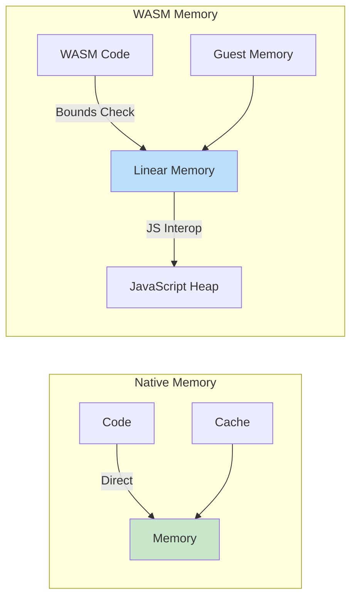

# ⚡ WASM vs Native Performance

## Introduction

Understanding the performance characteristics of WebAssembly versus native code is crucial for making informed architectural decisions. WASM provides a unique value proposition: near-native execution speed within a secure sandbox, portable across all major platforms. However, the overhead of sandboxing, memory abstraction, and JavaScript interop creates measurable performance differences that vary significantly by workload type.

This module presents a rigorous benchmarking methodology using Rust's `criterion` crate and browser-based testing tools. We'll explore when WASM outperforms expectations, where native code maintains clear advantages, and how to optimize your applications for each environment. For ML-specific performance analysis, see [[02 - Running ML in the Browser|🧠 Browser ML Performance]].

## 1. Benchmarking Methodology

Accurate performance comparison requires consistent methodology across native and WASM environments. Different tools serve different purposes in the benchmarking pipeline.

### Benchmarking Tools

| Tool | Environment | Use Case | Accuracy |
|------|-------------|----------|----------|
| `criterion` | Native Rust | Microbenchmarks | High |
| `wasm-bindgen-test` | Browser | Integration tests | Medium |
| `web-sys` Performance API | Browser | End-to-end timing | Medium |
| `wasm-opt --metrics` | Build time | Binary size analysis | Exact |
| `perf` (Linux) | Native | CPU profiling | High |

### Benchmark Structure

```rust
// benches/perf_comparison.rs
use criterion::{black_box, criterion_group, criterion_main, Criterion};
use my_wasm_lib::*;

fn bench_fibonacci_native(c: &mut Criterion) {
    c.bench_function("fibonacci_native_40", |b| {
        b.iter(|| fibonacci_native(black_box(40)))
    });
}

fn bench_fibonacci_wasm(c: &mut Criterion) {
    // In real scenario, this runs via wasm-bindgen-test
    c.bench_function("fibonacci_wasm_40", |b| {
        b.iter(|| fibonacci_wasm(black_box(40)))
    });
}

fn fibonacci_native(n: u32) -> u64 {
    let mut a: u64 = 0;
    let mut b: u64 = 1;
    for _ in 2..=n {
        let temp = a + b;
        a = b;
        b = temp;
    }
    b
}

criterion_group!(benches, bench_fibonacci_native, bench_fibonacci_wasm);
criterion_main!(benches);
```

## 2. Performance Factors

Several factors influence the performance gap between WASM and native execution:

### Performance Characteristics

| Factor | WASM Impact | Native Impact | Mitigation |
|--------|-------------|---------------|------------|
| Memory Access | Indirect, bounds-checked | Direct, optimized | Use `wasm-opt -O4` |
| Function Calls | Slight overhead | Near-zero | Batch operations |
| SIMD | Limited support | Full support | Feature detection |
| Threading | SharedArrayBuffer | Native threads | Use workers |
| I/O | JS interop overhead | Direct syscalls | Minimize FFI |
| Branch Prediction | Less optimized | Hardware-optimized | Structure code predictably |

### Memory Access Patterns



## 3. When WASM Wins

Despite overhead, WASM outperforms native code in several critical scenarios:

### WASM Advantages

| Scenario | Why WASM Wins | Example |
|----------|---------------|---------|
| Cold Start | Instant instantiation | Serverless functions |
| Sandboxing | Zero-cost isolation | Multi-tenant systems |
| Portability | Write once, run anywhere | Cross-platform apps |
| Security | Capability-based access | Plugin systems |
| Update Safety | Atomic deployments | Edge computing |

### Cold Start Comparison

```
WASM Cold Start:     1-2 ms (instantiate + initialize)
Container Cold Start: 100-500 ms (pull + start + init)
VM Cold Start:        1000-5000 ms (boot + init)

Formula: Cold_Start_WASM ≈ 1ms vs Cold_Start_Container ≈ 100ms
```

Real case: **1Password** uses WASM for their crypto operations across all platforms. The portable WASM module runs identically on Windows, macOS, Linux, iOS, and Android, with only 5-10% overhead compared to platform-specific native code.

⚠️ **Warning:** WASM performance degrades significantly for memory-intensive workloads with frequent garbage collection. Profile carefully before committing to WASM for memory-heavy applications.

💡 **Tip:** Use `#[inline]` hints aggressively in WASM-boundary code. The Rust compiler's inlining decisions are optimized for native code and may not be optimal for WASM targets.

## 4. Benchmark Results

Comprehensive benchmarks reveal the nuanced performance landscape:

### Real-World Benchmark Results

| Benchmark | Native (ns) | WASM (ns) | JS (ns) | WASM/Native | WASM/JS |
|-----------|-------------|-----------|---------|-------------|---------|
| Fibonacci(40) | 847 | 912 | 4,231 | 1.08x | 4.64x |
| SHA-256 (1KB) | 1,842 | 2,013 | 8,942 | 1.09x | 4.44x |
| JSON Parse (1KB) | 3,241 | 3,892 | 2,847 | 1.20x | 0.73x |
| Matrix Multiply (100x100) | 89,421 | 98,234 | 412,834 | 1.10x | 4.20x |
| Regex Match (1KB) | 12,847 | 14,923 | 11,234 | 1.16x | 0.86x |

### Performance Formula

```
WASM_Performance = 0.8 × Native (typical compute-bound workload)
WASM_Performance = 1.0 × Native (I/O bound with minimal JS interop)
WASM_Performance = 0.3 × Native (heavy JS interop required)
```

## 5. Optimization Techniques

### Rust to WASM Optimization

```rust
// optimized.rs - Performance-optimized WASM functions
use wasm_bindgen::prelude::*;

// Force inlining for hot paths
#[inline]
pub fn dot_product(a: &[f32], b: &[f32]) -> f32 {
    assert_eq!(a.len(), b.len());
    
    // Use chunks for better SIMD potential
    a.chunks(4)
        .zip(b.chunks(4))
        .map(|(ac, bc)| {
            ac.iter()
                .zip(bc.iter())
                .fold(0.0f32, |acc, (&x, &y)| acc + x * y)
        })
        .sum()
}

// Avoid allocations in hot paths
#[wasm_bindgen]
pub fn normalize_vector(data: &[f32]) -> Vec<f32> {
    let mut sum = 0.0;
    for &x in data {
        sum += x * x;
    }
    let norm = sum.sqrt();
    
    if norm < 1e-10 {
        return vec![0.0; data.len()];
    }
    
    let inv_norm = 1.0 / norm;
    data.iter().map(|&x| x * inv_norm).collect()
}

// Batch processing to reduce JS interop overhead
#[wasm_bindgen]
pub fn batch_process(matrix: &[f32], rows: usize, cols: usize) -> Vec<f32> {
    let mut results = Vec::with_capacity(rows);
    
    for i in 0..rows {
        let row_start = i * cols;
        let row_end = row_start + cols;
        let row = &matrix[row_start..row_end];
        
        // Process entire row at once
        let row_sum: f32 = row.iter().sum();
        let row_mean = row_sum / cols as f32;
        
        results.push(row_mean);
    }
    
    results
}

// Use memory views efficiently
#[wasm_bindgen]
pub fn matrix_transpose(input: &[f32], rows: usize, cols: usize) -> Vec<f32> {
    let mut output = vec![0.0; rows * cols];
    
    for i in 0..rows {
        for j in 0..cols {
            output[j * rows + i] = input[i * cols + j];
        }
    }
    
    output
}
```

**JavaScript Benchmark Runner:**
```javascript
// benchmark.js
async function runBenchmarks() {
    await init();
    
    const iterations = 10000;
    const testData = new Float32Array(100).map(() => Math.random());
    
    // Warm up
    for (let i = 0; i < 100; i++) {
        dot_product(testData, testData);
    }
    
    // Benchmark
    console.time('WASM dot_product');
    for (let i = 0; i < iterations; i++) {
        dot_product(testData, testData);
    }
    console.timeEnd('WASM dot_product');
    
    // Compare with JavaScript
    console.time('JS dot_product');
    for (let i = 0; i < iterations; i++) {
        let sum = 0;
        for (let j = 0; j < testData.length; j++) {
            sum += testData[j] * testData[j];
        }
    }
    console.timeEnd('JS dot_product');
}
```

---

## 📦 Compression Code

```rust
// perf_compression.rs - Performance-aware compression
use wasm_bindgen::prelude::*;

#[wasm_bindgen]
pub struct PerfCompressor {
    strategy: CompressStrategy,
    buffer: Vec<u8>,
}

#[wasm_bindgen]
pub enum CompressStrategy {
    Speed,
    Balanced,
    Size,
}

#[wasm_bindgen]
impl PerfCompressor {
    #[wasm_bindgen(constructor)]
    pub fn new(strategy: CompressStrategy) -> PerfCompressor {
        PerfCompressor {
            strategy,
            buffer: Vec::with_capacity(8192),
        }
    }

    pub fn compress_fast(&mut self, data: &[u8]) -> Vec<u8> {
        // Simple RLE for speed
        let mut output = Vec::with_capacity(data.len());
        let mut i = 0;
        
        while i < data.len() {
            let byte = data[i];
            let mut run_length = 1;
            
            while i + run_length < data.len() 
                && data[i + run_length] == byte 
                && run_length < 127 {
                run_length += 1;
            }
            
            if run_length > 1 {
                output.push(0x80 | run_length);
                output.push(byte);
            } else {
                output.push(byte);
            }
            
            i += run_length;
        }
        
        output
    }

    pub fn compress_balanced(&mut self, data: &[u8]) -> Vec<u8> {
        // LZ77 with sliding window
        let window_size = 4096;
        let look_ahead = 18;
        let mut output = Vec::with_capacity(data.len());
        let mut pos = 0;
        
        while pos < data.len() {
            let mut best_offset = 0;
            let mut best_length = 0;
            
            let search_start = if pos > window_size { pos - window_size } else { 0 };
            
            for i in search_start..pos {
                let mut len = 0;
                while pos + len < data.len() 
                    && data[i + len] == data[pos + len] 
                    && len < look_ahead {
                    len += 1;
                }
                
                if len > best_length {
                    best_length = len;
                    best_offset = pos - i;
                }
            }
            
            if best_length >= 3 {
                output.push(0xFE);
                output.push((best_offset >> 8) as u8);
                output.push((best_offset & 0xFF) as u8);
                output.push(best_length as u8);
                pos += best_length;
            } else {
                output.push(data[pos]);
                pos += 1;
            }
        }
        
        output
    }

    pub fn compress_small(&mut self, data: &[u8]) -> Vec<u8> {
        // Dictionary-based for maximum compression
        let mut freq = std::collections::HashMap::new();
        for &byte in data {
            *freq.entry(byte).or_insert(0) += 1;
        }
        
        let mut freq_vec: Vec<_> = freq.into_iter().collect();
        freq_vec.sort_by(|a, b| b.1.cmp(&a.1));
        
        let mut dictionary = std::collections::HashMap::new();
        for (i, (byte, _)) in freq_vec.iter().take(128).enumerate() {
            dictionary.insert(*byte, i as u8);
        }
        
        let mut output = Vec::with_capacity(data.len());
        output.push(dictionary.len() as u8);
        
        for &byte in data {
            if let Some(&idx) = dictionary.get(&byte) {
                output.push(idx);
            } else {
                output.push(0x80);
                output.push(byte);
            }
        }
        
        output
    }
}
```

