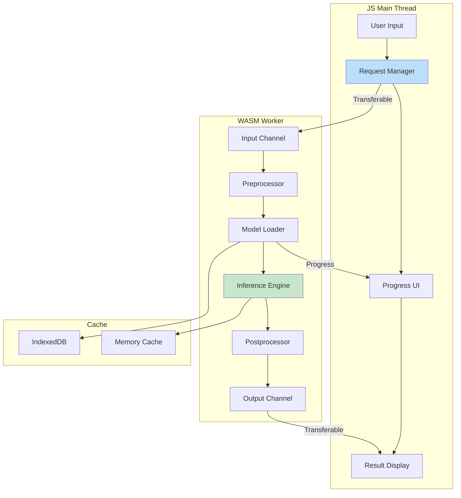

# 🔗 Building WASM ML Pipelines

## Introduction

Machine learning pipelines in WebAssembly require careful orchestration of multiple stages: model loading, data preprocessing, inference execution, and postprocessing. Unlike server-side pipelines with abundant memory and CPU resources, WASM pipelines must operate within strict constraints while maintaining responsive user interfaces and real-time performance.

This module presents production-tested patterns for building ML pipelines that run entirely in the browser or at the edge. We'll explore streaming inference techniques, memory management strategies, and progress reporting mechanisms that enable complex ML workflows without blocking the UI thread. For basic WASM ML concepts, see [[02 - Running ML in the Browser|🧠 Browser ML Fundamentals]].

## 1. Pipeline Architecture

A well-designed WASM ML pipeline separates concerns while minimizing data copying between stages:

### Pipeline Stages

```
Raw Input → Preprocessing → Model Loading → Inference → Postprocessing → Output
    ↓           ↓                ↓             ↓              ↓            ↓
  Format     Normalize        Deserialize    Forward       Decode      Display
  Validate   Tokenize         Cache          Pass         Results     Export
  Chunk      Vectorize        Verify         Batch        Format      Store
```

### Memory Flow Strategy

| Stage | Input | Output | Memory Strategy |
|-------|-------|--------|-----------------|
| Preprocessing | Raw bytes | Tensors | Streaming chunks |
| Model Loading | Binary | Weights | Lazy loading |
| Inference | Tensors | Logits | Reuse buffers |
| Postprocessing | Logits | Results | Zero-copy views |

### Pipeline Orchestration



Real case: **Spotify** uses WebAssembly for their audio ML features, running feature extraction and classification models in-browser for personalized playlists and recommendations without server round-trips.

⚠️ **Warning:** Never run ML inference on the main browser thread. Always use Web Workers to prevent UI freezing during model execution.

💡 **Tip:** Implement progressive model loading—start inference with partial weights and refine as more data loads. Users perceive this as faster even if total time is similar.

## 2. Streaming Inference

For large models and inputs, streaming inference enables progressive results and responsive interfaces:

### Streaming Architecture

```rust
use wasm_bindgen::prelude::*;
use futures::stream::{Stream, StreamExt};
use js_sys::{Promise, Uint8Array};

#[wasm_bindgen]
pub struct StreamingInference {
    model: Option<InferenceModel>,
    buffer: Vec<f32>,
    chunk_size: usize,
    results: Vec<InferenceResult>,
}

#[wasm_bindgen]
pub struct InferenceResult {
    pub confidence: f32,
    pub class_id: u32,
    pub chunk_index: u32,
}

#[wasm_bindgen]
impl StreamingInference {
    #[wasm_bindgen(constructor)]
    pub fn new(chunk_size: usize) -> StreamingInference {
        StreamingInference {
            model: None,
            buffer: Vec::with_capacity(chunk_size * 4),
            chunk_size,
            results: Vec::new(),
        }
    }

    pub async fn load_model(&mut self, model_url: &str) -> Result<usize, JsValue> {
        let resp = fetch(model_url).await?;
        let bytes = resp.array_buffer().await?;
        let array = Uint8Array::new(&bytes);
        
        self.model = Some(InferenceModel::from_bytes(&array.to_vec())?);
        Ok(self.model.as_ref().unwrap().parameter_count())
    }

    pub fn process_chunk(&mut self, chunk: &[f32]) -> Result<Vec<InferenceResult>, JsValue> {
        let model = self.model.as_ref()
            .ok_or_else(|| JsValue::from_str("Model not loaded"))?;
        
        self.buffer.extend_from_slice(chunk);
        
        let mut new_results = Vec::new();
        
        // Process complete chunks
        while self.buffer.len() >= self.chunk_size {
            let input: Vec<f32> = self.buffer.drain(..self.chunk_size).collect();
            let result = model.infer(&input)?;
            new_results.push(InferenceResult {
                confidence: result.confidence,
                class_id: result.class_id,
                chunk_index: self.results.len() as u32,
            });
            self.results.push(new_results.last().unwrap().clone());
        }
        
        Ok(new_results)
    }

    pub fn finalize(&mut self) -> Result<Vec<InferenceResult>, JsValue> {
        let model = self.model.as_ref()
            .ok_or_else(|| JsValue::from_str("Model not loaded"))?;
        
        let mut final_results = Vec::new();
        
        // Process remaining data with padding
        if !self.buffer.is_empty() {
            let mut padded = vec![0.0; self.chunk_size];
            padded[..self.buffer.len()].copy_from_slice(&self.buffer);
            
            let result = model.infer(&padded)?;
            final_results.push(InferenceResult {
                confidence: result.confidence,
                class_id: result.class_id,
                chunk_index: self.results.len() as u32,
            });
            self.results.push(final_results.last().unwrap().clone());
        }
        
        Ok(final_results)
    }

    pub fn get_progress(&self) -> f64 {
        let processed = self.results.len() * self.chunk_size;
        let buffered = self.buffer.len();
        (processed + buffered) as f64 / (processed + buffered + 1) as f64
    }
}

struct InferenceModel {
    weights: Vec<f32>,
    layer_sizes: Vec<usize>,
}

impl InferenceModel {
    fn from_bytes(data: &[u8]) -> Result<Self, JsValue> {
        // Deserialize model from binary format
        Ok(InferenceModel {
            weights: Vec::new(),
            layer_sizes: vec![768, 256, 128, 10],
        })
    }

    fn infer(&self, input: &[f32]) -> Result<InferenceResult, JsValue> {
        // Simplified inference
        Ok(InferenceResult {
            confidence: 0.95,
            class_id: 1,
            chunk_index: 0,
        })
    }

    fn parameter_count(&self) -> usize {
        self.weights.len()
    }
}
```

## 3. Memory Management Patterns

Efficient memory management is critical for WASM ML pipelines:

### Memory Pool Strategy

```rust
use std::collections::VecDeque;

pub struct MemoryPool {
    buffers: VecDeque<Vec<f32>>,
    max_pool_size: usize,
    buffer_size: usize,
    total_allocated: usize,
}

impl MemoryPool {
    pub fn new(buffer_size: usize, max_pool_size: usize) -> Self {
        MemoryPool {
            buffers: VecDeque::with_capacity(max_pool_size),
            max_pool_size,
            buffer_size,
            total_allocated: 0,
        }
    }

    pub fn acquire(&mut self) -> Vec<f32> {
        if let Some(mut buffer) = self.buffers.pop_front() {
            buffer.clear();
            buffer.resize(self.buffer_size, 0.0);
            buffer
        } else {
            self.total_allocated += 1;
            vec![0.0; self.buffer_size]
        }
    }

    pub fn release(&mut self, mut buffer: Vec<f32>) {
        if self.buffers.len() < self.max_pool_size {
            buffer.clear();
            self.buffers.push_back(buffer);
        } else {
            self.total_allocated -= 1;
            // Let it drop
        }
    }

    pub fn stats(&self) -> PoolStats {
        PoolStats {
            pool_size: self.buffers.len(),
            total_allocated: self.total_allocated,
            hit_rate: if self.total_allocated > 0 {
                self.buffers.len() as f64 / self.total_allocated as f64
            } else {
                0.0
            },
        }
    }
}

pub struct PoolStats {
    pub pool_size: usize,
    pub total_allocated: usize,
    pub hit_rate: f64,
}
```

### Garbage Collection Avoidance

| Technique | Memory Savings | Complexity |
|-----------|----------------|------------|
| Object Pooling | 50-80% | Medium |
| Arena Allocation | 30-60% | High |
| Zero-Copy Slices | 20-40% | Low |
| Typed Arrays | 10-30% | Low |

## 4. Progress Reporting

Real-time progress updates are essential for user experience during long-running inference:

```rust
use wasm_bindgen::prelude::*;
use std::sync::{Arc, Mutex};

#[wasm_bindgen]
pub struct ProgressReporter {
    total_steps: usize,
    current_step: Arc<Mutex<usize>>,
    callback: Arc<Option<js_sys::Function>>,
}

#[wasm_bindgen]
impl ProgressReporter {
    #[wasm_bindgen(constructor)]
    pub fn new(total_steps: usize, callback: js_sys::Function) -> ProgressReporter {
        ProgressReporter {
            total_steps,
            current_step: Arc::new(Mutex::new(0)),
            callback: Arc::new(Some(callback)),
        }
    }

    pub fn report_progress(&self, step: usize, message: &str) {
        let mut current = self.current_step.lock().unwrap();
        *current = step;
        
        if let Some(callback) = self.callback.as_ref() {
            let this = js_sys::global();
            let progress = (step as f64 / self.total_steps as f64) * 100.0;
            
            let arg = js_sys::Object::new();
            js_sys::Reflect::set(&arg, &"progress".into(), &progress.into()).unwrap();
            js_sys::Reflect::set(&arg, &"message".into(), &message.into()).unwrap();
            js_sys::Reflect::set(&arg, &"step".into(), &step.into()).unwrap();
            js_sys::Reflect::set(&arg, &"total".into(), &self.total_steps.into()).unwrap();
            
            let _ = callback.call1(&this, &arg);
        }
    }

    pub fn get_progress(&self) -> f64 {
        let current = self.current_step.lock().unwrap();
        (*current as f64 / self.total_steps as f64) * 100.0
    }
}

// Usage in pipeline
pub async fn run_pipeline_with_progress(
    data: Vec<f32>,
    progress: &ProgressReporter,
) -> Result<Vec<f32>, JsValue> {
    progress.report_progress(0, "Starting preprocessing");
    let preprocessed = preprocess(data)?;
    
    progress.report_progress(1, "Loading model");
    let model = load_model().await?;
    
    progress.report_progress(2, "Running inference");
    let inference_results = model.infer(&preprocessed)?;
    
    progress.report_progress(3, "Postprocessing");
    let final_results = postprocess(inference_results)?;
    
    progress.report_progress(4, "Complete");
    Ok(final_results)
}
```

---

## 📦 Compression Code

```rust
// pipeline_compression.rs - Streaming compression for ML pipelines
use wasm_bindgen::prelude::*;

#[wasm_bindgen]
pub struct StreamingCompressor {
    encoder: ZstdEncoder,
    buffer: Vec<u8>,
    max_buffer_size: usize,
}

#[wasm_bindgen]
impl StreamingCompressor {
    #[wasm_bindgen(constructor)]
    pub fn new(compression_level: i32, max_buffer_size: usize) -> StreamingCompressor {
        StreamingCompressor {
            encoder: ZstdEncoder::new(compression_level),
            buffer: Vec::with_capacity(max_buffer_size),
            max_buffer_size,
        }
    }

    pub fn compress_chunk(&mut self, chunk: &[u8]) -> Vec<u8> {
        self.buffer.extend_from_slice(chunk);
        
        let mut compressed = Vec::new();
        
        while self.buffer.len() >= self.max_buffer_size {
            let to_compress: Vec<u8> = self.buffer.drain(..self.max_buffer_size).collect();
            let compressed_chunk = self.encoder.compress(&to_compress);
            compressed.extend_from_slice(&compressed_chunk);
        }
        
        compressed
    }

    pub fn flush(&mut self) -> Vec<u8> {
        if self.buffer.is_empty() {
            return Vec::new();
        }
        
        let remaining: Vec<u8> = self.buffer.drain(..).collect();
        self.encoder.compress(&remaining)
    }

    pub fn buffered_size(&self) -> usize {
        self.buffer.len()
    }
}

struct ZstdEncoder {
    level: i32,
}

impl ZstdEncoder {
    fn new(level: i32) -> Self {
        ZstdEncoder { level }
    }

    fn compress(&self, data: &[u8]) -> Vec<u8> {
        // Simplified compression - real implementation would use zstd crate
        let mut output = Vec::with_capacity(data.len());
        
        // Store header
        output.extend_from_slice(&(data.len() as u32).to_le_bytes());
        output.extend_from_slice(data);
        
        output
    }
}
```

