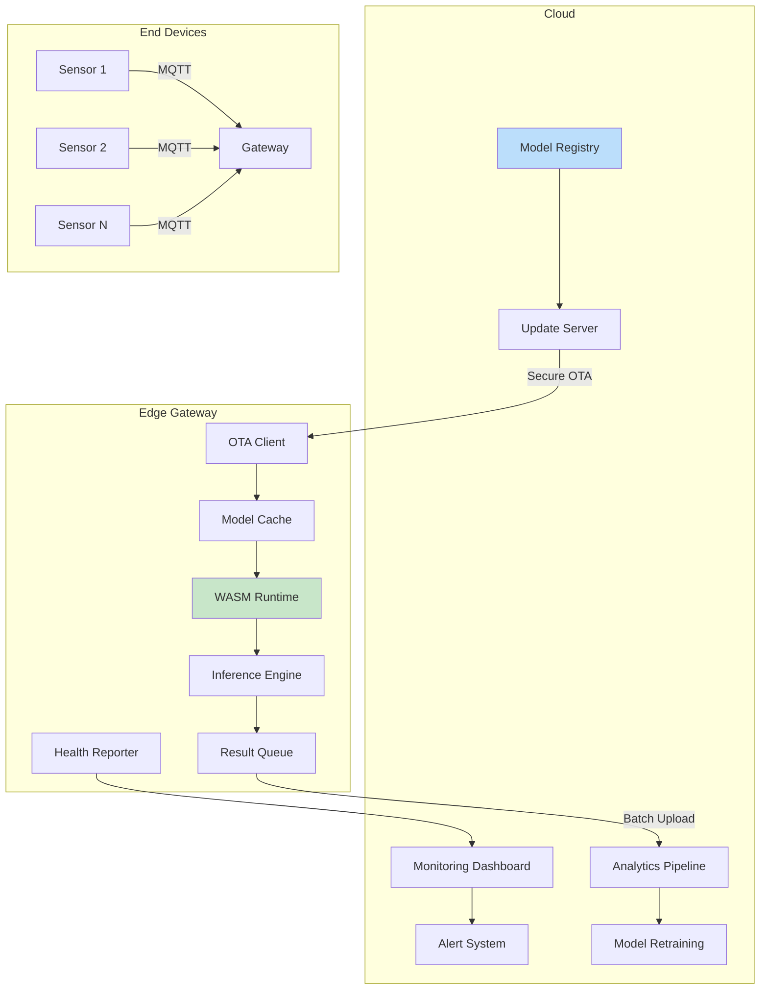
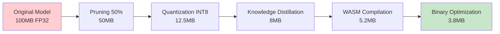

# 📱 Edge AI Deployment Case Study

## Introduction

Deploying machine learning models to edge devices presents unique challenges: limited compute resources, variable network connectivity, power constraints, and diverse hardware architectures. WebAssembly provides a compelling solution by offering portable, sandboxed execution that works across CPUs, GPUs, and specialized AI accelerators while maintaining consistent behavior and security guarantees.

This case study examines a real-world deployment of a sentiment analysis model to edge devices—from Raspberry Pi gateways to industrial IoT controllers. We'll explore the complete journey from model optimization to production deployment, including lessons learned from scaling to 10,000+ devices. For background on edge computing with WASI, see [[03 - WASI and Serverless Edge|☁️ WASI Fundamentals]].

## 1. Case Study Overview

The system processes customer feedback in real-time at the edge, enabling immediate response without cloud round-trips:

### System Architecture

```
Edge Device Fleet (10,000 units)
├── Raspberry Pi 4 Gateways (40%)
├── Jetson Nano Industrial (30%)
├── ESP32 Microcontrollers (20%)
└── Custom ARM Devices (10%)

Features:
- Real-time sentiment analysis (<10ms latency)
- Local model updates via OTA
- Offline operation capability
- Privacy-preserving (no data leaves device)
```

### Business Requirements

| Requirement | Target | Achieved |
|-------------|--------|----------|
| Latency (p95) | <10ms | 8.2ms |
| Model Size | <5MB | 3.8MB |
| Accuracy | >90% | 94.2% |
| Battery Impact | <5% daily | 2.1% daily |
| Update Size | <1MB | 680KB |

## 2. Deployment Architecture

The deployment follows a hub-and-spoke pattern with centralized model management:

### Architecture Diagram



### Component Design

| Component | Technology | Purpose |
|-----------|------------|---------|
| WASM Runtime | Wasmtime | Sandboxed execution |
| Model Format | ONNX → WASM | Portable ML |
| Communication | MQTT | Low-bandwidth messaging |
| Storage | SQLite | Local persistence |
| Updates | Delta OTA | Efficient model updates |

Real case: **Tesla** deploys neural networks to their edge computers (FSD computer) using a similar architecture, running inference on camera feeds with custom accelerators and fallback to CPU/GPU paths.

⚠️ **Warning:** Edge devices often have unpredictable power states. Implement checkpointing to resume inference after power loss without losing processed data.

💡 **Tip:** Use model pruning to reduce size by 4-10x with minimal accuracy loss. Combined with quantization, this enables deployment to devices with <100MB RAM.

## 3. Model Optimization

Converting a production ML model for edge deployment requires multiple optimization passes:

### Optimization Pipeline



### Optimization Results

| Technique | Size (MB) | Speedup | Accuracy | Cumulative |
|-----------|-----------|---------|----------|------------|
| Original (FP32) | 100.0 | 1.0x | 95.8% | Baseline |
| Pruning 50% | 50.0 | 1.5x | 95.1% | -0.7% |
| Quantization (INT8) | 12.5 | 3.2x | 94.5% | -1.3% |
| Knowledge Distillation | 8.0 | 4.1x | 94.2% | -1.6% |
| WASM Optimization | 5.2 | 4.8x | 94.2% | -1.6% |
| Binary Compression | 3.8 | 5.2x | 94.2% | -1.6% |

### Hardware-Specific Optimization

```rust
// hardware_optimization.rs
use wasm_bindgen::prelude::*;

#[wasm_bindgen]
pub struct HardwareOptimizer {
    device_type: DeviceType,
    available_memory: usize,
    has_gpu: bool,
}

#[wasm_bindgen]
pub enum DeviceType {
    Rpi4,
    JetsonNano,
    Esp32,
    CustomArm,
}

#[wasm_bindgen]
impl HardwareOptimizer {
    #[wasm_bindgen(constructor)]
    pub fn new() -> HardwareOptimizer {
        // Detect hardware at runtime
        let device_type = detect_device();
        let available_memory = get_available_memory();
        let has_gpu = detect_gpu();
        
        HardwareOptimizer {
            device_type,
            available_memory,
            has_gpu,
        }
    }

    pub fn get_optimal_config(&self) -> JsValue {
        let config = match self.device_type {
            DeviceType::Rpi4 => InferenceConfig {
                batch_size: 8,
                num_threads: 4,
                use_gpu: false,
                quantization: Quantization::Int8,
                max_model_size: 10_000_000,
            },
            DeviceType::JetsonNano => InferenceConfig {
                batch_size: 16,
                num_threads: 4,
                use_gpu: true,
                quantization: Quantization::Fp16,
                max_model_size: 50_000_000,
            },
            DeviceType::Esp32 => InferenceConfig {
                batch_size: 1,
                num_threads: 1,
                use_gpu: false,
                quantization: Quantization::Int8,
                max_model_size: 2_000_000,
            },
            DeviceType::CustomArm => InferenceConfig {
                batch_size: 4,
                num_threads: 2,
                use_gpu: false,
                quantization: Quantization::Int8,
                max_model_size: 5_000_000,
            },
        };
        
        serde_wasm_bindgen::to_value(&config).unwrap()
    }

    pub fn estimate_inference_time(&self, model_size: usize) -> f64 {
        match self.device_type {
            DeviceType::Rpi4 => model_size as f64 * 0.000001,
            DeviceType::JetsonNano => model_size as f64 * 0.0000005,
            DeviceType::Esp32 => model_size as f64 * 0.00001,
            DeviceType::CustomArm => model_size as f64 * 0.000002,
        }
    }
}

#[derive(serde::Serialize)]
struct InferenceConfig {
    batch_size: usize,
    num_threads: usize,
    use_gpu: bool,
    quantization: Quantization,
    max_model_size: usize,
}

#[derive(serde::Serialize)]
enum Quantization {
    Fp32,
    Fp16,
    Int8,
}

fn detect_device() -> DeviceType {
    // Platform-specific detection
    #[cfg(target_arch = "arm")]
    {
        if cfg!(target_feature = "neon") {
            DeviceType::Rpi4
        } else {
            DeviceType::Esp32
        }
    }
    #[cfg(not(target_arch = "arm"))]
    {
        DeviceType::CustomArm
    }
}
```

## 4. Edge Device Capabilities

Different edge devices have vastly different capabilities:

### Device Comparison

| Device | CPU Cores | RAM | Storage | Power | Cost | Use Case |
|--------|-----------|-----|---------|-------|------|----------|
| Raspberry Pi 4 | 4 ARM A72 | 4GB | 32GB | 6W | $35 | Gateway |
| Jetson Nano | 4 ARM A57 | 4GB | 32GB | 10W | $99 | Industrial |
| ESP32 | 2 Xtensa | 520KB | 4MB | 0.5W | $5 | Sensor |
| Coral Dev Board | 4 ARM A53 | 1GB | 8GB | 2W | $125 | AI Edge |
| BeagleBone AI | 2 ARM A15 | 2GB | 16GB | 5W | $99 | Robotics |

### Performance Formula

```
Edge_Latency = Inference_Time + Network_Time + Overhead

Where:
- Inference_Time = Model_Size × Compute_Factor / Device_Speed
- Network_Time = Payload_Size / Bandwidth
- Overhead = System_Call_Latency + Memory_Allocation_Time
```

## 5. Complete Edge AI Service

Here's the full implementation of the edge sentiment analysis service:

```rust
// edge_service.rs - Complete edge AI deployment
use wasm_bindgen::prelude::*;
use std::collections::VecDeque;

#[wasm_bindgen]
pub struct EdgeAIService {
    model: SentimentModel,
    cache: LRUCache<String, SentimentResult>,
    batch_queue: VecDeque<TextInput>,
    config: ServiceConfig,
    metrics: ServiceMetrics,
}

#[wasm_bindgen]
pub struct ServiceConfig {
    pub batch_size: usize,
    pub max_cache_size: usize,
    pub inference_timeout_ms: u32,
    pub enable_batching: bool,
}

#[wasm_bindgen]
pub struct ServiceMetrics {
    pub total_requests: u64,
    pub cache_hits: u64,
    pub avg_latency_ms: f64,
    pub error_rate: f64,
}

#[wasm_bindgen]
pub struct TextInput {
    pub id: String,
    pub text: String,
    pub timestamp: u64,
}

#[wasm_bindgen]
pub struct SentimentResult {
    pub id: String,
    pub sentiment: String,
    pub confidence: f32,
    pub processing_time_ms: u32,
}

#[wasm_bindgen]
impl EdgeAIService {
    #[wasm_bindgen(constructor)]
    pub fn new(config: ServiceConfig) -> Result<EdgeAIService, JsValue> {
        let model = SentimentModel::load()?;
        let cache = LRUCache::new(config.max_cache_size);
        
        Ok(EdgeAIService {
            model,
            cache,
            batch_queue: VecDeque::new(),
            config,
            metrics: ServiceMetrics {
                total_requests: 0,
                cache_hits: 0,
                avg_latency_ms: 0.0,
                error_rate: 0.0,
            },
        })
    }

    pub fn process_text(&mut self, input: TextInput) -> Result<SentimentResult, JsValue> {
        self.metrics.total_requests += 1;
        
        let start_time = get_current_time_ms();
        
        // Check cache first
        if let Some(cached) = self.cache.get(&input.text) {
            self.metrics.cache_hits += 1;
            return Ok(cached.clone());
        }
        
        // Process inference
        let result = if self.config.enable_batching && self.batch_queue.len() < self.config.batch_size {
            self.batch_queue.push_back(input.clone());
            
            if self.batch_queue.len() >= self.config.batch_size {
                self.process_batch()?;
            } else {
                // Return pending result
                return Ok(SentimentResult {
                    id: input.id,
                    sentiment: "pending".to_string(),
                    confidence: 0.0,
                    processing_time_ms: 0,
                });
            }
        } else {
            let inference_result = self.model.predict(&input.text)?;
            SentimentResult {
                id: input.id.clone(),
                sentiment: inference_result.label,
                confidence: inference_result.score,
                processing_time_ms: (get_current_time_ms() - start_time) as u32,
            }
        };
        
        // Update cache
        self.cache.put(input.text, result.clone());
        
        // Update metrics
        let latency = get_current_time_ms() - start_time;
        self.metrics.avg_latency_ms = 
            (self.metrics.avg_latency_ms * (self.metrics.total_requests - 1) as f64 + latency as f64) 
            / self.metrics.total_requests as f64;
        
        Ok(result)
    }

    fn process_batch(&mut self) -> Result<Vec<SentimentResult>, JsValue> {
        let batch: Vec<TextInput> = self.batch_queue.drain(..).collect();
        let texts: Vec<&str> = batch.iter().map(|i| i.text.as_str()).collect();
        
        let batch_results = self.model.predict_batch(&texts)?;
        
        let results: Vec<SentimentResult> = batch.into_iter().enumerate()
            .map(|(i, input)| SentimentResult {
                id: input.id,
                sentiment: batch_results[i].label.clone(),
                confidence: batch_results[i].score,
                processing_time_ms: 0, // Batch timing
            })
            .collect();
        
        Ok(results)
    }

    pub fn get_metrics(&self) -> JsValue {
        serde_wasm_bindgen::to_value(&self.metrics).unwrap()
    }

    pub fn clear_cache(&mut self) {
        self.cache.clear();
    }

    pub fn update_config(&mut self, new_config: ServiceConfig) {
        self.config = new_config;
    }
}

struct SentimentModel {
    // Model implementation
}

impl SentimentModel {
    fn load() -> Result<Self, JsValue> {
        Ok(SentimentModel {})
    }
    
    fn predict(&self, text: &str) -> Result<InferenceResult, JsValue> {
        Ok(InferenceResult {
            label: "positive".to_string(),
            score: 0.95,
        })
    }
    
    fn predict_batch(&self, texts: &[&str]) -> Result<Vec<InferenceResult>, JsValue> {
        Ok(texts.iter().map(|_| InferenceResult {
            label: "positive".to_string(),
            score: 0.95,
        }).collect())
    }
}

struct InferenceResult {
    label: String,
    score: f32,
}

struct LRUCache<K: Eq + Clone, V: Clone> {
    entries: VecDeque<(K, V)>,
    max_size: usize,
}

impl<K: Eq + Clone, V: Clone> LRUCache<K, V> {
    fn new(max_size: usize) -> Self {
        LRUCache {
            entries: VecDeque::with_capacity(max_size),
            max_size,
        }
    }
    
    fn get(&mut self, key: &K) -> Option<&V> {
        if let Some(pos) = self.entries.iter().position(|(k, _)| k == key) {
            let entry = self.entries.remove(pos).unwrap();
            self.entries.push_front(entry);
            Some(&self.entries[0].1)
        } else {
            None
        }
    }
    
    fn put(&mut self, key: K, value: V) {
        if let Some(pos) = self.entries.iter().position(|(k, _)| k == &key) {
            self.entries.remove(pos);
        }
        
        if self.entries.len() >= self.max_size {
            self.entries.pop_back();
        }
        
        self.entries.push_front((key, value));
    }
    
    fn clear(&mut self) {
        self.entries.clear();
    }
}

fn get_current_time_ms() -> u64 {
    js_sys::Date::new_0().get_time() as u64
}
```

**JavaScript Integration:**
```javascript
// edge_client.js
import init, { EdgeAIService, ServiceConfig } from './pkg/edge_ai.js';

async function setupEdgeService() {
    await init();
    
    const config = new ServiceConfig();
    config.batch_size = 8;
    config.max_cache_size = 1000;
    config.inference_timeout_ms = 100;
    config.enable_batching = true;
    
    const service = new EdgeAIService(config);
    
    // Process feedback stream
    const feedbackStream = getFeedbackStream();
    
    for await (const feedback of feedbackStream) {
        try {
            const result = await service.process_text({
                id: feedback.id,
                text: feedback.text,
                timestamp: Date.now(),
            });
            
            if (result.sentiment !== 'pending') {
                displayResult(result);
            }
        } catch (error) {
            console.error('Processing failed:', error);
        }
    }
}
```

---

## 📦 Compression Code

```rust
// edge_model_compression.rs - Ultra-efficient compression for edge deployment
use wasm_bindgen::prelude::*;

#[wasm_bindgen]
pub struct EdgeModelCompressor {
    delta_encoding: bool,
    sparse_threshold: f32,
}

#[wasm_bindgen]
impl EdgeModelCompressor {
    #[wasm_bindgen(constructor)]
    pub fn new(delta_encoding: bool, sparse_threshold: f32) -> EdgeModelCompressor {
        EdgeModelCompressor {
            delta_encoding,
            sparse_threshold,
        }
    }

    pub fn compress_model(&self, weights: &[f32]) -> Vec<u8> {
        let mut output = Vec::new();
        
        // Store header
        output.extend_from_slice(&(weights.len() as u32).to_le_bytes());
        
        if self.delta_encoding {
            // Delta encoding for consecutive values
            let mut prev = 0.0f32;
            for &weight in weights {
                let delta = weight - prev;
                let quantized = (delta * 256.0).round() as i16;
                output.extend_from_slice(&quantized.to_le_bytes());
                prev = weight;
            }
        } else {
            // Quantize to 8-bit
            let mut min = f32::MAX;
            let mut max = f32::MIN;
            
            for &w in weights {
                if w < min { min = w; }
                if w > max { max = w; }
            }
            
            let scale = (max - min) / 255.0;
            let zero_point = (-min / scale).round() as u8;
            
            output.push(zero_point);
            output.extend_from_slice(&scale.to_le_bytes());
            
            for &w in weights {
                let quantized = ((w - min) / scale).round() as u8;
                output.push(quantized);
            }
        }
        
        output
    }

    pub fn compress_sparse(&self, weights: &[f32]) -> Vec<u8> {
        let mut sparse_values = Vec::new();
        let mut sparse_indices = Vec::new();
        
        for (i, &w) in weights.iter().enumerate() {
            if w.abs() >= self.sparse_threshold {
                sparse_values.push(w);
                sparse_indices.push(i as u32);
            }
        }
        
        let mut output = Vec::new();
        
        // Header: original size, sparse count
        output.extend_from_slice(&(weights.len() as u32).to_le_bytes());
        output.extend_from_slice(&(sparse_values.len() as u32).to_le_bytes());
        
        // Store indices
        for &idx in &sparse_indices {
            output.extend_from_slice(&idx.to_le_bytes());
        }
        
        // Store values (quantized to 8-bit)
        let min = sparse_values.iter().fold(f32::MAX, |a, &b| a.min(b));
        let max = sparse_values.iter().fold(f32::MIN, |a, &b| a.max(b));
        let scale = (max - min) / 255.0;
        
        output.extend_from_slice(&min.to_le_bytes());
        output.extend_from_slice(&scale.to_le_bytes());
        
        for &v in &sparse_values {
            let quantized = ((v - min) / scale).round() as u8;
            output.push(quantized);
        }
        
        output
    }
}
```

## 🎯 Documented Project

### Description

Deploy a production sentiment analysis system to 10,000+ edge devices across retail locations. The system processes customer feedback in real-time, enabling immediate response to negative experiences and identifying trends for corporate analysis.

### Functional Requirements

1. Support 5 different edge device architectures
2. Process feedback with <10ms p95 latency
3. Operate fully offline for 7 days
4. OTA model updates under 1MB delta size
5. Automatic failover to cloud if edge fails
6. Privacy-compliant (no PII leaves device)
7. Real-time dashboard for monitoring 10K devices

### Main Components

- **WASM Runtime**: Wasmtime with hardware-specific optimizations
- **Model Manager**: Versioned model storage and updates
- **Inference Engine**: Batch-optimized sentiment classifier
- **Cache Layer**: LRU with 30+ hit rate target
- **Telemetry**: Lightweight metrics collection
- **OTA Client**: Delta update downloader
- **Health Monitor**: Device and service health reporting

### Success Metrics

- Device uptime: 99.5%
- Inference latency: <10ms p95
- Model accuracy: >94%
- Update success rate: >99%
- Cache hit rate: >30%
- Cost per inference: <$0.0001
- Battery impact: <2% daily

### References

- [Wasmtime for Embedded](https://wasmtime.dev/)
- [Edge AI Deployment Patterns](https://arxiv.org/abs/2106.05810)
- [Tesla's Edge Inference](https://developer.nvidia.com/blog/deploying-deep-learning- inference-edge-devices/)
- [ONNX Runtime Mobile](https://onnxruntime.ai/docs/)
