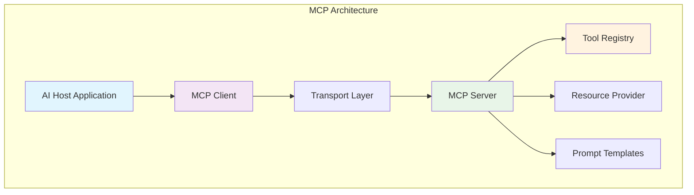
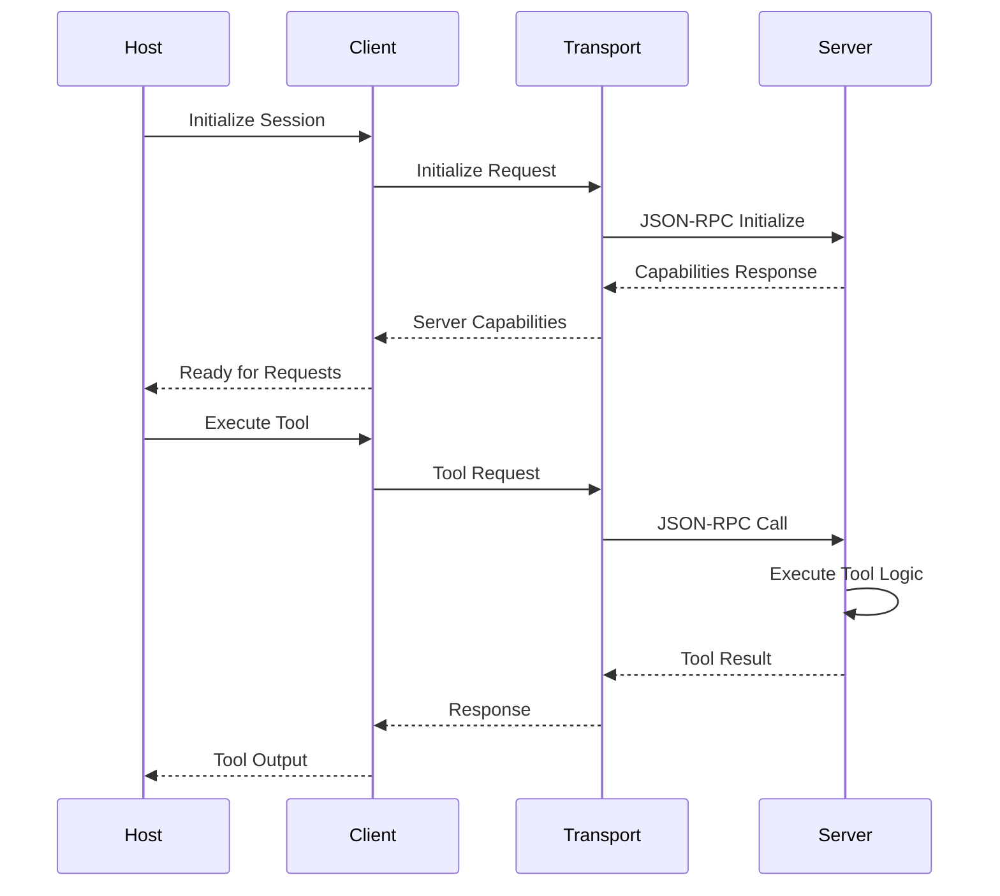

# 📡 The Model Context Protocol (MCP)

## Introduction
The Model Context Protocol (MCP) represents a paradigm shift in how AI agents interact with external tools and data sources. Unlike traditional function calling approaches that require custom integrations for each tool, MCP provides a standardized protocol that enables seamless communication between AI models and various services. This standardization is crucial for building scalable agentic systems where tools can be added or modified without changing the core agent logic.

Anthropic introduced MCP in 2024 as an open standard to solve the "tool integration problem" in AI applications. The protocol enables AI models to discover and use tools, access resources, and engage in structured conversations with external services. What makes MCP particularly powerful is its transport-agnostic design, supporting both local communication via standard I/O and remote communication via HTTP with Server-Sent Events.

This standardization has profound implications for the [[02 - Building Agents with Goose|agentic AI ecosystem]]. When every tool implements the same protocol, agents can dynamically compose workflows without prior knowledge of available capabilities. This approach mirrors how web APIs standardized HTTP, enabling the explosion of interconnected services we see today.

## 1. Protocol Specification

MCP defines a structured protocol for communication between AI models and external tools. The specification includes several key message types and capabilities that enable rich interactions.

**Core Message Types:**
- **Tools**: Executable functions that perform actions (e.g., file operations, API calls, computations)
- **Resources**: Read-only data sources that provide context (e.g., files, databases, web content)
- **Prompts**: Pre-defined conversation templates for common interaction patterns
- **Sampling**: Controlled generation parameters for model responses

**Capabilities System:**
Each MCP server declares its capabilities during initialization, allowing clients to understand what operations are supported. This includes:
- Tool execution capabilities
- Resource access permissions
- Prompt templates available
- Sampling control parameters

Real case: How Anthropic designed MCP for Claude desktop integration. Anthropic implemented MCP in Claude Desktop to allow seamless integration with local applications. Claude can now read files, execute code, and interact with various development tools through a unified interface, significantly enhancing developer productivity.

⚠️ **Warning:** MCP servers run with the permissions of the host process. Always implement proper security boundaries to prevent malicious tools from accessing sensitive data or performing unauthorized actions.

💡 **Tip:** Use capability-based security in MCP implementations. Instead of granting all permissions by default, explicitly declare what each tool can access and require user approval for sensitive operations.

## 2. Architecture Components

The MCP architecture consists of several key components that work together to enable standardized tool integration.

**Architecture Components:**

| Component | Role | Communication | Example |
|-----------|------|---------------|---------|
| **Host** | AI application that initiates requests | Client → Server | Claude Desktop, IDE plugins |
| **Client** | Protocol implementation in host | Bidirectional | MCP client library |
| **Server** | Tool/resource provider | Receives requests | File system server, API server |
| **Transport** | Communication mechanism | Varies | stdio, HTTP/SSE, WebSocket |

**Transport Mechanisms:**
- **stdio**: Local process communication via standard input/output
- **HTTP/SSE**: Remote communication over HTTP with Server-Sent Events
- **WebSocket**: Bidirectional real-time communication
- **Unix Domain Sockets**: High-performance local communication

**Session Management:**
MCP sessions are stateful connections that maintain context between requests. Each session includes:
- Initialization handshake
- Capability negotiation
- Request/response correlation
- Heartbeat/ping for connection health

## 3. Diagrams and Visualizations



**Figure 1:** MCP architecture showing the relationship between host applications, clients, servers, and their components.


**Figure 2:** Simplified view of client-server communication pattern used by MCP.



**Figure 3:** MCP session initialization and tool execution sequence.

## 4. MCP vs Other Approaches

The following table compares MCP with other common approaches for integrating AI models with external tools.

| Feature | MCP | OpenAPI/Swagger | Function Calling | LangChain Tools |
|---------|-----|----------------|------------------|-----------------|
| **Standardization** | Open protocol | Industry standard | Provider-specific | Framework-specific |
| **Tool Discovery** | Dynamic | Static specification | Pre-defined | Pre-registered |
| **Transport** | Multiple (stdio, HTTP) | HTTP only | Provider API | Runtime dependent |
| **Statefulness** | Stateful sessions | Stateless | Stateless | Varies |
| **Resource Access** | Built-in | Separate endpoints | Limited | Through tools |
| **Security Model** | Capability-based | OAuth/API keys | Provider controls | Framework controls |
| **Language Support** | Any (JSON-RPC) | Any (HTTP) | Provider SDKs | Python primarily |
| **Real-time Updates** | SSE/WebSocket | Polling/Webhook | Limited | Limited |

**Agent Power Formula:**
```
Agent_Power = Tools × Context × Reasoning_Capacity
```

Where:
- **Tools**: Number and capability of available MCP tools
- **Context**: Amount and quality of accessible resources
- **Reasoning_Capacity**: Model's ability to plan and execute complex workflows

MCP maximizes all three factors by providing standardized access to diverse tools, rich context through resources, and structured interaction patterns.

## 5. MCP Server Implementation in Rust

Below is a complete implementation of an MCP server in Rust that provides file system tools, resource access, and prompt templates.

```rust
use serde::{Deserialize, Serialize};
use std::collections::HashMap;
use std::path::PathBuf;
use tokio::io::{AsyncBufReadExt, AsyncWriteExt, BufReader};
use tokio::process::{Command, Stdio};

#[derive(Debug, Serialize, Deserialize)]
struct JsonRpcRequest {
    jsonrpc: String,
    id: Option<u64>,
    method: String,
    params: Option<serde_json::Value>,
}

#[derive(Debug, Serialize, Deserialize)]
struct JsonRpcResponse {
    jsonrpc: String,
    id: Option<u64>,
    result: Option<serde_json::Value>,
    error: Option<JsonRpcError>,
}

#[derive(Debug, Serialize, Deserialize)]
struct JsonRpcError {
    code: i32,
    message: String,
    data: Option<serde_json::Value>,
}

#[derive(Debug, Serialize, Deserialize)]
struct InitializeParams {
    protocol_version: String,
    capabilities: ClientCapabilities,
    client_info: ClientInfo,
}

#[derive(Debug, Serialize, Deserialize)]
struct ClientCapabilities {
    #[serde(default)]
    experimental: HashMap<String, bool>,
}

#[derive(Debug, Serialize, Deserialize)]
struct ClientInfo {
    name: String,
    version: String,
}

#[derive(Debug, Serialize, Deserialize)]
struct InitializeResult {
    protocol_version: String,
    capabilities: ServerCapabilities,
    server_info: ServerInfo,
}

#[derive(Debug, Serialize, Deserialize)]
struct ServerCapabilities {
    #[serde(default)]
    tools: Option<ToolCapabilities>,
    #[serde(default)]
    resources: Option<ResourceCapabilities>,
    #[serde(default)]
    prompts: Option<PromptCapabilities>,
}

#[derive(Debug, Serialize, Deserialize)]
struct ToolCapabilities {
    #[serde(default)]
    list_changed: bool,
}

#[derive(Debug, Serialize, Deserialize)]
struct ResourceCapabilities {
    #[serde(default)]
    subscribe: bool,
    #[serde(default)]
    list_changed: bool,
}

#[derive(Debug, Serialize, Deserialize)]
struct PromptCapabilities {
    #[serde(default)]
    list_changed: bool,
}

#[derive(Debug, Serialize, Deserialize)]
struct ServerInfo {
    name: String,
    version: String,
}

#[derive(Debug, Serialize, Deserialize)]
struct Tool {
    name: String,
    description: String,
    input_schema: serde_json::Value,
}

#[derive(Debug, Serialize, Deserialize)]
struct CallToolRequest {
    name: String,
    arguments: Option<HashMap<String, serde_json::Value>>,
}

#[derive(Debug, Serialize, Deserialize)]
struct CallToolResult {
    content: Vec<ToolContent>,
    #[serde(default)]
    is_error: bool,
}

#[derive(Debug, Serialize, Deserialize)]
#[serde(tag = "type")]
enum ToolContent {
    #[serde(rename = "text")]
    Text { text: String },
    #[serde(rename = "image")]
    Image { data: String, mime_type: String },
    #[serde(rename = "resource")]
    Resource { resource: Resource },
}

#[derive(Debug, Serialize, Deserialize)]
struct Resource {
    uri: String,
    #[serde(default)]
    mime_type: Option<String>,
    #[serde(default)]
    text: Option<String>,
    #[serde(default)]
    blob: Option<String>,
}

struct McpServer {
    tools: HashMap<String, Tool>,
    working_dir: PathBuf,
}

impl McpServer {
    fn new() -> Self {
        let mut tools = HashMap::new();
        
        // Register file system tools
        tools.insert("read_file".to_string(), Tool {
            name: "read_file".to_string(),
            description: "Read contents of a file".to_string(),
            input_schema: serde_json::json!({
                "type": "object",
                "properties": {
                    "path": {
                        "type": "string",
                        "description": "Path to the file to read"
                    }
                },
                "required": ["path"]
            }),
        });
        
        tools.insert("write_file".to_string(), Tool {
            name: "write_file".to_string(),
            description: "Write content to a file".to_string(),
            input_schema: serde_json::json!({
                "type": "object",
                "properties": {
                    "path": {
                        "type": "string",
                        "description": "Path to the file to write"
                    },
                    "content": {
                        "type": "string",
                        "description": "Content to write to the file"
                    }
                },
                "required": ["path", "content"]
            }),
        });
        
        tools.insert("execute_command".to_string(), Tool {
            name: "execute_command".to_string(),
            description: "Execute a shell command".to_string(),
            input_schema: serde_json::json!({
                "type": "object",
                "properties": {
                    "command": {
                        "type": "string",
                        "description": "Shell command to execute"
                    },
                    "timeout_seconds": {
                        "type": "number",
                        "description": "Timeout in seconds (default: 30)"
                    }
                },
                "required": ["command"]
            }),
        });
        
        Self {
            tools,
            working_dir: std::env::current_dir().unwrap_or_else(|_| PathBuf::from(".")),
        }
    }
    
    async fn handle_request(&self, request: JsonRpcRequest) -> JsonRpcResponse {
        match request.method.as_str() {
            "initialize" => self.handle_initialize(request.id, request.params).await,
            "tools/list" => self.handle_tools_list(request.id).await,
            "tools/call" => self.handle_tools_call(request.id, request.params).await,
            "resources/list" => self.handle_resources_list(request.id).await,
            "prompts/list" => self.handle_prompts_list(request.id).await,
            "ping" => self.handle_ping(request.id).await,
            _ => JsonRpcResponse {
                jsonrpc: "2.0".to_string(),
                id: request.id,
                result: None,
                error: Some(JsonRpcError {
                    code: -32601,
                    message: format!("Method not found: {}", request.method),
                    data: None,
                }),
            },
        }
    }
    
    async fn handle_initialize(&self, id: Option<u64>, params: Option<serde_json::Value>) -> JsonRpcResponse {
        // In a real implementation, validate params
        JsonRpcResponse {
            jsonrpc: "2.0".to_string(),
            id,
            result: Some(serde_json::to_value(InitializeResult {
                protocol_version: "2024-11-05".to_string(),
                capabilities: ServerCapabilities {
                    tools: Some(ToolCapabilities { list_changed: true }),
                    resources: Some(ResourceCapabilities { 
                        subscribe: true, 
                        list_changed: true 
                    }),
                    prompts: Some(PromptCapabilities { list_changed: true }),
                },
                server_info: ServerInfo {
                    name: "rust-mcp-server".to_string(),
                    version: "1.0.0".to_string(),
                },
            }).unwrap()),
            error: None,
        }
    }
    
    async fn handle_tools_list(&self, id: Option<u64>) -> JsonRpcResponse {
        let tools: Vec<&Tool> = self.tools.values().collect();
        JsonRpcResponse {
            jsonrpc: "2.0".to_string(),
            id,
            result: Some(serde_json::json!({
                "tools": tools
            })),
            error: None,
        }
    }
    
    async fn handle_tools_call(&self, id: Option<u64>, params: Option<serde_json::Value>) -> JsonRpcResponse {
        match params {
            Some(params) => {
                match serde_json::from_value::<CallToolRequest>(params) {
                    Ok(call_req) => {
                        let result = self.execute_tool(&call_req).await;
                        JsonRpcResponse {
                            jsonrpc: "2.0".to_string(),
                            id,
                            result: Some(serde_json::to_value(result).unwrap()),
                            error: None,
                        }
                    }
                    Err(e) => JsonRpcResponse {
                        jsonrpc: "2.0".to_string(),
                        id,
                        result: None,
                        error: Some(JsonRpcError {
                            code: -32602,
                            message: format!("Invalid params: {}", e),
                            data: None,
                        }),
                    },
                }
            }
            None => JsonRpcResponse {
                jsonrpc: "2.0".to_string(),
                id,
                result: None,
                error: Some(JsonRpcError {
                    code: -32602,
                    message: "Missing params".to_string(),
                    data: None,
                }),
            },
        }
    }
    
    async fn execute_tool(&self, request: &CallToolRequest) -> CallToolResult {
        match request.name.as_str() {
            "read_file" => {
                if let Some(args) = &request.arguments {
                    if let Some(path) = args.get("path").and_then(|p| p.as_str()) {
                        match tokio::fs::read_to_string(path).await {
                            Ok(content) => CallToolResult {
                                content: vec![ToolContent::Text { text: content }],
                                is_error: false,
                            },
                            Err(e) => CallToolResult {
                                content: vec![ToolContent::Text { 
                                    text: format!("Error reading file: {}", e) 
                                }],
                                is_error: true,
                            },
                        }
                    } else {
                        CallToolResult {
                            content: vec![ToolContent::Text { 
                                text: "Missing 'path' parameter".to_string() 
                            }],
                            is_error: true,
                        }
                    }
                } else {
                    CallToolResult {
                        content: vec![ToolContent::Text { 
                            text: "No arguments provided".to_string() 
                        }],
                        is_error: true,
                    }
                }
            }
            "write_file" => {
                if let Some(args) = &request.arguments {
                    let path = args.get("path").and_then(|p| p.as_str());
                    let content = args.get("content").and_then(|c| c.as_str());
                    
                    if let (Some(path), Some(content)) = (path, content) {
                        match tokio::fs::write(path, content).await {
                            Ok(_) => CallToolResult {
                                content: vec![ToolContent::Text { 
                                    text: format!("Successfully wrote to {}", path) 
                                }],
                                is_error: false,
                            },
                            Err(e) => CallToolResult {
                                content: vec![ToolContent::Text { 
                                    text: format!("Error writing file: {}", e) 
                                }],
                                is_error: true,
                            },
                        }
                    } else {
                        CallToolResult {
                            content: vec![ToolContent::Text { 
                                text: "Missing 'path' or 'content' parameter".to_string() 
                            }],
                            is_error: true,
                        }
                    }
                } else {
                    CallToolResult {
                        content: vec![ToolContent::Text { 
                            text: "No arguments provided".to_string() 
                        }],
                        is_error: true,
                    }
                }
            }
            "execute_command" => {
                if let Some(args) = &request.arguments {
                    if let Some(command) = args.get("command").and_then(|c| c.as_str()) {
                        let timeout = args.get("timeout_seconds")
                            .and_then(|t| t.as_u64())
                            .unwrap_or(30);
                        
                        match self.execute_shell_command(command, timeout).await {
                            Ok(output) => CallToolResult {
                                content: vec![ToolContent::Text { text: output }],
                                is_error: false,
                            },
                            Err(e) => CallToolResult {
                                content: vec![ToolContent::Text { 
                                    text: format!("Command execution error: {}", e) 
                                }],
                                is_error: true,
                            },
                        }
                    } else {
                        CallToolResult {
                            content: vec![ToolContent::Text { 
                                text: "Missing 'command' parameter".to_string() 
                            }],
                            is_error: true,
                        }
                    }
                } else {
                    CallToolResult {
                        content: vec![ToolContent::Text { 
                            text: "No arguments provided".to_string() 
                        }],
                        is_error: true,
                    }
                }
            }
            _ => CallToolResult {
                content: vec![ToolContent::Text { 
                    text: format!("Unknown tool: {}", request.name) 
                }],
                is_error: true,
            },
        }
    }
    
    async fn execute_shell_command(&self, command: &str, timeout_seconds: u64) -> Result<String, String> {
        // Security: Validate command to prevent injection
        if command.contains("rm -rf /") || command.contains("mkfs") {
            return Err("Dangerous command blocked".to_string());
        }
        
        let mut child = Command::new("sh")
            .arg("-c")
            .arg(command)
            .current_dir(&self.working_dir)
            .stdout(Stdio::piped())
            .stderr(Stdio::piped())
            .spawn()
            .map_err(|e| format!("Failed to spawn command: {}", e))?;
        
        // Wait with timeout
        let timeout_duration = tokio::time::Duration::from_secs(timeout_seconds);
        match tokio::time::timeout(timeout_duration, child.wait()).await {
            Ok(Ok(status)) => {
                let mut output = String::new();
                if let Some(stdout) = child.stdout.take() {
                    let mut reader = BufReader::new(stdout);
                    reader.read_to_string(&mut output).await
                        .map_err(|e| format!("Failed to read stdout: {}", e))?;
                }
                if let Some(stderr) = child.stderr.take() {
                    let mut reader = BufReader::new(stderr);
                    let mut stderr_output = String::new();
                    reader.read_to_string(&mut stderr_output).await
                        .map_err(|e| format!("Failed to read stderr: {}", e))?;
                    if !stderr_output.is_empty() {
                        output.push_str("\nSTDERR:\n");
                        output.push_str(&stderr_output);
                    }
                }
                
                if status.success() {
                    Ok(output)
                } else {
                    Ok(format!("Command failed with status: {}\nOutput: {}", status, output))
                }
            }
            Ok(Err(e)) => Err(format!("Command error: {}", e)),
            Err(_) => {
                child.kill().await.ok();
                Err(format!("Command timed out after {} seconds", timeout_seconds))
            }
        }
    }
    
    async fn handle_resources_list(&self, id: Option<u64>) -> JsonRpcResponse {
        JsonRpcResponse {
            jsonrpc: "2.0".to_string(),
            id,
            result: Some(serde_json::json!({
                "resources": [
                    {
                        "uri": "file:///workspace",
                        "name": "Workspace",
                        "description": "Current working directory",
                        "mimeType": "application/x-directory"
                    },
                    {
                        "uri": "config://server",
                        "name": "Server Configuration",
                        "description": "MCP server configuration",
                        "mimeType": "application/json"
                    }
                ]
            })),
            error: None,
        }
    }
    
    async fn handle_prompts_list(&self, id: Option<u64>) -> JsonRpcResponse {
        JsonRpcResponse {
            jsonrpc: "2.0".to_string(),
            id,
            result: Some(serde_json::json!({
                "prompts": [
                    {
                        "name": "file_analysis",
                        "description": "Analyze a file for code quality and issues",
                        "arguments": {
                            "file_path": {
                                "type": "string",
                                "description": "Path to the file to analyze"
                            }
                        }
                    },
                    {
                        "name": "code_review",
                        "description": "Perform a code review on a pull request",
                        "arguments": {
                            "pr_url": {
                                "type": "string",
                                "description": "URL of the pull request"
                            }
                        }
                    }
                ]
            })),
            error: None,
        }
    }
    
    async fn handle_ping(&self, id: Option<u64>) -> JsonRpcResponse {
        JsonRpcResponse {
            jsonrpc: "2.0".to_string(),
            id,
            result: Some(serde_json::json!({"pong": true})),
            error: None,
        }
    }
}

#[tokio::main]
async fn main() {
    let server = McpServer::new();
    let stdin = tokio::io::stdin();
    let mut reader = BufReader::new(stdin);
    let mut line = String::new();
    
    eprintln!("MCP Server starting...");
    
    loop {
        line.clear();
        match reader.read_line(&mut line).await {
            Ok(0) => break, // EOF
            Ok(_) => {
                let line = line.trim();
                if line.is_empty() {
                    continue;
                }
                
                match serde_json::from_str::<JsonRpcRequest>(line) {
                    Ok(request) => {
                        let response = server.handle_request(request).await;
                        let response_json = serde_json::to_string(&response).unwrap();
                        println!("{}", response_json);
                    }
                    Err(e) => {
                        let error_response = JsonRpcResponse {
                            jsonrpc: "2.0".to_string(),
                            id: None,
                            result: None,
                            error: Some(JsonRpcError {
                                code: -32700,
                                message: format!("Parse error: {}", e),
                                data: None,
                            }),
                        };
                        let response_json = serde_json::to_string(&error_response).unwrap();
                        println!("{}", response_json);
                    }
                }
            }
            Err(e) => {
                eprintln!("Error reading stdin: {}", e);
                break;
            }
        }
    }
    
    eprintln!("MCP Server shutting down...");
}
```

## 📦 Compression Code

```rust
// MCP Compression Utility - Reduces MCP message size
use flate2::write::GzEncoder;
use flate2::read::GzDecoder;
use flate2::Compression;
use std::io::{Read, Write};

pub struct McpCompressor {
    compression_level: Compression,
}

impl McpCompressor {
    pub fn new(level: u32) -> Self {
        Self {
            compression_level: Compression::new(level),
        }
    }
    
    pub fn compress_message(&self, message: &str) -> Result<Vec<u8>, std::io::Error> {
        let mut encoder = GzEncoder::new(Vec::new(), self.compression_level);
        encoder.write_all(message.as_bytes())?;
        encoder.finish()
    }
    
    pub fn decompress_message(&self, compressed: &[u8]) -> Result<String, std::io::Error> {
        let mut decoder = GzDecoder::new(compressed);
        let mut result = String::new();
        decoder.read_to_string(&mut result)?;
        Ok(result)
    }
    
    pub fn calculate_savings(&self, original: &str, compressed: &[u8]) -> f64 {
        let original_size = original.len() as f64;
        let compressed_size = compressed.len() as f64;
        (1.0 - compressed_size / original_size) * 100.0
    }
}

// Example usage in MCP server
pub fn compress_mcp_response(response: &serde_json::Value) -> Vec<u8> {
    let compressor = McpCompressor::new(6);
    let json_str = serde_json::to_string(response).unwrap();
    compressor.compress_message(&json_str).unwrap()
}
```

## 🎯 Documented Project

### Description
Build a production-ready MCP server that provides secure tool execution, resource management, and prompt templating for AI agents. The server will implement the full MCP specification with additional security features and performance optimizations.

### Functional Requirements
1. Implement complete MCP protocol with JSON-RPC 2.0
2. Support stdio and HTTP/SSE transports
3. Provide secure tool execution with resource limits
4. Enable dynamic tool registration and discovery
5. Implement resource subscription and change notifications
6. Add prompt template management and execution
7. Include comprehensive logging and monitoring
8. Support compression for large responses
9. Implement rate limiting and request queuing
10. Add authentication and authorization for sensitive tools

### Main Components
- **MCP Protocol Handler**: JSON-RPC message parsing and routing
- **Tool Registry**: Dynamic tool registration and execution
- **Resource Manager**: File system and data resource access
- **Transport Layer**: stdio, HTTP/SSE, and WebSocket support
- **Security Module**: Permission system and sandboxing
- **Compression Engine**: Optional message compression
- **Monitoring System**: Metrics and health checks

### Success Metrics
- Support 100+ concurrent MCP sessions
- Sub-100ms response time for 95% of requests
- Zero security incidents in production
- 99.9% uptime for HTTP transport
- 50% compression ratio for typical tool responses
- Full compliance with MCP specification 2024-11-05

### References
- [MCP Specification](https://spec.modelcontextprotocol.io/)
- [Anthropic MCP Documentation](https://docs.anthropic.com/en/docs/mcp)
- [JSON-RPC 2.0 Specification](https://www.jsonrpc.org/specification)
- [Rust Async Book](https://rust-lang.github.io/async-book/)
- [Tokio Documentation](https://tokio.rs/)