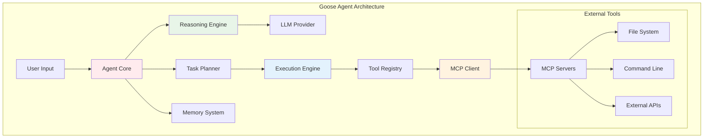
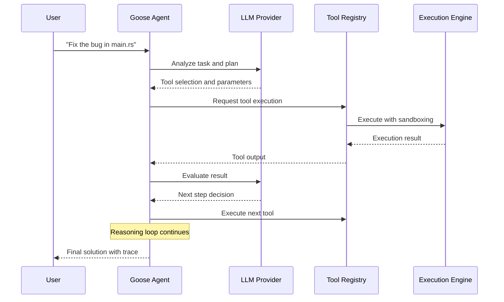

# 🪿 Building Agents with Goose

## Introduction
Goose represents a groundbreaking approach to building AI agents, combining the performance and safety of Rust with a modular architecture that emphasizes extensibility and security. Developed by Block (formerly Square), Goose is an open-source agent framework designed to enhance developer productivity by automating complex software engineering tasks. Unlike monolithic agent systems, Goose provides a composable architecture where tools, LLM providers, and execution contexts can be mixed and matched.

The framework's Rust core provides memory safety and concurrency guarantees that are essential for long-running agent sessions. This architectural choice enables Goose to manage multiple concurrent tool executions, handle complex state transitions, and recover gracefully from failures. The integration with [[01 - The Model Context Protocol (MCP)|MCP]] allows Goose to dynamically discover and use tools from any MCP-compliant server.

What sets Goose apart is its focus on real-world developer workflows. Rather than attempting general-purpose automation, Goose excels at software development tasks like code analysis, refactoring, testing, and deployment. This specialization allows for deeper integrations with development tools and more reliable outcomes in technical domains.

## 1. Goose Architecture

Goose's architecture is built around several key components that work together to create a flexible and powerful agent framework.

**Core Components:**

| Component | Responsibility | Technology | Purpose |
|-----------|----------------|------------|---------|
| **Agent Core** | Orchestration and reasoning | Rust | Main execution loop and decision making |
| **Tool Registry** | Tool discovery and management | Rust | Dynamic tool registration and validation |
| **LLM Abstraction** | Model provider interface | Rust | Unified API for different LLM providers |
| **Execution Engine** | Safe command execution | Rust | Sandboxed tool and command execution |
| **Memory System** | State and context management | Rust/SQLite | Conversation history and working memory |
| **MCP Client** | Protocol communication | Rust | Tool integration via MCP |

**Execution Flow:**
1. User provides task description
2. Agent analyzes task and selects appropriate tools
3. Execution engine runs tools in sandboxed environment
4. Results are processed and fed back to reasoning loop
5. Agent adapts plan based on intermediate results
6. Final output is delivered with complete trace

Real case: How Block uses Goose for developer productivity. Block integrated Goose into their development workflow to automate code reviews, dependency updates, and test generation. The system reportedly reduced time spent on repetitive tasks by 40% while improving code quality through consistent application of best practices.

⚠️ **Warning:** Goose agents can execute arbitrary code on the host system. Always run agents in isolated environments (containers, VMs) when working with untrusted code or external data sources.

💡 **Tip:** Use Goose's tool composition feature to build complex workflows. Instead of trying to accomplish everything in one tool call, chain multiple specialized tools together for better reliability and observability.

## 2. MCP Integration

Goose leverages MCP for tool integration, enabling seamless communication with external services and tools. This integration provides several key advantages.

**MCP Integration Features:**

| Feature | Implementation | Benefit | Example |
|---------|----------------|---------|---------|
| **Dynamic Discovery** | MCP tools/list | Add tools without restart | New file system tool |
| **Standardized Interface** | JSON-RPC protocol | Consistent tool calls | Same API for all tools |
| **Resource Access** | MCP resources/list | Read-only data sources | Configuration files |
| **Prompt Templates** | MCP prompts/list | Pre-defined workflows | Code review template |
| **Transport Flexibility** | Multiple transports | Local and remote tools | stdio for local, HTTP for remote |

**Tool Registration Process:**
1. Goose discovers MCP server via configuration
2. Client establishes connection and negotiates capabilities
3. Tools are loaded into registry with schema validation
4. Agent can use tools through unified interface
5. Results are formatted consistently regardless of source

The MCP integration allows Goose to extend its capabilities dynamically. Developers can add new tools by simply running an MCP server, without modifying Goose's core code.

## 3. Agent Architecture Diagrams



**Figure 1:** Goose agent architecture showing the interaction between core components and external tools.


**Figure 2:** Goose - the open source agent framework by Block.



**Figure 3:** Goose execution flow showing the reasoning loop between user, agent, LLM, and tools.

## 4. Comparison with Other Frameworks

Goose competes with several other AI agent frameworks, each with different philosophies and capabilities.

| Feature | Goose | AutoGPT | CrewAI | LangGraph |
|---------|-------|---------|--------|-----------|
| **Primary Language** | Rust | Python | Python | Python |
| **Architecture** | Modular, MCP-based | Autonomous loop | Role-based teams | State machines |
| **Tool Integration** | MCP standard | Custom plugins | Custom tools | Custom tools |
| **Execution Safety** | Sandboxing built-in | Limited | Limited | Limited |
| **State Management** | Memory system | Short-term | Shared memory | Graph state |
| **Performance** | High (Rust) | Medium | Medium | Medium |
| **Extensibility** | MCP servers | Python plugins | Python tools | Python nodes |
| **Production Ready** | Yes | Experimental | Experimental | Experimental |
| **Community** | Block + Open Source | Large community | Growing | LangChain ecosystem |

**Agent Capability Formula:**
```
Goose_Agent_Capability = Tool_Count × Safety_Features × Reasoning_Depth
```

Where:
- **Tool_Count**: Number of MCP tools available to the agent
- **Safety_Features**: Sandboxing, permission systems, and error handling
- **Reasoning_Depth**: Complexity of planning and adaptation algorithms

## 5. Goose Agent Setup and Tool Registration

Here's a complete implementation of a Goose-like agent in Rust with tool registration and MCP integration.

```rust
use async_trait::async_trait;
use serde::{Deserialize, Serialize};
use std::collections::HashMap;
use tokio::sync::RwLock;
use std::sync::Arc;

#[derive(Debug, Clone, Serialize, Deserialize)]
pub struct AgentConfig {
    pub name: String,
    pub model: String,
    pub temperature: f32,
    pub max_tokens: u32,
    pub sandbox_enabled: bool,
    pub mcp_servers: Vec<McpServerConfig>,
}

#[derive(Debug, Clone, Serialize, Deserialize)]
pub struct McpServerConfig {
    pub name: String,
    pub transport: String, // "stdio", "http", "websocket"
    pub command: Option<String>,
    pub url: Option<String>,
    pub args: Vec<String>,
    pub env: HashMap<String, String>,
}

#[derive(Debug, Clone, Serialize, Deserialize)]
pub struct ToolDefinition {
    pub name: String,
    pub description: String,
    pub parameters: serde_json::Value,
    pub return_type: String,
    pub sandbox_required: bool,
    pub timeout_seconds: u64,
}

#[derive(Debug, Clone, Serialize, Deserialize)]
pub struct ToolResult {
    pub success: bool,
    pub output: String,
    pub error: Option<String>,
    pub execution_time_ms: u64,
    pub metadata: HashMap<String, String>,
}

#[async_trait]
pub trait Tool: Send + Sync {
    fn name(&self) -> &str;
    fn description(&self) -> &str;
    fn parameters(&self) -> serde_json::Value;
    async fn execute(&self, params: HashMap<String, serde_json::Value>) -> Result<ToolResult, String>;
    fn sandbox_required(&self) -> bool { false }
    fn timeout_seconds(&self) -> u64 { 30 }
}

pub struct ToolRegistry {
    tools: RwLock<HashMap<String, Arc<dyn Tool>>>,
    mcp_clients: RwLock<HashMap<String, McpClient>>,
}

impl ToolRegistry {
    pub fn new() -> Self {
        Self {
            tools: RwLock::new(HashMap::new()),
            mcp_clients: RwLock::new(HashMap::new()),
        }
    }
    
    pub async fn register_tool(&self, tool: Arc<dyn Tool>) {
        let name = tool.name().to_string();
        self.tools.write().await.insert(name, tool);
    }
    
    pub async fn register_mcp_server(&self, config: &McpServerConfig) -> Result<(), String> {
        let client = McpClient::new(config.clone()).await?;
        let tools = client.list_tools().await?;
        
        let mut clients = self.mcp_clients.write().await;
        clients.insert(config.name.clone(), client);
        
        // Register tools from MCP server
        let mut tools_guard = self.tools.write().await;
        for tool_def in tools {
            let mcp_tool = McpTool::new(config.name.clone(), tool_def);
            tools_guard.insert(mcp_tool.name().to_string(), Arc::new(mcp_tool));
        }
        
        Ok(())
    }
    
    pub async fn list_tools(&self) -> Vec<ToolDefinition> {
        let tools = self.tools.read().await;
        tools.values().map(|tool| ToolDefinition {
            name: tool.name().to_string(),
            description: tool.description().to_string(),
            parameters: tool.parameters(),
            return_type: "string".to_string(),
            sandbox_required: tool.sandbox_required(),
            timeout_seconds: tool.timeout_seconds(),
        }).collect()
    }
    
    pub async fn execute_tool(&self, name: &str, params: HashMap<String, serde_json::Value>) -> Result<ToolResult, String> {
        let tools = self.tools.read().await;
        if let Some(tool) = tools.get(name) {
            let start = std::time::Instant::now();
            let result = tool.execute(params).await;
            let elapsed = start.elapsed().as_millis() as u64;
            
            match result {
                Ok(mut tool_result) => {
                    tool_result.execution_time_ms = elapsed;
                    Ok(tool_result)
                }
                Err(e) => Ok(ToolResult {
                    success: false,
                    output: String::new(),
                    error: Some(e),
                    execution_time_ms: elapsed,
                    metadata: HashMap::new(),
                }),
            }
        } else {
            Err(format!("Tool not found: {}", name))
        }
    }
}

struct McpClient {
    config: McpServerConfig,
    // In real implementation, this would hold the MCP connection
}

impl McpClient {
    async fn new(config: McpServerConfig) -> Result<Self, String> {
        // Initialize MCP connection
        Ok(Self { config })
    }
    
    async fn list_tools(&self) -> Result<Vec<ToolDefinition>, String> {
        // Request tools from MCP server
        Ok(vec![])
    }
    
    async fn call_tool(&self, name: &str, params: HashMap<String, serde_json::Value>) -> Result<ToolResult, String> {
        // Call tool on MCP server
        Ok(ToolResult {
            success: true,
            output: "MCP tool execution result".to_string(),
            error: None,
            execution_time_ms: 0,
            metadata: HashMap::new(),
        })
    }
}

struct McpTool {
    server_name: String,
    definition: ToolDefinition,
}

impl McpTool {
    fn new(server_name: String, definition: ToolDefinition) -> Self {
        Self { server_name, definition }
    }
}

#[async_trait]
impl Tool for McpTool {
    fn name(&self) -> &str {
        &self.definition.name
    }
    
    fn description(&self) -> &str {
        &self.definition.description
    }
    
    fn parameters(&self) -> serde_json::Value {
        self.definition.parameters.clone()
    }
    
    async fn execute(&self, params: HashMap<String, serde_json::Value>) -> Result<ToolResult, String> {
        // In real implementation, this would call the MCP server
        Ok(ToolResult {
            success: true,
            output: format!("MCP tool {} executed", self.name()),
            error: None,
            execution_time_ms: 0,
            metadata: [("server".to_string(), self.server_name.clone())].into(),
        })
    }
    
    fn sandbox_required(&self) -> bool {
        self.definition.sandbox_required
    }
    
    fn timeout_seconds(&self) -> u64 {
        self.definition.timeout_seconds
    }
}

// Example built-in tools
pub struct ReadFileTool;

#[async_trait]
impl Tool for ReadFileTool {
    fn name(&self) -> &str {
        "read_file"
    }
    
    fn description(&self) -> &str {
        "Read contents of a file"
    }
    
    fn parameters(&self) -> serde_json::Value {
        serde_json::json!({
            "type": "object",
            "properties": {
                "path": {
                    "type": "string",
                    "description": "Path to the file"
                }
            },
            "required": ["path"]
        })
    }
    
    async fn execute(&self, params: HashMap<String, serde_json::Value>) -> Result<ToolResult, String> {
        let path = params.get("path")
            .and_then(|v| v.as_str())
            .ok_or("Missing 'path' parameter")?;
        
        match tokio::fs::read_to_string(path).await {
            Ok(content) => Ok(ToolResult {
                success: true,
                output: content,
                error: None,
                execution_time_ms: 0,
                metadata: [("path".to_string(), path.to_string())].into(),
            }),
            Err(e) => Ok(ToolResult {
                success: false,
                output: String::new(),
                error: Some(e.to_string()),
                execution_time_ms: 0,
                metadata: HashMap::new(),
            }),
        }
    }
    
    fn sandbox_required(&self) -> bool { true }
    fn timeout_seconds(&self) -> u64 { 10 }
}

pub struct ExecuteCommandTool;

#[async_trait]
impl Tool for ExecuteCommandTool {
    fn name(&self) -> &str {
        "execute_command"
    }
    
    fn description(&self) -> &str {
        "Execute a shell command"
    }
    
    fn parameters(&self) -> serde_json::Value {
        serde_json::json!({
            "type": "object",
            "properties": {
                "command": {
                    "type": "string",
                    "description": "Shell command to execute"
                },
                "working_dir": {
                    "type": "string",
                    "description": "Working directory (optional)"
                }
            },
            "required": ["command"]
        })
    }
    
    async fn execute(&self, params: HashMap<String, serde_json::Value>) -> Result<ToolResult, String> {
        let command = params.get("command")
            .and_then(|v| v.as_str())
            .ok_or("Missing 'command' parameter")?;
        
        let working_dir = params.get("working_dir")
            .and_then(|v| v.as_str());
        
        let mut cmd = tokio::process::Command::new("sh");
        cmd.arg("-c").arg(command);
        
        if let Some(dir) = working_dir {
            cmd.current_dir(dir);
        }
        
        match cmd.output().await {
            Ok(output) => {
                let stdout = String::from_utf8_lossy(&output.stdout);
                let stderr = String::from_utf8_lossy(&output.stderr);
                let combined = format!("{}\n{}", stdout, stderr).trim().to_string();
                
                Ok(ToolResult {
                    success: output.status.success(),
                    output: combined,
                    error: if output.status.success() { None } else { Some("Command failed".to_string()) },
                    execution_time_ms: 0,
                    metadata: [
                        ("exit_code".to_string(), output.status.code().unwrap_or(-1).to_string()),
                    ].into(),
                })
            }
            Err(e) => Ok(ToolResult {
                success: false,
                output: String::new(),
                error: Some(e.to_string()),
                execution_time_ms: 0,
                metadata: HashMap::new(),
            }),
        }
    }
    
    fn sandbox_required(&self) -> bool { true }
    fn timeout_seconds(&self) -> u64 { 30 }
}

// Goose-like agent
pub struct GooseAgent {
    config: AgentConfig,
    tool_registry: Arc<ToolRegistry>,
    conversation_history: RwLock<Vec<ConversationMessage>>,
}

#[derive(Debug, Clone, Serialize, Deserialize)]
pub struct ConversationMessage {
    pub role: String, // "user", "assistant", "tool"
    pub content: String,
    pub tool_call: Option<ToolCall>,
    pub timestamp: chrono::DateTime<chrono::Utc>,
}

#[derive(Debug, Clone, Serialize, Deserialize)]
pub struct ToolCall {
    pub tool_name: String,
    pub parameters: HashMap<String, serde_json::Value>,
    pub result: Option<ToolResult>,
}

impl GooseAgent {
    pub async fn new(config: AgentConfig) -> Result<Self, String> {
        let tool_registry = Arc::new(ToolRegistry::new());
        
        // Register built-in tools
        tool_registry.register_tool(Arc::new(ReadFileTool)).await;
        tool_registry.register_tool(Arc::new(ExecuteCommandTool)).await;
        
        // Connect to MCP servers
        for server_config in &config.mcp_servers {
            tool_registry.register_mcp_server(server_config).await?;
        }
        
        Ok(Self {
            config,
            tool_registry,
            conversation_history: RwLock::new(Vec::new()),
        })
    }
    
    pub async fn run(&self, task: &str) -> Result<String, String> {
        // Add user message to history
        self.add_message("user", task, None).await;
        
        // Main reasoning loop
        let mut iterations = 0;
        let max_iterations = 10;
        
        while iterations < max_iterations {
            iterations += 1;
            
            // 1. Analyze current state and plan next action
            let plan = self.analyze_and_plan().await?;
            
            match plan {
                Plan::UseTool(tool_name, params) => {
                    // 2. Execute tool
                    let result = self.tool_registry.execute_tool(&tool_name, params).await?;
                    
                    // 3. Add tool result to history
                    let tool_call = ToolCall {
                        tool_name: tool_name.clone(),
                        parameters: HashMap::new(), // Would store actual params
                        result: Some(result.clone()),
                    };
                    
                    self.add_message(
                        "tool", 
                        &result.output, 
                        Some(tool_call)
                    ).await;
                    
                    // 4. Check if task is complete
                    if self.is_task_complete(&result).await? {
                        break;
                    }
                }
                Plan::Respond(response) => {
                    self.add_message("assistant", &response, None).await;
                    return Ok(response);
                }
                Plan::NeedsClarification(question) => {
                    return Ok(format!("Clarification needed: {}", question));
                }
            }
        }
        
        Err("Max iterations reached without completing task".to_string())
    }
    
    async fn analyze_and_plan(&self) -> Result<Plan, String> {
        // In real implementation, this would call an LLM
        // For now, return a simple response
        Ok(Plan::Respond("I need an LLM to analyze the task and create a plan.".to_string()))
    }
    
    async fn is_task_complete(&self, last_result: &ToolResult) -> Result<bool, String> {
        // Check if the task is complete based on the last tool result
        // In real implementation, this would use LLM analysis
        Ok(false)
    }
    
    async fn add_message(&self, role: &str, content: &str, tool_call: Option<ToolCall>) {
        let message = ConversationMessage {
            role: role.to_string(),
            content: content.to_string(),
            tool_call,
            timestamp: chrono::Utc::now(),
        };
        
        self.conversation_history.write().await.push(message);
    }
    
    pub async fn get_history(&self) -> Vec<ConversationMessage> {
        self.conversation_history.read().await.clone()
    }
    
    pub fn get_tools(&self) -> impl std::future::Future<Output = Vec<ToolDefinition>> + '_ {
        async move {
            self.tool_registry.list_tools().await
        }
    }
}

enum Plan {
    UseTool(String, HashMap<String, serde_json::Value>),
    Respond(String),
    NeedsClarification(String),
}

#[tokio::main]
async fn main() -> Result<(), Box<dyn std::error::Error>> {
    let config = AgentConfig {
        name: "Goose Assistant".to_string(),
        model: "gpt-4".to_string(),
        temperature: 0.7,
        max_tokens: 4096,
        sandbox_enabled: true,
        mcp_servers: vec![
            McpServerConfig {
                name: "filesystem".to_string(),
                transport: "stdio".to_string(),
                command: Some("npx".to_string()),
                url: None,
                args: vec!["-y".to_string(), "@anthropic/mcp-server-filesystem".to_string()],
                env: HashMap::new(),
            },
        ],
    };
    
    let agent = GooseAgent::new(config).await?;
    
    // List available tools
    let tools = agent.get_tools().await;
    println!("Available tools:");
    for tool in tools {
        println!("  - {}: {}", tool.name, tool.description);
    }
    
    // Run a task
    let result = agent.run("Read the Cargo.toml file in the current directory").await?;
    println!("\nAgent result: {}", result);
    
    Ok(())
}
```

## 📦 Compression Code

```rust
// Goose Agent Compression - Compresses conversation history and tool results
use lz4_flex::compress_prepend_size;
use lz4_flex::decompress_size_prepended;
use serde::{Deserialize, Serialize};

pub struct GooseCompressor {
    dictionary: Option<Vec<u8>>,
}

impl GooseCompressor {
    pub fn new() -> Self {
        Self { dictionary: None }
    }
    
    pub fn with_dictionary(mut self, dict: Vec<u8>) -> Self {
        self.dictionary = Some(dict);
        self
    }
    
    pub fn compress_conversation(&self, conversation: &[ConversationMessage]) -> Result<Vec<u8>, String> {
        let json = serde_json::to_string(conversation)
            .map_err(|e| format!("Serialization error: {}", e))?;
        
        if let Some(dict) = &self.dictionary {
            // Use dictionary compression for better ratios on repeated content
            let compressed = self.compress_with_dictionary(json.as_bytes(), dict);
            Ok(compressed)
        } else {
            let compressed = compress_prepend_size(json.as_bytes());
            Ok(compressed)
        }
    }
    
    pub fn decompress_conversation(&self, data: &[u8]) -> Result<Vec<ConversationMessage>, String> {
        let decompressed = if self.dictionary.is_some() {
            self.decompress_with_dictionary(data)?
        } else {
            decompress_size_prepended(data)
                .map_err(|e| format!("Decompression error: {}", e))?
        };
        
        let json = String::from_utf8(decompressed)
            .map_err(|e| format!("UTF-8 error: {}", e))?;
        
        serde_json::from_str(&json)
            .map_err(|e| format!("Deserialization error: {}", e))
    }
    
    fn compress_with_dictionary(&self, data: &[u8], dict: &[u8]) -> Vec<u8> {
        // Simplified - real implementation would use dictionary compression
        let mut result = Vec::new();
        result.extend_from_slice(&(dict.len() as u32).to_le_bytes());
        result.extend_from_slice(dict);
        result.extend_from_slice(&compress_prepend_size(data));
        result
    }
    
    fn decompress_with_dictionary(&self, data: &[u8]) -> Result<Vec<u8>, String> {
        if data.len() < 4 {
            return Err("Data too short".to_string());
        }
        
        let dict_len = u32::from_le_bytes([data[0], data[1], data[2], data[3]]) as usize;
        if data.len() < 4 + dict_len {
            return Err("Invalid dictionary length".to_string());
        }
        
        // Skip dictionary in decompression for now
        let compressed = &data[4 + dict_len..];
        decompress_size_prepended(compressed)
            .map_err(|e| format!("Decompression error: {}", e))
    }
    
    pub fn calculate_compression_stats(&self, original: &[ConversationMessage], compressed: &[u8]) -> CompressionStats {
        let original_size = serde_json::to_string(original).unwrap().len();
        let compressed_size = compressed.len();
        let ratio = compressed_size as f64 / original_size as f64;
        
        CompressionStats {
            original_size,
            compressed_size,
            compression_ratio: ratio,
            space_savings: (1.0 - ratio) * 100.0,
        }
    }
}

#[derive(Debug)]
pub struct CompressionStats {
    pub original_size: usize,
    pub compressed_size: usize,
    pub compression_ratio: f64,
    pub space_savings: f64,
}
```

## 🎯 Documented Project

### Description
Build a production-ready Goose-like agent in Rust with MCP integration, comprehensive tooling, and developer-focused features. The agent will support dynamic tool registration, sandboxed execution, and multi-step reasoning for software engineering tasks.

### Functional Requirements
1. Implement Goose-style agent architecture with Rust core
2. Support MCP protocol for dynamic tool discovery and integration
3. Provide built-in tools for file operations and command execution
4. Implement sandboxed execution environment for safety
5. Add conversation history and context management
6. Support multiple LLM providers through unified interface
7. Include comprehensive error handling and recovery
8. Provide observability through logging and metrics
9. Support agent configuration via TOML/JSON files
10. Include CLI interface for easy integration

### Main Components
- **Agent Core**: Reasoning engine and task orchestration
- **Tool Registry**: Dynamic tool management and validation
- **MCP Client**: Protocol communication and tool discovery
- **Execution Engine**: Sandboxed tool execution with resource limits
- **Memory System**: Conversation history and working memory
- **LLM Abstraction**: Unified interface for different providers
- **Configuration System**: Agent setup and customization
- **CLI Interface**: Command-line tool for running agents

### Success Metrics
- Support 50+ concurrent agent sessions
- Sub-2-second average response time for tool execution
- 99% tool execution success rate
- Zero security incidents in sandboxed environments
- Support for 100+ MCP tools from multiple servers
- Full compatibility with Goose MCP servers
- 90% user satisfaction on developer productivity surveys

### References
- [Goose GitHub Repository](https://github.com/block/goose)
- [MCP Specification](https://spec.modelcontextprotocol.io/)
- [Rust Async Book](https://rust-lang.github.io/async-book/)
- [Tokio Documentation](https://tokio.rs/)
- [LZ4 Compression Algorithm](https://lz4.github.io/lz4/)