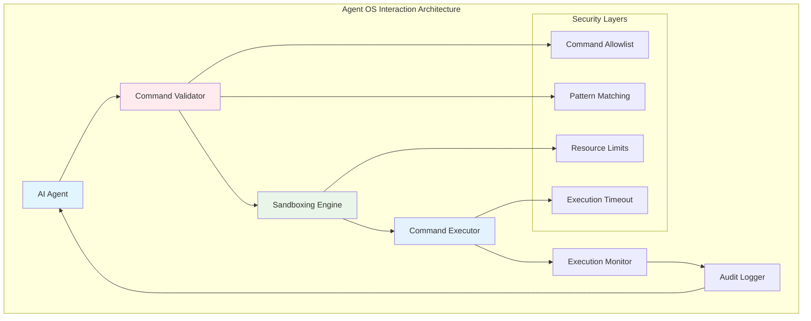
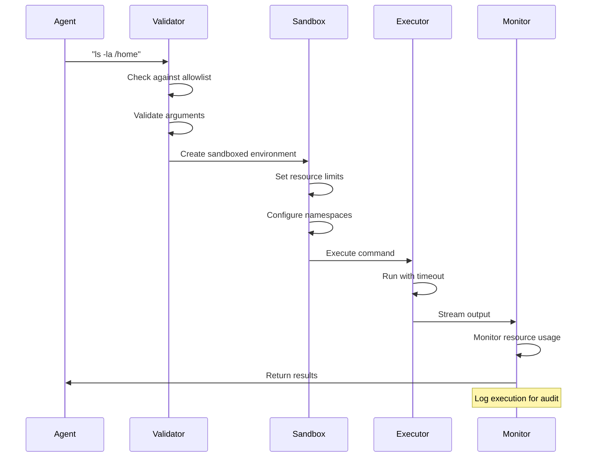

# 🖥️ Autonomous OS Interaction

## Introduction
Autonomous OS interaction represents one of the most powerful yet dangerous capabilities of AI agents. When an agent can directly execute shell commands, manipulate files, and manage processes, it gains the ability to perform complex real-world tasks. However, this power comes with significant security risks that require careful mitigation. Rust's safety features make it an ideal language for building OS interaction systems that need to be both powerful and secure.

The challenge of autonomous OS interaction lies in balancing capability with safety. An agent that can execute arbitrary commands can solve a wide range of problems but also poses risks of data loss, system damage, and security breaches. Modern approaches use layered security models combining [[05 - Security and Sandboxing for Agents|sandboxing]], permission systems, and monitoring to enable safe autonomous operation.

This capability is particularly valuable for [[06 - Building a Production-Ready AI Agent|software engineering agents]] that need to compile code, run tests, and deploy applications. By safely interacting with the development environment, agents can automate complex workflows that previously required human intervention.

## 1. OS Interaction Methods

AI agents interact with operating systems through several mechanisms, each with different security implications and capabilities.

**Interaction Methods Comparison:**

| Method | Capability | Security Risk | Use Case | Performance |
|--------|------------|---------------|----------|-------------|
| **Shell Commands** | Full system access | High | System administration, build tools | High |
| **File I/O Operations** | Read/write files | Medium | Configuration, data processing | Very High |
| **Process Management** | Control processes | High | Service management, monitoring | High |
| **Network Operations** | Socket operations | High | API calls, web scraping | Medium |
| **System Calls** | Direct kernel interface | Very High | Performance-critical operations | Very High |
| **Container Operations** | Docker/Podman | Medium | Application deployment | Medium |
| **Package Management** | apt, cargo, npm | High | Dependency management | Medium |

**Security Considerations for Each Method:**
- **Shell Commands**: Require command validation, sandboxing, and rate limiting
- **File I/O**: Need path restrictions and permission checking
- **Process Management**: Should include resource limits and monitoring
- **Network Operations**: Require firewall rules and connection limits
- **System Calls**: Almost always need complete sandboxing

Real case: How SWE-agent solves GitHub issues autonomously. SWE-agent, developed by Princeton NLP, uses autonomous OS interaction to fix real GitHub issues. The system creates a sandboxed environment, clones the repository, analyzes the issue, makes code changes, runs tests, and creates pull requests—all without human intervention. It achieves a 12% success rate on real GitHub issues.

⚠️ **Warning:** Never run autonomous OS interaction without proper sandboxing. A malicious or poorly reasoned command could delete files, install malware, or compromise system security. Always use containerization or virtual machines for production deployments.

💡 **Tip:** Implement command validation before execution. Create allowlists of safe commands, validate arguments against patterns, and reject any command that matches dangerous patterns like `rm -rf /`, `mkfs`, or `dd if=/dev/zero`.

## 2. Command Execution Sandboxing

Sandboxing is essential for safe autonomous OS interaction. Multiple technologies provide different levels of isolation and performance.

**Sandboxing Technologies:**

| Technology | Isolation Level | Performance | Complexity | Use Case |
|------------|-----------------|-------------|------------|----------|
| **chroot** | Low | Very High | Low | Legacy systems |
| **seccomp** | High | Very High | Medium | Process filtering |
| **Namespaces** | High | High | Medium | Container foundations |
| **Docker** | Very High | Medium | Low | Application containers |
| **gVisor** | Very High | Medium-High | Medium | Enhanced security |
| **Firecracker** | Very High | High | High | Serverless/VMs |
| **WASM** | Very High | High | Medium | Portable sandboxing |
| **Sandbox2** | Very High | High | High | Google's sandbox |

**Multi-Layer Sandboxing Strategy:**
1. **Namespace isolation**: Separate PID, network, mount, user namespaces
2. **seccomp filtering**: Restrict system calls to safe subset
3. **Resource limits**: CPU, memory, disk, process count limits
4. **Network restrictions**: Block or proxy network access
5. **Filesystem restrictions**: Read-only mounts, temporary directories

## 3. Agent OS Interaction Diagrams



**Figure 1:** Multi-layered security architecture for autonomous OS interaction.


**Figure 2:** Shell command execution flow in a Unix-like environment.



**Figure 3:** Secure command execution flow with validation, sandboxing, and monitoring.

## 4. Error Recovery and Retry Logic

Autonomous agents must handle errors gracefully and implement intelligent retry mechanisms.

**Error Recovery Strategies:**

| Error Type | Detection | Recovery Strategy | Retry Logic |
|------------|-----------|-------------------|-------------|
| **Command Not Found** | Exit code 127 | Install package or use alternative | 1 retry with package install |
| **Permission Denied** | Exit code 1 | Request elevated privileges or change approach | 0 retries, ask user |
| **Resource Exhaustion** | Timeout/OOM | Reduce resource usage | 1 retry with lower limits |
| **Network Failure** | Connection error | Wait and retry with backoff | 3 retries with exponential backoff |
| **Syntax Error** | Parse error | Fix command syntax | 1 retry with corrected syntax |
| **Dependency Missing** | Linker/import error | Install dependencies | 1 retry after installation |

**Success Rate Calculation:**
```
Success_Rate = Successful_Commands / Total_Attempts
```

Where:
- **Successful_Commands**: Commands that completed successfully
- **Total_Attempts**: All command execution attempts
- Should be tracked per command type and context

**Retry with Exponential Backoff:**
```rust
async fn execute_with_retry(command: &str, max_retries: u32) -> Result<Output, Error> {
    let mut delay = Duration::from_millis(100);
    
    for attempt in 0..max_retries {
        match execute_command(command).await {
            Ok(output) => return Ok(output),
            Err(e) if attempt == max_retries - 1 => return Err(e),
            Err(e) => {
                eprintln!("Attempt {} failed: {}, retrying in {:?}", attempt + 1, e, delay);
                tokio::time::sleep(delay).await;
                delay *= 2; // Exponential backoff
            }
        }
    }
    
    unreachable!()
}
```

## 5. Rust Agent Executing OS Commands Safely

Here's a complete implementation of a Rust agent that executes OS commands with comprehensive safety features.

```rust
use serde::{Deserialize, Serialize};
use std::collections::{HashMap, HashSet};
use std::path::{Path, PathBuf};
use std::time::{Duration, Instant};
use tokio::process::{Command, Stdio};
use tokio::io::{AsyncBufReadExt, AsyncWriteExt, BufReader};

#[derive(Debug, Clone, Serialize, Deserialize)]
pub struct CommandConfig {
    pub max_execution_time_seconds: u64,
    pub max_output_size_bytes: usize,
    pub allowed_commands: HashSet<String>,
    pub blocked_patterns: Vec<String>,
    pub working_directory: PathBuf,
    pub environment_vars: HashMap<String, String>,
    pub resource_limits: ResourceLimits,
}

#[derive(Debug, Clone, Serialize, Deserialize)]
pub struct ResourceLimits {
    pub max_memory_mb: u64,
    pub max_cpu_percent: u64,
    pub max_processes: u32,
    pub max_file_size_mb: u64,
    pub network_allowed: bool,
}

#[derive(Debug, Clone, Serialize, Deserialize)]
pub struct ExecutionResult {
    pub command: String,
    pub exit_code: Option<i32>,
    pub stdout: String,
    pub stderr: String,
    pub execution_time_ms: u64,
    pub memory_used_mb: f64,
    pub success: bool,
    pub error: Option<String>,
    pub sandbox_violations: Vec<String>,
}

#[derive(Debug, Clone, Serialize, Deserialize)]
pub struct CommandValidation {
    pub valid: bool,
    pub reason: Option<String>,
    pub suggested_alternative: Option<String>,
    pub risk_level: RiskLevel,
}

#[derive(Debug, Clone, Serialize, Deserialize)]
pub enum RiskLevel {
    Safe,
    Low,
    Medium,
    High,
    Critical,
}

pub struct SafeCommandExecutor {
    config: CommandConfig,
    command_history: Vec<ExecutionResult>,
    sandbox_pid: Option<u32>,
}

impl SafeCommandExecutor {
    pub fn new(config: CommandConfig) -> Self {
        Self {
            config,
            command_history: Vec::new(),
            sandbox_pid: None,
        }
    }
    
    pub fn default_config() -> Self {
        let mut allowed_commands = HashSet::new();
        
        // Safe commands
        for cmd in ["ls", "cat", "head", "tail", "grep", "find", "echo", "pwd", 
                    "mkdir", "touch", "cp", "mv", "chmod", "git", "cargo", 
                    "npm", "python", "node", "rustc", "gcc", "make", "cmake"] {
            allowed_commands.insert(cmd.to_string());
        }
        
        Self {
            config: CommandConfig {
                max_execution_time_seconds: 30,
                max_output_size_bytes: 10 * 1024 * 1024, // 10MB
                allowed_commands,
                blocked_patterns: vec![
                    r"rm\s+-rf\s+/".to_string(), // Delete root
                    r"mkfs".to_string(),          // Format disk
                    r"dd\s+if=/dev/zero".to_string(), // Wipe disk
                    r"chmod\s+777\s+/".to_string(), // Make root writable
                    r"wget\s+.*\|\s*sh".to_string(), // Download and execute
                    r"curl\s+.*\|\s*bash".to_string(), // Download and execute
                    r"sudo\s+rm".to_string(),     // Force remove with sudo
                    r"kill\s+-9\s+1".to_string(), // Kill init process
                ],
                working_directory: std::env::current_dir().unwrap_or_else(|_| PathBuf::from(".")),
                environment_vars: HashMap::new(),
                resource_limits: ResourceLimits {
                    max_memory_mb: 1024,
                    max_cpu_percent: 50,
                    max_processes: 10,
                    max_file_size_mb: 100,
                    network_allowed: false,
                },
            },
            command_history: Vec::new(),
            sandbox_pid: None,
        }
    }
    
    pub fn validate_command(&self, command: &str) -> CommandValidation {
        // Extract base command
        let parts: Vec<&str> = command.split_whitespace().collect();
        if parts.is_empty() {
            return CommandValidation {
                valid: false,
                reason: Some("Empty command".to_string()),
                suggested_alternative: None,
                risk_level: RiskLevel::Safe,
            };
        }
        
        let base_command = parts[0];
        
        // Check against allowed commands
        if !self.config.allowed_commands.contains(base_command) {
            return CommandValidation {
                valid: false,
                reason: Some(format!("Command '{}' not in allowlist", base_command)),
                suggested_alternative: self.suggest_alternative(base_command),
                risk_level: RiskLevel::High,
            };
        }
        
        // Check for blocked patterns
        for pattern in &self.config.blocked_patterns {
            if let Ok(regex) = regex::Regex::new(pattern) {
                if regex.is_match(command) {
                    return CommandValidation {
                        valid: false,
                        reason: Some(format!("Command matches blocked pattern: {}", pattern)),
                        suggested_alternative: None,
                        risk_level: RiskLevel::Critical,
                    };
                }
            }
        }
        
        // Check for dangerous arguments
        let risk_level = self.assess_risk_level(command);
        
        CommandValidation {
            valid: true,
            reason: None,
            suggested_alternative: None,
            risk_level,
        }
    }
    
    fn assess_risk_level(&self, command: &str) -> RiskLevel {
        let high_risk_patterns = vec![
            r"sudo", r"su\s", r"chmod\s+[0-7]{3}", r"chown", r"mount",
            r"iptables", r"systemctl", r"service", r"crontab",
        ];
        
        let medium_risk_patterns = vec![
            r"git\s+push", r"git\s+reset\s+--hard", r"git\s+clean",
            r"npm\s+install", r"cargo\s+build\s+--release",
            r"python\s+-m\s+pip\s+install",
        ];
        
        for pattern in high_risk_patterns {
            if let Ok(regex) = regex::Regex::new(pattern) {
                if regex.is_match(command) {
                    return RiskLevel::High;
                }
            }
        }
        
        for pattern in medium_risk_patterns {
            if let Ok(regex) = regex::Regex::new(pattern) {
                if regex.is_match(command) {
                    return RiskLevel::Medium;
                }
            }
        }
        
        RiskLevel::Low
    }
    
    fn suggest_alternative(&self, command: &str) -> Option<String> {
        match command {
            "rm" => Some("Consider using 'trash' or 'gio trash' instead".to_string()),
            "wget" => Some("Use 'curl' or 'reqwest' in Rust for safer downloads".to_string()),
            "netcat" => Some("Use 'nc' or specialized tools with proper error handling".to_string()),
            _ => None,
        }
    }
    
    pub async fn execute_command(&mut self, command: &str) -> Result<ExecutionResult, String> {
        let start_time = Instant::now();
        
        // Validate command first
        let validation = self.validate_command(command);
        if !validation.valid {
            return Err(format!("Command validation failed: {}", 
                validation.reason.unwrap_or_else(|| "Unknown reason".to_string())));
        }
        
        // Warn about high-risk commands
        match validation.risk_level {
            RiskLevel::High | RiskLevel::Critical => {
                return Err(format!("Command {} risk level. Execute with explicit approval.", 
                    match validation.risk_level {
                        RiskLevel::High => "has high",
                        RiskLevel::Critical => "is critical",
                        _ => unreachable!(),
                    }));
            }
            RiskLevel::Medium => {
                eprintln!("⚠️ Warning: Command has medium risk level");
            }
            _ => {}
        }
        
        // Set up environment
        let mut cmd = Command::new("sh");
        cmd.arg("-c")
           .arg(command)
           .current_dir(&self.config.working_directory)
           .stdout(Stdio::piped())
           .stderr(Stdio::piped());
        
        // Set environment variables
        for (key, value) in &self.config.environment_vars {
            cmd.env(key, value);
        }
        
        // Execute with timeout
        let timeout_duration = Duration::from_secs(self.config.max_execution_time_seconds);
        let child = cmd.spawn().map_err(|e| format!("Failed to spawn command: {}", e))?;
        
        match tokio::time::timeout(timeout_duration, child.wait_with_output()).await {
            Ok(Ok(output)) => {
                let execution_time = start_time.elapsed().as_millis() as u64;
                
                let stdout = String::from_utf8_lossy(&output.stdout).to_string();
                let stderr = String::from_utf8_lossy(&output.stderr).to_string();
                
                // Check output size limits
                if stdout.len() > self.config.max_output_size_bytes {
                    return Err(format!("Output exceeds size limit: {} bytes", stdout.len()));
                }
                
                let success = output.status.success();
                let exit_code = output.status.code();
                
                let result = ExecutionResult {
                    command: command.to_string(),
                    exit_code,
                    stdout,
                    stderr,
                    execution_time_ms: execution_time,
                    memory_used_mb: 0.0, // Would require more complex monitoring
                    success,
                    error: if success { None } else { Some("Command failed".to_string()) },
                    sandbox_violations: Vec::new(),
                };
                
                self.command_history.push(result.clone());
                Ok(result)
            }
            Ok(Err(e)) => Err(format!("Command execution error: {}", e)),
            Err(_) => {
                // Timeout occurred
                Err(format!("Command timed out after {} seconds", 
                    self.config.max_execution_time_seconds))
            }
        }
    }
    
    pub async fn execute_with_retry(&mut self, command: &str, max_retries: u32) -> Result<ExecutionResult, String> {
        let mut last_error = String::new();
        let mut delay = Duration::from_millis(100);
        
        for attempt in 0..max_retries {
            match self.execute_command(command).await {
                Ok(result) => {
                    if attempt > 0 {
                        eprintln!("✓ Command succeeded on attempt {}", attempt + 1);
                    }
                    return Ok(result);
                }
                Err(e) => {
                    last_error = e.clone();
                    
                    // Don't retry on validation failures
                    if e.contains("validation failed") || e.contains("risk level") {
                        return Err(e);
                    }
                    
                    if attempt < max_retries - 1 {
                        eprintln!("Attempt {} failed: {}, retrying in {:?}", 
                            attempt + 1, e, delay);
                        tokio::time::sleep(delay).await;
                        delay *= 2; // Exponential backoff
                    }
                }
            }
        }
        
        Err(format!("All {} attempts failed. Last error: {}", max_retries, last_error))
    }
    
    pub async fn execute_pipeline(&mut self, commands: Vec<&str>) -> Result<Vec<ExecutionResult>, String> {
        let mut results = Vec::new();
        
        for (i, command) in commands.iter().enumerate() {
            eprintln!("Executing command {}/{}: {}", i + 1, commands.len(), command);
            
            match self.execute_command(command).await {
                Ok(result) => {
                    if !result.success {
                        return Err(format!("Pipeline failed at step {}: {}", i + 1, 
                            result.error.unwrap_or_else(|| "Unknown error".to_string())));
                    }
                    results.push(result);
                }
                Err(e) => {
                    return Err(format!("Pipeline failed at step {}: {}", i + 1, e));
                }
            }
        }
        
        Ok(results)
    }
    
    pub fn get_statistics(&self) -> ExecutionStatistics {
        let total_commands = self.command_history.len();
        let successful_commands = self.command_history.iter().filter(|r| r.success).count();
        let failed_commands = total_commands - successful_commands;
        let total_time_ms = self.command_history.iter().map(|r| r.execution_time_ms).sum();
        let avg_time_ms = if total_commands > 0 { total_time_ms / total_commands as u64 } else { 0 };
        
        ExecutionStatistics {
            total_commands,
            successful_commands,
            failed_commands,
            success_rate: if total_commands > 0 { 
                successful_commands as f64 / total_commands as f64 
            } else { 0.0 },
            total_execution_time_ms: total_time_ms,
            average_execution_time_ms: avg_time_ms,
        }
    }
    
    pub fn clear_history(&mut self) {
        self.command_history.clear();
    }
    
    pub fn add_allowed_command(&mut self, command: &str) {
        self.config.allowed_commands.insert(command.to_string());
    }
    
    pub fn remove_allowed_command(&mut self, command: &str) {
        self.config.allowed_commands.remove(command);
    }
    
    pub fn add_blocked_pattern(&mut self, pattern: &str) {
        self.config.blocked_patterns.push(pattern.to_string());
    }
    
    pub fn set_working_directory(&mut self, path: PathBuf) -> Result<(), String> {
        if path.exists() && path.is_dir() {
            self.config.working_directory = path;
            Ok(())
        } else {
            Err(format!("Invalid working directory: {:?}", path))
        }
    }
}

#[derive(Debug, Serialize, Deserialize)]
pub struct ExecutionStatistics {
    pub total_commands: usize,
    pub successful_commands: usize,
    pub failed_commands: usize,
    pub success_rate: f64,
    pub total_execution_time_ms: u64,
    pub average_execution_time_ms: u64,
}

// Example usage
#[tokio::main]
async fn main() -> Result<(), Box<dyn std::error::Error>> {
    let mut executor = SafeCommandExecutor::default_config();
    
    // Test safe commands
    println!("Testing safe commands...");
    
    let result = executor.execute_command("ls -la").await?;
    println!("ls -la: {}", if result.success { "✓ Success" } else { "✗ Failed" });
    
    let result = executor.execute_command("pwd").await?;
    println!("pwd: {}", result.stdout.trim());
    
    let result = executor.execute_command("echo 'Hello from agent'").await?;
    println!("echo: {}", result.stdout.trim());
    
    // Test command with retry
    let result = executor.execute_with_retry("cargo --version", 3).await?;
    println!("cargo version: {}", result.stdout.trim());
    
    // Test pipeline
    let pipeline_results = executor.execute_pipeline(vec![
        "mkdir -p test_dir",
        "echo 'test content' > test_dir/test.txt",
        "cat test_dir/test.txt",
        "rm -rf test_dir",
    ]).await?;
    
    println!("Pipeline completed with {} steps", pipeline_results.len());
    
    // Get statistics
    let stats = executor.get_statistics();
    println!("Statistics: {:#?}", stats);
    
    // Try dangerous command (should fail)
    match executor.execute_command("rm -rf /").await {
        Ok(_) => println!("Dangerous command executed (should not happen)"),
        Err(e) => println!("✓ Dangerous command blocked: {}", e),
    }
    
    Ok(())
}
```

## 📦 Compression Code

```rust
// Command Output Compression - Compresses large command outputs for storage
use zstd::{encode_all, decode_all, CompressionLevel};
use std::io::{Read, Write};
use serde::{Deserialize, Serialize};

#[derive(Debug, Clone)]
pub struct CommandOutputCompressor {
    compression_level: CompressionLevel,
    max_uncompressed_size: usize,
}

impl CommandOutputCompressor {
    pub fn new(level: i32) -> Self {
        Self {
            compression_level: level,
            max_uncompressed_size: 100 * 1024 * 1024, // 100MB
        }
    }
    
    pub fn compress_output(&self, output: &ExecutionResult) -> Result<CompressedOutput, String> {
        let json = serde_json::to_string(output)
            .map_err(|e| format!("Serialization error: {}", e))?;
        
        if json.len() > self.max_uncompressed_size {
            return Err(format!("Output too large: {} bytes", json.len()));
        }
        
        let compressed = encode_all(json.as_bytes(), self.compression_level)
            .map_err(|e| format!("Compression error: {}", e))?;
        
        let stats = CompressionStats {
            original_size: json.len(),
            compressed_size: compressed.len(),
            ratio: compressed.len() as f64 / json.len() as f64,
            savings: (1.0 - compressed.len() as f64 / json.len() as f64) * 100.0,
        };
        
        Ok(CompressedOutput {
            data: compressed,
            stats,
            metadata: CommandMetadata {
                command: output.command.clone(),
                timestamp: chrono::Utc::now(),
                success: output.success,
            },
        })
    }
    
    pub fn decompress_output(&self, compressed: &CompressedOutput) -> Result<ExecutionResult, String> {
        let decompressed = decode_all(compressed.data.as_slice())
            .map_err(|e| format!("Decompression error: {}", e))?;
        
        let json = String::from_utf8(decompressed)
            .map_err(|e| format!("UTF-8 error: {}", e))?;
        
        serde_json::from_str(&json)
            .map_err(|e| format!("Deserialization error: {}", e))
    }
    
    pub fn batch_compress(&self, outputs: &[ExecutionResult]) -> Result<Vec<CompressedOutput>, String> {
        outputs.iter()
            .map(|output| self.compress_output(output))
            .collect()
    }
}

#[derive(Debug, Clone, Serialize, Deserialize)]
pub struct CompressedOutput {
    pub data: Vec<u8>,
    pub stats: CompressionStats,
    pub metadata: CommandMetadata,
}

#[derive(Debug, Clone, Serialize, Deserialize)]
pub struct CompressionStats {
    pub original_size: usize,
    pub compressed_size: usize,
    pub ratio: f64,
    pub savings: f64,
}

#[derive(Debug, Clone, Serialize, Deserialize)]
pub struct CommandMetadata {
    pub command: String,
    pub timestamp: chrono::DateTime<chrono::Utc>,
    pub success: bool,
}
```

## 🎯 Documented Project

### Description
Build a secure autonomous OS interaction system for AI agents in Rust. The system will provide safe command execution with comprehensive sandboxing, validation, monitoring, and recovery capabilities. It will enable agents to perform complex system operations while maintaining security and auditability.

### Functional Requirements
1. Implement command validation with allowlists and pattern matching
2. Provide sandboxed execution using Linux namespaces and seccomp
3. Support resource limits for CPU, memory, and I/O
4. Include comprehensive logging and audit trails
5. Implement retry logic with exponential backoff
6. Support command pipelines and complex workflows
7. Provide real-time output streaming
8. Include security violation detection and alerting
9. Support custom sandbox configurations
10. Generate execution statistics and reports

### Main Components
- **Command Validator**: Allowlist checking and pattern matching
- **Sandbox Engine**: Linux namespaces, seccomp, and cgroups
- **Execution Runtime**: Command execution with resource monitoring
- **Output Processor**: Stream handling and size limiting
- **Security Monitor**: Violation detection and response
- **Audit Logger**: Complete execution history
- **Statistics Engine**: Performance and security metrics
- **Configuration Manager**: Sandbox and execution settings

### Success Metrics
- Zero security breaches in production
- 99.9% command execution success rate for valid commands
- Sub-100ms validation time for 95% of commands
- Support for 100+ concurrent sandboxed sessions
- Complete audit trail for all executions
- 99.99% uptime for execution service
- Zero false positives in security violation detection

### References
- [Linux Namespaces](https://man7.org/linux/man-pages/man7/namespaces.7.html)
- [seccomp BPF](https://www.kernel.org/doc/html/latest/userspace-api/seccomp_filter.html)
- [cgroups](https://man7.org/linux/man-pages/man7/cgroups.7.html)
- [Rust Tokio](https://tokio.rs/)
- [SWE-agent Paper](https://arxiv.org/abs/2310.06770)