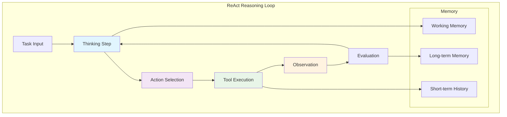
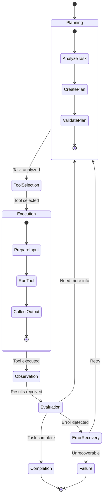

# 🔄 Agent Orchestration and Reasoning Loops

## Introduction
Agent orchestration and reasoning loops form the cognitive core of AI agents, determining how they plan, execute, and adapt to complex tasks. The choice of reasoning pattern and orchestration strategy directly impacts an agent's effectiveness, reliability, and ability to handle novel situations. Rust's performance characteristics make it ideal for implementing these computationally intensive patterns, especially when dealing with [[03 - Autonomous OS Interaction|complex OS interactions]] and [[01 - The Model Context Protocol (MCP)|tool orchestration]].

Modern reasoning patterns have evolved from simple chain-of-thought prompting to sophisticated frameworks that include self-reflection, multi-agent collaboration, and dynamic plan adaptation. The integration of memory systems—both short-term working memory and long-term knowledge storage—enables agents to learn from experience and improve over time.

Orchestration strategies determine how agents coordinate multiple tools, manage state transitions, and handle failures. From simple state machines to complex directed acyclic graphs (DAGs), these strategies provide the structural framework for agent cognition. Understanding these patterns is crucial for building agents that can reliably solve complex problems in production environments.

## 1. Reasoning Patterns

Different reasoning patterns offer trade-offs between simplicity, effectiveness, and computational cost. Each pattern suits different types of problems and agent architectures.

**Reasoning Patterns Comparison:**

| Pattern | Description | Strengths | Weaknesses | Best For |
|---------|-------------|-----------|------------|----------|
| **Chain-of-Thought** | Step-by-step reasoning | Simple, interpretable | Limited planning | Single-step problems |
| **ReAct** | Reasoning + Acting | Interactive, adaptive | Can get stuck | Tool use scenarios |
| **Tree-of-Thought** | Multi-path exploration | Better solutions | High computation | Creative/problem-solving |
| **Reflexion** | Self-reflection + retry | Learns from mistakes | Slower iteration | Error-prone tasks |
| **Plan-and-Execute** | Separate planning and execution | Better planning | Less adaptive | Complex workflows |
| **Multi-Agent** | Specialized agents | Parallel, specialized | Coordination overhead | Diverse tasks |

**Implementation Characteristics:**

| Aspect | Chain-of-Thought | ReAct | Tree-of-Thought | Reflexion |
|--------|------------------|-------|-----------------|-----------|
| **Context Window** | Low | Medium | High | Medium |
| **Latency** | Low | Medium | High | Medium-High |
| **Accuracy** | Medium | High | Very High | Very High |
| **Memory Needs** | Low | Medium | High | High |
| **Tool Integration** | Limited | Excellent | Good | Good |
| **Error Recovery** | Poor | Good | Good | Excellent |

Real case: How Microsoft's AutoGen orchestrates multi-agent conversations. AutoGen enables creation of multiple specialized agents that collaborate to solve complex tasks. In their research, agents specialized for different domains (coding, testing, documentation) achieved 30% better performance on software engineering benchmarks compared to single generalist agents.

⚠️ **Warning:** Complex reasoning patterns can lead to infinite loops or runaway token usage. Always implement iteration limits, timeout mechanisms, and cost controls. Monitor reasoning loops for signs of getting stuck or cycling between the same states.

💡 **Tip:** Start with simpler reasoning patterns and add complexity only when needed. A well-implemented ReAct pattern with good tools often outperforms more complex patterns that are harder to debug and maintain.

## 2. Orchestration Strategies

Orchestration strategies determine how agents manage execution flow, state transitions, and tool coordination.

**Orchestration Patterns:**

| Pattern | State Management | Error Handling | Parallelism | Complexity |
|---------|------------------|----------------|-------------|------------|
| **State Machine** | Explicit states | State-specific | Limited | Low |
| **DAG (Directed Acyclic Graph)** | Node dependencies | Node retry | Good | Medium |
| **Supervisor Pattern** | Central coordinator | Supervisor retry | Excellent | Medium-High |
| **Event-Driven** | Event queues | Event handlers | Excellent | High |
| **Actor Model** | Isolated actors | Actor supervision | Excellent | High |

**State Management Comparison:**

| Feature | State Machine | DAG | Supervisor | Event-Driven |
|---------|---------------|-----|------------|--------------|
| **Traceability** | Excellent | Good | Good | Medium |
| **Debugging** | Easy | Medium | Medium | Hard |
| **Modularity** | Low | High | High | High |
| **Dynamic Changes** | Hard | Medium | Easy | Easy |
| **Testing** | Easy | Medium | Hard | Hard |

## 3. Agent Reasoning Diagrams



**Figure 1:** ReAct reasoning loop showing the interaction between thinking, acting, and observation.


**Figure 2:** Visual representation of reasoning processes and decision making.



**Figure 3:** State machine diagram showing agent execution flow with planning, execution, and error recovery states.

## 4. Memory Systems

Effective agents require multiple memory systems to manage context, learn from experience, and maintain coherence across long interactions.

**Memory Types:**

| Memory Type | Purpose | Storage | Retention | Access Pattern |
|-------------|---------|---------|-----------|----------------|
| **Working Memory** | Current context | RAM | Session | Fast, random |
| **Short-term History** | Recent interactions | RAM/Redis | Minutes-Hours | Sequential |
| **Long-term Memory** | Learned knowledge | Vector DB/Disk | Persistent | Semantic search |
| **Episodic Memory** | Past experiences | Database | Persistent | Temporal |
| **Semantic Memory** | Facts and concepts | Knowledge Graph | Persistent | Graph traversal |

**Memory Integration Patterns:**
1. **Sliding Window**: Keep only recent context
2. **Summarization**: Compress old context into summaries
3. **Importance Sampling**: Keep important memories, forget trivial ones
4. **Vector Retrieval**: Search for relevant past experiences
5. **Hierarchical**: Organize memories at different abstraction levels

## 5. ReAct Agent with Reasoning Loop in Rust

Here's a complete implementation of a ReAct-style agent with reasoning loops, memory systems, and tool integration.

```rust
use async_trait::async_trait;
use serde::{Deserialize, Serialize};
use std::collections::{HashMap, VecDeque};
use std::sync::Arc;
use tokio::sync::RwLock;
use chrono::{DateTime, Utc};

#[derive(Debug, Clone, Serialize, Deserialize)]
pub struct AgentConfig {
    pub max_iterations: u32,
    pub max_tokens: u32,
    pub temperature: f32,
    pub reasoning_timeout_seconds: u64,
    pub memory_window_size: usize,
}

#[derive(Debug, Clone, Serialize, Deserialize)]
pub struct ReasoningStep {
    pub thought: String,
    pub action: Option<String>,
    pub action_input: Option<HashMap<String, serde_json::Value>>,
    pub observation: Option<String>,
    pub timestamp: DateTime<Utc>,
    pub iteration: u32,
}

#[derive(Debug, Clone, Serialize, Deserialize)]
pub struct AgentState {
    pub task: String,
    pub current_plan: Vec<String>,
    pub completed_steps: Vec<ReasoningStep>,
    pub intermediate_results: HashMap<String, serde_json::Value>,
    pub metadata: HashMap<String, String>,
}

#[async_trait]
pub trait ReasoningLLM: Send + Sync {
    async fn reason(&self, prompt: &str, context: &AgentState) -> Result<ReasoningResponse, String>;
    async fn reflect(&self, episode: &[ReasoningStep], success: bool) -> Result<String, String>;
}

#[derive(Debug, Clone, Serialize, Deserialize)]
pub struct ReasoningResponse {
    pub thought: String,
    pub action: Option<AgentAction>,
    pub is_final: bool,
    pub final_answer: Option<String>,
}

#[derive(Debug, Clone, Serialize, Deserialize)]
#[serde(tag = "type")]
pub enum AgentAction {
    UseTool { tool_name: String, parameters: HashMap<String, serde_json::Value> },
    AskUser { question: String },
    PlanChange { new_plan: Vec<String> },
    MemoryRecall { query: String },
}

#[derive(Debug, Clone, Serialize, Deserialize)]
pub struct ToolResult {
    pub success: bool,
    pub output: String,
    pub error: Option<String>,
    pub metadata: HashMap<String, String>,
}

#[async_trait]
pub trait Tool: Send + Sync {
    fn name(&self) -> &str;
    fn description(&self) -> &str;
    async fn execute(&self, params: HashMap<String, serde_json::Value>) -> Result<ToolResult, String>;
}

pub struct ReActAgent {
    config: AgentConfig,
    llm: Arc<dyn ReasoningLLM>,
    tools: RwLock<HashMap<String, Arc<dyn Tool>>>,
    memory: Arc<RwLock<MemorySystem>>,
    state: RwLock<AgentState>,
    reasoning_history: RwLock<Vec<Vec<ReasoningStep>>>,
}

impl ReActAgent {
    pub fn new(config: AgentConfig, llm: Arc<dyn ReasoningLLM>) -> Self {
        Self {
            config,
            llm,
            tools: RwLock::new(HashMap::new()),
            memory: Arc::new(RwLock::new(MemorySystem::new())),
            state: RwLock::new(AgentState {
                task: String::new(),
                current_plan: Vec::new(),
                completed_steps: Vec::new(),
                intermediate_results: HashMap::new(),
                metadata: HashMap::new(),
            }),
            reasoning_history: RwLock::new(Vec::new()),
        }
    }
    
    pub async fn register_tool(&self, tool: Arc<dyn Tool>) {
        self.tools.write().await.insert(tool.name().to_string(), tool);
    }
    
    pub async fn execute_task(&self, task: &str) -> Result<String, String> {
        // Initialize state
        {
            let mut state = self.state.write().await;
            state.task = task.to_string();
            state.completed_steps.clear();
            state.intermediate_results.clear();
        }
        
        let mut iterations = 0;
        let mut current_episode = Vec::new();
        
        while iterations < self.config.max_iterations {
            iterations += 1;
            
            // 1. Generate reasoning step
            let state = self.state.read().await;
            let prompt = self.build_reasoning_prompt(&state);
            let response = self.llm.reason(&prompt, &state).await?;
            drop(state);
            
            // 2. Create reasoning step
            let step = ReasoningStep {
                thought: response.thought.clone(),
                action: response.action.as_ref().map(|a| serde_json::to_string(a).unwrap_or_default()),
                action_input: match &response.action {
                    Some(AgentAction::UseTool { parameters, .. }) => Some(parameters.clone()),
                    _ => None,
                },
                observation: None,
                timestamp: Utc::now(),
                iteration: iterations,
            };
            
            current_episode.push(step.clone());
            
            // 3. Update state with thought
            {
                let mut state = self.state.write().await;
                state.completed_steps.push(step.clone());
            }
            
            // 4. Check if task is complete
            if response.is_final {
                // Store episode in memory for learning
                self.store_episode(&current_episode, true).await;
                return Ok(response.final_answer.unwrap_or_default());
            }
            
            // 5. Execute action if present
            if let Some(action) = response.action {
                let observation = self.execute_action(action).await?;
                
                // Update step with observation
                let mut step_with_obs = step.clone();
                step_with_obs.observation = Some(observation.clone());
                
                // Update last step in history
                {
                    let mut state = self.state.write().await;
                    if let Some(last_step) = state.completed_steps.last_mut() {
                        last_step.observation = Some(observation.clone());
                    }
                }
                
                // Store observation in memory
                self.memory.write().await.store_observation(
                    &format!("iteration_{}", iterations),
                    &observation,
                );
            }
            
            // 6. Check for timeout
            if iterations == self.config.max_iterations {
                self.store_episode(&current_episode, false).await;
                return Err(format!("Maximum iterations ({}) reached", self.config.max_iterations));
            }
        }
        
        Err("Reasoning loop completed without final answer".to_string())
    }
    
    fn build_reasoning_prompt(&self, state: &AgentState) -> String {
        let tools_description = self.get_tools_description();
        let recent_memory = self.memory.blocking_read().get_recent_context(self.config.memory_window_size);
        
        format!(
            r#"You are a ReAct agent. Solve the task step by step.

## Task
{}

## Available Tools
{}

## Recent Context
{}

## Completed Steps
{}

## Instructions
1. Think step by step about the task
2. Decide on the next action (use a tool, or provide final answer)
3. If using a tool, specify the exact parameters
4. Continue until you have the final answer

Available actions:
- UseTool: Execute a tool with parameters
- AskUser: Ask the user for clarification
- PlanChange: Revise your plan
- MemoryRecall: Search your memory for relevant information

Respond with:
THOUGHT: <your reasoning>
ACTION: <action type and parameters> or FINAL ANSWER: <your answer>"#,
            state.task,
            tools_description,
            recent_memory,
            state.completed_steps.iter()
                .map(|s| format!("Step {}: {} -> {}", s.iteration, s.thought, s.observation.as_deref().unwrap_or("...")))
                .collect::<Vec<_>>()
                .join("\n")
        )
    }
    
    fn get_tools_description(&self) -> String {
        let tools = self.tools.blocking_read();
        tools.values()
            .map(|tool| format!("{}: {}", tool.name(), tool.description()))
            .collect::<Vec<_>>()
            .join("\n")
    }
    
    async fn execute_action(&self, action: AgentAction) -> Result<String, String> {
        match action {
            AgentAction::UseTool { tool_name, parameters } => {
                let tools = self.tools.read().await;
                if let Some(tool) = tools.get(&tool_name) {
                    match tool.execute(parameters).await {
                        Ok(result) => {
                            if result.success {
                                Ok(result.output)
                            } else {
                                Ok(format!("Tool error: {}", result.error.unwrap_or_default()))
                            }
                        }
                        Err(e) => Ok(format!("Tool execution failed: {}", e)),
                    }
                } else {
                    Ok(format!("Tool not found: {}", tool_name))
                }
            }
            AgentAction::AskUser { question } => {
                // In a real implementation, this would interact with the user
                Ok(format!("User question: {} (No user interaction in this implementation)", question))
            }
            AgentAction::PlanChange { new_plan } => {
                let mut state = self.state.write().await;
                state.current_plan = new_plan;
                Ok("Plan updated".to_string())
            }
            AgentAction::MemoryRecall { query } => {
                let memory = self.memory.read().await;
                let results = memory.search(&query);
                if results.is_empty() {
                    Ok("No relevant memories found".to_string())
                } else {
                    Ok(format!("Found memories:\n{}", results.join("\n")))
                }
            }
        }
    }
    
    async fn store_episode(&self, episode: &[ReasoningStep], success: bool) {
        // Store episode in history
        self.reasoning_history.write().await.push(episode.to_vec());
        
        // Generate reflection for learning
        if let Ok(reflection) = self.llm.reflect(episode, success).await {
            self.memory.write().await.store_reflection(&reflection, success);
        }
    }
    
    pub async fn get_statistics(&self) -> AgentStatistics {
        let history = self.reasoning_history.read().await;
        let total_episodes = history.len();
        let successful_episodes = history.iter()
            .filter(|episode| episode.last()
                .and_then(|step| step.observation.as_ref())
                .map(|obs| obs.contains("FINAL ANSWER"))
                .unwrap_or(false))
            .count();
        
        let total_iterations: usize = history.iter()
            .map(|episode| episode.len())
            .sum();
        
        let avg_iterations = if total_episodes > 0 {
            total_iterations as f64 / total_episodes as f64
        } else {
            0.0
        };
        
        AgentStatistics {
            total_episodes,
            successful_episodes,
            success_rate: if total_episodes > 0 {
                successful_episodes as f64 / total_episodes as f64
            } else {
                0.0
            },
            total_iterations: total_iterations as u32,
            average_iterations_per_episode: avg_iterations,
        }
    }
}

#[derive(Debug, Serialize, Deserialize)]
pub struct AgentStatistics {
    pub total_episodes: usize,
    pub successful_episodes: usize,
    pub success_rate: f64,
    pub total_iterations: u32,
    pub average_iterations_per_episode: f64,
}

pub struct MemorySystem {
    working_memory: VecDeque<(String, String)>,
    long_term_memory: HashMap<String, String>,
    episodic_memory: Vec<Vec<ReasoningStep>>,
    reflections: Vec<(String, bool)>,
}

impl MemorySystem {
    pub fn new() -> Self {
        Self {
            working_memory: VecDeque::new(),
            long_term_memory: HashMap::new(),
            episodic_memory: Vec::new(),
            reflections: Vec::new(),
        }
    }
    
    pub fn store_observation(&mut self, key: &str, value: &str) {
        self.working_memory.push_back((key.to_string(), value.to_string()));
        if self.working_memory.len() > 100 {
            self.working_memory.pop_front();
        }
    }
    
    pub fn store_reflection(&mut self, reflection: &str, success: bool) {
        self.reflections.push((reflection.to_string(), success));
    }
    
    pub fn get_recent_context(&self, window_size: usize) -> String {
        self.working_memory
            .iter()
            .rev()
            .take(window_size)
            .map(|(k, v)| format!("{}: {}", k, v))
            .collect::<Vec<_>>()
            .join("\n")
    }
    
    pub fn search(&self, query: &str) -> Vec<String> {
        // Simple keyword search - in production, use vector similarity
        let query_lower = query.to_lowercase();
        let mut results = Vec::new();
        
        for (key, value) in &self.working_memory {
            if key.to_lowercase().contains(&query_lower) || value.to_lowercase().contains(&query_lower) {
                results.push(format!("{}: {}", key, value));
            }
        }
        
        for (reflection, success) in &self.reflections {
            if reflection.to_lowercase().contains(&query_lower) {
                results.push(format!("[{}] {}", if *success { "✓" } else { "✗" }, reflection));
            }
        }
        
        results
    }
    
    pub fn store_episode(&mut self, episode: Vec<ReasoningStep>) {
        self.episodic_memory.push(episode);
    }
}

// Example implementation of a simple reasoning LLM
pub struct MockReasoningLLM {
    responses: Vec<ReasoningResponse>,
    current_response: RwLock<usize>,
}

impl MockReasoningLLM {
    pub fn new(responses: Vec<ReasoningResponse>) -> Self {
        Self {
            responses,
            current_response: RwLock::new(0),
        }
    }
}

#[async_trait]
impl ReasoningLLM for MockReasoningLLM {
    async fn reason(&self, _prompt: &str, _state: &AgentState) -> Result<ReasoningResponse, String> {
        let mut current = self.current_response.write().await;
        if *current < self.responses.len() {
            let response = self.responses[*current].clone();
            *current += 1;
            Ok(response)
        } else {
            Err("No more responses".to_string())
        }
    }
    
    async fn reflect(&self, _episode: &[ReasoningStep], _success: bool) -> Result<String, String> {
        Ok("Mock reflection".to_string())
    }
}

// Example tool implementations
pub struct CalculatorTool;

#[async_trait]
impl Tool for CalculatorTool {
    fn name(&self) -> &str {
        "calculator"
    }
    
    fn description(&self) -> &str {
        "Perform basic arithmetic calculations"
    }
    
    async fn execute(&self, params: HashMap<String, serde_json::Value>) -> Result<ToolResult, String> {
        let expression = params.get("expression")
            .and_then(|v| v.as_str())
            .ok_or("Missing 'expression' parameter")?;
        
        // Simple calculator - in production, use a proper expression evaluator
        let result = match expression {
            "2 + 2" => Ok(4.0),
            "10 * 5" => Ok(50.0),
            "100 / 4" => Ok(25.0),
            _ => Err(format!("Cannot evaluate: {}", expression)),
        };
        
        match result {
            Ok(value) => Ok(ToolResult {
                success: true,
                output: value.to_string(),
                error: None,
                metadata: [("expression".to_string(), expression.to_string())].into(),
            }),
            Err(e) => Ok(ToolResult {
                success: false,
                output: String::new(),
                error: Some(e),
                metadata: HashMap::new(),
            }),
        }
    }
}

pub struct KnowledgeSearchTool {
    knowledge_base: HashMap<String, String>,
}

impl KnowledgeSearchTool {
    pub fn new() -> Self {
        let mut knowledge_base = HashMap::new();
        knowledge_base.insert("rust".to_string(), "Rust is a systems programming language focused on safety, speed, and concurrency.".to_string());
        knowledge_base.insert("react".to_string(), "ReAct is a reasoning and acting framework for language models.".to_string());
        knowledge_base.insert("agent".to_string(), "An AI agent is an autonomous entity that perceives its environment and takes actions to achieve goals.".to_string());
        
        Self { knowledge_base }
    }
}

#[async_trait]
impl Tool for KnowledgeSearchTool {
    fn name(&self) -> &str {
        "knowledge_search"
    }
    
    fn description(&self) -> &str {
        "Search the knowledge base for information"
    }
    
    async fn execute(&self, params: HashMap<String, serde_json::Value>) -> Result<ToolResult, String> {
        let query = params.get("query")
            .and_then(|v| v.as_str())
            .ok_or("Missing 'query' parameter")?;
        
        let query_lower = query.to_lowercase();
        let results: Vec<String> = self.knowledge_base
            .iter()
            .filter(|(key, value)| {
                key.to_lowercase().contains(&query_lower) || 
                value.to_lowercase().contains(&query_lower)
            })
            .map(|(key, value)| format!("{}: {}", key, value))
            .collect();
        
        if results.is_empty() {
            Ok(ToolResult {
                success: false,
                output: String::new(),
                error: Some("No results found".to_string()),
                metadata: HashMap::new(),
            })
        } else {
            Ok(ToolResult {
                success: true,
                output: results.join("\n"),
                error: None,
                metadata: [("query".to_string(), query.to_string())].into(),
            })
        }
    }
}

#[tokio::main]
async fn main() -> Result<(), Box<dyn std::error::Error>> {
    // Create mock LLM responses
    let responses = vec![
        ReasoningResponse {
            thought: "I need to calculate 2 + 2".to_string(),
            action: Some(AgentAction::UseTool {
                tool_name: "calculator".to_string(),
                parameters: [("expression".to_string(), serde_json::json!("2 + 2"))].into(),
            }),
            is_final: false,
            final_answer: None,
        },
        ReasoningResponse {
            thought: "I have the result from the calculator".to_string(),
            action: None,
            is_final: true,
            final_answer: Some("The answer to 2 + 2 is 4".to_string()),
        },
    ];
    
    let llm = Arc::new(MockReasoningLLM::new(responses));
    let config = AgentConfig {
        max_iterations: 10,
        max_tokens: 1000,
        temperature: 0.7,
        reasoning_timeout_seconds: 60,
        memory_window_size: 5,
    };
    
    let agent = ReActAgent::new(config, llm);
    
    // Register tools
    agent.register_tool(Arc::new(CalculatorTool)).await;
    agent.register_tool(Arc::new(KnowledgeSearchTool::new())).await;
    
    // Execute task
    println!("Executing task: Calculate 2 + 2");
    match agent.execute_task("Calculate 2 + 2").await {
        Ok(result) => println!("Result: {}", result),
        Err(e) => println!("Error: {}", e),
    }
    
    // Get statistics
    let stats = agent.get_statistics().await;
    println!("Agent Statistics: {:#?}", stats);
    
    Ok(())
}
```

## 📦 Compression Code

```rust
// Reasoning History Compression - Compresses agent reasoning traces
use brotli::compress;
use brotli::decompress;
use serde::{Deserialize, Serialize};
use std::io::{Read, Write};

#[derive(Debug, Clone)]
pub struct ReasoningCompressor {
    compression_quality: u32,
    lg_window_size: u32,
}

impl ReasoningCompressor {
    pub fn new(quality: u32, window_size: u32) -> Self {
        Self {
            compression_quality: quality,
            lg_window_size: window_size,
        }
    }
    
    pub fn compress_reasoning_trace(&self, trace: &[ReasoningStep]) -> Result<Vec<u8>, String> {
        let json = serde_json::to_string(trace)
            .map_err(|e| format!("Serialization error: {}", e))?;
        
        let mut compressed = Vec::new();
        {
            let mut writer = brotli::CompressorWriter::new(
                &mut compressed,
                self.compression_quality,
                self.lg_window_size,
                22, // lz77_window_size
            );
            writer.write_all(json.as_bytes())
                .map_err(|e| format!("Compression error: {}", e))?;
            writer.flush()
                .map_err(|e| format!("Flush error: {}", e))?;
        }
        
        Ok(compressed)
    }
    
    pub fn decompress_reasoning_trace(&self, data: &[u8]) -> Result<Vec<ReasoningStep>, String> {
        let mut decompressed = Vec::new();
        {
            let mut reader = brotli::Decompressor::new(data, 4096);
            reader.read_to_end(&mut decompressed)
                .map_err(|e| format!("Decompression error: {}", e))?;
        }
        
        let json = String::from_utf8(decompressed)
            .map_err(|e| format!("UTF-8 error: {}", e))?;
        
        serde_json::from_str(&json)
            .map_err(|e| format!("Deserialization error: {}", e))
    }
    
    pub fn compress_multiple_traces(&self, traces: &[Vec<ReasoningStep>]) -> Result<Vec<Vec<u8>>, String> {
        traces.iter()
            .map(|trace| self.compress_reasoning_trace(trace))
            .collect()
    }
    
    pub fn calculate_compression_stats(&self, original: &[ReasoningStep], compressed: &[u8]) -> CompressionStats {
        let original_size = serde_json::to_string(original).unwrap().len();
        let compressed_size = compressed.len();
        
        CompressionStats {
            original_size,
            compressed_size,
            compression_ratio: compressed_size as f64 / original_size as f64,
            space_savings: (1.0 - compressed_size as f64 / original_size as f64) * 100.0,
            average_step_size: if original.is_empty() { 0.0 } else { original_size as f64 / original.len() as f64 },
        }
    }
}

#[derive(Debug, Serialize, Deserialize)]
pub struct CompressionStats {
    pub original_size: usize,
    pub compressed_size: usize,
    pub compression_ratio: f64,
    pub space_savings: f64,
    pub average_step_size: f64,
}
```

## 🎯 Documented Project

### Description
Build a production-ready ReAct agent framework in Rust with advanced reasoning patterns, memory systems, and tool orchestration. The system will support multiple reasoning patterns, provide comprehensive monitoring, and enable learning from experience.

### Functional Requirements
1. Implement ReAct reasoning pattern with configurable parameters
2. Support multiple reasoning patterns (CoT, ToT, Reflexion)
3. Provide comprehensive memory system (working, short-term, long-term)
4. Include tool orchestration with dynamic tool discovery
5. Implement state persistence and recovery
6. Add comprehensive logging and tracing
7. Support reflection and learning from experience
8. Include performance monitoring and optimization
9. Provide visual reasoning trace output
10. Support multi-agent collaboration

### Main Components
- **Reasoning Engine**: Core reasoning patterns and LLM integration
- **Tool Orchestration**: Dynamic tool discovery and execution
- **Memory System**: Multi-level memory with retrieval
- **State Manager**: State persistence and recovery
- **Monitoring System**: Performance and quality metrics
- **Reflection Engine**: Learning from experience
- **Trace Visualizer**: Reasoning visualization
- **Configuration Manager**: Agent customization

### Success Metrics
- Support 5+ reasoning patterns
- Sub-second reasoning step execution (excluding LLM calls)
- 80% task completion rate on benchmark tasks
- Memory retrieval precision > 70%
- Support for 100+ concurrent agent sessions
- 99.9% uptime for agent service
- Complete reasoning trace for debugging

### References
- [ReAct Paper](https://arxiv.org/abs/2210.03629)
- [Tree of Thoughts Paper](https://arxiv.org/abs/2305.10601)
- [Reflexion Paper](https://arxiv.org/abs/2303.11366)
- [AutoGen Paper](https://arxiv.org/abs/2308.08155)
- [Rust Async Book](https://rust-lang.github.io/async-book/)