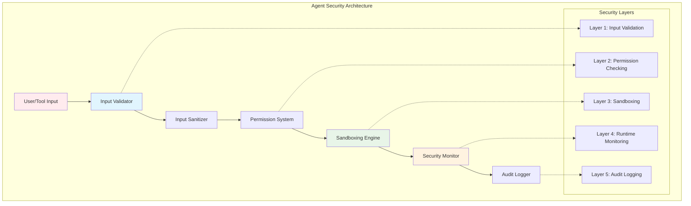
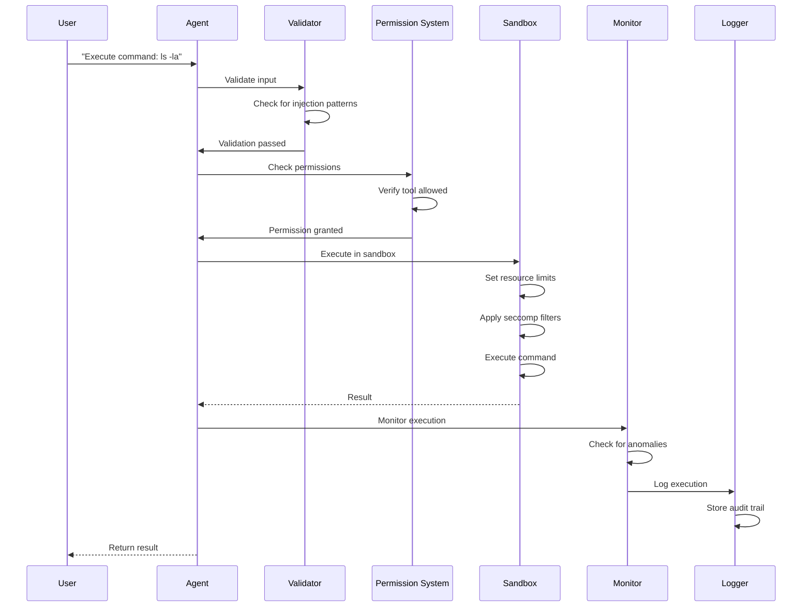

# 🔒 Security and Sandboxing for Agents

## Introduction
Security for AI agents represents one of the most critical challenges in the field of autonomous systems. As agents gain more capabilities through [[01 - The Model Context Protocol (MCP)|tool integration]] and [[03 - Autonomous OS Interaction|OS interaction]], the potential attack surface expands dramatically. Unlike traditional software, agents present unique security challenges because they can make autonomous decisions, execute arbitrary code, and access external systems.

The threat model for AI agents extends beyond traditional cybersecurity concerns. Prompt injection attacks can manipulate agent behavior, tool abuse can lead to unintended consequences, and data exfiltration can compromise sensitive information. These challenges require a multi-layered security approach that combines [[04 - Agent Orchestration and Reasoning Loops|reasoning constraints]], sandboxing technologies, and comprehensive monitoring.

Rust's memory safety guarantees and performance characteristics make it an ideal language for implementing security-critical agent components. The language's ownership model prevents common vulnerabilities like buffer overflows and use-after-free errors, while its performance enables real-time security monitoring without impacting agent functionality.

## 1. Threat Model for AI Agents

AI agents face unique threats that differ from traditional software systems. Understanding these threats is crucial for implementing effective security measures.

**Agent-Specific Threats:**

| Threat Type | Description | Impact | Likelihood | Mitigation |
|-------------|-------------|--------|------------|------------|
| **Prompt Injection** | Malicious input that alters agent behavior | High | High | Input validation, context separation |
| **Tool Abuse** | Misuse of legitimate tools for malicious purposes | High | Medium | Permission systems, sandboxing |
| **Data Exfiltration** | Unauthorized data access or transmission | Critical | Medium | Network restrictions, monitoring |
| **Resource Exhaustion** | Denial of service through resource consumption | Medium | High | Rate limiting, resource quotas |
| **Privilege Escalation** | Gaining unauthorized system access | Critical | Low | Sandboxing, principle of least privilege |
| **Supply Chain Attacks** | Compromised dependencies or tools | Critical | Medium | Dependency verification, isolation |
| **Adversarial Examples** | Inputs designed to fool the agent | High | Medium | Input validation, ensemble methods |
| **Goal Misdirection** | Subtle manipulation of agent objectives | High | Medium | Goal validation, human oversight |

**Attack Vectors:**
1. **Direct Injection**: Malicious user input containing instructions
2. **Indirect Injection**: Malicious content in tools or resources
3. **Multi-step Attacks**: Chaining multiple legitimate actions maliciously
4. **Environmental Attacks**: Manipulating the agent's environment
5. **Data Poisoning**: Corrupting training data or knowledge bases

Real case: How Anthropic restricts Claude's tool access. Anthropic implements multiple layers of security for Claude's tool usage including allowlists for approved tools, parameter validation, and sandboxed execution for sensitive operations. They also implement rate limiting and monitoring to detect unusual patterns.

⚠️ **Warning:** Never expose agent systems directly to the internet without comprehensive security measures. Attackers have demonstrated prompt injection attacks that can lead to arbitrary code execution, data theft, and system compromise.

💡 **Tip:** Implement "defense in depth" for agent security. No single security measure is sufficient—combine input validation, sandboxing, monitoring, and human oversight for comprehensive protection.

## 2. Sandboxing Technologies

Multiple sandboxing technologies provide different levels of isolation and security for agent execution.

**Sandboxing Technologies Comparison:**

| Technology | Isolation | Performance | Complexity | Use Case | Maturity |
|------------|-----------|-------------|------------|----------|----------|
| **Docker** | Very High | Medium | Low | Application containers | High |
| **gVisor** | Very High | Medium-High | Medium | Enhanced security | Medium |
| **Firecracker** | Very High | High | High | Serverless/VMs | Medium |
| **WASM** | Very High | High | Medium | Portable sandboxing | High |
| **seccomp** | High | Very High | High | System call filtering | High |
| **Namespaces** | High | High | Medium | Process isolation | High |
| **chroot** | Low | Very High | Low | Legacy systems | High |
| **Sandbox2** | Very High | High | High | Google's sandbox | Medium |

**Security Properties by Technology:**

| Property | Docker | gVisor | Firecracker | WASM | seccomp |
|----------|--------|--------|-------------|------|---------|
| **Filesystem Isolation** | Excellent | Excellent | Excellent | Excellent | Poor |
| **Network Isolation** | Excellent | Excellent | Excellent | Limited | Poor |
| **Process Isolation** | Excellent | Excellent | Excellent | Excellent | Limited |
| **Memory Safety** | Good | Excellent | Excellent | Excellent | N/A |
| **System Call Filtering** | Good | Excellent | Good | Excellent | Excellent |
| **Resource Limits** | Good | Good | Excellent | Limited | Limited |

## 3. Agent Security Layers Diagrams



**Figure 1:** Multi-layered security architecture for AI agents showing defense in depth.


**Figure 2:** Defense in depth strategy concept visualization.



**Figure 3:** Security flow showing validation, permission checking, sandboxing, and monitoring.

## 4. Permission Systems

Effective permission systems control what agents can and cannot do, providing granular security controls.

**Permission System Models:**

| Model | Granularity | Complexity | Flexibility | Example |
|-------|-------------|------------|-------------|---------|
| **Allowlist** | High | Low | Low | "Can only use tools A, B, C" |
| **Capability-based** | Very High | High | High | "Can read files but not write" |
| **Role-based** | Medium | Medium | Medium | "Developer role with tool access" |
| **Attribute-based** | Very High | Very High | Very High | "Based on time, user, context" |
| **User Approval** | High | Low | High | "Ask user for each action" |

**Capability-Based Security:**
Capability-based systems provide fine-grained control over agent actions. Each capability represents a specific permission that can be granted or revoked.

**Example Capabilities:**
- `file.read`: Read files from specific directories
- `file.write`: Write files to specific locations
- `command.execute`: Execute specific commands
- `network.http`: Make HTTP requests to specific domains
- `database.query`: Query specific databases

## 5. Permission System for Agent Tools

Here's a complete implementation of a permission system for agent tools in Rust.

```rust
use serde::{Deserialize, Serialize};
use std::collections::{HashMap, HashSet};
use std::path::{Path, PathBuf};
use std::sync::Arc;
use tokio::sync::RwLock;
use chrono::{DateTime, Utc};

#[derive(Debug, Clone, Serialize, Deserialize, PartialEq, Eq, Hash)]
pub struct Capability {
    pub domain: String,      // "file", "command", "network", "database"
    pub action: String,      // "read", "write", "execute", "query"
    pub resource: String,    // Specific resource pattern
    pub conditions: Vec<Condition>, // Additional conditions
}

#[derive(Debug, Clone, Serialize, Deserialize)]
pub struct Condition {
    pub condition_type: String,
    pub value: serde_json::Value,
}

#[derive(Debug, Clone, Serialize, Deserialize)]
pub struct AgentPermission {
    pub agent_id: String,
    pub capabilities: HashSet<Capability>,
    pub constraints: PermissionConstraints,
    pub expiration: Option<DateTime<Utc>>,
}

#[derive(Debug, Clone, Serialize, Deserialize)]
pub struct PermissionConstraints {
    pub max_operations_per_minute: u32,
    pub max_memory_mb: u64,
    pub max_execution_time_seconds: u64,
    pub allowed_network_ranges: Vec<String>,
    pub allowed_file_extensions: Vec<String>,
    pub allowed_commands: Vec<String>,
}

#[derive(Debug, Clone, Serialize, Deserialize)]
pub struct PermissionRequest {
    pub agent_id: String,
    pub capability: Capability,
    pub context: PermissionContext,
    pub timestamp: DateTime<Utc>,
}

#[derive(Debug, Clone, Serialize, Deserialize)]
pub struct PermissionContext {
    pub task_id: Option<String>,
    pub parent_capability: Option<Capability>,
    pub user_approval: bool,
    pub risk_level: RiskLevel,
    pub metadata: HashMap<String, String>,
}

#[derive(Debug, Clone, Serialize, Deserialize)]
pub enum RiskLevel {
    Low,
    Medium,
    High,
    Critical,
}

#[derive(Debug, Clone, Serialize, Deserialize)]
pub struct PermissionDecision {
    pub granted: bool,
    pub reason: Option<String>,
    pub conditions: Vec<String>,
    pub audit_id: String,
    pub expires_at: Option<DateTime<Utc>>,
}

pub struct PermissionSystem {
    permissions: RwLock<HashMap<String, AgentPermission>>,
    audit_log: RwLock<Vec<PermissionAudit>>,
    rate_limits: RwLock<HashMap<String, RateLimitTracker>>,
}

impl PermissionSystem {
    pub fn new() -> Self {
        Self {
            permissions: RwLock::new(HashMap::new()),
            audit_log: RwLock::new(Vec::new()),
            rate_limits: RwLock::new(HashMap::new()),
        }
    }
    
    pub async fn grant_capability(&self, agent_id: &str, capability: Capability, constraints: PermissionConstraints) -> Result<(), String> {
        let mut permissions = self.permissions.write().await;
        
        let permission = permissions.entry(agent_id.to_string()).or_insert_with(|| AgentPermission {
            agent_id: agent_id.to_string(),
            capabilities: HashSet::new(),
            constraints: constraints.clone(),
            expiration: None,
        });
        
        permission.capabilities.insert(capability);
        permission.constraints = constraints;
        
        Ok(())
    }
    
    pub async fn check_permission(&self, request: &PermissionRequest) -> PermissionDecision {
        let audit_id = uuid::Uuid::new_v4().to_string();
        
        // Check if agent has permission system configured
        let permissions = self.permissions.read().await;
        let agent_permission = match permissions.get(&request.agent_id) {
            Some(p) => p,
            None => {
                self.log_audit(&request, false, "No permissions configured", &audit_id).await;
                return PermissionDecision {
                    granted: false,
                    reason: Some("No permissions configured for agent".to_string()),
                    conditions: vec![],
                    audit_id,
                    expires_at: None,
                };
            }
        };
        
        // Check expiration
        if let Some(expiration) = agent_permission.expiration {
            if Utc::now() > expiration {
                self.log_audit(&request, false, "Permissions expired", &audit_id).await;
                return PermissionDecision {
                    granted: false,
                    reason: Some("Permissions have expired".to_string()),
                    conditions: vec![],
                    audit_id,
                    expires_at: None,
                };
            }
        }
        
        // Check rate limits
        if !self.check_rate_limit(&request.agent_id, &agent_permission.constraints).await {
            self.log_audit(&request, false, "Rate limit exceeded", &audit_id).await;
            return PermissionDecision {
                granted: false,
                reason: Some("Rate limit exceeded".to_string()),
                conditions: vec!["Wait before retrying".to_string()],
                audit_id,
                expires_at: None,
            };
        }
        
        // Check if capability is granted
        let has_capability = agent_permission.capabilities.iter().any(|cap| {
            self.capability_matches(cap, &request.capability)
        });
        
        if !has_capability {
            self.log_audit(&request, false, "Capability not granted", &audit_id).await;
            return PermissionDecision {
                granted: false,
                reason: Some("Capability not granted to agent".to_string()),
                conditions: vec![],
                audit_id,
                expires_at: None,
            };
        }
        
        // Check risk level requirements
        if !self.check_risk_level(&request.context.risk_level, &request.context.user_approval) {
            self.log_audit(&request, false, "Risk level requires approval", &audit_id).await;
            return PermissionDecision {
                granted: false,
                reason: Some("High-risk operation requires user approval".to_string()),
                conditions: vec!["Request user approval".to_string()],
                audit_id,
                expires_at: None,
            };
        }
        
        // All checks passed
        let conditions = self.generate_conditions(&request.capability, &agent_permission.constraints);
        self.log_audit(&request, true, "Permission granted", &audit_id).await;
        
        PermissionDecision {
            granted: true,
            reason: None,
            conditions,
            audit_id,
            expires_at: Some(Utc::now() + chrono::Duration::minutes(5)),
        }
    }
    
    fn capability_matches(&self, granted: &Capability, requested: &Capability) -> bool {
        // Simple pattern matching - in production, use more sophisticated matching
        granted.domain == requested.domain &&
        granted.action == requested.action &&
        (granted.resource == "*" || granted.resource == requested.resource)
    }
    
    async fn check_rate_limit(&self, agent_id: &str, constraints: &PermissionConstraints) -> bool {
        let mut rate_limits = self.rate_limits.write().await;
        let tracker = rate_limits.entry(agent_id.to_string()).or_insert_with(|| RateLimitTracker {
            operations: Vec::new(),
            max_operations_per_minute: constraints.max_operations_per_minute,
        });
        
        let now = Utc::now();
        let one_minute_ago = now - chrono::Duration::minutes(1);
        
        // Remove old operations
        tracker.operations.retain(|&t| t > one_minute_ago);
        
        if tracker.operations.len() >= tracker.max_operations_per_minute as usize {
            return false;
        }
        
        tracker.operations.push(now);
        true
    }
    
    fn check_risk_level(&self, risk_level: &RiskLevel, user_approval: &bool) -> bool {
        match risk_level {
            RiskLevel::Low => true,
            RiskLevel::Medium => true,
            RiskLevel::High => *user_approval,
            RiskLevel::Critical => *user_approval,
        }
    }
    
    fn generate_conditions(&self, capability: &Capability, constraints: &PermissionConstraints) -> Vec<String> {
        let mut conditions = Vec::new();
        
        match capability.domain.as_str() {
            "file" => {
                if !constraints.allowed_file_extensions.is_empty() {
                    conditions.push(format!(
                        "Only files with extensions: {}",
                        constraints.allowed_file_extensions.join(", ")
                    ));
                }
            }
            "command" => {
                if !constraints.allowed_commands.is_empty() {
                    conditions.push(format!(
                        "Only commands: {}",
                        constraints.allowed_commands.join(", ")
                    ));
                }
                conditions.push(format!(
                    "Max execution time: {} seconds",
                    constraints.max_execution_time_seconds
                ));
            }
            "network" => {
                if !constraints.allowed_network_ranges.is_empty() {
                    conditions.push(format!(
                        "Only network ranges: {}",
                        constraints.allowed_network_ranges.join(", ")
                    ));
                }
            }
            _ => {}
        }
        
        conditions
    }
    
    async fn log_audit(&self, request: &PermissionRequest, granted: bool, reason: &str, audit_id: &str) {
        let audit = PermissionAudit {
            audit_id: audit_id.to_string(),
            agent_id: request.agent_id.clone(),
            capability: request.capability.clone(),
            granted,
            reason: reason.to_string(),
            timestamp: Utc::now(),
            context: request.context.clone(),
        };
        
        self.audit_log.write().await.push(audit);
    }
    
    pub async fn get_audit_log(&self, agent_id: Option<&str>) -> Vec<PermissionAudit> {
        let audit_log = self.audit_log.read().await;
        
        match agent_id {
            Some(id) => audit_log.iter()
                .filter(|audit| audit.agent_id == id)
                .cloned()
                .collect(),
            None => audit_log.clone(),
        }
    }
    
    pub async fn revoke_capability(&self, agent_id: &str, capability: &Capability) -> Result<(), String> {
        let mut permissions = self.permissions.write().await;
        
        if let Some(permission) = permissions.get_mut(agent_id) {
            permission.capabilities.retain(|cap| !self.capability_matches(cap, capability));
            Ok(())
        } else {
            Err(format!("Agent {} not found", agent_id))
        }
    }
    
    pub async fn revoke_all(&self, agent_id: &str) -> Result<(), String> {
        let mut permissions = self.permissions.write().await;
        
        if permissions.remove(agent_id).is_some() {
            Ok(())
        } else {
            Err(format!("Agent {} not found", agent_id))
        }
    }
    
    pub async fn get_agent_capabilities(&self, agent_id: &str) -> Option<HashSet<Capability>> {
        let permissions = self.permissions.read().await;
        permissions.get(agent_id).map(|p| p.capabilities.clone())
    }
}

#[derive(Debug, Clone, Serialize, Deserialize)]
pub struct PermissionAudit {
    pub audit_id: String,
    pub agent_id: String,
    pub capability: Capability,
    pub granted: bool,
    pub reason: String,
    pub timestamp: DateTime<Utc>,
    pub context: PermissionContext,
}

struct RateLimitTracker {
    operations: Vec<DateTime<Utc>>,
    max_operations_per_minute: u32,
}

// Example usage
#[tokio::main]
async fn main() -> Result<(), Box<dyn std::error::Error>> {
    let permission_system = Arc::new(PermissionSystem::new());
    
    // Grant capabilities to an agent
    let file_read_capability = Capability {
        domain: "file".to_string(),
        action: "read".to_string(),
        resource: "/home/user/documents/*".to_string(),
        conditions: vec![],
    };
    
    let command_execute_capability = Capability {
        domain: "command".to_string(),
        action: "execute".to_string(),
        resource: "ls, cat, head, tail".to_string(),
        conditions: vec![],
    };
    
    let constraints = PermissionConstraints {
        max_operations_per_minute: 10,
        max_memory_mb: 512,
        max_execution_time_seconds: 30,
        allowed_network_ranges: vec![],
        allowed_file_extensions: vec!["txt".to_string(), "md".to_string(), "json".to_string()],
        allowed_commands: vec!["ls".to_string(), "cat".to_string(), "head".to_string(), "tail".to_string()],
    };
    
    permission_system.grant_capability("agent_1", file_read_capability, constraints.clone()).await?;
    permission_system.grant_capability("agent_1", command_execute_capability, constraints).await?;
    
    // Check permissions
    let read_request = PermissionRequest {
        agent_id: "agent_1".to_string(),
        capability: Capability {
            domain: "file".to_string(),
            action: "read".to_string(),
            resource: "/home/user/documents/readme.md".to_string(),
            conditions: vec![],
        },
        context: PermissionContext {
            task_id: Some("task_123".to_string()),
            parent_capability: None,
            user_approval: false,
            risk_level: RiskLevel::Low,
            metadata: HashMap::new(),
        },
        timestamp: Utc::now(),
    };
    
    let decision = permission_system.check_permission(&read_request).await;
    println!("File read permission: {}", if decision.granted { "✓ Granted" } else { "✗ Denied" });
    
    // Try dangerous command (should be denied)
    let dangerous_request = PermissionRequest {
        agent_id: "agent_1".to_string(),
        capability: Capability {
            domain: "command".to_string(),
            action: "execute".to_string(),
            resource: "rm".to_string(),
            conditions: vec![],
        },
        context: PermissionContext {
            task_id: Some("task_123".to_string()),
            parent_capability: None,
            user_approval: false,
            risk_level: RiskLevel::High,
            metadata: HashMap::new(),
        },
        timestamp: Utc::now(),
    };
    
    let decision = permission_system.check_permission(&dangerous_request).await;
    println!("Dangerous command permission: {}", if decision.granted { "✓ Granted" } else { "✗ Denied" });
    
    // Get audit log
    let audit_log = permission_system.get_audit_log(Some("agent_1")).await;
    println!("Audit log entries: {}", audit_log.len());
    
    for audit in &audit_log {
        println!("  {}: {} - {}", audit.timestamp, audit.capability.action, audit.reason);
    }
    
    Ok(())
}
```

## 📦 Compression Code

```rust
// Security Event Compression - Compresses security audit logs
use snap::raw::{Encoder, Decoder};
use serde::{Deserialize, Serialize};
use std::io::{Read, Write};

#[derive(Debug, Clone)]
pub struct SecurityEventCompressor {
    encoder: Encoder,
    decoder: Decoder,
}

impl SecurityEventCompressor {
    pub fn new() -> Self {
        Self {
            encoder: Encoder::new(),
            decoder: Decoder::new(),
        }
    }
    
    pub fn compress_audit_log(&self, audit_log: &[PermissionAudit]) -> Result<Vec<u8>, String> {
        let json = serde_json::to_string(audit_log)
            .map_err(|e| format!("Serialization error: {}", e))?;
        
        let compressed = self.encoder.compress_vec(json.as_bytes())
            .map_err(|e| format!("Compression error: {}", e))?;
        
        Ok(compressed)
    }
    
    pub fn decompress_audit_log(&self, data: &[u8]) -> Result<Vec<PermissionAudit>, String> {
        let decompressed = self.decoder.decompress_vec(data)
            .map_err(|e| format!("Decompression error: {}", e))?;
        
        let json = String::from_utf8(decompressed)
            .map_err(|e| format!("UTF-8 error: {}", e))?;
        
        serde_json::from_str(&json)
            .map_err(|e| format!("Deserialization error: {}", e))
    }
    
    pub fn compress_security_events(&self, events: &[SecurityEvent]) -> Result<Vec<u8>, String> {
        let json = serde_json::to_string(events)
            .map_err(|e| format!("Serialization error: {}", e))?;
        
        let compressed = self.encoder.compress_vec(json.as_bytes())
            .map_err(|e| format!("Compression error: {}", e))?;
        
        Ok(compressed)
    }
    
    pub fn decompress_security_events(&self, data: &[u8]) -> Result<Vec<SecurityEvent>, String> {
        let decompressed = self.decoder.decompress_vec(data)
            .map_err(|e| format!("Decompression error: {}", e))?;
        
        let json = String::from_utf8(decompressed)
            .map_err(|e| format!("UTF-8 error: {}", e))?;
        
        serde_json::from_str(&json)
            .map_err(|e| format!("Deserialization error: {}", e))
    }
    
    pub fn calculate_compression_stats(&self, original: &[PermissionAudit], compressed: &[u8]) -> CompressionStats {
        let original_size = serde_json::to_string(original).unwrap().len();
        let compressed_size = compressed.len();
        
        CompressionStats {
            original_size,
            compressed_size,
            compression_ratio: compressed_size as f64 / original_size as f64,
            space_savings: (1.0 - compressed_size as f64 / original_size as f64) * 100.0,
        }
    }
}

#[derive(Debug, Clone, Serialize, Deserialize)]
pub struct SecurityEvent {
    pub event_id: String,
    pub event_type: String,
    pub severity: String,
    pub description: String,
    pub timestamp: DateTime<Utc>,
    pub agent_id: Option<String>,
    pub metadata: HashMap<String, String>,
}

#[derive(Debug, Serialize, Deserialize)]
pub struct CompressionStats {
    pub original_size: usize,
    pub compressed_size: usize,
    pub compression_ratio: f64,
    pub space_savings: f64,
}
```

