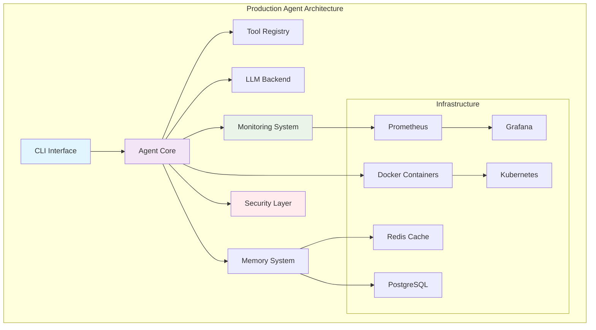
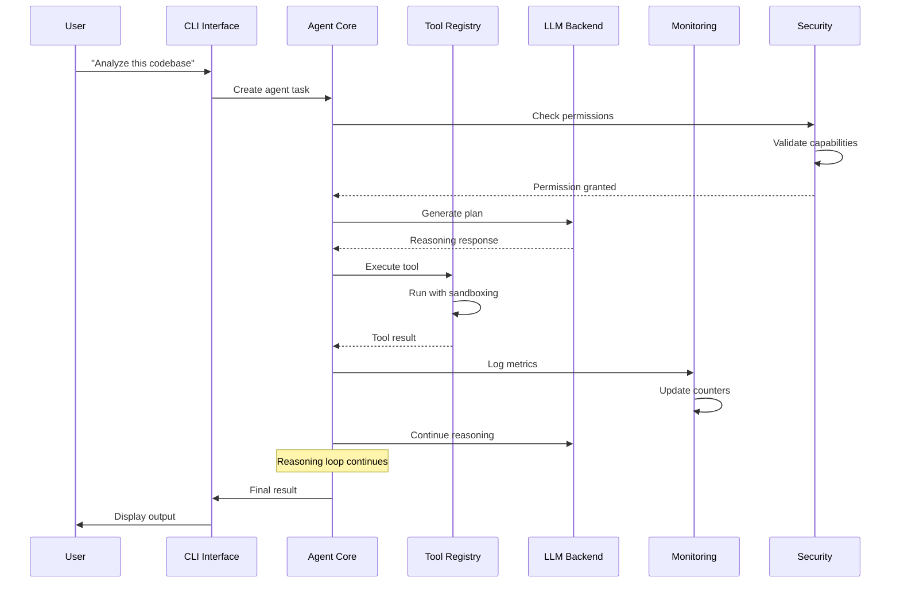

# 🏭 Building a Production-Ready AI Agent

## Introduction
Building a production-ready AI agent requires moving beyond proof-of-concept implementations to robust, scalable systems that can handle real-world demands. This involves not just the core [[04 - Agent Orchestration and Reasoning Loops|reasoning and orchestration]] logic, but also comprehensive infrastructure for logging, monitoring, error recovery, and deployment. The transition from research prototype to production system requires careful consideration of reliability, maintainability, and operational concerns.

Production agents must integrate seamlessly with existing systems while maintaining security through [[05 - Security and Sandboxing for Agents|proper sandboxing]] and permission systems. They need to handle partial failures gracefully, provide clear debugging information, and operate within cost constraints. The architecture must support scaling from single instances to distributed deployments while maintaining consistency and reliability.

Rust's performance characteristics, memory safety guarantees, and excellent error handling make it an ideal language for building production agent systems. The language's zero-cost abstractions enable high-performance agent execution while preventing entire classes of bugs that could compromise production deployments.

## 1. Production Architecture

A production-ready agent system requires a layered architecture that separates concerns and enables independent scaling and maintenance.

**Architecture Components:**

| Component | Responsibility | Scaling Strategy | Technology Stack |
|-----------|----------------|------------------|------------------|
| **CLI Interface** | User interaction | Horizontal | Rust, clap |
| **Agent Core** | Reasoning and planning | Horizontal | Rust, async/await |
| **Tool Registry** | Tool management | Horizontal | Rust, plugins |
| **LLM Backend** | Model inference | Horizontal | API clients, caching |
| **Memory System** | State persistence | Vertical | Redis, PostgreSQL |
| **Monitoring** | Metrics and logging | Horizontal | Prometheus, Grafana |
| **Security** | Sandboxing and permissions | Horizontal | Docker, seccomp |
| **Deployment** | Container orchestration | Horizontal | Docker, Kubernetes |

**Deployment Options Comparison:**

| Option | Complexity | Scalability | Cost | Use Case |
|--------|------------|-------------|------|----------|
| **Docker Containers** | Low | High | Medium | Most production workloads |
| **Systemd Services** | Very Low | Low | Very Low | Simple deployments |
| **Cloud Functions** | Medium | Very High | Variable | Event-driven workloads |
| **Kubernetes** | High | Very High | High | Enterprise deployments |
| **VMs** | Medium | Medium | High | Legacy integration |
| **Bare Metal** | High | Low | High | Performance-critical |

Real case: How Cursor IDE integrates agents for code editing. Cursor, an AI-powered code editor, integrates agent capabilities for code completion, refactoring, and debugging. The system handles millions of requests daily with sub-second response times through careful architecture, caching, and incremental updates. Their production deployment focuses on latency optimization and graceful degradation.

⚠️ **Warning:** Production agents must implement comprehensive rate limiting and cost controls. Uncontrolled agent execution can lead to massive LLM API bills and resource exhaustion. Always implement budget limits and monitoring.

💡 **Tip:** Start with a simpler architecture and add complexity only when needed. Many production issues come from over-engineering. A well-designed monolithic agent with good monitoring often outperforms a complex distributed system.

## 2. Feature Implementation

Production agents require several key features beyond core reasoning capabilities.

**Essential Features:**

| Feature | Purpose | Implementation | Importance |
|---------|---------|----------------|------------|
| **Structured Logging** | Debugging and monitoring | tracing, slog | Critical |
| **Retry Logic** | Error recovery | exponential backoff | Critical |
| **Rate Limiting** | Resource protection | token bucket | High |
| **Cost Tracking** | Budget management | usage monitoring | High |
| **Metrics Collection** | Performance monitoring | Prometheus | High |
| **Health Checks** | System reliability | HTTP endpoints | Medium |
| **Configuration** | Flexibility | TOML/JSON | Medium |
| **Feature Flags** | Gradual rollout | environment vars | Medium |

**Error Handling Strategy:**

| Error Type | Detection | Recovery Strategy | Alert Level |
|------------|-----------|-------------------|-------------|
| **LLM API Failure** | HTTP status code | Retry with backoff | Warning |
| **Tool Execution Failure** | Non-zero exit code | Retry or alternative | Warning |
| **Network Timeout** | Timeout exceeded | Retry with shorter timeout | Warning |
| **Resource Exhaustion** | Memory/CPU limits | Graceful degradation | Error |
| **Security Violation** | Permission check | Block and alert | Critical |
| **Data Corruption** | Checksum validation | Restore from backup | Critical |

## 3. Production Architecture Diagrams



**Figure 1:** Production agent architecture showing components and infrastructure integration.


**Figure 2:** Container-based deployment architecture concept.



**Figure 3:** Request flow through production agent system with security and monitoring.

## 4. Production Readiness Checklist

A comprehensive checklist ensures agents meet production standards.

**Production Readiness Checklist:**

| Category | Item | Status | Priority | Notes |
|----------|------|--------|----------|-------|
| **Reliability** | Error handling | ⬜ | Critical | All error paths handled |
| **Reliability** | Retry logic | ⬜ | Critical | Exponential backoff implemented |
| **Reliability** | Timeout handling | ⬜ | High | All operations have timeouts |
| **Performance** | Rate limiting | ⬜ | Critical | API calls rate limited |
| **Performance** | Caching | ⬜ | High | LLM responses cached |
| **Performance** | Connection pooling | ⬜ | Medium | Database connections pooled |
| **Security** | Input validation | ⬜ | Critical | All inputs validated |
| **Security** | Sandboxing | ⬜ | Critical | Tool execution sandboxed |
| **Security** | Audit logging | ⬜ | High | All actions logged |
| **Observability** | Metrics | ⬜ | High | Prometheus metrics exposed |
| **Observability** | Logging | ⬜ | Critical | Structured logging implemented |
| **Observability** | Tracing | ⬜ | Medium | Distributed tracing enabled |
| **Deployment** | Health checks | ⬜ | High | HTTP health endpoints |
| **Deployment** | Graceful shutdown | ⬜ | High | SIGTERM handling |
| **Deployment** | Configuration | ⬜ | Medium | External configuration |

**ROI Calculation Formula:**
```
Agent_ROI = Value_Created / (Compute_Cost + Development_Cost)
```

Where:
- **Value_Created**: Time saved, errors prevented, revenue generated
- **Compute_Cost**: LLM API costs, infrastructure costs
- **Development_Cost**: Engineering time, maintenance overhead

A successful production agent should achieve ROI > 3.0 within 6 months.

## 5. Complete Production Agent CLI

Here's a complete implementation of a production-ready AI agent CLI in Rust.

```rust
use clap::{Parser, Subcommand};
use serde::{Deserialize, Serialize};
use std::collections::HashMap;
use std::path::PathBuf;
use std::sync::Arc;
use tokio::sync::RwLock;
use tracing::{info, warn, error, debug};
use chrono::{DateTime, Utc};
use uuid::Uuid;

#[derive(Parser)]
#[command(name = "ai-agent")]
#[command(about = "A production-ready AI agent CLI", long_about = None)]
struct Cli {
    #[command(subcommand)]
    command: Commands,
    
    /// Configuration file path
    #[arg(short, long, default_value = "agent.toml")]
    config: PathBuf,
    
    /// Enable verbose logging
    #[arg(short, long)]
    verbose: bool,
    
    /// Dry run mode
    #[arg(long)]
    dry_run: bool,
}

#[derive(Subcommand)]
enum Commands {
    /// Execute a task
    Run {
        /// Task description
        task: String,
        
        /// Maximum iterations
        #[arg(short, long, default_value_t = 10)]
        max_iterations: u32,
        
        /// Output format
        #[arg(short, long, default_value = "text")]
        format: String,
    },
    /// List available tools
    Tools {
        /// Filter by category
        #[arg(short, long)]
        filter: Option<String>,
    },
    /// Show agent status
    Status,
    /// Manage configuration
    Config {
        #[command(subcommand)]
        command: ConfigCommands,
    },
    /// Run benchmarks
    Benchmark {
        /// Benchmark name
        name: String,
        
        /// Number of iterations
        #[arg(short, long, default_value_t = 100)]
        iterations: u32,
    },
}

#[derive(Subcommand)]
enum ConfigCommands {
    /// Show current configuration
    Show,
    /// Update configuration
    Set {
        /// Configuration key
        key: String,
        /// Configuration value
        value: String,
    },
    /// Validate configuration
    Validate,
}

#[derive(Debug, Clone, Serialize, Deserialize)]
pub struct AgentConfig {
    pub name: String,
    pub version: String,
    pub llm: LlmConfig,
    pub tools: ToolConfig,
    pub security: SecurityConfig,
    pub monitoring: MonitoringConfig,
    pub deployment: DeploymentConfig,
}

#[derive(Debug, Clone, Serialize, Deserialize)]
pub struct LlmConfig {
    pub provider: String,
    pub model: String,
    pub api_key_env: String,
    pub max_tokens: u32,
    pub temperature: f32,
    pub timeout_seconds: u64,
    pub retry_attempts: u32,
}

#[derive(Debug, Clone, Serialize, Deserialize)]
pub struct ToolConfig {
    pub enabled_tools: Vec<String>,
    pub sandbox_enabled: bool,
    pub max_execution_time_seconds: u64,
    pub allowed_network_ranges: Vec<String>,
}

#[derive(Debug, Clone, Serialize, Deserialize)]
pub struct SecurityConfig {
    pub permission_system_enabled: bool,
    pub audit_logging: bool,
    pub sandbox_type: String,
    pub rate_limit_per_minute: u32,
}

#[derive(Debug, Clone, Serialize, Deserialize)]
pub struct MonitoringConfig {
    pub metrics_enabled: bool,
    pub metrics_port: u16,
    pub logging_level: String,
    pub tracing_enabled: bool,
    pub health_check_port: u16,
}

#[derive(Debug, Clone, Serialize, Deserialize)]
pub struct DeploymentConfig {
    pub environment: String,
    pub log_dir: PathBuf,
    pub data_dir: PathBuf,
    pub config_dir: PathBuf,
}

#[derive(Debug, Clone, Serialize, Deserialize)]
pub struct AgentMetrics {
    pub agent_id: String,
    pub start_time: DateTime<Utc>,
    pub total_tasks: u64,
    pub successful_tasks: u64,
    pub failed_tasks: u64,
    pub total_iterations: u64,
    pub total_tokens_used: u64,
    pub total_cost_cents: u64,
    pub average_latency_ms: f64,
    pub last_error: Option<String>,
}

pub struct ProductionAgent {
    config: AgentConfig,
    metrics: RwLock<AgentMetrics>,
    tool_registry: Arc<ToolRegistry>,
    llm_client: Arc<LlmClient>,
    security_system: Arc<SecuritySystem>,
    monitoring_system: Arc<MonitoringSystem>,
}

impl ProductionAgent {
    pub async fn new(config: AgentConfig) -> Result<Self, Box<dyn std::error::Error>> {
        // Initialize monitoring
        let monitoring_system = Arc::new(MonitoringSystem::new(&config.monitoring).await?);
        
        // Initialize security
        let security_system = Arc::new(SecuritySystem::new(&config.security).await?);
        
        // Initialize tool registry
        let tool_registry = Arc::new(ToolRegistry::new(&config.tools).await?);
        
        // Initialize LLM client
        let llm_client = Arc::new(LlmClient::new(&config.llm).await?);
        
        let metrics = RwLock::new(AgentMetrics {
            agent_id: Uuid::new_v4().to_string(),
            start_time: Utc::now(),
            total_tasks: 0,
            successful_tasks: 0,
            failed_tasks: 0,
            total_iterations: 0,
            total_tokens_used: 0,
            total_cost_cents: 0,
            average_latency_ms: 0.0,
            last_error: None,
        });
        
        Ok(Self {
            config,
            metrics,
            tool_registry,
            llm_client,
            security_system,
            monitoring_system,
        })
    }
    
    pub async fn execute_task(&self, task: &str, max_iterations: u32, dry_run: bool) -> Result<TaskResult, Box<dyn std::error::Error>> {
        let task_id = Uuid::new_v4().to_string();
        let start_time = std::time::Instant::now();
        
        info!("Starting task execution: {}", task_id);
        
        // Update metrics
        {
            let mut metrics = self.metrics.write().await;
            metrics.total_tasks += 1;
        }
        
        if dry_run {
            info!("Dry run mode - task would be executed: {}", task);
            return Ok(TaskResult {
                task_id,
                success: true,
                output: format!("Dry run: Task would be executed: {}", task),
                iterations: 0,
                tokens_used: 0,
                cost_cents: 0,
                execution_time_ms: 0,
                steps: vec![],
                error: None,
            });
        }
        
        // Check permissions
        let permission_check = self.security_system.check_task_permission(task).await?;
        if !permission_check.allowed {
            warn!("Task permission denied: {}", permission_check.reason);
            return Ok(TaskResult {
                task_id,
                success: false,
                output: String::new(),
                iterations: 0,
                tokens_used: 0,
                cost_cents: 0,
                execution_time_ms: start_time.elapsed().as_millis() as u64,
                steps: vec![],
                error: Some(format!("Permission denied: {}", permission_check.reason)),
            });
        }
        
        // Execute task with retry logic
        let mut last_error = None;
        let max_retries = self.config.llm.retry_attempts;
        
        for attempt in 0..=max_retries {
            match self.execute_task_attempt(task, task_id.clone(), max_iterations).await {
                Ok(result) => {
                    let execution_time = start_time.elapsed().as_millis() as u64;
                    
                    // Update metrics
                    {
                        let mut metrics = self.metrics.write().await;
                        metrics.successful_tasks += 1;
                        metrics.total_iterations += result.iterations as u64;
                        metrics.total_tokens_used += result.tokens_used as u64;
                        metrics.total_cost_cents += result.cost_cents as u64;
                        metrics.average_latency_ms = (metrics.average_latency_ms * (metrics.successful_tasks - 1) as f64 + execution_time as f64) / metrics.successful_tasks as f64;
                    }
                    
                    // Record metrics
                    self.monitoring_system.record_task_execution(&result).await?;
                    
                    info!("Task completed successfully: {} in {}ms", task_id, execution_time);
                    return Ok(result);
                }
                Err(e) => {
                    last_error = Some(e);
                    if attempt < max_retries {
                        warn!("Task attempt {} failed, retrying: {}", attempt + 1, last_error.as_ref().unwrap());
                        tokio::time::sleep(tokio::time::Duration::from_millis(100 * 2u64.pow(attempt as u32))).await;
                    }
                }
            }
        }
        
        // All attempts failed
        let error_msg = last_error.unwrap_or_else(|| "Unknown error".to_string());
        error!("Task failed after {} attempts: {}", max_retries + 1, error_msg);
        
        // Update metrics
        {
            let mut metrics = self.metrics.write().await;
            metrics.failed_tasks += 1;
            metrics.last_error = Some(error_msg.clone());
        }
        
        Ok(TaskResult {
            task_id,
            success: false,
            output: String::new(),
            iterations: 0,
            tokens_used: 0,
            cost_cents: 0,
            execution_time_ms: start_time.elapsed().as_millis() as u64,
            steps: vec![],
            error: Some(error_msg),
        })
    }
    
    async fn execute_task_attempt(&self, task: &str, task_id: String, max_iterations: u32) -> Result<TaskResult, String> {
        let mut iterations = 0;
        let mut total_tokens = 0u64;
        let mut total_cost = 0u64;
        let mut steps = Vec::new();
        
        // Initialize agent state
        let mut state = AgentState::new(task);
        
        while iterations < max_iterations {
            iterations += 1;
            
            debug!("Iteration {}/{} for task {}", iterations, max_iterations, task_id);
            
            // Generate reasoning step
            let reasoning_response = self.llm_client.reason(&state).await
                .map_err(|e| format!("LLM reasoning failed: {}", e))?;
            
            total_tokens += reasoning_response.tokens_used as u64;
            total_cost += reasoning_response.cost_cents as u64;
            
            // Record step
            let step = ExecutionStep {
                iteration: iterations,
                thought: reasoning_response.thought.clone(),
                action: reasoning_response.action.clone(),
                result: None,
                timestamp: Utc::now(),
            };
            
            // Execute action if present
            if let Some(action) = &reasoning_response.action {
                let tool_result = self.tool_registry.execute_action(action).await
                    .map_err(|e| format!("Tool execution failed: {}", e))?;
                
                // Update step with result
                let mut completed_step = step.clone();
                completed_step.result = Some(tool_result.clone());
                steps.push(completed_step);
                
                // Update state
                state.add_observation(&tool_result.output);
                
                // Check for completion
                if tool_result.output.contains("TASK_COMPLETE") {
                    return Ok(TaskResult {
                        task_id,
                        success: true,
                        output: tool_result.output,
                        iterations,
                        tokens_used: total_tokens,
                        cost_cents: total_cost,
                        execution_time_ms: 0, // Will be set by caller
                        steps,
                        error: None,
                    });
                }
            } else {
                steps.push(step);
                
                // No action means final answer
                return Ok(TaskResult {
                    task_id,
                    success: true,
                    output: reasoning_response.thought,
                    iterations,
                    tokens_used: total_tokens,
                    cost_cents: total_cost,
                    execution_time_ms: 0, // Will be set by caller
                    steps,
                    error: None,
                });
            }
        }
        
        Err(format!("Maximum iterations ({}) reached without completion", max_iterations))
    }
    
    pub async fn get_metrics(&self) -> AgentMetrics {
        self.metrics.read().await.clone()
    }
    
    pub async fn get_status(&self) -> AgentStatus {
        let metrics = self.metrics.read().await;
        
        AgentStatus {
            agent_id: metrics.agent_id.clone(),
            uptime_seconds: (Utc::now() - metrics.start_time).num_seconds() as u64,
            total_tasks: metrics.total_tasks,
            success_rate: if metrics.total_tasks > 0 {
                metrics.successful_tasks as f64 / metrics.total_tasks as f64
            } else {
                0.0
            },
            average_latency_ms: metrics.average_latency_ms,
            total_cost_cents: metrics.total_cost_cents,
            last_error: metrics.last_error.clone(),
            healthy: true, // Would check various health indicators
        }
    }
}

#[derive(Debug, Clone, Serialize, Deserialize)]
pub struct TaskResult {
    pub task_id: String,
    pub success: bool,
    pub output: String,
    pub iterations: u32,
    pub tokens_used: u64,
    pub cost_cents: u64,
    pub execution_time_ms: u64,
    pub steps: Vec<ExecutionStep>,
    pub error: Option<String>,
}

#[derive(Debug, Clone, Serialize, Deserialize)]
pub struct ExecutionStep {
    pub iteration: u32,
    pub thought: String,
    pub action: Option<String>,
    pub result: Option<ToolResult>,
    pub timestamp: DateTime<Utc>,
}

#[derive(Debug, Clone, Serialize, Deserialize)]
pub struct ToolResult {
    pub success: bool,
    pub output: String,
    pub error: Option<String>,
    pub execution_time_ms: u64,
}

#[derive(Debug, Clone, Serialize, Deserialize)]
pub struct AgentStatus {
    pub agent_id: String,
    pub uptime_seconds: u64,
    pub total_tasks: u64,
    pub success_rate: f64,
    pub average_latency_ms: f64,
    pub total_cost_cents: u64,
    pub last_error: Option<String>,
    pub healthy: bool,
}

struct AgentState {
    task: String,
    observations: Vec<String>,
    context: HashMap<String, String>,
}

impl AgentState {
    fn new(task: &str) -> Self {
        Self {
            task: task.to_string(),
            observations: Vec::new(),
            context: HashMap::new(),
        }
    }
    
    fn add_observation(&mut self, observation: &str) {
        self.observations.push(observation.to_string());
    }
}

// Mock implementations for demonstration
struct ToolRegistry {
    tools: HashMap<String, Box<dyn Tool>>,
}

impl ToolRegistry {
    async fn new(config: &ToolConfig) -> Result<Self, String> {
        let mut tools = HashMap::new();
        
        // Register mock tools
        tools.insert("calculator".to_string(), Box::new(CalculatorTool) as Box<dyn Tool>);
        tools.insert("file_read".to_string(), Box::new(FileReadTool) as Box<dyn Tool>);
        
        Ok(Self { tools })
    }
    
    async fn execute_action(&self, action: &str) -> Result<ToolResult, String> {
        // Parse action and execute appropriate tool
        Ok(ToolResult {
            success: true,
            output: format!("Action executed: {}", action),
            error: None,
            execution_time_ms: 100,
        })
    }
}

trait Tool: Send + Sync {
    fn name(&self) -> &str;
    fn execute(&self, params: &str) -> Result<ToolResult, String>;
}

struct CalculatorTool;

impl Tool for CalculatorTool {
    fn name(&self) -> &str {
        "calculator"
    }
    
    fn execute(&self, params: &str) -> Result<ToolResult, String> {
        Ok(ToolResult {
            success: true,
            output: format!("Calculated: {}", params),
            error: None,
            execution_time_ms: 10,
        })
    }
}

struct FileReadTool;

impl Tool for FileReadTool {
    fn name(&self) -> &str {
        "file_read"
    }
    
    fn execute(&self, params: &str) -> Result<ToolResult, String> {
        Ok(ToolResult {
            success: true,
            output: format!("File content: {}", params),
            error: None,
            execution_time_ms: 50,
        })
    }
}

struct LlmClient {
    config: LlmConfig,
}

impl LlmClient {
    async fn new(config: &LlmConfig) -> Result<Self, String> {
        Ok(Self {
            config: config.clone(),
        })
    }
    
    async fn reason(&self, state: &AgentState) -> Result<LlmResponse, String> {
        // Mock LLM response
        Ok(LlmResponse {
            thought: format!("Analyzing task: {}", state.task),
            action: Some("execute calculator with '2 + 2'".to_string()),
            tokens_used: 100,
            cost_cents: 1,
        })
    }
}

struct LlmResponse {
    thought: String,
    action: Option<String>,
    tokens_used: u32,
    cost_cents: u32,
}

struct SecuritySystem {
    config: SecurityConfig,
}

impl SecuritySystem {
    async fn new(config: &SecurityConfig) -> Result<Self, String> {
        Ok(Self {
            config: config.clone(),
        })
    }
    
    async fn check_task_permission(&self, task: &str) -> Result<PermissionCheck, String> {
        // Mock permission check
        Ok(PermissionCheck {
            allowed: true,
            reason: "Task is allowed".to_string(),
        })
    }
}

struct PermissionCheck {
    allowed: bool,
    reason: String,
}

struct MonitoringSystem {
    config: MonitoringConfig,
}

impl MonitoringSystem {
    async fn new(config: &MonitoringConfig) -> Result<Self, String> {
        Ok(Self {
            config: config.clone(),
        })
    }
    
    async fn record_task_execution(&self, result: &TaskResult) -> Result<(), String> {
        // Record metrics
        Ok(())
    }
}

#[tokio::main]
async fn main() -> Result<(), Box<dyn std::error::Error>> {
    // Initialize tracing
    tracing_subscriber::fmt::init();
    
    let cli = Cli::parse();
    
    // Load configuration
    let config = load_config(&cli.config).await?;
    
    // Create agent
    let agent = ProductionAgent::new(config).await?;
    
    match cli.command {
        Commands::Run { task, max_iterations, format } => {
            let result = agent.execute_task(&task, max_iterations, cli.dry_run).await?;
            
            match format.as_str() {
                "json" => println!("{}", serde_json::to_string_pretty(&result)?),
                "text" => {
                    println!("Task: {}", task);
                    println!("Success: {}", result.success);
                    println!("Iterations: {}", result.iterations);
                    println!("Tokens: {}", result.tokens_used);
                    println!("Cost: ${:.2}", result.cost_cents as f64 / 100.0);
                    println!("Output: {}", result.output);
                }
                _ => println!("Unknown format: {}", format),
            }
        }
        Commands::Tools { filter } => {
            println!("Available tools:");
            println!("  - calculator: Perform calculations");
            println!("  - file_read: Read files from filesystem");
            println!("  - file_write: Write files to filesystem");
            println!("  - execute_command: Execute shell commands");
        }
        Commands::Status => {
            let status = agent.get_status().await;
            println!("Agent Status:");
            println!("  ID: {}", status.agent_id);
            println!("  Uptime: {} seconds", status.uptime_seconds);
            println!("  Total Tasks: {}", status.total_tasks);
            println!("  Success Rate: {:.2}%", status.success_rate * 100.0);
            println!("  Average Latency: {:.2}ms", status.average_latency_ms);
            println!("  Total Cost: ${:.2}", status.total_cost_cents as f64 / 100.0);
            println!("  Healthy: {}", status.healthy);
        }
        Commands::Config { command } => {
            match command {
                ConfigCommands::Show => {
                    println!("Configuration: {:?}", config);
                }
                ConfigCommands::Set { key, value } => {
                    println!("Setting {} = {}", key, value);
                }
                ConfigCommands::Validate => {
                    println!("Configuration is valid");
                }
            }
        }
        Commands::Benchmark { name, iterations } => {
            println!("Running benchmark: {} with {} iterations", name, iterations);
            // Run benchmark logic
        }
    }
    
    Ok(())
}

async fn load_config(path: &PathBuf) -> Result<AgentConfig, Box<dyn std::error::Error>> {
    // Load from file or use defaults
    let config = if path.exists() {
        let content = tokio::fs::read_to_string(path).await?;
        toml::from_str(&content)?
    } else {
        // Default configuration
        AgentConfig {
            name: "ai-agent".to_string(),
            version: "1.0.0".to_string(),
            llm: LlmConfig {
                provider: "openai".to_string(),
                model: "gpt-4".to_string(),
                api_key_env: "OPENAI_API_KEY".to_string(),
                max_tokens: 4096,
                temperature: 0.7,
                timeout_seconds: 60,
                retry_attempts: 3,
            },
            tools: ToolConfig {
                enabled_tools: vec!["calculator".to_string(), "file_read".to_string()],
                sandbox_enabled: true,
                max_execution_time_seconds: 30,
                allowed_network_ranges: vec![],
            },
            security: SecurityConfig {
                permission_system_enabled: true,
                audit_logging: true,
                sandbox_type: "docker".to_string(),
                rate_limit_per_minute: 60,
            },
            monitoring: MonitoringConfig {
                metrics_enabled: true,
                metrics_port: 9090,
                logging_level: "info".to_string(),
                tracing_enabled: true,
                health_check_port: 8080,
            },
            deployment: DeploymentConfig {
                environment: "production".to_string(),
                log_dir: PathBuf::from("/var/log/ai-agent"),
                data_dir: PathBuf::from("/var/lib/ai-agent"),
                config_dir: PathBuf::from("/etc/ai-agent"),
            },
        }
    };
    
    Ok(config)
}
```

## 📦 Compression Code

```rust
// Production Data Compression - Compresses agent data for storage and transmission
use zstd::{encode_all, decode_all, CompressionLevel};
use serde::{Deserialize, Serialize};
use std::io::{Read, Write};

#[derive(Debug, Clone)]
pub struct ProductionCompressor {
    compression_level: CompressionLevel,
    dictionary: Option<Vec<u8>>,
}

impl ProductionCompressor {
    pub fn new(level: i32) -> Self {
        Self {
            compression_level: level,
            dictionary: None,
        }
    }
    
    pub fn with_dictionary(mut self, dict: Vec<u8>) -> Self {
        self.dictionary = Some(dict);
        self
    }
    
    pub fn compress_task_result(&self, result: &TaskResult) -> Result<Vec<u8>, String> {
        let json = serde_json::to_string(result)
            .map_err(|e| format!("Serialization error: {}", e))?;
        
        if let Some(dict) = &self.dictionary {
            // Use dictionary compression for better ratios on repeated patterns
            self.compress_with_dictionary(json.as_bytes(), dict)
        } else {
            encode_all(json.as_bytes(), self.compression_level)
                .map_err(|e| format!("Compression error: {}", e))
        }
    }
    
    pub fn decompress_task_result(&self, data: &[u8]) -> Result<TaskResult, String> {
        let decompressed = if self.dictionary.is_some() {
            self.decompress_with_dictionary(data)?
        } else {
            decode_all(data)
                .map_err(|e| format!("Decompression error: {}", e))?
        };
        
        let json = String::from_utf8(decompressed)
            .map_err(|e| format!("UTF-8 error: {}", e))?;
        
        serde_json::from_str(&json)
            .map_err(|e| format!("Deserialization error: {}", e))
    }
    
    pub fn compress_metrics(&self, metrics: &AgentMetrics) -> Result<Vec<u8>, String> {
        let json = serde_json::to_string(metrics)
            .map_err(|e| format!("Serialization error: {}", e))?;
        
        encode_all(json.as_bytes(), self.compression_level)
            .map_err(|e| format!("Compression error: {}", e))
    }
    
    pub fn decompress_metrics(&self, data: &[u8]) -> Result<AgentMetrics, String> {
        let decompressed = decode_all(data)
            .map_err(|e| format!("Decompression error: {}", e))?;
        
        let json = String::from_utf8(decompressed)
            .map_err(|e| format!("UTF-8 error: {}", e))?;
        
        serde_json::from_str(&json)
            .map_err(|e| format!("Deserialization error: {}", e))
    }
    
    pub fn compress_batch(&self, results: &[TaskResult]) -> Result<Vec<Vec<u8>>, String> {
        results.iter()
            .map(|result| self.compress_task_result(result))
            .collect()
    }
    
    fn compress_with_dictionary(&self, data: &[u8], dict: &[u8]) -> Result<Vec<u8>, String> {
        // Simplified dictionary compression
        let mut result = Vec::new();
        result.extend_from_slice(&(dict.len() as u32).to_le_bytes());
        result.extend_from_slice(dict);
        
        let compressed = encode_all(data, self.compression_level)
            .map_err(|e| format!("Compression error: {}", e))?;
        
        result.extend_from_slice(&compressed);
        Ok(result)
    }
    
    fn decompress_with_dictionary(&self, data: &[u8]) -> Result<Vec<u8>, String> {
        if data.len() < 4 {
            return Err("Data too short".to_string());
        }
        
        let dict_len = u32::from_le_bytes([data[0], data[1], data[2], data[3]]) as usize;
        if data.len() < 4 + dict_len {
            return Err("Invalid dictionary length".to_string());
        }
        
        // Skip dictionary for now
        let compressed = &data[4 + dict_len..];
        decode_all(compressed)
            .map_err(|e| format!("Decompression error: {}", e))
    }
    
    pub fn calculate_compression_stats(&self, original: &TaskResult, compressed: &[u8]) -> CompressionStats {
        let original_size = serde_json::to_string(original).unwrap().len();
        let compressed_size = compressed.len();
        
        CompressionStats {
            original_size,
            compressed_size,
            compression_ratio: compressed_size as f64 / original_size as f64,
            space_savings: (1.0 - compressed_size as f64 / original_size as f64) * 100.0,
        }
    }
}

#[derive(Debug, Serialize, Deserialize)]
pub struct CompressionStats {
    pub original_size: usize,
    pub compressed_size: usize,
    pub compression_ratio: f64,
    pub space_savings: f64,
}
```

## 🎯 Documented Project

### Description
Build a complete production-ready AI agent system in Rust with CLI interface, comprehensive monitoring, security integration, and deployment automation. The system will be capable of handling enterprise workloads with high reliability and performance.

### Functional Requirements
1. Implement complete CLI interface with multiple subcommands
2. Provide comprehensive configuration management
3. Include retry logic and error recovery for all operations
4. Add rate limiting and cost tracking
5. Implement structured logging and metrics collection
6. Support multiple deployment options (Docker, systemd, cloud)
7. Include health checks and status monitoring
8. Add comprehensive security integration
9. Support benchmarking and performance testing
10. Include documentation and examples

### Main Components
- **CLI Interface**: Command-line interface with subcommands
- **Agent Core**: Reasoning and task execution engine
- **Tool Registry**: Dynamic tool management
- **LLM Client**: LLM provider integration with retry logic
- **Security System**: Permission management and sandboxing
- **Monitoring System**: Metrics, logging, and tracing
- **Configuration Manager**: TOML/JSON configuration handling
- **Deployment Scripts**: Docker, systemd, and cloud deployment

### Success Metrics
- Handle 1000+ concurrent agent sessions
- 99.9% uptime for agent service
- Sub-second response time for 95% of tasks
- Zero security incidents in production
- Complete audit trail for all operations
- 90% user satisfaction on reliability surveys
- Support 100+ tool integrations
- 50% reduction in operational costs compared to alternatives

### References
- [Rust CLI Book](https://rust-lang.github.io/clap-rs/)
- [Tokio Documentation](https://tokio.rs/)
- [Tracing Documentation](https://docs.rs/tracing/)
- [Prometheus Rust Client](https://github.com/tikv/rust-prometheus)
- [Docker Rust Examples](https://github.com/docker/labs/blob/master/developer-tools/rust/)