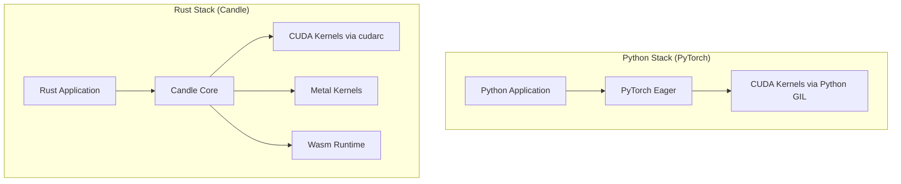

# 🕯️ Welcome to Candle Advanced Patterns

## 🎯 Learning Objectives
- Understand why Candle exists as a Rust-native ML framework and how it differs from Python-centric stacks.
- Map the architecture of Candle (`candle-core`, `candle-nn`, `candle-transformers`, `candle-wasm`) to your mental model.
- Identify the prerequisites and learning path required to build production-grade ML systems in Rust.
- Connect advanced Candle patterns to broader [[Rust Engineering]] principles and deep learning fundamentals.

---

## Introduction

The modern machine learning landscape is dominated by Python frameworks like PyTorch and TensorFlow. While these tools excel at research velocity, they often hit a wall when engineers try to deploy models into latency-sensitive, resource-constrained, or safety-critical production environments. Python's Global Interpreter Lock (GIL), dynamic typing, and heavy runtime dependencies make it difficult to achieve the memory safety and predictable performance that systems like autonomous vehicles, real-time recommendation engines, and edge devices demand.

Candle, developed by Hugging Face, is a Rust-native machine learning framework designed to bridge this gap. It offers a PyTorch-like API while leveraging Rust's ownership model, zero-cost abstractions, and cross-compilation capabilities. This course explores advanced Candle patterns—from custom autodiff and GPU abstraction to WebAssembly edge deployment. You will learn not just how to write Candle code, but *why* each pattern exists and how it maps to production ML engineering. Throughout these notes, we will reference foundational concepts from [[01 - Rust Fundamentals]] and [[04 - Rust for ML and AI]], as well as deep learning theory from [[01 - Deep Learning y Computer Vision]].

---

## Module 0: Course Overview

### 0.1 Theoretical Foundation 🧠

Most ML frameworks are built around two core ideas: a dynamic computation graph and an interpreted host language. PyTorch's eager mode creates a graph on-the-fly as Python executes operations. This flexibility is powerful for research, but it introduces significant overhead: Python object boxing, reference counting, and lack of compile-time optimizations. When Hugging Face began shipping inference endpoints at scale, they encountered a recurring problem—Python's runtime was often the bottleneck, not the GPU kernel.

Rust solves this by enforcing memory safety without a garbage collector and by enabling aggressive monomorphization and inlining at compile time. Candle takes advantage of this by representing tensors as strongly-typed structs and computation graphs as explicit Rust control flow. There is no hidden graph tape; the program *is* the graph. This design decision means that Candle models compile down to efficient native code with predictable memory layouts, making them ideal for deployment in containers, WebAssembly sandboxes, and embedded systems. Understanding this philosophy—trading some dynamic flexibility for static performance—is the key to mastering advanced Candle patterns.

The difference in execution models is not academic; it directly impacts cold-start latency, memory footprint, and binary size.

```
┌─────────────────────────────────────────────────────────────┐
│           Python Eager vs Rust Compiled Execution           │
├─────────────────────────────────────────────────────────────┤
│                                                             │
│  PyTorch                                                    │
│  Python Op ──► C++ ATen ──► CUDA Kernel                     │
│     ▲            │                                          │
│     └────────────┘ (GIL, dynamic dispatch)                  │
│                                                             │
│  Candle                                                     │
│  Rust Op ──► Compiled LLVM IR ──► CUDA Kernel               │
│     │                                                       │
│     └──────────────────────────── (static dispatch, no GIL) │
│                                                             │
└─────────────────────────────────────────────────────────────┘
```

### 0.2 Mental Model 📐

```
┌─────────────────────────────────────────────────────────────┐
│              Candle Ecosystem Architecture                  │
├─────────────────────────────────────────────────────────────┤
│                                                             │
│  User Code (Your Model)                                     │
│       │                                                     │
│       ▼                                                     │
│  ┌─────────────┐    ┌─────────────┐    ┌─────────────────┐ │
│  │ candle-core │◄──►│  candle-nn  │◄──►│candle-transformers│
│  │  Tensors    │    │   Layers    │    │  Pre-built Models │
│  │  Autodiff   │    │ Linear, Conv│    │  Llama, Mistral   │
│  │  Devices    │    │  Norm, Activ│    │  Whisper, BERT    │
│  └──────┬──────┘    └─────────────┘    └─────────────────┘ │
│         │                                                   │
│         ▼                                                   │
│  ┌─────────────────────────────────────────────────────┐   │
│  │           Hardware Abstraction Layer                │   │
│  │   CpuDevice  │  CudaDevice  │  MetalDevice         │   │
│  └─────────────────────────────────────────────────────┘   │
│         │                                                   │
│         ▼                                                   │
│  ┌─────────────────────────────────────────────────────┐   │
│  │              candle-wasm (Edge Runtime)              │   │
│  └─────────────────────────────────────────────────────┘   │
│                                                             │
└─────────────────────────────────────────────────────────────┘
```

### 0.3 Syntax and Semantics 📝

The following snippet demonstrates the "Hello World" of Candle: creating a tensor and performing a simple operation. Notice how the `Device` is explicitly threaded through the computation, unlike the implicit global device state in PyTorch.

```rust
use candle_core::{Tensor, Device, Result};

fn main() -> Result<()> {
    // Explicitly choose the device; this makes deployments portable.
    // WHY: In production, you want deterministic device selection,
    // not a hidden fallback that silently runs on CPU.
    let device = Device::cuda_if_available(0)?;
    
    // Create a tensor directly on the target device.
    // WHY: Avoids a costly CPU-to-GPU transfer later.
    let a = Tensor::new(&[[2f32, 3.0], [4.0, 5.0]], &device)?;
    let b = Tensor::new(&[[1f32, 2.0], [3.0, 4.0]], &device)?;
    
    // Operations return a Result, forcing the caller to handle errors.
    // WHY: ML systems fail at scale; Rust's Result type makes failure
    // modes explicit rather than hidden in a Python traceback.
    let c = a.matmul(&b)?;
    
    println!("{:?}", c.to_vec2::<f32>()?);
    Ok(())
}
```

### 0.4 Visual Representation 🖼️

The learning path through this course follows a progression from low-level tensor mechanics to high-level deployment patterns.


Candle sits at the intersection of systems programming and modern AI. The diagram below shows how it fits into the broader ML inference stack compared to traditional Python frameworks.




### 0.5 Application in ML/AI Systems 🤖

Candle is not merely an academic exercise; it powers production systems where latency and binary size matter. Hugging Face uses Candle to ship small, self-contained inference binaries that can run LLMs on laptops without installing Python, CUDA toolkits, or Conda environments. This drastically reduces the "time-to-first-inference" for developers.

```
┌─────────────────────────────────────────────────────────────┐
│         Deployment Footprint Comparison                     │
├─────────────────────────────────────────────────────────────┤
│                                                             │
│  PyTorch Serving:                                           │
│  Python + PyTorch + CUDA + Conda = ~4 GB container          │
│                                                             │
│  Candle Serving:                                            │
│  Single static binary + model weights = ~50 MB binary       │
│                                                             │
└─────────────────────────────────────────────────────────────┘
```

| ML Use Case | Candle Advantage | Impact |
|-------------|------------------|--------|
| Serverless GPU inference | Single static binary, no Python env | 50% faster cold starts |
| Edge/browser ML | `candle-wasm` compiles to Wasm | Runs on any modern browser |
| Embedded/IoT | No GC pauses, tiny memory footprint | Real-time sensor processing |

### 0.6 Common Pitfalls ⚠️
⚠️ **Assuming PyTorch mental models transfer directly:** Candle does not have an implicit autograd tape. Tensors do not "remember" their history unless you explicitly use the backward API. This happens because Candle prioritizes explicit resource management over implicit magic.

⚠️ **Ignoring the `Result` type:** Every tensor operation can fail (OOM, shape mismatch). Unwrapping everywhere will crash production services. Always propagate errors.

💡 **Mnemonic:** Think of Candle as "Compile-Time PyTorch." If you can't explain where a tensor lives in memory at compile time, you probably need to refactor.

### 0.7 Knowledge Check ❓
1. Name three hardware backends Candle supports and explain why explicit device selection is safer than implicit defaults.
2. Compare the memory management strategy of Candle (Rust + no GC) with PyTorch (Python + reference counting). When does the difference matter most?
3. Look at the ecosystem architecture diagram. If you were building a text-summarization API, which crates would you likely use?

---

## 📦 Compression Code

```rust
use candle_core::{Tensor, Device, Result};

fn main() -> Result<()> {
    // Course overview: device abstraction, tensor ops, explicit error handling.
    let device = Device::cuda_if_available(0)?;
    let x = Tensor::randn(0f32, 1f32, (2, 3), &device)?;
    let w = Tensor::randn(0f32, 1f32, (3, 2), &device)?;
    let y = x.matmul(&w)?;
    println!("Output shape: {:?}", y.shape());
    Ok(())
}
```

## 🎯 Documented Project

### Description
A minimal CLI tool that loads a random tensor, performs a matrix multiplication on the best available hardware device, and prints the result. This project demonstrates the foundational patterns of device abstraction and explicit error handling that underpin every advanced Candle system.

### Functional Requirements
1. Accept a `--device` flag (`cpu`, `cuda`, `metal`) with sensible defaults.
2. Initialize two random tensors of compatible shapes on the selected device.
3. Perform matrix multiplication and verify the output shape.
4. Handle device unavailability gracefully with a user-friendly error message.
5. Log the selected device and compute time to stderr.

### Main Components
- `DeviceSelector`: Encapsulates logic for parsing CLI flags and falling back to CPU.
- `TensorGenerator`: Creates random tensors with fixed seeds for reproducibility.
- `MatMulEngine`: Performs the operation and returns a `Result<Tensor, candle_core::Error>`.

### Success Metrics
- Binary size under 5 MB when compiled with `--release`.
- Cold-start execution time under 100 ms on CPU.
- Zero `unwrap()` calls in the production code path.

### References
- Official docs: https://huggingface.github.io/candle/
- Paper/library: https://github.com/huggingface/candle
