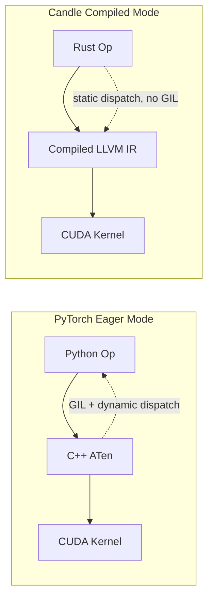
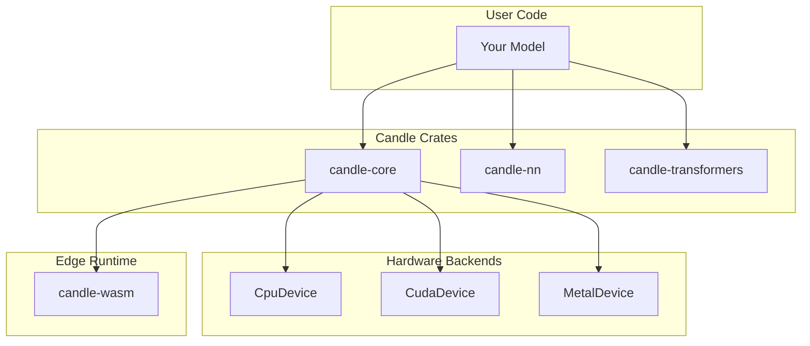

# 🦀 0 - Welcome to Candle Advanced Patterns

## 🎯 Learning Objectives
- Understand why Candle exists as a Rust-native ML framework and how it differs from Python stacks.
- Map the architecture of Candle across its crates: `candle-core`, `candle-nn`, `candle-transformers`, `candle-wasm`.
- Identify prerequisites and the learning path for production-grade ML systems in Rust.
- Connect advanced Candle patterns to broader [[Rust Engineering]] principles and deep learning fundamentals.

## Introduction

The modern ML landscape is dominated by Python frameworks like PyTorch and TensorFlow. While these excel at research velocity, they hit a wall when engineers try to deploy models into latency-sensitive, resource-constrained, or safety-critical production environments. Python's GIL, dynamic typing, and heavy runtime dependencies make it difficult to achieve the memory safety and predictable performance that systems like autonomous vehicles, real-time recommendation engines, and edge devices demand.

Candle, developed by Hugging Face, is a Rust-native ML framework designed to bridge this gap. It offers a PyTorch-like API while leveraging Rust's ownership model, zero-cost abstractions, and cross-compilation capabilities. This course explores advanced Candle patterns—from custom autodiff and GPU abstraction to WebAssembly edge deployment. You will learn not just *how* to write Candle code, but *why* each pattern exists and how it maps to production ML engineering. These notes build on [[01 - Rust Fundamentals]] and [[04 - Rust for ML and AI]], as well as deep learning theory from [[01 - Deep Learning y Computer Vision]].

---

## 1. Core Philosophy: The Program is the Graph

### Why Explicit Beats Implicit in Production

Most ML frameworks build on two ideas: a dynamic computation graph and an interpreted host language. PyTorch's eager mode creates a graph on-the-fly as Python executes operations. This is powerful for research but introduces overhead: Python object boxing, reference counting, and a lack of compile-time optimizations. When Hugging Face began shipping inference endpoints at scale, they found Python's runtime was often the bottleneck, not the GPU kernel.

Candle takes a different approach: tensors are strongly-typed structs and computation graphs are explicit Rust control flow. There is no hidden graph tape—the program *is* the graph. This design means Candle models compile down to efficient native code with predictable memory layouts, making them ideal for containers, WebAssembly sandboxes, and embedded systems.

❌ **PyTorch thinking:** Expecting an implicit `grad_fn` on every tensor and a hidden autograd tape.
✅ **Candle approach:** Gradients are opt-in, requested only when you explicitly call `backward()`. Resources are deterministic.

```rust
use candle_core::{Tensor, Device, Result};

fn main() -> Result<()> {
    // Explicit device selection — no implicit fallback.
    let device = Device::cuda_if_available(0)?;
    let a = Tensor::new(&[[2f32, 3.0], [4.0, 5.0]], &device)?;
    let b = Tensor::new(&[[1f32, 2.0], [3.0, 4.0]], &device)?;
    let c = a.matmul(&b)?;  // Returns Result — errors are explicit
    println!("{:?}", c.to_vec2::<f32>()?);
    Ok(())
}
```

> 💡 **Mnemonic:** "Compile-Time PyTorch." If you cannot explain where a tensor lives at compile time, refactor.

⚠️ **Pitfall:** Every tensor operation returns `Result`. Using `.unwrap()` everywhere will crash production services. Always propagate errors with `?`.

The difference between Candle and PyTorch can be summarized as a trade-off between **dynamic flexibility** and **static determinism**. PyTorch gives you the ability to change the computation graph on every iteration—useful for research but costly in production. Candle locks the graph at compile time, enabling the Rust compiler and LLVM to optimize aggressively.



**Caso real:** Hugging Face Inference Endpoints use Candle to ship self-contained inference binaries. A 7B-parameter LLM container goes from ~4 GB (Python + PyTorch + CUDA + Conda) to ~50 MB (static binary + weights). Cold-start time drops from minutes to under 3 seconds, and the same binary runs on NVIDIA GPUs, Apple Silicon, and CPU-only instances without modification.

### Tensor Ownership and the Result Type

Every tensor operation in Candle returns `candle_core::Result<Tensor>`. This is not an accident—it is a deliberate design choice that forces explicit error handling at every call site. ML systems fail at scale: out-of-memory, shape mismatches, device disconnects. By returning `Result`, Candle ensures these failure modes are visible in the type system rather than hidden in a Python traceback that only surfaces in production.

```rust
// PyTorch: silent NaN propagation
// x = torch.matmul(a, b)  # Could be inf or NaN, you won't know

// Candle: explicit error handling
let x = a.matmul(&b)?;  // Compiler forces you to handle failure
```

## 2. Ecosystem Architecture

Candle is organized into layered crates, each building on the one below:

| Crate | Purpose | Key Types |
|-------|---------|-----------|
| `candle-core` | Tensors, devices, autodiff | `Tensor`, `Device`, `Var`, `GradStore` |
| `candle-nn` | Common neural network layers | `Linear`, `Conv2d`, `Module` trait, `VarBuilder` |
| `candle-transformers` | Pre-built model architectures | `BertModel`, `LlamaModel`, `Whisper`, `Config` |
| `candle-wasm` | WebAssembly browser runtime | `wasm-bindgen` bindings, CPU-only backend |

The user model code sits at the top, calling into whatever crate it needs. The hardware abstraction layer (`CpuDevice`, `CudaDevice`, `MetalDevice`) lives in `candle-core` and is transparent to the user.



Each backend is a separate compilation target. When compiling for `wasm32-unknown-unknown`, only the CPU backend is included—CUDA and Metal code are stripped at compile time.

### Crate Deep Dive: candle-core

`candle-core` is the foundation. It defines the `Tensor` struct, the `Device` enum, and the autodiff primitives. The `Tensor` is a contiguous multi-dimensional array stored either in CPU RAM or GPU VRAM, with metadata for shape, stride, dtype, and device location.

```rust
use candle_core::{Tensor, Device, DType, Result};

fn tensor_lifecycle() -> Result<()> {
    // Creation: always specify device and dtype explicitly
    let cpu = Device::Cpu;
    let t = Tensor::zeros((3, 4), DType::F32, &cpu)?;
    println!("Shape: {:?}, Dtype: {:?}, Device: {:?}",
             t.shape(), t.dtype(), t.device());

    // Conversion between dtypes
    let t_f16 = t.to_dtype(DType::F16)?;

    // Transfer between devices (expensive)
    let gpu = Device::new_cuda(0)?;
    let t_gpu = t.to_device(&gpu)?;

    Ok(())
}
```

Key `Tensor` methods every Candle developer should know:

| Method | Purpose | Returns |
|--------|---------|---------|
| `t.matmul(&u)` | Matrix multiplication | `Result<Tensor>` |
| `t.broadcast_mul(&u)` | Element-wise with broadcasting | `Result<Tensor>` |
| `t.sum_all()` | Reduce all elements to scalar | `Result<Tensor>` |
| `t.reshape(shape)` | Change shape (view) | `Result<Tensor>` |
| `t.to_vec2::<f32>()` | Copy data to host as 2D Vec | `Result<Vec<Vec<f32>>>` |
| `t.to_dtype(dt)` | Change numeric precision | `Result<Tensor>` |

## 3. Learning Path

This course progresses from low-level tensor mechanics to high-level deployment:


| Module | Core Skill | Production Relevance |
|--------|-----------|---------------------|
| 1 | Implement `Module` trait, manage parameters with `VarBuilder` | Custom architectures for niche domains |
| 2 | Write device-agnostic code, profile GPU transfers | Single binary for multi-cloud deployment |
| 3 | Load BERT/Llama/Whisper from safetensors | RAG pipelines, on-device LLM inference |
| 4 | Compile to Wasm, bridge JS ↔ Rust | Privacy-preserving browser inference |
| 5 | Dynamic batching, memory pools, `Arc<Model>` sharing | High-throughput serving with P99 SLOs |

**Prerequisites:** Comfort with Rust ownership and traits ([[01 - Rust Fundamentals]]), basic deep learning terminology (activation functions, loss functions, backpropagation from [[01 - Deep Learning y Computer Vision]]).

### Setting Up a Candle Project

Starting a new Candle project requires adding the core crates to `Cargo.toml`:

```toml
[dependencies]
candle-core = "0.5"
candle-nn = "0.5"
# Optional: for pre-built models
candle-transformers = "0.5"
# Optional: for loading Hugging Face weights
hf-hub = "0.3"
# Optional: for tokenization
tokenizers = "0.15"
```

Candle follows semantic versioning. The 0.x versions indicate the API is still evolving, but the core tensor operations and `Module` trait have been stable since 0.4. Always check the [changelog](https://github.com/huggingface/candle/releases) when upgrading.

```bash
# Create a new Rust project
cargo new my_candle_model
cd my_candle_model
# Add dependencies manually, or use cargo add
cargo add candle-core
cargo add candle-nn
```

The first `cargo build` will compile Candle's native dependencies (`cublas`, `cudart` for CUDA, `Metal` for Apple). On a machine without CUDA, Candle automatically falls back to the CPU backend—no special build flags required.

---

### Connection to the Broader Rust ML Ecosystem

Candle does not exist in isolation. It is part of the Rust ML stack alongside:

- **`dfdx`** – A different Rust ML framework that uses compile-time shape checking via const generics. Less mature but offers stronger type safety.
- **`burn`** – Another Rust deep learning framework with its own autodiff system and a more PyTorch-like API. Larger ecosystem but heavier binary.
- **`ort`** – Rust bindings for ONNX Runtime. Good for running pre-trained ONNX models but lacks native model definition capabilities.

Candle's niche is **small, portable inference binaries** with first-class Wasm support. It prioritizes compilation speed, binary size, and runtime simplicity over the broadest possible operator coverage.

### When NOT to Use Candle

Candle is not a universal replacement for Python ML frameworks. Consider alternatives when:

- **You are doing active research requiring dynamic architectures.** PyTorch's eager mode and Python's interactive development loop are superior for rapid prototyping.
- **You need the full Hugging Face ecosystem** (PEFT, LoRA, DeepSpeed, distributed training). Candle supports only a subset of these.
- **You are training large models from scratch.** Candle's autodiff works but lacks the distributed training infrastructure of PyTorch DDP/FSDP.
- **You need the broadest operator coverage.** If your model uses exotic CUDA kernels (e.g., FlashAttention v2 custom implementations), PyTorch's ecosystem is more mature.

---

## 🎯 Key Takeaways
- Candle prioritizes **explicit resource management** over implicit magic—no hidden autograd tape, no global device state.
- The `Device` enum provides **zero-cost abstraction** over CPU, CUDA, and Metal—the compiler monomorphizes the backend.
- Models are **plain Rust structs** implementing `Module`; the forward pass is a plain Rust function returning `Result<Tensor>`.
- Static compilation eliminates Python's cold-start overhead, making Candle ideal for serverless, edge, and embedded deployment.

## References
- Official docs: https://huggingface.github.io/candle/
- Repository: https://github.com/huggingface/candle
- [[01 - Rust Fundamentals]]
- [[04 - Rust for ML and AI]]
- [[01 - Deep Learning y Computer Vision]]

## 📦 Código de compresión

```rust
use candle_core::{Tensor, Device, Result};

fn main() -> Result<()> {
    let device = Device::cuda_if_available(0)?;
    let x = Tensor::randn(0f32, 1f32, (2, 3), &device)?;
    let w = Tensor::randn(0f32, 1f32, (3, 2), &device)?;
    let y = x.matmul(&w)?;
    println!("Output shape: {:?}", y.shape());
    println!("Selected device: {:?}", device);
    Ok(())
}
```
