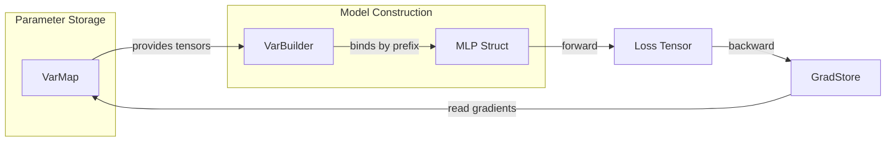

# 🦀 1 - Custom Models and Autodiff

## 🎯 Learning Objectives
- Build custom neural network architectures by implementing Candle's `Module` trait.
- Understand how Candle's explicit autodiff differs from PyTorch's implicit gradient tape.
- Use `VarBuilder` and `VarMap` to manage trainable parameters with type safety.
- Connect custom model patterns to broader [[Rust Engineering]] principles.

## Introduction

Deep learning frameworks live or die by their ability to express arbitrary differentiable computation graphs. PyTorch achieved dominance largely because its dynamic autograd system allows researchers to define novel architectures with nothing more than Python `__init__` and `forward` methods. The framework secretly builds a tape of operations, then traverses it in reverse during `backward()`. This implicit magic is convenient, but it hides memory allocations, device placements, and failure modes behind a seemingly simple API.

Candle takes a fundamentally different approach: gradients are explicit, not magical. There is no hidden tape attached to every tensor. When you build a custom model in Candle, you implement the `Module` trait, manage parameters through `VarBuilder`, and request gradients only when you need them. This note explores how to construct custom models—from simple MLPs to exotic architectures—while respecting Rust's ownership and type systems. Foundational ideas are in [[00 - Welcome to Candle Advanced Patterns]].

---

## 1. Explicit Autodiff

### How Candle's Gradient System Works

Automatic differentiation (autodiff) is the algorithmic backbone of modern ML. The backpropagation algorithm, first described in the 1960s and popularized by Rumelhart, Hinton, and Williams in 1986, provides a systematic way to compute partial derivatives of a scalar loss with respect to every parameter in a computation graph.

PyTorch's implementation uses a *tape-based* approach: every tensor that requires gradients carries a pointer to a `grad_fn` which records the operation that produced it. When `backward()` is called, the framework traverses this linked list in reverse topological order. This is elegant, but every intermediate tensor must be kept alive until the backward pass completes, increasing memory pressure.

Candle adopts a *graph-free* strategy. When you call `tensor.backward()?`, Candle performs reverse-mode autodiff starting from that tensor, but it does **not** maintain a persistent graph. Gradients are accumulated into a `GradStore`, a hash map from variable IDs to gradient tensors. This avoids the reference-counting overhead of Python frameworks and means the backward pass is just a function call—no global state involved.

❌ **Implicit tape thinking:** Expecting every tensor to carry a `grad_fn`.
✅ **Candle approach:** Call `backward()` explicitly on the loss tensor. Only variables tracked by `VarBuilder` produce gradients.

```rust
use candle_core::{Tensor, Device, Result};

fn main() -> Result<()> {
    let device = Device::cuda_if_available(0)?;
    // Create variables that REQUIRE gradients
    let w = Tensor::randn(0f32, 1f32, (3, 2), &device)?.set_requires_grad(true);
    let x = Tensor::randn(0f32, 1f32, (2, 1), &device)?;
    
    let y = w.matmul(&x)?;
    let loss = y.sqr()?.sum_all()?;
    
    // Explicit backward — no hidden tape
    let grads = loss.backward()?;
    
    // GradStore is a plain HashMap<VarId, Tensor>
    if let Some(grad_w) = grads.get(&w.id()) {
        println!("Gradient shape: {:?}", grad_w.shape());
    }
    Ok(())
}
```

> 💡 **Mnemonic:** "Candle structs are honest structs." If a field is not created via `VarBuilder`, it will not appear in gradients.

⚠️ **Pitfall:** Calling `backward()` on a tensor created outside a `VarMap` yields an empty `GradStore`. Every differentiable parameter must be registered.

**Caso real:** Spotify's recommendation team ported a custom ranking model from PyTorch to Candle. The explicit backward pass let them implement memory-efficient 8-bit Adam by manipulating `GradStore` directly—impossible with PyTorch's hidden tape without monkey-patching.

### The GradStore API

The `GradStore` returned by `backward()` is a `HashMap<VarId, Tensor>`. You can inspect, filter, or modify gradients before applying them:

```rust
let grads = loss.backward()?;

// Filter: only update layers with non-zero gradient norm
for var in varmap.all_vars() {
    if let Some(grad) = grads.get(var.id()) {
        let norm = grad.sqr()?.sum_all()?.sqrt()?.to_scalar::<f32>()?;
        if norm > 1e-6 {
            let update = grad * (-1e-3)?; // negate for gradient descent
            var.set(&var.tensor().add(&update)?)?;
        }
    }
}
```

This explicit API enables gradient clipping, gradient accumulation across micro-batches, and custom fusion strategies that would require subclassing `torch.autograd.Function` in PyTorch.

## 2. The Module Trait and Custom Models

### Defining Architectures as Rust Structs

Candle models are ordinary Rust structs with ordinary methods. You implement the `Module` trait, which has a single method: `fn forward(&self, xs: &Tensor) -> Result<Tensor>`.

```rust
use candle_core::{Tensor, Result, Device};
use candle_nn::{Linear, Module, VarBuilder, VarMap, ops::gelu};

struct MLP {
    l1: Linear,
    l2: Linear,
}

impl MLP {
    fn new(vs: VarBuilder, in_dim: usize, hid_dim: usize, out_dim: usize) -> Result<Self> {
        Ok(Self {
            l1: candle_nn::linear(in_dim, hid_dim, vs.pp("l1"))?,
            l2: candle_nn::linear(hid_dim, out_dim, vs.pp("l2"))?,
        })
    }
}

impl Module for MLP {
    fn forward(&self, xs: &Tensor) -> Result<Tensor> {
        let x = self.l1.forward(xs)?;
        let x = gelu(&x)?;
        self.l2.forward(&x)
    }
}
```

### Composing Complex Architectures with Nested Structs

More complex architectures nest structs inside structs:

```rust
struct EncoderBlock {
    self_attn: candle_nn::Linear,
    feed_forward: candle_nn::Linear,
    norm1: candle_nn::LayerNorm,
    norm2: candle_nn::LayerNorm,
}

struct TransformerEncoder {
    blocks: Vec<EncoderBlock>,
    embed: candle_nn::Embedding,
}

impl Module for TransformerEncoder {
    fn forward(&self, xs: &Tensor) -> Result<Tensor> {
        let mut h = self.embed.forward(xs)?;
        for block in &self.blocks {
            let residual = &h;
            h = block.norm1.forward(&h)?;
            h = block.self_attn.forward(&h)?;
            h = (h + residual)?;
            let residual = h.clone();
            h = block.norm2.forward(&h)?;
            h = block.feed_forward.forward(&h)?;
            h = (h + residual)?;
        }
        Ok(h)
    }
}
```

Each sub-component is initialized with its own `vs.pp("prefix")` scope, keeping the safetensors key hierarchy clean.

❌ **PyTorch-style parameter soup:** Storing all weights in a single `nn.ParameterDict` and indexing by string.
✅ **Candle approach:** Each layer is a typed struct field. The compiler verifies shape compatibility at compile time where possible.

The `VarBuilder` parameter in the constructor is the key insight. It abstracts over where weights come from—random initialization, a safetensors file, or an in-memory buffer. The same struct works for training (via `VarMap`) and inference (via `VarBuilder::from_mmaped_safetensors`).

> 💡 **Pattern:** `vs.pp("prefix")` creates a scoped `VarBuilder` that prepends `"prefix."` to all variable names. This maps directly to the key structure in safetensors checkpoint files.

### Training Loop: Forward, Loss, Backward, Update

```rust
fn main() -> Result<()> {
    let device = Device::cuda_if_available(0)?;
    let varmap = VarMap::new();
    let vs = VarBuilder::from_varmap(&varmap, candle_core::DType::F32, &device);
    let model = MLP::new(vs, 784, 128, 10)?;

    let xs = Tensor::randn(0f32, 1f32, (64, 784), &device)?;
    let targets = Tensor::randn(0f32, 1f32, (64, 10), &device)?;

    // Forward
    let logits = model.forward(&xs)?;
    let loss = logits.sub(&targets)?.sqr()?.mean_all()?;

    // Backward — returns GradStore
    let grads = loss.backward()?;

    // Manual SGD update by mutating VarMap variables
    for var in varmap.all_vars() {
        if let Some(grad) = grads.get(var.id()) {
            let updated = var.tensor().sub(&(grad * 1e-3)?)?;
            var.set(&updated)?;
        }
    }
    println!("Loss: {}", loss.to_scalar::<f32>()?);
    Ok(())
}
```

⚠️ **Pitfall:** Mismatching `VarBuilder` prefixes. The names passed to `vs.pp("l1")` must exactly match keys in the safetensors file. A mismatch panics at model construction, not during the forward pass.

## 3. Parameter Management with VarMap and VarBuilder

`VarMap` owns all trainable variables. It is the single source of truth for weights, and optimizers mutate it directly. `VarBuilder` is a lightweight view that binds names to tensors within the `VarMap` (or from a file).



For inference, skip the `VarMap` and load directly from disk:

```rust
// Inference-only: no VarMap, no gradient tracking
let vb = unsafe {
    VarBuilder::from_mmaped_safetensors(
        &["model.safetensors"],
        candle_core::DType::F32,
        &device,
    )?
};
let model = MLP::new(vb, 784, 128, 10)?;
let logits = model.forward(&input)?; // No backward possible — cleaner code
```

> 💡 `unsafe` is required for memory-mapped files because the kernel does not guarantee the mapping remains valid if the underlying file is modified. In practice, model weights are read-only after download.

### The `forward()` Signature and Shape Contracts

The `Module` trait is intentionally minimal. It accepts `&Tensor` and returns `Result<Tensor>`. This means your `forward()` method must validate shapes internally or rely on Candle's runtime checks. A common pattern is to document shape expectations with a comment:

```rust
impl Module for MyModel {
    /// forward takes (batch, in_features) and returns (batch, out_features)
    fn forward(&self, xs: &Tensor) -> Result<Tensor> {
        // Candle will panic at matmul if shapes are wrong,
        // but only if you've propagated the error correctly
        let h = self.l1.forward(xs)?;
        let h = gelu(&h)?;
        self.l2.forward(&h)
    }
}
```

For production code, consider adding explicit shape assertions:

```rust
fn forward(&self, xs: &Tensor) -> Result<Tensor> {
    let (b, _) = xs.dims2()?;
    let h = self.l1.forward(xs)?;
    // Assert hidden dimension for debugging
    assert_eq!(h.dims(), &[b, 128], "Unexpected hidden dim");
    Ok(self.l2.forward(&gelu(&h)?)?)
}
```

---

## 🎯 Key Takeaways
- Candle's autodiff is **graph-free**—`backward()` produces a `GradStore` hash map, not a persistent tape.
- Models are **Rust structs** implementing `Module`. The compiler enforces shape contracts where possible.
- `VarBuilder` decouples **parameter storage** from **model architecture**—the same struct works for training and inference.
- Explicit gradient handling makes it straightforward to implement custom optimizers and gradient manipulation.

## References
- Candle `Module` trait: https://huggingface.github.io/candle/candle_nn/trait.Module.html
- Auto-Encoding Variational Bayes (VAE paper): https://arxiv.org/abs/1312.6114
- [[00 - Welcome to Candle Advanced Patterns]]
- [[01 - Rust Fundamentals]]

## 📦 Código de compresión

```rust
use candle_core::{Tensor, Result, Device};
use candle_nn::{Linear, Module, VarBuilder, VarMap, ops::gelu};

struct MLP { l1: Linear, l2: Linear }

impl MLP {
    fn new(vs: VarBuilder, d: usize, h: usize, o: usize) -> Result<Self> {
        Ok(Self { l1: candle_nn::linear(d, h, vs.pp("l1"))?, l2: candle_nn::linear(h, o, vs.pp("l2"))? })
    }
}

impl Module for MLP {
    fn forward(&self, xs: &Tensor) -> Result<Tensor> {
        self.l2.forward(&gelu(&self.l1.forward(xs)?)?)
    }
}

fn main() -> Result<()> {
    let device = Device::cuda_if_available(0)?;
    let varmap = VarMap::new();
    let vs = VarBuilder::from_varmap(&varmap, candle_core::DType::F32, &device);
    let model = MLP::new(vs, 784, 256, 10)?;
    let xs = Tensor::randn(0f32, 1f32, (64, 784), &device)?;
    let logits = model.forward(&xs)?;
    let loss = logits.sub(&Tensor::randn(0f32, 1f32, (64, 10), &device)?)?.sqr()?.mean_all()?;
    let grads = loss.backward()?;
    println!("Loss: {}, Grads: {}", loss.to_scalar::<f32>()?, grads.len());
    Ok(())
}
```
