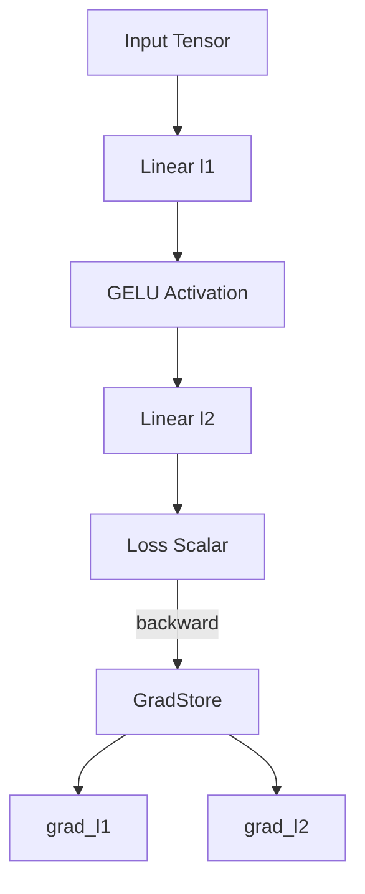
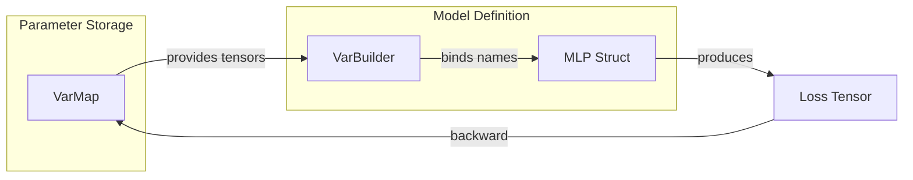

# Custom Models and Autodiff 🧬

## 🎯 Learning Objectives
- Build custom neural network architectures by implementing Candle's `Module` trait.
- Understand how Candle's explicit autodiff differs from PyTorch's implicit gradient tape.
- Use `VarBuilder` and `VarMap` to manage trainable parameters with type safety.
- Implement custom backward passes and appreciate why they are rare in Rust ML.
- Connect custom model patterns to broader [[Rust Engineering]] principles.

---

## Introduction

Deep learning frameworks live or die by their ability to express arbitrary differentiable computation graphs. PyTorch achieved dominance largely because its dynamic autograd system allows researchers to define novel architectures with nothing more than Python `__init__` and `forward` methods. The framework secretly builds a tape of operations, then traverses it in reverse during `backward()`. This implicit magic is convenient, but it hides memory allocations, device placements, and failure modes behind a seemingly simple API.

Candle takes a fundamentally different approach: gradients are explicit, not magical. There is no hidden tape attached to every tensor. Instead, Candle provides a `backward` method that operates on a specific tensor, producing a `GradStore` that maps variable IDs to their gradients. This design mirrors Rust's broader philosophy of making costs and side effects visible at the call site. When you build a custom model in Candle, you implement the `Module` trait, manage parameters through `VarBuilder`, and request gradients only when you need them. This note explores how to construct custom models—from simple MLPs to exotic architectures—while respecting Rust's ownership and type systems. We will reference foundational ideas from [[00 - Welcome to Candle Advanced Patterns]] and connect to systems thinking in [[01 - Rust Fundamentals]].

---

## Module 1: Custom Models and Autodiff

### 1.1 Theoretical Foundation 🧠

Automatic differentiation (autodiff) is one of the most important algorithmic inventions in modern machine learning. Before autodiff became widespread in the 2010s, researchers hand-derived gradients for neural networks, a process that was error-prone and effectively capped model complexity. The backpropagation algorithm, first described in the 1960s and popularized by Rumelhart, Hinton, and Williams in 1986, provides a systematic way to compute partial derivatives of a scalar loss with respect to every parameter in a computation graph.

PyTorch's implementation of autodiff is based on a *tape-based* or *tracing* approach. Every tensor that requires gradients carries a pointer to a `grad_fn`, which records the operation that produced it. When `backward()` is called, the framework traverses this linked list of operations in reverse topological order, applying the chain rule at each step. This is elegant, but it means every intermediate tensor must be kept alive until the backward pass completes, increasing memory pressure. Furthermore, the tape is a global runtime structure, making it difficult to reason about its state across thread boundaries.

Candle adopts a *graph-free* or *explicit* autodiff strategy. When you call `tensor.backward()?`, Candle performs a reverse-mode autodiff traversal starting from that tensor, but it does not maintain a persistent graph. The gradients are accumulated into a `GradStore`, a hash map from variable identifiers to gradient tensors. This approach is less flexible for higher-order derivatives, but it is significantly simpler to implement in a systems language like Rust and avoids the reference-counting overhead that plagues Python frameworks. It also means that custom models in Candle are just ordinary Rust structs with ordinary Rust methods; there is no hidden metaprogramming or macro magic required to make them differentiable.

The design motivation is clear: Hugging Face wanted a framework where the model *is* a Rust struct, the forward pass *is* a Rust function, and the backward pass *is* an explicit function call. This maps cleanly to deployment scenarios where you may not even need gradients (inference-only binaries), allowing the compiler to eliminate dead code related to gradient computation entirely. The explicit nature of Candle's autodiff also makes it easier to implement custom optimizers and training loops, because the gradient store is a plain data structure that you can inspect, modify, and iterate over with standard Rust tools.

### 1.2 Mental Model 📐

```
┌─────────────────────────────────────────────┐
│  PyTorch Implicit Tape vs Candle Explicit   │
├─────────────────────────────────────────────┤
│                                             │
│  PyTorch:                                   │
│  Tensor ──► Op ──► Tensor ──► Op ──► Loss   │
│     ▲         │        ▲         │          │
│     └─────────┘        └─────────┘          │
│  (Each tensor remembers its parents)        │
│                                             │
│  Candle:                                    │
│  Tensor ──► Op ──► Tensor ──► Op ──► Loss   │
│     │         │        │         │          │
│     └──────────────────────────────────────►│
│  (backward() scans the graph on demand)     │
│                                             │
└─────────────────────────────────────────────┘
```

```
┌─────────────────────────────────────────────┐
│  Custom Model as a Rust Struct              │
├─────────────────────────────────────────────┤
│                                             │
│  struct MyModel {                           │
│      l1: Linear,        ◄── weights         │
│      l2: Linear,        ◄── weights         │
│      norm: LayerNorm,   ◄── weights         │
│  }                                          │
│                                             │
│  impl Module for MyModel {                  │
│      fn forward(&self, xs: &Tensor)         │
│          ──► deterministic Rust code        │
│  }                                          │
│                                             │
└─────────────────────────────────────────────┘
```

```
┌─────────────────────────────────────────────┐
│  VarBuilder Flow: Loading vs Training       │
├─────────────────────────────────────────────┤
│                                             │
│  Training:                                  │
│  VarMap ──► VarBuilder ──► Tensor (train)   │
│       ▲                                     │
│       └── backward() updates via SGD/Adam   │
│                                             │
│  Inference:                                 │
│  Safetensors ──► VarBuilder ──► Tensor (no  │
│                                             │
│  grad)                                      │
│                                             │
└─────────────────────────────────────────────┘
```

### 1.3 Syntax and Semantics 📝

The following example implements a custom two-layer MLP with GELU activation. Pay close attention to how `VarBuilder` is passed through the constructor, enabling the same struct to be used for both training (from a `VarMap`) and inference (from serialized weights).

```rust
use candle_core::{Tensor, Result, Device};
use candle_nn::{Linear, Module, VarBuilder, VarMap, ops::gelu};

/// A simple two-layer MLP for classification.
/// WHY: Structs give us compile-time guarantees about model shape.
struct MLP {
    // Each layer is just a field. No hidden state, no Python objects.
    l1: Linear,
    l2: Linear,
}

impl MLP {
    /// Create a new MLP from a VarBuilder.
    /// WHY: VarBuilder abstracts over weight sources (random init, checkpoints).
    fn new(vs: VarBuilder, input_dim: usize, hidden_dim: usize, output_dim: usize) -> Result<Self> {
        Ok(Self {
            // Linear::new takes weight and optional bias tensors.
            // Shapes are (out_features, in_features) following Candle conventions.
            l1: candle_nn::linear(input_dim, hidden_dim, vs.pp("l1"))?,
            l2: candle_nn::linear(hidden_dim, output_dim, vs.pp("l2"))?,
        })
    }
}

impl Module for MLP {
    /// The forward pass is pure Rust: &self and &Tensor in, Result<Tensor> out.
    /// WHY: Pure functions are trivial to test, cache, and parallelize.
    fn forward(&self, xs: &Tensor) -> Result<Tensor> {
        // First linear projection.
        let x = self.l1.forward(xs)?;
        // GELU activation: smooth, differentiable, popular in transformers.
        let x = gelu(&x)?;
        // Second linear projection produces logits.
        self.l2.forward(&x)
    }
}

fn main() -> Result<()> {
    let device = Device::cuda_if_available(0)?;
    
    // VarMap owns all trainable variables and can be updated by optimizers.
    // WHY: Centralized ownership matches Rust's linear type system.
    let varmap = VarMap::new();
    let vs = VarBuilder::from_varmap(&varmap, candle_core::DType::F32, &device);
    
    // Build the model. At this point, weights are initialized.
    let model = MLP::new(vs, 784, 128, 10)?;
    
    // Dummy input: batch_size=32, features=784.
    let xs = Tensor::randn(0f32, 1f32, (32, 784), &device)?;
    
    // Forward pass.
    let logits = model.forward(&xs)?;
    println!("Logits shape: {:?}", logits.shape());
    
    // Compute a scalar loss so we can differentiate.
    let target = Tensor::randn(0f32, 1f32, (32, 10), &device)?;
    let loss = logits.sub(&target)?.sqr()?.mean_all()?;
    
    // Explicit backward pass: no hidden tape, just a method call.
    // WHY: You choose when to pay the memory and compute cost of gradients.
    let grads = loss.backward()?;
    
    // Inspect a specific gradient.
    if let Some(grad_l1) = grads.get(varmap.all_vars()[0].id()) {
        println!("Gradient l1 shape: {:?}", grad_l1.shape());
    }
    
    Ok(())
}
```

### 1.4 Visual Representation 🖼️

The autodiff process in Candle can be visualized as a directed acyclic graph that is traversed on demand, rather than being persisted as a tape.




The relationship between `VarMap`, `VarBuilder`, and the model struct shows how Candle separates parameter storage from parameter usage.




### 1.5 Application in ML/AI Systems 🤖

Custom models are the bread and butter of applied ML research and product engineering. Consider the case of **Spotify**, which runs hundreds of specialized recommendation models. While they use PyTorch for research, their serving infrastructure must handle billions of requests per day with sub-millisecond latency. Porting a custom ranking model from PyTorch to Candle allows Spotify's engineers to compile a single static binary that runs on CPU-only edge nodes, eliminating the Python interpreter startup time and reducing memory footprint by an order of magnitude.

In a production scenario, a custom Candle model might implement a novel attention mechanism for a niche domain. Because Candle models are plain Rust structs, the engineer can unit-test the forward pass with `cargo test`, profile it with standard Rust tooling, and deploy it as a sidecar container without pulling in a multi-gigabyte Python environment. The explicit gradient computation also makes it straightforward to implement custom optimizers—such as a memory-efficient 8-bit Adam—by manipulating the `GradStore` directly.

Another compelling application is in **financial technology**, where firms build proprietary time-series models for high-frequency trading. These models must be small, deterministic, and free of garbage collection pauses. A Candle-based LSTM or temporal convolutional network can be trained offline, serialized to safetensors, and loaded into a latency-critical trading engine where every microsecond counts. The ability to reason about memory layout and avoid hidden autograd state is not merely a convenience; it is a competitive advantage.

| ML Use Case | This Concept | Impact |
|-------------|-------------|--------|
| Custom recommendation ranking | Explicit `Module` trait + `VarBuilder` | 10x smaller container, no Python GIL |
| Research prototype of new architecture | Struct-based model with typed shapes | Compile-time shape checking catches bugs early |
| Federated learning on edge devices | Selective `backward()` calls | Reduced memory usage vs persistent tape |
| High-frequency trading models | Deterministic forward pass, no GC | Microsecond-level prediction latency |

### 1.6 Common Pitfalls ⚠️
⚠️ **Forgetting that Candle tensors do NOT store `grad_fn`:** If you call `backward()` on a tensor that was not created from a `VarMap` variable, you will get an empty `GradStore`. This happens because Candle does not maintain a global tape; only variables tracked by `VarBuilder` produce gradients.

⚠️ **Mismatching `VarBuilder` prefixes:** When loading a checkpoint, the names passed to `vs.pp("l1")` must exactly match the keys in the safetensors file. A mismatch results in a runtime error during model construction, not during the forward pass.

💡 **Mnemonic:** "Candle structs are honest structs." If a field is not a `Var` or created via `VarBuilder`, it will not appear in gradients. Check your struct fields if `grads.get()` returns `None`.

### 1.7 Knowledge Check ❓
1. Explain why Candle's explicit `backward()` call is more predictable for memory usage than PyTorch's implicit autograd tape. When would this matter in a long-running training loop?
2. Implement a custom `Module` that applies a residual connection: `forward(x) = x + gelu(linear(x))`. What shape constraints must hold for the addition to succeed?
3. Given a `VarMap` and a `GradStore`, write the pseudocode for a manual SGD update step. Why does Candle require you to write this explicitly rather than providing a built-in `step()` method?

---

## 📦 Compression Code

```rust
use candle_core::{Tensor, Result, Device};
use candle_nn::{Linear, Module, VarBuilder, VarMap, ops::gelu, Init};
use candle_nn::Optimizer;

/// Custom MLP with explicit autodiff.
struct MLP {
    l1: Linear,
    l2: Linear,
}

impl MLP {
    fn new(vs: VarBuilder, in_dim: usize, hid_dim: usize, out_dim: usize) -> Result<Self> {
        Ok(Self {
            l1: candle_nn::linear(in_dim, hid_dim, vs.pp("l1"))?,
            l2: candle_nn::linear(hid_dim, out_dim, vs.pp("l2"))?,
        })
    }
}

impl Module for MLP {
    fn forward(&self, xs: &Tensor) -> Result<Tensor> {
        let x = self.l1.forward(xs)?;
        let x = gelu(&x)?;
        self.l2.forward(&x)
    }
}

fn main() -> Result<()> {
    let device = Device::cuda_if_available(0)?;
    let varmap = VarMap::new();
    let vs = VarBuilder::from_varmap(&varmap, candle_core::DType::F32, &device);
    let model = MLP::new(vs, 784, 256, 10)?;
    
    let xs = Tensor::randn(0f32, 1f32, (64, 784), &device)?;
    let targets = Tensor::randn(0f32, 1f32, (64, 10), &device)?;
    
    // Training step: forward, loss, backward, update.
    let logits = model.forward(&xs)?;
    let loss = logits.sub(&targets)?.sqr()?.mean_all()?;
    let grads = loss.backward()?;
    
    // WHY: Explicit update lets you inspect/modify gradients before applying.
    varmap.all_vars().iter().for_each(|var| {
        if let Some(grad) = grads.get(var.id()) {
            let _ = var.set(&var.tensor().sub(&(grad * 1e-3).unwrap()).unwrap());
        }
    });
    
    println!("Loss: {}", loss.to_scalar::<f32>()?);
    Ok(())
}
```

## 🎯 Documented Project

### Description
A custom variational autoencoder (VAE) built in pure Candle, demonstrating custom encoder/decoder structs, the reparameterization trick with manual tensor operations, and explicit gradient propagation for training on the MNIST dataset. This project showcases how complex architectures map naturally to Rust structs and traits.

### Functional Requirements
1. Define separate `Encoder` and `Decoder` structs, each implementing `Module`.
2. Implement the reparameterization trick using `Tensor::randn` and linear algebra ops.
3. Compute KL divergence and reconstruction loss as scalar tensors.
4. Perform an explicit backward pass and apply gradients via `VarMap` mutation.
5. Serialize the trained `VarMap` to a safetensors checkpoint and reload it for inference.

### Main Components
- `Encoder`: Two linear layers with GELU, outputting mean and log-variance tensors.
- `Decoder`: Two linear layers with GELU and sigmoid, reconstructing 784-dimensional images.
- `VaeLoss`: Computes binary cross-entropy reconstruction + KL divergence.
- `Trainer`: Orchestrates the forward/backward loop and checkpointing.

### Success Metrics
- Training loss decreases monotonically over 10 epochs on MNIST.
- Checkpoint file size under 10 MB for a 128-dimensional latent space.
- Inference latency under 5 ms per image on a modern CPU.

### References
- Official docs: https://huggingface.github.io/candle/candle_nn/index.html
- Paper/library: https://arxiv.org/abs/1312.6114 (Auto-Encoding Variational Bayes)
