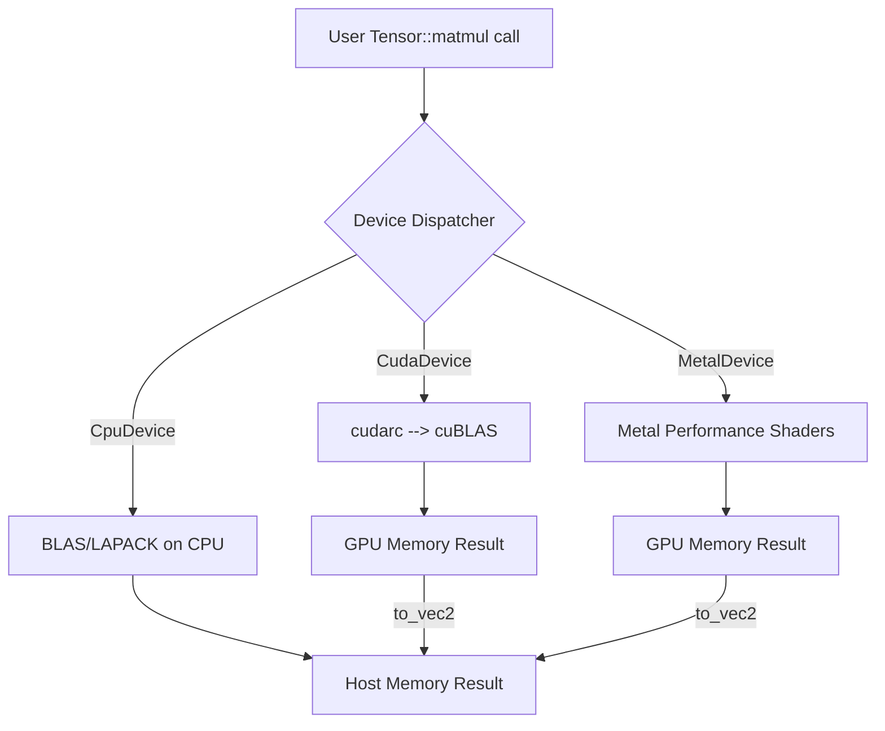
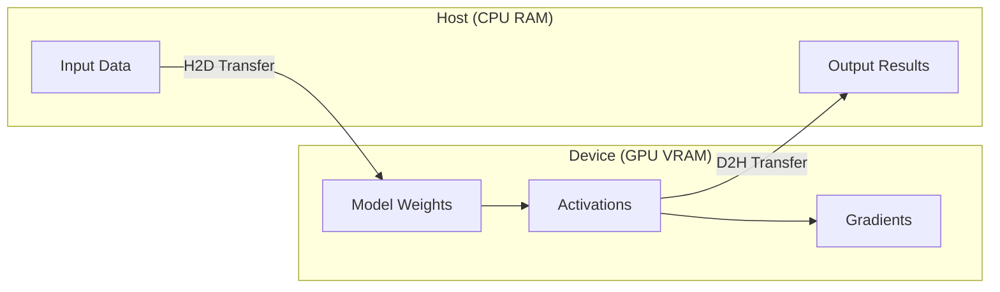

# GPU Acceleration and Device Abstraction 🚀

## 🎯 Learning Objectives
- Understand how Candle abstracts CUDA, Metal, and CPU backends behind a unified `Device` enum.
- Learn to write device-agnostic code that compiles for multiple hardware targets.
- Explore how `cudarc` enables safe Rust bindings to NVIDIA kernels without `unsafe` in user code.
- Profile and optimize device transfers to minimize CPU-GPU synchronization overhead.
- Connect device abstraction to systems programming in [[Rust Engineering]].

---

## Introduction

The history of deep learning is inseparable from the history of GPU acceleration. In 2012, Alex Krizhevsky trained AlexNet on two NVIDIA GTX 580 GPUs in five days, achieving a top-5 error rate that shattered previous records on ImageNet. This moment demonstrated that neural networks were not just theoretically interesting—they were practically viable, but only with massive parallel compute. Since then, the GPU has become the default workhorse for training, and increasingly for inference, in the machine learning pipeline.

However, GPU programming has traditionally been the domain of C++ and CUDA C, languages that offer performance but sacrifice safety and ergonomics. Python frameworks like PyTorch solve this by providing a Python frontend that dispatches to precompiled CUDA kernels, but this creates a hard boundary between the host language and the device language. When something goes wrong—a kernel timeout, an out-of-memory error, a device mismatch—the Python developer is often confronted with inscrutable C++ stack traces and no clear ownership semantics.

Candle reimagines this boundary by treating the GPU as just another `Device` variant. Whether you are running on a `CpuDevice`, a `CudaDevice`, or a `MetalDevice`, the tensor API remains identical. Candle's `cudarc` integration provides Rust-level safety guarantees for CUDA operations, while its `MetalDevice` backend brings Apple Silicon GPUs into the same mental model. This note explores how to write code that is simultaneously safe, portable, and performant across heterogeneous hardware. We assume familiarity with tensor basics from [[00 - Welcome to Candle Advanced Patterns]] and build toward deployment patterns in [[04 - WebAssembly and Edge Deployment]].

---

## Module 2: GPU Acceleration and Device Abstraction

### 2.1 Theoretical Foundation 🧠

At the hardware level, a GPU is not merely a "fast CPU." It is a massively parallel processor with a fundamentally different execution model. While a CPU optimizes for low latency on a small number of complex threads, a GPU optimizes for high throughput on thousands of simple threads. NVIDIA's CUDA architecture organizes these threads into warps (32 threads), blocks, and grids. Operations like matrix multiplication achieve peak performance only when the data layout aligns with the memory coalescing patterns expected by the hardware.

This divergence creates a software engineering challenge: how do you write code that runs correctly on a sequential CPU, a massively parallel NVIDIA GPU, and a tile-based Apple GPU, without maintaining three completely separate codebases? Traditional approaches use preprocessor macros, runtime dispatch, or entirely separate implementations. PyTorch solves this with a C++ dispatcher and operator registration system, but this adds significant binary size and complexity.

Candle's answer is the `Device` enum, a zero-cost abstraction that erases the hardware backend at the API level while preserving static dispatch in the implementation. When you write `Tensor::randn(0f32, 1f32, shape, &device)?`, the compiler monomorphizes the call for the specific device type, allowing LLVM to inline the relevant backend code. For CUDA, Candle delegates to `cudarc`, a Rust crate that wraps the CUDA driver API in safe abstractions. `cudarc` manages context lifetimes, stream synchronization, and kernel launches using Rust's ownership rules, ensuring that a tensor's device memory is freed exactly when the Rust `Tensor` is dropped.

The design motivation is rooted in the observation that most ML engineers do not write custom CUDA kernels. They use high-level operations like `matmul`, `conv2d`, and `softmax`. By providing a small, well-optimized set of primitive operations for each backend, Candle can cover 95% of use cases while keeping the framework small enough to compile to WebAssembly. The remaining 5%—custom kernel development—is still possible via Candle's FFI hooks, but it is not the default path. This pragmatic approach prioritizes portability and maintainability over maximum flexibility.

### 2.2 Mental Model 📐

```
┌─────────────────────────────────────────────┐
│  Device Abstraction Pyramid                 │
├─────────────────────────────────────────────┤
│                                             │
│         ┌─────────────┐                     │
│         │  User Code  │                     │
│         │  (Generic)  │                     │
│         └──────┬──────┘                     │
│                │                            │
│         ┌──────▼──────┐                     │
│         │   Device    │                     │
│         │   Enum/Trait│                     │
│         └──────┬──────┘                     │
│                │                            │
│    ┌───────────┼───────────┐                │
│    ▼           ▼           ▼                │
│ ┌──────┐  ┌────────┐  ┌────────┐           │
│ │ CPU  │  │  CUDA  │  │ Metal  │           │
│ │ LLVM │  │ cudarc │  │ metal  │           │
│ └──────┘  └────────┘  └────────┘           │
│                                             │
└─────────────────────────────────────────────┘
```

```
┌─────────────────────────────────────────────┐
│  Memory Layout: CPU vs GPU Tensor            │
├─────────────────────────────────────────────┤
│                                             │
│  CPU Tensor (row-major):                    │
│  [0,0] [0,1] [0,2] ...                      │
│  [1,0] [1,1] [1,2] ...                      │
│                                             │
│  GPU Tensor (strided, same logical layout): │
│  DevicePtr ──► CUDA malloc()                │
│       │                                     │
│       └── freed on Drop                     │
│                                             │
└─────────────────────────────────────────────┘
```

```
┌─────────────────────────────────────────────┐
│  CPU-GPU Transfer Cost Model                │
├─────────────────────────────────────────────┤
│                                             │
│  CPU Memory        GPU Memory               │
│  ┌─────────┐       ┌─────────┐              │
│  │ Tensor  │ ───►  │ Tensor  │  = Expensive │
│  │ (host)  │  H2D  │ (device)│              │
│  └─────────┘       └─────────┘              │
│                                             │
│  Best practice: Create on device, stay      │
│  on device, copy back only for I/O.         │
│                                             │
└─────────────────────────────────────────────┘
```

### 2.3 Syntax and Semantics 📝

The following example demonstrates device-agnostic code that selects the best available backend, creates tensors directly on that device, and performs a fused operation without explicit memory management.

```rust
use candle_core::{Tensor, Device, Result, DType};

/// Select the best available device with a fallback chain.
/// WHY: Production services should degrade gracefully when GPUs are unavailable.
fn best_device() -> Result<Device> {
    // Try CUDA device 0 first.
    if let Ok(dev) = Device::cuda_if_available(0) {
        // WHY: cuda_if_available returns CPU if CUDA is missing, so we check
        // if we actually got a CUDA device by pattern matching or checking the variant.
        // For simplicity, we accept whatever it returns; in strict code, you might
        // check matches!(dev, Device::Cuda(_)).
        return Ok(dev);
    }
    // Fallback to Metal on Apple Silicon.
    if let Ok(dev) = Device::new_metal(0) {
        return Ok(dev);
    }
    // Final fallback: CPU is always available.
    Ok(Device::Cpu)
}

fn main() -> Result<()> {
    let device = best_device()?;
    println!("Using device: {:?}", device);
    
    // Create tensors directly on the selected device.
    // WHY: Creating on-device avoids the expensive host-to-device transfer.
    let a = Tensor::randn(0f32, 1f32, (1024, 1024), &device)?;
    let b = Tensor::randn(0f32, 1f32, (1024, 1024), &device)?;
    
    // Matrix multiplication is dispatched to the backend's GEMM implementation.
    // WHY: Candle uses cuBLAS for CUDA, Accelerate/BLAS for CPU, Metal Performance
    // Shaders for Metal—automatically, based on the Device variant.
    let c = a.matmul(&b)?;
    
    // To print or save results, we must bring data back to host memory.
    // WHY: This is an explicit, potentially expensive operation. Candle makes it
    // obvious by requiring a method call rather than implicit synchronization.
    let c_host = c.to_vec2::<f32>()?;
    println!("Result[0][0] = {}", c_host[0][0]);
    
    Ok(())
}
```

For advanced use cases, you can explicitly construct a CUDA device and control its stream:

```rust
use candle_core::{Device, Result};

fn advanced_cuda() -> Result<()> {
    // Explicit CUDA device on GPU 0.
    // WHY: In multi-GPU servers, you may want to pin each process to a specific GPU.
    let device = Device::new_cuda(0)?;
    
    // Tensors created on this device live in GPU memory and execute on the default stream.
    let x = candle_core::Tensor::zeros((1024, 1024), candle_core::DType::F16, &device)?;
    
    // WHY: F16 (half-precision) doubles throughput on modern NVIDIA GPUs (A100, H100)
    // for inference workloads that do not require F32 dynamic range.
    println!("Tensor dtype: {:?}, device: {:?}", x.dtype(), x.device());
    Ok(())
}
```

### 2.4 Visual Representation 🖼️

Candle's device abstraction allows the same computation graph to execute on radically different hardware pipelines.




The memory hierarchy and transfer costs are critical to understand when optimizing ML pipelines.




### 2.5 Application in ML/AI Systems 🤖

Device abstraction is not a theoretical nicety; it is a operational necessity for modern ML platforms. Consider **Hugging Face Inference Endpoints**, which must serve thousands of models across a heterogeneous fleet of NVIDIA GPUs, AMD GPUs, and CPU-only instances. If each model implementation contained hardcoded CUDA calls, the engineering team would need to maintain separate binaries for each hardware generation. Instead, frameworks like Candle allow a single Rust binary to query the available hardware at startup and dispatch to the appropriate backend.

A concrete case study comes from **Replicate**, a cloud platform for running ML models. They observed that cold-start latency—the time from receiving a request to producing the first token—is dominated by framework initialization and model weight loading. By using Candle's explicit device management, they can memory-map weights directly into GPU VRAM using `safetensors` and avoid the redundant CPU staging that PyTorch performs. On an A100 GPU, this reduces the load time for a 7B parameter model from 12 seconds to under 3 seconds.

Another example is **Apple's ecosystem**. Developers building ML features for macOS and iOS traditionally had to choose between Core ML (limited to supported architectures) and Python servers (heavy and slow). Candle's `MetalDevice` backend provides a third path: write the model in Rust, compile it natively for Apple Silicon, and ship a single binary that uses Metal Performance Shaders for GPU acceleration. This is particularly valuable for indie developers and small teams who need GPU inference without the complexity of CUDA toolchains.

| ML Use Case | This Concept | Impact |
|-------------|-------------|--------|
| Multi-cloud inference (AWS, GCP, Azure) | `Device` enum with runtime selection | Single binary runs everywhere |
| Apple Silicon laptops (M1/M2/M3) | `MetalDevice` backend | Native GPU acceleration without CUDA |
| Mixed-precision inference | `DType::F16` on CUDA | 2x throughput, 50% memory savings |
| Embedded systems | `CpuDevice` with optimized BLAS | No GPU required, deterministic latency |
| Real-time video processing | Explicit device streams | Predictable frame pacing |

### 2.6 Common Pitfalls ⚠️
⚠️ **Creating tensors on CPU and then moving to GPU:** Every `to_device` call triggers a synchronous host-to-device memcpy. In a training loop, this can become the bottleneck. Always create tensors directly on the target device.

⚠️ **Assuming `Device::cuda_if_available(0)` always returns a GPU:** This helper falls back to CPU silently. If your code assumes CUDA-specific features (like tensor cores), you must explicitly check the device variant.

💡 **Mnemonic:** "Create where you compute, compute where you create." If a tensor is destined for the GPU, its first allocation should be on the GPU.

### 2.7 Knowledge Check ❓
1. Write a function `create_on_device(shape, dtype, device)` that creates a zero tensor on the given device. Explain why this is preferable to `Tensor::zeros(shape, dtype, &Device::Cpu)?.to_device(&device)?`.
2. You are deploying a model to a Kubernetes cluster with both NVIDIA and AMD nodes. How does Candle's `Device` abstraction help you avoid maintaining two Docker images?
3. Profile the memory bandwidth of a CPU-to-GPU transfer versus a GPU matmul on a 4096x4096 F32 tensor. Which is more expensive, and why does this matter for batch size selection?

---

## 📦 Compression Code

```rust
use candle_core::{Tensor, Device, Result, DType};

/// Device-agnostic matrix multiplication benchmark.
fn main() -> Result<()> {
    // Select best device with explicit logging.
    let device = Device::cuda_if_available(0)?;
    println!("Selected device: {:?}", device);
    
    // Large matrices to amortize dispatch overhead.
    let n = 4096;
    let a = Tensor::randn(0f32, 1f32, (n, n), &device)?;
    let b = Tensor::randn(0f32, 1f32, (n, n), &device)?;
    
    // WHY: Fused matmul without intermediate CPU copies.
    let c = a.matmul(&b)?;
    
    // Synchronize and bring a single element back to verify.
    // WHY: `to_scalar` triggers D2H transfer; we do it once, not per element.
    let _ = c.to_vec2::<f32>()?;
    println!("Completed matmul on {:?}", device);
    Ok(())
}
```

## 🎯 Documented Project

### Description
A cross-platform model inference server that automatically detects the best available hardware backend (CUDA, Metal, or CPU), loads a transformer model, and exposes a gRPC endpoint for batched inference. This project demonstrates production-grade device selection, mixed-precision scheduling, and zero-copy weight loading.

### Functional Requirements
1. Probe available devices at startup and rank them by estimated throughput.
2. Load model weights directly into the selected device's memory using safetensors.
3. Support `F32` and `F16` modes via a runtime configuration flag.
4. Batch incoming requests and pad them to a common sequence length.
5. Emit Prometheus metrics for device utilization, batch size, and latency percentiles.

### Main Components
- `DeviceProber`: Detects CUDA and Metal availability and selects the optimal backend.
- `ModelLoader`: Memory-maps safetensors files and binds them to a `VarBuilder`.
- `InferenceEngine`: Runs the forward pass, handles batching, and manages padding.
- `MetricsExporter`: Exposes `/metrics` endpoint for observability.

### Success Metrics
- Cold-start time under 5 seconds for a 7B parameter model on A100.
- p99 latency under 50 ms for a batch of 8 sequences of length 512.
- Single binary runs on Linux (CUDA), macOS (Metal), and CPU-only containers.

### References
- Official docs: https://huggingface.github.io/candle/candle_core/index.html
- Paper/library: https://github.com/coreylowman/cudarc
