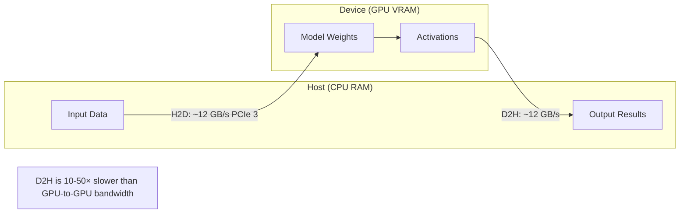

# 🦀 2 - GPU Acceleration and Device Abstraction

## 🎯 Learning Objectives
- Understand how Candle abstracts CUDA, Metal, and CPU backends behind a unified `Device` enum.
- Write device-agnostic code that compiles for multiple hardware targets.
- Profile and optimize device transfers to minimize CPU-GPU synchronization overhead.
- Connect device abstraction to systems programming in [[Rust Engineering]].

## Introduction

GPU programming has traditionally been the domain of C++ and CUDA C. Python frameworks like PyTorch solve this by providing a Python frontend that dispatches to precompiled CUDA kernels, but this creates a hard boundary between host and device code. When something goes wrong—a kernel timeout, an OOM error, a device mismatch—the developer faces inscrutable C++ stack traces.

Candle reimagines this boundary by treating the GPU as just another `Device` variant. Whether you are on `CpuDevice`, `CudaDevice`, or `MetalDevice`, the tensor API remains identical. This note explores how to write code that is simultaneously safe, portable, and performant across heterogeneous hardware. We assume tensor basics from [[00 - Welcome to Candle Advanced Patterns]] and build toward edge deployment in [[04 - WebAssembly and Edge Deployment]].

---

## 1. The Device Enum

### Zero-Cost Hardware Abstraction

Candle's `Device` is an enum with three variants. The key insight is that this is not a trait object with dynamic dispatch—it is an enum, so the compiler generates specialized code for each variant via monomorphization:

```rust
pub enum Device {
    Cpu,
    Cuda(cudarc::CudaDevice),
    Metal(metal::MetalDevice),
}
```

When you write `Tensor::randn(0f32, 1f32, shape, &device)?`, the compiler monomorphizes the call for the specific variant, allowing LLVM to inline the relevant backend code. For CUDA, Candle delegates to `cudarc`, a Rust crate that wraps the CUDA driver API in safe abstractions. `cudarc` manages context lifetimes, stream synchronization, and kernel launches using Rust's ownership rules.

### How cudarc Enables Safe GPU Programming

`cudarc` is the backbone of Candle's CUDA support. It provides:

- **Automatic context management:** CUDA contexts are tied to Rust lifetimes, ensuring cleanup on `Drop`.
- **Stream synchronization:** Works are enqueued on CUDA streams, with explicit synchronization points.
- **Safe kernel launches:** Launch parameters are validated before execution, preventing GPU hangs from invalid grid/block sizes.

```rust
// Pseudocode of what happens under the hood
let cuda_dev = cudarc::CudaDevice::new(0)?;
// Allocate GPU memory — freed when Tensor is dropped
let gpu_ptr = cuda_dev.alloc::<f32>(num_elements)?;
// Launch kernel on the default stream
let stream = cuda_dev.default_stream();
stream.launch_kernel::<f32>(my_kernel, grid, block, &[gpu_ptr])?;
// Sync when reading results back
stream.synchronize()?;
```

This safety layer means user code rarely needs `unsafe`, even when working with GPU operations. Most Candle code that compiles for CUDA would also compile for CPU (with different imports), because the `Device` enum handles dispatch behind the scenes.

### Common Device Operations Reference

| Operation | Method | Note |
|-----------|--------|------|
| Select best GPU | `Device::cuda_if_available(0)?` | Falls back to CPU silently |
| Select specific GPU | `Device::new_cuda(1)?` | Pins to GPU 1 |
| Select Metal | `Device::new_metal(0)?` | Apple Silicon only |
| Check device type | `matches!(device, Device::Cuda(_))` | Use for CUDA-specific paths |
| Transfer tensor | `tensor.to_device(&other_device)?` | Expensive, avoid in hot loops |
| Change precision | `tensor.to_dtype(DType::F16)?` | No device transfer |
| Check memory | Not directly exposed | Use `nvidia-smi` or `metal` CLI |

❌ **PyTorch habit:** Relying on implicit `.cuda()` calls and global device state.
✅ **Candle approach:** Thread the `Device` explicitly through every tensor operation. No global state, no surprises.

```rust
use candle_core::{Tensor, Device, Result};

fn best_device() -> Device {
    // Fallback chain: CUDA → Metal → CPU
    Device::cuda_if_available(0)
        .unwrap_or_else(|_| Device::new_metal(0))
        .unwrap_or(Device::Cpu)
}

fn main() -> Result<()> {
    let device = best_device();
    println!("Using device: {:?}", device);

    // Create directly on target device — no H2D transfer later
    let a = Tensor::randn(0f32, 1f32, (1024, 1024), &device)?;
    let b = Tensor::randn(0f32, 1f32, (1024, 1024), &device)?;
    let c = a.matmul(&b)?;

    // Bring result to host for I/O (explicit, potentially expensive)
    let c_host = c.to_vec2::<f32>()?;
    println!("Result[0][0] = {}", c_host[0][0]);
    Ok(())
}
```

> 💡 **Mnemonic:** "Create where you compute, compute where you create." If a tensor is destined for the GPU, allocate it there first.

⚠️ **Pitfall:** `Device::cuda_if_available(0)` silently falls back to CPU if CUDA is missing. If your code requires CUDA-specific features (tensor cores, F16), check the variant explicitly with `matches!(device, Device::Cuda(_))`.

### Explicit CUDA Device Construction

For multi-GPU servers, construct the CUDA device explicitly:

```rust
use candle_core::{Device, Result, Tensor, DType};

fn multi_gpu_example() -> Result<()> {
    // Pin this process to GPU 1
    let device = Device::new_cuda(1)?;

    // F16 doubles throughput on A100/H100 for inference
    let x = Tensor::zeros((1024, 1024), DType::F16, &device)?;
    println!("Dtype: {:?}, Device: {:?}", x.dtype(), x.device());
    Ok(())
}
```

**Caso real:** A fintech company runs fraud detection on a heterogeneous fleet — A100 GPUs in the cloud, M2 Max Mac Studios on-prem, and CPU-only Kubernetes nodes. A single Candle binary uses `Device::cuda_if_available` → `Device::new_metal` → `Device::Cpu` fallback chain. The same `cargo build` output runs everywhere. No Docker images per hardware type.

## 2. Memory Transfer Costs

### Understanding the Bottleneck

The fastest GPU kernel is the one that does not wait for data. Host-to-device (H2D) and device-to-host (D2H) transfers go over PCIe (or Thunderbolt on Mac), which has significantly lower bandwidth than GPU VRAM.



Bandwidth comparison (typical values):
- CPU RAM (DDR4): ~40 GB/s
- PCIe 3.0 x16: ~12 GB/s
- GPU VRAM (A100 HBM2e): ~2 TB/s

❌ **Anti-pattern:** Creating a tensor on CPU, then calling `.to_device(&gpu)?` in a hot loop.
✅ **Best practice:** Create tensors directly on the GPU. Avoid round-trips for intermediate results.

```rust
// ❌ Expensive: CPU allocation → H2D transfer
let x_cpu = Tensor::randn(0f32, 1f32, (4096, 4096), &Device::Cpu)?;
let x_gpu = x_cpu.to_device(&gpu_device)?;

// ✅ Optimal: GPU allocation directly
let x_gpu = Tensor::randn(0f32, 1f32, (4096, 4096), &gpu_device)?;
```

> 💡 **Rule of thumb:** For a 4096×4096 F32 tensor (~64 MB), an H2D transfer takes ~5 ms on PCIe 3.0. A matmul on the same tensor on an A100 takes ~0.5 ms. The transfer dominates.

⚠️ **Pitfall:** Calling `.to_vec2::<f32>()` after every forward pass forces a D2H sync point. If you only need a scalar metric (loss, accuracy), use `.to_scalar::<f32>()?` instead — it transfers a single value, not the entire tensor.

## 3. Mixed Precision and Advanced Device Control

### Leveraging F16 for Throughput

Modern NVIDIA GPUs (Turing and later) have dedicated tensor cores that double F16 throughput versus F32. Candle supports `DType::F16` natively:

```rust
let x = Tensor::randn(0f32, 1f32, (4096, 4096), &device)?;
let x_f16 = x.to_dtype(candle_core::DType::F16)?;
let result_f16 = x_f16.matmul(&x_f16)?;
// Cast back only if you need F32 precision downstream
```

### Metal Backend on Apple Silicon

The `MetalDevice` backend uses Apple's Metal Performance Shaders via the `metal` crate. It differs from CUDA in several ways:

- **Unified memory:** Apple Silicon uses a unified memory architecture (UMA), so CPU and GPU share the same physical RAM. H2D transfers are pointer swaps, not PCIe copies.
- **Tile-based rendering:** Metal uses tile-based deferred rendering, which affects how certain operations (convolutions, attention) are best scheduled.
- **No F16 tensor cores:** Apple's Neural Engine handles some ML workloads, but Candle's Metal backend runs on the GPU shader cores. F32 is often as fast as F16 on these cores.

```rust
#[cfg(target_os = "macos")]
fn metal_fallback() -> Result<Device> {
    Device::new_metal(0)
        .or(Ok(Device::Cpu))
}
```

**Caso real:** A real-time video processing pipeline runs on-prem Mac Studios using `MetalDevice`. Each frame is a 1080p tensor that stays entirely in GPU memory—the Rust binary receives a pointer to shared memory, runs the model, and hands the result back to a Metal render pass. Zero H2D/D2H copies until the final frame is displayed. Throughput: 60 FPS on M2 Ultra.

### Device-Agnostic Model Serving Pattern

In production, you typically want a single binary that probes the available hardware at startup:

```rust
fn init_device() -> Device {
    // Try CUDA on multi-GPU nodes
    if let Ok(d) = Device::new_cuda(0) { return d; }
    // Fallback to Metal on Mac
    if let Ok(d) = Device::new_metal(0) { return d; }
    // Universal CPU fallback
    Device::Cpu
}

fn load_model(device: &Device) -> Result<MyModel> {
    let vb = VarBuilder::from_pth("model.pt", DType::F32, device)?;
    MyModel::new(vb)
}

fn main() -> Result<()> {
    let device = init_device();
    let model = load_model(&device)?;
    // Model forward pass uses whichever backend was selected
    let input = Tensor::randn(0f32, 1f32, (1, 784), &device)?;
    let output = model.forward(&input)?;
    Ok(())
}
```

This pattern is why Candle is uniquely suited for multi-cloud or on-premises deployments where the hardware configuration is unknown at compile time.

---

## 🎯 Key Takeaways
- `Device` is an enum (Cpu, Cuda, Metal)—the compiler eliminates the dispatch overhead.
- Always create tensors **on the target device** to avoid H2D transfers.
- `Device::cuda_if_available(0)` falls back silently; verify the variant if you need GPU features.
- Match dtype to hardware: F16 on CUDA tensor cores, F32 for wider compatibility.

## References
- Candle Device docs: https://huggingface.github.io/candle/candle_core/enum.Device.html
- `cudarc` crate: https://github.com/coreylowman/cudarc
- [[00 - Welcome to Candle Advanced Patterns]]
- [[04 - WebAssembly and Edge Deployment]]

## 📦 Código de compresión

```rust
use candle_core::{Tensor, Device, Result, DType};

fn main() -> Result<()> {
    let device = Device::cuda_if_available(0)?;
    println!("Device: {:?}", device);

    let n = 4096;
    let a = Tensor::randn(0f32, 1f32, (n, n), &device)?;
    let b = Tensor::randn(0f32, 1f32, (n, n), &device)?;
    let c = a.matmul(&b)?;

    // Single D2H transfer for verification
    let _ = c.to_vec2::<f32>()?;
    println!("Matmul complete on {:?}", device);
    Ok(())
}
```
