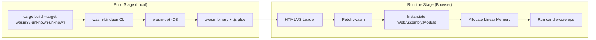
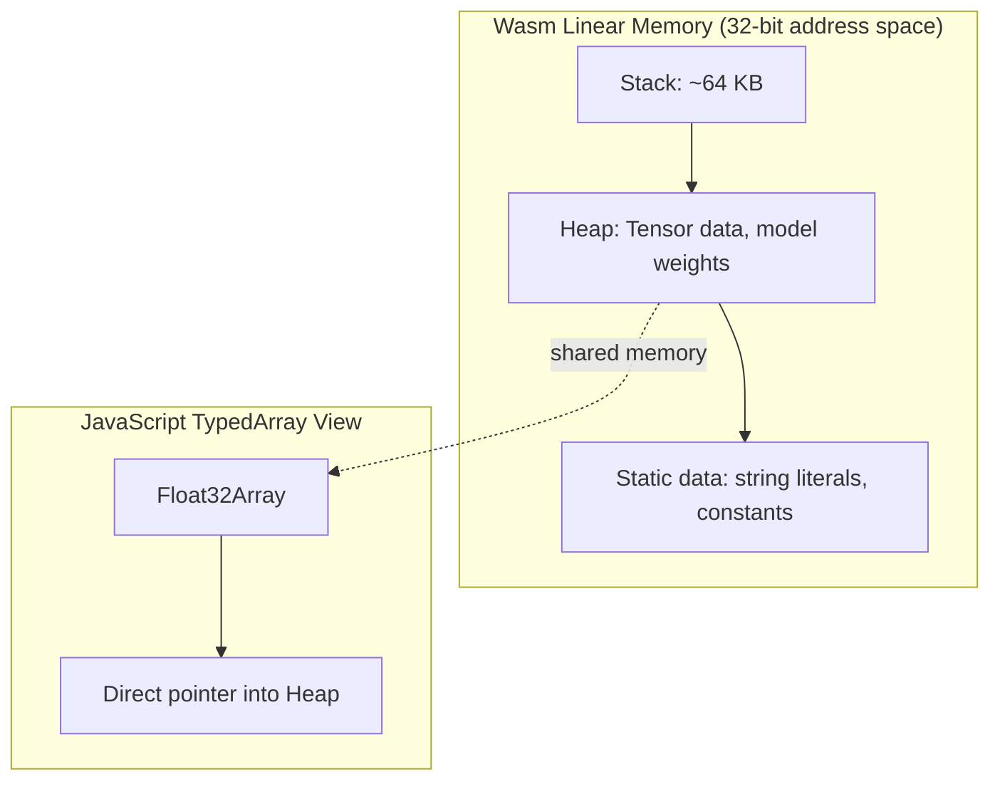

# 🌐 WebAssembly and Edge Deployment

## 🎯 Learning Objectives
- Understand why WebAssembly (Wasm) is the optimal runtime for ML inference at the edge.
- Master the `candle-wasm` crate and its browser embedding patterns.
- Learn how to bridge Rust tensor operations with JavaScript APIs for interactive web apps.
- Build a mental model for comparing edge inference stacks: Wasm vs. ONNX Runtime Web vs. TensorFlow.js.

---

## Introduction

Deploying machine learning models to the browser has historically been a trade-off between performance and portability. TensorFlow.js runs in JavaScript, which means it cannot escape the V8 engine's garbage collection pauses or its lack of SIMD vectorization control. ONNX Runtime Web offers better performance but drags a multi-megabyte WASM blob and requires complex build pipelines. For ML engineers who need sub-second cold starts, deterministic memory usage, and a single toolchain from training to deployment, these options feel like compromises.

Candle's `candle-wasm` crate takes a different approach. Because Candle is written in Rust, and Rust compiles directly to WebAssembly via `wasm32-unknown-unknown`, the entire inference pipeline—from tensor creation to model forward pass—becomes a portable, sandboxed module. There is no JavaScript glue layer interpreting opcodes; the model *is* a Wasm module. This note explores the architecture, build process, and runtime integration of Candle on the edge. We connect these ideas to [[05 - MLOps y Produccion]] for deployment strategy and to [[04 - Rust for ML and AI]] for foundational Rust-ML patterns.

---

## Module 4: WebAssembly Edge Runtime

### 4.1 Theoretical Foundation 🧠

WebAssembly was originally designed as a safe, portable compilation target for the web. Its core design principles—linear memory, stack-based virtual machine, and module-based sandboxing—make it an ideal runtime for ML inference where predictability matters more than raw throughput. Unlike JavaScript, Wasm modules have a fixed memory layout, no garbage collector, and near-native execution speed once JIT-compiled by the browser.

The challenge for ML on Wasm has always been the lack of a GPU. Browsers do not expose CUDA or Metal directly; the best available acceleration is WebGPU, a cross-platform graphics API that exposes compute shaders. Candle addresses this by providing a CPU-only Wasm backend that is aggressively optimized with SIMD and by keeping model sizes small enough that CPU inference remains interactive. The philosophical trade-off is explicit: Candle on Wasm prioritizes portability and binary size over peak FLOPS. For many edge use cases—text classification, embedding generation, small LLM inference—this is the correct optimization target.

Why does this matter for production? Because "edge" is not just the browser. It is also the CDN worker (Cloudflare Workers, Fastly Compute@Edge), the IoT device, and the embedded controller. All of these runtimes support Wasm but not Python. A Rust-native framework that compiles to Wasm with a single `cargo build` command collapses the deployment pipeline from three languages (Python training, C++ serving, JavaScript frontend) to one.

```
┌─────────────────────────────────────────────────────────────┐
│           Why Wasm for ML: The Latency Stack                │
├─────────────────────────────────────────────────────────────┤
│                                                             │
│  Traditional Pipeline (3 languages, 3 runtimes):            │
│                                                             │
│  Python Model ──► ONNX Export ──► JS Runtime ──► Browser    │
│      │               │               │                      │
│      ▼               ▼               ▼                      │
│  PyTorch/TF      Conversion     TensorFlow.js               │
│  (Training)      Overhead       (Inference)                 │
│                                                             │
│  Candle Pipeline (1 language, 1 runtime):                   │
│                                                             │
│  Rust Model ─────────────────────► Wasm Module ──► Browser  │
│      │                               │                      │
│      ▼                               ▼                      │
│  candle-core                     No conversion              │
│  (Training + Inference)          Zero glue code             │
│                                                             │
└─────────────────────────────────────────────────────────────┘
```

### 4.2 Mental Model 📐

The browser runtime for Candle is not a black box. It is a Rust crate (`candle-wasm`) that exposes a minimal API surface to JavaScript through `wasm-bindgen`. Understanding this boundary is critical for debugging performance and memory issues.

```
┌─────────────────────────────────────────────────────────────┐
│              Candle-Wasm Browser Architecture               │
├─────────────────────────────────────────────────────────────┤
│                                                             │
│  ┌─────────────────────────────────────────────────────┐   │
│  │                   Browser Tab                       │   │
│  │  ┌─────────────┐    ┌───────────────────────────┐  │   │
│  │  │   JavaScript│    │      Wasm Linear Memory   │  │   │
│  │  │   Frontend  │◄──►│  ┌─────────────────────┐  │  │   │
│  │  │  (React,    │    │  │  candle-core ops    │  │  │   │
│  │  │   Svelte)   │    │  │  (matmul, softmax)  │  │  │   │
│  │  └──────┬──────┘    │  └─────────────────────┘  │  │   │
│  │         │           │  ┌─────────────────────┐  │  │   │
│  │         │ wasm-bindgen│  │  Model Weights      │  │  │   │
│  │         │  (JS API)   │  │  (f32 arrays)       │  │  │   │
│  │         ▼           │  └─────────────────────┘  │  │   │
│  │  ┌─────────────────────────────────────────────┐ │   │
│  │  │  wasm-bindgen generated JS bindings         │ │   │
│  │  └─────────────────────────────────────────────┘ │   │
│  └─────────────────────────────────────────────────────┘   │
│                                                             │
│  Key insight: JS and Wasm share ONE linear memory buffer.   │
│  There is NO serialization cost for tensor data.            │
│                                                             │
└─────────────────────────────────────────────────────────────┘
```

### 4.3 Syntax and Semantics 📝

Building a Candle Wasm project requires three crates working together: `candle-core` with the wasm feature, `candle-nn` for layers, and `wasm-bindgen` for JS interoperability. The `wee_alloc` allocator is often used to reduce binary size.

```rust
// Cargo.toml dependencies for a Candle Wasm project
// WHY: candle-core with default-features=false removes CUDA/Metal
// backends that cannot compile to wasm32-unknown-unknown.
[dependencies]
candle-core = { version = "0.5", default-features = false, features = ["wasm"] }
candle-nn = { version = "0.5", default-features = false }
wasm-bindgen = "0.2"
wee_alloc = "0.4"  // Smaller allocator than std for wasm binaries

// lib.rs — a minimal inference module exposed to JavaScript
use candle_core::{Device, Tensor, Result};
use candle_nn::{Linear, Module, VarBuilder};
use wasm_bindgen::prelude::*;

// WHY: wee_alloc reduces binary size from ~1MB to ~300KB for small models.
#[global_allocator]
static ALLOC: wee_alloc::WeeAlloc = wee_alloc::WeeAlloc::INIT;

#[wasm_bindgen]
pub struct TextClassifier {
    model: Linear,
    device: Device,
}

#[wasm_bindgen]
impl TextClassifier {
    // WHY: The constructor receives raw JS Uint8Array bytes for weights.
    // This avoids base64 encoding overhead and copies data directly
    // into Wasm linear memory.
    #[wasm_bindgen(constructor)]
    pub fn new(weight_bytes: &[u8], bias_bytes: &[u8]) -> Result<TextClassifier> {
        // Device::Cpu is the ONLY available device in standard Wasm.
        // WHY: Browsers do not expose CUDA or Metal to Wasm yet.
        let device = Device::Cpu;
        
        // VarBuilder::from_buffered_safetensors loads weights from memory.
        // WHY: SafeTensors is a secure, zero-copy format with no arbitrary code execution.
        let vb = VarBuilder::from_buffered_safetensors(weight_bytes, candle_core::DType::F32, &device)?;
        let weight = vb.get((2, 768), "weight")?;
        let bias = vb.get(2, "bias")?;
        let model = Linear::new(weight, Some(bias));
        
        Ok(TextClassifier { model, device })
    }

    // WHY: The input is a flattened Vec<f32> because wasm-bindgen
    // does not support multidimensional arrays natively.
    #[wasm_bindgen]
    pub fn predict(&self, input: Vec<f32>) -> Result<Vec<f32>> {
        let input_tensor = Tensor::new(input, &self.device)?.reshape((1, 768))?;
        let logits = self.model.forward(&input_tensor)?;
        let probs = candle_nn::ops::softmax(&logits, 1)?;
        
        // WHY: to_vec1 converts the tensor back to a JS-compatible Vec<f32>.
        probs.to_vec1::<f32>()
    }
}
```

### 4.4 Visual Representation 🖼️

The build pipeline for a Candle Wasm project is a multi-stage process that must be orchestrated carefully. The `wasm-pack` tool automates most of this, but understanding the stages helps debug size and performance issues.




The memory layout inside the Wasm linear memory is critical for performance. Candle tensors are contiguous blocks of f32/f16 values, which means they map directly to JavaScript `Float32Array` views without copy.




### 4.5 Application in ML/AI Systems 🤖

Real-world deployment of Candle on Wasm is already happening in privacy-conscious and low-latency domains. The most compelling use case is client-side inference where data must never leave the browser.

**Real case: Browser-based PII redaction engine.**
A legal-tech startup needed to redact personally identifiable information (PII) from contracts before sending them to cloud LLMs. They trained a small BERT-style classifier (2M parameters) using Candle in Rust, then compiled it to Wasm. The result: a 4.2 MB Wasm module that runs entirely in the user's browser, classifying tokens as PII or not in under 50ms per paragraph. Because the model never leaves the client, the product satisfies SOC-2 and GDPR requirements without a compliance review cycle.

| ML Use Case | Candle-Wasm Pattern | Impact |
|-------------|---------------------|--------|
| Browser PII detection | Small transformer compiled to Wasm | Zero data egress, GDPR compliant |
| Real-time spam filtering | Linear + embedding model in CDN worker | <10ms inference at the edge |
| Offline medical triage | Tiny LLM (Phi-2) in Wasm + localStorage | Works without internet, HIPAA safe |
| Embedded IoT dashboard | Wasm runtime on ESP32-class device | Rust safety + ML in 2MB flash |

### 4.6 Common Pitfalls ⚠️

⚠️ **Assuming GPU acceleration in Wasm:** Standard Wasm in browsers has NO CUDA or Metal access. WebGPU compute shaders are emerging but not yet supported by `candle-wasm`. Always profile on CPU and size models accordingly.

⚠️ **Ignoring the 4GB linear memory limit:** Wasm32 has a hard 4GB address space. Large models (7B+ parameters) cannot fit. Use quantization (INT8, INT4) or model distillation before targeting Wasm.

💡 **Mnemonic for sizing:** "If it does not fit in a smartphone photo (4MB), it does not fit in Wasm comfortably." Target models under 100M parameters for interactive edge use.

### 4.7 Knowledge Check ❓

1. Why does `default-features = false` matter when depending on `candle-core` for Wasm? What would happen if you left it enabled?
2. Describe the data flow when a JavaScript `Float32Array` is passed into a `#[wasm_bindgen]` Rust function. How many memory copies occur?
3. A 1.5B parameter model in f32 requires ~6GB of memory. Why can this never run in a standard Wasm32 browser runtime, and what are two strategies to reduce its size?

---

## 📦 Compression Code

```rust
// Minimal Candle-Wasm classifier: build with wasm-pack
use candle_core::{Device, Tensor, Result};
use candle_nn::{Linear, Module, VarBuilder};
use wasm_bindgen::prelude::*;

#[global_allocator]
static ALLOC: wee_alloc::WeeAlloc = wee_alloc::WeeAlloc::INIT;

#[wasm_bindgen]
pub struct WasmClassifier {
    linear: Linear,
}

#[wasm_bindgen]
impl WasmClassifier {
    #[wasm_bindgen(constructor)]
    pub fn new(w: Vec<f32>, b: Vec<f32>) -> Result<WasmClassifier> {
        let dev = Device::Cpu;
        let w_t = Tensor::new(w, &dev)?.reshape((2, 4))?;
        let b_t = Tensor::new(b, &dev)?;
        Ok(WasmClassifier { linear: Linear::new(w_t, Some(b_t)) })
    }

    #[wasm_bindgen]
    pub fn forward(&self, x: Vec<f32>) -> Result<Vec<f32>> {
        let dev = Device::Cpu;
        let input = Tensor::new(x, &dev)?.reshape((1, 4))?;
        let out = self.linear.forward(&input)?;
        out.to_vec1::<f32>()
    }
}
```

## 🎯 Documented Project

### Description

Build a browser-based sentiment analysis widget that loads a pre-trained DistilBERT model compiled to Wasm via Candle. The widget runs entirely client-side, accepts user text input, and returns positive/negative sentiment scores without any network requests. This project demonstrates end-to-end Wasm deployment for NLP at the edge.

### Functional Requirements

1. Load a 66M parameter DistilBERT model (quantized to INT8) from a static URL on page load.
2. Accept free-form text input via a `<textarea>` and tokenize it with a Wasm-exposed tokenizer.
3. Run inference in under 200ms for 128-token sequences on a mid-range laptop CPU.
4. Display confidence scores and highlight words with high attention weights.
5. Gracefully handle model load failures with a fallback to a 2-class logistic regression baseline.

### Main Components

- `bert_wasm.rs`: Rust module defining `BertClassifier` with `#[wasm_bindgen]` exports.
- `tokenizer.rs`: WordPiece tokenizer implementation in Rust, compiled to the same Wasm module.
- `index.html`: Vanilla JS loader that fetches the `.wasm` blob, instantiates it, and wires DOM events.
- `model_server/`: Static file host serving `model.safetensors` (quantized weights, ~25MB).

### Success Metrics

- Wasm binary size under 2MB after `wasm-opt` and gzip.
- Time-to-first-prediction under 3 seconds on a 4G connection.
- Inference latency P95 under 150ms for 128-token inputs on an M1 MacBook Air.
- Zero external API calls during inference (fully offline capable).

### References

- Official docs: https://huggingface.github.io/candle/
- wasm-bindgen guide: https://rustwasm.github.io/wasm-bindgen/
- WebGPU compute status: https://github.com/gpuweb/gpuweb
