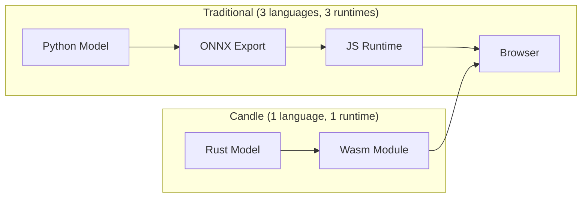

# 🦀 4 - WebAssembly and Edge Deployment

## 🎯 Learning Objectives
- Understand why WebAssembly is the optimal runtime for ML inference at the edge.
- Master the `candle-wasm` crate and its browser embedding patterns via `wasm-bindgen`.
- Bridge Rust tensor operations with JavaScript APIs for interactive web apps.
- Build a mental model for comparing edge stacks: Wasm vs. ONNX Runtime Web vs. TensorFlow.js.

## Introduction

Deploying ML models to the browser has historically been a trade-off between performance and portability. TensorFlow.js runs in JavaScript but cannot escape V8's garbage collection pauses. ONNX Runtime Web offers better performance but drags a multi-megabyte WASM blob. For engineers who need sub-second cold starts, deterministic memory usage, and a single toolchain from training to deployment, these options feel like compromises.

Candle's `candle-wasm` crate takes a different approach. Because Candle is written in Rust, and Rust compiles directly to WebAssembly via `wasm32-unknown-unknown`, the entire inference pipeline—from tensor creation to model forward pass—becomes a portable, sandboxed module. There is no JavaScript glue layer interpreting opcodes; the model *is* a Wasm module. This note connects these ideas to [[05 - MLOps y Produccion]] and [[04 - Rust for ML and AI]].

---

## 1. Why Wasm for ML Inference

### The Edge Deployment Landscape

WebAssembly was originally designed as a safe, portable compilation target for the web. Its core design principles—linear memory, stack-based virtual machine, module-based sandboxing—make it an ideal runtime for ML inference where predictability matters more than raw throughput. Unlike JavaScript, Wasm modules have a fixed memory layout, no garbage collector, and near-native execution speed once JIT-compiled by the browser.

❌ **TensorFlow.js approach:** Running ops in JavaScript with JIT-compiled kernels. GC pauses spike P99 latency unpredictably.
✅ **Candle-Wasm approach:** Model is a Wasm module with linear memory, no GC, and deterministic execution.



### Comparison of Edge ML Runtimes

| Feature | Candle-Wasm | TensorFlow.js | ONNX Runtime Web |
|---------|------------|---------------|------------------|
| Language | Rust → Wasm | JavaScript | C++ → Wasm |
| GC pauses | None | Yes (V8) | None |
| Binary size | ~300 KB + weights | ~2 MB + weights | ~5 MB + weights |
| GPU access | No (Wasm) | WebGL backend | WebGL backend |
| Custom ops | Native Rust | JS or TF ops | C++ custom ops |
| Cold start | < 100 ms | ~500 ms | ~1 s |

Candle-Wasm wins on binary size and cold-start time but currently lacks GPU acceleration. For models under 100M parameters running on modern CPUs, CPU inference is fast enough for interactive applications (50-200 ms per forward pass).

**Caso real:** A legal-tech startup needed PII redaction in contracts before sending data to cloud LLMs. They trained a 2M-parameter BERT classifier in Candle, compiled it to a 4.2 MB Wasm module, and ran it entirely in the browser. Tokens classified in under 50 ms per paragraph. Zero data egress, SOC-2 and GDPR compliance without a review cycle.

### Limitations of Wasm for ML

⚠️ **No GPU access in standard Wasm.** Browsers do not expose CUDA or Metal to Wasm. WebGPU compute shaders are emerging but not yet supported by `candle-wasm`. Always profile on CPU and size models accordingly.

⚠️ **4 GB linear memory limit.** Wasm32 has a hard 4 GB address space. Large models (7B+ parameters) cannot fit. Use INT8 quantization or model distillation before targeting Wasm.

> 💡 **Sizing rule:** "If it does not fit in a smartphone photo (4 MB), it does not fit in Wasm comfortably." Target models under 100M parameters for interactive edge use.

## 2. Building a Candle-Wasm Project

### Project Setup

Three crates working together:

```toml
[dependencies]
candle-core = { version = "0.5", default-features = false, features = ["wasm"] }
candle-nn = { version = "0.5", default-features = false }
wasm-bindgen = "0.2"
wee_alloc = "0.4"    # Smaller allocator, reduces binary from ~1MB to ~300KB
```

`default-features = false` is critical — it disables CUDA and Metal backends that cannot compile to `wasm32-unknown-unknown`.

### Exposing a Model to JavaScript

```rust
use candle_core::{Device, Tensor, Result};
use candle_nn::{Linear, Module, VarBuilder};
use wasm_bindgen::prelude::*;

#[global_allocator]
static ALLOC: wee_alloc::WeeAlloc = wee_alloc::WeeAlloc::INIT;

#[wasm_bindgen]
pub struct TextClassifier {
    linear: Linear,
    device: Device,
}

#[wasm_bindgen]
impl TextClassifier {
    #[wasm_bindgen(constructor)]
    pub fn new(weight_bytes: &[u8], bias_bytes: &[u8]) -> Result<TextClassifier> {
        let device = Device::Cpu; // Only CPU in standard Wasm
        let vb = VarBuilder::from_buffered_safetensors(
            weight_bytes, candle_core::DType::F32, &device
        )?;
        let weight = vb.get((2, 768), "weight")?;
        let bias = vb.get(2, "bias")?;
        Ok(TextClassifier { linear: Linear::new(weight, Some(bias)), device })
    }

    #[wasm_bindgen]
    pub fn predict(&self, input: Vec<f32>) -> Result<Vec<f32>> {
        let tensor = Tensor::new(input, &self.device)?.reshape((1, 768))?;
        let logits = self.linear.forward(&tensor)?;
        candle_nn::ops::softmax(&logits, 1)?.to_vec1::<f32>()
    }
}
```

❌ **Anti-pattern:** Passing serialized JSON strings across the JS-Rust boundary. String serialization is slow and memory-intensive.
✅ **Correct pattern:** Pass raw `Vec<f32>` or `&[u8]` buffers. Wasm linear memory is shared with JS — there is zero copy overhead for typed arrays.

> 💡 JS and Wasm share **one linear memory buffer**. When you pass a `Float32Array` from JS to Rust, `wasm-bindgen` passes a pointer — no serialization cost.

### Build Pipeline

```bash
cargo build --target wasm32-unknown-unknown --release
wasm-bindgen target/wasm32-unknown-unknown/release/my_model.wasm --out-dir pkg
wasm-opt -O3 pkg/my_model_bg.wasm -o pkg/my_model_opt.wasm
```

`wasm-opt -O3` typically reduces binary size by 30-40%.

### Debugging Wasm Modules

Debugging Candle code running in Wasm requires a different approach than native:

- **Console logging:** Use `web_sys::console::log_1` to print from Rust into the browser console.
- **Panic messages:** Compile with `debug = true` in `Cargo.toml` profile to get `file!()` and `line!()` in panic traces.
- **Memory profiling:** Chrome DevTools > Performance > Memory shows Wasm linear memory usage.
- **Binary size analysis:** `twiggy top -n 20 pkg/my_model_bg.wasm` shows the largest symbols in the binary.

```rust
// Logging from Wasm Rust code
use wasm_bindgen::prelude::*;

#[wasm_bindgen]
extern "C" {
    #[wasm_bindgen(js_namespace = console)]
    fn log(s: &str);
}

// In your model code:
log(&format!("Input shape: {:?}", input.shape()));
```

### Binary Size Optimization Strategies

For edge deployment, binary size matters as much as inference speed. Every kilobyte adds to page load time:

- **Use `wee_alloc`:** Replaces the standard allocator with a smaller one (~300 KB vs ~1 MB).
- **Strip debug symbols:** `wasm-opt -O3` also strips DWARF debug info.
- **Link-time optimization:** `cargo build --release` with `lto = "fat"` in `Cargo.toml`.
- **Remove unused features:** `default-features = false` on `candle-core` strips CUDA/Metal code paths.
- **Gzip/Brotli compression:** Wasm binaries compress extremely well—a 2 MB binary typically gzips to ~600 KB.

A well-optimized Candle-Wasm pipeline for a small classifier (2M parameters, INT8 quantized):

| Artifact | Size |
|----------|------|
| `.wasm` binary | 1.8 MB |
| After `wasm-opt -O3` | 1.1 MB |
| After gzip | 380 KB |
| Model weights (INT8) | 2.1 MB |
| Total over the wire | ~2.5 MB |

## 3. Data Flow: JavaScript ↔ Rust ↔ Candle

```mermaid
flowchart TD
    subgraph JS["JavaScript"]
        A[Float32Array] -->|zero-copy pointer| B[wasm-bindgen stub]
        E[Float32Array] <--|zero-copy| B
    end
    subgraph Wasm["Wasm Linear Memory"]
        B --> C[Rust fn predict]
        C --> D[candle-core ops]
        D --> C
    end
```

1. JS creates a `Float32Array` and passes it to the Wasm function.
2. `wasm-bindgen` passes a raw pointer into Wasm linear memory.
3. Rust wraps it in a `Tensor` on `Device::Cpu`.
4. Candle performs operations in-place within that memory.
5. The result is returned as a `Vec<f32>`, which JS views as a new `Float32Array`.

**Caso real:** A CDN worker (Cloudflare Workers) runs a spam classifier as a Wasm module compiled from Candle. The worker receives HTTP POST bodies, extracts text features, runs a linear + embedding model in under 10 ms, and returns a spam score — all in the edge runtime, never reaching an origin server.

### JavaScript Integration Example

On the JavaScript side, the integration is straightforward:

```javascript
// Load the Wasm module
import init, { WasmClassifier } from './pkg/my_model.js';

async function main() {
    await init(); // Instantiate the Wasm module

    // Load weights (fetched as raw bytes)
    const weightResp = await fetch('/weights/linear_weight.bin');
    const biasResp = await fetch('/weights/linear_bias.bin');
    const weights = new Float32Array(await weightResp.arrayBuffer());
    const bias = new Float32Array(await biasResp.arrayBuffer());

    // Create classifier — constructor called in Wasm linear memory
    const classifier = new WasmClassifier(weights, bias);

    // Run inference — Float32Array passed by pointer, zero copy
    const input = new Float32Array([0.1, 0.2, 0.3, 0.4]);
    const output = classifier.forward(input);

    console.log('Prediction:', output); // Float32Array result
}
```

The key detail: `Float32Array` is **not** serialized. `wasm-bindgen` passes a raw pointer into Wasm linear memory, where Candle wraps it as a `Tensor` with zero data copying.

---

## 🎯 Key Takeaways
- Wasm gives **deterministic memory** (no GC) and **near-native speed** for CPU inference.
- JavaScript and Wasm share linear memory — pass `Vec<f32>` / `Float32Array` for zero-copy tensor data.
- `default-features = false` on `candle-core` is essential for Wasm compilation.
- Target models under 100M parameters for interactive edge use.

## References
- Candle Wasm guide: https://huggingface.github.io/candle/guide-wasm.html
- `wasm-bindgen` docs: https://rustwasm.github.io/wasm-bindgen/
- WebGPU status: https://github.com/gpuweb/gpuweb
- [[05 - MLOps y Produccion]]

## 📦 Código de compresión

```rust
use candle_core::{Device, Tensor, Result};
use candle_nn::{Linear, Module, VarBuilder};
use wasm_bindgen::prelude::*;

#[global_allocator]
static ALLOC: wee_alloc::WeeAlloc = wee_alloc::WeeAlloc::INIT;

#[wasm_bindgen]
pub struct WasmClassifier { linear: Linear }

#[wasm_bindgen]
impl WasmClassifier {
    #[wasm_bindgen(constructor)]
    pub fn new(w: Vec<f32>, b: Vec<f32>) -> Result<WasmClassifier> {
        let dev = Device::Cpu;
        let w_t = Tensor::new(w, &dev)?.reshape((2, 4))?;
        let b_t = Tensor::new(b, &dev)?;
        Ok(WasmClassifier { linear: Linear::new(w_t, Some(b_t)) })
    }

    #[wasm_bindgen]
    pub fn forward(&self, x: Vec<f32>) -> Result<Vec<f32>> {
        let input = Tensor::new(x, &Device::Cpu)?.reshape((1, 4))?;
        self.linear.forward(&input)?.to_vec1::<f32>()
    }
}
```
