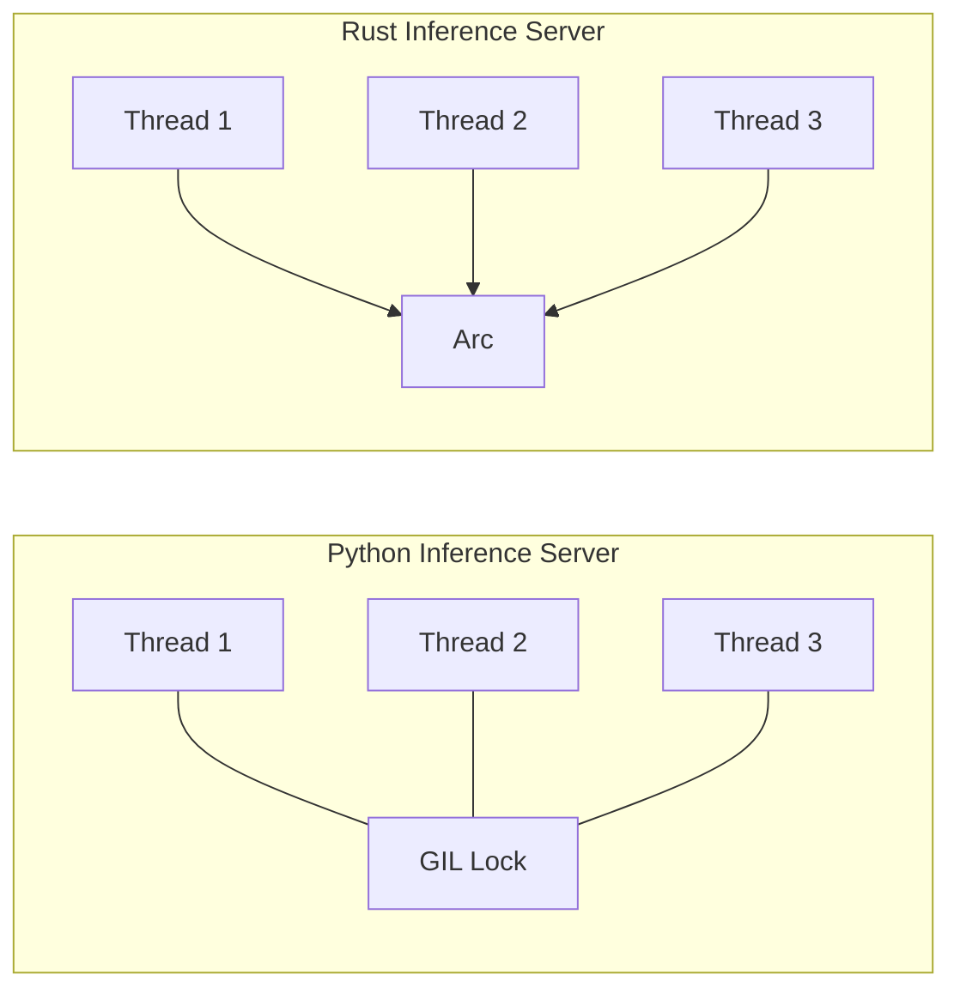
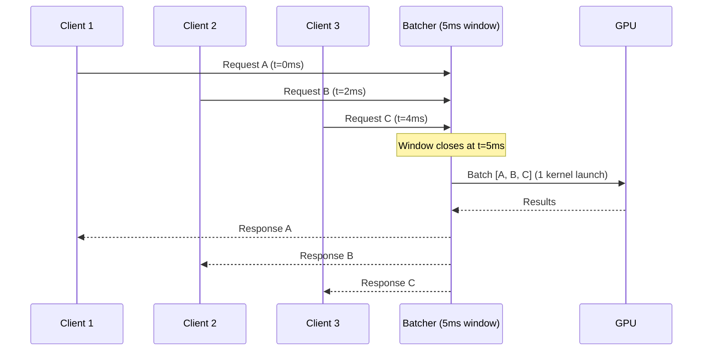

# 🦀 5 - Production Patterns and Performance Tuning

## 🎯 Learning Objectives
- Understand why production ML systems fail at scale and how Rust prevents entire categories of failures.
- Master Candle-specific optimization techniques: batching, kernel fusion, and memory pool reuse.
- Profile and benchmark Candle inference pipelines with deterministic metrics.
- Build deployment patterns for containerized and serverless Candle services.

## Introduction

Moving an ML model from a Jupyter notebook to production is not a deployment problem; it is an engineering problem. Production systems must handle concurrent requests without deadlocks, recover from OOM errors without crashing, and maintain consistent latency under load. Python frameworks were designed for research velocity, not for serving millions of requests per day. Their reliance on the GIL, dynamic memory allocation, and interpreter overhead creates a ceiling that Rust-native frameworks like Candle break through.

This note covers the operational side of Candle: how to structure inference services, reuse memory across requests, batch inputs efficiently, and measure performance with statistical rigor. We connect these ideas to [[05 - MLOps y Produccion]] and [[06 - Cloud, Infra y Backend]].

---

## 1. The Production Challenge

### Why Python Serving Hits a Ceiling

Production ML inference is a scheduling problem: finite hardware, stochastic request streams, and strict SLOs. Python's GIL means that threads do not parallelize CPU-bound model inference — you need multi-process serving, which copies model weights and multiplies GPU memory usage.

❌ **Python model:** Wrapping `nn.Module` in threads — only one thread runs at a time due to GIL.
✅ **Candle model:** `Arc<Model>` is shared across threads with zero-copy. True parallelism.



**Caso real:** A payment processor needed to score every transaction for fraud risk in under 20 ms. Their Python TorchServe used 8 worker processes, each loading a 200 MB model into GPU memory (1.6 GB total). Cold start after restart: 45 seconds. They migrated to a Candle Axum server with a single `Arc<Model>` shared across 16 Tokio threads. GPU memory dropped to 200 MB, cold start to 2 seconds, and P99 latency stabilized at 12 ms.

### Rust's Three Gifts for Production ML

Rust enters this problem with three built-in advantages:

1. **Affine type system (ownership + borrowing):** Prevents data races at compile time. `Arc<Tensor>` can be shared across threads safely without mutex overhead for read access. Python's `torch.nn.Module` has no such guarantee.
2. **No garbage collection:** Eliminates stop-the-world pauses. In Python, GC or reference counting spikes appear in P99 latency. In Rust, memory is freed deterministically when a value goes out of scope.
3. **Static compilation to a scratch container:** A Candle binary plus its model weights can run in a Docker `FROM scratch` image (~5 MB for the binary). A Python serving container is typically 3-5 GB.

## 2. Key Optimization Patterns

### Pattern 1: Memory Pools

Allocating tensors per-request puts pressure on the allocator and causes fragmentation. Pre-allocate a pool of output buffers and reuse them:

```rust
struct TensorPool {
    buffers: Vec<Tensor>,
}

impl TensorPool {
    fn new(device: &Device, shape: (usize, usize), count: usize) -> Result<Self> {
        let buffers = (0..count)
            .map(|_| Tensor::zeros(shape, candle_core::DType::F32, device))
            .collect::<Result<Vec<_>>>()?;
        Ok(TensorPool { buffers })
    }

    fn acquire(&mut self) -> Option<Tensor> {
        self.buffers.pop()
    }

    fn release(&mut self, t: Tensor) {
        self.buffers.push(t);
    }
}
```

> 💡 **Mnemonic for production readiness:** "ARC the model, MUTEX the pool, RESULT the errors, BATCH the requests."

⚠️ **Pitfall:** Wrapping the Model in a `Mutex` serializes all requests. Only the mutable pool needs locking. The model is `Arc` (lock-free reads).

### Pattern 2: Dynamic Batching

Instead of running one request at a time, accumulate requests for a brief window and run them as a single batch:



**Caso real:** A multi-tenant LLM API uses dynamic batching with a 5 ms window. The batcher groups up to 16 sequences into one forward pass. GPU utilization goes from 40% to 85%, tripling throughput at the same latency SLO because the GPU is memory-bound for small batch sizes.

### Pattern 3: Arc-Shared Model with Axum

```rust
use axum::{routing::post, Json, Router};
use candle_core::{Device, Result, Tensor};
use candle_nn::{Linear, Module};
use serde::{Deserialize, Serialize};
use std::sync::Arc;
use tokio::sync::Mutex;

struct Model { linear: Linear, device: Device }

struct AppState {
    model: Arc<Model>,
    pool: Mutex<TensorPool>,
}

#[derive(Deserialize)]
struct PredictRequest { inputs: Vec<Vec<f32>> }

#[derive(Serialize)]
struct PredictResponse { outputs: Vec<Vec<f32>> }

async fn predict(
    axum::extract::State(st): axum::extract::State<Arc<AppState>>,
    Json(req): Json<PredictRequest>,
) -> Result<Json<PredictResponse>, String> {
    let flat: Vec<f32> = req.inputs.into_iter().flatten().collect();
    let mut pool = st.pool.lock().await;
    let buf = pool.acquire().ok_or("Pool exhausted")?;
    drop(pool);

    let input = Tensor::new(flat, &st.model.device)?.reshape((1, 784))?;
    let out = st.model.linear.forward(&input)?;
    let outputs = out.to_vec2::<f32>()?;

    st.pool.lock().await.release(buf);
    Ok(Json(PredictResponse { outputs }))
}

#[tokio::main]
async fn main() -> Result<()> {
    let dev = Device::cuda_if_available(0)?;
    let vb = candle_nn::VarBuilder::from_pth("model.pt", candle_core::DType::F32, &dev)?;
    let model = Arc::new(Model {
        linear: candle_nn::linear(784, 10, vb.pp("fc"))?,
        device: dev,
    });
    let pool = Mutex::new(TensorPool::new(&model.device, (1, 10), 64)?);
    let state = Arc::new(AppState { model, pool });

    let app = Router::new().route("/predict", post(predict)).with_state(state);
    let listener = tokio::net::TcpListener::bind("0.0.0.0:3000").await.unwrap();
    axum::serve(listener, app).await.unwrap();
    Ok(())
}
```

❌ **Anti-pattern:** Loading a new model instance per request or per thread.
✅ **Production pattern:** Load once into `Arc<Model>`, share across all threads. Only mutable state (pool, metrics) needs synchronization.

⚠️ **Pitfall:** Ignoring shape validation. Candle panics on shape mismatch only if you `unwrap()`. Always use `?` to propagate `candle_core::Error`. Log the offending input shape.

## 3. Profiling and Metrics

### Key Metrics for Production Inference

| Metric | What It Measures | Target |
|--------|-----------------|--------|
| P50 latency | Typical request duration | < 15 ms |
| P99 latency | Worst-case (excluding outliers) | < 50 ms |
| Throughput | Requests per second | > 1000 RPS |
| GPU utilization | Kernel occupancy | > 80% |
| Pool hit rate | Buffer reuse ratio | > 99% |

A P50 of 10 ms with P99 of 120 ms usually indicates a scheduling problem (burst queueing), not a compute problem. Check if the batcher window size or thread pool count is the bottleneck.

### Deployment Topology

For a production Candle service, the recommended deployment stack has a load balancer distributing requests across replicas:

```
Load Balancer (NGINX/ELB)
    |
    +-- Candle Axum Server (Pod 1, Port 3000)
    |
    +-- Candle Axum Server (Pod 2, Port 3000)
    |
Shared: Redis (rate limiting)
Shared: Model weights (read-only S3 bucket)
```

Each pod runs the same static binary. Model weights are either baked into the Docker image or pulled once at startup from S3/GCS. No shared state beyond an optional Redis for rate limiting, since each pod holds its own `Arc<Model>` in memory.

---

## 🎯 Key Takeaways
- `Arc<Model>` enables true parallelism; `Mutex<Pool>` protects mutable state — lock only what changes.
- Dynamic batching trades a few milliseconds of latency for 2-3x throughput on memory-bound workloads.
- Memory pools eliminate per-request allocation overhead in high-throughput serving.
- Always propagate `candle_core::Error` with `?` — never `unwrap()` in production code paths.

## References
- Axum docs: https://docs.rs/axum/latest/axum/
- Tokio performance tuning: https://tokio.rs/tokio/topics/perf
- [[05 - MLOps y Produccion]]
- [[06 - Cloud, Infra y Backend]]

## 📦 Código de compresión

```rust
use axum::{routing::post, Json, Router};
use candle_core::{Device, Result, Tensor};
use std::sync::Arc;
use tokio::sync::Mutex;

struct Pool { buffers: Vec<Tensor> }

impl Pool {
    fn new(d: &Device, s: (usize, usize), c: usize) -> Result<Self> {
        Ok(Pool { buffers: (0..c).map(|_| Tensor::zeros(s, candle_core::DType::F32, d).unwrap()).collect() })
    }
    fn acquire(&mut self) -> Option<Tensor> { self.buffers.pop() }
    fn release(&mut self, t: Tensor) { self.buffers.push(t); }
}

async fn predict(axum::extract::State(st): axum::extract::State<Arc<Mutex<Pool>>>, Json(body): Json<Vec<Vec<f32>>>) -> Result<Json<Vec<f32>>, String> {
    let mut p = st.lock().await;
    let _buf = p.acquire().ok_or("no buf")?;
    drop(p);
    let x = Tensor::new(body.into_iter().flatten().collect::<Vec<_>>(), &Device::Cpu)?.reshape((1, 784)).unwrap();
    let o = x.to_vec2::<f32>().unwrap();
    st.lock().await.release(_buf);
    Ok(Json(o.into_iter().flatten().collect()))
}

#[tokio::main]
async fn main() {
    let pool = Arc::new(Mutex::new(Pool::new(&Device::Cpu, (1, 10), 64).unwrap()));
    let app = Router::new().route("/predict", post(predict)).with_state(pool);
    axum::serve(tokio::net::TcpListener::bind("0.0.0.0:3000").await.unwrap(), app).await.unwrap();
}
```
