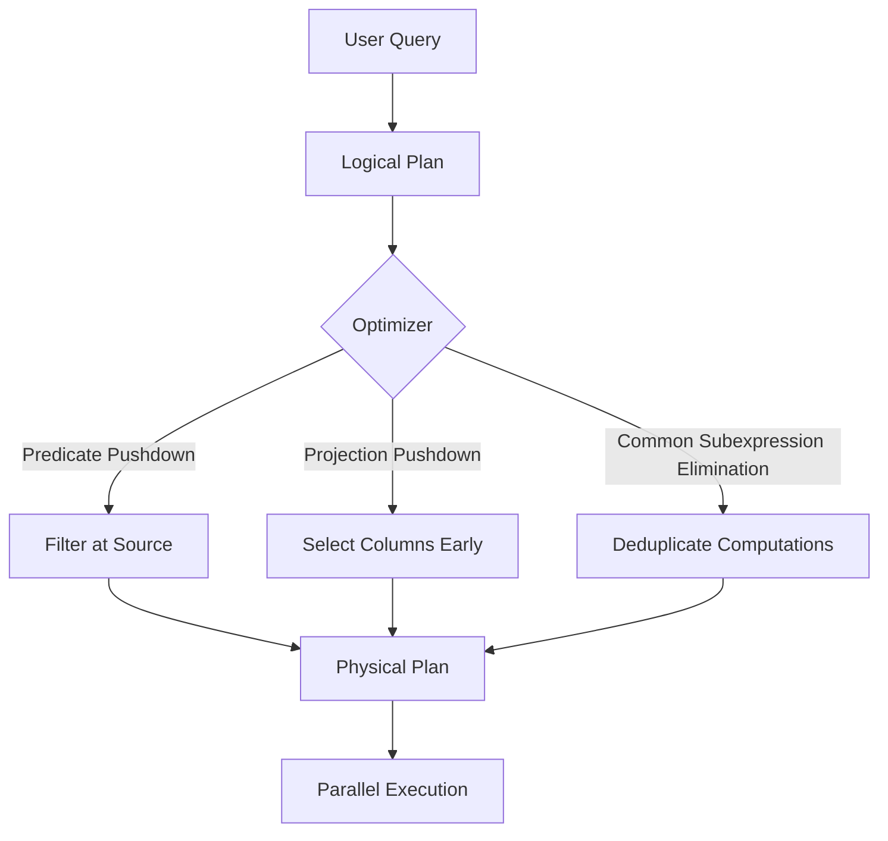
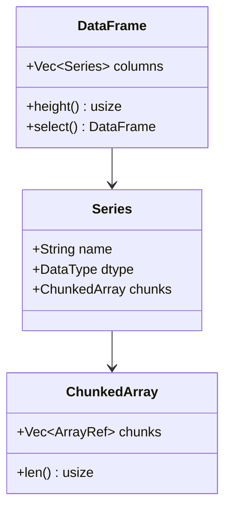

# 🚀 Welcome to Polars Internals

## 🎯 Learning Objectives
- Understand the fundamental architecture of Polars and how it differs from traditional DataFrame libraries like Pandas.
- Map the learning trajectory from eager execution to advanced lazy query optimization.
- Identify the prerequisites and connections to the broader Rust Engineering curriculum.
- Grasp why memory layout and execution strategy matter for production ML/AI pipelines.

---

## Introduction

Machine learning systems are only as fast as their data pipelines. In production environments, data scientists and ML engineers frequently encounter datasets that range from gigabytes to terabytes, where every millisecond of preprocessing latency directly translates into training iteration time or inference delay. Polars emerges not merely as a "faster Pandas," but as a ground-up reimagining of what a DataFrame library should look like when designed for modern hardware—leveraging SIMD instructions, cache locality, and the Apache Arrow memory format. This course dives beneath the surface API to explore the internals that make Polars capable of 10-100× speedups over single-threaded alternatives.

This vault module sits at the intersection of [[03 - Rust for Data Engineering]] and [[04 - Rust for ML and AI]], building upon the Rust fundamentals established in [[01 - Rust Fundamentals]]. While the [[Rust Engineering]] vault provides the language tools, this course applies them to one of the most performance-critical domains in modern data science. The concepts here also connect to [[07 - Research y Ciencia de Datos]] when designing reproducible, high-throughput experimental pipelines. By the end of this course, you will not only write faster queries—you will understand exactly why they are fast.

---

## Module 0: The Polars Architecture and Learning Path

### 0.1 Theoretical Foundation 🧠

Before Polars, the Python data ecosystem was dominated by Pandas, a library built on NumPy arrays that stores data in a contiguous block of memory with Python objects for complex types. This design, while flexible, creates enormous overhead: every string is a Python object with a 49-byte header, every missing value requires a mask, and operations are inherently single-threaded because of Python's Global Interpreter Lock (GIL). When datasets grew from megabytes to gigabytes, data engineers found themselves switching to PySpark or Dask—distributed frameworks that introduce network overhead and scheduler complexity even for single-machine workloads.

Polars was designed to solve this exact gap: single-machine, multi-core DataFrame processing without the GIL. Its creator, Ritchie Vink, chose Rust for its zero-cost abstractions and fearless concurrency. The core insight is that analytical queries are fundamentally declarative: you describe *what* you want (filter, group, aggregate), not *how* to compute it. This opens the door to a query optimizer that can rewrite your intent into a more efficient physical plan—similar to a SQL database engine, but embedded in your data science workflow. The theoretical foundation rests on decades of database research: columnar storage, vectorized execution, and predicate pushdown.

### 0.2 Mental Model 📐

Imagine a traditional DataFrame as a spreadsheet stored row-by-row, like a filing cabinet where each folder contains one record. To find every row where age > 30, you must open every folder.

```
┌─────────────────────────────────────────────┐
│  Row-Oriented Storage (Pandas-style)        │
├─────────────────────────────────────────────┤
│  Folder 1: [Alice, 25, NY]                  │
│  Folder 2: [Bob, 34, CA]  ◄── scan all      │
│  Folder 3: [Charlie, 29, TX]                │
└─────────────────────────────────────────────┘
```

Polars, by contrast, stores data column-by-column, like separate stacks of paper—one stack for names, one for ages, one for cities. To filter by age, you only touch the age stack, and because it's contiguous integers, your CPU can process 8 or 16 values simultaneously using SIMD.

```
┌─────────────────────────────────────────────┐
│  Column-Oriented Storage (Polars-style)     │
├─────────────────────────────────────────────┤
│  Names:   [Alice, Bob, Charlie]             │
│  Ages:    [25, 34, 29]  ◄── filter here     │
│  Cities:  [NY, CA, TX]                      │
└─────────────────────────────────────────────┘
```

The execution engine then sits above this storage, translating your lazy query into an optimized physical plan that runs in parallel across all CPU cores.

```
┌─────────────────────────────────────────────┐
│  Polars Execution Architecture              │
├─────────────────────────────────────────────┤
│  User Query ──► Logical Plan                │
│       │              │                      │
│       │              ▼                      │
│       │         Optimizer                   │
│       │              │                      │
│       ▼              ▼                      │
│  Physical Plan ◄──► Execution Engine        │
│       │                                     │
│       ▼                                     │
│  Columnar Storage (Arrow)                   │
└─────────────────────────────────────────────┘
```

### 0.3 Syntax and Semantics 📝

Even the simplest Polars program embodies its core philosophy: typed, compiled, and declarative. The following Rust snippet demonstrates the basic building blocks.

```rust
use polars::prelude::*;

fn main() -> Result<(), Box<dyn std::error::Error>> {
    // WHY: Eager DataFrames are immediate and simple, good for exploration
    let df = df!(
        "name" => &["Alice", "Bob", "Charlie"],
        "age" => &[25, 34, 29],
        "salary" => &[50000.0, 80000.0, 60000.0]
    )?;

    // WHY: LazyFrame defers execution, allowing the optimizer to see the full query
    let lazy_df = df.lazy();

    let result = lazy_df
        .filter(col("age").gt(lit(25)))          // Predicate: only rows > 25
        .select([col("name"), col("salary")])    // Projection: only needed columns
        .collect()?;                              // Execution happens HERE, not before

    println!("{:?}", result);
    Ok(())
}
```

The key semantic shift is that `.lazy()` creates a computation graph, and `.collect()` triggers optimization and execution. This separation is what enables the query planner to eliminate redundant work.

### 0.4 Visual Representation 🖼️

The transition from logical to physical plan can be visualized as a tree transformation, a concept borrowed from compiler design.




The columnar memory layout that underpins Polars derives directly from the Apache Arrow specification, which standardizes in-memory analytics.




### 0.5 Application in ML/AI Systems 🤖

Consider a real-time recommendation system at Netflix. Every time a user interacts with the service, the system must fetch that user's recent viewing history, join it with content metadata, and compute feature vectors for a ranking model. Using Pandas, this pipeline might take 200ms per request—acceptable for batch training, but fatal for online inference. By migrating to Polars with lazy evaluation and columnar filtering, the same pipeline can drop to 5-10ms because the optimizer pushes the user-id filter all the way to the Parquet reader, only decompressing the relevant row groups and columns.

| ML Use Case | This Concept | Impact |
|-------------|-------------|--------|
| Real-time feature engineering | Lazy filtering + projection | 20× latency reduction |
| Batch training data prep | Columnar aggregation | 10× throughput increase |
| A/B test result analysis | Parallel groupby | Sub-second on billion rows |

### 0.6 Common Pitfalls ⚠️
⚠️ **Confusing Eager and Lazy APIs**: Calling `.collect()` inside a loop materializes the DataFrame on every iteration, destroying performance. Always build the full lazy graph before the final collect.

⚠️ **Ignoring Data Types**: Polars is strictly typed. A `Utf8` column accidentally inferred as `Object` will silently disable vectorization and fall back to slow scalar loops.

💡 **Mnemonic**: "Lazy like a cat, fast like a cheetah"—defer everything until the last possible moment.

### 0.7 Knowledge Check ❓
1. Why does columnar storage enable SIMD operations while row-oriented storage does not?
2. At what point in the code does Polars actually read data from disk in a lazy query?
3. Draw the mental model: how would you represent a filter-then-groupby query as a transformation on column stacks?

---

## 📦 Compression Code

The following snippet summarizes the core architectural concepts of this welcome module in a single, runnable Rust program.

```rust
use polars::prelude::*;

fn main() -> Result<(), PolarsError> {
    // Build an eager DataFrame for exploration
    let df = df!(
        "user_id" => &[1, 2, 3, 4, 5],
        "age" => &[25, 34, 29, 42, 19],
        "clicks" => &[100, 250, 80, 300, 50]
    )?;

    // Convert to lazy for optimization
    let result = df.lazy()
        .filter(col("age").gt(lit(21)))          // Push filter down
        .select([col("user_id"), col("clicks")]) // Push projection down
        .groupby([col("age")])
        .agg([col("clicks").sum()])              // Vectorized aggregation
        .collect()?;                              // Optimize + execute

    println!("Optimized result:\n{:?}", result);
    Ok(())
}
```

## 🎯 Documented Project

### Description
Build a single-machine feature store ingestion pipeline that reads raw clickstream Parquet files, applies type-safe filtering and aggregation, and outputs training-ready DataFrames. The pipeline must run on a laptop but scale to billion-row datasets through lazy evaluation and columnar processing.

### Functional Requirements
1. Ingest multiple Parquet sources lazily without loading them into RAM.
2. Apply user-defined filtering logic that gets pushed to the scan operator.
3. Join event streams with user metadata using hash joins optimized by the query planner.
4. Compute rolling window aggregations for session-based features.
5. Export the final DataFrame to IPC format for zero-copy transfer to a Python training script.

### Main Components
- `LazyFrame` query builder with predicate and projection pushdown.
- `Schema` enforcement to prevent type inference failures.
- `ParquetReader` with memory mapping for large files.
- Aggregation engine for grouped statistics.
- IPC writer for Arrow-native serialization.

### Success Metrics
- Process 100 million rows in under 10 seconds on a 16-core workstation.
- Memory footprint stays below 2× the size of the final output columns.
- Query plan shows pushed-down filters in the `explain()` output.

### References
- Official docs: https://docs.pola.rs/
- Paper/library: https://arrow.apache.org/
