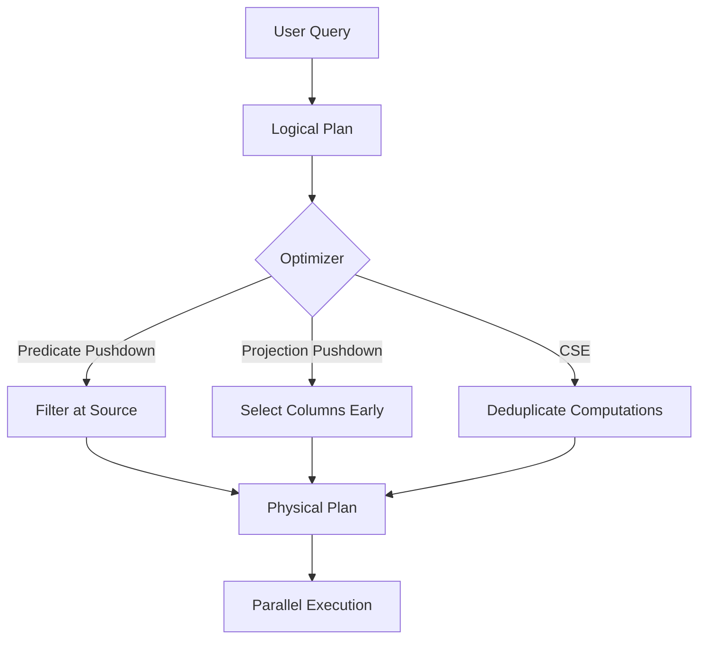
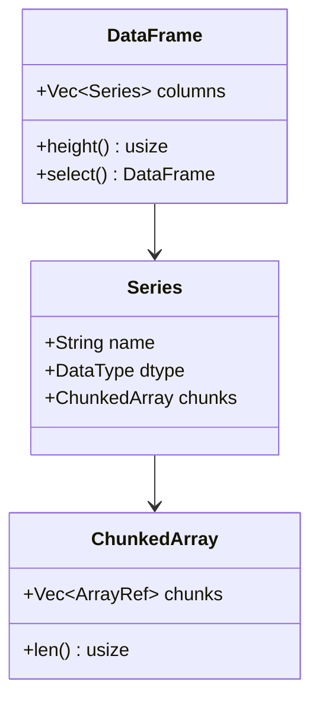

# 🦀 00 - Welcome to Polars Internals

**Course type: Language/Framework (Rust)**

## 🎯 Learning Objectives
- Understand how Polars differs from Pandas at the architectural level
- Map the learning trajectory from eager to lazy to streaming execution
- Grasp why columnar memory layout and zero-cost abstractions matter for ML/AI pipelines
- Identify the prerequisites connecting this course to the broader Rust Engineering curriculum

## Introduction

Machine learning pipelines are only as fast as their data layer. In production environments, datasets range from gigabytes to terabytes, and every millisecond of preprocessing latency compounds across training iterations and inference requests. Polars is not merely a "faster Pandas"—it is a ground-up reimagining of what a DataFrame library should look like when designed for modern hardware: SIMD instructions, cache locality, and the Apache Arrow memory format.

Before Polars, the Python data ecosystem was dominated by Pandas, built on NumPy arrays that store data in contiguous blocks with Python objects for complex types. Every string incurred a 49-byte Python object header, missing values required separate masks, and the GIL forced single-threaded execution. When datasets grew past gigabytes, engineers reached for PySpark or Dask—distributed frameworks that introduce network overhead and scheduler complexity even for single-machine workloads.

Polars was designed to fill this gap: single-machine, multi-core DataFrame processing without the GIL. Its creator, Ritchie Vink, chose Rust for zero-cost abstractions and fearless concurrency. The core insight is that analytical queries are declarative—you describe *what* to compute, not *how*—which opens the door to a query optimizer that rewrites your intent into an efficient physical plan, like a SQL database engine embedded in your data science workflow. This vault sits at the intersection of [[03 - Rust for Data Engineering]] and [[04 - Rust for ML and AI]], building on [[01 - Rust Fundamentals]]. It also connects to [[07 - Research y Ciencia de Datos]] for reproducible, high-throughput experimental pipelines. By the end of this course, you will not only write faster queries—you will understand exactly why they are fast.

---

## 1. Columnar Memory Model

Row-oriented storage (Pandas-style) interleaves columns, forcing the CPU to touch every byte even when only one column is needed. Columnar storage (Polars-style) keeps each column's data contiguous, enabling cache-efficient scans and SIMD vectorization.

A traditional DataFrame stores data row-by-row, like a filing cabinet where every folder contains one record. To find every row where `age > 30`, you must open every folder:

```text
Row 1: [Alice, 25, NY]
Row 2: [Bob, 34, CA]
Row 3: [Charlie, 29, TX]
```

Polars stores column-by-column, like separate stacks of paper—one for names, one for ages, one for cities:

```text
Names:   [Alice, Bob, Charlie]
Ages:    [25, 34, 29]
Cities:  [NY, CA, TX]
```

Filtering `age > 30` touches only the integer column—a contiguous buffer of `i32` values that the CPU can process 8 or 16 at a time with SIMD. The remaining columns are never loaded from RAM. This matters enormously: in a 100-column dataset, a Pandas filter copies all 100 columns through memory, while Polars touches only the filter column and the projected columns.

The difference becomes stark at scale. Consider 10M rows with 100 columns. A Pandas filter reading every column touches ~8 GB of data (assuming mixed types). Polars with columnar storage, predicate pushdown, and projection reads only the filter column (80 MB for a 64-bit float) and the 5 projected columns (400 MB total)—a 20× reduction in memory bandwidth. The CPU spends its cycles on computation, not on dragging unused data through the memory bus.

Polars achieves this through its Arrow-based columnar format. Each column is a contiguous typed buffer:

```rust
use polars::prelude::*;

fn inspect_columnar_layout() -> Result<(), PolarsError> {
    // Each column below is stored as a separate contiguous Arrow array
    let df = df!(
        "names" => &["Alice", "Bob", "Charlie"],
        "ages" => &[25i32, 34, 29],
        "salaries" => &[50000.0f64, 80000.0, 60000.0]
    )?;

    // Check the dtype of each column—Polars infers Arrow types
    println!("names: {:?}", df.column("names")?.dtype());
    println!("ages: {:?}", df.column("ages")?.dtype());
    println!("salaries: {:?}", df.column("salaries")?.dtype());

    // The memory layout is contiguous per column, not interleaved per row
    let ages = df.column("ages")?.i32()?;
    println!("Ages buffer: {:?}", ages.cont_slice()?);
    Ok(())
}
```

The execution engine sits above this storage layer, translating your lazy query into an optimized physical plan that runs in parallel across all CPU cores. The architecture forms a pipeline:

```text
User Query → Logical Plan → Optimizer (predicate pushdown, projection pushdown, CSE)
    → Physical Plan → Parallel Execution on Columnar Arrow Storage
```

```rust
use polars::prelude::*;

fn main() -> Result<(), Box<dyn std::error::Error>> {
    // Eager DataFrame: data is materialized immediately
    let df = df!(
        "name" => &["Alice", "Bob", "Charlie"],
        "age" => &[25, 34, 29],
        "salary" => &[50000.0, 80000.0, 60000.0]
    )?;

    // Convert to LazyFrame: builds a computation graph, no data touched yet
    let lazy_df = df.lazy();

    // Chain operations: each returns a NEW LazyFrame
    let result = lazy_df
        .filter(col("age").gt(lit(25)))
        .select([col("name"), col("salary")])
        .collect()?; // Optimization + execution happens HERE

    println!("{:?}", result);
    Ok(())
}
```

The key semantic shift: `.lazy()` creates a computation graph, and `.collect()` triggers optimization and execution. This separation is what enables the query planner to eliminate redundant work—predicates are pushed to the scan, unused columns are never read, and common subexpressions are computed once.

❌ **Antipattern**: Calling `.collect()` inside a loop materializes the DataFrame on every iteration, destroying the optimizer's ability to see the full graph. ✅ Build the entire lazy graph and collect once.

> **Caso real**: Netflix's real-time recommendation system fetched user viewing history, joined it with content metadata, and computed feature vectors for ranking. With Pandas, this took 200ms per request—acceptable for batch, fatal for online inference. By migrating to Polars with lazy evaluation and columnar filtering, the same pipeline dropped to 5-10ms. The optimizer pushed the user-id filter to the Parquet reader, only decompressing the relevant row groups and columns.

⚠️ **Confusing eager and lazy APIs**: Calling `.collect()` prematurely forces materialization. 💡 "Lazy like a cat, fast like a cheetah"—defer everything until the last possible moment.

⚠️ **Ignoring data types**: Polars is strictly typed. A `Utf8` column accidentally inferred as `Object` silently disables vectorization and falls back to slow scalar loops. Use `.with_column(col("x").cast(DataType::Float64))` to enforce types early.

---

## 2. Execution Architecture

The Polars execution engine translates a declarative query into an optimized physical plan through compiler-inspired passes. This architecture mirrors database query planners from the 1990s Volcano/Cascades framework—systematically enumerating equivalent plans and costing them based on cardinality estimates.

DataFrame operations are relational algebra: selection (σ), projection (π), join (⋈), and aggregation (γ). Relational algebra obeys algebraic laws. For example, selection distributes over join: σ(A ⋈ B) = σ(A) ⋈ B if the predicate only references A. This law is the mathematical justification for predicate pushdown.

The optimizer applies three critical transformations:
- **Predicate pushdown**: Move filters closer to the data source. Filtering at the Parquet scan skips entire row groups, reducing I/O by 10-100×.
- **Projection pushdown**: Select only required columns at scan time. A 100-column Parquet file projected to 3 columns reads 97% less data.
- **Common subexpression elimination (CSE)**: When two branches compute `col("x") * 2`, the result is cached and reused instead of recomputed.

Additional micro-optimizations include constant folding (`lit(2) + lit(3)` → `lit(5)` at plan time), boolean simplification (De Morgan's laws), and join reordering (process the smallest table first to minimize intermediate size).

The optimizer transforms the visual architecture through these passes:



Every `DataFrame` is composed of typed `Series`, each backed by a `ChunkedArray` of Arrow arrays:



```rust
use polars::prelude::*;

fn architecture_demo() -> Result<DataFrame, PolarsError> {
    let df = df!(
        "user_id" => &[1, 2, 3, 4, 5],
        "age" => &[25, 34, 29, 42, 19],
        "clicks" => &[100, 250, 80, 300, 50]
    )?;

    let result = df.lazy()
        .filter(col("age").gt(lit(21)))
        .select([col("user_id"), col("clicks")])
        .groupby([col("age")])
        .agg([col("clicks").sum()])
        .collect()?;

    println!("Optimized result:\n{:?}", result);
    Ok(())
}
```

The physical plan can be inspected using `.explain(true)` before `.collect()`, revealing which optimizations were applied:

```rust
let plan = df.lazy()
    .filter(col("age").gt(lit(21)))
    .select([col("user_id")])
    .explain(true)?;
println!("{}", plan);
```

❌ **Antipattern**: Using `.apply()` with Python UDFs forces materialization and disables the optimizer's ability to push down predicates—the optimizer cannot see inside a black box. ✅ Prefer native Polars expressions that compose into the logical plan.

> **Caso real**: Zillow's Zestimate model joins property listings with tax records, school ratings, and geographic features. Their original Spark pipeline suffered from shuffle storms. By switching to Polars for prototyping, the optimizer automatically reordered joins to process the smallest table first (county tax records) and pushed county filters into every scan. Prototype iteration dropped from 20 minutes to 90 seconds, letting data scientists test 10× more feature ideas per day.

⚠️ **Over-joining without filtering**: Joining two large tables before filtering prevents the optimizer from reducing input sizes. Filter first, join second.

> **Caso real**: A fintech company processing 500M transactions daily reduced their feature engineering pipeline from 8 hours to 45 minutes by switching from Pandas to Polars. The key was predicate pushdown: by expressing their 20-step pipeline as a single lazy graph, the optimizer pushed all temporal and category filters to the Parquet scan level, reducing data read from 200GB to 12GB per run.

⚠️ **Assuming all optimizations are automatic**: If your expression uses `when().then().otherwise()` with complex branching, the optimizer may not be able to simplify it. Test with `.explain(true)`.

💡 **Mental shortcut**: Read your query bottom-up from `.collect()`. If you see a large scan after an expensive operation, the optimizer missed something. Check with `.explain(true)`.

---

## 🎯 Key Takeaways
- Columnar storage enables SIMD and cache-efficient scans by only touching needed columns
- Lazy evaluation builds a computation graph that the optimizer rewrites before execution
- Predicate pushdown, projection pushdown, and CSE are the three pillars of Polars performance
- Rust's ownership model guarantees fearless concurrency in parallel execution
- Arrow is the memory format foundation—Polars is a thin, ergonomic layer on top

## References
- [[01 - Lazy Evaluation and Query Optimization]]
- [[02 - Memory Mapping and Zero-Copy Reads]]
- [[03 - Streaming and Out-of-Core Processing]]
- [[03 - Rust for Data Engineering]]
- [[04 - Rust for ML and AI]]
- [Polars official docs](https://docs.pola.rs/)
- [Apache Arrow specification](https://arrow.apache.org/docs/format/Columnar.html)

## 📦 Código de compresión

```rust
use polars::prelude::*;

fn main() -> Result<(), PolarsError> {
    let df = df!(
        "user_id" => &[1, 2, 3, 4, 5],
        "age" => &[25, 34, 29, 42, 19],
        "clicks" => &[100, 250, 80, 300, 50]
    )?;

    let result = df.lazy()
        .filter(col("age").gt(lit(21)))
        .select([col("user_id"), col("clicks")])
        .groupby([col("age")])
        .agg([col("clicks").sum()])
        .collect()?;

    println!("Optimized result:\n{:?}", result);
    Ok(())
}
```
