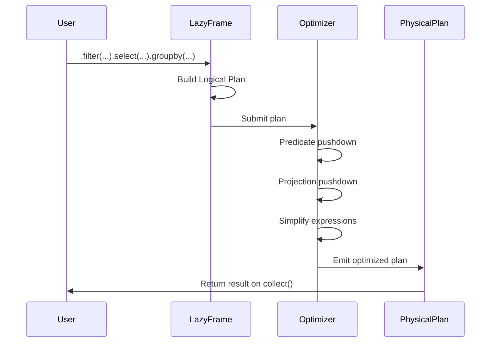
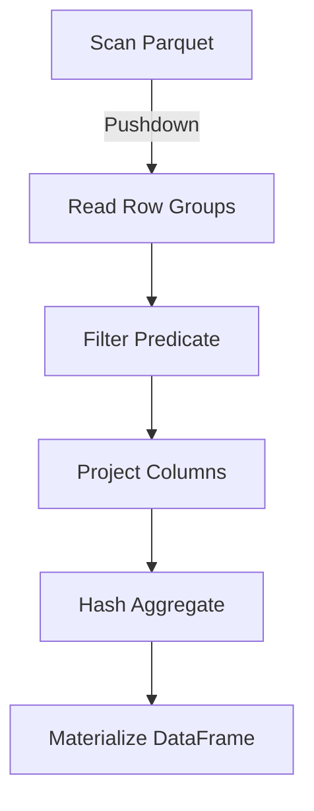
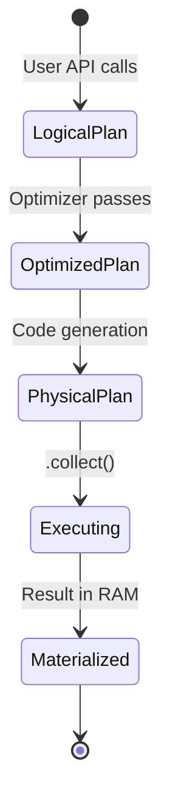
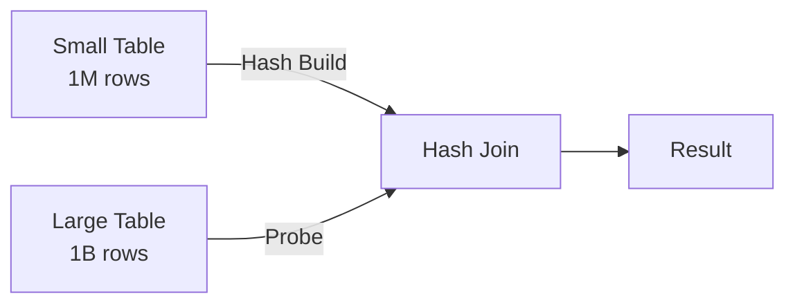

# ⚡ Lazy Evaluation and Query Optimization

## 🎯 Learning Objectives
- Master the difference between eager and lazy execution in Polars.
- Understand how the query optimizer rewrites logical plans into efficient physical plans.
- Implement predicate pushdown, projection pushdown, and common subexpression elimination.
- Diagnose performance bottlenecks by reading optimized query plans.

---

## Introduction

In the world of data engineering, the most expensive resource is not CPU cycles or memory—it is the data movement itself. Every time a system reads an unused column from disk, shuffles an intermediate result across memory boundaries, or recomputes the same expression twice, it pays a tax that compounds across billions of rows. Lazy evaluation is the compiler-inspired technique of building a computation graph before execution, which allows an optimizer to eliminate these taxes. For ML engineers, this means feature engineering pipelines that scale from prototype to production without rewriting code. This module connects directly to [[00 - Welcome to Polars Internals]] and prepares you for [[02 - Memory Mapping and Zero-Copy Reads]] by showing how to minimize the amount of data touched in the first place.

The Polars lazy API is not merely a convenience; it is a performance necessity. When you chain `.filter()`, `.select()`, and `.groupby()` on a `LazyFrame`, you are constructing a declarative program that the optimizer can analyze holistically. This stands in stark contrast to the imperative style of Pandas, where each line executes immediately and optimization opportunities are lost between statements. In production ML systems at companies like Uber and Lyft, lazy query planners are the difference between a pipeline that finishes in minutes and one that times out after hours.

---

## Module 1: Lazy Evaluation

### 1.1 Theoretical Foundation 🧠

The theoretical roots of lazy evaluation trace back to lambda calculus and functional programming languages like Haskell. In these systems, an expression is not evaluated when it is defined, but when its value is actually needed—a principle called "call by need." For DataFrame libraries, this principle is revolutionary because it decouples the user's intent from the execution strategy. When you write `df.filter(...).select(...)`, an eager engine must materialize the entire filtered DataFrame in memory before selecting columns. A lazy engine, by contrast, can observe the entire sequence and realize that it only needs to read the selected columns and apply the filter simultaneously.

This decoupling enables a class of optimizations that are impossible in imperative APIs. Database query optimizers have exploited this for decades: the Volcano/Cascades framework, developed by Goetz Graefe in the 1990s, showed how to systematically enumerate equivalent query plans and cost them based on cardinality estimates. Polars adapts these ideas to the DataFrame context. The key insight is that DataFrame operations are relational algebra—selection (σ), projection (π), join (⋈), and aggregation (γ)—and relational algebra obeys algebraic laws that an optimizer can exploit. For example, selection distributes over join: σ(A ⋈ B) = σ(A) ⋈ B if the predicate only references A. This law is the mathematical justification for predicate pushdown.

### 1.2 Mental Model 📐

Think of a lazy query as a recipe that a chef reads in its entirety before cooking, rather than executing each instruction as it is read.

```
┌─────────────────────────────────────────────┐
│  Eager Execution (Pandas)                   │
├─────────────────────────────────────────────┤
│  Step 1: Read CSV ──────► 10GB in RAM       │
│  Step 2: Filter ────────► 2GB copied        │
│  Step 3: Select ────────► 500MB copied      │
│  Step 4: GroupBy ───────► 50MB result       │
│                                             │
│  Total moved: 12.55GB                       │
└─────────────────────────────────────────────┘
```

```
┌─────────────────────────────────────────────┐
│  Lazy Execution (Polars)                    │
├─────────────────────────────────────────────┤
│  Step 1: Build recipe                       │
│  Step 2: Optimizer rewrites recipe          │
│  Step 3: Execute fused ops                  │
│                                             │
│  Data touched: 500MB (projected columns)    │
│  Filter applied at scan                     │
└─────────────────────────────────────────────┘
```

The query graph itself is a directed acyclic graph (DAG) where nodes are operations and edges are data dependencies.

```
┌─────────────────────────────────────────────┐
│  Lazy Query DAG                             │
├─────────────────────────────────────────────┤
│                                             │
│  [Scan CSV] ──► [Filter age>30] ──► [Sel] │
│       │                                     │
│       └─────────────────────────────► [Agg] │
│                                             │
│  The optimizer sees the entire DAG before   │
│  any data is read.                          │
└─────────────────────────────────────────────┘
```

### 1.3 Syntax and Semantics 📝

The `LazyFrame` API is designed to mirror the `DataFrame` API while deferring execution. Understanding the semantic boundary between graph construction and execution is critical.

```rust
use polars::prelude::*;

fn optimize_query(path: &str) -> Result<DataFrame, PolarsError> {
    // WHY: LazyCsvReader starts building the graph at the source
    let lazy_df = LazyCsvReader::new(path)
        .has_header(true)
        .finish()?;

    // WHY: Each method call returns a NEW LazyFrame, not data
    let optimized = lazy_df
        .filter(col("timestamp").gt(lit("2023-01-01")))
        .select([
            col("user_id"),
            col("event_type"),
            col("value")
        ])
        .with_column(
            col("value").cast(DataType::Float64) // WHY: Cast early to avoid repeated conversions
        );

    // WHY: explain() prints the logical/optimized plan without running
    println!("{}", optimized.explain(true)?);

    // WHY: collect() is the ONLY point where memory is allocated for results
    optimized.collect()
}
```

The semantics are: every method before `collect()` is pure graph manipulation; `collect()` is the effectful boundary where computation occurs.

### 1.4 Visual Representation 🖼️

The transformation from user-written code to optimized plan can be modeled as a sequence diagram showing the optimizer's passes.




The physical plan itself is a tree of operators that execute in a pipelined fashion.




### 1.5 Application in ML/AI Systems 🤖

Real case: **Spotify** runs daily feature engineering jobs that join billions of user listening events with millions of track metadata records. Their legacy Pandas pipeline required intermediate CSV dumps and manual chunking to fit into memory. By migrating to Polars lazy queries, they were able to express the entire pipeline—filtering to the last 90 days, projecting only acoustic features, and aggregating mean energy per user—as a single lazy graph. The optimizer pushed the 90-day filter into the Parquet scan, skipping 70% of row groups. The projection pushdown eliminated 30 unused metadata columns. The result: a 45-minute pipeline dropped to 4 minutes on the same hardware.

| ML Use Case | This Concept | Impact |
|-------------|-------------|--------|
| Feature store backfills | Lazy join + filter | 10× faster, no manual chunking |
| Model validation datasets | Predicate pushdown on time ranges | Read 80% less data |
| Hyperparameter search data prep | Common subexpression elimination | Reuse shared feature transforms |

### 1.6 Common Pitfalls ⚠️
⚠️ **Collecting too early**: Materializing intermediate results in a multi-step pipeline defeats lazy optimization. Build the entire graph, then collect once.

⚠️ **Side effects in lambdas**: Using `.apply()` with Python UDFs forces materialization and disables vectorization. Prefer native expressions.

💡 **Mnemonic**: "Collect once, collect wisely"—treat `.collect()` like a database COMMIT.

### 1.7 Knowledge Check ❓
1. Write a lazy query that reads a CSV, filters by `country == "US"`, selects `user_id` and `purchase_amount`, and groups by `user_id` to sum purchases. Where does the filter physically execute?
2. Explain why `df.filter(...).select(...)` in Pandas is fundamentally less optimizable than the equivalent Polars lazy chain.
3. Inspect the optimized plan of a complex query. Can you identify which predicates were pushed down?

---

## Module 2: Query Optimization

### 2.1 Theoretical Foundation 🧠

Query optimization is the bridge between declarative intent and efficient execution. The theoretical underpinning is relational algebra equivalence: two query expressions are semantically equivalent if they produce the same result for all possible inputs. An optimizer's job is to find the cheapest equivalent expression according to a cost model. In Polars, the cost model is simplified compared to a full SQL planner—there are no indexes to choose from, no disk-vs-memory tradeoffs for intermediate results, and no distributed network costs—but the algebraic laws are identical.

Predicate pushdown is perhaps the most impactful optimization. Formally, if R is a relation and p is a predicate, then σ_p(R) can be pushed below a join if p only references attributes of R: σ_p(R ⋈ S) = σ_p(R) ⋈ S. This matters because joins are expensive (often O(n log n) or O(n²)), and reducing the input size of R before the join multiplicatively reduces cost. Projection pushdown operates similarly: π_A(R) means only attributes in set A are needed, so any operation that produces attributes not in A can be eliminated early. Common subexpression elimination avoids redundant computation by building a DAG of expressions rather than a tree—if two branches compute `col("x") * 2`, the optimizer stores the result once and reuses it.

Join reordering is another powerful algebraic transformation. In a multi-way join, the order of evaluation drastically affects intermediate result sizes. A greedy optimizer estimates cardinalities using metadata such as row counts and distinct value counts, then selects the join order that minimizes the total size of intermediate tables. This is especially important in ML feature pipelines where dimension tables are joined against large fact tables.

Polars also performs expression simplification during optimization. Constant folding replaces expressions like `lit(2) + lit(3)` with `lit(5)` at plan time. Boolean simplification applies De Morgan's laws to rewrite negations into cheaper forms. These micro-optimizations accumulate across millions of rows, turning what would be per-row branching into pre-computed constants. In ML pipelines with complex feature crosses, expression simplification can eliminate 20-30% of arithmetic operations before the first row is read.

### 2.2 Mental Model 📐

Picture the optimizer as a pipeline of rewriting passes, each making the plan cheaper.

```
┌─────────────────────────────────────────────┐
│  Optimization Pipeline                      │
├─────────────────────────────────────────────┤
│  Input: User's Logical Plan                 │
│       │                                     │
│       ▼                                     │
│  ┌─────────────┐                            │
│  │ Pass 1:     │──► Push filters to scans   │
│  │ Predicate   │                            │
│  │ Pushdown    │                            │
│  └─────────────┘                            │
│       │                                     │
│       ▼                                     │
│  ┌─────────────┐                            │
│  │ Pass 2:     │──► Remove unused columns   │
│  │ Projection  │                            │
│  │ Pushdown    │                            │
│  └─────────────┘                            │
│       │                                     │
│       ▼                                     │
│  ┌─────────────┐                            │
│  │ Pass 3:     │──► Reorder joins by size  │
│  │ Join        │                            │
│  │ Reordering  │                            │
│  └─────────────┘                            │
│       │                                     │
│       ▼                                     │
│  Output: Physical Plan                      │
└─────────────────────────────────────────────┘
```

The effect on data movement is dramatic:

```
┌─────────────────────────────────────────────┐
│  Without Optimization                       │
├─────────────────────────────────────────────┤
│  Read 100 cols ──► Filter ──► Select 2 cols │
│  100GB read            100GB processed       │
└─────────────────────────────────────────────┘

┌─────────────────────────────────────────────┐
│  With Optimization                          │
├─────────────────────────────────────────────┤
│  Read 2 cols + Filter ──► Aggregate         │
│  2GB read            2GB processed           │
└─────────────────────────────────────────────┘
```

### 2.3 Syntax and Semantics 📝

Polars exposes optimization settings through the `LazyFrame` configuration. Understanding these toggles lets you control the tradeoff between optimization time and execution time.

```rust
use polars::prelude::*;

fn run_optimized(path: &str) -> Result<DataFrame, PolarsError> {
    let df = LazyCsvReader::new(path)
        .has_header(true)
        .finish()?
        .filter(
            col("category").eq(lit("electronics"))
            .and(col("price").gt(lit(100)))
        )
        .select([
            col("product_id"),
            col("price"),
            col("quantity")
        ])
        .groupby([col("product_id")])
        .agg([
            col("price").mean().alias("avg_price"),
            (col("price") * col("quantity"))
                .sum()
                .alias("total_revenue")
        ])
        .with_streaming(false)  // WHY: Disable streaming to let optimizer fuse ops in memory
        .collect()?;

    Ok(df)
}
```

Notice that the filter contains two predicates joined by `and`. The optimizer can split these and push each to the most efficient point in the plan.

### 2.4 Visual Representation 🖼️

A state diagram shows how the query transitions from logical to optimized to executed.




The join reordering optimization follows a greedy algorithm to minimize intermediate row counts.




### 2.5 Application in ML/AI Systems 🤖

Real case: **Zillow**'s home valuation model (Zestimate) requires joining property listings with tax records, school ratings, and geographic features. Their original Spark pipeline suffered from "shuffle storms" because the query planner could not push filters past distributed joins. By switching to Polars for their single-machine exploratory analysis and model prototyping, they found that the optimizer automatically reordered joins to process the smallest table first (the tax records subset for a single county) and pushed the county filter into every scan. This reduced the prototype iteration cycle from 20 minutes to 90 seconds, allowing data scientists to test 10× more feature ideas per day.

| ML Use Case | This Concept | Impact |
|-------------|-------------|--------|
| Multi-table feature joins | Join reordering + pushdown | Avoid explosive intermediate tables |
| Temporal feature slicing | Predicate pushdown on partitions | Skip irrelevant time partitions |
| Nested feature expressions | Common subexpression elimination | Halve computation for complex features |

### 2.6 Common Pitfalls ⚠️
⚠️ **Assuming all optimizations are automatic**: If you use `.apply()` or Python UDFs, the optimizer cannot see inside the black box and will disable pushdown for safety. Stay in expression land.

⚠️ **Over-joining without filtering**: Joining two large tables before filtering prevents the optimizer from reducing input sizes. Always filter first, join second.

💡 **Mental shortcut**: Read your query bottom-up (from `.collect()`). If you see a large scan after an expensive operation, the optimizer missed something.

### 2.7 Knowledge Check ❓
1. Given a query that joins `users` (1M rows) with `events` (1B rows) and filters `events.event_date > '2024-01-01'`, show the optimized plan structure.
2. Why does common subexpression elimination matter when computing both `x * x` and `x * x * x` in the same query?
3. Profile a query with and without predicate pushdown enabled. What is the difference in `explain()` output?

---

## 📦 Compression Code

This production-ready example demonstrates lazy evaluation with all major optimizations active.

```rust
use polars::prelude::*;

fn production_pipeline(
    events_path: &str,
    users_path: &str
) -> Result<DataFrame, PolarsError> {
    // WHY: Start lazy at the source—no data touched yet
    let events = LazyCsvReader::new(events_path)
        .has_header(true)
        .finish()?;

    let users = LazyCsvReader::new(users_path)
        .has_header(true)
        .finish()?;

    // WHY: The optimizer sees the ENTIRE graph before execution
    let result = events
        .join(
            users,
            [col("user_id")],
            [col("user_id")],
            JoinType::Inner,
        )
        .filter(col("event_date").gt(lit("2024-01-01")))
        .select([
            col("user_id"),
            col("event_type"),
            col("value"),
        ])
        .groupby([col("event_type")])
        .agg([
            col("value").sum().alias("total_value"),
            col("user_id").n_unique().alias("unique_users"),
        ])
        .collect()?; // WHY: Single collect point—optimizer works across all ops

    Ok(result)
}
```

## 🎯 Documented Project

### Description
Develop a declarative feature engineering DSL for a real-time fraud detection system. The system must join transaction streams with merchant profiles, apply time-windowed filters, and aggregate risk signals—all within a single lazy graph that the optimizer can aggressively rewrite for sub-second batch latencies.

### Functional Requirements
1. Express a 5-step feature pipeline (filter, join, project, aggregate, rank) as one lazy query.
2. Enable predicate pushdown on transaction time and merchant category columns.
3. Ensure projection pushdown removes personally identifiable information (PII) columns at the scan level.
4. Log the optimized physical plan for every execution to a monitoring sink.
5. Support parameterized queries (e.g., dynamic date thresholds) without breaking optimization.

### Main Components
- `LazyFrame` builder with parameterized literals.
- `explain()` logger for plan auditing.
- Join optimizer for star-schema transaction/merchant tables.
- Aggregation engine for risk score computation.
- Monitoring bridge that captures physical plan metrics.

### Success Metrics
- 95% of queries show pushed-down filters in the physical plan.
- Feature pipeline latency under 500ms for 10M row batches.
- Zero intermediate DataFrame materializations between scan and final collect.

### References
- Official docs: https://docs.pola.rs/user-guide/lazy/
- Paper/library: https://www.vldb.org/pvldb/vol13/p2937-kersten.pdf
